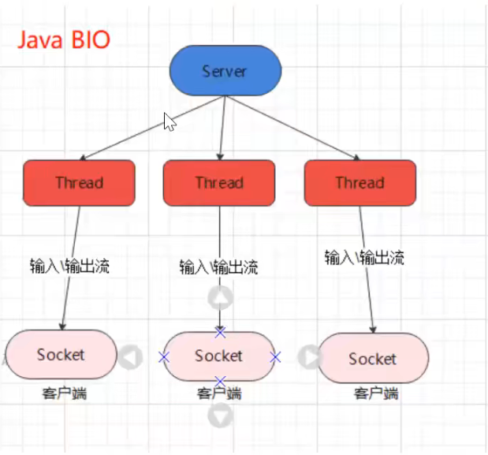
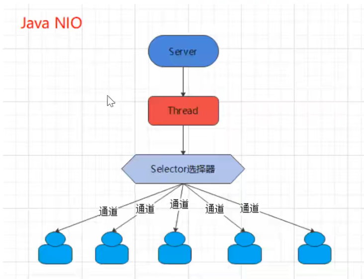
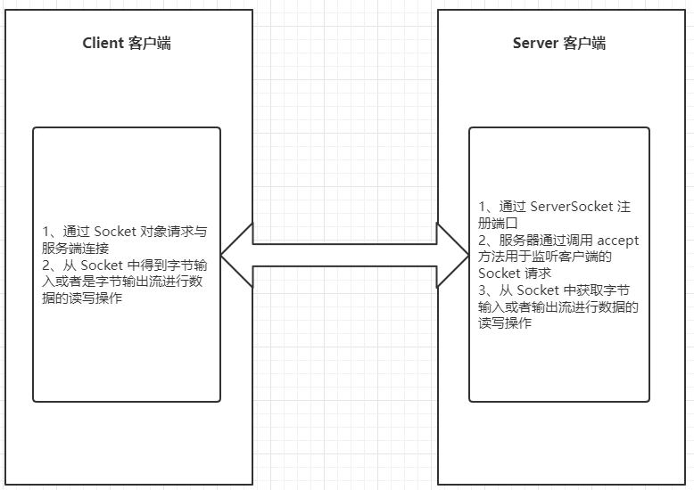
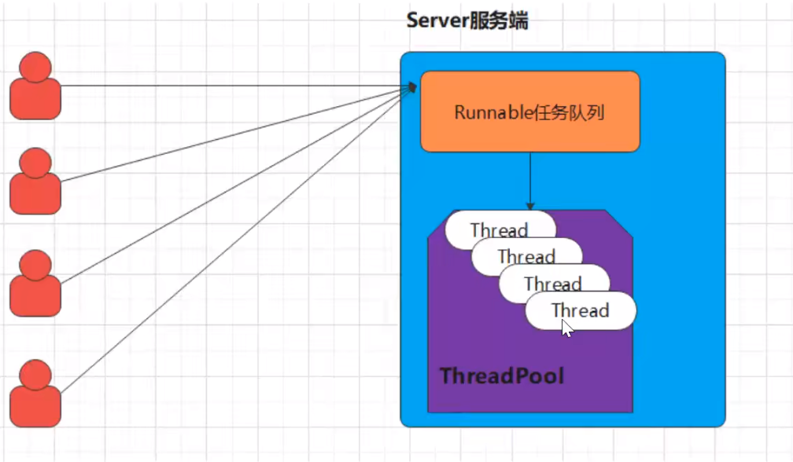
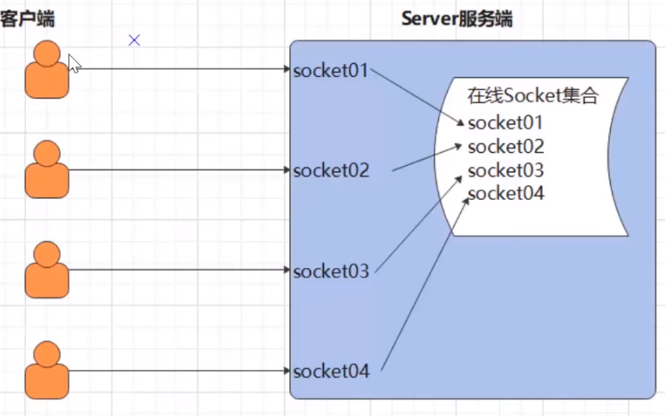

# 第1章_IO模型入门

## 1.简介

### 1.1 I/O模型

I/O 模型：就是用什么样的通道或者说是通信模式和架构进行数据的传输和接收，很大程度上决定了程序通信的性能，Java 共支持 3 种网络编程的/IO 模型：**BIO、NIO、AIO**
实际通信需求下，要根据不同的业务场景和性能需求决定选择不同的 I/O 模型。

#### 1.BIO

同步并阻塞（传统阻塞型），服务器实现模式为一个连接一个线程，即客户端有连接请求时服务器端就需要启动一个线程进行处理，如果这个连接不做任何事情会造成不必要的线程开销



#### 2.NIO

同步非阻塞，服务器实现模式为一个线程处理多个请求（连接），即客户端发送的连接请求都会注册到多路复用器（选择器）上，多路复用器轮询到连接有 I/O 请求就进行处理



####  3.AIO

Java AIO(NIO.2)：异步异步非阻塞，服务器实现模式为一个有效请求一个线程，客户端的 I/O 请求都是由 OS 先完成了再通知服务器应用去启动线程进行处理，一般适用于连接数较
多且连接时间较长的应用

### 1.2 BIO、NIO、AIO 适用场景分析

- **BIO**方式适用于连接数目比较小且固定的架构，这种方式对服务器资源要求比较高，并发局限于应用中，JDK1.4 以前的唯一选择，但程序简单易理解
- **NIO**方式适用于连接数目多且连接比较短（轻操作）的架构，比如聊天服务器，弹幕系统，服务器间通讯等，编程比较复杂，JDK1.4 开始支持
- **AIO**方式使用于连接数目多且连接比较长（重操作）的架构，比如相册服务器，充分调用 OS 参与并发操作，编程比较复杂，JDK7 开始支持

## 2.BIO基本介绍

* Java BIO 就是传统的 java io 编程，其相关的类和接口在 java.io
* BIO（blocking I/O）： 同步阻塞，服务器实现模式为一个连接一个线程，即客户端有连接请求时服务器端就需要启动一个线程进行处理，如果这个连接不做任何事情会造成不必要的线程开销，可以通过线程池机制改善（实现多个客户连接服务器）

### 2.1 工作机制



**对 BIO  编程流程的梳理**

1) 服务器端启动一个 **ServerSocket**，注册端口，调用 accpet 方法监听客户端的 Socket 连接
2) 客户端启动 **Socket** 对服务器进行通信，默认情况下服务器端需要对每个客户建立一个线程与之通讯

### 2.2 传统的BIO编程实例

> 网络编程的基本模型是`Client/Server`模型，也就是两个进程之间进行相互通信，其中服务端提供位置信（绑定 IP 地址和端口），客户端通过连接操作向服务端监听的端口地址发起连接请求，基于 TCP 协议下进行三次握手连接，连接成功后，双方通过网络套接字（Socket）进行通信。
>
> 传统的同步阻塞模型开发中，服务端 ServerSocket 负责绑定 IP 地址，启动监听端口；客户端 Socket 负责发起连接操作。连接成功后，双方通过输入和输出流进行同步阻塞式通信。 基于 BIO 模式下的通信，客户端 - 服务端是完全同步，完全耦合的。	  

**客户端案例如下**

```java
package com.itheima._02bio01;

import java.io.OutputStream;
import java.io.PrintStream;
import java.net.Socket;
/**
    目标: Socket网络编程。

    Java提供了一个包：java.net下的类都是用于网络通信。
    Java提供了基于套接字（端口）Socket的网络通信模式，我们基于这种模式就可以直接实现TCP通信。
    只要用Socket通信，那么就是基于TCP可靠传输通信。

    功能1：客户端发送一个消息，服务端接口一个消息，通信结束！！

    创建客户端对象：
        （1）创建一个Socket的通信管道，请求与服务端的端口连接。
        （2）从Socket管道中得到一个字节输出流。
        （3）把字节流改装成自己需要的流进行数据的发送
    创建服务端对象：
        （1）注册端口
        （2）开始等待接收客户端的连接,得到一个端到端的Socket管道
        （3）从Socket管道中得到一个字节输入流。
        （4）把字节输入流包装成自己需要的流进行数据的读取。

    Socket的使用：
        构造器：public Socket(String host, int port)
        方法：  public OutputStream getOutputStream()：获取字节输出流
               public InputStream getInputStream() :获取字节输入流

    ServerSocket的使用：
        构造器：public ServerSocket(int port)
 */
public class ClientDemo {
    public static void main(String[] args) throws Exception {
        System.out.println("==客户端的启动==");
        // （1）创建一个Socket的通信管道，请求与服务端的端口连接。
        Socket socket = new Socket("127.0.0.1",8888);
        // （2）从Socket通信管道中得到一个字节输出流。
        OutputStream os = socket.getOutputStream();
        // （3）把字节流改装成自己需要的流进行数据的发送
        PrintStream ps = new PrintStream(os);
        // （4）开始发送消息
        ps.println("我是客户端，我想约你吃小龙虾！！！");
        ps.flush();
    }
}
```

**服务端案例如下**

```java
package com.itheima._02bio01;

import java.io.BufferedReader;
import java.io.InputStream;
import java.io.InputStreamReader;
import java.net.ServerSocket;
import java.net.Socket;

/**
 * 服务端
 */
public class ServerDemo {
    public static void main(String[] args) throws Exception {
        System.out.println("==服务器的启动==");
        // （1）注册端口
        ServerSocket serverSocket = new ServerSocket(8888);
        //（2）开始在这里暂停等待接收客户端的连接,得到一个端到端的Socket管道
        Socket socket = serverSocket.accept();
        //（3）从Socket管道中得到一个字节输入流。
        InputStream is = socket.getInputStream();
        //（4）把字节输入流包装成自己需要的流进行数据的读取。
        BufferedReader br = new BufferedReader(new InputStreamReader(is));
        //（5）读取数据
        String line;
        while((line = br.readLine())!=null){
            System.out.println("服务端收到："+line);
        }
    }
}
```

**小结**

* 在以上通信中，服务端会一致等待客户端的消息，如果客户端没有进行消息的发送，服务端将一直进入阻塞状态。
* 同时服务端是按照行获取消息的，这意味着客户端也必须按照行进行消息的发送，否则服务端将进入等待消息的阻塞状态！

### 2.3 多发和多收消息

在上一个案例中，**只能实现客户端发送消息，服务端接收消息**，并不能实现反复的收消息和反复的发消息，我们只需要在客户端案例中，加上反复按照行发送消息的逻辑即可！案例代码如下：

**客户端代码如下**

```java
package com.itheima._03bio02;

import java.io.OutputStream;
import java.io.PrintStream;
import java.net.Socket;
import java.util.Scanner;

/**
    目标: Socket网络编程。
    功能1：客户端可以反复发消息，服务端可以反复收消息
 */
public class ClientDemo {
    public static void main(String[] args) throws Exception {
        System.out.println("==客户端的启动==");
        // （1）创建一个Socket的通信管道，请求与服务端的端口连接。
        Socket socket = new Socket("127.0.0.1",8888);
        // （2）从Socket通信管道中得到一个字节输出流。
        OutputStream os = socket.getOutputStream();
        // （3）把字节流改装成自己需要的流进行数据的发送
        PrintStream ps = new PrintStream(os);
        // （4）开始发送消息
        Scanner sc = new Scanner(System.in);
        while(true){
            System.out.print("请说:");
            String msg = sc.nextLine();
            ps.println(msg);
            ps.flush();
        }
    }
}
```

**服务端代码如下**

```java
package com.itheima._03bio02;

import java.io.BufferedReader;
import java.io.InputStream;
import java.io.InputStreamReader;
import java.net.ServerSocket;
import java.net.Socket;

/**
 * 服务端
 */
public class ServerDemo {
    public static void main(String[] args) throws Exception {
        String s = "886";
        System.out.println("886".equals(s));
        System.out.println("==服务器的启动==");
        //（1）注册端口
        ServerSocket serverSocket = new ServerSocket(8888);
        //（2）开始在这里暂停等待接收客户端的连接,得到一个端到端的Socket管道
        Socket socket = serverSocket.accept();
        //（3）从Socket管道中得到一个字节输入流。
        InputStream is = socket.getInputStream();
        //（4）把字节输入流包装成自己需要的流进行数据的读取。
        BufferedReader br = new BufferedReader(new InputStreamReader(is));
        //（5）读取数据
        String line ;
        while((line = br.readLine())!=null){
            System.out.println("服务端收到："+line);
        }
    }
}
```

**小结**

* 本案例中确实可以实现客户端多发多收
* 但是服务端只能处理一个客户端的请求，因为服务端是单线程的。一次只能与一个客户端进行消息通信。

### 2.4 接收多个客户端 

在上述的案例中，一个服务端只能接收一个客户端的通信请求，**那么如果服务端需要处理很多个客户端的消息通信请求应该如何处理呢**，此时我们就需要在服务端引入线程了，也就是说客户端每发起一个请求，服务端就创建一个新的线程来处理这个客户端的请求，这样就实现了一个客户端一个线程的模型。

**客户端案例代码如下**

```java
/**
    目标: Socket网络编程。
    功能1：客户端可以反复发，一个服务端可以接收无数个客户端的消息！！
 */
public class ClientDemo {
    public static void main(String[] args) throws Exception {
        System.out.println("==客户端的启动==");
        // （1）创建一个Socket的通信管道，请求与服务端的端口连接。
        Socket socket = new Socket("127.0.0.1",7777);
        // （2）从Socket通信管道中得到一个字节输出流。
        OutputStream os = socket.getOutputStream();
        // （3）把字节流改装成自己需要的流进行数据的发送
        PrintStream ps = new PrintStream(os);
        // （4）开始发送消息
        Scanner sc = new Scanner(System.in);
        while(true){
            System.out.print("请说:");
            String msg = sc.nextLine();
            ps.println(msg);
            ps.flush();
        }
    }
}
```

**服务端案例代码如下**

```java
/**
    服务端
 */
public class ServerDemo {
    public static void main(String[] args) throws Exception {
        System.out.println("==服务器的启动==");
        // （1）注册端口
        ServerSocket serverSocket = new ServerSocket(7777);
        while(true){
            //（2）开始在这里暂停等待接收客户端的连接,得到一个端到端的Socket管道
            Socket socket = serverSocket.accept();
            new ServerReadThread(socket).start();
            System.out.println(socket.getRemoteSocketAddress()+"上线了！");
        }
    }
}

class ServerReadThread extends Thread{
    private Socket socket;

    public ServerReadThread(Socket socket){
        this.socket = socket;
    }

    @Override
    public void run() {
        try{
            //（3）从Socket管道中得到一个字节输入流。
            InputStream is = socket.getInputStream();
            //（4）把字节输入流包装成自己需要的流进行数据的读取。
            BufferedReader br = new BufferedReader(new InputStreamReader(is));
            //（5）读取数据
            String line ;
            while((line = br.readLine())!=null){
                System.out.println("服务端收到："+socket.getRemoteSocketAddress()+":"+line);
            }
        }catch (Exception e){
            System.out.println(socket.getRemoteSocketAddress()+"下线了！");
        }
    }
}
```

**小结**

* 1.每个 Socket 接收到，都会创建一个线程，线程的竞争、切换上下文影响性能
* 2.每个线程都会占用栈空间和 CPU 资源
* 3.并不是每个 socket 都进行IO操作，无意义的线程处理
* 4.客户端的并发访问增加时。服务端将呈现 1:1 的线程开销，访问量越大，系统将发生线程栈溢出，线程创建失败，最终导致进程宕机或者僵死，从而不能对外提供服务

### 2.5 伪异步I/O编程

在上述案例中：客户端的并发访问增加时。服务端将呈现 1:1 的线程开销，访问量越大，系统将发生线程栈溢出，线程创建失败，最终导致进程宕机或者僵死，从而不能对外提供服务。

接下来我们采用一个伪异步 I/O 的通信框架，采用线程池和任务队列实现，当客户端接入时，将客户端的 Socket 封装成一个 Task（该任务实现`java.lang.Runnable`线程任务接口）交给后端的线程池中进行处理。JDK 的线程池维护一个消息队列和 N 个活跃的线程，对消息队列中 Socket 任务进行处理，由于线程池可以设置消息队列的大小和最大线程数，因此，它的资源占用是可控的，无论多少个客户端并发访问，都不会导致资源的耗尽和宕机。

图示如下：



**客户端源码分析**

```java
public class Client {
   public static void main(String[] args) {
      try {
         // 1.简历一个与服务端的Socket对象：套接字
         Socket socket = new Socket("127.0.0.1", 9999);
         // 2.从socket管道中获取一个输出流，写数据给服务端 
         OutputStream os = socket.getOutputStream() ;
         // 3.把输出流包装成一个打印流 
         PrintWriter pw = new PrintWriter(os);
         // 4.反复接收用户的输入 
         BufferedReader br = new BufferedReader(new InputStreamReader(System.in));
         String line = null ;
         while((line = br.readLine()) != null){
            pw.println(line);
            pw.flush();
         }
      } catch (Exception e) {
         e.printStackTrace();
      }
   }
}
```

**线程池处理类**

```java
// 线程池处理类
public class HandlerSocketThreadPool {
   
   // 线程池 
   private ExecutorService executor;
   
   public HandlerSocketThreadPool(int maxPoolSize, int queueSize){
      
      this.executor = new ThreadPoolExecutor(
            3, // 8
            maxPoolSize,  
            120L, 
            TimeUnit.SECONDS,
            new ArrayBlockingQueue<Runnable>(queueSize) );
   }
   
   public void execute(Runnable task){
      this.executor.execute(task);
   }
}
```

**服务端源码分析**

```java
public class Server {
   public static void main(String[] args) {
      try {
         System.out.println("----------服务端启动成功------------");
         ServerSocket ss = new ServerSocket(9999);

         // 一个服务端只需要对应一个线程池
         HandlerSocketThreadPool handlerSocketThreadPool = new HandlerSocketThreadPool(3, 1000);

         // 客户端可能有很多个
         while(true){
            Socket socket = ss.accept() ; // 阻塞式的！
            System.out.println("有人上线了！！");
            // 每次收到一个客户端的 socket 请求，都需要为这个客户端分配一个
            // 独立的线程 专门负责对这个客户端的通信！！
            handlerSocketThreadPool.execute(new ReaderClientRunnable(socket));
         }

      } catch (Exception e) {
         e.printStackTrace();
      }
   }

}
class ReaderClientRunnable implements Runnable{

   private Socket socket ;

   public ReaderClientRunnable(Socket socket) {
      this.socket = socket;
   }

   @Override
   public void run() {
      try {
         // 读取一行数据
         InputStream is = socket.getInputStream();
         // 转成一个缓冲字符流
         Reader fr = new InputStreamReader(is);
         BufferedReader br = new BufferedReader(fr);
         // 一行一行的读取数据
         String line = null ;
         while((line = br.readLine())!=null){ // 阻塞式的！！
            System.out.println("服务端收到了数据："+line);
         }
      } catch (Exception e) {
         System.out.println("有人下线了");
      }

   }
}
```

小结

* 伪异步 io 采用了线程池实现，因此避免了为每个请求创建一个独立线程造成线程资源耗尽的问题，但由于底层依然是采用的同步阻塞模型，因此无法从根本上解决问题
* 如果单个消息处理的缓慢，或者服务器线程池中的全部线程都被阻塞，那么后续 socket 的 i/o 消息都将在队列中排队。新的 Socket 请求将被拒绝，客户端会发生大量连接超时

### 2.6 文件上传

目标：支持任意类型文件形式的上传。

**客户端开发**

```java
package com.itheima.file;

import java.io.DataOutputStream;
import java.io.FileInputStream;
import java.io.InputStream;
import java.net.Socket;

/**
    目标：实现客户端上传任意类型的文件数据给服务端保存起来。

 */
public class Client {
    public static void main(String[] args) {
        try(
                InputStream is = new FileInputStream("C:\\Users\\dlei\\Desktop\\BIO,NIO,AIO\\文件\\java.png");
        ){
            //  1、请求与服务端的Socket链接
            Socket socket = new Socket("127.0.0.1" , 8888);
            //  2、把字节输出流包装成一个数据输出流
            DataOutputStream dos = new DataOutputStream(socket.getOutputStream());
            //  3、先发送上传文件的后缀给服务端
            dos.writeUTF(".png");
            //  4、把文件数据发送给服务端进行接收
            byte[] buffer = new byte[1024];
            int len;
            while((len = is.read(buffer)) > 0 ){
                dos.write(buffer , 0 , len);
            }
            dos.flush();
            socket.shutdownOutput(); // 通知服务端发送完毕
        }catch (Exception e){
            e.printStackTrace();
        }
    }
}
```

**服务端开发**

```java
package com.itheima.file;

import java.net.ServerSocket;
import java.net.Socket;

/**
    目标：服务端开发，可以实现接收客户端的任意类型文件，并保存到服务端磁盘。
 */
public class Server {
    public static void main(String[] args) {
        try{
            ServerSocket ss = new ServerSocket(8888);
            while (true){
                Socket socket = ss.accept();
                // 交给一个独立的线程来处理与这个客户端的文件通信需求
                new ServerReaderThread(socket).start();
            }
        }catch (Exception e){
            e.printStackTrace();
        }
    }
}
```

```java
package com.itheima.file;

import java.io.DataInputStream;
import java.io.FileOutputStream;
import java.io.OutputStream;
import java.net.Socket;
import java.util.UUID;

public class ServerReaderThread extends Thread {
    private Socket socket;
    public ServerReaderThread(Socket socket){
        this.socket = socket;
    }
    @Override
    public void run() {
        try{
            // 1、得到一个数据输入流读取客户端发送过来的数据
            DataInputStream dis = new DataInputStream(socket.getInputStream());
            // 2、读取客户端发送过来的文件类型
            String suffix = dis.readUTF();
            System.out.println("服务端已经成功接收到了文件类型：" + suffix);
            // 3、定义一个字节输出管道负责把客户端发来的文件数据写出去
            OutputStream os = new FileOutputStream("C:\\Users\\dlei\\Desktop\\BIO,NIO,AIO\\文件\\server\\"+
                    UUID.randomUUID().toString()+suffix);
            // 4、从数据输入流中读取文件数据，写出到字节输出流中去
            byte[] buffer = new byte[1024];
            int len;
            // 5、客户端正常关闭后 len = -1
            while((len = dis.read(buffer)) > 0){
                os.write(buffer,0, len);
            }
            os.close();
            System.out.println("服务端接收文件保存成功！");

        }catch (Exception e){
            e.printStackTrace();
        }
    }
}
```

**小结**

客户端怎么发，服务端就怎么接收

### 2.7 端口转发思想(聊天室)

需求：需要实现一个客户端的消息可以发送给所有的客户端去接收。（群聊实现）



**客户端开发**

```java
public class Client {
    public static void main(String[] args) {
        try {
            // 1.简历一个与服务端的Socket对象：套接字
            Socket socket = new Socket("127.0.0.1", 9999);
            // 2.从socket管道中获取一个输出流，写数据给服务端
            OutputStream os = socket.getOutputStream();
            BufferedReader br = new BufferedReader(new InputStreamReader(socket.getInputStream()));
            // 3.接收服务器的消息
            new Thread(
                    () -> {
                        try {
                            String msg;
                            while ((msg = br.readLine()) != null) {
                                System.out.println("来自其他用户的消息：" + msg);
                            }
                        } catch (Exception e) {
                            e.printStackTrace();
                        }
                    }
            ).start();
            // 4.把输出流包装成一个打印流
            PrintWriter pw = new PrintWriter(os);
            // 5.反复接收用户的输入
            BufferedReader brForUser = new BufferedReader(new InputStreamReader(System.in));
            String line = null ;
            while((line = brForUser.readLine()) != null){
                pw.println(line);
                pw.flush();
            }
        } catch (Exception e) {
            e.printStackTrace();
        }
    }
}
```

**服务端实现**

```java
/**
 * 目标：BIO 模式下的端口转发思想
 *
 * 服务端实现的需求：
 *   1、注册端口
 *   2、接收客户端的 socket 连接，交给一个独立的线程来处理
 *   3、把当前连接的客户端 socket 存入到一个所谓的在线 socket 集合中保存
 *   4、接收客户端的消息，然后推送给当前所有在线的 socket 接收
 */
public class Server {
    // 定义一个静态集合
    public static List<Socket> allSocketOnline = new CopyOnWriteArrayList<>();

    public static void main(String[] args) {
        try {
            ServerSocket ss = new ServerSocket(9999);
            while (true) {
                Socket socket = ss.accept();
                // 把登陆的客户端 socket 存入到一个在线集合中去
                allSocketOnline.add(socket);
                System.out.println(socket + "上线了");
                // 为当前登录成功的 socket 分配一个独立的线程来与之通信
                new Thread(new ServerReaderThread(socket)).start();
            }
        }catch (Exception e) {
            e.printStackTrace();
        }
    }
}
```

```java
public class ServerReaderThread implements Runnable{

    private Socket socket;

    public ServerReaderThread(Socket socket) {
        this.socket = socket;
    }

    @Override
    public void run() {
        try {
            BufferedReader br = new BufferedReader(new InputStreamReader(socket.getInputStream()));
            String msg;
            while ((msg = br.readLine()) != null) {
                // 服务端接收到了消息后需要推送给当前所有的在线 socket
                sendMsgToAllClient(msg);
            }

        }catch (Exception e) {
            System.out.println("当前有人下线");
            Server.allSocketOnline.remove(socket);
        }
    }

    /**
     * 把消息推送给所有在线的 socket
     * @param msg
     */
    private void sendMsgToAllClient(String msg) throws IOException {
        for (Socket socket : Server.allSocketOnline) {
            if (socket.equals(this.socket)) {
                continue;
            }
            PrintStream ps = new PrintStream(socket.getOutputStream());
            System.out.println("转发消息【"+ msg +"】给【"+ socket +"】");
            ps.println(msg);
            ps.flush();
        }
    }
}
```

### 2.8 基于BIO模式下即时通信

基于 BIO 模式下的即时通信，我们需要解决客户端到客户端的通信，也就是需要实现客户端与客户端的端口消息转发逻辑。

#### 1.功能清单简单说明

**1.客户端登陆功能**

* 可以启动客户端进行登录，客户端登陆只需要输入用户名和服务端ip地址即可。

**2.在线人数实时更新。**

* 客户端用户户登陆以后，需要同步更新所有客户端的联系人信息栏。

**3.离线人数更新**

* 检测到有客户端下线后，需要同步更新所有客户端的联系人信息栏。

**4.群聊**

* 任意一个客户端的消息，可以推送给当前所有客户端接收。

**5.私聊**

* 可以选择某个员工，点击私聊按钮，然后发出的消息可以被该客户端单独接收。

**6.@消息**

* 可以选择某个员工，然后发出的消息可以@该用户，但是其他所有人都能

**7.消息用户和消息时间点**

* 服务端可以实时记录该用户的消息时间点，然后进行消息的多路转发或者选择。

#### 2.项目启动与演示

**项目启动步骤：**

* 1.首先需要启动服务端，点击 ServerChat 类直接右键启动，显示服务端启动成功

* 2.其次，点击客户端类 ClientChat 类，在弹出的方框中输入服务端的 ip 和当前客户端的昵称

* 3.登陆进入后的聊天界面如下，即可进行相关操作

  * 如果直接点击发送，默认发送群聊消息

* 如果选中右侧在线列表某个用户，默认发送@消息

  * 如果选中右侧在线列表某个用户，然后选择右下侧私聊按钮默，认发送私聊消息


#### 3.服务端设计

##### 目标 

服务端需要接收多个客户端的接入。

##### 实现步骤

* 1.服务端需要接收多个客户端，目前我们采取的策略是一个客户端对应一个服务端线程。
* 2.服务端除了要注册端口以外，还需要为每个客户端分配一个独立线程处理与之通信。

##### 代码实现

服务端主体代码，主要进行端口注册，和接收客户端，分配线程处理该客户端请求。

```java
public class ServerChat {
    
    /** 定义一个集合存放所有在线的socket  */
	public static Map<Socket, String> onLineSockets = new HashMap<>();

   public static void main(String[] args) {
      try {
         /** 1.注册端口   */
         ServerSocket serverSocket = new ServerSocket(Constants.PORT);

         /** 2.循环一直等待所有可能的客户端连接 */
         while(true){
            Socket socket = serverSocket.accept();
            /**3. 把客户端的socket管道单独配置一个线程来处理 */
            new ServerReader(socket).start();
         }
      } catch (Exception e) {
         e.printStackTrace();
      }
   }
}
```

服务端分配的独立线程类负责处理该客户端 Socket 的管道请求。

```java
class ServerReader extends Thread {
   private Socket socket;
   public ServerReader(Socket socket) {
      this.socket = socket;
   }
   @Override
   public void run() {
      try {
       
      } catch (Exception e) {
            e.printStackTrace();
      }
   }
}
```

常量包负责做端口配置

```java
public class Constants {
   /** 常量 */
   public static final int PORT = 7778 ;

}
```

我们实现了服务端可以接收多个客户端，然后服务端可以接收多个客户端连接，接下来我们要接收客户端的登陆消息

* 需要在服务端处理客户端的线程的登陆消息
* 需要注意的是，服务端需要接收客户端的消息可能有很多种
  * 分别是登陆消息，群聊消息，私聊消息 和@消息
  * 这里需要约定如果客户端发送消息之前需要先发送消息的类型，类型我们使用信号值标志（1，2，3）
    * 1代表接收的是登陆消息
    * 2代表群发| @消息
    * 3代表了私聊消息
* 服务端的线程中有异常校验机制，一旦发现客户端下线会在异常机制中处理，然后移除当前客户端用户，把最新的用户列表发回给全部客户端进行在线人数更新

```java
public class ServerReader extends Thread {
	private Socket socket;
	public ServerReader(Socket socket) {
		this.socket = socket;
	}

	@Override
	public void run() {
		DataInputStream dis = null;
		try {
			dis = new DataInputStream(socket.getInputStream());
			/** 1.循环一直等待客户端的消息 */
			while(true){
				/** 2.读取当前的消息类型 ：登录,群发,私聊 , @消息 */
				int flag = dis.readInt();
				if(flag == 1){
					/** 先将当前登录的客户端socket存到在线人数的socket集合中   */
					String name = dis.readUTF() ;
					System.out.println(name+"---->"+socket.getRemoteSocketAddress());
					ServerChat.onLineSockets.put(socket, name);
				}
				writeMsg(flag,dis);
			}
		} catch (Exception e) {
			System.out.println("--有人下线了--");
			// 从在线人数中将当前socket移出去  
			ServerChat.onLineSockets.remove(socket);
			try {
				// 从新更新在线人数并发给所有客户端 
				writeMsg(1,dis);
			} catch (Exception e1) {
				e1.printStackTrace();
			}
		}

	}

	private void writeMsg(int flag, DataInputStream dis) throws Exception {
        // DataOutputStream dos = new DataOutputStream(socket.getOutputStream()); 
		// 定义一个变量存放最终的消息形式 
		String msg = null ;
		if(flag == 1){
			/** 读取所有在线人数发给所有客户端去更新自己的在线人数列表 */
			/** onlineNames = [波仔,zhangsan,波妞]*/
			StringBuilder rs = new StringBuilder();
			Collection<String> onlineNames = ServerChat.onLineSockets.values();
			// 判断是否存在在线人数 
			if(onlineNames != null && onlineNames.size() > 0){
				for(String name : onlineNames){
					rs.append(name+ Constants.SPILIT);
				}
				// 波仔003197♣♣㏘♣④④♣zhangsan003197♣♣㏘♣④④♣波妞003197♣♣㏘♣④④♣
				// 去掉最后的一个分隔符 
				msg = rs.substring(0, rs.lastIndexOf(Constants.SPILIT));

				/** 将消息发送给所有的客户端 */
				sendMsgToAll(flag,msg);
			}
		}else if(flag == 2 || flag == 3){
			
			}
		}
	}
	
	private void sendMsgToAll(int flag, String msg) throws Exception {
		// 拿到所有的在线socket管道 给这些管道写出消息
		Set<Socket> allOnLineSockets = ServerChat.onLineSockets.keySet();
		for(Socket sk :  allOnLineSockets){
			DataOutputStream dos = new DataOutputStream(sk.getOutputStream());
			dos.writeInt(flag); // 消息类型
			dos.writeUTF(msg);
			dos.flush();
		}
	}
}
```

接下来要接收客户端发来的群聊消息推送给当前在线的所有客户端。

* 接下来要接收客户端发来的群聊消息
* 需要注意的是，服务端需要接收客户端的消息可能有很多种
  * 分别是登陆消息，群聊消息，私聊消息 和 @消息
  * 这里需要约定如果客户端发送消息之前需要先发送消息的类型，类型我们使用信号值标志（1，2，3）
    * 1 代表接收的是登陆消息
    * 2 代表群发或者 @消息
    * 3 代表了私聊消息

```java
public class ServerReader extends Thread {
	private Socket socket;
	public ServerReader(Socket socket) {
		this.socket = socket;
	}

	@Override
	public void run() {
		DataInputStream dis = null;
		try {
			dis = new DataInputStream(socket.getInputStream());
			/** 1.循环一直等待客户端的消息 */
			while(true){
				/** 2.读取当前的消息类型 ：登录,群发,私聊 , @消息 */
				int flag = dis.readInt();
				if(flag == 1){
					/** 先将当前登录的客户端socket存到在线人数的socket集合中   */
					String name = dis.readUTF() ;
					System.out.println(name+"---->"+socket.getRemoteSocketAddress());
					ServerChat.onLineSockets.put(socket, name);
				}
				writeMsg(flag,dis);
			}
		} catch (Exception e) {
			System.out.println("--有人下线了--");
			// 从在线人数中将当前socket移出去  
			ServerChat.onLineSockets.remove(socket);
			try {
				// 从新更新在线人数并发给所有客户端 
				writeMsg(1,dis);
			} catch (Exception e1) {
				e1.printStackTrace();
			}
		}

	}

	private void writeMsg(int flag, DataInputStream dis) throws Exception {
        // DataOutputStream dos = new DataOutputStream(socket.getOutputStream()); 
		// 定义一个变量存放最终的消息形式 
		String msg = null ;
		if(flag == 1){
			/** 读取所有在线人数发给所有客户端去更新自己的在线人数列表 */
			/** onlineNames = [波仔,zhangsan,波妞]*/
			StringBuilder rs = new StringBuilder();
			Collection<String> onlineNames = ServerChat.onLineSockets.values();
			// 判断是否存在在线人数 
			if(onlineNames != null && onlineNames.size() > 0){
				for(String name : onlineNames){
					rs.append(name+ Constants.SPILIT);
				}
				// 波仔003197♣♣㏘♣④④♣zhangsan003197♣♣㏘♣④④♣波妞003197♣♣㏘♣④④♣
				// 去掉最后的一个分隔符 
				msg = rs.substring(0, rs.lastIndexOf(Constants.SPILIT));

				/** 将消息发送给所有的客户端 */
				sendMsgToAll(flag,msg);
			}
		}else if(flag == 2 || flag == 3){
			// 读到消息  群发的 或者 @消息
			String newMsg = dis.readUTF() ; // 消息
			// 得到发件人 
			String sendName = ServerChat.onLineSockets.get(socket);
	
			// 内容
			StringBuilder msgFinal = new StringBuilder();
			// 时间  
			SimpleDateFormat sdf = new SimpleDateFormat("yyyy-MM-dd HH:mm:ss EEE");
			if(flag == 2){
				msgFinal.append(sendName).append("  ").append(sdf.format(System.currentTimeMillis())).append("\r\n");
				msgFinal.append("    ").append(newMsg).append("\r\n");
				sendMsgToAll(flag,msgFinal.toString());
			}else if(flag == 3){
	
			}
		}
	}
	

	private void sendMsgToAll(int flag, String msg) throws Exception {
		// 拿到所有的在线socket管道 给这些管道写出消息
		Set<Socket> allOnLineSockets = ServerChat.onLineSockets.keySet();
		for(Socket sk :  allOnLineSockets){
			DataOutputStream dos = new DataOutputStream(sk.getOutputStream());
			dos.writeInt(flag); // 消息类型
			dos.writeUTF(msg);
			dos.flush();
		}
	}
}
```

接下来要解决私聊消息的推送逻辑。

* 解决私聊消息的推送逻辑，私聊消息需要知道推送给某个具体的客户端
* 我们可以接收到客户端发来的私聊用户名称，根据用户名称定位该用户的Socket管道，然后单独推送消息给该Socket管道
* 需要注意的是，服务端需要接收客户端的消息可能有很多种
  * 分别是登陆消息，群聊消息，私聊消息 和@消息
  * 这里需要约定如果客户端发送消息之前需要先发送消息的类型，类型我们使用信号值标志（1，2，3）
    * 1代表接收的是登陆消息
    * 2代表群发| @消息
    * 3代表了私聊消息

```java
public class ServerReader extends Thread {
	private Socket socket;
	public ServerReader(Socket socket) {
		this.socket = socket;
	}

	@Override
	public void run() {
		DataInputStream dis = null;
		try {
			dis = new DataInputStream(socket.getInputStream());
			/** 1.循环一直等待客户端的消息 */
			while(true){
				/** 2.读取当前的消息类型 ：登录,群发,私聊 , @消息 */
				int flag = dis.readInt();
				if(flag == 1){
					/** 先将当前登录的客户端socket存到在线人数的socket集合中   */
					String name = dis.readUTF() ;
					System.out.println(name+"---->"+socket.getRemoteSocketAddress());
					ServerChat.onLineSockets.put(socket, name);
				}
				writeMsg(flag,dis);
			}
		} catch (Exception e) {
			System.out.println("--有人下线了--");
			// 从在线人数中将当前socket移出去  
			ServerChat.onLineSockets.remove(socket);
			try {
				// 从新更新在线人数并发给所有客户端 
				writeMsg(1,dis);
			} catch (Exception e1) {
				e1.printStackTrace();
			}
		}

	}

	private void writeMsg(int flag, DataInputStream dis) throws Exception {
        // DataOutputStream dos = new DataOutputStream(socket.getOutputStream()); 
		// 定义一个变量存放最终的消息形式 
		String msg = null ;
		if(flag == 1){
			/** 读取所有在线人数发给所有客户端去更新自己的在线人数列表 */
			/** onlineNames = [波仔,zhangsan,波妞]*/
			StringBuilder rs = new StringBuilder();
			Collection<String> onlineNames = ServerChat.onLineSockets.values();
			// 判断是否存在在线人数 
			if(onlineNames != null && onlineNames.size() > 0){
				for(String name : onlineNames){
					rs.append(name+ Constants.SPILIT);
				}
				// 波仔003197♣♣㏘♣④④♣zhangsan003197♣♣㏘♣④④♣波妞003197♣♣㏘♣④④♣
				// 去掉最后的一个分隔符 
				msg = rs.substring(0, rs.lastIndexOf(Constants.SPILIT));

				/** 将消息发送给所有的客户端 */
				sendMsgToAll(flag,msg);
			}
		}else if(flag == 2 || flag == 3){
			// 读到消息  群发的 或者 @消息
			String newMsg = dis.readUTF() ; // 消息
			// 得到发件人 
			String sendName = ServerChat.onLineSockets.get(socket);
	
			// 内容
			StringBuilder msgFinal = new StringBuilder();
			// 时间  
			SimpleDateFormat sdf = new SimpleDateFormat("yyyy-MM-dd HH:mm:ss EEE");
			if(flag == 2){
				msgFinal.append(sendName).append("  ").append(sdf.format(System.currentTimeMillis())).append("\r\n");
				msgFinal.append("    ").append(newMsg).append("\r\n");
				sendMsgToAll(flag,msgFinal.toString());
			}else if(flag == 3){
			msgFinal.append(sendName).append("  ").append(sdf.format(System.currentTimeMillis())).append("对您私发\r\n");
				msgFinal.append("    ").append(newMsg).append("\r\n");
				// 私发 
				// 得到给谁私发 
				String destName = dis.readUTF();
				sendMsgToOne(destName,msgFinal.toString());
			}
		}
	}
	/**
	 * @param destName 对谁私发 
	 * @param msg 发的消息内容 
	 * @throws Exception
	 */
	private void sendMsgToOne(String destName, String msg) throws Exception {
		// 拿到所有的在线socket管道 给这些管道写出消息
		Set<Socket> allOnLineSockets = ServerChat.onLineSockets.keySet();
		for(Socket sk :  allOnLineSockets){
			// 得到当前需要私发的socket 
			// 只对这个名字对应的socket私发消息
			if(ServerChat.onLineSockets.get(sk).trim().equals(destName)){
				DataOutputStream dos = new DataOutputStream(sk.getOutputStream());
				dos.writeInt(2); // 消息类型
				dos.writeUTF(msg);
				dos.flush();
			}
		}

	}
	
	private void sendMsgToAll(int flag, String msg) throws Exception {
		// 拿到所有的在线socket管道 给这些管道写出消息
		Set<Socket> allOnLineSockets = ServerChat.onLineSockets.keySet();
		for(Socket sk :  allOnLineSockets){
			DataOutputStream dos = new DataOutputStream(sk.getOutputStream());
			dos.writeInt(flag); // 消息类型
			dos.writeUTF(msg);
			dos.flush();
		}
	}
}
```

#### 4.客户端设计

##### 目标

**启动客户端界面**，登陆，刷新在线人数列表

##### 实现步骤

* 客户端界面主要是 GUI 设计，主体页面分为登陆界面和聊天窗口，以及在线用户列表
* GUI 界面读者可以自行复制使用
* 登陆输入服务端 ip 和用户名后，要请求与服务端的登陆，然后立即为当前客户端分配一个读线程处理客户端的读数据消息。因为客户端可能随时会接收到服务端那边转发过来的各种即时消息信息
* 客户端登陆完成，服务端收到登陆的用户名后，会立即发来最新的用户列表给客户端更新

##### 代码实现

**客户端主体代码：**

```java
public class ClientChat implements ActionListener {
   /** 1.设计界面  */
   private JFrame win = new JFrame();
   /** 2.消息内容框架 */
   public JTextArea smsContent =new JTextArea(23 , 50);
   /** 3.发送消息的框  */
   private JTextArea smsSend = new JTextArea(4,40);
   /** 4.在线人数的区域  */
   /** 存放人的数据 */
   /** 展示在线人数的窗口 */
   public JList<String> onLineUsers = new JList<>();

   // 是否私聊按钮
   private JCheckBox isPrivateBn = new JCheckBox("私聊");
   // 消息按钮
   private JButton sendBn  = new JButton("发送");

   // 登录界面
   private JFrame loginView;

   private JTextField ipEt , nameEt , idEt;

   private Socket socket ;

   public static void main(String[] args) {
      new ClientChat().initView();

   }

   private void initView() {
      /** 初始化聊天窗口的界面 */
      win.setSize(650, 600);

      /** 展示登录界面  */
      displayLoginView();

      /** 展示聊天界面 */
      //displayChatView();

   }

   private void displayChatView() {

      JPanel bottomPanel = new JPanel(new BorderLayout());
      //-----------------------------------------------
      // 将消息框和按钮 添加到窗口的底端
      win.add(bottomPanel, BorderLayout.SOUTH);
      bottomPanel.add(smsSend);
      JPanel btns = new JPanel(new FlowLayout(FlowLayout.LEFT));
      btns.add(sendBn);
      btns.add(isPrivateBn);
      bottomPanel.add(btns, BorderLayout.EAST);
      //-----------------------------------------------
      // 给发送消息按钮绑定点击事件监听器
      // 将展示消息区centerPanel添加到窗口的中间
      smsContent.setBackground(new Color(0xdd,0xdd,0xdd));
      // 让展示消息区可以滚动。
      win.add(new JScrollPane(smsContent), BorderLayout.CENTER);
      smsContent.setEditable(false);
      //-----------------------------------------------
      // 用户列表和是否私聊放到窗口的最右边
      Box rightBox = new Box(BoxLayout.Y_AXIS);
      onLineUsers.setFixedCellWidth(120);
      onLineUsers.setVisibleRowCount(13);
      rightBox.add(new JScrollPane(onLineUsers));
      win.add(rightBox, BorderLayout.EAST);
      //-----------------------------------------------
      // 关闭窗口退出当前程序
      win.setDefaultCloseOperation(JFrame.EXIT_ON_CLOSE);
      win.pack();  // swing 加上这句 就可以拥有关闭窗口的功能
      /** 设置窗口居中,显示出来  */
      setWindowCenter(win,650,600,true);
      // 发送按钮绑定点击事件
      sendBn.addActionListener(this);
   }

   private void displayLoginView(){

      /** 先让用户进行登录
       *  服务端ip
       *  用户名
       *  id
       *  */
      /** 显示一个qq的登录框     */
      loginView = new JFrame("登录");
      loginView.setLayout(new GridLayout(3, 1));
      loginView.setSize(400, 230);

      JPanel ip = new JPanel();
      JLabel label = new JLabel("   IP:");
      ip.add(label);
      ipEt = new JTextField(20);
      ip.add(ipEt);
      loginView.add(ip);

      JPanel name = new JPanel();
      JLabel label1 = new JLabel("姓名:");
      name.add(label1);
      nameEt = new JTextField(20);
      name.add(nameEt);
      loginView.add(name);

      JPanel btnView = new JPanel();
      JButton login = new JButton("登陆");
      btnView.add(login);
      JButton cancle = new JButton("取消");
      btnView.add(cancle);
      loginView.add(btnView);
      // 关闭窗口退出当前程序
      loginView.setDefaultCloseOperation(JFrame.EXIT_ON_CLOSE);
      setWindowCenter(loginView,400,260,true);

      /** 给登录和取消绑定点击事件 */
      login.addActionListener(this);
      cancle.addActionListener(this);

   }

   private static void setWindowCenter(JFrame frame, int width , int height, boolean flag) {
      /** 得到所在系统所在屏幕的宽高 */
      Dimension ds = frame.getToolkit().getScreenSize();

      /** 拿到电脑的宽 */
      int width1 = ds.width;
      /** 高 */
      int height1 = ds.height ;

      System.out.println(width1 +"*" + height1);
      /** 设置窗口的左上角坐标 */
      frame.setLocation(width1/2 - width/2, height1/2 -height/2);
      frame.setVisible(flag);
   }

   @Override
   public void actionPerformed(ActionEvent e) {
      /** 得到点击的事件源 */
      JButton btn = (JButton) e.getSource();
      switch(btn.getText()){
         case "登陆":
            String ip = ipEt.getText().toString();
            String name = nameEt.getText().toString();
            // 校验参数是否为空
            // 错误提示
            String msg = "" ;
            // 12.1.2.0
            // \d{1,3}\.\d{1,3}\.\d{1,3}\.\d{1,3}\
            if(ip==null || !ip.matches("\\d{1,3}\\.\\d{1,3}\\.\\d{1,3}\\.\\d{1,3}")){
               msg = "请输入合法的服务端ip地址";
            }else if(name==null || !name.matches("\\S{1,}")){
               msg = "姓名必须1个字符以上";
            }

            if(!msg.equals("")){
               /** msg有内容说明参数有为空 */
               // 参数一：弹出放到哪个窗口里面
               JOptionPane.showMessageDialog(loginView, msg);
            }else{
               try {
                  // 参数都合法了
                  // 当前登录的用户,去服务端登陆
                  /** 先把当前用户的名称展示到界面 */
                  win.setTitle(name);
                  // 去服务端登陆连接一个socket管道
                  socket = new Socket(ip, Constants.PORT);

                  //为客户端的socket分配一个线程 专门负责收消息
                  new ClientReader(this,socket).start();

                  // 带上用户信息过去
                  DataOutputStream dos = new DataOutputStream(socket.getOutputStream());
                  dos.writeInt(1); // 登录消息
                  dos.writeUTF(name.trim());
                  dos.flush();

                  // 关系当前窗口 弹出聊天界面
                  loginView.dispose(); // 登录窗口销毁
                  displayChatView(); // 展示了聊天窗口了


               } catch (Exception e1) {
                  e1.printStackTrace();
               }
            }
            break;
         case "取消":
            /** 退出系统 */
            System.exit(0);
            break;
         case "发送":
            
            break;

      }

   }
}
```

**客户端socket处理线程：**

```java
public class ClientReader extends Thread {

   private Socket socket;
    // 接收客户端界面，方便收到消息后，更新界面数据。
   private ClientChat clientChat ;

   public ClientReader(ClientChat clientChat, Socket socket) {
      this.clientChat = clientChat;
      this.socket = socket;
   }

   @Override
   public void run() {
      try {
         DataInputStream dis = new DataInputStream(socket.getInputStream());
         /** 循环一直等待客户端的消息 */
         while(true){
            /** 读取当前的消息类型 ：登录,群发,私聊 , @消息 */
            int flag = dis.readInt();
            if(flag == 1){
               // 在线人数消息回来了
               String nameDatas = dis.readUTF();
               // 展示到在线人数的界面
               String[] names = nameDatas.split(Constants.SPILIT);

               clientChat.onLineUsers.setListData(names);
            }else if(flag == 2){
              
            }
         }
      } catch (Exception e) {
         e.printStackTrace();
      }
   }
}
```

**客户端发送消息逻辑**

客户端发送群聊消息，@消息，以及私聊消息

* 客户端启动后，在聊天界面需要通过发送按钮推送群聊消息，@消息，以及私聊消息
* 如果直接点击发送，默认发送群聊消息
* 如果选中右侧在线列表某个用户，默认发送@消息
* 如果选中右侧在线列表某个用户，然后选择右下侧私聊按钮默，认发送私聊消息

**客户端主体代码：**

```java
public class ClientChat implements ActionListener {
	/** 1.设计界面  */
	private JFrame win = new JFrame();
	/** 2.消息内容框架 */
	public JTextArea smsContent =new JTextArea(23 , 50);
	/** 3.发送消息的框  */
	private JTextArea smsSend = new JTextArea(4,40);
	/** 4.在线人数的区域  */
	/** 存放人的数据 */
	/** 展示在线人数的窗口 */
	public JList<String> onLineUsers = new JList<>();

	// 是否私聊按钮
	private JCheckBox isPrivateBn = new JCheckBox("私聊");
	// 消息按钮
	private JButton sendBn  = new JButton("发送");

	// 登录界面
	private JFrame loginView;

	private JTextField ipEt , nameEt , idEt;

	private Socket socket ;

	public static void main(String[] args) {
		new ClientChat().initView();

	}

	private void initView() {
		/** 初始化聊天窗口的界面 */
		win.setSize(650, 600);

		/** 展示登录界面  */
		displayLoginView();

		/** 展示聊天界面 */
		//displayChatView();

	}

	private void displayChatView() {

		JPanel bottomPanel = new JPanel(new BorderLayout());
		//-----------------------------------------------
		// 将消息框和按钮 添加到窗口的底端
		win.add(bottomPanel, BorderLayout.SOUTH);
		bottomPanel.add(smsSend);
		JPanel btns = new JPanel(new FlowLayout(FlowLayout.LEFT));
		btns.add(sendBn);
		btns.add(isPrivateBn);
		bottomPanel.add(btns, BorderLayout.EAST);
		//-----------------------------------------------
		// 给发送消息按钮绑定点击事件监听器
		// 将展示消息区centerPanel添加到窗口的中间
		smsContent.setBackground(new Color(0xdd,0xdd,0xdd));
		// 让展示消息区可以滚动。
		win.add(new JScrollPane(smsContent), BorderLayout.CENTER);
		smsContent.setEditable(false);
		//-----------------------------------------------
		// 用户列表和是否私聊放到窗口的最右边
		Box rightBox = new Box(BoxLayout.Y_AXIS);
		onLineUsers.setFixedCellWidth(120);
		onLineUsers.setVisibleRowCount(13);
		rightBox.add(new JScrollPane(onLineUsers));
		win.add(rightBox, BorderLayout.EAST);
		//-----------------------------------------------
		// 关闭窗口退出当前程序
		win.setDefaultCloseOperation(JFrame.EXIT_ON_CLOSE);
		win.pack();  // swing 加上这句 就可以拥有关闭窗口的功能
		/** 设置窗口居中,显示出来  */
		setWindowCenter(win,650,600,true);
		// 发送按钮绑定点击事件
		sendBn.addActionListener(this);
	}

	private void displayLoginView(){

		/** 先让用户进行登录
		 *  服务端ip
		 *  用户名
		 *  id
		 *  */
		/** 显示一个qq的登录框     */
		loginView = new JFrame("登录");
		loginView.setLayout(new GridLayout(3, 1));
		loginView.setSize(400, 230);

		JPanel ip = new JPanel();
		JLabel label = new JLabel("   IP:");
		ip.add(label);
		ipEt = new JTextField(20);
		ip.add(ipEt);
		loginView.add(ip);

		JPanel name = new JPanel();
		JLabel label1 = new JLabel("姓名:");
		name.add(label1);
		nameEt = new JTextField(20);
		name.add(nameEt);
		loginView.add(name);

		JPanel btnView = new JPanel();
		JButton login = new JButton("登陆");
		btnView.add(login);
		JButton cancle = new JButton("取消");
		btnView.add(cancle);
		loginView.add(btnView);
		// 关闭窗口退出当前程序
		loginView.setDefaultCloseOperation(JFrame.EXIT_ON_CLOSE);
		setWindowCenter(loginView,400,260,true);

		/** 给登录和取消绑定点击事件 */
		login.addActionListener(this);
		cancle.addActionListener(this);

	}

	private static void setWindowCenter(JFrame frame, int width , int height, boolean flag) {
		/** 得到所在系统所在屏幕的宽高 */
		Dimension ds = frame.getToolkit().getScreenSize();

		/** 拿到电脑的宽 */
		int width1 = ds.width;
		/** 高 */
		int height1 = ds.height ;

		System.out.println(width1 +"*" + height1);
		/** 设置窗口的左上角坐标 */
		frame.setLocation(width1/2 - width/2, height1/2 -height/2);
		frame.setVisible(flag);
	}

	@Override
	public void actionPerformed(ActionEvent e) {
		/** 得到点击的事件源 */
		JButton btn = (JButton) e.getSource();
		switch(btn.getText()){
			case "登陆":
				String ip = ipEt.getText().toString();
				String name = nameEt.getText().toString();
				// 校验参数是否为空
				// 错误提示
				String msg = "" ;
				// 12.1.2.0
				// \d{1,3}\.\d{1,3}\.\d{1,3}\.\d{1,3}\
				if(ip==null || !ip.matches("\\d{1,3}\\.\\d{1,3}\\.\\d{1,3}\\.\\d{1,3}")){
					msg = "请输入合法的服务端ip地址";
				}else if(name==null || !name.matches("\\S{1,}")){
					msg = "姓名必须1个字符以上";
				}

				if(!msg.equals("")){
					/** msg有内容说明参数有为空 */
					// 参数一：弹出放到哪个窗口里面
					JOptionPane.showMessageDialog(loginView, msg);
				}else{
					try {
						// 参数都合法了
						// 当前登录的用户,去服务端登陆
						/** 先把当前用户的名称展示到界面 */
						win.setTitle(name);
						// 去服务端登陆连接一个socket管道
						socket = new Socket(ip, Constants.PORT);

						//为客户端的socket分配一个线程 专门负责收消息
						new ClientReader(this,socket).start();

						// 带上用户信息过去
						DataOutputStream dos = new DataOutputStream(socket.getOutputStream());
						dos.writeInt(1); // 登录消息
						dos.writeUTF(name.trim());
						dos.flush();

						// 关系当前窗口 弹出聊天界面
						loginView.dispose(); // 登录窗口销毁
						displayChatView(); // 展示了聊天窗口了


					} catch (Exception e1) {
						e1.printStackTrace();
					}
				}
				break;
			case "取消":
				/** 退出系统 */
				System.exit(0);
				break;
			case "发送":
				// 得到发送消息的内容
				String msgSend = smsSend.getText().toString();
				if(!msgSend.trim().equals("")){
					/** 发消息给服务端 */
					try {
						// 判断是否对谁发消息
						String selectName = onLineUsers.getSelectedValue();
						int flag = 2 ;// 群发 @消息
						if(selectName!=null&&!selectName.equals("")){
							msgSend =("@"+selectName+","+msgSend);
							/** 判断是否选中了私法 */
							if(isPrivateBn.isSelected()){
								/** 私法 */
								flag = 3 ;//私发消息
							}

						}

						DataOutputStream dos = new DataOutputStream(socket.getOutputStream());
						dos.writeInt(flag); // 群发消息：发送给所有人
						dos.writeUTF(msgSend);
						if(flag == 3){
							// 告诉服务端我对谁私发
							dos.writeUTF(selectName.trim());
						}
						dos.flush();

					} catch (Exception e1) {
						e1.printStackTrace();
					}

				}
				smsSend.setText(null);
				break;

		}

	}
}
```

**客户端socket处理线程：**

```java
class ClientReader extends Thread {

	private Socket socket;
	private ClientChat clientChat ;

	public ClientReader(ClientChat clientChat, Socket socket) {
		this.clientChat = clientChat;
		this.socket = socket;
	}

	@Override
	public void run() {
		try {
			DataInputStream dis = new DataInputStream(socket.getInputStream());
			/** 循环一直等待客户端的消息 */
			while(true){
				/** 读取当前的消息类型 ：登录,群发,私聊 , @消息 */
				int flag = dis.readInt();
				if(flag == 1){
					// 在线人数消息回来了
					String nameDatas = dis.readUTF();
					// 展示到在线人数的界面
					String[] names = nameDatas.split(Constants.SPILIT);

					clientChat.onLineUsers.setListData(names);
				}else if(flag == 2){
					//群发,私聊 , @消息 都是直接显示的。
					String msg = dis.readUTF() ;
					clientChat.smsContent.append(msg);
					// 让消息界面滾動到底端
					clientChat.smsContent.setCaretPosition(clientChat.smsContent.getText().length());
				}
			}
		} catch (Exception e) {
			e.printStackTrace();
		}
	}
}
```
