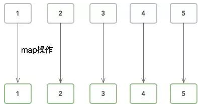
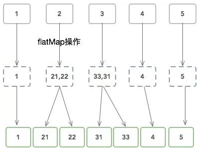
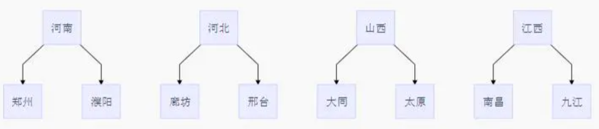

# Stream

Stream 将要处理的元素集合看作一种流，在流的过程中，借助 Stream API 对流中的元素进行操作，比如：筛选、排序、聚合等。

Stream 可以由数组或集合创建，对流的操作分为两种：

1. 中间操作，每次返回一个新的流，可以有多个。

2. 终端操作，每个流只能进行一次终端操作，终端操作结束后流无法再次使用。终端操作会产生一个新的集合或值。

另外，`Stream`有几个特性：

1. stream 不存储数据，而是按照特定的规则对数据进行计算，一般会输出结果。

2. stream 不会改变数据源，通常情况下会产生一个新的集合或一个值。

3. stream 具有延迟执行特性，只有调用终端操作时，中间操作才会执行。

## 1.快速上手

```java
List<String> list = new ArrayList<>();
list.add("zhangsan");
list.add("lisi");
list.add("wangwu");
list.add("zhaoliu");
list.stream()
    .filter(name -> name.startsWith("z"))
    .filter(name -> name.length() > 4)
    .forEach(name -> System.out.println(name));
```

## 2.获取流

`java.util.stream.Stream<T>`是 Java 8 新加入的最常用的流接口，`Stream`可以通过集合数组创建。

- 通过 `java.util.Collection.stream()` 方法用集合创建流

  ```java
  List<String> list = Arrays.asList("a", "b", "c");
  // 创建一个顺序流
  Stream<String> stream = list.stream();
  // 创建一个并行流
  Stream<String> parallelStream = list.parallelStream();
  ```

- 使用`java.util.Arrays.stream(T[] array)`方法用数组创建流

  ```java
  int[] array={1,3,5,6,8};
  IntStream stream = Arrays.stream(array);
  ```

- 使用`Stream`的静态方法：`of()、iterate()、generate()`

  ```java
  Stream<Integer> stream = Stream.of(1, 2, 3, 4, 5, 6);
  
  Stream<Integer> stream2 = Stream.iterate(0, (x) -> x + 3).limit(4);
  stream2.forEach(System.out::println); // 0 3 6 9
  
  Stream<Double> stream3 = Stream.generate(Math::random).limit(3);
  stream3.forEach(System.out::println);
  // 0.6796156909271994
  // 0.1914314208854283
  // 0.8116932592396652
  ```

**stream 和 parallelStream 的简单区分**

`stream`是顺序流，由主线程按顺序对流执行操作，而`parallelStream`是并行流，内部以多线程并行执行的方式对流进行操作，但前提是流中的数据处理没有顺序要求。例如筛选集合中的奇数，两者的处理不同之处：


如果流中的数据量足够大，并行流可以加快处速度。除了直接创建并行流，还可以通过`parallel()`把顺序流转换成并行流：

```
Optional<Integer> findFirst = list.stream().parallel().filter(x->x>6).findFirst();
```

## 3.常用方法

### 3.1 forEach

`void forEach(Consumer<? super T> action)`：终结方法，该方法接收一个`Consumer`接口函数，会将每一个流元素交给该函数进行处理，`Consumer`接口是一个消费型的函数式接口，可以传递 Lambda 表达式。

```java
Stream<String> stream = Stream.of("zhangsan", "lisi", "wangwu");
stream.forEach(name -> System.out.println(name));
```

### 3.2 filter

`Stream<T> filter(predicate<? super T> predicate)`：用于对流进行过滤。`predicate`是一个函数式接口，可以传递 Lambda 表达式。

```java
Stream<String> stream = Stream.of("zhangsan", "lisi", "wangwu");
stream.filter(name -> name.startsWith("z"))
    .forEach(name -> System.out.println(name));
```

### 3.3 anyMatch

`boolean anyMatch(Predicate<? super T> predicate)`：终结方法，有任何一个满足则返回 true。

```java
Stream<String> stream = Stream.of("zhangsan", "lisi", "wangwu");
boolean result1 = stream.anyMatch(name -> name.length() > 4); // true
boolean result2 = stream.anyMatch(name -> name.length() > 8); // false
```

### 3.4 allMatch

`boolean allMatch(Predicate<? super T> predicate)`：终结方法，所有都满足才返回 true。

### 3.5 noneMatch

`boolean noneMatch(Predicate<? super T> predicate)`：终结方法，没有任何一个满足才返回 true。

### 3.6 findAny

`Optional<T> findAny()`，找到对应的值或对象，返回`Optional`对象。

```java
Optional<Book> result = boos.stream()
    .filter(d -> d.getRating() >= 4.8 && d.getPrice() <= 50.0)
    .findAny();
if (result.isPresent()) {
    System.out.println(result.get());
}
```

### 3.7 map

`<R> Stream<R> map(Function<? super T, ? extends R> mapper)`：将流中的元素映射到另一个流中。接收一个 Function 函数式接口参数，可以将当前流中的 T 类型数据转换为另一种 R 类型的流。

```java
Stream<String> stream1 = Stream.of("1", "2", "3", "4", "5");
Stream<Integer> stream2 = stream1.map(Integer::parseInt);
stream2.forEach(System.out::println);
```

#### map和flatMap的区别

**map**

把`数组流`中的每一个值，使用所提供的函数执行一遍，一一对应。得到元素个数相同的`数组流`。



**flatMap**

flat 是扁平的意思。它把`数组流`中的每一个值，使用所提供的函数执行一遍，一一对应。得到元素相同的`数组流`。只不过，里面的元素也是一个子`数组流`。把这些子数组合并成一个数组以后，元素个数大概率会和原`数组流`的个数不同。



**举例**

假如我们有`地址类`，一个`地址类`包含多个`城市`将地址类作为集合，我们想输出所有的城市的名字。

数据结构：



```java
public static void main(String[] args) {
    List<String> cityListOne = new ArrayList<>();
    cityListOne.add("郑州");
    cityListOne.add("濮阳");
    List<String> cityListTwo = new ArrayList<>();
    cityListTwo.add("廊坊");
    cityListTwo.add("邢台");
    List<String> cityListThree = new ArrayList<>();
    cityListThree.add("大同");
    cityListThree.add("太原");
    List<String> cityListFour = new ArrayList<>();
    cityListFour.add("南昌");
    cityListFour.add("九江");

    Address addressOne = new Address();
    addressOne.setProvince("河南");
    addressOne.setCityList(cityListOne);

    Address addressTwo = new Address();
    addressTwo.setProvince("河北");
    addressTwo.setCityList(cityListTwo);

    Address addressThree = new Address();
    addressThree.setProvince("山西");
    addressThree.setCityList(cityListThree);

    Address addressFour = new Address();
    addressFour.setProvince("江西");
    addressFour.setCityList(cityListFour);

    List<Address> addresseList = new ArrayList<>();
    addresseList.add(addressOne);
    addresseList.add(addressTwo);
    addresseList.add(addressThree);
    addresseList.add(addressFour);

    // 使用 map 输出所有的城市名称
    // 郑州濮阳廊坊邢台大同太原南昌九江
    addresseList.stream()
        .map(a -> a.getCityList())
        .forEach(cityList->{
            cityList.forEach(city -> System.out.print(city));
        }
                );
    System.out.println("");

    // 使用 flatMap 输出所有城市名称
    // 郑州濮阳廊坊邢台大同太原南昌九江
    addresseList.stream()
        .flatMap(a -> a.getCityList().stream())
        .forEach(city -> System.out.print(city));

    //使用map强行获取流进行输出，写法和 flatMap 一致
    // java.util.stream.ReferencePipeline$Head@21588809
	// java.util.stream.ReferencePipeline$Head@2aae9190
	// java.util.stream.ReferencePipeline$Head@2f333739
	// java.util.stream.ReferencePipeline$Head@77468bd9
    addresseList.stream()
        .map(a -> a.getCityList().stream())
        .forEach(city->System.out.println(city));
}

```

### 3.8 count

`long count()`：终结方法，用于统计 Stream 中元素的个数。

```java
Stream<String> stream = Stream.of("1", "2", "3", "4", "5");
long count = stream.count();
```

### 3.9 Max & Min & average & sum

`Optional<T> max(Comparator<? super T> comparator)`：根据提供的 Comparator 返回此流的最大元素。

```java
list.stream().max(Integer::compareTo).get();
list.stream().max(Comparator.comparing(String::length));
```

`Optional<T> min(Comparator<? super T> comparator)`：根据提供的 Comparator 返回此流的最小元素。

```java
list.stream().min(Integer::compareTo).get();
list.stream().min(Comparator.comparingInt(Person::getSalary));
```

`average`

```java
double average = list.stream().mapToInt(value -> value.getAge()).average().getAsDouble();
```

`sum`

```java
int sum = list.stream().sum();
```

### 3.10 limit

`Stream<T> limit(long maxSize)`：用于截取流中的元素，只取前 n 个元素。参数是一个 long 型，如果流当前长度大于 n 则进行截取，否则不进行操作。limit 方法是一个延迟方法，只是对流中的元素进行截取，返回的是一个新的流。

在流中的顺序不影响 limit 实现结果，当通过限定的个数后即停止流。

```java
Stream<String> stream = Stream.of("1", "2", "3", "4", "5");
stream.limit(3).forEach(name -> System.out.println(name));
```

### 3.11 skit

`Stream<T> skip(long n)`：用于截取流中的元素，跳过前 n 个元素。如果流当前长度大于 n 则跳过前 n 个，否则将会得到一个长度为 0 的空流。

在流中的顺序影响运行 skip 的结果。

```java
Stream<String> stream = Stream.of("1", "2", "3", "4", "5");
stream.skip(3).forEach(name -> System.out.println(name));
```

### 3.12 concat

`static <T> Stream<T> concat(Stream<? extends T> a, Stream<? extends T> b)`：静态方法，用于把流组合到一起。

```java
Stream<String> stream1 = Stream.of("1", "2", "3", "4", "5");
Stream<String> stream2 = Stream.of("6", "7", "8", "9", "10");
Stream<String> concat = Stream.concat(stream1, stream2);
concat.forEach(System.out::println);
```

### 3.13 peek

`Stream<T> peek(Consumer<? super T> action)`：可以观察到元素流过每个操作后的值。该方法经常被用于改变一个元素的内部状态。

```java
// 将用户名变成小写
Stream<User> userStream = Stream.of(new User("Alice"), new User("Bob"), new User("Chuck"));
userStream.peek(u -> u.setName(u.getName().toLowerCase()))
    .forEach(System.out::println);
```

当然也可以使用`map`，但是`peek`不会替换元素。

### 3.14 parallel

用于创建并行流。但运算必须有可结合性，例：`a + b + c + d = (a + b) + (c + d)`。

```java
Optional<Integer> sum = Arrays.stream(new Integer[] {1, 2, 3, 4})
    .parallel()
    .reduce(Integer::sum);
```


### 3.15 reduce

- `T reduce(T identity, BinaryOperator<T> accumulator)`：终结方法，使用提供的标识值和关联累积函数对此流的元素执行归约，并返回归约后的值。

  ```java
  // 相当于下面的代码
  T result = identity;
  for (T element : this stream)
      result = accumulator.apply(result, element)
  return result;
  ```

  例：

  ```java
  Integer sum = Arrays.stream(new Integer[]{1, 2, 3, 4}).reduce(0, Integer::sum);
  ```

- `Optional<T> reduce(BinaryOperator<T> accumulator)`：终结方法，使用关联累积函数对此流的元素执行归约，并返回描述归约值（如果有）的 Optional。支持`parallel`。

  ```java
  // 相当于下面的代码
  boolean foundAny = false;
  T result = null;
  for (T element : this stream) {
      if (!foundAny) {
          foundAny = true;
          result = element;
      }
      else
          result = accumulator.apply(result, element);
  }
  return foundAny ? Optional.of(result) : Optional.empty();
  ```

  例：

  ```java
  Optional<Integer> sum = Arrays.stream(new Integer[] {1, 2, 3, 4}).reduce(Integer::sum);
  Optional<Integer> product = Arrays.stream(new Integer[] {1, 2, 3, 4}).reduce((x, y) -> x * y);
  ```

- `<U> U reduce(U identity, BiFunction<U, ? super T, U> accumulator, BinaryOperator<U> combiner)`：终结方法，使用提供的标识、累积和组合函数对该流的元素执行归约。

  ```java
  // 相当于下面的代码
  U result = identity;
  for (T element : this stream)
      result = accumulator.apply(result, element)
  return result;
  ```

  例：
  
  ```java
  StringBuilder result = Arrays.stream(new String[]{"1", "2", "3", "4"}).reduce(new StringBuilder(), (sb, s) -> sb.append(s), (sb1, sb2) -> sb1.append(sb2));
  System.out.println(result); // 1234
  
  Integer sumSalary3 = personList.stream().reduce(0, (sum, p) -> sum += p.getSalary(), Integer::sum);
  // 等同于：ger> sumSalary = personList.stream().map(Person::getSalary).reduce(Integer::sum);
  ```
  
  > ==注意==
  >
  > 非线程安全，多线程下会出错！
  >
  > ```java
  > StringBuilder result = Arrays.stream(new String[]{"1", "2", "3", "4"})
  >     .parallel()
  >     .reduce(new StringBuilder(), (sb, s) -> sb.append(s), (sb1, sb2) -> sb1.append(sb2));
  > System.out.println(result); // 434321434321434321434321
  > ```
  >
  > 此时可以用`collect`：
  >
  > ```java
  > StringBuilder result = Arrays.stream(new String[]{"1", "2", "3", "4"}).parallel().collect(StringBuilder::new, (sb, s) -> sb.append(s), (sb1, sb2) -> sb1.append(sb2));
  > System.out.println(result);
  > ```
  >
  > 进一步使用方法引用简化：
  >
  > ```java
  > StringBuilder result = Arrays.stream(new String[]{"1", "2", "3", "4"}).parallel().collect(StringBuilder::new, StringBuilder::append, StringBuilder::append);
  > System.out.println(result);
  > ```

### 3.16 collect

- `<R> R collect(Supplier<R> supplier, BiConsumer<R, ? super T> accumulator, BiConsumer<R, R> combiner)`：对此流的元素执行可变归约操作。与`reduce(Object, BinaryOperator)`一样， `collect`操作可以并行化，无需额外同步。

  ```java
  // 相当于以下操作
  R result = supplier.get();
  for (T element : this stream)
      accumulator.accept(result, element);
  return result;
  ```

  例：

  ```java
  List<String> set = Stream.of("a", "b", "c", "d").collect(ArrayList::new, ArrayList::add, ArrayList::addAll);
  
  TreeMap<Object, Object> treeMap = Arrays.stream(new String[]{"1", "2", "3"})
                  .collect(
                          TreeMap::new,
                          (t, v) -> t.put(v, v + "1"),
                          TreeMap::putAll
                  );
  ```

- `<R, A> R collect(Collector<? super T, A, R> collector)`：使用**Collector**对此流的元素执行可变归约操作。 

  经常使用的方法有：

  1. `Collectors.toList()`：转换成 List 集合

     ```java
     List<String> set = Stream.of("a", "b", "c", "d").collect(Collectors.toList());
     ```

  2. `Collectors.toSet()`：转换成 HashSet 集合

     ```java
     Set<String> set = Stream.of("a", "b", "c", "d").collect(Collectors.toSet());
     ```

  3. `Collectors.toCollection(Supplier)`

     ```java
     TreeSet<String> treeSet = Stream.of("a", "b", "c", "d").collect(Collectos.toCollection(TreeSet::new));
     ```

  4. `Collectors.toMap()`

     1. `Collectors.toMap(keyMapper, valueMapper, mergeFunction)`：最后一个参数为当 key 冲突时，如何选值。

        ```java
        Map<String, String> collect = Stream.of("a", "b", "c", "d").collect(Collectors.toMap(x -> x, x -> x + x, (oldVal, newVal) -> newVal));
        // Map<String, String> collect = Stream.of("a", "b", "c", "d").collect(Collectors.toMap(Function.identity(), x -> x + x, (oldVal, newVal) -> newVal));
        System.out.println(collect); // {a=aa, b=bb, c=cc, d=dd}
        ```

     2. `Collectors.toMap(keyMapper, valueMapper, mergeFunction, mapSupplier)`：提供了一个 map 的 supplier。

        ```java
        Map<String, String> collect = Stream.of("a", "b", "c", "d")
            .collect(
            Collectors.toMap(
                Function.identity(), 
                x -> x + x, 
                (oldVal, newVal) -> newVal,
        		TreeMap::new
            )
        );
        ```

  5. `Collectors.groupingBy()`：分组，将集合分为多个 Map。

     ```java
     // 按性别分组
     Map<Boolean, List<Integer>> collect = Stream.of(1, 2, 3, 4, 5)
                     .collect(Collectors.groupingBy(s -> s < 3));
     collect.forEach((k, v) -> System.out.println(k + ":" + v)); // false:[3, 4, 5] true:[1, 2]
     
     // 返回 treeMap
     TreeMap<Boolean, Set<Integer>> collect = Stream.of(1, 2, 3, 4, 5)
                     .collect(Collectors.groupingBy(s -> s < 3, TreeMap::new, Collectors.toSet()));
     // 降序排列
     TreeMap<Boolean, Set<Integer>> collect = Stream.of(1, 2, 3, 4, 5)
                     .collect(Collectors.groupingBy(s -> s < 3, () -> new TreeMap<>((o1, o2) -> Integer.parseInt(o2) - Integer.parseInt(o1)), Collectors.toSet()));
     
     // 分别统计不同性别的人数
     Map<String, Long> map = peoples.stream().collect(
         Collectors.groupingBy(People::getSex, Collectors.counting())
     );
     System.out.println(map); // {female=1, male=2}
     
     
     // 分别统计不同性别各自的 name 列表
     Map<String, Set<String>> map = peoples.stream().collect(
         Collectors.groupingBy(
             People::getSex,
             Collectors.mapping(People::getName, Collectors.toSet())
         )
     );
     System.out.println(map); // {female=[wangwu], male=[lisi, zhangsan]}
     
     // 找到不同性别最大年龄的 name
     Map<String, Optional<People>> map = peoples.stream().collect(
         Collectors.groupingBy(
             People::getSex,
             Collectors.maxBy(Comparator.comparingInt(People::getAge))
         )
     );
     for (String s : map.keySet()) {
         System.out.println(s + ":" + map.get(s).get().getName()); // female:liuliu male:lisi
     }
     ```

     嵌套分组：

     ```java
     // 先按性别分组，再按年龄分组
     Map<String, Map<Integer, Set<People>>> collect = peoples.stream()
                     .collect(Collectors.groupingBy(People::getSex, Collectors.groupingBy(People::getAge, Collectors.toSet())));
     ```

  6. `Collectors.partitioningBy()`：分区，将`stream`按条件分为两个`Map`。

     `Collector<T, ?, Map<Boolean, List<T>>> partitioningBy(Predicate<? super T> predicate)`：传入一个`predicate`。

     ```java
     // 返回分数大于 4.5 和 小于 4.5 的两个 list 集合
     Map<Boolean, List<Book>> partitionedMap = treeMap,values().stream()
         .collect(Collectors.partitioning(b -> b.getRating() >= 4.5));
     ```

  7. `Collectors.maxBy()`

  8. `Collectors.summingInt()`

  9. `Collectors.averagingInt()`

  10. `Collectors.summarizingInt()`：一次统计所有信息，个数、总和、最小值、平均值、最大值等。

      ```java
      Collectors.groupingBy(people::getSex, Collectors.summaringzingInt(people::getName));
      ```

  11. `Collectors.joining()`

      ```java
      // 连接字符串
      String concatWithJoining = Arrays.stream(grades).parallel().collect(Collectors.joining("-"));
      ```

### 3.17 distinct

`Stream<T> distinct()`：去重。

```java
List<Integer> collect = Stream.of(1, 2, 1, 3, 5)
    .distinct()
    .collect(Collectors.toList());
System.out.println(collect); // [1, 2, 3, 5]
```

### 3.18 sorted

中间操作。有两种排序：

- sorted()：自然排序，流中元素需实现 Comparable 接口
- sorted(Comparator com)：Comparator 排序器自定义排序

**案例：将员工按工资由高到低（工资一样则按年龄由大到小）排序**

```java
// 按工资升序排序（自然排序）
List<String> newList = personList.stream().sorted(Comparator.comparing(Person::getSalary)).map(Person::getName)
    .collect(Collectors.toList());
// 按工资倒序排序
List<String> newList2 = personList.stream().sorted(Comparator.comparing(Person::getSalary).reversed())
    .map(Person::getName).collect(Collectors.toList());
// 先按工资再按年龄升序排序
List<String> newList3 = personList.stream()
    .sorted(Comparator.comparing(Person::getSalary).thenComparing(Person::getAge)).map(Person::getName)
    .collect(Collectors.toList());
```

