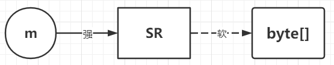

# ThreadLocal
## 1.java中的引用类型（强软弱虚）
### 1.1 强引用
强引用存在时，即使`OOM`也不会被回收，除非强引用关系不再存在。
```java
Object o = new Object();
```
当一个类回收时，会调用该类的`finalize()`方法。
> 但是重写该方法可能会造成频繁的`Full GC`和`OOM`，例如将一些资源的释放放在该方法中，但是资源的释放有时需要很长时间，相当于间接延长了该类的生命周期。

```java
// 重写 finalize() 方法，该方法已过时
public class M {
    @Override
    protested void finalize() throws Throwable {
        System.out.println("finalize");
    }
}

public class NormalReferenceTest {
    pulic static void main(String[] args) throws IOEception {
        M m = new M();
        m = null;
        System.gc();
        System.in.read(); // 阻塞 main 线程，给垃圾回收线程时间执行
    }
}
```
### 1.2 软引用
当内存足够的时候，GC 不会回收软引用，当内存不够的时候，软引用会被回收。因此软引用非常适合做**缓存**。



```java
public class SoftReferenceTest {
    pulic static void main(String[] args) throws IOEception {
        // 这里m仍然是一个强引用指向创建的 SoftReference 对象
        // 而 SoftReference 对象是一个软引用指向创建的 byte 数组对象
        SoftReference<byte[]> m = new SoftReference<>(new byte[1024*1024*10]);
        
        System.out.println(m.get()); // 得到软引用指向的对象
        System.gc();
        try｛
            Thread.sleep(500);
        } catch (InterruptedException e) {
            e.printStackTrace();
        }
        System.out.println(m.get()); // 软引用指向的对象没有被回收
        
        // 启动时配置JVM参数 -Xmx20m，给堆内存最大分配 20m
        // 再分配一个数组，heap 将装不下，这时系统会垃圾回收
        // 先回收一次，如果不够，会把软引用回收
        byte[] b = new byte[1024*1024*15];
        System.out.println(m.get()); // null
    }
}
```
### 1.3 弱引用
总是会被`GC`所回收。应用在`ThreadLocal`中。
```java
publc class WeakReferenceTest {
    WeakReference<M> m = new WeakReference<>(new M());
    
    System.out.println(m.get()); // 打印出对象
    System.gc();
    System.out.println(m.get()); // 打印 null，同时 m 的 finalize() 方法被调用了
}
```
### 1.4 虚引用
用于管理直接内存（DirectBuffer）。不能通过`get()`获得对象，虚引用对象被回收时会被放到队列中。
```java
public class PhantomReferenceTest {
    private static final List<Object> LIST = new LinkedList<>();
    private static final ReferenceQueue<M> QUEUE = new ReferenceQueue<>();
    
    public static void main(String[] args) {
        // QUEUE：用于存放被回收的对象
        PhantomReference<M> phantomReference = new PhantomReference<>(new M(), QUEUE);
        
        System.out.println(phantomReference.get()); // null，无法拿到对象
        
    new Thread(() -> {
        while (true) {
            LIST.add(new byte[1024*1024]);
            try {
                Thread.sleep(1000);
            } catch (InterruptedException e) {
                e.printStackTrace();
                Thread.currentThread().interrupt();
            }
            System.out.println(PhantomReference.get());
        }
    }).start();
    
    new Thread(() -> {
        while (true) {
            Reference<? extends M> poll = QUEUE.poll();
            if (poll == null) {
                System.out.println("虚引用对象被JVM回收了" + poll);
            }
        }
    }).start();
    }
}
```
## 2.ThreadLocal
```java
public class ThreadLocalTest {
    static ThreadLocal<Person> tl = new ThreadLocal<>();
    
    public static void main(String[] args) {
        new Thread(() ->{
            try {
                TimeUnit.SECONDS.sleep(2);
            } catch (Exception e) {
                e.printStackTrace();
            }
            System.out.println(tl.get()); // null
        }).start();
        
        new Thread(() ->{
            try {
                TimeUnit.SECONDS.sleep(1);
            } catch (Exception e) {
                e.printStackTrace();
            }
            tl.set(new Person());
        }).start();
    }
    
    static class Person {
        String name = "zhangsan";
    }
}
```
### 2.1 ThreadLocal源码
```java
// ThreadLocal 的 set() 方法
public void set(T value) {
    Thread t = Thread.currentThread();
    ThreadLocalMap map = getMap(t);
    if (map != null) {
        // 将 value 放到 map 中，key 是当前的 ThreadLocal 对象
        map.set(this, value);
    } else {
        // 只有当赋值或获取值时才会创建 map
        createMap(t, value);
    }
}

// ThreadLocal 的 getMap() 方法
ThreadLocalMap getMap(Thread t) {
    return t.threadLocals;
}

// Thread 的 threadLocals 成员变量，每个线程管理一个
ThreadLocal.ThreadLocalMap threadLocals = null;
```
```java
// ThreadLocal 的静态内部类
static class ThreadLocalMap {

    // Entry 继承了弱引用
    static class Entry extends WeakReference<ThreadLocal<?>> {
        /** The value associated with this ThreadLocal. */
        Object value;

        Entry(ThreadLocal<?> k, Object v) {
            // 相当于 new WeakReference<ThreadLocal<?>>(k);
            super(k);
            value = v;
        }
    }
    // ----------------------------- 存入 -----------------------------

    // ThreadLocal.ThreadLocalMap 的 set() 方法，最终存储到了继承了弱引用的 Entry 数组
    private void set(ThreadLocal<?> key, Object value) {
        Entry[] tab = table;
        int len = tab.length;
        int i = key.threadLocalHashCode & (len-1);
        // 先看数组中是否已经存储了该键值对
        // ThreadLocalMap 的存放策略为：当出现键冲突时，会依次向后查找第一个为 null 的键然后存入
        for (Entry e = tab[i];
             e != null;
             e = tab[i = nextIndex(i, len)]) {
            ThreadLocal<?> k = e.get();

            if (k == key) {
                e.value = value;
                return;
            }

            // 如果 key 为 null 说明该 key 已经被回收，则会重复利用该位置
            if (k == null) {
                replaceStaleEntry(key, value, i);
                return;
            }
        }
        // 如果数组中没有该键值对，将 entry 存放到 tab（Entry数组）
        tab[i] = new Entry (key, value);

        int sz = ++size;
        // 如果长度大于 threshold（默认 Entry 数组长度的 2/3），进行扩容
        if (!cleanSomeSlots(i, sz) && sz >= threshold)
            rehash();
    }

    private void rehash() {
        // 先删除 key 为 null 的 Entry
        expungeStaleEntries();
        // Use lower threshold for doubling to avoid hysteresis
        if (size >= threshold - threshold / 4)
            resize();
    }
    // ----------------------------- 查找 -----------------------------

    // 查找 key 对应的 Entry
    private Entry getEntry(ThreadLocal<?> key) {
        int i = key.threadLocalHashCode & (table.length - 1);
        Entry e = table[i];
        if (e != null && e.get() == key)
            return e;
        else
            return getEntryAfterMiss(key, i, e);
    }

    // 在第一次索引时没找到（存在键冲突或该 Entry 已被删除）
    private Entry getEntryAfterMiss(ThreadLocal<?> key, int i, Entry e) {
        Entry[] tab = table;
        int len = tab.length;

        while (e != null) {
            ThreadLocal<?> k = e.get();
            if (k == key)
                return e;
            if (k == null)
                // 当存在 key 为 null 时，删除该 Entry 直到出现为 null 的 Entry 为止
                expungeStaleEntry(i);
            	// 然后继续遍历查找索引
            else
                i = nextIndex(i, len);
            e = tab[i];
        }
        return null;
    }
}
```
### 2.2 为什么要用弱引用？
如果使用了强引用作为 key 去创建一个线程私有的变量，那么这个私有变量的生命周期就与`ThreadLocals`这个 map 绑定了，也就是与该线程绑定了，直到线程结束前都不会被回收。如果是个弱引用，一旦`tl`与`new`出来的`ThreadLocal`切断了联系，当下次 GC 时该`ThreadLocal`对象就会被回收。


### 2.3 内存泄漏
但是此时只有`key`被回收了，`Entry`对象中的`value`却永远被保存下来了，这就是内存泄漏的问题。设想如果这发生在**线程池**中：一个线程被使用并创建了`ThreadLocal`变量，但是发生了内存泄露并返回给了线程池。甚者`key`也没有被回收并回到了线程池中。
所以线程池在回收线程后，会首先清理`threadLocals`。

> 调用 get() 方法和 set() 方法都会重复利用 key 为 null 的 Entry。
