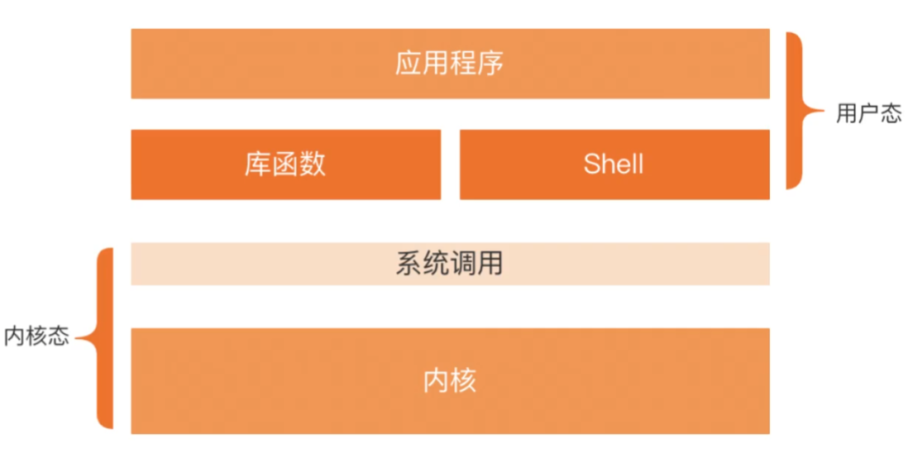

## start和run的区别

run 依然会阻塞当前线程，start 会开辟一个新线程

## 线程池的特点

- 降低线程创建和销毁线程造成的开销
- 提高响应速度。任务到达时，相对于手工创建一个线程，直接从线程池中拿线程，速度肯定快很多
- 提高线程可管理性。线程是稀缺资源，如果无限制地创建，不仅会消耗系统资源，还会降低系统稳定性，使用线程池可以进行统一分配、调优和监控

## Synchronized锁升级原理

Synchronized 在 JDK1.6 版本之前是通过`重量级锁`的方式来实现线程之间的锁的竞争。所以在 JDK1.6 之后，Synchronized 增加了`锁升级`的机制。

当线程访问 Synchronized 代码块的时候，会根据线程的竞争状态先去尝试在不加重量级锁的情况下保证线程安全， 所以引入了`偏向锁`和`轻量级锁`的机制。

- `偏向锁`就是直接把当前的锁偏向于某个线程，简单来说就是当一个线程访问加了同步锁的代码块时，首先获取锁对象头的`Markword`，判断是否处于可偏向状态（biased_lock=1、且 ThreadId 为空）。

  - 如果是可偏向状态，则通过 CAS 操作，把当前线程的 ID写入到 MarkWord。如果 CAS 成功则表示获取锁成功；如果 CAS 失败，说明有其他线程已经获得了偏向锁，这种情况说明当前锁存在竞争，需要撤销已获得偏向锁的线程，并且把它持有的锁升级为轻量级锁。
  - 如果是已偏向状态，需要检查 markword 中存储的 ThreadID 是否等于当前线程的 ThreadID。如果相等，不需要再次获得锁，可直接执行同步代码块如果不相等，说明当前锁偏向于其他线程，需要撤销偏向锁并升级到轻量级锁。

  偏向锁的撤销并不是把对象恢复到无锁可偏向状态（因为偏向锁并不存在锁释放的概念），而是在获取偏向锁的过程中，发现 CAS 失败也就是存在线程竞争时，直接把被偏向的锁对象升级到被加了轻量级锁的状态。

  对原持有偏向锁的线程进行撤销时，原获得偏向锁的线程有两种情况：

  1. 原获得偏向锁的线程如果已经退出了临界区，也就是同步代码块执行完了，那么这个时候会把对象头设置成无锁状态并且争抢锁的线程可以基于 CAS 重新偏向当前线程。

  2. 如果原获得偏向锁的线程的同步代码块还没执行完，处于临界区之内，这个时候会把原获得偏向锁的线程升级为轻量级锁。

- `轻量级锁`也成为自旋锁，所谓自旋，就是指当有另外一个线程来竞争锁时，这个线程会在原地循环等待，而不是把该线程给阻塞，直到那个获得锁的线程释放锁之后，这个线程就可以马上获得锁的。其优点在于它可以避免了用户态到内核态的切换带来的性能的损耗。

  > 它是基于自适应自旋的机制，自适应意味着自旋的次数不是固定不变的，而是根据**前一次在同一个锁上自旋的时间**以及**锁的拥有者的状态**来决定。如果在同一个锁对象上，自旋等待刚刚成功获得过锁，并且持有锁的线程正在运行中，那么虚拟机就会认为这次自旋也是很有可能再次成功，进而它将允许自旋等待持续相对更长的时间。如果对于某个锁，自旋很少成功获得过，那在以后尝试获取这个锁时将可能省略掉自旋过程，直接阻塞线程，避免浪费处理器资源。

- 如果轻量级锁依然竞争失败，则会升级为`重量级锁`，此时没有竞争到锁的线程会被阻塞，这时线程的状态叫做`Blocked`，即处于锁等待的状态。该线程会等待直到当前获得锁的线程释放锁之后才会被唤醒。

  > **重量级锁**
  >
  > 底层依赖操作系统层面的`Mutex Lock`来实现互斥锁的功能，`Metex Lock`是系统方法，由于权限隔离的关系，应用程序调用系统方法时需要切换到内核状态来执行，这就涉及到用户态向内核态的切换，会带来性能上的损耗。
  >
  > 