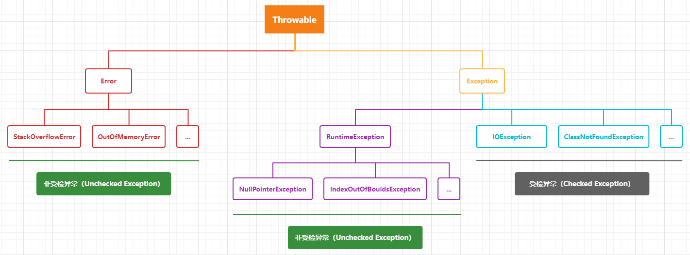
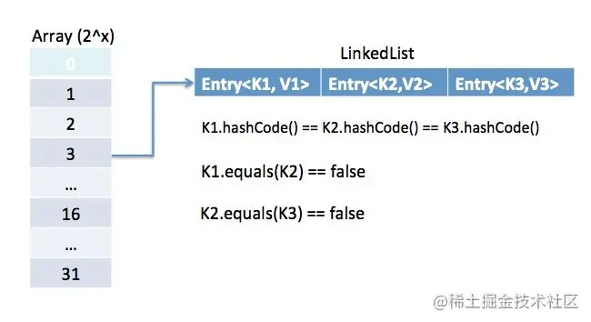
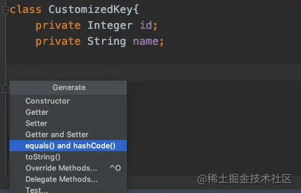
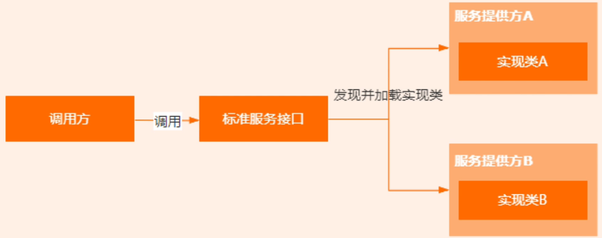

## Map

- 可以使用`map.getOrDefault(key, defaultValue)`来获取值，底层使用了三元运算

## 乘除运算

- 尽量使用位运算

## Stream

- 慎用`parallel`并行流方法，会调用空闲的`CPU`进行数据处理，影响其他服务，使用前进行压力测试

## 抽象方法和接口的区别

|      | 抽象类                                                       | 接口                                                         |
| :--: | ------------------------------------------------------------ | ------------------------------------------------------------ |
| 定义 | 包含**抽象方法**的类                                         | 主要包含**抽象方法**和**静态常量（final static）**的类       |
| 组成 | **构造器**<br />抽象方法<br />**成员方法**、**成员变量**<br />静态方法、**静态变量**<br />**常量** | 抽象方法<br />**default方法（JAVA8）**<br />静态方法（JAVA8）、**静态常量**<br />**私有方法（JAVA9）** |
| 使用 | extends                                                      | implements                                                   |
| 关系 | 子类只能继承**一个抽象类**<br />抽象类可以**实现多个接口**   | 子类可以**实现多个接口**<br />接口**不能继承类**，但可以同时**继承多个接口** |
| 选择 | 适用于需要继承父类的成员变量，或者需要控制子类的实例化的场景 | 优先选择接口、避免单继承的局限                               |

## 异常



受检异常：编译时会报错，需要强制捕获的异常，或者 try catch，或者抛出

非受检异常：编译时不会报错，不强制要求捕获的异常

Error：跟程序本身无关的错误

## 为什么重写了equals()也要重写hashCode()

Java 中的`equals()`方法和`hashCode()`方法都是在`Object`类中的方法，而在 Java 中所有的类都是`Obejct`类的子类，所以 Java 中所有的方法都会有这两个方法的默认实现。

**equals方法**

`Object`类中的`equals()`方法定义如下

```java
public boolean equals(Object obj) {
    return (this == obj);
}
```

我们发现在`equals()`方法中只使用了`==`。

- 基本数据类型：比较的是`==`两边值是否相等
- 引用数据类型：比较的是`==`两边内存地址是否相等

> 基本数据类型包括：`byte`,`short`,`char`,`int`,`long`,`float`,`double`,`boolean`

而通过Java文档中的`equals()`方法描述，所有要实现自己的`equals()`方法都要遵守下面几个规则

- 自反性：对于任何对象x，`x.equals(x)`应该返回`true`
- 对称性：对于任何两个对象x和y，如果`x.equals(y)`返回`true`，那么`y.equals(x)`也应该返回`true`
- 传递性：对于多个对象x,y,z，如果`x.equals(y)`返回`true`,`y.equals(z)`返回`true`，那么`y.equals(z)`也应该返回`true`
- 一致性：对于两个非空对象x,y，在没有修改此对象的前提下，多次调用返回的结果应该相同
- 对于任何非空的对象x，`x.equals(null)`都应该返回`false`

**hashCode方法**

`Object`中的`hashCode()`方法是一个本地方法，返回一个`int`类型的哈希值。

```java
public native int hashCode();
```

在`hashCode()`方法中也有一些规约

- 如果对象在使用`equals`方法中进行比较的参数没有修改，那么多次调用一个对象的`hashCode()`方法返回的哈希值应该是相同的
- 如果两个对象通过`equals`方法比较是相等的，那么**要求**这两个对象的`hashCode`方法返回的值也应该是相等的
- 如果两个对象通过`equals`方法比较是不同的，那么也**不要求**这两个对象的`hashCode`方法返回的值是不相同的。但是我们应该知道对于不同对象产生不同的哈希值对于哈希表（HashMap等等）能够提高性能

**equals方法和hashCode方法会在哪用到**

这两个方法经常出现在 Java 中的哪个类里面呢？如果看过`HashMap`源码的应该了解这两个方法经常出现在`HashMap`中。网上介绍`HashMap`类的文章有很多了，这里就简单介绍一下`HashMap`。

> 当一个节点中的链表超过了`8`的时候就会变为`红黑树`，以解决链表长度过长以后查询速度慢的缺点。



`HashMap`是由数组和链表组成的高效存储数据的结构。那么是如何确定一个数据存储在数组中的哪个位置呢？就是通过`hashCode`方法进行计算出存储在哪个位置，还记得我们上面讲`hashCode`方法说了有可能两个不同对象的`hashCode`方法返回的值相同，那么此时就会产生冲突，产生冲突的话就会调用`equals`方法进行比对，如果不同，那么就将其加入链表尾部，如果相同就替换原数据。

> 计算位置当然不是上面简单的一个`hashCode`方法就计算出来，中间还有一些其他的步骤，这里可以简单的认为是`hashCode`确定了位置。

**什么时候去覆盖这两个方法呢？**

如果你不将自定义的类定义为`HashMap`的 key 值的话，那么我们重写了`equals`方法而没有重写`hashCode`方法，编译器不会报任何错，在运行时也不会抛任何异常。

如果你想将自定义的类定义为`HashMap`的 key 值得话，那么如果重写了`equals`方法那么就必须也重写`hashCode`方法。

接下来我们可以看一下我们使用自定义的类作为`HashMap`的 key，并且自定义的类不重写`equals`和`hashCode`方法会发生什么。

自定义的类

```java
@Builder
@NoArgsConstructor
@AllArgsConstructor
class CustomizedKey{
    private Integer id;
    private String name;
}
```

接下来我们看使用自定义的类作为 key

```java
public static void main(String[] args) {

    Map<CustomizedKey, Integer> data = getData();
    CustomizedKey key = CustomizedKey.builder().id(1).name("key").build();
    Integer integer = data.get(key);
    System.out.printf(String.valueOf(integer)); // null
}

private static Map<CustomizedKey,Integer> getData(){
    Map<CustomizedKey,Integer> customizedKeyIntegerMap = new HashMap<>();
    CustomizedKey key = CustomizedKey.builder().id(1).name("key").build();
    customizedKeyIntegerMap.put(key,10);
    return customizedKeyIntegerMap;
}
```

我们可以看到程序最后打印的是一个`null`值。原因正如上面我们说的一样。

> `hashCode`用来计算该对象放入数组中的哪个位置，因为是两个都是 new 的对象，所以即使里面的值一样，但是对象所处的地址却不同，所以使用默认的`hashCode`也就不同，当然在`hashMap`中就不会认为两个是一个对象。

接下来我们就重写一下这两个方法。如果我们使用`IDEA`的话，那么直接使用快捷键即可。



接下来我们看我们实现的两个方法

```java
@Builder
@NoArgsConstructor
@AllArgsConstructor
class CustomizedKey{
    private Integer id;
    private String name;

    @Override
    public boolean equals(Object o) {
        if (this == o) return true;
        if (o == null || getClass() != o.getClass()) return false;
        CustomizedKey that = (CustomizedKey) o;
        return Objects.equals(id, that.id) &&
            Objects.equals(name, that.name);
    }

    @Override
    public int hashCode() {
        return Objects.hash(id, name);
    }
}
```

然后我们再次运行上面的程序发现输出打印已经变成了`10`。

> 我们也能够使用`Lombok`提供的`@EqualsAndHashCode`注解简化代码

## SPI

Service Provider Interface，JDK 内置的动态扩展的一个实现。我们可以定义一个标准的接口，然后第三方库来实现这个接口，程序在运行时会根据配置信息动态加载第三方库的实现。



例如数据库的驱动`java.jdbc.Driver`，JDK 中定义了数据库的一个驱动接口`Driver`，但是没有提供任何实现类，具体的实现由第三方的数据库厂商来完成。在程序运行时，会根据声明的驱动类型来动态加载对应的扩展实现。

另外还有`Spring`中提供了`SpringFactoriesLoader`来实现外部功能的集成。
