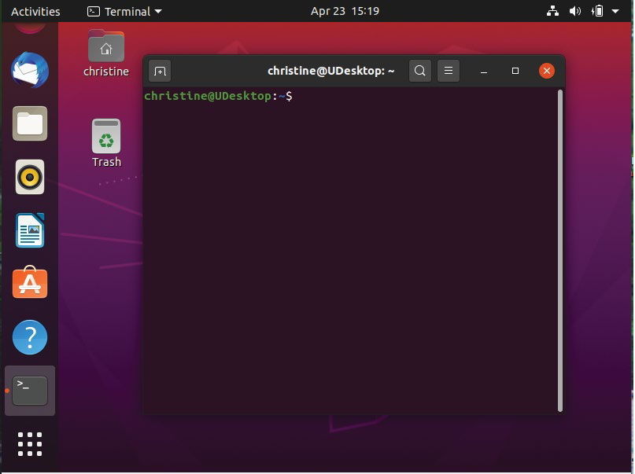
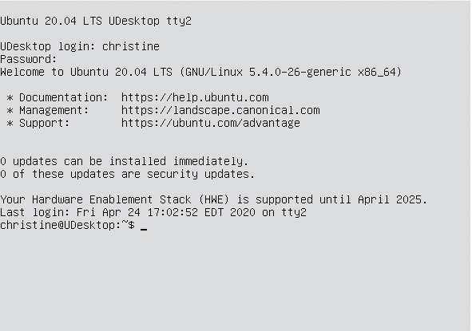
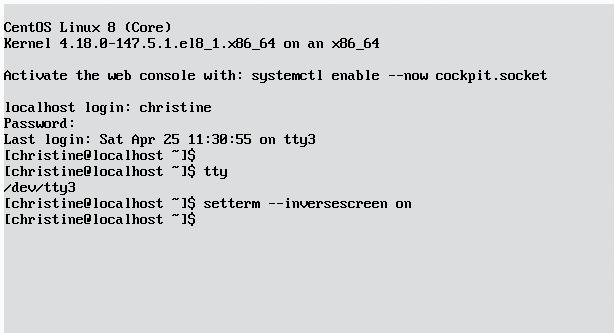
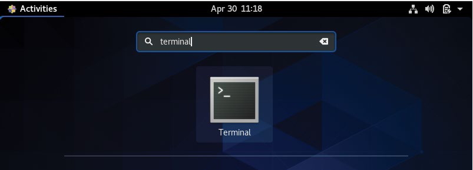
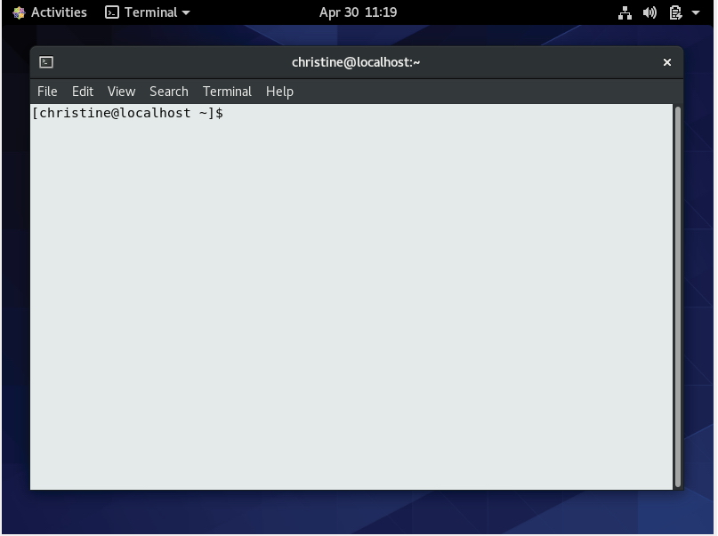
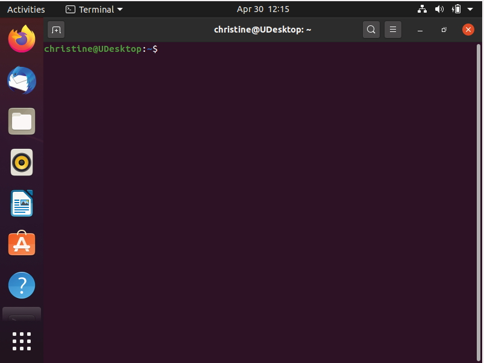
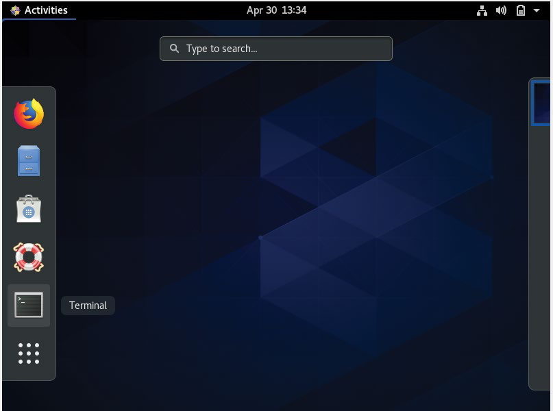
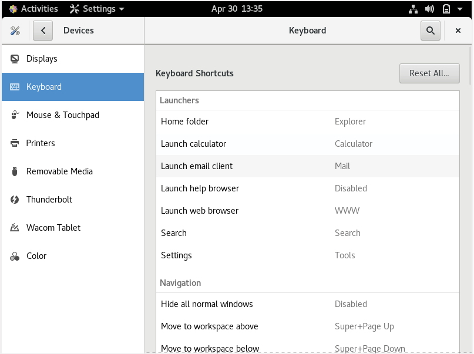
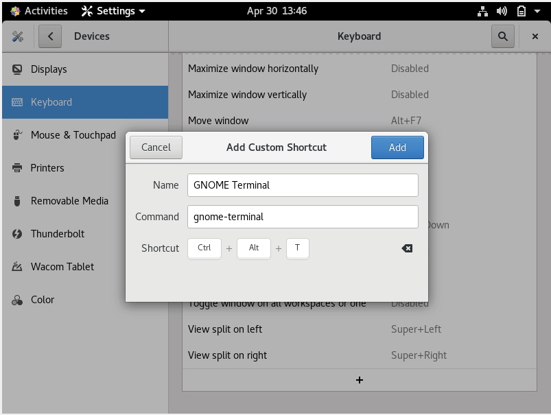

# 第2章_走进shell

> **本章内容**
>
> - 访问命令行
> - 通过 Linux 控制台终端访问 CLI 及通过图形化终端仿真器访问 CLI
> - 使用 GNOME Terminal 终端仿真器
> - 使用 Konsole 终端仿真器
> - 使用 xterm 终端仿真器

在 Linux 早期，系统管理员、程序员、系统用户全都端坐在 Linux 控制台终端前，输入 shell 命令，查看文本输出。如今伴随着图形化桌面环境的应用，想在系统中找到 shell 提示符来输入命令都变得困难起来。本章讨论了如何进入命令行环境，并带你逐步了解可能会在各种 Linux 发行版中碰到的终端仿真软件包。

## 1.进入命令行

在图形化桌面出现之前，和 Unix 系统交互的唯一方式就是通过 shell 提供的文本**命令行界面**（command line interface，CLI）。CLI 只允许输入文本，而且只能显示文本和基本图形输出。

由于此限制，输出设备也用不着多高级，只需要一个简单的哑终端就能和 Unix 系统交互了。哑终端（dumb terminal）是由通信电缆（通常是多线束串行电缆，也叫带状电缆）连接到 Unix 系统的显示器和键盘。通过这种简单的组合，可以轻松地向 Unix 系统输入文本数据并显示文本结果。

你也很清楚，如今的 Linux 环境已经大不同往日了。大部分 Linux 发行版采用了某种类型的图形化桌面环境。但要输入 shell 命令，仍然需要通过文本显示来访问 shell 的 CLI。于是现在的问题归结为一点：有时候在 Linux 发行版中找到进入 CLI 的途径还真不是件容易的事。

### 1.1 控制台终端

进入 CLI 的一种途径是访问 Linux 系统的文本模式。该模式只在显示器上提供一个简单的 shell CLI，就跟图形化桌面出现之前那样。这称作**Linux控制台**，因为它模拟的是早期的硬接线控制台终端（hard-wired console terminal），而且是跟 Linux 系统交互的直接接口。

Linux 系统启动时，会自动创建多个**虚拟控制台**。虚拟控制台是运行在 Linux 系统内存中的终端会话。多数 Linux 发行版会启动 5~6 个（甚至更多）虚拟控制台代替哑终端，通过单个计算机键盘和显示器就可以访问这些虚拟控制台。

### 1.2 图形化终端

虚拟控制台终端的另一种替代方案是使用 Linux 图形化桌面环境中的**终端仿真软件包**。终端仿真软件包会在桌面图形化窗口中模拟控制台终端。下图显示了一个运行在 Linux 图形化桌面环境中的终端仿真器。

图形化终端仿真只负责 Linux 图形化体验的一部分。完整的体验需要借助包括图形化终端仿真软件（称为**客户端**）在内的多个组件来实现。下表显示了 Linux 图形化桌面环境中不同的组件。

| 名称       | 例子                                                         | 描述                                                   |
| :--------- | :----------------------------------------------------------- | :----------------------------------------------------- |
| 客户端     | 图形化终端仿真器，桌面环境（GNOME Shell、KDE Plasma），网络浏览器 | 请求图形化服务的应用程序                               |
| 显示服务器 | Wayland、X Window System                                     | 管理显示（屏幕）和输入设备（键盘、鼠标、触摸屏）的元素 |
| 窗口管理器 | Mutter、Metacity、Kwin                                       | 为窗口添加边框并提供窗口移动和管理功能的元素           |
| 小部件库   | Plasmoids、Cinnamon Spices                                   | 为桌面环境客户端添加菜单和外观项的元素                 |

要想在桌面中使用命令行，关键在于图形化终端仿真器。你可以将图形化终端仿真器看作图形化用户界面中（in the GUI）的 CLI 终端，将虚拟控制台终端看作图形化用户界面之外（outside the GUI）的 CLI 终端。理解各种终端及其特性能够提高你的命令行体验。

## 2.通过Linux控制台终端访问CLI

在 Linux 早期，引导系统时你在显示器上只能看到一个登录提示符，除此之外就没别的了。之前说过，这就是 Linux 控制台。它是可以向系统输入命令的唯一地方。

尽管在引导时会创建多个虚拟控制台，但很多 Linux 发行版在完成启动过程之后会切换到图形化环境中。这为用户提供了图形化登录以及桌面体验。对于这类系统，就只能通过手动方式来访问虚拟控制台了。

在大多数 Linux 发行版中，可以使用简单的按键组合来访问某个 Linux 虚拟控制台。通常必须按下 Ctrl+Alt 组合键，然后再按一个功能键（F1～F7）来进入你要使用的虚拟控制台。功能键 F2 键会生成虚拟控制台 2，F3 键会生成虚拟控制台 3，F4 键会生成虚拟控制台 4，以此类推。

> **注意**
>
> Linux 发行版通常使用 Ctrl+Alt 组合键配合 F1 键、F7 键或 F8 键进入图形化界面。Ubuntu 和 CentOS 均使用 F1 键。不过最好还是自己动手测试一下，看看你用的发行版是如何分配按键的，尤其是对于比较旧的发行版。

文本模式的虚拟控制台采用全屏的方式显示文本登录界面。下图展示了一个虚拟控制台的文本登录界面。

注意第一行文本的最后一个单词`tty2`，其中的`2`表明这是虚拟控制台 2，可以通过按下 Ctrl+Alt+F2 组合键进入。`tty`代表**电传打字机**（teletypewriter）。这个词有些年代了，是一种用于发送消息的机器。

> **注意**
>
> 不是所有的 Linux 发行版都会在登录画面显示虚拟控制台的`tty`编号。登入虚拟控制台后，可以输入命令`tty`，然后按 Enter 键查看当前使用的是哪个虚拟控制台。第 3 章会介绍命令输入。

在`login:`提示符后输入你的用户 ID，然后在`Password:`提示符后输入密码就可以登入控制台终端了。如果你之前从来没有用过这种登录方式，则要注意在这里输入的密码和在图形化环境中输入的看起来不太一样。在图形化环境中，在你输入密码的时候会看到点号或者星号。但是在虚拟控制台中，输入密码的时候**什么都不会显示**。

> **注意**
>
> 记住，在 Linux 虚拟控制台中是无法运行任何图形化程序的。

登入虚拟控制台之后，就进入了 Linux CLI，你可以在不中断当前活动会话的情况下切换到另一个虚拟控制台，在所有的虚拟控制台之间任意切换，同时拥有多个活动会话。在使用 CLI 时，这个特性提供了巨大的灵活性。

其他灵活性来自虚拟控制台的外观。尽管虚拟控制台只是一个文本模式的控制台终端，但你也可以修改文字和背景色。

例如，可以将终端的背景色设置成白色，将文本设置成黑色，这样可以让你的眼睛轻松些。登录之后，有好几种方法可以实现这种改动。一种方法是输入命令`setterm --inversescreen on`，然后按 Enter 键，如下图所示。注意，下图中使用`on`启用了`--inversescreen`特性。也可以使用`off`关闭该特性。

另一种方法是先后输入两个命令。首先输入`setterm --background white`，然后按 Enter 键，接着输入`setterm -foreground black`，再按 Enter 键。要注意，因为先修改的是终端的背景色，所以可能不容易看清楚接下来输入的命令。

在上面的命令中，不用像`--inversescreen`那样去启用或关闭什么特性。共有 8 种颜色可供选择，分别是`black`、`red`、`green`、`yellow`、`blue`、`magenta`、`cyan`和`white`（`white`在有些发行版中看起来像是灰色）。你可以赋予纯文本模式的控制台终端富有创意的外观效果。下表展示了`setterm`命令的部分选项，可以用于改善控制台终端的可读性或外观。

| 选项              | 参数                                                         | 描述                                              |
| :---------------- | :----------------------------------------------------------- | :------------------------------------------------ |
| `--background`    | `black`、`red`、`green`、`yellow`、`blue`、`magenta`、`cyan`或`white` | 将终端的背景色改为指定颜色                        |
| `--foreground`    | `black`、`red`、`green`、`yellow`、`blue`、`magenta`、`cyan`或`white` | 将终端的前景色（特别是文本）改为指定颜色          |
| `--inversescreen` | `on`或`off`                                                  | 交换背景色和前景色                                |
| `--reset`         | 无                                                           | 将终端外观恢复成默认设置并清屏                    |
| `--store`         | 无                                                           | 将终端当前的前景色和背景色设置成`--reset`选项的值 |

如果不涉及 GUI，那么使用虚拟控制台终端访问 CLI 自然是一种不错的选择。但有时候你需要一边访问 CLI，一边运行图形化程序。使用终端仿真软件包可以解决这个问题，这也是在 GUI 中访问 shell CLI 的一种流行的方式。接下来几节会介绍提供图形化终端仿真的常见软件包。

## 3.通过图形化终端仿真器访问CLI

相较于虚拟控制台终端，图形化桌面环境提供了多种方式来访问 CLI。在图形化环境下，有大量可用的终端仿真器。每个软件包都有各自独特的特性以及选项。下表中列举出了一些流行的图形化终端仿真器软件包及其网站。

| 名称            | 网站                                                         |
| :-------------- | :----------------------------------------------------------- |
| Alacritty       | [github.com/alacritty/alacritty](http://github.com/alacritty/alacritty) |
| cool-retro-term | [github.com/Swordfish90/cool-retro-term](http://github.com/Swordfish90/cool-retro-term) |
| GNOME Terminal  | [wiki.gnome.org/Apps/Terminal](http://wiki.gnome.org/Apps/Terminal) |
| Guake           | [guake-project.org](http://guake-project.org/)               |
| Konsole         | [konsole.kde.org](http://konsole.kde.org/)                   |
| kitty           | [sw.kovidgoyal.net/kitty](http://sw.kovidgoyal.net/kitty)    |
| rxvt-unicode    | [software.schmorp.de/pkg/rxvt-unicode.html](http://software.schmorp.de/pkg/rxvt-unicode.html) |
| Sakura          | [pleyades.net/david/projects/sakura](http://pleyades.net/david/projects/sakura) |
| St              | [st.suckless.org](http://st.suckless.org/)                   |
| Terminator      | [gnometerminator.blogspot.com](http://gnometerminator.blogspot.com/) |
| Terminology     | [enlightenment.org/about-terminology.md](http://enlightenment.org/about-terminology.md) |
| Termite         | [github.com/thestinger/termite](http://github.com/thestinger/termite) |
| Tilda           | [github.com/lanoxx/tilda](http://github.com/lanoxx/tilda)    |
| xterm           | [invisible-island.net/xterm](http://invisible-island.net/xterm) |
| Xfce4-terminal  | [docs.xfce.org/apps/terminal/start](http://docs.xfce.org/apps/terminal/start) |
| Yakuake         | [kde.org/applications/system/org.kde.yakuake](http://kde.org/applications/system/org.kde.yakuake) |

虽然有不少图形化终端仿真器软件包可用，但本章仅关注 3 个：GNOME Terminal、Konsole 和 xterm，不同的 Linux 发行版会选择其中之一作为默认安装。

## 4.使用GNOME Terminal终端仿真器

GNOME Terminal 是 GNOME Shell 桌面环境的默认终端仿真器。包括 Red Hat Enterprise Linux（RHEL）、CentOS 和 Ubuntu 在内的很多发行版默认采用 GNOME Shell 桌面环境，自然也默认使用 GNOME Terminal。GNOME Terminal 易于上手，是 Linux 新手不错的选择。本节将带你学习如何访问、配置和使用 GNOME Terminal。

### 4.1 访问GNOME Terminal

在 GNOME Shell 桌面环境中，访问 GNOME Terminal 很简单。点击桌面左上角的 Activities 图标。出现搜索栏时，在其中输入 terminal。如下图所示。

注意，GNOME Terminal 应用程序图标的名字是 Terminal。点击图标就可以打开终端仿真器。在 CentOS 发行版中打开的 GNOME Terminal 如下图所示。

使用完终端仿真器后，和其他桌面窗口一样，点击窗口右上角的 x 就可以将其关闭。

GNOME Terminal 的外观可能会随 Linux 发行版而有所不同。例如，下图展示了 Ubuntu GNOME Shell 桌面环境中的 GNOME Terminal。

注意，以上两个 GNOME Terminal 的外观不一样。这通常是由于应用程序的默认配置（本章随后会介绍）以及 Linux 发行版的 GUI 窗口的不同特性造成的。

> **提示**
>
> 如果你使用的不是 GNOME Shell 桌面环境（安装了 GNMOE Ternimal），那么有可能并没有搜索功能。在这种情况下，可以使用桌面环境的菜单系统来查找 GNOME Terminal。一般来说，名称是 Terminal。

在很多发行版中，当你第一次运行 GNOME Terminal 时，终端仿真器图标会出现在 GNOME Shell Favorites 工具栏内。将鼠标悬停在该图标之上就会显示出终端仿真器的名称，如下图所示。

如果图标没有出现在 Favorites 工具栏内，则可以设置快捷键来运行 GNOME Terminal。这种方法对于那些不喜欢使用鼠标的用户来说很方便，可以更快地访问 CLI。

> **提示**
>
> Ubuntu 发行版中的 GNOME Shell 已经创建好了打开 GNOME Terminal 的快捷键：`Ctrl+Alt+T`。

要想创建快捷键，需要访问 Keyboard Settings 中的 Keyboard Shortcuts 窗口。为了快速完成设置，点击 GNOME Shell 桌面左上角的 Activities 图标。当出现搜索栏时，点击搜索栏，在其中输入 Keyboard Shortcuts。之后的结果如下图所示。

打开 Keyboard Shortcuts 窗口之后，使用鼠标向下滚动到窗口底部的 + 按钮。点击该按钮，打开对话框，可以在其中命名新的快捷方式，提供用于打开应用程序的命令，并设置该快捷方式的组合键，如下图所示。

要想顺利运行 GNOME Terminal，重要的是要使用正确的命令名，所以要在 Command 字段中输入 gnome-terminal，如上图所示。一切设置妥当之后，点击 Add 按钮。现在就可以使用指定的快捷键快速启动 GNOME Terminal 了。

GNOME Terminal 通过菜单和快捷键提供了一些配置选项，可以在启动 GNOME Terminal 之后应用。了解这些选项可以提高 GNOME Terminal CLI 的体验。