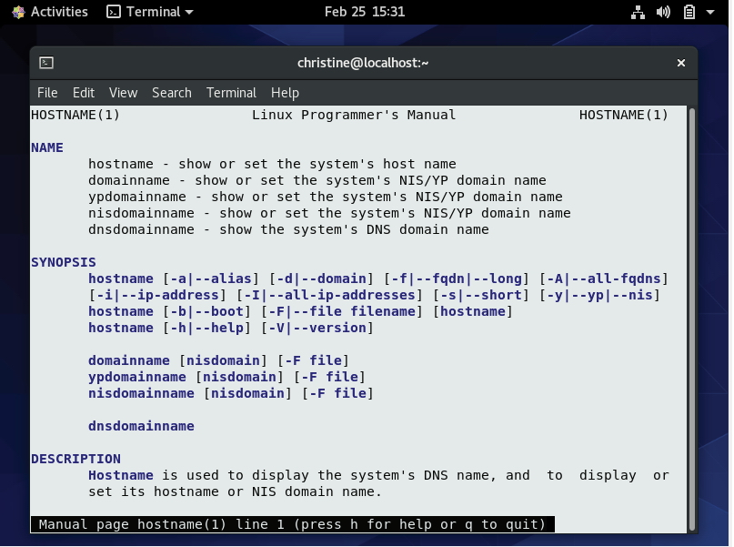
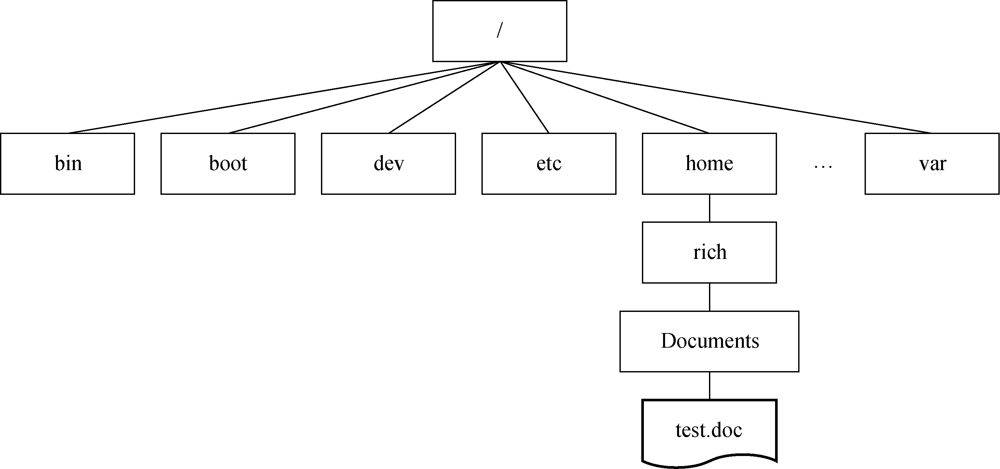
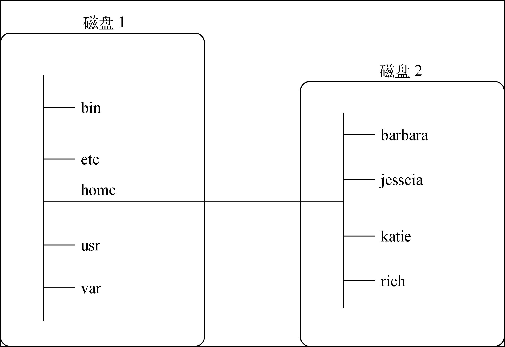
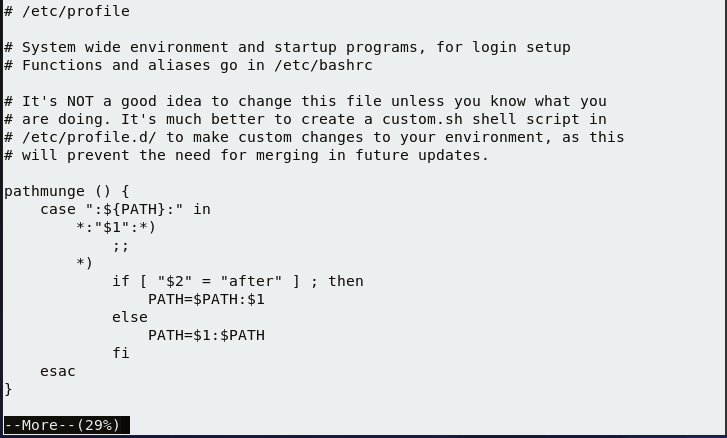

# 第3章_bash shell基础命令

很多 Linux 发行版的默认 shell 是 GNU bash shell。本章将介绍 bash shell 的基本特性，比如 bash 手册、命令行补全以及如何显示文件内容。我们会带你逐步了解怎样用 bash shell 提供的基础命令来处理 Linux 文件和目录。

## 1.启动shell

GNU bash shell 是一个程序，提供了对 Linux 系统的交互式访问。它是作为普通程序运行的，通常是在用户登录终端时启动。系统启动的 shell 程序取决于用户账户的配置。

`/etc/passwd`文件包含了所有系统用户账户以及每个用户的基本配置信息。下面是从 /etc/passwd 文件中摘取的样例条目：

```bash
christine:x:1001:1001::/home/christine:/bin/bash
```

每个条目包含 7 个数据字段，字段之间用冒号分隔。系统使用字段中的数据来赋予用户账户某些特性。第 7 章会对其中多数条目进行更加详细的讨论。现在先将注意力放在最后一个字段上，**该字段指定了用户使用的 shell 程序**。

> **注意**
>
> 尽管本书侧重于 GNU bash shell，但是也会谈及其他 shell。第 23 章将介绍如何使用这些 shell，比如 dash 和 tcsh。

在先前的 /etc/passwd 样例条目中，用户 christine 将 /bin/bash 作为自己的默认 shell 程序。这意味着在 christine 登录 Linux 系统后，GNU bash shell 会自行启动。

尽管 bash shell 会在登录时自行启动，但是否会出现 shell 命令行界面（CLI）取决于所使用的登录方式。如果采用的是虚拟控制台终端登录，那么 CLI 提示符会自动出现，接受 shell 命令输入。但如果是通过图形化桌面环境登录 Linux 系统，则需要启动图形化终端仿真器来访问 shell CLI 提示符。

## 2.使用shell提示符

启动终端仿真器包或登录 Linux 虚拟控制台之后会看到 shell CLI **提示符**。提示符是进入 shell 世界的大门，你可以在此输入 shell 命令。

默认的 bash shell 提示符是美元符号（`$`），这个符号表明 shell 在等待用户输入命令。不同的 Linux 发行版会采用不同格式的提示符。Ubuntu Linux 系统的 shell 提示符是这样的：

```bash
christine@UDesktop:~$
```

CentOS Linux系统的shell提示符是这样的：

```bash
[christine@localhost ~]$
```

除了作为 shell 的入口，提示符还能提供额外的辅助信息。在上面的两个例子中，提示符中显示了当前用户名 christine。除此之外，还包括 Ubuntu 系统的主机名 UDesktop 以及 CentOS 系统的主机名 localhost。随后在本章中你会学到更多可以在提示符中显示的内容。

> **提示**
>
> 如果刚接触 CLI，那么请记住，在提示符处入 shell 命令之后，还得按 Enter 键才能让命令生效。

shell 提示符并非一成不变。你可以根据需要修改提示符，第 6 章将讲解如何配置 shell CLI 提示符。

可以把 shell CLI 提示符想象成一位贴心的“助手”，它会帮助你使用 Linux 系统，给你有益的提示，告诉你什么时候 shell 可以接受新的命令。除此了解 shell 提示符，我们还可以参考 bash 手册。

## 3.与bash手册交互

大多数 Linux 发行版自带在线手册，可用于查找 shell 命令以及其他 GNU 实用工具的相关信息。熟悉手册对于使用各种 Linux 工具大有裨益，尤其是当你想要弄清各种命令行参数的时候。

`man`命令可以访问 Linux 系统的手册页。在`man`命令之后跟上想要查看的命令名，就可以显示相应的手册页。图 3-1 展示了如何查找`hostname`命令的手册页。输入命令`man hostname`即可进入该页面。

**图3-1　`hostname`命令的手册页**



注意图 3-1 中`hostname`命令的`DESCRIPTION`一节。这部分内容松散，字里行间充满了技术术语。bash 手册并不是按部就班的学习指南，而是作为快速参考来使用的。

> **提示**
>
> 如果你刚接触 bash shell，可能会觉得手册页也没那么有用。然而，随着逐渐习惯使用手册页，尤其是阅读`DESCRIPTION`部分的前一两段，最终你会从中学到各种技术术语，手册页也会变得越来越有用。

当你使用`man`命令查看命令手册页的时候，其中的信息是由**分页程序**（pager）来显示的。分页程序是一种实用工具，能够逐页（或逐行）显示文本。你可以点击`空格键`进行翻页，或是使用`Enter`键逐行查看。也可以使用箭头键向前和向后滚动手册页的内容（假设你使用的终端仿真软件包支持箭头键功能）。

如果阅读完毕，可以按 q 键退出手册页，然后你会重新获得 shell CLI 提示符，表明 shell 正在等待接受下一个命令。

> **提示**
>
> bas手册甚至包含了一份有关自身的参考信息。输入`man man`可以查看与手册页相关的信息。
>
> ```bash
> DESCRIPTION
>        man is the system's manual pager. Each page argument given to man is normally the name of a program, utility or function. 
> ```

手册页将与命令相关的信息分成了多段。每一段的惯用名标准如表 3-1 所示。

**表3-1　Linux手册页惯用的段名**

|      段       |            描述            |
| :-----------: | :------------------------: |
|     Name      | 显示命令名和一段简短的描述 |
|   Synopsis    |          命令语法          |
| Configuration |        命令配置信息        |
|  Description  |      命令的一般性描述      |
|    Options    |        命令选项描述        |
|  Exit Status  |       命令的退出状态       |
| Return Value  |        命令的返回值        |
|    Errors     |       命令的错误消息       |
|  Environment  |     命令使用的环境变量     |
|     Files     |       命令用到的文件       |
|   Versions    |       命令的版本信息       |
| Conforming To |       遵循的命名标准       |
|     Notes     |      其他有帮助的资料      |
|     Bugs      |      提交 bug 的途径       |
|    Example    |        命令用法示例        |
|    Authors    |     命令开发人员的信息     |
|   Copyright   |    命令源代码的版权状况    |
|   See Also    |   与该命令类似的其他命令   |

并不是每一个命令的手册页都包含表中列出的所有段名。另外，有些命令使用的段名并没有在上面的惯用标准中列出。

在命令概要部分中，你可以了解如何在命令行中输入该命令。很多命令采用的基本模式如下。

```bash
COMMAND-NAME [OPTION]... [ARGUMENT]...
```

下面是对以上命令的模式结构的解释。

- `*COMMAND-NAME*` 是要运行的命令名
- `[*OPTION*]` 是用于修改命令行为的选项。可添加的 `*OPTION*`（也称作**开关**）通常不止一个。中括号（`[]`）表示 `*OPTION*` 并不是必需的，3 个点号（`...`）表示可以一次指定多个 `*OPTION*`
- `*ARGUMENT*` 是传递给命令的参数，以指明命令的操作对象。从中括号可以看出，`*ARGUMENT*` 也不是必需的，也可以一次指定多个 `*ARGUMENT*`

> **提示**
>
> 如果想使用多个命令选项，那么**通常可以将其合并在一起**。例如，要使用选项`-a`和`-b`，可以写作`-ab`。

不同命令的作者不同，用法也各异。因此，命令手册页中的概要部分是了解该命令正确语法的好地方。

> **提示**
>
> 如果不记得命令名了，可以使用关键字来搜索手册页。语法为`man -k *keyword*`。例如，要查找与终端相关的命令，可以入`man -k terminal`。

除了按照惯例命名的各段，手册页中还有不同的节。每节都分配了一个数字，从 1 开始，一直到 9，如表 3-2 所示。

**表3-2　Linux手册页的节**

| 节号 |       所涵盖的内容       |
| :--: | :----------------------: |
|  1   | 可执行程序或 shell 命令  |
|  2   |         系统调用         |
|  3   |          库调用          |
|  4   |         特殊文件         |
|  5   |      文件格式与约定      |
|  6   |           游戏           |
|  7   |     概览、约定及杂项     |
|  8   | 超级用户和系统管理员命令 |
|  9   |   内核例程（routine）    |

`man`命令通常显示的是指定命令编号最低的节。例如，我们之前输入的是`man hostname`，注意在显示内容的左上角和右上角，单词`HOSTNAME`后的圆括号中有一个数字：(`1`)。这表示所显示的手册页来自第 1 节（可执行程序或 shell 命令）。

> **注意**
>
> 你的 Linux 系统手册页可能包含一些非标准的节编号。例如，1p 对应于可移植操作系统接口（portable operating system interface，POSIX）命令，3n 对应于网络函数。

一个命令偶尔会在多个节中都有对应的手册页。例如，`hostname`命令的手册页既包括该命令的相关信息，也包括对系统主机名的概述。通常默认显示编号最低的节。就像 hostname 的手册页那样，自动显示就是`hostname`手册页的第 1 节。如果想查看特定节，可以输入`man *section# topicname*`。因此，输入`man 7 hostname`，可以查看手册页中的第 7 节。

也可以只看各节内容的简介，输入`man 1 intro`来阅读第 1 节，输入`man 2 intro`来阅读第 2 节，输入`man 3 intro`来阅读第 3 节，以此类推。

手册页并非唯一的参考资料。还有另一种称作 info 页面的信息。可以输入`info info`来了解 info 页面的相关内容。

内建命令（参见第 5 章）有自己的帮助页面。有关帮助页面的更多信息，可以输入`help help`。（看出这里面的门道没有？）

另外，大多数命令接受`-h`或`--help`选项。例如，可以输入`hostname -help`来查看简要的帮助信息。

显然有不少有用的资源可供参考。但是，很多基本的 shell 概念还是需要详细的解释。下一节会介绍如何浏览 Linux 文件系统。

## 4.浏览文件系统

当登录系统并获得 shell 命令提示符后，你通常位于自己的主目录中。一般情况下，除了主目录，你还想探索 Linux 系统中的其他领域。本节将告诉你如何使用 shell 命令来实现这个目标。在开始前，先了解一下 Linux 文件系统，为下一步做铺垫。

### 4.1 Linux文件系统

如果刚接触 Linux 系统，你可能弄不清楚 Linux 如何引用文件和目录，而对已经习惯于 Microsoft Windows 操作系统方式的人来说更是如此。在继续探索 Linux 系统之前，最好先了解一下 Linux 采用的方法。

你会发现，两者的第一处不同是，Linux 的路径中不使用驱动器盘符。在 Windows 中，计算机上安装的物理驱动器的分区决定了文件路径。Windows 会为每个物理磁盘分区分配一个盘符，每个分区都有自己的目录结构，用于访问存储在其中的文件。

举例来说，在 Windows 中，你经常会看到这样的文件路径：

```bash
C:\Users\Rich\Documents\test.doc
```

这种 Windows 文件路径表明了文件 test.doc 究竟位于哪个磁盘分区中。如果将 test.doc 保存在由 E 标识的闪存中，那么文件的路径就是 E:\test.doc，表明文件位于 E 盘的根目录。

Linux 则采用另一种方式。Linux 会将文件存储在名为**虚拟目录**（virtual directory）的单个目录结构中。虚拟目录会将计算机中所有存储设备的文件路径都纳入单个目录结构。

Linux 虚拟目录结构只包含一个称为**根**（root）目录的基础目录。根目录下的目录和文件会按照其访问路径一一列出，这点跟 Windows 类似。

> **提示**
>
> 你会注意到 Linux 使用正斜线（`/`）而不是反斜线（`\`）来分隔文件路径中的目录。反斜线在 Linux 中用作转义字符，如果误用在文件路径中会造成各种各样的问题。如果你之前用的是 Windows 环境，那么可能得花点儿时间来适应。

如图 3-2 所示，在 Linux 中你会看到下面这样的路径。

```bash
/home/rich/Documents/test.doc
```

这表明文件 test.doc 位于 Documents 目录，该目录位于 rich 目录，而 rich 目录则包含在 home 目录中。要注意的是，路径本身并没有提供任何有关文件究竟存放在哪个物理磁盘中的信息。

Linux 虚拟目录中比较复杂的部分是它如何来协调管理各个存储设备。我们称在 Linux 系统中安装的第一块硬盘为**根驱动器**。根驱动器包含了虚拟目录的核心，其他目录都是从那里开始构建的。

**图3-2 Linux虚拟目录文件路径**



Linux 会使用根驱动器上一些特别的目录作为**挂载点**（mount point）。挂载点是虚拟目录中分配给额外存储设备的目录。Linux 会让文件和目录出现在这些挂载点目录中，即便它们位于其他物理驱动器中。

系统文件通常存储在根驱动器中，而用户文件则存储在其他驱动器中，如图 3-3 所示。

**图3-3　Linux文件结构**



图 3-3 展示了计算机中的两块硬盘。一块硬盘（Disk 1）与虚拟目录的根目录关联。其他硬盘可以挂载到虚拟目录结构中的任何地方。在这个例子中，另一块硬盘（Disk 2）被挂载到了 /home，这是用户主目录所在的位置。

Linux 文件系统结构演进自 Unix 文件系统。在 Linux 文件系统中，采用通用的目录名表示一些常见的功能。表 3-3 列出了一些常见的 Linux 顶层虚拟目录名及其内容。

**表3-3　常见的Linux目录名**

| 目录         | 用途                                                         |
| :----------- | :----------------------------------------------------------- |
| `/`          | 虚拟目录的根目录，通常不会在这里放置文件                     |
| `/bin`       | 二进制文件目录，存放了很多用户级的 GNU 实用工具              |
| `/boot`      | 引导目录，存放引导文件                                       |
| `/dev`       | 设备目录，Linux 在其中创建设备节点                           |
| `/etc`       | 系统配置文件目录                                             |
| `/home`      | 主目录，Linux 在其中创建用户目录（可选）                     |
| `/lib`       | 库目录，存放系统和应用程序的库文件                           |
| `/lib*name*` | 库目录，存放替代格式的系统和应用程序库文件（可选）           |
| `/media`     | 媒介目录，可移动存储设备的常用挂载点                         |
| `/mnt`       | 挂载目录，用于临时挂载文件系统的常用挂载点                   |
| `/opt`       | 可选目录，存放第三方软件包                                   |
| `/proc`      | 进程目录，存放现有内核、系统以及进程的相关信息               |
| `/root`      | root 用户的主目录（可选）                                    |
| `/run`       | 运行目录，存放系统的运行时数据                               |
| `/sbin`      | 系统二进制文件目录，存放了很多管理级的 GNU 实用工具          |
| `/srv`       | 服务目录，存放本地服务的相关文件                             |
| `/sys`       | 系统目录，存放设备、驱动程序以及部分内核特性信息             |
| `/tmp`       | 临时目录，可以在其中创建和删除临时工作文件                   |
| `/usr`       | 用户目录，一个次目录层级结构（secondary directory hierarchy） |
| `/var`       | 可变目录，存放经常变化的文件，比如日志文件                   |

在 CentOS Linux 系统中，根虚拟目录通常包含下列顶层目录：

```bash
bin   dev  home  lib64  mnt  proc  run   srv  tmp  var
boot  etc  lib   media  opt  root  sbin  sys  usr
```

/usr 目录值得特别关注，因为该目录是一个次目录层级结构，包含可共享的只读文件。你经常会在其中发现用户命令、源代码文件、游戏，等等。下面是 CentOS 系统中的 /usr 目录：

```bash
bin  games  include  lib  lib64  libexec  local  sbin  share  src  tmp
```

常见的 Linux 目录名均基于**文件系统层级标准**（filesystem hierarchy standard，FHS）。很多 Linux 发行版遵循了 FHS。这样一来，你就能够在任何兼容 FHS 的 Linux 系统中轻而易举地查找文件。

> **注意**
>
> FHS 偶尔会更新。你可能会发现有些 Linux 发行版仍在使用旧的 FHS 标准，而另一些发行版则只实现了部分当前标准。要想保持与 FHS 标准同步，请访问其官方主页。

当你登录系统并获得 shell CLI 提示符后，shell 会话会从你的主目录开始。主目录是分配给用户账户的一个特有目录。在创建用户账户时，系统通常会为其分配主目录（参见第 7 章）。

可以使用图形界面在虚拟目录中跳转。要想在 CLI 提示符下切换虚拟目录，需要使用`cd`命令。

### 4.2 遍历目录

在 Linux 文件系统中，可以使用目录切换（`cd`）命令来将 shell 会话切换到另一个目录。`cd`命令的语法非常简单：

```bash
cd destination
```

`cd`命令可以接受单个参数`*destination*`，用以指定你想切换到的目录名。如果没有为`cd`命令指定目标路径，则会切换到你的用户主目录。

`*destination*`参数可以用两种方式表示：一种是绝对路径，另一种是相对路径。

接下来将分别介绍这两种方法。这两者之间的不同对于理解文件系统遍历非常重要。

1. **绝对路径**

   用户可以在虚拟目录中采用**绝对路径**来引用目录名。绝对路径定义了在虚拟目录结构中，该目录从根目录开始的确切位置，相当于目录的全名。

   绝对路径总是以正斜线（`/`）作为起始，以指明虚拟文件系统的根目录。因此，如果要指向 usr 目录所包含的子目录 bin，可以写成下面这样：

   ```
   /usr/bin
   ```

   绝对路径可以清晰明确地表明用户想切换到的确切位置。要用绝对路径来到达文件系统中的某个特定位置，用户只需在`cd`命令后指定完整的路径名即可：

   ```bash
   [christine@localhost ~]$ cd /usr/bin
   [christine@localhost bin]$
   ```

   注意，在上面的例子中，提示符开头有一个波浪号（`~`）。在切换到另一个目录之后，这个波浪号被`bin`替代了。CLI 提示符正是用它来帮助你跟踪当前所在虚拟目录结构中的位置。波浪号表明 shell 会话当前位于你的主目录中。离开主目录之后，提示符中的目录也会随之发生变化（如果提示符已经进行了相关配置的话）。

   > **注意**
   >
   > 如果你的 shell CLI 提示符中没有显示 shell 会话的当前位置，那是因为没有进行相关的配置。如果希望修改 CLI 提示符，第 6 章会告诉你如何进行配置。

   如果尚未配置提示符来显示当前 shell 会话的绝对路径，也可以使用 shell 命令来显示所处的位置。`pwd`命令可以显示出 shell 会话的当前目录，该目录被称为**当前工作目录**。`pwd`命令的用法如下。

   ```bash
   [christine@localhost bin]$ pwd
   /usr/bin
   [christine@localhost bin]$
   ```

   > **提示**　在切换到新的当前工作目录时使用`pwd`命令，这是一个不错的习惯。因为很多 shell 命令是在当前工作目录中进行操作的，所以在发出命令之前，你应该总是确保自己处在正确的目录之中。

   可以使用绝对路径切换到 Linux 虚拟目录结构中的任何一级：

   ```bash
   [christine@localhost bin]$ cd /var/log
   [christine@localhost log]$ pwd
   /var/log
   [christine@localhost log]$
   ```

   也可以从 Linux 虚拟目录中的任何一级快速跳回到主目录：

   ```bash
   [christine@localhost log]$ cd
   [christine@localhost ~]$ pwd
   /home/christine
   [christine@localhost ~]$
   ```

   但如果只是在自己的主目录中工作，那么总是使用绝对路径未免显得太冗长了。假如你已经位于目录 /home/christine 中，那么再输入下面这样的命令切换到 Documents 目录就有些烦琐了：

   ```bash
   cd /home/christine/Documents
   ```

   幸好还有一种简单的解决方法。

2. **相对路径**

   **相对路径**允许你指定一个基于当前位置的目标路径。相对路径不以代表根目录的正斜线（`/`）开头，而是以目录名（如果你准备切换到当前工作目录下的某个目录的话）或是一个特殊字符开始。假如你位于 home 目录中，希望切换到 Documents 子目录，那么可以使用`cd`命令配合相对路径：

   ```bash
   [christine@localhost ~]$ pwd
   /home/christine
   [christine@localhost ~]$ cd Documents
   [christine@localhost Documents]$ pwd
   /home/christine/Documents
   [christine@localhost Documents]$
   ```

   注意，在上面的例子中并没有使用正斜线（`/`），而是使用相对路径将当前工作目录从 /home/christine 改为了 /home/christine/Documents，少敲了不少键盘。

   > **提示**
   >
   > 如果刚接触命令行和 Linux 目录结构，推荐你先暂时坚持使用绝对路径，等熟悉了目录布局之后再使用相对路径。

   可以在任何包含子目录的目录中使用带有相对路径的`cd`命令，也可以使用特殊字符来表示相对目录位置。

   有两个特殊字符可用于相对路径中：

   - 单点号（`.`），表示当前目录
   - 双点号（`..`），表示当前目录的父目录

   可以使用单点号，不过对`cd`命令来说这没有什么意义。随后你会看到其他命令是如何有效地在相对路径中使用单点号的。

   当在目录层级中移动时，双点号非常便利。如果你处于主目录下的 Documents 目录中，需要切换到主目录下的 Downloads 目录，可以这么做：

   ```bash
   [christine@localhost Documents]$ pwd
   /home/christine/Documents
   [christine@localhost Documents]$ cd ../Downloads
   [christine@localhost Downloads]$ pwd
   /home/christine/Downloads
   [christine@localhost Downloads]$
   ```

   双点号会先将你带到上一级目录，也就是用户的主目录，然后 /Downloads 这部分再将你带到下一级目录，即 Downloads 目录。必要时也可用多个双点号来向上切换目录。假如你现在位于主目录（/home/christine），想切换到 /etc 目录，可以输入如下命令：

   ```bash
   [christine@localhost ~]$ cd ../../etc
   [christine@localhost etc]$ pwd
   /etc
   [christine@localhost etc]$
   ```

   当然，在上面这种情况下，使用相对路径其实比绝对路径输入的字符更多，用绝对路径的话，用户只需输入 /etc 即可。因此，只在必要时才使用相对路径。

   > **注意**
   >
   > 在 shell CLI 提示符中显示足够的信息有好处，本节也正是这么做的。不过，出于清晰性的考虑，本书余下的例子只使用一个简单的`$`作为提示符。

   现在你已经知道如何遍历文件系统并确认当前工作目录，可以开始探索各种目录中究竟都有哪些内容了。下一节会学习如何查看目录中的文件。

## 5.列出文件和目录

要想知道系统中都有哪些文件，可以使用列表命令（`ls`）。本节将描述`ls`命令和可用来格式化其输出信息的选项。

### 5.1 显示基本列表

`ls`命令最基本的形式会显示当前目录下的文件和目录：

```bash
$ ls
Desktop    Downloads  my_script  Public     test_file
Documents  Music      Pictures   Templates  Videos
$
```

注意，`ls`命令输出的列表是按字母排序的（按列而不是按行排序）。如果你使用的终端仿真器支持色彩显示，那么`ls`命令还可以用不同的颜色来区分不同类型的文件。`LS_COLORS`环境变量（第 6 章会介绍环境变量）控制着这个特性。不同的 Linux 发行版会根据各自终端仿真器的能力来设置该环境变量。

如果没有安装彩色终端仿真器，可以使用`ls`命令的`-F`选项来轻松地区分文件和目录。使用`-F`选项可以得到如下输出：

```bash
$ ls -F
Desktop/    Downloads/  my_script*  Public/     test_file
Documents/  Music/      Pictures/   Templates/  Videos/
$
```

`-F`选项会在目录名之后添加正斜线（`/`），以方便用户在输出中分辨。类似地，它还会在可执行文件（比如上面的 my_script 文件）之后添加星号（`*`），以帮助用户找出可在系统中运行的文件。

基本的`ls`命令多少有些误导人。它显示了当前目录下的文件和子目录，但不是全部。Linux 经常使用**隐藏文件**来保存配置信息。在 Linux 中，隐藏文件通常是文件名以点号（`.`）开始的文件。这些文件并不会在`ls`命令的默认输出中出现。因此，我们称其为隐藏文件。

要想显示隐藏文件，可以使用`-a`选项。下面的例子是添加了`-a`选项的`ls`命令的输出：

```bash
$ ls -a
.              .bash_profile  Desktop    .ICEauthority  my_script  Templates
..             .bashrc        Documents  .local         Pictures   test_file
.bash_history  .cache         Downloads  .mozilla       .pki       Videos
.bash_logout   .config        .esd_auth  Music          Public
$
```

所有以点号开头的隐藏文件现在都显示出来了。注意有 4 个以 .bash 起始的文件。它们是 bash shell 环境所使用的隐藏文件，第 6 章会详述。

`-R`是`ls`命令的另一个选项，称作递归选项，可以列出当前目录所包含的子目录中的文件。如果子目录数量众多，则输出结果会很长。这里有个`-R`选项输出的简单例子。`-F`选项用于帮助你分辨文件类型：

```bash
$ ls -F -R
.:
Desktop/    Downloads/  my_script*  Public/     test_file
Documents/  Music/      Pictures/   Templates/  Videos/

./Desktop:

./Documents:

./Downloads:

./Music:
ILoveLinux.mp3*

./Pictures:

./Public:

./Templates:

./Videos:
$
```

注意，`-R`选项不仅显示了当前目录下的内容（也就是先前例子中用户主目录下的那些文件），还显示了用户主目录下所有子目录及其内容。只有 Music 子目录中包含了一个可执行文件 ILoveLinux.mp3。

> **提示**
>
> 选项并不是非得像例子中那样分开输入：`ls –F –R`。可以将其合并：`ls –FR`。

在先前的例子中，子目录中没有包含子目录。如果还有更多的子目录，则`-R`选项会继续遍历。如你所见，如果目录结构很庞大，则输出内容会变得很长。

### 5.2 显示长列表

在基本的输出列表中，`ls`命令并未显示关于每个文件的太多信息。要显示更多信息，另一个常用的选项是`-l`。`-l`选项会产生长列表格式的输出，提供目录中各个文件的详细信息：

```bash
$ ls -l
total 8
drwxr-xr-x. 2 christine christine  6 Feb 20 14:23 Desktop
drwxr-xr-x. 2 christine christine  6 Feb 20 14:23 Documents
drwxr-xr-x. 2 christine christine  6 Feb 20 14:23 Downloads
drwxr-xr-x. 2 christine christine 28 Feb 29 15:42 Music
-rwxrw-r--. 1 christine christine 74 Feb 29 15:49 my_script
drwxr-xr-x. 2 christine christine  6 Feb 20 14:23 Pictures
drwxr-xr-x. 2 christine christine  6 Feb 20 14:23 Public
drwxr-xr-x. 2 christine christine  6 Feb 20 14:23 Templates
-rw-rw-r--. 1 christine christine 74 Feb 29 15:50 test_file
drwxr-xr-x. 2 christine christine  6 Feb 20 14:23 Videos
$
```

在长列表格式输出中，每一行会列出一个文件或目录。除了文件名，输出中还包括其他有用信息。输出的第一行显示了为该目录中的文件所分配的总块数（8）。此后的每一行都包含了关于文件（或目录）的下列信息。

- 文件类型，比如目录（`d`）、文件（`-`）、链接文件（`l`）、字符设备（`c`）或块设备（`b`）
- 文件的权限（参见第 7 章）
- 文件的硬链接数（参见 6.4 节）
- 文件属主
- 文件属组
- 文件大小（以字节为单位）
- 文件的上次修改时间
- 文件名或目录名

`-l`选项功能强大。有了它，你可以看到任何文件或目录的绝大多数信息。

> **提示**
>
> 如果想查看单个文件的长列表，那么只需在`ls -l`命令之后跟上该文件名即可。但如果想查看目录的相关信息，而非目录所包含的内容，则除了`-l`选项之外，还得添加`-d`选项，即`ls -ld [*Directory-Name*]`。

在进行文件管理时，`ls`命令的很多选项能派上用场。如果在 shell 提示符中输入`man ls`，你会发现可用来修改`ls`命令输出的选项足足有好几页。

别忘了可以将多个选项合并。你经常会发现有些参数组合不仅能够显示所需的内容，而且还容易记忆，比如`ls –alF`。

### 5.3 过滤输出列表

如你所见，`ls`命令会默认输出目录下的所有非隐藏文件。有时这个输出显得过多，尤其是当你只需要查看少数文件时更是如此。

好在`ls`命令还支持在命令行中定义过滤器。`ls`会使用过滤器来决定应该在输出中显示哪些文件或目录。

在介绍过滤器之前，先通过`touch`命令（参见 5.4 节）创建一些文件。如果文件已存在，也不会对其造成影响：

```bash
$ touch my_script my_scrapt my_file
$ touch fall fell fill full
$ ls
Desktop    Downloads  fell  full   my_file    my_script  Public     test_file
Documents  fall       fill  Music  my_scrapt  Pictures   Templates  Videos
$
```

过滤器就是一个字符串，可用作简单的文本匹配。你可以将其作为命令行参数，放置在选项之后使用：

```bash
$ ls -l my_script
-rwxrw-r--. 1 christine christine 74 Feb 29 16:12 my_script
$
```

当指定特定的文件名作为过滤器时，`ls`命令只会显示该文件的信息。有时你可能不知道要找的那个文件的确切名称。`ls`命令也能识别标准通配符（wildcard），并在过滤器中用其来进行模式匹配：

- 问号（`?`）代表任意单个字符；
- 星号（`*`）代表零个或多个字符。

问号可以代表过滤器字符串中任意位置的**单个**字符。例如：

```bash
$ ls -l my_scr?pt
-rw-rw-r--. 1 christine christine  0 Feb 29 16:12 my_scrapt
-rwxrw-r--. 1 christine christine 74 Feb 29 16:12 my_script
$
```

过滤器`my_scr?pt`与目录中的两个文件匹配。类似地，星号可用来匹配**零个**或**多个**字符：

```bash
$ ls -l my*
-rw-rw-r--. 1 christine christine  0 Feb 29 16:12 my_file
-rw-rw-r--. 1 christine christine  0 Feb 29 16:12 my_scrapt
-rwxrw-r--. 1 christine christine 74 Feb 29 16:12 my_script
$
```

使用星号找到了 3 个名称以 my 开头的文件。和问号一样，可以将星号放在过滤器中的任意位置：

```bash
$ ls -l my_s*t
-rw-rw-r--. 1 christine christine  0 Feb 29 16:12 my_scrapt
-rwxrw-r--. 1 christine christine 74 Feb 29 16:12 my_script
$
```

在过滤器中使用星号和问号被称作**通配符匹配**（globbing），是指使用通配符进行模式匹配的过程。通配符正式的名称叫作**元字符通配符**（metacharacter wildcard）。除了星号和问号，还有更多的元字符通配符可做文件匹配之用。也可以试试方括号：

> 这里再特别说明一下 globbing 和 wildcard 的区别：globbing 是对 wildcard 进行扩展的过程。在贝尔实验室诞生的 Unix 中，有一个名为 glob（global 的简写）的独立程序（/etc/glob）。早期 Unix 版本（第 1\~6 版，1969 年 \~ 1975 年）的命令解释器（也就是 shell）都要依赖于该程序扩展命令中未被引用的 wildcard，然后将扩展后的结果传给命令执行。因此本书中将 globbing 译为“通配符匹配”，将 wildcard 译为“通配符”。

```bash
$ touch my_scrypt
$ ls -l my_scr[ay]pt
-rw-rw-r--. 1 christine christine 0 Feb 29 16:12 my_scrapt
-rw-rw-r--. 1 christine christine 0 Feb 29 16:18 my_scrypt
$
```

本例使用的是方括号以及在该位置上可能出现的两种字符：`a`或`y`。方括号代表单个字符位置并给出了该位置上的多个可能的选择。你可以像上面那样将可能的字符逐一列出，也可以指定字符范围，比如字母范围`[a–i]`：

```bash
$ ls f*ll
fall fell fill full
$ ls f[a-i]ll
fall fell fill
$
```

还可以使用惊叹号（`!`）将不需要的内容排除在外：

```bash
$ ls -l f[!a]ll
-rw-rw-r--. 1 christine christine 0 Feb 29 16:12 fell
-rw-rw-r--. 1 christine christine 0 Feb 29 16:12 fill
-rw-rw-r--. 1 christine christine 0 Feb 29 16:12 full
$
```

在搜索文件时，通配符匹配是一个功能强大的特性。它也可以用于`ls`以外的其他 shell 命令。在本章后续部分你会看到更多相关的例子。

## 6.处理文件

shell 提供了很多在 Linux 文件系统中操作文件的命令。本节将带你逐步了解文件处理所需要的一些基本的 shell 命令。

### 6.1 创建文件

你总会时不时地遇到要创建空文件的情况。有时应用程序希望在执行写入操作之前日志文件就已经存在。对此，可以使用`touch`命令轻松创建空文件：

```bash
$ touch test_one
$ ls -l test_one
-rw-rw-r--. 1 christine christine 0 Feb 29 17:24 test_one
$
```

`touch`命令会创建好指定的文件并将你的用户名作为该文件的属主。注意，新文件的大小为 0，因为`touch`命令只是创建了一个空文件。

`touch`命令还可用来改变文件的修改时间。该操作不会改变文件内容：

```bash
$ ls -l test_one
-rw-rw-r--. 1 christine christine 0 Feb 29 17:24 test_one
$ touch test_one
$ ls -l test_one
-rw-rw-r--. 1 christine christine 0 Feb 29 17:26 test_one
$
```

test_one 的修改时间从原先的 17:24 被更新为 17:26。

创建空文件和更改文件时间戳算不上你在 Linux 系统中的日常工作。不过复制文件可是你在使用 shell 时经常要干的活儿。

### 6.2 复制文件

将文件和目录从文件系统的一个位置复制到另一个位置可谓是系统管理员的日常操作。`cp`命令就可以完成这项任务。

`cp`命令最基本的用法需要两个参数，即源对象和目标对象：`cp *source destination*`。

当`*source*`和`*destination*`参数都是文件名时，`cp`命令会将源文件复制成一个新的目标文件，并以 destination 命名。新文件在形式上就像全新的文件一样，有新的修改时间：

```bash
$ cp test_one test_two
$ ls -l test_one test_two
-rw-rw-r--. 1 christine christine 0 Feb 29 17:26 test_one
-rw-rw-r--. 1 christine christine 0 Feb 29 17:46 test_two
$
```

新文件`test_two`和文件`test_one`的修改时间并不一样。如果目标文件已经存在，则`cp`命令可能并不会提醒你这一点。最好加上`-i`选项，强制 shell 询问是否需要覆盖已有文件：

```bash
$ ls -l test_one test_two
-rw-rw-r--. 1 christine christine 0 Feb 29 17:26 test_one
-rw-rw-r--. 1 christine christine 0 Feb 29 17:46 test_two
$
$ cp -i test_one test_two
cp: overwrite 'test_two'? n
$
```

如果不回答`y`，则停止文件复制。也可以将文件复制到现有目录中：

```bash
$ cp -i test_one /home/christine/Documents/
$
$ ls -l /home/christine/Documents/
total 0
-rw-rw-r--. 1 christine christine 0 Feb 29 17:48 test_one
$
```

新文件现在位于 Documents 目录中，文件名和原先一样。

> **注意**
>
> 先前的例子在目标目录名尾部加上了一个正斜线（/）。这表明 Documents 是一个目录而非文件。这有助于表明目的，而且在复制单个文件时非常重要。如果没有使用正斜线，同时子目录 /home/christine/Documents 又不存在，就会产生麻烦。在这种情况下，试图将一个文件复制到 Documents 子目录反而会创建名为 Documents 的文件，更是连错误消息都不会有。因此，记得在目标目录名尾部加上==正斜线==。

上一个例子中采用了绝对路径，不过也可以很方便地使用相对路径：

```bash
$ cp -i test_two Documents/
$ ls -l Documents/
total 0
-rw-rw-r--. 1 christine christine 0 Feb 29 17:48 test_one
-rw-rw-r--. 1 christine christine 0 Feb 29 17:51 test_two
$
```

之前讲过，一些特殊符号可以用在相对路径中，其中的单点号（`.`）就很适合用于`cp`命令。记住，单点号表示当前工作目录。如果需要将源文件名很长的文件复制到当前工作目录中，那么单点号能省不少事：

```bash
$ cp /etc/NetworkManager/NetworkManager.conf .
$ ls *.conf
NetworkManager.conf
$
```

想找到那个单点号可真不容易！仔细看的话，你会发现它在命令行的末尾。如果你的源文件名很长，那么使用单点号要比输入完整的目标对象名轻松多了。

`cp`命令的`-R`选项威力强大。可以用它在单个命令中递归地复制整个目录的内容：

```bash
$ ls -l Documents/
total 0
-rw-rw-r--. 1 christine christine 0 Feb 29 17:48 test_one
-rw-rw-r--. 1 christine christine 0 Feb 29 17:51 test_two
$
$ cp -R Documents/ NewDocuments/
$ ls -l NewDocuments/
total 0
-rw-rw-r--. 1 christine christine 0 Feb 29 17:55 test_one
-rw-rw-r--. 1 christine christine 0 Feb 29 17:55 test_two
$
```

在执行`cp –R`命令之前，目录 NewDocuments 并不存在。它是随着`cp –R`命令被创建的，整个 Documents 目录中的内容都被复制到其中。注意，新的 NewDocuments 目录中所有的文件都有对应的新日期。NewDocuments 目录现在已经成了 Documents 目录的完整副本。

> **提示**
>
> `cp`命令的选项远不止这里介绍的这些。别忘了可以使用`man cp`查看所有的可用选项。

也可以在`cp`命令中使用通配符：

```bash
$ ls
Desktop    fall  full     my_scrapt  NetworkManager.conf  Public     test_one
Documents  fell  Music    my_script  NewDocuments         Templates  test_two
Downloads  fill  my_file  my_scrypt  Pictures             test_file  Videos
$
$ cp my* NewDocuments/
$ ls NewDocuments/
my_file  my_scrapt  my_script my_scrypt  test_one  test_two
$
```

该命令将所有以 my 起始的文件都复制到了 NewDocuments 目录中。该目录现在包含 6 个文件。

在复制文件的时候，除了单点号和通配符，另一个 shell 特性也能派上用场，那就是命令行补全。

### 6.3 使用命令行补全（Tab）

使用命令行的时候，很容易输错命令、目录名或是文件名。实际上，对长目录名或文件名来说，输错的概率还是蛮高的。

这正是**命令行补全**（也称为**制表键补全**）挺身而出的时候。制表键补全允许你在输入文件名或目录名的时候，按一下制表键（`Tab`），让 shell 帮你将内容补充完整：

```bash
$ touch really_ridiculously_long_file_name
$
$ cp really_ridiculously_long_file_name NewDocuments/
$ ls NewDocuments/
my_file    my_script  really_ridiculously_long_file_name  test_two
my_scrapt  my_scrypt  test_one
$
```

在上面的例子中，我们输入了命令`cp really`，然后按制表键，shell 就将剩下的文件名自动补充完整了！当然，还得输入目标目录，不过仍然可以利用制表键补全来避免输入错误。

使用制表键补全的技巧在于要给 shell 提供足够的文件名信息，使其能够将所需文件名与其他文件名区分开。假如有另一个文件名也是以 really 开头，那么就算按了制表键，也无法自动补全。这时候你会听到嘟的一声。要是再按一下制表键，shell 会将所有以 really 开头的文件名都列出来。这个特性可以让你观察究竟应该输入哪些内容才能完成自动补全。

### 6.4 链接文件

链接文件是 Linux 文件系统的一个优势。如果需要在系统中维护同一文件的两个或多个副本，可以使用单个物理副本加多个虚拟副本（链接）的方法代替创建多个物理副本。**链接**是目录中指向文件真实位置的占位符。在 Linux 中有两种不同类型的文件链接。

- **符号链接**
- **硬链接**

**符号链接**（也称为**软链接**）是一个实实在在的文件，该文件指向存放在虚拟目录结构中某个地方的另一个文件。这两个以符号方式链接在一起的文件彼此的内容并不相同。

要为一个文件创建符号链接，原始文件必须事先存在。然后可以使用`ln`命令以及`-s`选项来创建符号链接：

```bash
$ ls -l test_file
-rw-rw-r--. 1 christine christine 74 Feb 29 15:50 test_file
$
$ ln -s test_file slink_test_file
$
$ ls -l *test_file
lrwxrwxrwx. 1 christine christine  9 Mar  4 09:46 slink_test_file -> test_file
-rw-rw-r--. 1 christine christine 74 Feb 29 15:50 test_file
$
```

在上面的例子中，注意符号链接文件名 slink_test_file 位于`ln`命令的第二个参数的位置。长列表（`ls -l`）中显示的符号文件名后的`->`符号表明该文件是链接到文件 test_file 的一个符号链接。

另外，还要注意符号链接文件与数据文件的文件大小。符号链接文件 slink_test_file 只有 9 个字节，而 test_file 有 74 个字节。这是因为 slink_test_file 仅仅只是指向 test_file 而已。它们的内容并不相同，是两个完全不同的文件。

另一种证明链接文件是一个独立文件的方法是查看 inode 编号。文件或目录的 inode 编号是内核分配给文件系统中的每一个对象的唯一标识。要查看文件或目录的 inode 编号，可以使用`ls`命令的`-i`选项：

```bash
$ ls -i *test_file
1415020 slink_test_file  1415523 test_file
$
```

可以看出，test_file 文件的 inode 编号是 1415523，而 slink_test_file  的 inode 编号则是 1415020。所以说两者是不同的文件。

**硬链接**创建的是一个独立的虚拟文件，其中包含了原始文件的信息以及位置。但是两者就根本而言是同一个文件。要想创建硬链接，原始文件也必须事先存在，只不过这次使用`ln`命令时不需要再加入额外的选项了：

```bash
$ ls -l *test_one
-rw-rw-r--. 1 christine christine 0 Feb 29 17:26 test_one
$
$ ln test_one hlink_test_one
$
$ ls -li *test_one
1415016 -rw-rw-r--. 2 christine christine 0 Feb 29 17:26 hlink_test_one
1415016 -rw-rw-r--. 2 christine christine 0 Feb 29 17:26 test_one
$
```

在上面的例子中，创建好硬链接文件之后，我们使用`ls -li`命令显示了`*test_one`的 inode 编号以及长列表。注意，以硬链接相连的文件共享同一个 inode 编号。这是因为两者其实就是同一个文件。另外，彼此的文件大小也一模一样。

> **注意**
>
> 只能对处于同一存储设备的文件创建硬链接。要想在位于不同存储设备的文件之间创建链接，只能使用符号链接。也就是说，硬链接不能跨文件系统，而符号链接可以跨文件系统。

你可能觉得符号链接和硬链接的概念不好理解。好在接下来要介绍的文件重命名要简单好多。

### 6.5 文件重命名

在 Linux 中，重命名文件称为**移动**（moving）。`mv`命令可以将文件和目录移动到另一个位置或是重新命名：

```bash
$ ls -li f?ll
1414976 -rw-rw-r--. 1 christine christine 0 Feb 29 16:12 fall
1415004 -rw-rw-r--. 1 christine christine 0 Feb 29 16:12 fell
1415005 -rw-rw-r--. 1 christine christine 0 Feb 29 16:12 fill
1415011 -rw-rw-r--. 1 christine christine 0 Feb 29 16:12 full
$
$ mv fall fzll
$
$ ls -li f?ll
1415004 -rw-rw-r--. 1 christine christine 0 Feb 29 16:12 fell
1415005 -rw-rw-r--. 1 christine christine 0 Feb 29 16:12 fill
1415011 -rw-rw-r--. 1 christine christine 0 Feb 29 16:12 full
1414976 -rw-rw-r--. 1 christine christine 0 Feb 29 16:12 fzll
$
```

注意，移动文件会将文件名从 fall 更改为 fzll，但 inode 编号和时间戳保持不变。这是因为`mv`只**影响文件名**。

也可以使用`mv`来移动文件的位置：

```bash
$ ls -li /home/christine/fzll
1414976 -rw-rw-r--. 1 christine christine 0 Feb 29 16:12 /home/christine/fzll
$
$ ls -li /home/christine/NewDocuments/fzll
ls: cannot access '/home/christine/NewDocuments/fzll': No such file or directory
$
$ mv /home/christine/fzll /home/christine/NewDocuments/
$
$ ls -li /home/christine/NewDocuments/fzll
1414976 -rw-rw-r--. 1 christine christine 0 Feb 29 16:12
/home/christine/NewDocuments/fzll
$
$ ls -li /home/christine/fzll
ls: cannot access '/home/christine/fzll': No such file or directory
$
```

在上面的例子中，我们使用`mv`命令将文件 fzll 从 /home/christine 移动到了 /home/christine/NewDocuments。该操作同样没有改变文件的 inode 编号或时间戳。

> **提示**
>
> 和`cp`命令类似，你也可以在`mv`命令中使用`-i`选项。这样在`mv`试图覆盖已有的文件时会发出询问。

唯一变化的就是文件的位置。/home/christine 目录下再也没有文件 fzll 了，因为该文件已经离开了原先的位置，这正是`mv`命令所做的事情。

可以使用`mv`命令在移动文件的同时进行重命名：

```bash
$ ls -li NewDocuments/fzll
1414976 -rw-rw-r--. 1 christine christine 0 Feb 29 16:12 NewDocuments/fzll
$
$ mv /home/christine/NewDocuments/fzll /home/christine/fall
$
$ ls -li /home/christine/fall
1414976 -rw-rw-r--. 1 christine christine 0 Feb 29 16:12 /home/christine/fall
$
$ ls -li /home/christine/NewDocuments/fzll
ls: cannot access '/home/christine/NewDocuments/fzll': No such file or directory
$
```

在这个例子中，我们将文件 fzll 从子目录 NewDocuments 移动到了主目录 /home/christine，并将其更名为 fall。文件的时间戳和 inode 编号都没有改变。改变的只有位置和名称。

也可以使用`mv`命令移动整个目录及其内容：

```bash
$ ls NewDocuments
my_file    my_script  really_ridiculously_long_file_name  test_two
my_scrapt  my_scrypt  test_one
$
$ mv NewDocuments OldDocuments
$
$ ls NewDocuments
ls: cannot access 'NewDocuments': No such file or directory
$
$ ls OldDocuments
my_file    my_script  really_ridiculously_long_file_name  test_two
my_scrapt  my_scrypt  test_one
$
```

目录内容没有变化。只有目录名发生了改变。

在知道了如何使用`mv`命令进行重命名……不对……**移动**文件之后，你会发现这其实非常容易。另一个虽然简单但可能有危险的任务是删除文件。

### 6.6 删除文件

迟有一天，你会想要删除已有的文件。不管是清理文件系统还是删除临时工作数据，总要去删除文件。

在 Linux 中，删除（deleting）叫作**移除**（removing）。bash shell 中用于删除文件的命令是`rm`。`rm`命令的基本格式非常简单：

```bash
$ rm -i fall
rm: remove regular empty file 'fall'? y
$ ls fall
ls: cannot access 'fall': No such file or directory
$
```

注意，`-i`选项会询问你是否真的要删除该文件。shell 没有回收站或者垃圾箱这样的东西，文件一旦被删除，就再也找不回来了。所以在使用`rm`命令时，要养成总是加入`-i`选项的好习惯。

也可以使用通配符元字符删除一组文件。别忘了使用`-i`选项：

```bash
$ rm -i f?ll
rm: remove regular empty file 'fell'? y
rm: remove regular empty file 'fill'? y
rm: remove regular empty file 'full'? y
$ ls f?ll
ls: cannot access 'f?ll': No such file or directory
$
```

`rm`命令的另一个特性是，如果你要删除很多文件，又不想被命令提示干扰，可以用`-f`选项来强制删除。小心为妙！

## 7.管理目录

在 Linux 中，有些命令（比如`cp`命令）对文件和目录都有效，有些命令则只对目录有效。你需要使用本节介绍的特定命令来创建新目录。删除目录也很有意思，本节也会讲到。

### 7.1 创建目录

在 Linux 中创建目录很简单，使用`mkdir`命令即可：

```bash
$ mkdir New_Dir
$ ls -ld New_Dir
drwxrwxr-x. 2 christine christine 6 Mar 6 14:40 New_Dir
$
```

系统创建了一个名为 New_Dir 的新目录。注意，在长列表输出中，目录以 d 开头。这表示 New_Dir 并不是文件，而是一个目录。

可以根据需要“批量”地创建目录和子目录。为此，要使用`mkdir`命令的`-p`选项：

```bash
$ mkdir -p New_Dir/SubDir/UnderDir
$ ls -R New_Dir
New_Dir:
SubDir

New_Dir/SubDir:
UnderDir

New_Dir/SubDir/UnderDir:
$
```

`mkdir`命令的`-p`选项可以根据需要创建缺失的**父目录**。父目录是包含目录树中下一级目录的目录。

当然了，创建好目录后，必须知道怎样删除目录。尤其是当你把目录建错地方的时候。

### 7.2 删除目录

删除目录是件棘手的事情，这是有原因的。删除目录时，很有可能会出岔子。shell 会尽可能地防止我们捅娄子。

删除目录的基本命令是`rmdir`：

```bash
$ mkdir Wrong_Dir
$ touch Wrong_Dir/newfile
$
$ rmdir Wrong_Dir/
rmdir: failed to remove 'Wrong_Dir/': Directory not empty
$
```

在默认情况下，`rmdir`命令只删除**空**目录。因为我们在 Wrong _ Dir 目录下创建了一个文件 newfile，所以`rmdir`命令会拒绝删除该目录。

要想删除这个目录，需要先把目录中的文件删掉，然后才能在空目录中使用`rmdir`命令：

```bash
$ rm -i Wrong_Dir/newfile
rm: remove regular empty file 'Wrong_Dir/newfile'? y
$ rmdir Wrong_Dir/
$ ls Wrong_Dir
ls: cannot access 'Wrong_Dir': No such file or directory
$
```

`rmdir`并没有`-i`选项可以用来询问是否要删除目录。这也是为什么说`rmdir`只能删除空目录是件好事。

也可以在整个非空目录中使用`rm`命令。`-r`选项使得`rm`命令可以向下进入（descend into）目录，删除其中的文件，然后再删除目录本身：

```bash
$ mkdir TestDir
$ touch TestDir/fileone TestDir/filetwo
$ ls TestDir
fileone  filetwo
$ rm -ir TestDir
rm: descend into directory 'TestDir'? y
rm: remove regular empty file 'TestDir/fileone'? y
rm: remove regular empty file 'TestDir/filetwo'? y
rm: remove directory 'TestDir'? y
$ ls TestDir
ls: cannot access 'TestDir': No such file or directory
$
```

这种方法同样可以向下进入多个子目录，当需要删除大量的目录和文件时，这一点尤为管用：

```bash
$ touch New_Dir/testfile
$ ls -FR New_Dir
New_Dir:
SubDir/  testfile

New_Dir/SubDir:
UnderDir/

New_Dir/SubDir/UnderDir:
$
$ rm -iR New_Dir
rm: descend into directory 'New_Dir'? y
rm: descend into directory 'New_Dir/SubDir'? y
rm: remove directory 'New_Dir/SubDir/UnderDir'? y
rm: remove directory 'New_Dir/SubDir'? y
rm: remove regular empty file 'New_Dir/testfile'? y
rm: remove directory 'New_Dir'? y
$
```

虽然这种方法可行，但不太好用。你依然要确认每个文件是否要被删除。如果该目录中有很多个文件和子目录，则会非常琐碎。

> **注意**　对于`rm`命令，`-r`选项和`-R`选项的效果是一样的，都可以递归地删除目录中的文件。shell 命令很少会对相同的功能使用大小写不同的选项。

一口气删除目录树的最终解决方案是使用`rm -rf`命令。该命令不声不响，能够直接删除指定目录及其所有内容。当然，这肯定是一个非常危险的命令，所以务必谨慎使用，并再三检查你要进行的操作是否符合预期。

在前面几节中，我们研究了文件和目录的管理。到目前为止，除了如何查看文件内容，本章已经涵盖了你需要知道的关于文件的一切。

## 8.查看文件内容

有几个命令可以直接查看文件的内容，不需要调用其他文本编辑器（参见第 10 章）。本节将展示其中部分命令。

### 8.1 查看文件类型

在显示文件内容之前，应该先了解文件类型。如果你尝试显示二进制文件，那么屏幕上会出现各种乱码，甚至会把你的终端仿真器挂起。

`file`命令是一个方便的小工具，能够探测文件的内部并判断文件类型：

```bash
$ file .bashrc
.bashrc: ASCII text
$
```

上例中是一个 ASCII text 类型的文件。`file`命令不仅能够确定文件中包含的是文本信息，还能确定该文本文件的字符编码是 ASCII。

下面例子中的文件就是一个目录。因此，以后可以使用`file`命令作为另一种区分目录的方法：

```
$ file Documents
Documents/: directory
$
```

第三个`file`命令的例子中展示的是一个符号链接文件。注意，`file`命令甚至能够告诉你它链接到了哪个文件：

```bash
$ file slink_test_file
slink_test_file: symbolic link to test_file
$
```

下面的例子展示了`file`命令对于脚本文件的返回结果。尽管这个文件是 ASCII text，但因为是脚本文件，所以可以在系统中执行（运行）：

```bash
$ file my_script
my_script: Bourne-Again shell script, ASCII text executable
$
```

最后一个例子是二进制可执行程序。`file`命令能够确定该程序编译时所面向的平台以及需要何种类型的库。如果有从未知来源处获得的二进制文件，那么这会是一个非常有用的特性：

```
$ file /usr/bin/ls
/usr/bin/ls: ELF 64-bit LSB shared object, x86-64, version 1 (SYSV),
dynamically linked, interpreter /lib64/ld-linux-x86-64.so.2,
for GNU/Linux 3.2.0,[...]
$
```

现在你已经学会了如何快速查看文件类型，接下来可以开始学习文件的显示与浏览了。

### 8.2 查看整个文件

如果手头有一个很大的文本文件，你可能会想看看里面到底是什么。Linux 有 3 个不同的命令可以完成这个任务。

1. **`cat`命令**

   `cat`命令是显示文本文件中所有数据的得力工具：

   ```bash
   $ cat test_file
   Hello World
   Hello World again
   Hello World a third time
   How are you World?
   
   $
   ```

   没什么特别的，就是文本文件的内容而已。这里还有一些可以和`cat`命令配合使用的选项，可能会对你有所帮助。

   `-n`选项会给所有的行加上行号：

   ```bash
   $ cat -n test_file
        1  Hello World
        2  Hello World again
        3  Hello World a third time
        4  How are you World?
        5
   $
   ```

   这个功能在检查脚本时会很方便。如果只想给有文本的行加上行号，可以用`-b`选项：

   ```bash
   $ cat -b test_file
        1  Hello World
        2  Hello World again
        3  Hello World a third time
        4  How are you World?
   $
   ```

   对大文件来说，`cat`命令多少有些烦人。文件内容会在屏幕上一闪而过。好在有一种简单的方法可以解决这个问题。

2. **`more`命令**

   `cat`命令的主要缺点是其开始运行之后你无法控制后续操作。为了解决这个问题，开发人员编写了`more`命令。`more`命令会显示文本文件的内容，但会在显示每页数据之后暂停下来。我们输入命令`more /etc/profile`会生成图 3-4 所示的内容。

   **图3-4　使用`more`命令显示文本文件**

   

   注意，在图 3-4 的屏幕底部，`more`命令显示了一个标签，说明你仍然处于`more`应用程序中，以及当前在文本文件中所处的位置。这是`more`命令的提示符。

   > **提示**
   >
   > 如果按照示例进行操作，但所用的 Linux 系统中没有 /etc/profile 文件或是文件内容很少，则可以尝试改用 /etc/passwd 文件。在命令行中输入 more /etc/passwd，然后按 Enter 键。

   `more`命令是一个分页工具。本章先前讲过，当你使用`man`命令时，分页工具会显示指定的 bash 手册页。和在手册页中浏览方法一样，你可以使用空格键翻页，或是使用 Enter 键逐行查看。结束之后，按 q 键退出。

   `more`命令只支持文本文件中基本的移动。如果想要更多的高级特性，可以试试`less`命令。

3. **`less`命令**

   尽管名字不如`more`命令那样高级，但`less`命令的命名实际上玩了个文字游戏（从俗语“less is more”得来），实为`more`命令的升级版本。`less`命令提供了多个非常实用的特性，能够实现在文本文件中前后翻动，还有一些高级搜索功能。

   `less`命令还可以在完成整个文件的读取之前显示文件的内容。`cat`命令和`more`命令则无法做到这一点。

   `less`命令的操作和`more`命令基本一样，一次显示一屏的文件文本。除了支持和`more`命令相同的命令集，它还包括更多的选项。

   > **提示**
   >
   > 输入`man less`可以查看`less`命令的所有可用选项，也可以使用相同的方法查看`more`命令的各种选项。

   `less`命令能够识别上下箭头键以及上下翻页键（假设你的终端配置正确）。在查看文件内容时，这赋予了你全面的控制权。

   > **注意**
   >
   > `less`通常为手册页提供分页服务。你对`less`了解得越多，阅读各种命令手册页的时候就越得心应手。

### 8.3 查看部分文件

你要查看的数据经常位于文本文件的开头或末尾。如果数据是在一个大型文件的开头，那就只能干等着`cat`或`more`载入整个文件。如果数据是在文件末尾（比如日志文件），则需翻过成千上万行的文本才能看到最后那部分。好在 Linux 有专门的命令可以解决这两个问题。

1. **`tail`命令**

   `tail`命令会显示文件最后几行的内容（文件的“尾部”）。在默认情况下，它会显示文件的末尾 10 行。

   作为演示，我们创建一个包含 15 行文本的文本文件。使用`cat`命令显示该文件的全部内容如下：

   ```bash
   $ cat log_file
   line1
   line2
   line3
   line4
   Hello World - line5
   line6
   line7
   line8
   line9
   Hello again World - line10
   line11
   line12
   line13
   line14
   Last Line - line15
   $
   ```

   现在可以看看使用`tail`命令浏览文件最后 10 行的效果：

   ```bash
   $ tail log_file
   line6
   line7
   line8
   line9
   Hello again World - line10
   line11
   line12
   line13
   line14
   Last Line - line15
   $
   ```

   可以向`tail`命令中加入`-n`选项来修改所显示的行数。在下面的例子中，通过加入`-n 2`，使得`tail`命令只显示文件的最后两行：

   ```bash
   $ tail -n 2 log_file
   line14
   Last Line - line15
   $
   ```

   `tail`命令有一个**非常酷**的特性：`-f`选项，该选项允许你在其他进程使用此文件时查看文件的内容。`tail`命令会保持活动状态并持续地显示添加到文件中的内容。这是**实时监测系统日志**的绝佳方式。

2. **`head`命令**

   `head`命令会显示文件开头若干行（文件的“头部”）。在默认情况下，它会显示文件前 10 行的文本：

   ```bash
   $ head log_file
   line1
   line2
   line3
   line4
   Hello World - line5
   line6
   line7
   line8
   line9
   Hello again World - line10
   $
   ```

   与`tail`命令类似，`head`命令也支持`-n`选项，以便指定想要显示的内容。这两个命令也允许简单地在连字符后面直接输入想要显示的行数：

   ```bash
   $ head -3 log_file
   line1
   line2
   line3
   $
   ```

   文件的开头部分通常不会改变，因此`head`命令并没有`tail`命令那样的`-f`选项。`head`命令是一种查看文件起始部分内容的便捷方法。

## 9.小结

本章涵盖了在 shell 提示符下处理 Linux 文件系统的基础知识。一开始我们讨论了 bash shell，展示了如何与 shell 交互。CLI 使用提示符来表明可以接受命令输出。

shell 提供了大量可用于创建和操作文件的工具。在开始处理文件之前，应该先理解 Linux 如何存储文件。本章讨论了 Linux 虚拟目录的基础知识，展示了 Linux 如何引用存储设备。在描述了 Linux 文件系统之后，带领你逐步了解了如何使用`cd`命令在虚拟目录中切换目录。

在知道了如何进入指定目录后，我们又演示了怎样用`ls`命令来列出目录中的文件和子目录。`ls`命令有很多选项可用来定制输出内容。你可以通过`ls`命令获得有关文件和目录的信息。

`touch`命令是一个创建空文件和变更已有文件访问时间或修改时间的实用工具。我们介绍了如何使用`cp`命令将已有文件从一个位置复制到另一个位置。还介绍了如何链接文件，这提供了一种无须赋值，就可以在两个位置上拥有同一个文件的简单方法。`ln`命令能够实现文件链接功能。

接着我们介绍了怎样用`mv`命令重命名文件（在 Linux 中称为**移动**文件），以及如何用`rm`命令删除文件（在Linux中称为**移除**文件），还介绍了怎样用`mkdir`和`rmdir`命令创建和删除目录。

最后，本章以查看文件内容作结。`cat`、`more`和`less`命令可以非常方便地查看文件的全部内容，而`tail`和`head`命令则可查看文件中的一小部分内容。