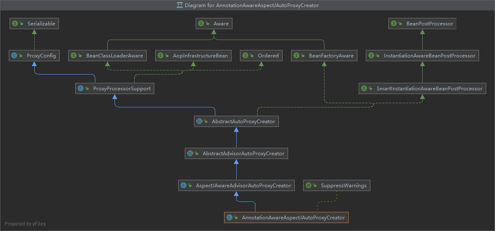
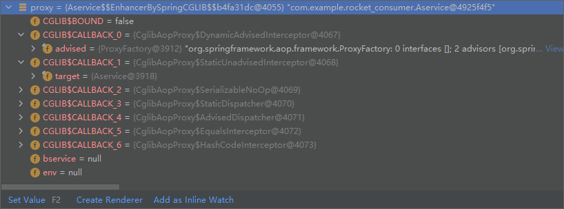

# AOP

## 1.功能测试

指在程序运行期间动态的将某段代码切入到指定方法指定位置进行运行的编程方式（动态代理）。

1. 导入 AOP 模块：**spring-aspects**

   ```xml
   <dependency>
       <groupId>org.springframework</groupId>
       <artifactId>spring-aspects</artifactId>
       <version>4.3.12.RELEASE</version>
   </dependency>
   ```

2. 添加一个业务逻辑类：**MathCalculator**，希望实现在业务逻辑运行时将日志打印（方法开始前，运行结束时，出现异常时等）

   ```java
   public class MathCalculator {
       public int div(int i, int j) {
           return i / j;
       }
   }
   ```

3. 定义一个日志切面类：**LogAspects**

   1. 给切面类加注解`@Aspect`，切面里的方法需要动态感知`MathCalculator.div()`运行到哪里然后执行
   2. 给切面类的方法标注何时何地运行（通知注解）
   3. **前置通知**(`@Before`)：在目标方法（div）运行之前运行——logStart
   4. **后置通知**(`@After`)：在目标方法（div）运行结束最后才运行（无论方法正常结束还是异常结束）——logEnd
   5. **返回通知**(`@AfterReturning`)：在目标方法（div）正常返回之后运行——logReturn
   6. **异常通知**(`@AfterThrowing`)：在目标方法（div）出现异常之后运行——logException
   7. **环绕通知**(`@Around`)：动态代理，手动推进目标方法运行（`joinPoint.proceed()`）

   ```java
   /**
    * 切入类
    */
   @Aspect
   public class LogAspects {
   
       // 抽取公共切入点
       // 在目标方法之前，切入点表达式（指定在哪个方法切入）
       @Pointcut("execution(public int com.youyi.boot.aop.MathCalculator.*(..)) && @annotation(com.youyi.performance)")
       // @Pointcut("execution(public int com.youyi.boot.aop.MathCalculator.*(..)) || @annotation(com.youyi.performance)")
       public void pointCut(){};
   
       // JoinPoint：获取方法名，参数等，必须写在参数的第一位
       // 1.本类引用
       @Before("pointCut()")
       @performance
       public void logStart(JoinPoint joinPoint) {
           System.out.println(joinPoint.getSignature().getName() + "运行。。。参数列表是{" + Arrays.asList(joinPoint.getArgs()) + "}");
       }
   
       // 2.其他切面引用
       @After("com.youyi.boot.aop.LogAspects.pointCut()")
       @performance
       public void logEnd(JoinPoint joinPoint) {
           System.out.println(joinPoint.getSignature().getName() + "结束");
       }
   
       // @AfterReturning 的 returning 属性可以接受目标方法的执行结果
       @AfterReturning(value="pointCut()", returning="result")
       @performance
       public void logReturn(JoinPoint joinPoint, Object result) {
           System.out.println(joinPoint.getSignature().getName() + "正常返回，运行结果为{"+ result +"}");
       }
   
       @AfterThrowing(value="pointCut()", throwing="exception")
       @performance
       public void logException(JoinPoint joinPoint, Exception exception) {
           System.out.println(joinPoint.getSignature().getName() + "异常，异常信息为{"+ exception +"}");
       }
   }
   ```

4. 开启 aop 模式，将目标方法和切面方法加入容器中

   - xml 方式

     ```xml
     <aop:aspectj-autoproxy></aop:aspectj-autoproxy>
     ```

   - 配置类方式

     ```java
     @EnableAspectJAutoProxy
     @Configuration
     public class MainConfigOfAOP {
     
         @Bean
         public MathCalculator mathCalculator() {
             return new MathCalculator();
         }
     
         @Bean
         public LogAspects logAspects() {
             return new LogAspects();
         }
     }
     ```

5. 测试

   ```java
   @Test
   public void testAOP() {
       AnnotationConfigApplicationContext applicationContext = new AnnotationConfigApplicationContext(MainConfigOfAOP.class);
       MathCalculator bean = applicationContext.getBean(MathCalculator.class);
       bean.div(1, 0);
   }
   ```

## 2.AOP组件的导入

### 2.1 @EnableAspectJAutoproxy

给容器中导入`AspectJAutoProxyRegistrar`

```java
@Import(AspectJAutoProxyRegistrar.class)
public @interface EnableAspectJAutoProxy {
}
```

### 2.2 导入AspectJAutoProxyRegistrar

`AspectJAutoProxyRegistrar`实现了`ImportBeanDefinitionRegistrar`接口，在【注册剩余`configClass`的`BeanDefinitions`】时被加载。

向容器中加入了`org.springframework.aop.config.internalAutoProxyCreator`：`AnnotationAwareAspectJAutoProxyCreator`。

```java
class AspectJAutoProxyRegistrar implements ImportBeanDefinitionRegistrar {
    @Override
    public void registerBeanDefinitions(AnnotationMetadata importingClassMetadata, BeanDefinitionRegistry registry) {
        // 利用 AspectJAutoProxyRegistrar 给容器中注册 bean 的 BeanDefinition：org.springframework.aop.config.internalAutoProxyCreator：AnnotationAwareAspectJAutoProxyCreator
        // 该过程不会创建对象
        AopConfigUtils.registerAspectJAnnotationAutoProxyCreatorIfNecessary(registry);

        AnnotationAttributes enableAspectJAutoProxy =
            AnnotationConfigUtils.attributesFor(importingClassMetadata, EnableAspectJAutoProxy.class);
        if (enableAspectJAutoProxy != null) {
            if (enableAspectJAutoProxy.getBoolean("proxyTargetClass")) {
                AopConfigUtils.forceAutoProxyCreatorToUseClassProxying(registry);
            }
            if (enableAspectJAutoProxy.getBoolean("exposeProxy")) {
                AopConfigUtils.forceAutoProxyCreatorToExposeProxy(registry);
            }
        }
    }
}
```

### 2.3 创建AnnotationAwareAspectJAutoProxyCreator

由于`AnnotationAwareAspectJAutoProxyCreator`是一个`BeanPostProcessor`并实现了`Ordered`接口，在【注册`BeanPostProcessor`】时，创建了`AnnotationAwareAspectJAutoProxyCreator`，并加入了容器中。



## 3.创建代理对象过程

由于`AnnotationAwareAspectJAutoProxyCreator`实现了`InstantiationAwareBeanPostProcessor`，在【初始化所有剩下的单实例 Bean】，【执行`BeanPostProcessor`的`postProcessAfterInitialization()`】时，会调用父类`AbstractAutoProxyCreator`的`postProcessAfterInitialization()`来创建代理对象。

**识别添加增强方法**

在【Bean初始化】阶段，【执行`BeanPostProcessor`的`postProcessAfterInitialization()`】时，被`AnnotationAwareAspectJAutoProxyCreator`拦截，调用`AbstractAdvisorAutoProxyCreator`类的`getAdvicesAndAdvisorsForBean()`方法获取所有支持的增强器。

## 4.执行目标方法

实际的目标方法的代理对象容器中保存了组件的代理对象（CGlib 增强后的对象），还保存了详细信息：增强器，目标对象等。

代理对象封装了一个`CglibAopProxy`的私有静态内部类`DynamicAdvisedInterceptor`对象用于拦截方法的执行，并将原始对象封装起来。



具体执行过程参考流程图。

## 5.总结

- `@EnableAspectJAutoProxy`：开启 AOP 功能

- `@EnableAspectJAutoProxy`：会给容器注册一个组件`AnnotationAwareAspectJAutoProxyCreator`， 是一个后置处理器，在【`Bean`初始化阶段】的【执行`BeanPostProcessor`的`postProcessAfterInitialization()`】创建 AOP 代理对象。

- 代理对象创建流程

  1. `registerBeanPostProcessors()` 注册后置处理器，创建`AnnotationAwareAspectJAutoProxyCreator`

  2. `finishBeanFactoryInitialization()` 初始化剩下的单实例 Bean
  3. `AnnotationAwareAspectJAutoProxyCreator`拦截组建的创建过程判断组件是否需要增强——遍历所有 bean 查找是否有对应的通知方法
     - 有，则将切面的通知方法包装成增强器（Advisor），将业务逻辑组件封装为一个代理对象

- 拦截执行目标方法

  1. 代理对象执行目标方法

  2. CglibApoProxy.interceptor()

     1. 得到目标方法的拦截器链（增强器包装成拦截器 MethodInterceptor）

     2. 利用拦截器的链式机制依次进入每个拦截器进行执行

        效果：

        1. 无异常时：前置通知 - 目标方法 - 返回通知 - 后置通知
        2. 有异常时：前置通知 - 目标方法 - 异常通知 - 后置通知