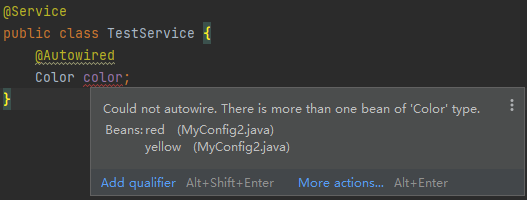
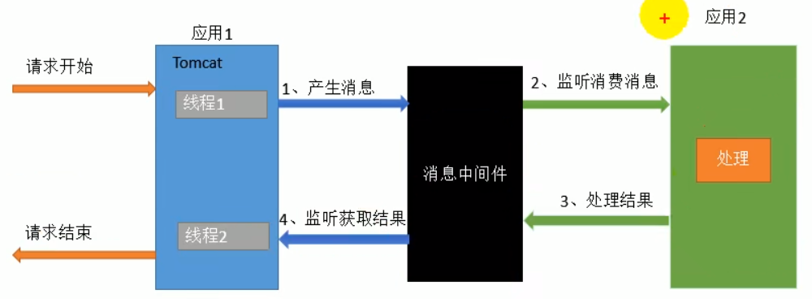

# SpringBoot2注解驱动开发

## 1.组件注册

### 1.1 导入依赖

```xml
<dependecy>
	<groupId>org.springframework</groupId>
    <artifactId>spring-context</artifactId>
    <version>4.3.12.RELEASE</version>
</dependecy>
```

### 1.2 注册bean——**@Bean**

> 标注在方法上

#### 1.2.1 XML方式

```xml
<bean id="person" class="com.beam.Person">
	<property name="name" value="zhangsan"></property>
</bean>
```

```java
ApplicationContext applicationContext = new ClassPathXmlApplicationContext("*.xml");
Person person = (Person) applicationContext.getBean("person");
```

#### 1.2.2 配置类方式

```java
@Configuration // 告诉 Spring 这是一个配置类
public class MainConfig {
    @Bean("自定义bean的名字")
    public Person person() {
        return new Person("zhangsan");
    }
}
```

```java
ApplicationContext applicationContext = new AnnotationConfigApplicationContext(MainConfig.class);
Person person = (Person) applicationContext.getBean("person");
```

### 1.3 组件扫描——**@ComponentScan**

#### 1.3.1 配置文件方式

```xml
<!-- 
	use-default-filters="false": 表示不使用默认的 filter，需要自己配置 filter；
	context:include-filter: 设置扫描哪些内容
 -->
<context:component-scan base-package="com.test" use-default-filters="false">
	<context:include-filter type="annotation" expression="org.springframework.stereotype.Controller"></context:include-filter>
</context:component-scan>
```

#### 1.3.2 配置类方式

```java
@ComponentScan(value="com.youyi", excludeFilters = {
        @Filter(type=FilterType.ANNOTATION, classes={Controller.class, Service.class}),
    	@Filter(type=FilterType.CUSTOM, classes={MyTypeFilter.class})
		}
)
@ComponentScan(value="com.youyi", includeFilters = {
        @Filter(type=FilterType.ANNOTATION, classes={Controller.class, Service.class}),
    	@Filter(type=FilterType.CUSTOM, classes={MyTypeFilter.class})
		},
        userDefaultFilters = false       
)
```

或将`ComponentScan`放到<a name = "ComponentScans">`ComponentScans`</a>中：

```java
@ComponentScans(
    {
        @ComponentScan(value="com.youyi", excludeFilters = {
        		@Filter(type=FilterType.ANNOTATION, classes={Controller.class, Service.class}),
    			@Filter(type=FilterType.CUSTOM, classes={MyTypeFilter.class})
				}
        ),
        @ComponentScan(value="com.youyi", includeFilters = {
                @Filter(type=FilterType.ANNOTATION, classes={Controller.class, Service.class}),
                @Filter(type=FilterType.CUSTOM, classes={MyTypeFilter.class})
                },
        userDefaultFilters = false       
        )
    }
)
```

##### 自定义FilterType规则

- `FilterType.ANNOTATION`：按照注释

- `FilterType.ASSIGNBLE_TYPE`：按照指定 class 类型

  ```java
  @Filter(type=FilterType.ASSIGNBLE_TYPE, classes={Person.class})
  ```

- `FilterType.ASPECTJ`：使用 AspectJ 表达式

- `FilterType.REGEX`：使用正则

- `FilterType.CUSTOM`：使用自定义规则（必须是**TypeFilter**的实现类）

  ```java
  public class MyTypeFilter implements TypeFilter {
      /**
       *
       * @param metadataReader 读取到的当前正在扫描的类的信息
       * @param metadataReaderFactory 可以获取到其他任何类的信息
       * @return
       * @throws IOException
       */
      @Override
      public boolean match(MetadataReader metadataReader, MetadataReaderFactory metadataReaderFactory) throws IOException {
          // 获取当前类注解的信息
          AnnotationMetadata annotationMetadata = metadataReader.getAnnotationMetadata();
          // 获取当前正在扫描的类的类信息
          ClassMetadata classMetadata = metadataReader.getClassMetadata();
          // 获取当前类的资源信息（路径等）
          Resource resource = metadataReader.getResource();
  		// 凡是类名包含My的类均被加载
          if (classMetadata.getClassName().contains("My")) return true;
          return false;
      }
  }
  ```

  ```java
  @ComponentScan(value="com.youyi", excludeFilters = {
      @Filter(type=FilterType.CUSTOM, classes={MyTypeFilter.class})
  })
  ```

### 1.4 设置生命周期——**@Scope**

- `prototype`：多实例的，ioc 容器启动并不会调用方法创建对象放在容器中。每次获取的时候才会调用方法创建对象

- `singleton`：单实例的（默认），IOC 容器启动会调用方法创建对象放到容器中。以后每次获取的就是直接从容器中拿

  > ==注意==
  >
  > 单实例是线程不安全的，要么使用 prototype，要不不使用成员变量，或者可以给成员变量`ThreadLocal`属性变为线程私有的变量。

- `request`：同义词请求创建一个实例
- `session`：同一个 session 创建一个实例

```java
@Scope("prototype")
@Bean("person")
public Person person() {}
```

#### 懒加载——**@Lazy**

```java
/**
 * 懒加载：
 *     -- 单实例 bean：默认在容器启动时创建对象
 *     -- 懒加载：容器启动不创建对象，第一次使用（获取）Bean 时创建对象并初始化
 */
@Lazy
@Bean("person")
public Person person() {}
```

### 1.5 按条件注册Bean——==@Conditional==

标注在类或方法上。使用时新建一个类实现`Condition`接口，重写匹配的方法。

```java
class LinuxCondition implements Condition {
    /**
     * @param conditionContext 上下文
     * @param annotatedTypeMetadata 注释信息
     */
     @Override
    public boolean matches(ConditionContext context, AnnotatedTypeMetadata metadata) {
        // 能获取到 ioc 使用的 beanFactory
        ConfigurableListableBeanFactory beanFactory = context.getBeanFactory();
        
        // 获取类加载器
        ClassLoader classLoader = context.getClassLoader();
        
        // 获取到 bean 定义的注册类
        BeanDefinitionRegistry registry = context.getRegistry();
        
        // 获取环境信息
        Environment environment = context.getEnvironment();
        
        // 判断是否是 Linux 环境
        String property = environment.getProperty("os.name");
        if (property.toLowerCase().contains("linux")) return true;
        return false;
    }
}
```

```java
@Conditional({LinuxCondition.class}) // 只有当环境是 linux 时才会添加该 Bean
public Pet pet() {
    return new Pet();
}
```

```java
ApplicationContext applicationContext = new AnnotationConfigApplicationContext(MyConfig.class);
@Test
public void testConditional() {
    String[] beanDefinitionNames = applicationContext.getBeanDefinitionNames();
    for (String beanDefinitionName : beanDefinitionNames) {
        System.out.println(beanDefinitionName);
    }
}
```

### ==1.6 向容器中注册组件==

- 包扫描（`@ComponentScan`）加组件标注注解 (`@Controller`、`@Service`、`@Repository`、`@Component`)

- `@Bean`：添加在方法上，Id 默认是方法名

- `@Import`：快速导入组件, Id 默认是组件的全类名。<a href="Import 使用.md">参考</a>

- 自定义`FactoryBean`

  - 默认获取到的是工厂 bean 调用 getObject 创建的对象

  - 需要获取工厂 bean 本身时需要给工厂 bean 的 id 前加一个&标识

    ```java
    public class TestImportClass {
        @Test
        public void testImport() {
            ApplicationContext applicationContext = new AnnotationConfigApplicationContext(MyConfig.class);
            String[] beanDefinitionNames = applicationContext.getBeanDefinitionNames();
            for (String beanDefinitionName : beanDefinitionNames) {
                System.out.println(beanDefinitionName);
            }
            // 获取的是工厂类的生产类，此处为 Pet
            Object myFactoryBean1 = applicationContext.getBean("com.bean.MyFactoryBean");
            Object myFactoryBean2 = applicationContext.getBean("com.bean.MyFactoryBean");
            System.out.println("myFactoryBean1:" + myFactoryBean1.getClass()); // class com.bean.Red
            // isSingleton 为 true 时单例，验证通过，false 时多例
            Assert.assertEquals(myFactoryBean1, myFactoryBean2);
            // 获取工厂 bean 本身
            Object bean = applicationContext.getBean("&com.bean.MyFactoryBean"); 
            System.out.println("bean:" + bean.getClass()); // class com.bean.MyFactoryBean
    
        }
    }
    ```

**具体应用**

```java
@Configuration
@Import({Yellow.class, MyImportSelector.class, MyImportBeanDefinitionRegistrar.class}) // 无先后顺序
public class MyConfig {
    @Bean
    public Red red() {
        return new Red();
    }
    
    @Beam
    pulic MyFactoryBean myFactoryBean() {
        return new MyFactoryBean();
    }
}

class MyImportSelector implements ImportSelector {
    /**
     *
     * @param annotationMetadata 当前标注 @Import 注解的类的所有注解信息
     * @return 导入到容器中的组件全类名
     */
    @Override
    public String[] selectImports(AnnotationMetadata annotationMetadata) {
        return new String[] {
                "com.bean.Blue"
        };
    }
}

class MyImportBeanDefinitionRegistrar implements ImportBeanDefinitionRegistrar {
    /**
     *
     * @param importingClassMetadata 当前标注 @Import 注解的类的所有注解信息
     * @param registry BeanDefinition 注册类
     *     -- 调用 BeanDefinitionRegistry.registerBeanDefinition 手工注册进来
     */
    @Override
    public void registerBeanDefinitions(AnnotationMetadata importingClassMetadata, BeanDefinitionRegistry registry) {
        boolean red = registry.containsBeanDefinition("red");
        boolean yellow = registry.containsBeanDefinition("com.bean.Yellow");
        if (red && yellow) {
            // 指定 bean 的定义信息(Scope, Type, etc..)
            RootBeanDefinition rootBeanDefinition = new RootBeanDefinition(Rainbow.class);
            // 注册名称
            registry.registerBeanDefinition("rainbow", rootBeanDefinition);
        }
    }
}

// 创建一个 Spring 定义的 FactoryBean
class MyFactoryBean implements FactoryBean<Red> {
    // 是否是单例
    @Override
    public boolean isSingleton() {
        return true;
    }

    // 返回一个对象并添加到容器中
    @Override
    public Red getObject() throws Exception {
        return new Red();
    }

    @Override
    public Class<?> getObjectType() {
        return Red.class;
    }
}
```

------

## 2.Bean的生命周期


- bean 的生命周期：创建--初始化--销毁

- 由容器管理 bean 的生命周期


- 可以自定义初始化和销毁方法，容器在 bean 进行到当前生命周期的时候来调用自定义的初始化和销毁方法

### 2.1 流程

1. 构造（对象创建）
   - 单实例：在容器启动时创建
   - 多实例：在每次获取 bean 时创建
2. `MergedBeanDefinitionPostProcessors.postProcessMergedBeanDefinition()`
3. bean 属性赋值
4. `BeanPostProcessor.postProcessBeforeInitialization()`
5. 初始化
   1. 调用初始化方法
6. `BeanPostProcessor.postProcessAfterInitialization`
7. 销毁
   1. 单实例：容器关闭时调用
   2. 多实例：容器不会管理这些 bean，所以不会调用销毁方法

### 2.2 初始化和销毁方法

> 1. 指定初始化和销毁方法：通过@Bean指定 `initMmethod` 和 `destroyMethod`
>
> 2. 实现 `InitializingBean` 接口定义初始化逻辑，实现 `DisposableBean` 接口定义销毁逻辑
>
>    在`initializeBean()`初始化方法中调用了`invokeInitMethods()`方法，执行了`((InitializingBean) bean).afterPropertiesSet();`
>
> 3. 使用**JSR250**，由 **InitDestroyAnnotationBeanPostProcessor** 处理实现
>
> * `@PostConstruct`：修饰的方法会在服务器加载 Servlet 的时候运行，并且只会被服务器执行一次。PostConstruct 在构造函数之后执行，init()方法之前执行
>
>   `Constructor(构造方法)` -> `@Autowired(依赖注入)` -> `@PostConstruct(注释的方法)`，准确来说，`BeanPostProcessor`有个实现类`CommonAnnotationBeanPostProcessor`，就是专门处理`@PostConstruct`、`@PreDestroy`注解，执行`postProcessBeforeInitialization()`时会执行被该注解修饰的方法。
>
> * `@PreDestroy`：在容器销毁 bean 之前执行
>
> 4. `BeanPostProcessor`（interface）：bean 的后置处理器，在bean初始化前后进行处理
>
> * postProcessBeforeInitialization：在所有初始化方法调用前
> * postProcessAfterInitialization：在所有初始化方法调用后
>
> ==源码==
>
> ```java
> AbstractAutowireCapableBeanFactory.class -> doCreateBean()
> // 对 bean 进行属性赋值
> this.populateBean(beanName, mbd, instanceWrapper);
> exposedObject = this.initializeBean(beanName, exposedObject, mbd);
> 
> AbstractAutowireCapableBeanFactory.class -> initializeBean()
> // 遍历得到容器中所有的 BeanPostProcessor：挨个执行 beforeInitialization 方法，一旦返回 null，跳出循环，不会执行后面的 applyBeanPostProcessorsBeforeInitialization 方法
> wrappedBean = this.applyBeanPostProcessorsBeforeInitialization(bean, beanName);
> // 执行初始化方法
> this.invokeInitMethods(beanName, wrappedBean, mbd); 
> wrappedBean = this.applyBeanPostProcessorsAfterInitialization(wrappedBean, beanName);
> ```

```java
@Test
public void testImport() {
    AnnotationConfigApplicationContext applicationContext = new AnnotationConfigApplicationContext(MyConfig.class);
    applicationContext.close();
}
```

```java
@Configuration
public class MyConfig {
    @Bean(initMethod = "init", destroyMethod = "destroy")
    public Red red() {
        return new Red();
    }
}

public class Red {
    public Red() {
        System.out.println("constructor");
    }
    public void init() {
        System.out.println("init");
    }
    public void destroy() {
        System.out.println("destroy");
    }
}
```

```java
@Configuration
public class MyConfig {
    @Bean()
    public Red red() {
        return new Red();
    }
}

public class Red implements InitializingBean, DisposableBean {
    public Red() {
        System.out.println("constructor");
    }

    @Override
    public void afterPropertiesSet() throws Exception {
        System.out.println("afterPropertiesSet");
    }

    @Override
    public void destroy() throws Exception {
        System.out.println("destroy");
    }
}
```

```java
public class Red {
    public Red() {
        System.out.println("constructor");
    }
    @PostConstruct
    public void postConstruct() {
        System.out.println("init");
    }
    @PreDestroy
    public void preDestroy() {
        System.out.println("destroy");
    }
}
```

```java
/**
 * 后置处理器：初始化前后进行处理
 * 将后置处理器添加到容器中
 */
@Component
public class MyBeanPostProcessor implements BeanPostProcessor {
    @Override
    public Object postProcessBeforeInitialization(Object bean, String beanName) throws BeansException {
        System.out.println("postBefore");
        return bean;
    }

    @Override
    public Object postProcessAfterInitialization(Object bean, String beanName) throws BeansException {
        System.out.println("postAfter");
        return bean;
    }
}
```

### 2.3 BeanPostProcessor的应用

#### 1.BeanValidationPostProcessor

> 用于校验

#### 2.AutowiredAnnotationBeanPostProcessor

> 用于属性注入

#### 3.ApplicationContextAwareProcessor

帮助组件注册 context 上下文，只需要实现**ApplicationContextAware**接口，实现`setApplicationContext()`方法

```java
public class Yellow implements ApplicationContextAware {

    ApplicationContext applicationContext;

    // 获取上下文 context 对象
    @Override
    public void setApplicationContext(ApplicationContext applicationContext) throws BeansException {
        this.applicationContext = applicationContext;
    }
}
```

------

## 3.属性赋值

### 1.@Value

1. 注入基本数值

2. 可以写SpEL：`#{}`

3. 可以写`${}`：取出配置文件中的值（在运行环境变量里的值）

   > **注意**
   >
   > 若找不到则会抛出错误。

4. 配合`@PropertySource`加载 property 文件使用
   - 可以标注多个`@PropertySource`
   - 也可以将多个`@PropertySource`放到`@PropertySources`中，同`@ComponentScans`

**具体代码**

```java
public class Red {
    @Value("张三")
    private String name;

    @Value("#{20 - 3}")
    private Integer age;

    @Value("${red.nickName}")
    private String nickName;
}
```

```java
// 使用 @PropertyResource 读取外部配置文件中的 k/v 保存到运行的环境变量中; 加载完外部的配置文件后使用 ${} 取出配置文件的值
@PropertySource(value={"classpath:/red.properties"})
@Configuration
@ComponentScan("com.youyi")
public class MyConfig {
    @Bean()
    public Red red() {
        return new Red();
    }
}
```

```java
@SpringBootTest
public class TestStudentClass {
    @Test
    public void testImport() {
        AnnotationConfigApplicationContext applicationContext = new AnnotationConfigApplicationContext(MyConfig.class);
        // 注意：若容器中有多个同类型不同 id 的 bean 存在，则用类型获取 bean 时会抛出错误
        Red red = applicationContext.getBean(Red.class);
        System.out.println(red.getNickName());
        // 也可用 enviroment 对象获取环境变量中的值，找不到时返回null
        ConfigurableEnvironment environment = applicationContext.getEnvironment();
        String nickName = environment.getProperty("red.nickName");
        System.out.println(nickName);

    }
}
```

```properties
-- red.properties文件中 --
red.nickName = nnn
```

#### 1.1 注入Map、List

使用`@Value`注入 map、List

**List**

配置文件

```makefile
test.list: topic1,topic2,topic3
```

- 获取方法1

  ```java
  @Value("${test.list.ids:1,2,3}")
  private List<String> testList;
  ```

- 获取方法2

  ```java
  @Value("${test.list.ids:1,2,3}")
  private String[] testList;
  ```

- 指定分隔符

  ```java
  @Value("#{'${test.list}'.split(',')}")
  private List<String> list;
  ```

  `split(',')`只以`,`为分隔符，也可以换成别的，当配置文件中没有 key 时，也可以使用`key:default_value`的方法设置默认值。

 **map**

配置文件

```avrasm
test.maps: "{key1: 'value1', key2: 'value2'}"
```

获取方法

```java
@Value("#{${test.maps}}")  
private Map<String,String> maps;
```

> **注意**
>
> 上面的 map 解析中，一定要用`""`把 map 所对应的 value 包起来，要不然解析会失败，导致不能转成`Map<String,String>`。

#### 1.2 静态变量注入值

spring 不允许/不支持把值注入到静态变量中，如：

```java
@Value("${ES.CLUSTER_NAME}")
private static String CLUSTER_NAME;
```

在方法中获得的`CLUSTER_NAME`，会得到`null`。

**解决**
好在 spring 支持`set`方法注入，我们可以利用非静态`setter`方法注入静态变量。如：

```java
private static String CLUSTER_NAME;

@Value("${ES.CLUSTER_NAME}")
public void setClusterName(String clusterName) {
CLUSTER_NAME = clusterName;
}
```

`@Value`必须修饰在方法上，且`set`方法不能有`static`这样就能获得值了。

####  1.3 注入object

示例：

容器中，有一个`Runnable`的 bean

```java
@Configuration
public class Config {
	@Bean("myrun")
	public Runnable run() {
		return () -> System.out.println("this is spring run");
	}
}
```

想使用`@Value`的方式，把这个 bean 注入进来，这种是按 bean 的名字注入。

```typescript
@Service
public class Runner {

	@Value("#{myrun}")
	private Runnable run;
	
	public void run() {
		run.run();
	}
}
```

#### ==1.4 #{…}和${…}== 

##### 1.4.1 ${…}

通过`@Value(“${spelDefault.value}”)`可以获取属性文件中对应的值，但是如果属性文件中没有这个属性，则会报错。可以通过赋予默认值解决这个问题，如

```kotlin
@Value("${test.value:127.0.0.1}")
```

##### 1.4.2 #{…}

`#{…}`的`{}`里面的内容必须符合`SpEL`表达式，详细的语法，以后可以专门开新的文章介绍，这里只演示简单用法：

```java
// SpEL: 调用字符串 Hello World 的 concat 方法
@Value("#{'Hello World'.concat('!')}")
private String helloWorld;

// SpEl: 调用字符串的 getBytes 方法，然后调用 length 属性
@Value("#{'Hello World'.bytes.length}")
private String helloWorldbytes;
```

##### 1.4.3 ${…}和#{…}混合使用

`SpEL`：传入一个字符串，根据`,`切分后插入列表中， `#{}`和`${}`配置使用

```kotlin
@Value("#{'${server.name}'.split(',')}") private List<String> servers;
```

在上文中在`#{}`外面，`\${}`在里面可以执行成功，那么反过来是否可以呢`\${}`在外面，`#{}`在里面，是不能。

因为 spring 执行`${}`是时机要早于`#{}`。`\${}`在外面，`#{}`在里面是非法操作。

#### 1.5 小结

- `#{…}`主要用于加载外部属性文件中的值
- `${…}`用于执行`SpEl`表达式，并将内容赋值给属性
- `#{…}`和`${…}`可以混合使用，但是必须`#{}`外面，`\${}`在里面

###  2.ConfigurationProperties注入

```java
@Data
@ConfigurationProperties(prefix = "prop")
public class SpringBootProperty {
    private String url;
    private String driverClassName;
    private String username;
    private String password;
	private Map<String, String> platformkey;
    public List<String> list;
    public List<User> users;
}
/**
    注解解析：
      @ConfigurationProperties 注解声明当前类为属性读取类
      prefix：读取数据文件中，前缀为 prop 的值
    在类上定义各个属性，名称必须与属性文件中 prop. 后面部分一致
*/
```

```yaml
prop:
	driverClassName: com.mysql.jdbc.Driver
	url: jdbc:mysql://127.0.0.1:3306/test
	username: root
	password: 123
	platformkey:
		shanxi: s6bba6sdfggre54b87de3b8sdfa5beca
		hunan: 1sdfggr44wweffds87de3b81a3a5beca
	list:
		- a
		- b
	users:
		- {
			age: 25,
			name: test
		}
```

```properties
prop.list[0] = a
prop.list[1] = b
prop.users[0].age=25
prop.users[0].name=test
```

### 3.@Value和@ConfigurationProperties的区别

| 二者区别             | @ConfigurationProperties | @Value     |
| -------------------- | ------------------------ | ---------- |
| 功能                 | 批量注入配置文件中的属性 | 一个个指定 |
| 松散绑定（松散语法） | 支持                     | 不支持     |
| SpEL                 | 不支持                   | 支持       |
| JSR303数据校验       | 支持                     | 不支持     |
| 复杂类型封装         | 支持                     | 不支持     |

------

## 4.依赖注入

自动装配：Spring 利用依赖注入（DI），完成对 IOC 容器中各个组件的依赖关系赋值。容器中不允许相同 ID 的 bean 存在，即使类型不同也会在`registerBeanDefinition`阶段抛出异常。

### 4.1 @Bean

标注的方法参数会自动装配。

```java
@Configuration
public class MyConfig {
    /**
     * @Bean 标注的方法创建对象时，方法参数的值自动从容器中获取
     * 不需要加 @Autowired
     */
    @Bean()
    public Red red(Yellow yellow, Blue blue) {
        System.out.println(yellow);
        System.out.println(blue);
        return new Red();
    }

    @Bean
    public Yellow yellow() {
        return new Yellow();
    }

    @Bean
    public Blue blue() {
        return new Blue();
    }
}
```

### 4.2 @Autowired

自动从容器中注入，可以加在**方法**、**构造器**、**参数**和**属性**上。

- 标注在方法上

  ```java
  @Component
  public class Red implements Color{
      private Yellow yellow;
      /**
       * 标注在方法，Spring容器创建当前对象时就会调用该方法，完成赋值；
       * @param yellow：方法使用的参数，自定义的类型会从 IOC 中尝试获取
       */
      @Autowired
      public void setYellow(Yellow yellow) {
          this.yellow = yellow;
      }
  }
  ```

- 标注在构造器上

  ```java
  // 容器启动时会默认调用无参构造器创建对象，再进行初始化赋值等操作
  // 在有参构造器上添加 @Autowired 后，则容器会调用有参构造器创建对象
  @Component
  public class Red implements Color{
      private Yellow yellow;
  
      // 构造器用的组件都是从容器中获取
  	// 若组件只有一个有参构造器，@Autowired 可以省略，参数位置的组件还是可以自动从容器中获取
      // 有多个有参构造器时必须指定注入哪个构造器，否则会报错
      // @Autowired
      public Red(Yellow yellow) {
          this.yellow = yellow;
          System.out.println("有参构造器");
      }
  }
  ```

- 标注在参数上

  ```java
  @Component
  public class Red implements Color{
      private Yellow yellow;
  
      // 效果同标注在构造器上
      public Red(@Autowired Yellow yellow) {
          this.yellow = yellow;
          System.out.println("有参构造器");
      }
  }
  ```

> - 自动装配默认一定要对属性进行赋值，没有就会报错，可以使用`@Autowired(required=false)`来指定相应的 bean 可以不存在
> - 由`AutowiredAnnotationBeanPostProcessor`负责属性的自动装配
>
> * 默认优先按照==类型==获取组件
> * 若容器中有多个相同类型，则按照==属性名字==作为组建的 id 去容器中查找

#### @Qualifier

指定需要装配的组建的 id

```java
@Service
public class TestService {
    @Qualifier("red")
    @Autowired
    Color color;
}
```

#### @Primary

让 Spring 进行自动装配时，默认优先使用该注解标注的 bean，也可以使用`@Qualifier`指定装配的 bean。

```java
@Primary
@Bean()
public Red red() {
    return new Red();
}
@Bean()
public Yellow yellow() {
    return new Yellow();
}
```

> 若容器中有多个相同类型组件，且无对应属性名字为 ID 的组件时，不指定`@Qualifier`或`@Primary`时会==报错==：
>
> 

### 4.3 Java规范的注解

#### 4.3.1 @Resource

和 @Autowired 一样实现自动装配功能，不同的是默认按照**属性名称**进行装配，可以通过 name 属性指定。

```java
public class TestService {
    @Resource(name="red")
    Color color;
}
```

> - 若容器中无对应属性名字为 id 的组件，且有多个相同类型组件时，会产生运行时错误
> - 没有支持`@Primary`功能和`@Autowired(required=false)`功能

**@Resource和@Autowired的区别**

|                    | @Autowired                                                  | @Resource                                                    |
| ------------------ | ----------------------------------------------------------- | ------------------------------------------------------------ |
| `@Primary`         | 支持                                                        | 不支持                                                       |
| `bean`是否必须存在 | 默认必须存在，可设置`@Autowired(required=false)`            | 必须存在                                                     |
| 提供者             | Spring                                                      | JDK                                                          |
| 默认注入方式       | 默认优先按照类型，可指定`Qualifier("beanName")`优先按照名字 | 默认优先按照名称，可指定`@Resource(type=xxx.class)`优先按照类型 |

#### 4.3.2 @Inject(JSR330)

需要加载相关 pox 依赖

```xml
<dependency>
	<groupId>javax.inject</groupId>
    <artifactId>javax.inject</artifactId>
    <version>1</version>
</dependency>
```

> 和`@Autowired`功能一样，但无`required`属性 

### 4.4 xxxAware注入Spring底层组件

自定义组件中想要使用 Spring 容器底层的一些组件（ApplicationContext、BeanFactory etc.）时，可以实现`xxxAware`接口，在创建对象的时候，Spring 会调用接口规定的方法注入相关组件，把 Spring 底层的一些组件注入到自定义的 Bean 中。

底层使用`ApplicationContextAwareProcessor`，在 Bean 初始化前执行。

**具体代码**

```java
@Component
public class Red implements ApplicationContextAware, BeanNameAware, EmbeddedValueResolverAware {

    private ApplicationContextAware applicationContextAware;

    // 传入 ioc 上下文
    @Override
    public void setApplicationContext(ApplicationContext applicationContext) throws BeansException {
        this.applicationContextAware = applicationContextAware;
    }

    // 当前 bean 的名字
    @Override
    public void setBeanName(String s) {
        System.out.println("当前bean的名字：" + s);
    }

	// 解析特殊符号
    @Override
    public void setEmbeddedValueResolver(StringValueResolver resolver) {
        String s = resolver.resolveStringValue("你好${os.name}，我是#{20*18}");
        System.out.println(s);
    }
}
```

### 4.5 @Profile指定环境

Spring 提供的可以根据当前环境（开发环境，测试环境，生产环境），动态的激活或切换一系列组建的功能，`@Profile`用于指定组件在哪个环境中才能被注册到容器中，不指定则任何环境都会注册到容器中。

加了环境标识的 bean，只有这个环境激活时，才会注册到容器中，默认是 `Profile("default")`，表示在任何环境下都会加载。可以写在**配置类**上，表示只有在指定的环境下，整个配置类的所有配置才会生效。

**具体代码**

```java
/**
 * 四种方式从环境中注入值：
 * 1. 在属性上使用 @Value("${key}) 获取
 * 2. 在参数前使用 @Value("${key}) 获取
 * 3. 使用 setEmbeddedValueResolver
 * 4. 使用 environment 环境参数
 */
@Profile("test")
@PropertySource("classpath:/dbconfig.properties")
@Configuration
public class MainConfigProfile implements EmbeddedValueResolverAware {

    @Value("${db.user}")
    private String user;

    private StringValueResolver stringValueResolver;

    private String driverClass;

    @Override
    public void setEmbeddedValueResolver(StringValueResolver stringValueResolver) {
        this.stringValueResolver = stringValueResolver;
        this.driverClass = stringValueResolver.resolveStringValue("${db.driverClass}");
    }

    @Profile("test")
    @Bean("testDataSource")
    public DataSource dataSourceTest(@Value("${db.password}") String password) {
        CombopooledDataSource source = new CombopooledDataSource();
        source.setUser(user);
        source.setPassword(password);
        source.setJdbcUrl("jdbc:mysql://localhost:3306/test");
        source.setDriverClass(driverClass);
        return source;
    }

    @Profile("dev")
    @Bean("devDataSource")
    public DataSource dataSourceDev(@Value("${db.password}") String password) {
        CombopooledDataSource source = new CombopooledDataSource();
        source.setUser(user);
        source.setPassword(password);
        source.setJdbcUrl("jdbc:mysql://localhost:3306/dev");
        source.setDriverClass(driverClass);
        return source;
    }

    @Profile("prod")
    @Bean("prodDataSource")
    public DataSource dataSourceProd(@Value("${db.password}") String password) {
        CombopooledDataSource source = new CombopooledDataSource();
        source.setUser(user);
        source.setPassword(password);
        source.setJdbcUrl("jdbc:mysql://localhost:3306/prod");
        source.setDriverClass(driverClass);
        return source;
    }
}
```

**切换环境方式**

1. 使用命令行动态参数：添加虚拟机参数，`-Dspring.profiles.active=[环境名]`

2. 使用代码方式

   ```java
   @Test
   public void testProfile() {
   
       // 利用空参构造器创建 applicationContext
       AnnotationConfigApplicationContext applicationContext = new AnnotationConfigApplicationContext();
   
       // 设置需要激活的环境（有参构造器中没有这一项，所有以需要自己注入）
       applicationContext.getEnvironment().setActiveProfiles("test", "dev");
   
       // 注册主配置类
       applicationContext.register(MainConfigProfile.class);
   
       // 启动刷新容器
       applicationContext.refresh();
   }
   ```

------

## 5.AOP

### 5.1 功能测试

指在程序运行期间动态的将某段代码切入到指定方法指定位置进行运行的编程方式（动态代理）。

1. 导入 AOP 模块：**spring-aspects**

   ```xml
   <dependency>
       <groupId>org.springframework</groupId>
       <artifactId>spring-aspects</artifactId>
       <version>4.3.12.RELEASE</version>
   </dependency>
   ```

2. 添加一个业务逻辑类：**MathCalculator**，希望实现在业务逻辑运行时将日志打印（方法开始前，运行结束时，出现异常时等）

   ```java
   public class MathCalculator {
       public int div(int i, int j) {
           return i / j;
       }
   }
   ```

3. 定义一个日志切面类：**LogAspects**

   1. 给切面类加注解`@Aspect`，切面里的方法需要动态感知`MathCalculator.div()`运行到哪里然后执行
   2. 给切面类的方法标注何时何地运行（通知注解）
   3. **前置通知**(`@Before`)：在目标方法（div）运行之前运行——logStart
   4. **后置通知**(`@After`)：在目标方法（div）运行结束最后才运行（无论方法正常结束还是异常结束）——logEnd
   5. **返回通知**(`@AfterReturning`)：在目标方法（div）正常返回之后运行——logReturn
   6. **异常通知**(`@AfterThrowing`)：在目标方法（div）出现异常之后运行——logException
   7. **环绕通知**(`@Around`)：动态代理，手动推进目标方法运行（`joinPoint.proceed()`）

   ```java
   /**
    * 切入类
    */
   @Aspect
   public class LogAspects {
   
       // 抽取公共切入点
       // 在目标方法之前，切入点表达式（指定在哪个方法切入）
       @Pointcut("execution(public int com.youyi.boot.aop.MathCalculator.*(..))")
       public void pointCut(){};
   
       // JoinPoint：获取方法名，参数等，必须写在参数的第一位
       // 1.本类引用
       @Before("pointCut()")
       public void logStart(JoinPoint joinPoint) {
           System.out.println(joinPoint.getSignature().getName() + "运行。。。参数列表是{" + Arrays.asList(joinPoint.getArgs()) + "}");
       }
   
       // 2.其他切面引用
       @After("com.youyi.boot.aop.LogAspects.pointCut()")
       public void logEnd(JoinPoint joinPoint) {
           System.out.println(joinPoint.getSignature().getName() + "结束");
       }
   
       // @AfterReturning 的 returning 属性可以接受目标方法的执行结果
       @AfterReturning(value="pointCut()", returning="result")
       public void logReturn(JoinPoint joinPoint, Object result) {
           System.out.println(joinPoint.getSignature().getName() + "正常返回，运行结果为{"+ result +"}");
       }
   
       @AfterThrowing(value="pointCut()", throwing="exception")
       public void logException(JoinPoint joinPoint, Exception exception) {
           System.out.println(joinPoint.getSignature().getName() + "异常，异常信息为{"+ exception +"}");
       }
   }
   ```

4. 开启 aop 模式，将目标方法和切面方法加入容器中

   - xml 方式

     ```xml
     <aop:aspectj-autoproxy></aop:aspectj-autoproxy>
     ```

   - 配置类方式

     ```java
     @EnableAspectJAutoProxy
     @Configuration
     public class MainConfigOfAOP {
     
         @Bean
         public MathCalculator mathCalculator() {
             return new MathCalculator();
         }
     
         @Bean
         public LogAspects logAspects() {
             return new LogAspects();
         }
     }
     ```

5. 测试

   ```java
   @Test
   public void testAOP() {
       AnnotationConfigApplicationContext applicationContext = new AnnotationConfigApplicationContext(MainConfigOfAOP.class);
       MathCalculator bean = applicationContext.getBean(MathCalculator.class);
       bean.div(1, 0);
   }
   ```

### 5.2 AOP组件的导入

#### 5.2.1 @EnableAspectJAutoproxy

给容器中导入`AspectJAutoProxyRegistrar`

```java
@Import(AspectJAutoProxyRegistrar.class)
public @interface EnableAspectJAutoProxy {
}
```

#### 5.2.2 导入AspectJAutoProxyRegistrar

`AspectJAutoProxyRegistrar`实现了`ImportBeanDefinitionRegistrar`接口，在【注册剩余`configClass`的`BeanDefinitions`】时被加载。

向容器中加入了`org.springframework.aop.config.internalAutoProxyCreator`：`AnnotationAwareAspectJAutoProxyCreator`。

```java
class AspectJAutoProxyRegistrar implements ImportBeanDefinitionRegistrar {
    @Override
    public void registerBeanDefinitions(AnnotationMetadata importingClassMetadata, BeanDefinitionRegistry registry) {
        // 利用 AspectJAutoProxyRegistrar 给容器中注册 bean 的 BeanDefinition：org.springframework.aop.config.internalAutoProxyCreator：AnnotationAwareAspectJAutoProxyCreator
        // 该过程不会创建对象
        AopConfigUtils.registerAspectJAnnotationAutoProxyCreatorIfNecessary(registry);

        AnnotationAttributes enableAspectJAutoProxy =
            AnnotationConfigUtils.attributesFor(importingClassMetadata, EnableAspectJAutoProxy.class);
        if (enableAspectJAutoProxy != null) {
            if (enableAspectJAutoProxy.getBoolean("proxyTargetClass")) {
                AopConfigUtils.forceAutoProxyCreatorToUseClassProxying(registry);
            }
            if (enableAspectJAutoProxy.getBoolean("exposeProxy")) {
                AopConfigUtils.forceAutoProxyCreatorToExposeProxy(registry);
            }
        }
    }
}
```

#### 5.2.3 创建AnnotationAwareAspectJAutoProxyCreator

由于`AnnotationAwareAspectJAutoProxyCreator`是一个`BeanPostProcessor`并实现了`Ordered`接口，在【注册`BeanPostProcessor`】时，创建了`AnnotationAwareAspectJAutoProxyCreator`，并加入了容器中。


### 5.3 创建代理对象过程

由于`AnnotationAwareAspectJAutoProxyCreator`实现了`InstantiationAwareBeanPostProcessor`，在【初始化所有剩下的单实例 Bean】，【执行`BeanPostProcessor`的`postProcessAfterInitialization()`】时，会调用父类`AbstractAutoProxyCreator`的`postProcessAfterInitialization()`来创建代理对象。

**添加增强方法**

在【Bean初始化】阶段，【执行BeanPostProcessor的postProcessAfterInitialization()】时，被`AnnotationAwareAspectJAutoProxyCreator`拦截，调用`AbstractAdvisorAutoProxyCreator`类的`getAdvicesAndAdvisorsForBean()`方法获取所有支持的增强器。

### 5.4 执行目标方法

> 实际的目标方法的代理对象容器中保存了组件的代理对象（CGlib增强后的对象），还保存了详细信息：增强器，目标对象等
>
> 1. 拦截目标方法的执行
>
>    ```java
>    CglibApoProxy.class -> intercept()
>    
>    // 根据 proxyFactory(this) 获取将要执行的目标方法的拦截器链
>    List<Object> chain = this.advised.getInterceptorsAndDynamicInterceptionAdvice(method, targetClass);
>    Object retVal;
>    // Check whether we only have one InvokerInterceptor: that is,
>    // no real advice, but just reflective invocation of the target.
>    if (chain.isEmpty() && Modifier.isPublic(method.getModifiers())) {
>        // 没有拦截器链则直接执行目标方法
>        Object[] argsToUse = AopProxyUtils.adaptArgumentsIfNecessary(method, args);
>        retVal = methodProxy.invoke(target, argsToUse);
>    }
>    else {
>        // 有拦截器链时，需要把执行的目标对象，目标方法拦截器链等信息进行处理并执行
>        retVal = new CglibMethodInvocation(proxy, target, method, args, targetClass, chain, methodProxy).proceed();
>    }
>    retVal = processReturnType(proxy, target, method, retVal);
>    return retVal;
>    ```
>
> 2. 获取拦截器链
>
>    > 拦截器：每一个通知方法被包装为方法拦截器，利用 MethodInterceptor机制
>
>    ```java
>    AdvisedSupport.class -> getInterceptorsAndDynamicInterceptionAdvice()
>    DefaultAdvisorChainFactory.class -> getInterceptorsAndDynamicInterceptionAdvice()
>    
>    // 保存所有拦截器，一个默认的 ExposeInvocationInterceptor 和 4 个增强器
>    List<Object> interceptorList = new ArrayList<>(advisors.length);
>    // 遍历所有增强器，将其转为 interceptor
>    registry.getInterceptors(advisor);
>    ```
>
>    ```java
>    DefaultAdvisorAdapterRegistry.class 
>    
>    public MethodInterceptor[] getInterceptors(Advisor advisor) throws UnknownAdviceTypeException {
>        List<MethodInterceptor> interceptors = new ArrayList<>(3);
>        Advice advice = advisor.getAdvice();
>        // 如果是 MethodInterceptor 直接加入到集合中
>        if (advice instanceof MethodInterceptor) {
>            interceptors.add((MethodInterceptor) advice);
>        }
>        // 如果不是 MethodInterceptor 则使用 AdvisorAdapter 将增强器转为 MethodInterceptor
>        for (AdvisorAdapter adapter : this.adapters) {
>            if (adapter.supportsAdvice(advice)) {
>                interceptors.add(adapter.getInterceptor(advisor));
>            }
>        }
>        if (interceptors.isEmpty()) {
>            throw new UnknownAdviceTypeException(advisor.getAdvice());
>        }
>        // 转换完成，返回 MethodInterceptor 数组
>        return interceptors.toArray(new MethodInterceptor[0]);
>    }
>    ```
>
> 3. 执行拦截器链
>
>    ```java
>    ReflectiveMethodInvocation.class -> proceed()
>                                                                                         
>    public Object proceed() throws Throwable {
>        // We start with an index of -1 and increment early.
>        if (this.currentInterceptorIndex == this.interceptorsAndDynamicMethodMatchers.size() - 1) {
>            // 若拦截器的索引和拦截器数组 -1 大小一样（即执行到最后一个拦截器），执行目标方法
>            return invokeJoinpoint();
>        }
>                                                                                     
>        Object interceptorOrInterceptionAdvice =
>            this.interceptorsAndDynamicMethodMatchers.get(++this.currentInterceptorIndex);
>        if (interceptorOrInterceptionAdvice instanceof InterceptorAndDynamicMethodMatcher) {
>            // Evaluate dynamic method matcher here: static part will already have
>            // been evaluated and found to match.
>            InterceptorAndDynamicMethodMatcher dm =
>                (InterceptorAndDynamicMethodMatcher) interceptorOrInterceptionAdvice;
>            Class<?> targetClass = (this.targetClass != null ? this.targetClass : this.method.getDeclaringClass());
>            if (dm.methodMatcher.matches(this.method, targetClass, this.arguments)) {
>                return dm.interceptor.invoke(this);
>            }
>            else {
>                // Dynamic matching failed.
>                // Skip this interceptor and invoke the next in the chain.
>                return proceed();
>            }
>        }
>        else {
>            // It's an interceptor, so we just invoke it: The pointcut will have
>            // been evaluated statically before this object was constructed.
>            return ((MethodInterceptor) interceptorOrInterceptionAdvice).invoke(this);
>        }
>    }
>    =======================================================================================
>    ExposeInvocationInterceptor.class
>                                                                                         
>    public Object invoke(MethodInvocation mi) throws Throwable {
>        MethodInvocation oldInvocation = invocation.get();
>        invocation.set(mi);
>        try {
>            return mi.proceed();
>        }
>        finally {
>            invocation.set(oldInvocation);
>        }
>    }
>                                                                                     
>    ========================================================================================
>    MethodBeforeAdviceInterceptor.class
>                                                                                         
>    public Object invoke(MethodInvocation mi) throws Throwable {
>        // 执行前置通知
>        this.advice.before(mi.getMethod(), mi.getArguments(), mi.getThis());
>        return mi.proceed();
>    }
>                                                                                     
>    ========================================================================================
>    AspectJAfterAdvice.class
>                                                                                     
>    @Override
>    public Object invoke(MethodInvocation mi) throws Throwable {
>        try {
>            return mi.proceed();
>        }
>        // 最终执行最终通知方法
>        finally {
>            invokeAdviceMethod(getJoinPointMatch(), null, null);
>        }
>    }
>                                                                                         
>    ========================================================================================
>    AfterReturningAdviceInterceptor.class
>                                                                                     
>    public Object invoke(MethodInvocation mi) throws Throwable {
>        Object retVal = mi.proceed();
>        // 无异常则执行返回值通知
>        this.advice.afterReturning(retVal, mi.getMethod(), mi.getArguments(), mi.getThis());
>        return retVal;
>    }
>                                                                                     
>    ========================================================================================
>    AspectJAfterThrowingAdvice.class
>                                                                                         
>    public Object invoke(MethodInvocation mi) throws Throwable {
>        try {
>            return mi.proceed();
>        }
>        catch (Throwable ex) {
>            // 捕获异常，若满足条件则执行异常通知
>            if (shouldInvokeOnThrowing(ex)) {
>                invokeAdviceMethod(getJoinPointMatch(), null, ex);
>            }
>            throw ex;
>        }
>    }
>    ```
>
>    > ==通知方法触发流程==
>    >
>    > `ExposeInvocationInterceptor` -> invoke(this) -> mi.proceed()
>    >
>    > -> `MethodBeforeAdviceInterceptor` -> 前置通知(before) -> invoke(this) -> mi.proceed()
>    >
>    > -> `AspectJAfterAdvice` -> invoke(this) -> mi.proceed() 
>    >
>    > -> `AfterReturningAdviceInterceptor` -> invoke(this) -> mi.proceed()
>    >
>    > -> `AspectJAfterThrowingAdvice` -> invoke(this) -> mi.proceed()
>    >
>    > -> this.currentInterceptorIndex == this.interceptorsAndDynamicMethodMatchers.size() - 1
>    >
>    > -> 有异常则异常通知 -> 无异常则返回值通知 -> 后置通知
>    >
>    > **总结：**链式获取每一个拦截器，拦截器执行 invoke 方法，每一个拦截器等待下一个拦截器执行完成返回后再执行

###  5.3 总结

> 1. `@EnableAspectJAutoProxy`：开启 AOP 功能
> 2. `@EnableAspectJAutoProxy`：会给容器注册一个组件 AnnotationAwareAspectJAutoProxyCreator
> 3. `AnnotationAwareAspectJAutoProxyCreator` 是一个后置处理器
> 4. 容器创建流程
>    1. `registerBeanPostProcessors()` 注册后置处理器，创建 AnnotationAwareAspectJAutoProxyCreator
>    2. `finishBeanFactoryInitialization()` 初始化剩下的单实例 Bean
>       1. 创建业务逻辑组件和切面组件
>       2. AnnotationAwareAspectJAutoProxyCreator 拦截组建的创建过程
>       3. 组件创建完成后，判断组件是否需要增强
>          - 是，则将切面的通知方法包装成增强器（Advisor），给业务逻辑组件创建一个代理对象
> 5.  执行目标方法
>    1. 代理对象执行目标方法
>    2. CglibApoProxy.interceptor()
>       1. 得到目标方法的拦截器链（增强器包装成拦截器 MethodInterceptor）
>       2. 利用拦截器的链式机制依次进入每个拦截器进行执行
>       3. 效果：
>          1. 无异常时：前置通知 - 目标方法 - 后置通知 - 返回通知
>          2. 有异常时：前置通知 - 目标方法 - 后置通知 - 异常通知

-----------------------

## 6.声明式事务

### 6.1 简单环境搭建

1. 导入相关依赖：数据源，数据驱动，Spring-jdbc模块

```xml
<dependency>
    <groupId>org.springframework</groupId>
    <artifactId>spring-jdbc</artifactId>
</dependency>

<dependency>
    <groupId>mysql</groupId>
    <artifactId>mysql-connector-java</artifactId>
</dependency>

<!-- 数据源 -->
<dependency>
    <groupId>c3p0</groupId>
    <artifactId>c3p0</artifactId>
    <version>0.9.1.2</version>
</dependency>
```

2. 配置数据源，JdbcTemplate（Spring 提供简化数据库操作的工具） 操作数据

```java
@Configuration
@ComponentScan("com.youyi.boot.tx")
public class TxConfig {
    @Bean
    public DataSource dataSource() throws PropertyVetoException {
        ComboPooledDataSource dataSource = new ComboPooledDataSource();
        dataSource.setUser("root");
        dataSource.setPassword("root");
        dataSource.setDriverClass("com.mysql.jdbc.Driver");
        // 需配置 timezone
        dataSource.setJdbcUrl("jdbc:mysql://localhost:3306/test?serverTimezone=GMT%2B8");

        return dataSource;
    }

    // Spring 对 @Configuration 类会特殊处理，给容器中添加组件的方法，多次调用都只是从容器中找组件而已，不会再次执行方法创建组件
    @Bean
    public JdbcTemplate jdbcTemplate(DataSource dataSource) {
        return new JdbcTemplate(dataSource);
    }
}
```

3. 创建 UserDao

```java
@Repository
public class UserDao {

    @Autowired
    private JdbcTemplate jdbcTemplate;

    public void insert() {
        String sql = "INSERT INTO tbl_user(username, age) VALUES(?, ?)";
        String username = UUID.randomUUID().toString().substring(0, 5);
        jdbcTemplate.update(sql, username, 19);
    }
}
```

4. 创建 UserService

```java
public class UserService {

    @Autowired
    private UserDao userDao;

    public void insertUser() {
        userDao.insert();
        System.out.println("insert finished");
    }
}
```

5. 测试

```java
@Test
public void test01() {
    AnnotationConfigApplicationContext applicationContext = new AnnotationConfigApplicationContext(TxConfig.class);
    UserService bean = applicationContext.getBean(UserService.class);
    bean.insertUser();
    applicationContext.close();
}
```

### 6.2 实现事务

> 1. 标注 `@EnableTransactionManagement` 开启基于注解的事务管理功能
>
>    ```java
>    @Configuration
>    @ComponentScan("com.youyi.boot.tx")
>    // 开启基于注解的事务管理
>    @EnableTransactionManagement
>    public class TxConfig {
>    ```
>
> 2. 给方法上标注 `@Transactional` 表示当前方法是一个事务
>
>    ```java
>    @Transactional
>    public void insertUser() {
>        userDao.insert();
>        System.out.println("insert finished");
>    }
>    ```
>
> 3. 配置事务管理器来管理事务
>
>    ```java
>    // 注册事务管理器在容器中
>    @Bean
>    public PlatformTransactionManager platformTransactionManager() throws PropertyVetoException {
>        return new DataSourceTransactionManager(dataSource());
>    }
>    ```

### 6.3 实现原理

> 1. `@EnableTransactionManagement` 利用 `TransactionManagementConfigurationSelector` 给容器中导入组件
>    1. 导入两个组件：AutoProxyRegistrar，ProxyTransactionManagementConfiguration
>       - `AutoProxyRegistrar`：给容器中注册 InfrastructureAdvisorAutoProxyCreator 组件
>         - `InfrastructureAdvisorAutoProxyCreator`：利用后置处理器机制，在对象创建后包装对象，返回一个代理对象（增强器），代理对象执行方法，利用拦截器链执行调用
>       - `ProxyTransactionManagementConfiguration`：给容器中注册事务增强器
>         - 添加一个 AnnotationTransactionAttributeSource 用来解析事务注解
>         - 添加一个 TransactionInterceptor，保存事务属性信息，事务管理器，继承了 MethodInterceptor
>           - 在目标方法执行时，执行拦截器链
>             1. 先获取事务相关属性
>             2. 获取 PlatformTransactionManager，如果事先没有添加指定任何 TransactionManager，最终会从容器中按照类型获取一个 PlatfromTransactionManager
>             3. 目标方法执行时，如果异常，利用事务管理器回滚操作
>             4. 如果正常，利用事务管理器提交事务

----------------------------------------

## 7.扩展原理

### <a name="BeanFactoryPostProcessor">==7.1 BeanFactoryPostProcessor==</a>

> `BeanPostProcessor`：Bean 后置处理器，bean创建对象初始化前后进行拦截工作
>
> `BeanFactoryProcessor`：BeanFactory 的后置处理器
>
> - 在BeanFactory 标准初始化之后调用，所有 Bean 的定义已被加载到 BeanFactory 中，但 Bean 的实例还未创建
>
> ```java
> public class MyBeanFactoryPostProcessor implements BeanFactoryPostProcessor {
>     @Override
>     public void postProcessBeanFactory(ConfigurableListableBeanFactory configurableListableBeanFactory) throws BeansException {
>         // 获取所有 Bean 的数量
>         int beanDefinitionCount = configurableListableBeanFactory.getBeanDefinitionCount();
>         // 获取所有 Bean 的名字
>         String[] beanDefinitionNames = configurableListableBeanFactory.getBeanDefinitionNames();
>     }
> }
> ```
>
> ==流程==
>
> 1. IOC 容器创建对象
> 2. refresh() -> invokeBeanFactoryPostProcessors.`invokeBeanFacotryPostProcessors(beanFactory)`：执行 BeanFacotryPostProcessor
>    - 直接在 BeanFactory 中找到所有是 BeanFacotryPostProcessor 类型的组件并执行相应方法
>    - 在初始化创建其他组件前执行

### <a name="BeanDefinitionRegistryPostProcessor">==7.2 BeanDefinitionRegistryPostProcessor==</a>

> - 在所有 Bean 定义信息将要被加载，但 Bean 实例还未创建时调用（**在 BeanFactoryPostProcessor 前执行**）
> - 可利用 BeanDefinitionRegistryPostProcessor 给容器中**额外添加组件**
> - MyBeanDefinitionRegistryPostProcessor.postProcessBeanDefinitionRegistry() -> MyBeanDefinitionRegistryPostProcessor.postProcessBeanFactory() -> MyBeanFactoryPostProcessor.postProcessBeanFactory()
>
> ```java
> public interface BeanDefinitionRegistryPostProcessor extends BeanFactoryPostProcessor {
>     // BeanDefinitionRegistry：Bean 定义信息的保存中心，以后 BeanFactory 就是按照 BeanDefinitionRegistry 里保存的每个 Bean 的信息创建实例
>     void postProcessBeanDefinitionRegistry(BeanDefinitionRegistry var1) throws BeansException;
> }
> ```
>
> ```java
> @Component
> public class MyBeanDefinitionRegistryPostProcessor implements BeanDefinitionRegistryPostProcessor {
>     @Override
>     public void postProcessBeanFactory(ConfigurableListableBeanFactory configurableListableBeanFactory) throws BeansException {
>         int beanDefinitionCount = configurableListableBeanFactory.getBeanDefinitionCount();
>         String[] beanDefinitionNames = configurableListableBeanFactory.getBeanDefinitionNames();
>     }
> 
>     @Override
>     public void postProcessBeanDefinitionRegistry(BeanDefinitionRegistry beanDefinitionRegistry) throws BeansException {
>         // RootBeanDefinition beanDefinitionBuilder = new RootBeanDefinition(Red.class);
>         BeanDefinitionBuilder beanDefinitionBuilder = BeanDefinitionBuilder.rootBeanDefinition(Red.class);
>         beanDefinitionRegistry.registerBeanDefinition("hello", beanDefinitionBuilder.getBeanDefinition());
>     }
> }
> ```
>
> ==原理==
>
> 1. IOC 创建对象
> 2. refresh() -> invokeBeanFactoryPostProcessors.`invokeBeanFacotryPostProcessors(beanFactory)`
> 3. 从容器中获取到所有的 BeanDefinitionRegistryPostProcessor 组件
>    1. 依次触发所有的 postProcessBeanDefinitionRegistry()
>    2. 再触发 postProcessBeanFactory()
> 4. 再从容器中找到 BeanFactoryPostProcessor 组件，依次触发postProcessBeanFactory()

### ==7.3 ApplicationListener==

> - 监听容器中发布的事件，事件驱动模型开发
> - `public interface ApplicationListener<E extends ApplicationEvent> extends EventListener`
> - 监听 `ApplicationEvent` 及其下面的子事件
>
> ==步骤==
>
> 1. 写一个监听器（ApplicationListener 的实现类）来监听某个事件（ApplicationEvent 及其下面的子类）
>
> 2. 把监听器放在容器中
>
>    ```java
>    @Component
>    public class MyApplicationListener implements ApplicationListener {
>        // 当容器中发布此事件时触发
>        @Override
>        public void onApplicationEvent(ApplicationEvent event) {
>            System.out.println("收到事件：" + event);
>        }
>    }
>    ```
>
> 3. 只要容器中有相关时间的发布，我们就能监听到事件
>
>    - ContextRefreshedEvent：容器刷新完成（所有 Bean 都完全创建）会发布这个事件
>    - ContextClosedEvent：关闭容器会发布这个事件
>
> 4. 发布一个事件
>
>    ```java
>    @Test
>    public void test01() {
>        AnnotationConfigApplicationContext applicationContext = new AnnotationConfigApplicationContext(TxConfig.class);
>        // publishEvent() 方法用来发布事件
>        applicationContext.publishEvent(new ApplicationEvent(new String("my event")) {
>        });
>                                                                            
>        applicationContext.close();
>    }
>    ```
>
> ==原理==
>
> 1. ContextRefreshedEvent 事件：
>
>    1. 容器创建对象 refresh()
>
>    2. 刷新完成 finishRefresh()
>
>       - `publishEvent(new ContextRefreshedEvent(this))`
>
>         ```java
>         AbstractApplicationContext.class
>                                                                                                                              
>         protected void publishEvent(Object event, @Nullable ResolvableType eventType) {
>             Assert.notNull(event, "Event must not be null");
>                                                                                                                              
>             // Decorate event as an ApplicationEvent if necessary
>             ApplicationEvent applicationEvent;
>             if (event instanceof ApplicationEvent) {
>                 applicationEvent = (ApplicationEvent) event;
>             }
>             else {
>                 applicationEvent = new PayloadApplicationEvent<>(this, event);
>                 if (eventType == null) {
>                     eventType = ((PayloadApplicationEvent<?>) applicationEvent).getResolvableType();
>                 }
>             }
>                                                                                                                              
>             // Multicast right now if possible - or lazily once the multicaster is initialized
>             if (this.earlyApplicationEvents != null) {
>                 this.earlyApplicationEvents.add(applicationEvent);
>             }
>             else {
>                 // 获取事件的多播器（派发器）
>                 // 调用 multicastEvent() 派发事件
>                 getApplicationEventMulticaster().multicastEvent(applicationEvent, eventType);
>             }
>                                                                                                                              
>             // Publish event via parent context as well...
>             if (this.parent != null) {
>                 if (this.parent instanceof AbstractApplicationContext) {
>                     ((AbstractApplicationContext) this.parent).publishEvent(event, eventType);
>                 }
>                 else {
>                     this.parent.publishEvent(event);
>                 }
>             }
>         }
>         ```
>
>         ```java
>         SimpleApplicationEventMulticaster.class
>                                                                                                                              
>         @Override
>         public void multicastEvent(final ApplicationEvent event, @Nullable ResolvableType eventType) {
>             ResolvableType type = (eventType != null ? eventType : resolveDefaultEventType(event));
>             Executor executor = getTaskExecutor();
>             // 获取到所有的 applicationListener
>             for (ApplicationListener<?> listener : getApplicationListeners(event, type)) {
>                 // 如果有 executor，可以支持使用 executor 进行异步派发
>                 if (executor != null) {
>                     // 拿到 listener 回调 onapplicationEvent() 方法
>                     executor.execute(() -> invokeListener(listener, event));
>                 }
>                 else {
>                     invokeListener(listener, event);
>                 }
>             }
>         }
>         ```
>
> 2. 自己发布事件
>
> 3. 容器关闭会发布 ContextClosedEvent
>
> ==事件多播器（派发器）==
>
> - 容器创建对象
>   - refresh()
>     - <span name = ApplicationEventMulticaster>initApplicationEventMulticaster()</span>
>       - 获取 beanFactory
>       - 从 beanFactory 中寻找 id 为 applicationEventMulticaster，类型为 ApplicationEventMulticaster 的组件
>       - 如果没有，就 new 一个 **SimpleApplicationEventMulticaster** 放到 beanFactory 中，其他组件派发事件时，自动注入 applicationEventMulticaster
> - 可以自定义派发器，并传入 executor（SyncTaskExecutor 或 AsyncTaskExecutor）
>
> ==监听器的加载==
>
> - 容器创建对象
>   - refresh()
>     - <span name="registerListeners">registerListeners()</span>
>       - 从容器中获取所有的监听器，并注册到 ApplicationEventMulticaster 中
>       - 派发之前步骤产生的事件

#### <span id="EventListener">@EventListener</span>

注解在任意方法上即可实现监听器的功能

```java
@Service
public class UserService {
    @EventListener(classes = {ApplicationEvent.class})
    public void listen(ApplicationEvent event) {
        System.out.println("userService 监听：" + event);
    }
}
```

--------------------------------------------------

## 8.Servlet 3.0

### 1. 快速开始

==@WebServlet==

```java
@WebServlet(name = "helloServlet", value = "/hello-servlet")
public class HelloServlet extends HttpServlet {
    private String message;

    public void init() {
        message = "Hello World!";
    }

    public void doGet(HttpServletRequest request, HttpServletResponse response) throws IOException {
        response.setContentType("text/html");

        // Hello
        PrintWriter out = response.getWriter();
        out.println("<html><body>");
        out.println("<h1>" + message + "</h1>");
        out.println("</body></html>");
    }

    public void destroy() {
    }
}
```

```jsp
<%@ page contentType="text/html; charset=UTF-8" pageEncoding="UTF-8" %>
<!DOCTYPE html>
<html>
<head>
    <title>JSP - Hello World</title>
</head>
<body>
<h1><%= "Hello World!" %>
</h1>
<br/>
<a href="hello-servlet">Hello Servlet</a>
</body>
</html>
```

### 2. Shared libraries（共享库）& runtimes pluggability（运行时插件）

> 1. Servlet 容器启动时，会扫描当前应用中的每一个 jar 包的 ServletContainerInitializer 的实现
>
> 2. 提供 **ServletContainerInitializer** 的实现类
>
>    ```java
>    // 容器启动时会将 HandlesTypes 指定类型的下面的子类，实现类，子接口等全部传递过来
>    @HandlesTypes(Object.class)
>    public class MyServletContainerInitializer implements ServletContainerInitializer {
>        /**
>         * 应用启动时，会运行 onStartup 方法
>         * @param set：HandlesTypes 指定的类型的所有子类型
>         * @param servletContext：代表当前 web 应用的 ServletContext，一个 web 应用对应一个 ServletContext
>         * @throws ServletException
>         */
>        @Override
>        public void onStartup(Set<Class<?>> set, ServletContext servletContext) throws ServletException {
>            System.out.println("class：");
>            for (Class<?> aClass : set) {
>                System.out.println(aClass.getName());
>            }
>        }
>    }
>    ```
>
> 3. 绑定在 **META-INF/services/javax.servlet.ServletContainerInitializer**，文件的内容就是 ServletContainerInitializer 的实现类的全类名（Idea 要放在 resources 路径下）
>
>    ```text
>    com.example.servlet.MyServletContainerInitializer
>    ```
>
> ==总结==
>
> 容器在启动应用时，会扫描当前应用每一个 jar 包里面的 META-INF/Services/javax.servlet.ServletContainerInitializer 指定的实现类，启动并运行这个实现类方法

### 3. 使用 ServletContext 注册 web 组件（Servlet，Filter，Listener）

> 1. 使用 ServletContext 注册 web 组件（Servlet，Filter，Listener）
>
> ```java
> public void onStartup(Set<Class<?>> set, ServletContext servletContext) throws ServletException {
>     // 注册组件
>     ServletRegistration.Dynamic userServlet = servletContext.addServlet("userServlet", new UserServlet());
>     // 配置 Servlet 映射信息
>     userServlet.addMapping("/user");
> 
>     // 注册监听器
>     servletContext.addListener(UserListener.class);
> 
>     // 注册过滤器
>     FilterRegistration.Dynamic userFilter = servletContext.addFilter("UserFilter", UserFilter.class);
>     // 配置 Filter 映射信息
>     userFilter.addMappingForUrlPatterns(EnumSet.of(DispatcherType.REQUEST), true, "/*");
> }
> ```
>
> 2. 使用编码的方式，在项目启动时给 ServletContext 里添加组件
>
> - 必须在项目启动时添加
>
>   1. ServletContainerInitializer 得到 ServletContext
>
>   2. ServletContextListener 得到 ServletContext
>
>      ```java
>      public void contextInitialized(ServletContextEvent sce) {
>          ServletContext servletContext = sce.getServletContext();
>          System.out.println("context initialized");
>      }
>      ```

### 4. 与 SpringMVC 整合

> 1. Web 容器启动时，会扫描每个 jar 包下的 META-INFO/services/javax.servlet.ServletContainerInitializer
>
> 2. 加载这个文件指定的类：SpringServletContainerInitializer
> 3. Spring 的应用启动后会加载 WebApplicationInitializer 接口下的所有组件
> 4. 并且为 WebApplicationInitializer 这些组件创建对象（组件不是接口，不是抽象类）
>    1. AbstractContextLoaderInitializer：创建根容器，ContextLoaderListener
>    2. AbstractDispatcherServletInitializer
>       1. 创建一个 web 的 IOC 容器：createServletApplicationContext()
>       2. 创建一个 DispatcherServlet：createDispatcherServlet()
>       3. 将创建的 DispatcherServlet 添加到 ServletContext 中
>    3. AbstractAnnotationConfigDispatcherServletInitializer：注解方式配置的 DispatcherServlet 初始化器
>       1. 创建根容器
>       2. getServletConfigClasses()：传入一个配置类
>       3. 创建一个 web 的 IOC 容器：createServletApplicationContext()
>          - 获取配置类：getServletConfigClasses()
>
> ==总结==
>
> 1. 以注解方式启动 SpringMVC，继承 AbstractAnnotationConfigDispatcherServletInitializer
>
> 2.  实现抽象方法指定 DispatcherServlet 的配置信息
>
> ```java
> // web 容器启动时候创建对象，调用方法来初始化容器以及前端控制器
> public class MyWebInitializer extends AbstractAnnotationConfigDispatcherServletInitializer {
> 
>     // 获取根容器的配置类，父容器（Spring 的配置文件）
>     @Override
>     protected Class<?>[] getRootConfigClasses() {
>         return new Class[]{RootConfig.class};
>     }
> 
>     // 获取 web 容器的配置类，子容器（SpringMVC 配置文件）
>     @Override
>     protected Class<?>[] getServletConfigClasses() {
>         return new Class[]{AppConfig.class};
>     }
> 
>     // 获取 DispatcherServlet 的映射信息
>     // /：拦截所有请求（包括静态资源），不包括 *.jsp
>     // /*：拦截所有请求包括 *.jsp，jsp 是 tomcat 的引擎解析的
>     @Override
>     protected String[] getServletMappings() {
>         return new String[]{"/"};
>     }
> }
> ```
>
> ```java
> // Spring 容器不扫描 controller，父容器
> @ComponentScan(value="com.demo", excludeFilters =
>         {@ComponentScan.Filter(type= FilterType.ANNOTATION, classes = {Controller.class})}
> )
> public class RootConfig {
> }
> ```
>
> ```java
> // SpringMVC 只扫描 Controller，子容器
> // useDefaultFilters = false：禁用默认排除规则
> @ComponentScan(value="com.demo", includeFilters = {
>         @ComponentScan.Filter(type= FilterType.ANNOTATION, classes = {Controller.class})
> }, useDefaultFilters = false)
> public class AppConfig {
> }
> ```

### 5. 定制 SpringMVC

> 1. `@EnableWebMvc`：开启 SpringMVC 定制配置功能，相当于`<mvc:annotation-driven/>`
> 2. 配置组件（视图解析器，视图映射，静态资源映射，拦截器）：实现`WebMvcConfigurer`接口，重写方法
>
> ```java
> @ComponentScan(value="com.demo", includeFilters = {
>         @ComponentScan.Filter(type= FilterType.ANNOTATION, classes = {Controller.class})
> }, useDefaultFilters = false)
> @EnableWebMvc
> public class AppConfig implements WebMvcConfigurer {
> 
>     // 定制视图解析器
>     @Override
>     public void configureViewResolvers(ViewResolverRegistry registry) {
>         // 默认所有页面都从 /WEB-INF/xxx.jsp
>         // registry.jsp();
>         registry.jsp("/WEB-INF/views", ".jsp");
>     }
> 
>     // 静态资源访问
>     @Override
>     public void configureDefaultServletHandling(DefaultServletHandlerConfigurer configurer) {
>         configurer.enable();
>     }
> 
>     // 拦截器
>     @Override
>     public void addInterceptors(InterceptorRegistry registry) {
>         registry.addInterceptor(new HandlerInterceptor() {
> 
>             // 目标方法前执行
>             @Override
>             public boolean preHandle(HttpServletRequest request, HttpServletResponse response, Object handler) throws Exception {
>                 return HandlerInterceptor.super.preHandle(request, response, handler);
>             }
> 
>             // 目标方法后执行
>             @Override
>             public void postHandle(HttpServletRequest request, HttpServletResponse response, Object handler, ModelAndView modelAndView) throws Exception {
>                 HandlerInterceptor.super.postHandle(request, response, handler, modelAndView);
>             }
> 
>             // 页面响应后执行
>             @Override
>             public void afterCompletion(HttpServletRequest request, HttpServletResponse response, Object handler, Exception ex) throws Exception {
>                 HandlerInterceptor.super.afterCompletion(request, response, handler, ex);
>             }
>             // /** 拦截所有请求：与过滤器不同
>         }).addPathPatterns("/**");
>     }
> }
> ```

### 6. 异步请求

#### 1. Servlet 3.0

```java
@WebServlet(value="/async", asyncSupported = true)
public class AsyncServlet extends HttpServlet {

    @Override
    protected void doGet(HttpServletRequest req, HttpServletResponse resp) throws ServletException, IOException {
        // 支持异步处理：asyncSupported = true
        // 开启异步模式
        AsyncContext asyncContext = req.startAsync();

        // 进行异步处理
        asyncContext.start(new Runnable() {
            @Override
            public void run() {
                try {
                    sayHello();
                    asyncContext.complete();
                    // 获取异步上下文
                    AsyncContext asyncContext1 = req.getAsyncContext();
                    asyncContext1.getResponse().getWriter().write("hello async");
                } catch (InterruptedException | IOException e) {
                    e.printStackTrace();
                }
            }
        });

    }

    public void sayHello() throws InterruptedException {
        System.out.println(Thread.currentThread() + "running...");
        Thread.sleep(3000);
    }
}
```

#### 2. SpringMVC

##### 1. Callable

> 1. 控制器返回 Callable
> 2. Spring 异步处理，将 Callable 提交到 TaskExecutor 使用一个隔离的线程进行执行
> 3. DispatcherServlet 和所有的 Filter 退出 web 容器的线程，但 response 保持打开状态
> 4. Callable 返回结果， SpringMVC 将请求重新再次派发给容器，恢复之前的处理
> 5. 根据 Callable 返回的结果，SpringMVC 继续进行视图渲染等（从收请求到最后处理）
>
> ```java
> @Controller
> public class AsyncController {
>     @ResponseBody
>     @RequestMapping("/async01")
>     public Callable<String> async01() {
>         System.out.println("main thread started" + Thread.currentThread());
>         Callable c =  new Callable<String>(){
>             @Override
>             public String call() throws Exception {
>                 System.out.println("sub thread started" + Thread.currentThread());
>                 Thread.sleep(2000);
>                 System.out.println("sub thread end" + Thread.currentThread());
>                 return "Callable<String> async01";
>             }
>         };
>         System.out.println("main thread end" + Thread.currentThread());
>         return c;
>     }
> }
> ```

##### 2. 异步拦截器

> 1. 原生 API： AsyncListener
> 2. SpringMVC：AsyncHandlerInterceptor

##### 3. DeferredResult



```java
// 先返回一个 DeferredResult<T> 对象，当调用该对象的 setResult() 方法时，才会返回给前端
@ResponseBody
@RequestMapping("/createOrder")
public DeferredResult<Object> createOrder() {
    DeferredResult<Object> objectDeferredResult = new DeferredResult<>((long)10000, "create failed");
    DeferredResultQueue.save(objectDeferredResult);
    return objectDeferredResult;
}

@ResponseBody
@RequestMapping("/create")
public String create() {
    String order = UUID.randomUUID().toString();
    DeferredResult<Object> objectDeferredResult = DeferredResultQueue.get();
    // 向 DeferredResult 中设置值
    objectDeferredResult.setResult(order);
    return "success" + order;
}

public class DeferredResultQueue {
    private static Queue<DeferredResult<Object>> queue = new ConcurrentLinkedDeque<>();
    public static void save(DeferredResult<Object> deferredResult) {
        queue.add(deferredResult);
    }
    public static DeferredResult<Object> get() {
        return queue.poll();
    }
}
```

