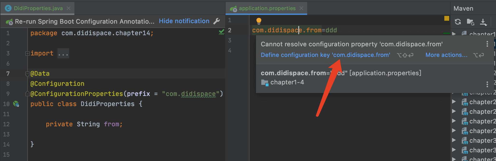
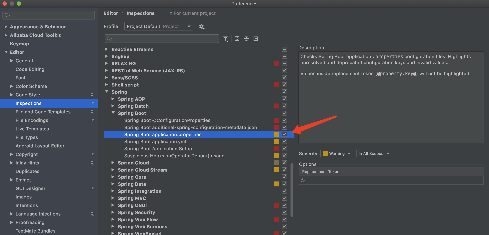
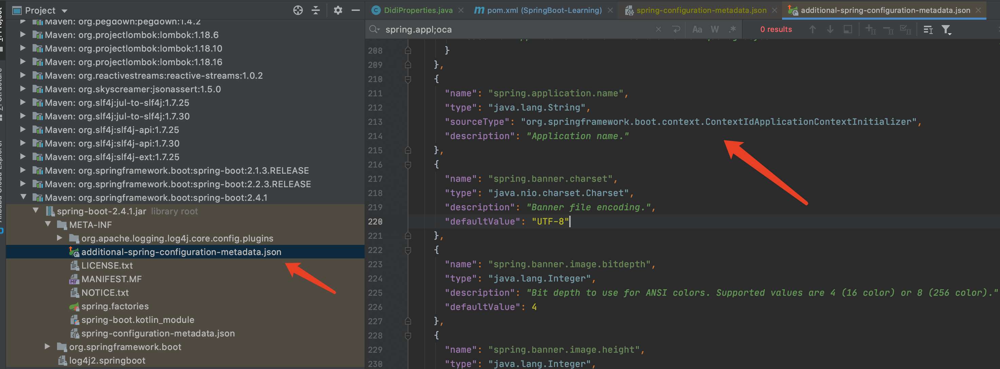
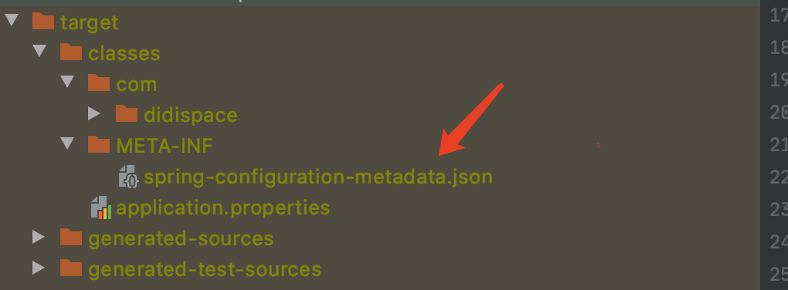
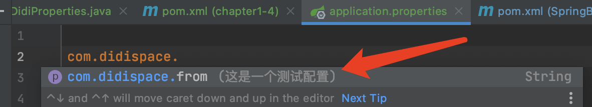

## 1.Spring Configuration Processor

>   它的作用和 主配置文件 application.properties 或者 application.yml 里面的 spring.profiles.active 有着相似的作用，但是不同的是，使用 spring.profiles.avtive，你添加的其他配置文件命名格式只能是 application-{name}.properties 或者 application-{name}.yml，而使用文件处理器这个依赖，则对文件名没有任何约束

### 1.pom依赖

```xml
<dependency>
    <groupId>org.springframework.boot</groupId>
    <artifactId>spring-boot-configuration-processor</artifactId>
    <optional>true</optional>
</dependency>
```

### 2.创建其他配置文件

```properties
love.you=aoxin
love.me=mdxl
love.they=78
```

- 这个配置文件先命名为 application-haha.properties，然后如果想要使用里面的属性值的时候，只能在application.propertiesz中加入

  ```properties
  spring.profiles.active=haha
  ```

- 这样，我们才能在代码类中获取到该值，如下

  ```java
  @RestController
  public class DockerController {
      @Value("${love.you}")
      private String name;
  
      @GetMapping("/test1")
      public String test1(){
          return name;
      }
  }
  ```

### 3.文件处理器

​    使用文件处理器，我们可以创建任意名字的配置文件，如 haha.properties,同时也不需要在application配置文件中引入，我们可以直接使用，不过有一个前提就是在引入它的属性值的类上，加上注解 @PropertySource("classpath:haha.properties") ，这样我们依旧可以使用，把之前active的引入删除

```java
@RestController
@PropertySource("classpath:haha.properties")
public class DockerController {

    @Value("${love.you}")
    private String name;

    @GetMapping("/test1")
    public String test1(){
        return name;
    }
}
```

### 4、为什么使用它？

​    那么看上去也并没有区别么，倒是有一点费劲的感觉，其实不然，因为有些配置文件里面的属性，有些开发工程师是直接想在配置类中使用，不想在主配置文件spring.profiles.active依赖，而这种属性值往往也不分开发环境、仿真环境和线上环境的，所以会有一小部分开发工程师乐意去使用它。

---

## 2.application/x-www-form-urlencoded 类型的请求

由 RequestParamMethodArgumentResolver 参数解析器解析

```java
HandlerMethodArgumentResolverComposite.class

private HandlerMethodArgumentResolver getArgumentResolver(MethodParameter parameter) {
    HandlerMethodArgumentResolver result = this.argumentResolverCache.get(parameter);
    if (result == null) {
        for (HandlerMethodArgumentResolver resolver : this.argumentResolvers) {
            if (resolver.supportsParameter(parameter)) {
                result = resolver;
                this.argumentResolverCache.put(parameter, result);
                break;
            }
        }
    }
    return result;
}
```

|   参数注解    | Request | Map  | Pojo |
| :-----------: | :-----: | :--: | :--: |
|   不加注解    |    √    |  ×   |  √   |
| @RequestParam |    ×    |  √   |  ×   |
| @RequestBody  |    ×    |  ×   |  ×   |

---

移除默认的 logback 日志

```xml
<dependency>
    <groupId>org.springframework.boot</groupId>
    <artifactId>spring-boot-starter-web</artifactId>
    <exclusions>
        <exclusion>
            <groupId>org.springframework.boot</groupId>
            <artifactId>spring-boot-starter-logging</artifactId>
        </exclusion>
    </exclusions>
</dependency>
<dependency>
    <groupId>org.springframework.boot</groupId>
    <artifactId>spring-boot-starter-test</artifactId>
    <scope>test</scope>
    <exclusions>
        <exclusion>
            <groupId>org.springframework.boot</groupId>
            <artifactId>spring-boot-starter-logging</artifactId>
        </exclusion>
    </exclusions>
</dependency>
```

---

## 3.事务传播行为

用来描述这样一个现象：`methodA`开启了一个事务，调用了`methodB`，`methodB`是继续在`methodA`的事务中进行还是开启一个新的事物。

```java
@Transaction(Propagation=REQUIRED)
public void methodA() {
    methodB();
    //doSomething
}

@Transaction(Propagation=REQUIRED_NEW)
public void methodB() {
    //doSomething
}
```

**七种传播行为**

- `REQUIRED`（默认）

  如果当前有事务，则继续在事务中进行， 如果没有则开启一个新的事务

- `REQUIRED_NEW`

  无论是否存在事务，都会开启一个新的事务来执行，新老事务相互独立，一个事务抛出异常不会影响另一个事务的提交

- `NESTED`

  如果当前存在事务，则嵌套在当前事务中执行，如果没有事务则新建一个事务

  外部事务抛出异常会导致嵌套事务回滚，嵌套事务回滚不会影响外部事务

- `SUPPORTS`

  支持当前事务，如果当前不存在事务，就以非事务的方式进行

- `NOT_SUPPORTED`

  以非事务的方式执行，如果当前存在事务，则把当前事务挂起

- `MANDATORY`

  强制的事务执行，如果不存在事务就抛出异常

- `NEVER`

  以非事务的方式执行，如果存在事务则抛出异常

---

## 4.spring、springMVC、springboot的区别

`spring`是一个 IOC 容器，用来管理 Bean，使用依赖注入实现控制反转，可以方便的整合各种框架，提供 AOP 机制弥补 OOP 的代码重复问题，更方便地将不同类不同方法中的共同处理抽取成切面，自动注入给方法执行，比如日志、异常等。

`springMVC`是`spring`对 web 框架的一个解决方案，提供了一个总的前端控制器`Servlet`，用来接受请求，然后定义了一套路由策略（url 到 handler 的映射）及适配执行 handler，将 handler 结果使用试图解析技术生成试图传递给前端。

`springboot`是`spring`提供的一个快速开发工具包，相当于`springMVC`的进阶版，让程序员能更方便、更快速的开发`spring+springMVC`应用，简化了配置（约定了默认配置，使用 class 代替 xml配置文件），整合了一系列的解决方案（starter 机制）。

---

## 5.IOC

`IOC容器`，实际上就是个`map(key, value)`，里面存的是`各种对象`（在 xml 里配置的 bean 节点、@Repository、@Service、@Controller、@Component），在项目启动的时候会读取配置文件里面的 bean 节点，根据全限定类名使用反射创建对象放到 map 里。

这个时候 map 里就有各种对象了，接下来我们在代码里需要用到对象时，再通过`DI注入`（@Autowired、@Resource 等注解，以及 xml 里 bean 节点的 ref 属性）

**控制反转**

没有引入 IOC 容器之前，对象 A 依赖于对象 B，那么对象 A 在初始化或者运行到某一点的时候，自己必须主动去创建对象 B 或者使用已经创建的对象 B，无论是创建还是使用对象 B，控制全都在自己手上。

引入 IOC 容器后，对象 A 与对象 B 之间失去了直接联系，当对象 A 运行到需要对象 B 的时候，IOC 容器会主动创建一个对象 B 注入到对象 A 需要的地方。

可以看出，对象 A 获得依赖对象 B 的过程由主动行为变成了被动行为，控制权颠倒过来了，这就是`控制反转`的由来。

全部对象的控制权全部上缴给`IOC容器`，所以`IOC容器`成了整个系统的关键核心，他起到了粘合剂的作用，把系统中的所有对象粘合在一起发挥作用，如果没有这个粘合剂，对象之间就彼此失去了联系。

**依赖注入**

获得依赖对象的过程由自身管理变成了由`IOC容器`主动注入，依赖注入是实现`IOC`的方法，就是由`IOC容器`在运行期间，动态地将某种依赖关系注入到对象之中。

---

## 6.注入 Bean 的七种方式

- 使用`xml`的方式声明`Bean`的定义，`Spring容器`在启动时会加载并解析这个 xml，把 Bean 装载到`IOC容器`中
- 使用`@ComponentScan`注解扫描声明了`@Controller`、`@Service`、`@Repository`、`@COmponent`注解的类
- 使用`@COnfiguration`注解声明配置类，并使用`@Bean`注解实现 Bean 的定义
- 使用`@Import`注解，导入配置类或者普通的`Bean`，解决了导入第三方`Bean`的问题
- 使用`FactoryBean工厂Bean`，动态构建一个`Bean实例`
- 实现`ImportBeanDefinitionRegistrer`接口，重写`registerBeanDefinitions`方法，可以动态的注入`Bean`实例
- 实现前置处理器接口`BeanDefinitionRegistryPostProcessor`，重写`postProcessBeanDefinitionRegistry`方法，同样可以动态注入`Bean`，[参考](./Spring Boot 2 注解驱动开发.md#BeanDefinitionRegistryPostProcessor)
- 实现`ImportSelector`接口，动态批量注入配置类或者`Bean`对象

## 7.一个注解，优雅的实现循环重试功能

在实际工作中，重处理是一个非常常见的场景，比如：

- 发送消息失败。
- 调用远程服务失败。
- 争抢锁失败。

这些错误可能是因为网络波动造成的，等待过后重处理就能成功。通常来说，会用`try/catch`，`while`循环之类的语法来进行重处理，但是这样的做法缺乏统一性，并且不是很方便，要多写很多代码。然而`spring-retry`却可以通过注解，在不入侵原有业务逻辑代码的方式下，优雅的实现重处理功能。

### 1.@Retryable是什么？

spring 系列的`spring-retry`是另一个实用程序模块，可以帮助我们以标准方式处理任何特定操作的重试。在`spring-retry`中，所有配置都是基于简单注释的。

### 2.使用步骤

#### POM依赖

```xml
<dependency>
    <groupId>org.springframework.retry</groupId>
    <artifactId>spring-retry</artifactId>
</dependency>
```

#### 启用`@Retryable`

```java
@EnableRetry
@SpringBootApplication
public class HelloApplication {
    public static void main(String[] args) {
        SpringApplication.run(HelloApplication.class, args);
    }
}
```

#### 在方法上添加`@Retryable`

```java
@Service
public class TestRetryServiceImpl implements TestRetryService {
 
    @Override
    @Retryable(value = Exception.class, maxAttempts = 3, backoff = @Backoff(delay = 2000,multiplier = 1.5))
    public int test(int code) throws Exception{
        System.out.println("test被调用,时间："+LocalTime.now());
          if (code==0){
              throw new Exception("情况不对头！");
          }
        System.out.println("test被调用,情况对头了！");
 
        return 200;
    }
}
```

来简单解释一下注解中几个参数的含义：

- `value`：抛出指定异常才会重试
- `include`：和 value 一样，默认为空，当 exclude 也为空时，默认所有异常
- `exclude`：指定不处理的异常
- `maxAttempts`：最大重试次数，默认3次
- `backoff`：重试等待策略，默认使用`@Backoff`，`@Backoff`的 value 默认为1000L，我们设置为2000L；`multiplier`（指定延迟倍数）默认为 0，表示固定暂停 1 秒后进行重试，如果把`multiplier`设置为1.5，则第一次重试为 2 秒，第二次为 3 秒，第三次为 4.5 秒。

**当重试耗尽时还是失败，会出现什么情况呢？**

当重试耗尽时，`RetryOperations`可以将控制传递给另一个回调，即`RecoveryCallback`。`Spring-Retry`还提供了`@Recover`注解，用于 @Retryable 重试失败后处理方法。如果不需要回调方法，可以直接不写回调方法，那么实现的效果是，重试次数完了后，如果还是没成功没符合业务判断，就抛出异常。

#### @Recover

```java
@Recover
public int recover(Exception e, int code){
   System.out.println("回调方法执行！！！！");
   //记日志到数据库 或者调用其余的方法
    return 400;
}
```

可以看到传参里面写的是 `Exception e`，这个是作为回调的接头暗号（重试次数用完了，还是失败，我们抛出这个`Exception e`通知触发这个回调方法）。对于`@Recover`注解的方法，需要特别注意的是：

- 方法的返回值必须与`@Retryable`方法一致
- 方法的第一个参数，必须是 Throwable 类型的，建议是与`@Retryable`配置的异常一致，其他的参数，需要哪个参数，写进去就可以了（`@Recover`方法中有的）
- 该回调方法与重试方法写在同一个实现类里面

#### 注意事项

- 由于是基于 AOP 实现，所以不支持类里自调用方法
- 如果重试失败需要给`@Recover`注解的方法做后续处理，那这个重试的方法不能有返回值，只能是 void
- 方法内不能使用`try catch`，只能往外抛异常
- `@Recover`注解来开启重试失败后调用的方法(注意，需跟重处理方法在同一个类中)，此注解注释的方法参数一定要是`@Retryable`抛出的异常，否则无法识别，可以在该方法中进行日志处理。

## 8.如何理解 starter

为了让开发者在开发 spring 生态下的企业级应用的时候，只需要关心业务逻辑，减少对配置和外部环境的依赖。

主要作用有以下几个：

- 维护对应 jar 包的版本依赖，开发者可以不需要关心版本冲突等容易出错的细节
- 自动导入对应功能的所有的 jar 包依赖
- 导入 starter 后，这个组件会自动集成到 Spring 生态中，对于相关的 bean 的管理也是基于自动装配机制来完成的
- 依赖 starter 组件后，这些功能所需要维护的外部化配置会自动集成到 Spring Boot 中，只需要在 application.properties 中配置

> 命名方式
>
> - 官方维护的 starter：spring-boot-starter-xxx
> - 第三方维护的 starter：xxx-spring-boot-starter

## 9.定时任务

### 9.1 简单定时任务

对于一些比较简单的定时任务，比如固定时间间隔执行固定方法，在标准 Java 方法上注解`@Scheduled`即可

```java
@Component
public class ScheduledTask {

    @Scheduled(cron = "0/10 * * * * ?") //每10秒执行一次
    public void scheduledTaskByCorn() {
        LoggerUtils.info("定时任务开始 ByCorn：" + DateUtils.dateFormat());
        scheduledTask();
        LoggerUtils.info("定时任务结束 ByCorn：" + DateUtils.dateFormat());
    }

    @Scheduled(fixedRate = 10000) //每10秒执行一次
    public void scheduledTaskByFixedRate() {
        LoggerUtils.info("定时任务开始 ByFixedRate：" + DateUtils.dateFormat());
        scheduledTask();
        LoggerUtils.info("定时任务结束 ByFixedRate：" + DateUtils.dateFormat());
    }

    @Scheduled(fixedDelay = 10000) //每10秒执行一次
    public void scheduledTaskByFixedDelay() {
        LoggerUtils.info("定时任务开始 ByFixedDelay：" + DateUtils.dateFormat());
        scheduledTask();
        LoggerUtils.info("定时任务结束 ByFixedDelay：" + DateUtils.dateFormat());
    }

    private void scheduledTask() {
        try {
            Thread.sleep(5000);
        } catch (InterruptedException e) {
            e.printStackTrace();
        }
    }
}
```

然后项目启动类上增加注解`@EnableScheduling`，表示开启定时任务

```java
@SpringBootApplication
@EnableScheduling
public class SpringBootDemoApplication {

    public static void main(String[] args) {
        SpringApplication.run(SpringBootDemoApplication.class, args);
    }
}
```

这里因为我们在 ScheduledTask 类创建了三个定时任务，@Scheduled 默认是不并发执行的，因此我们先注释掉其他，分别进行测试。

> `@Scheduled(cron = "0/10 * * ?")`控制的每 10 秒执行一次的定时任务，是每 10 秒整执行一次，即一分钟内，如果当前秒数能够整除 10，则执行定时任务，即只会在10s，20s，30s...的时候执行，如果配置定时任务`@Scheduled(cron = "0/7 * * ?")`这种，则只会在0s，7s，14s...的时候执行。
>
> 对于`fixedRate`来说，如果业务代码执行时间小于定时任务间隔时间，那么定时任务每 10 秒执行一次，且不受业务代码影响，无论业务代码执行多久，定时任务都是 10 秒执行一次；如果业务代码执行时间大于定时任务间隔时间，则定时任务循环执行。
>
> 对于`fixedDelay`来说，不管业务代码执行时间与定时任务间隔时间熟长熟短，定时任务都会等业务代码执行完成后再开启新一轮定时。

### 9.2 corn表达式

corn 表达式格式：秒 分 时 日 月 星期 年（可选）

| 字段名     | 允许的值        | 允许的特殊字符   |
| ---------- | --------------- | ---------------- |
| 秒         | 0-59            | , - * /          |
| 分         | 0-59            | , - * /          |
| 时         | 0-23            | , - * /          |
| 日         | 1-31            | , - * ? / L W C  |
| 月         | 1-12 or JAN-DEC | , - * /          |
| 星期       | 1-7 or SUN-SAT  | , - *  ? / L C # |
| 年（可选） | 1970-2099       | , - * /          |

*****：通配符，表示该字段可以接收任意值。

**？** ：表示不确定的值，或不关心它为何值，仅在日期和星期中使用，当其中一个设置了条件时，另外一个用"?" 来表示"任何值"。

**,**：表示多个值，附加一个生效的值。

**-**：表示一个指定的范围

**/**：指定一个值的增量值。例n/m表示从n开始，每次增加m

**L**：用在日期表示当月的最后一天，用在星期"L"单独使用时就等于"7"或"SAT"，如果和数字联合使用表示该月最后一个星期X。例如，"0L"表示该月最后一个星期日。

**W**：指定离给定日期最近的工作日（周一到周五），可以用"LW"表示该月最后一个工作日。例如，"10W"表示这个月离10号最近的工作日

**C**：表示和calendar联系后计算过的值。例如：用在日期中，"5C"表示该月第5天或之后包括calendar的第一天；用在星期中，"5C"表示这周四或之后包括calendar的第 一天。

**#**：表示该月第几个星期X。例6#3表示该月第三个周五。

**示例值**

0 * *** ? 每分钟触发

0 0 * * * ? 每小时整触发

0 0 4 * * ? 每天凌晨4点触发

0 15 10 * * ? 每天早上10：15触发

*/5 ** * * ? 每隔5秒触发

0 */5 ** * ? 每隔5分钟触发

0 0 4 1 * ? 每月1号凌晨4点触发

0 0 4 L * ? 每月最后一天凌晨3点触发

0 0 3 ? * L 每周星期六凌晨3点触发

0 11,22,33 * * * ? 每小时11分、22分、33分触发

### 9.3 配置定时任务

对于上面那些简单的定时任务，定时任务的 corn 表达式写死在代码里，如果要改动表达式，需要修改代码，重新打包发布，比较麻烦。因此，我们可以把 corn 表达式配置在配置文件中，然后程序读取配置，当需要修改表达式时，只需要修改配置文件即可。

application.yml 增加配置

```yaml
demo:
  corn: 0/11 * * * * ?
```

定时任务

```java
@Component
public class ScheduledTask {

    @Scheduled(cron = "${demo.corn}")
    public void scheduledTaskByConfig() {
        LoggerUtils.info("定时任务 ByConfig：" + DateUtils.dateFormat());
    }
}
```

### 9.4 动态修改定时任务

对于有些情况，我们需要在代码中，通过方法动态修改定时任务corn表达式

application.yml 配置

```yaml
demo:
  corn: 0/7 * * * * ?
  cornV2: 0/22 * * * * ?
```

新建ScheduledTaskV2.java

```java
@Component
public class ScheduledTaskV2 implements SchedulingConfigurer {

    @Value("${demo.corn}")
    private String corn;
    @Value("${demo.cornV2}")
    private String cornV2;

    private int tag = 0;

    @Override
    public void configureTasks(ScheduledTaskRegistrar scheduledTaskRegistrar) {
        scheduledTaskRegistrar.addTriggerTask(() -> {
            LoggerUtils.info("定时任务V2：" + DateUtils.dateFormat());
        }, (triggerContext) -> {
            CronTrigger cronTrigger;
            if (tag % 2 == 0) {
                LoggerUtils.info("定时任务V2动态修改corn表达式：" + corn + "," + DateUtils.dateFormat());
                cronTrigger = new CronTrigger(corn);
                tag++;
            } else {
                LoggerUtils.info("定时任务V2动态修改corn表达式：" + cornV2 + "," + DateUtils.dateFormat());
                cronTrigger = new CronTrigger(cornV2);
                tag++;
            }

            return cronTrigger.nextExecutionTime(triggerContext);
        });
    }
}
```

### 9.5 并发执行定时任务

定时任务类添加注解`@EnableAsync`，需并发执行的定时任务方法添加注解`@Async`

```java
@Component
@EnableAsync
public class ScheduledTaskV3 {

    @Scheduled(cron = "0/7 * * * * ?")
    @Async
    public void scheduledTaskV1() {
        LoggerUtils.info("定时任务V3，定时任务1开始：" + DateUtils.dateFormat());
        scheduledTask();
        LoggerUtils.info("定时任务V3，定时任务1结束：" + DateUtils.dateFormat());
    }

    @Scheduled(cron = "0/10 * * * * ?")
    @Async
    public void scheduledTaskV2() {
        LoggerUtils.info("定时任务V3，定时任务2开始：" + DateUtils.dateFormat());
        scheduledTask();
        LoggerUtils.info("定时任务V3，定时任务2结束：" + DateUtils.dateFormat());
    }

    @Scheduled(cron = "0/22 * * * * ?")
    @Async
    public void scheduledTaskV3() {
        LoggerUtils.info("定时任务V3，定时任务3开始：" + DateUtils.dateFormat());
        scheduledTask();
        LoggerUtils.info("定时任务V3，定时任务3结束：" + DateUtils.dateFormat());
    }

    private void scheduledTask() {
        try {
            Thread.sleep(5000);
        } catch (InterruptedException e) {
            e.printStackTrace();
        }
    }
}
```

## 10.配置元数据的应用

在使用Spring Boot开发应用的时候，你是否有发现这样的情况：自定义属性是有高量背景的，鼠标放上去，有一个`Cannot resolve configuration property`的配置警告。



如果不对于这个警告觉得烦，想要去掉，那么可以通过设置来去除：



但是，我的建议是不要去掉，因为这个警告正好可以通过高亮来区分你的自定义配置以及框架配置，可以让你快速的分辨哪些是自定义的。

如果你实在想去掉，那么也不建议用上面说的方法，而是建议通过完善配置元数据的方式来完成。所以，今天就来具体说说配置元数据的应用！

### 啥是配置元数据？

我们不妨打开一个已经创建好的Spring Boot项目，查看一下它的Spring Boot依赖包，可以找到如下图的一个json文件：



这里报错的就是配置的元数据信息。有没有发现这些`name`的值都很熟悉？其中`description`是不是也很熟悉？对，这些就是我们常用的Spring Boot原生配置的元数据信息。

这下知道配置元数据可以用来做啥了吧？它可以帮助IDE来完成配置联想和配置提示的展示。

而我们自定义配置之所以会报警告，同时也没有提示信息，就是因为没有这个元数据的配置文件！

### 配置元数据的自动生成

既然知道了原理，那么接下来我们尝试用一下配置元数据试试！

**第一步**：创建一个配置类，定义一个自定义配置

```java
@Data
@Configuration
@ConfigurationProperties(prefix = "com.didispace")
public class DidiProperties {
    
    /**
     * 这是一个测试配置
     */
    private String from;

}
```

**第二步**：在`pom.xml`中添加自动生成配置元数据的依赖

```xml
<dependency>
    <groupId>org.springframework.boot</groupId>
    <artifactId>spring-boot-configuration-processor</artifactId>
</dependency>
```

**第三步**：`mvn install`下这个项目。

此时我们可以在工程target目录下找到元数据文件：



同时，我们在配置文件中尝试编写这个自定义的配置项时，可以看到编译器给出了联想和提示：



并且，编写完配置之后，也没有高亮警告了！
