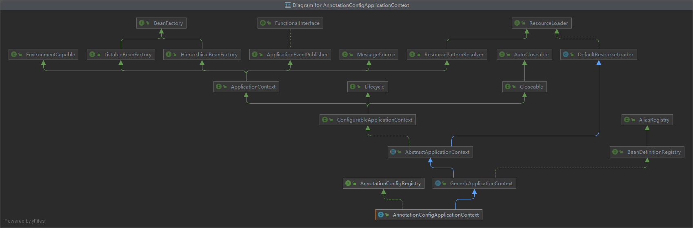
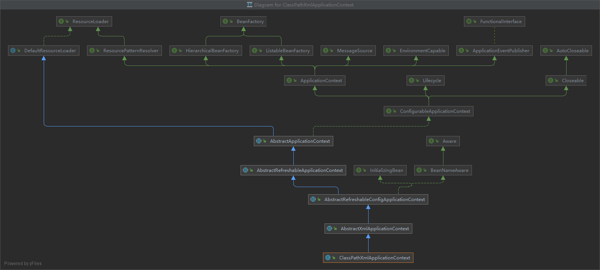
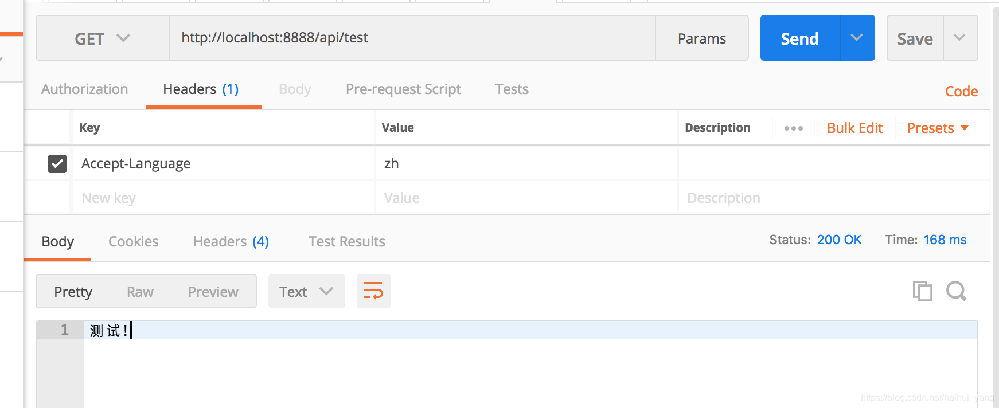
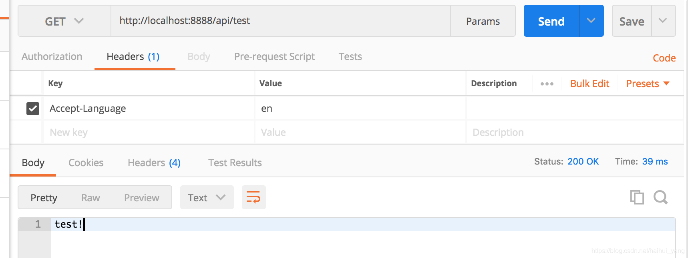
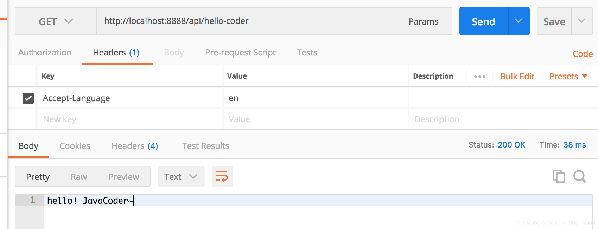

# Spring容器创建过程

容器的创建方式有两种，一种通过注解加载 bean，此时使用的是`AnnotationConfigApplicationContext`；另一种是通过 xml 配置文件加载，此时使用的上下文是`ClassPathXmlApplicationContext`，不过他们最终都会调用父类`AbstractApplicationContext`的`refresh()`方法来启动容器。

**1.AnnotationConfigApplicationContext**

```java
public class AnnotationConfigApplicationContext {
    public AnnotationConfigApplicationContext(Class<?>... componentClasses) {
        // ↓
        this();
        // 注册启动类的 BeanDefinition
        register(componentClasses);
        // 刷新容器
        refresh();
    }
    
    public AnnotationConfigApplicationContext() {
		StartupStep createAnnotatedBeanDefReader = this.getApplicationStartup().start("spring.context.annotated-bean-reader.create");
        // 注册以下组件的 BeanDefinition
        // ConfigurationClassPostProcessor
        // AutowiredAnnotationBeanPostProcessor
        // CommonAnnotationBeanPostProcessor
        // EventListenerMethodProcessor
        // DefaultEventListenerFactory
		this.reader = new AnnotatedBeanDefinitionReader(this);
		createAnnotatedBeanDefReader.end();
		this.scanner = new ClassPathBeanDefinitionScanner(this);
	}
}
```

`this()`

调用父类 GenericApplicationContext 的无参构造方法。

```java
public GenericApplicationContext() {
 // 创建一个 DefaultListableBeanFactory
 this.beanFactory = new DefaultListableBeanFactory();
}
```

继承关系



通过`SpringApplication.run()`方法启动时，流程稍有不同：

先根据类型创建容器：

- `ServletWebServerApplicationContext`
- `ReactiveWebServerApplicationContext`

再在重载的`run(String... args)`方法中执行`this.refreshContext(context)`来刷新容器：

```java
public class SpringApplication {
    private void refreshContext(ConfigurableApplicationContext context) {
        if (this.registerShutdownHook) {
            shutdownHook.registerApplicationContext(context);
        }
        // 刷新容器
        this.refresh(context);
    }
```

**2.ClassPathXmlApplicationContext**

```java
public ClassPathXmlApplicationContext(String configLocation) throws BeansException {
    this(new String[] {configLocation}, true, null);
}
public ClassPathXmlApplicationContext(
    String[] configLocations, boolean refresh, @Nullable ApplicationContext parent)
    throws BeansException {

    super(parent);
    setConfigLocations(configLocations);
    if (refresh) {
        refresh();
    }
}
```

继承关系



```java
class ConfigurationClassBeanDefinitionReader {

    public void loadBeanDefinitions(Set<ConfigurationClass> configurationModel) {
        TrackedConditionEvaluator trackedConditionEvaluator = new TrackedConditionEvaluator();
        for (ConfigurationClass configClass : configurationModel) {
            // ↓
            loadBeanDefinitionsForConfigurationClass(configClass, trackedConditionEvaluator);
        }
    }

    // ↑
    private void loadBeanDefinitionsForConfigurationClass(
        ConfigurationClass configClass, TrackedConditionEvaluator trackedConditionEvaluator) {

        if (trackedConditionEvaluator.shouldSkip(configClass)) {
            String beanName = configClass.getBeanName();
            if (StringUtils.hasLength(beanName) && this.registry.containsBeanDefinition(beanName)) {
                this.registry.removeBeanDefinition(beanName);
            }
            this.importRegistry.removeImportingClass(configClass.getMetadata().getClassName());
            return;
        }
        // 判断当前配置候选类是否由其他类 import 导入或者是否是某个配置类的 Bean
        // Import 导入的类在这里完成 Beandefinition 加载
        if (configClass.isImported()) {
            registerBeanDefinitionForImportedConfigurationClass(configClass);
        }
        // 调用 getBeanMethods() 获取所有存储的 BeanMethod 对象
        // 注册 @Bean 注解标注的 Bean 的 BeanDefinition！
        for (BeanMethod beanMethod : configClass.getBeanMethods()) {
            loadBeanDefinitionsForBeanMethod(beanMethod);
        }

        // 注册 ImportBeanDefinitionRegistrar 导入的 Beandefinition
        // 遍历 importBeanDefinitionRegistrars：Map
        loadBeanDefinitionsFromImportedResources(configClass.getImportedResources());
        loadBeanDefinitionsFromRegistrars(configClass.getImportBeanDefinitionRegistrars());
    }

}
```


## BeanDefinition

保存了 Bean 的一系列定义信息的对象，例如全类名、属性名、懒加载等。

## BeanFactoryPostProcessor

BeanFactory 的后置处理器，在 BeanFactory 标准初始化之后执行

## 6.注册BeanPostProcessor

`registerBeanPostProcessors(beanFactory)` （Bean 的后置处理器：拦截 Bean 的创建过程）

- 五个接口：不同类型的 BeanPostProcessor 执行时机不同

  - BeanPostProcessor
  - DestructionAwareBeanPostProcessor
  - [引用：InstantiationAwareBeanPostProcessor（AOP）](Spring Boot 2 注解驱动开发.md#InstantiationAwareBeanPostProcessor)
  - SmartInstantiationAwareBeanPostProcessor
  - [引用：MergedBeanDefinitionPostProcessor](Spring Boot 2 注解驱动开发.md#MergedBeanDefinitionPostProcessor)：会被放到 internalPostProcessors 集合中

- **执行过程**

1. 获取所有的 BeanPostProcessor，后置处理器都可以默认通过 PriorityOrdered 和 Ordered 接口来指定优先级
  2. 先注册 PriorityOrdered 优先级接口的 BeanPostProcessor，把每一个 BeanPostProcessor 添加到 beanFactory 中

3. 再注册实现了 Ordered 接口的
  4. 最后注册没有实现任何优先级或者顺序接口的
  5. 最终注册 internalPostProcessors
  6. 注册一个 ApplicationListenerDetector，来在 Bean 创建实例完成后检查是否是 ApplicationListener，如果是则添加到容器中

## 7.初始化MessageSource组件

`initMessageSource()` （做国际化功能，消息绑定，消息解析）

1. 获取 beanFactory

2. 看容器中是否有 ID 为 MessageSource 类型为 MessageSource 的组件

   - 如果有，则赋值给 this.messageSource
     - MessageSource：取出国际化配置文件中的某个 Key 的值，能按照区域信息获取
   - 如果没有，则自己创建一个 DelegatingMessageSource，但需要手动设置 setParentMessageSource()，否则无法使用

3. 把创建好的 MessageSource 注册到容器中，以后获取国际化配置文件中的值时，可以自动注入 MessageSource，调用 getMessage() 方法

4. 应用（**ResourceBundleMessageSource**）：

   1. I18nService 封装 MessageSource 类，按照需要新增方法或简化调用链

      ```java
      public class I18nService {
      
          private final MessageSource messageSource;
      
          public I18nService(MessageSource messageSource) {
              this.messageSource = messageSource;
          }
      
          public String getMessage(String msgKey, Object[] args, Locale locale) {
              return messageSource.getMessage(msgKey, args, locale);
          }
      
          public String getMessage(String msgKey, Locale locale) {
              return messageSource.getMessage(msgKey, null, locale);
          }
      }
      ```

   2. 配置 I18nService，主要是配置资源文件的 baseNames

      ```java
      // 只注册一个 I18nService（推荐）， 只有当存在 messages[spring.messages.basename].properties 文件时，MessageSourceAutoConfiguration 才会自动向容器中注册 MessageSourceProperties 和 ResourceBundleMessageSource
      @Bean
      public I18nService i18nService(MessageSource messageSource) {
          return new I18nService(messageSource);
      }
      
      ================================================================================
      // 或者手动向容器中注册一个 ResourceBundleMessageSource，此时 MessageSourceAutoConfiguration 不再工作
      @Bean
      public I18nService i18nService(ResourceBundleMessageSource resourceBundleMessageSource) {
          return new I18nService(resourceBundleMessageSource);
      }
      
      @Bean
      public ResourceBundleMessageSource messageSource() {
          Locale.setDefault(Locale.CHINESE); // 在 ResourceBundle 会中调用 Locale.getDefault() 获取默认的地区
          ResourceBundleMessageSource source = new ResourceBundleMessageSource();
          source.setBasenames("messages"); // name of the resource bundle
          source.setUseCodeAsDefaultMessage(true);
          source.setDefaultEncoding("UTF-8");
          return source;
      }
      
      =================================================================================
      // 或者往容器中加入 messageSourceProperties 后利用配置文件更改属性
      @Bean
      public I18nService i18nService(ResourceBundleMessageSource resourceBundleMessageSource) {
          return new I18nService(resourceBundleMessageSource);
      }
      
      @ConfigurationProperties(prefix = "spring.messages")
      @Bean
      public MessageSourceProperties messageSourceProperties() {
          return new MessageSourceProperties();
      }
      
      @Bean
      public ResourceBundleMessageSource messageSource(MessageSourceProperties messageSourceProperties) {
          Locale.setDefault(Locale.CHINESE);
          ResourceBundleMessageSource source = new ResourceBundleMessageSource();
          source.setBasename(messageSourceProperties.getBasename()); // basename 可同时设置多个，用 "," 分隔开
          source.setDefaultEncoding(String.valueOf(messageSourceProperties.getEncoding()));
          return source;
      }
      ```

   3. 多语言资源配置文件（basenames = i18n/messages），即配置文件所在目录为 i18n，文件前缀为 messages，和语言之间以下划线隔开，下划线后的语言可任意设置，需同 Locale 对象中传入的一致（由 ResourceBundle.toBundleName() 负责解析）

      - messages.properties

        ```properties
        message.key.test=测试!
        message.key.hello=你好！{0}~
        ```

      - messages_en.properties

        ```properties
        message.key.test=test!
        message.key.hello=hello！{0}~
        ```

   4. 用于测试用的 controller

      ```java
      @Controller
      @RequestMapping(value = "/api")
      public class HelloJavaCoderController {
      
          private final I18nService i18nService;
      
          public HelloJavaCoderController(I18nService i18nService) {
              this.i18nService = i18nService;
          }
      
          @GetMapping("/hello-coder")
          public ResponseEntity greeting(@RequestHeader("Accept-Language") String lan) {
              return ResponseEntity.ok(i18nService.getMessage("message.key.hello", new Object[]{"JavaCoder"},new Locale(lan)));
          }
      
          @GetMapping("/test")
          public ResponseEntity test(@RequestHeader("Accept-Language") String lan) {
              return ResponseEntity.ok(i18nService.getMessage("message.key.test", new Locale(lan))));
          }
      
      }
      ```

   5. 使用 Postman 进行 restful API 测试

      1. 请求 http://localhost:8888/api/test 并在 header 中设置 Accept-Languate=zh，结果如下：

         

      2. 请求 http://localhost:8888/api/test 并在 header 中设置 Accept-Language=en，结果如下：

         

      3. 请求 http://localhost:8888/hello-coder 并在 header 中设置 Accept-Language=zh，结果如下：

         

      4. 请求 http://localhost:8888/hello-coder 并在 header 中设置 Accept-Languate=en，结果如下：

         

## 8.初始化事件派发器

[引用：initApplicationEventMulticaster()](Spring Boot 2 注解驱动开发.md#ApplicationEventMulticaster)

## 9.初始化其他特殊Bean

`onRefresh()`

> 留给子容器（子类），重写该方法，在容器刷新时可以自定义逻辑

## 10.注册ApplicationListener

[引用：registerListeners()](Spring Boot 2 注解驱动开发.md#registerListeners)

## ==11.初始化所有剩下的单实例Bean==

```java
public abstract class AbstractApplicationContext {
    
    public void refresh() throws BeansException, IllegalStateException {
        ...
        // 实例化所有非懒加载的单例 bean
        finishBeanFactoryInitialization(beanFactory);
        ...
    }
    protected void finishBeanFactoryInitialization(ConfigurableListableBeanFactory beanFactory) {
        ...
        // 实例化所有非懒加载的单例 bean
        beanFactory.preInstantiateSingletons();
    }
}
```

最终调用`DefaultListableBeanFactory`的`preInstantiateSingletons()`方法

```java
public class DefaultListableBeanFactory {
    
    public void preInstantiateSingletons() throws BeansException {
        ...

        // 1.获取容器中的所有 Bean 名称
        List<String> beanNames = new ArrayList(this.beanDefinitionNames);
        Iterator var2 = beanNames.iterator();

        while(true) {
            String beanName;
            Object bean;
            do {
                while(true) {
                    RootBeanDefinition bd;
                    do {
                        do {
                            do {
                                // 4.当遍历创建完 Bean 后，再次重新遍历检查是否是 SmartInitializingSingleton，如果是则执行 afterSingletonsInstantiated()
                                if (!var2.hasNext()) {
                                    var2 = beanNames.iterator();

                                    while(var2.hasNext()) {
                                        beanName = (String)var2.next();
                                        Object singletonInstance = this.getSingleton(beanName);
                                        if (singletonInstance instanceof SmartInitializingSingleton) {
                                            StartupStep smartInitialize = this.getApplicationStartup().start("spring.beans.smart-initialize").tag("beanName", beanName);
                                            SmartInitializingSingleton smartSingleton = (SmartInitializingSingleton)singletonInstance;
                                            if (System.getSecurityManager() != null) {
                                                AccessController.doPrivileged(() -> {
                                                    smartSingleton.afterSingletonsInstantiated();
                                                    return null;
                                                }, this.getAccessControlContext());
                                            } else {
                                                smartSingleton.afterSingletonsInstantiated();
                                            }

                                            smartInitialize.end();
                                        }
                                    }

                                    return;
                                }
                                beanName = (String)var2.next();
                                
                                // 2.获取 Bean 的定义信息：RootBeanDefinition
                                bd = this.getMergedLocalBeanDefinition(beanName);
                                
                                // 不是抽象的
                            } while(bd.isAbstract());
                            // 是单实例的
                        } while(!bd.isSingleton());
                        // 是懒加载的
                    } while(bd.isLazyInit());
                    
                    // 3.创建 Bean
					// 判断是否是 FactoryBean
                    if (this.isFactoryBean(beanName)) {
                        bean = this.getBean("&" + beanName);
                        break;
                    }
					// 不是 FactoryBean 则通过 getBean() 创建 bean！
                    this.getBean(beanName);
                }
            } while(!(bean instanceof FactoryBean));
            ...
        }
    }
}
```

### 1.【获取容器中的所有Bean名称】

### 2.【获取Bean的定义信息】

`RootBeanDefinition`

### 3.【创建Bean】

对于所有的**不是抽象的**、**单实例的**，**懒加载的** Bean，执行创建。

<a href="Spring 创建Bean.md">参考</a>

### 4.【执行`afterSingletonsInstantiated()】`

所有 Bean 创建完成后，在重新检查所有创建好的 Bean 是否是 SmartInitializingSingleton 接口，如果是则执行`afterSingletonsInstantiated()`方法。

在 <a href="Spring Boot 2 注解驱动开发.md#EventListener">@EventListener</a> 中使用到了该方法。

## 12.完成容器初始化创建工作

`finishRefresh()`

1. 【清楚容器级别的缓存】：`clearResourceCaches()`
2. 【初始化和生命周期有关的后置处理器】：`initLifecycleProcessor()`
   - 默认从容器中找是否有 LifecycleProcessor 类型的组件
   - 如果没有则 new 一个放到容器中
   - 可以写一个 LifecycleProcessor 的实现类，可以在 BeanFacoty 刷新完成及关闭的时候调用
3. 【调用生命周期处理器（BeanFactory）的 onRefresh() 方法】：`getLifecycleProcessor().onRefresh()`
4. 【发布刷新完成事件】：`publishEvent(new ContextRefreshedEvent(this))`
5. `LiveBeansView.registerApplicationContext(this)`

## 总结

1. Spring 容器启动时，先会保存所有注册进来的 Bean 的定义信息

   1. xml 注册 Bean
   2. 注解注册 Bean

2. Spring 容器会在合适时机创建这些 Bean

   非懒加载的单例 Bean 会在容器创建时创建，会调用`BeanFactory`子实现类的`doGetBean()`来创建，创建好后保存到一个单例 Bean 的 map 集合中，key 就是配置的 Bean 的名称。

3. 后置处理器：

   - 每一个 Bean 创建完成，都会使用各种后置处理器进行处理，来增强 Bean 的功能 [AutowiredAnnotationBeanPostProcessor 处理自动注入](Spring Boot 2 注解驱动开发.md#AutowiredAnnotationBeanPostProcessor)，<a href="Spring Boot 2 注解驱动开发.md#AnnotationAwareAspectJAutoProxyCreator">AnnotationAwareAspectJAutoProxyCreator 处理AOP功能</a>

4. 事件驱动模型：

   1. ApplicationListener：事件监听
   2. applicationEventMulticaster：事件派发