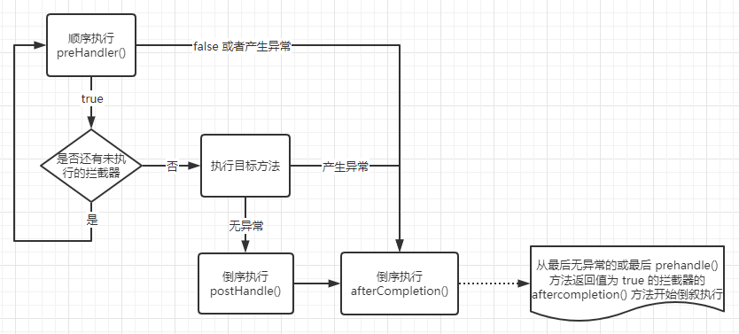

# 第5章_Web开发

## 1.静态资源访问

**静态资源目录**

静态资源放在类路径下：`classpath:/static`、`classpath:/public`、`classpath:/resources`、`classpath:/META-INF/resources`。

访问时需要访问：当前项目根路径 + / + 静态资源名。

> **原理**
>
> 收到请求时，先去找对应的`Controller`看谁能处理。找不到的所有请求都交给静态资源处理器。静态资源也找不到时则相应 404 页面。

**改变默认的静态资源路径**

```yaml
# 静态资源访问路径（设置该值会导致 index.html 和 Favicon 不能被访问，因为 controll 默认只处理 /index 请求）
spring:
  mvc:
    static-path-pattern: /res/**
# 静态资源存放路径
  web:
    resources:
      static-locations: classpath:/haha/
```

**自定义Favicon（浏览器图标）**

将`Favicon.ico`放在静态资源目录下即可。

**修改启动图**

```yaml
spring:
  banner:
    image:
      location: classpath:2.png
```

**静态资源配置原理**

`WebMvcAutoConfiguration`有一个内部静态类`WebMvcAutoConfigurationAdapter`，实现了`WebMvcConfigurer`。

```java
@Configuration(proxyBeanMethods = false)
@ConditionalOnWebApplication(type = Type.SERVLET)
@ConditionalOnClass({ Servlet.class, DispatcherServlet.class, WebMvcConfigurer.class })
@ConditionalOnMissingBean(WebMvcConfigurationSupport.class)
@AutoConfigureOrder(Ordered.HIGHEST_PRECEDENCE + 10)
@AutoConfigureAfter({ DispatcherServletAutoConfiguration.class, TaskExecutionAutoConfiguration.class,
                     ValidationAutoConfiguration.class })
public class WebMvcAutoConfiguration {
    
    @Import(EnableWebMvcConfiguration.class)
    // WebMvcProperties：prefix = "spring.mvc"
    // WebProperties：prefix = "spring.web"
    @EnableConfigurationProperties({ WebMvcProperties.class, WebProperties.class })
    @Order(0)
    public static class WebMvcAutoConfigurationAdapter implements WebMvcConfigurer, ServletContextAware {
        
        @Override
		public void addResourceHandlers(ResourceHandlerRegistry registry) {
            // spring.web.resources.add-mappings：是否禁用所有静态资源访问规则
			if (!this.resourceProperties.isAddMappings()) {
				logger.debug("Default resource handling disabled");
				return;
			}
			addResourceHandler(registry, "/webjars/**", "classpath:/META-INF/resources/webjars/");
			addResourceHandler(registry, this.mvcProperties.getStaticPathPattern(), (registration) -> {
                /**
                 * CLASSPATH_RESOURCE_LOCATIONS = { "classpath:/META-INF/resources/", "classpath:/resources/", "classpath:/static/", "classpath:/public/" };
                 */
				registration.addResourceLocations(this.resourceProperties.getStaticLocations());
				if (this.servletContext != null) {
					ServletContextResource resource = new ServletContextResource(this.servletContext, SERVLET_LOCATION);
					registration.addResourceLocations(resource);
				}
			});
		}
        
    }
    
}
```

**欢迎页的处理规则**

```java
final class WelcomePageHandlerMapping extends AbstractUrlHandlerMapping {
	WelcomePageHandlerMapping(TemplateAvailabilityProviders templateAvailabilityProviders,
			ApplicationContext applicationContext, Resource welcomePage, String staticPathPattern) {
        // 要使用欢迎页功能，必须是 /**
		if (welcomePage != null && "/**".equals(staticPathPattern)) {
			logger.info("Adding welcome page: " + welcomePage);
            // 底层使用转发机制
			setRootViewName("forward:index.html");
		}
		else if (welcomeTemplateExists(templateAvailabilityProviders, applicationContext)) {
			logger.info("Adding welcome page template: index");
			setRootViewName("index");
		}
	}    
}
```

## 2.请求参数处理

### 2.1 请求映射

**Rest风格支持**

使用 HTTP 请求方式动词来表示对资源的操作。

以前：`/getUser`：获取用户；`/deleteUser`：删除用户；`/editUser`：修改用户；`saveUser`：保存用户。

现在：`/user`-`get`：获取用户；`delete`：删除用户；`put`：修改用户；`post`：保存用户。

由于浏览器 form 表单仅支持 GET 和 POST，因此 Prototype 库使用的一种常见技术是使用普通的 POST 和附加的隐藏表单字段（`_method`）来传递真正的 HTTP 方法，需要使用到`HiddenHttpMethodFilter`过滤器：

```yaml
spring:
  mvc:
    hiddenmethod:
      filter:
        enabled: true
```

> **注意**
>
> 此过滤器读取该参数并相应地更改`HttpServletRequestWrapper.getMethod()`返回值。只允许使用`PUT` 、 `DELETE`和`PATCH`方法。
>
> 请求参数的名称默认为`_method`，但可以通过`methodParam`属性进行调整。
>
> 在多部分 POST 请求的情况下，此过滤器需要在多部分处理之后运行，因为它固有地需要检查 POST 正文参数。因此，通常在 web.xml 过滤器链中的`HiddenHttpMethodFilter`之前放置一个`org.springframework.web.multipart.support.MultipartFilter`过滤器。
>
> 如果本身可以发送特殊请求，则不需要`Filter`。

**实战**

前端

```html
<form action="/order" method="post">
        <input type="hidden" name="_method" value="put" />
        <input type="submit" value="testREST">
</form>
```

后端开启`HiddenHttpMethodFilter`过滤器：

```java
@Configuration
public class MyConfig() {
    @Bean
    @ConditionalOnMissingBean(HiddenHttpMethodFilter.class)
    // 当 spring.mvc.hiddenmethod.filter 为 enabled 时加载 bean
    @ConditionalOnProerty(prefix="spring.mvc.hiddenmethod.filter", name="enabled", matchIfmissing=false)
    public OrderedHiddenHttpMethodFilter hiddenHttpMethodFilter() {
        return new OrderedHiddenHttpMethodFilter();
    }
}
```

自定义请求参数的名称：

```java
@Bean
public OrderedHiddenHttpMethodFilter hiddenHttpMethodFilter() {
    OrderedHiddenHttpMethodFilter methodFilter = new OrderedHiddenHttpMethodFilter();
    methodFilter.setMethodParam("_m");
    return methodFilter;
}
```

**原理**

```java
public class HiddenHttpMethodFilter extends OncePerRequestFilter {
    protected void doFilterInternal(HttpServletRequest request, HttpServletResponse response, FilterChain filterChain) throws ServletException, IOException {
        HttpServletRequest requestToUse = request;
        // 入条件是方法必须为"post"，后面一个条件为无异常
        if ("POST".equals(request.getMethod()) && request.getAttribute("javax.servlet.error.exception") == null) {
            // 获取到 methodParam 的值
            String paramValue = request.getParameter(this.methodParam);
            if (StringUtils.hasLength(paramValue)) {
                // 如果 method 不为 null，就将method参数全部转成大写
                String method = paramValue.toUpperCase(Locale.ENGLISH);
                // 接着判断是否是 ALLOWED_METHODS（PUT、DELETE、PATCH）
                if (ALLOWED_METHODS.contains(method)) {
                    // 替换 method
                    requestToUse = new HiddenHttpMethodFilter.HttpMethodRequestWrapper(request, method);
                }
            }
        }

        filterChain.doFilter((ServletRequest)requestToUse, response);
    }  
}
```

### 2.2 参数处理

#### 2.2.1 注解

##### 1.`@PathVariable`

```java
@PathVariable("id") Integer id,
// 获取所有参数
@PathVariable Map<String, String> pv,
```

##### 2.`RequestHeader`

```java
@RequestHeader("User-Agent") String userAgent,
@RequestHeader Map<String, String> header,
```

##### 3.`RequestParam`

```java
@RequestParam("age") Integer age,
@RequestParam("inters") List<String> inters,
// 若一个 key 有多个 value，只获取一个
@RequestParam Map<String, String> params,
```

##### 4.`@CookieValue`

```java
@CookieValue("_ga") String _ga,
@CookieValue("_ga") Cookie cookie,
```

##### 5.`ModelAttribute`

##### 6.`MatrixVariable`

SpringBoot 默认仅用了矩阵变量的功能，需要手动开启。

**原理**

由`UrlPathHelder`进行解析，默认会移除 url 中`;`后面的所有内容，设置禁用该功能即可。

**实战**

`/cars/sell;low=34;brand=byd,audi,yd`

```java
@GetMapping("/cars/{path}")
public String carsSell(
    @MatrixVariable("low") Integer low,
    @MatrixVariable("brand") List<String> brand,
    @PathVarialbe("path") String path
) {}
```

`/boss/1;age=20/2;age=10`

```java
@GetMapping("/boss/{bossId}/{empId}")
public String boss(
	@MatrixVariable(value="age", pathVar="bossId") Integer bossAge;
    @MatrixVariable(value="age", pathVar="empId") Integer empAge;
    @PathVarialbe("bossId") String bossId,
    @PathVarialbe("empId") String empId
) {}
```

==开启矩阵变量的功能==

方法1：继承`WebMvcConfigurer`重写`configurePathMatch()`方法。

```java
@Configuration
public class WebConfig implements WebMvcConfigurer {
    
    @Override
    public void configurePathMatch(PathMatchConfigurer configurer) {
        UrlPathHelper urlPathHelper = new UrlPathHelper();
        // 设置不移除";"后面的内容
        urlPathHelper.setRemoveSemicolonContent(false);
        configurer.setUrlPathHelper(urlPathHelper);
    }
}
```

方法2：向容器中注入`WebMvcConfigurer`。

```java
@Configuration
public class WebConfig {

    @Bean
    public WebMvcConfigurer webMvcConfigurer() {
        return new WebMvcConfigurer() {
            public void configurePathMatch(PathMatchConfigurer configurer) {
                UrlPathHelper urlPathHelper = new UrlPathHelper();
                urlPathHelper.setRemoveSemicolonContent(false);
                configurer.setUrlPathHelper(urlPathHelper);
            }
        }
    }
}
```

##### 7.`RequestBody`

```java
// 获取 post 的请求体
@RequestBody String content,
@RequestBody Content content,
```

##### 8.`RedirectAttributes`

重定向携带参数。

```java
@GetMapping("/user/delete/{id}")
public String deleteUser(@PathVariable("id") Long id, @RequestParam(value="pn", defaultValue="1") Integer pn, RedirectAttributes ra) {
    ra.addAttribute("pn", pn);
    return "redirect:/dynamic_table";
}

@GetMapping("/dynamic_table")
public String dynamic_table(@RequestParam(value="pn", defaultValue="1") Integer pn) {
    
}
```

##### 9.`RequestAttribute`

获取请求域的值。

```java
@GetMapping("/goto")
public String gotoPage(HttpServletRequest request) {
    request.setAttribute("msg", "1");
    return "fowward:/success";
}

@ResponseBody
@GetMapping("/success")
public Map success(@RequestAttribute("msg") String msg1, HttpServletRequest request) {
    Object msg2 = request.getAttribute("msg");
    msg1 == msg2;
}
```

##### 10.一些常用类

WebRequst、ServletRequest、MultipartRequest、HttpSession、javax.servlet.http.PushBuilder、Principal、InputStream、Reader、HttpMethod、Locale、TimeZone、ZoneId

##### 11.复杂参数

`Map`、`Model`（Map 和 Model 类型的参数会被放在 request 请求域中`request.setAttribute`，获取时调用了`mavContainer.getModel()`，例如错误页面的信息就是先存储在 request 域中的）、Errors/BindingResult、ServletResponse、SessionStatus、UrlComponentsBuilder、ServletUrlComponentsBuilder

##### 12.POJO参数

GET、POST 请求数据都可以和对象属性进行绑定。

```java
@PostMapping("/saveUser")
public Person saveUser(Person person) {
    return person;
}

@GetMapping("/saveUser")
public Person saveUser(Person person) {
    return person;
}
```

#### 2.2.2 原理

##### 1.自定义对象

由`ServletModelAttributeMethodProcessor`进行解析和绑定，其`supportsParameter()`方法在默认解析模式下，对于任何非简单类型的方法参数，则返回 true。

在`resolveArgument()`方法中会创建一个原始对象，然后创建数据绑定器，默认`ExtendedServletRequestDataBinder`，在绑定数据前对参数进行类型转换（默认没有转为`LocalDateTime`类型的，需要自定义配置）。

转换参数时查找适合的**Converter**，其会存储在`ConversionService`中。

> **convert是什么时候添加到ConversionService**
>
> - SpringBoot 启动的时候运行 run 方法
> - 调用`SpringApplication.prepareEnvironment()`方法准备环境
> - 调用`SpringApplication.configureEnvironment()`方法创建一个`ApplicationConversionService`并加载`ConversionService`等
> - 在`ApplicationConversionService`中依次`new`出来 DefaultConverter、DefaultFormatter、ApplicationFormatters、ApplicationConverters

##### 2.requestBody对象

由`RequestResponseByMethodProcessor`进行解析和绑定。当有`@RequestBody`修饰时返回 true。底层调用的是**Jackon**进行字符串的解析转换。

#### **==2.2.3 自定义POJO Converter==**

实现将字符串解析成 POJO 的转换器：`user?pet=zhangsan,20`

> 地址参数名`pet`必须与 POJO 的类型`Pet`匹配，即首字母小写，其他完全一致！

```java
@GetMapping("/user")
public String user(Pet pet) {}
```

方法1：通过实现`WebMvcConfigurer`接口来创建

```java
@Configuration
public class MyConfigurer implements WebMvcConfigurer {
    @Override
    public void addFormatters(FormatterRegistry registry) {
        registry.addConverter(
            new Converter<String, Pet>() {
                @Override
                public Pet convert(String source) {
                    if (!StringUtils.isEmpty(source)) {
                        Pet pet = new Pet();
                        String[] split = source.split(",");
                        pet.setName(split[0]);
                        pet.setAge(Integer.parseInt(split[1]));
                        return pet;
                    }
                    return null;
                }
            }
        )
    }
}
```

> 向容器中添加一个`WebMvcConfigurer`不会覆盖已有的静态资源配置`WebMvcAutoConfigurationAdapter`

方法2：向容器中直接添加一个`Converter`组件

```java
@Component
public class StringToPetConverter implements Converter<String, Pet> {
    @Override
    public Pet convert(String source) {
        if (!StringUtils.isEmpty(source)) {
            Pet pet = new Pet();
            String[] split = source.split(",");
            pet.setName(split[0]);
            pet.setAge(Integer.parseInt(split[1]));
            return pet;
        }
        return null;
    }
}
```

### ==2.3 RequestBodyAdvice==

允许在读取请求体并将其转换为对象之前自定义请求，还允许在将结果对象作为`@RequestBody`或`HttpEntity`方法参数传递给控制器方法之前对其进行处理。

该合约的实现可以直接使用`RequestMappingHandlerAdapter`注册，或者更可能使用`@ControllerAdvice`进行注释，在这种情况下它们会被自动检测到。

```java
@RestControllerAdvice
public class MyRequestBodyAdvice implements RequestBodyAdvice {
    @Override
    public boolean supports(MethodParameter methodParameter, Type targetType, Class<? extends HttpMessageConverter<?>> converterType) {
        return false;
    }

    @Override
    public HttpInputMessage beforeBodyRead(HttpInputMessage inputMessage, MethodParameter parameter, Type targetType, Class<? extends HttpMessageConverter<?>> converterType) throws IOException {
        return null;
    }

    @Override
    public Object afterBodyRead(Object body, HttpInputMessage inputMessage, MethodParameter parameter, Type targetType, Class<? extends HttpMessageConverter<?>> converterType) {
        return null;
    }

    @Override
    public Object handleEmptyBody(Object body, HttpInputMessage inputMessage, MethodParameter parameter, Type targetType, Class<? extends HttpMessageConverter<?>> converterType) {
        return null;
    }
}
```

## 3.数据响应与内容协商

### 3.1 数据相应

#### 1.SpringMVC支持的返回值类型

- ModelAndView

- Model

- View

- ResponseEntity

  ```java
  public ResponseEntity<Person> getPersonInfo() throws InterruptedException {
      return new ResponseEntity<>(new Person(), HttpStatus.OK);
  }
  ```

- ResponseBodyEmitter

- StreamingResponseBody

- HttpEntity

- HttpHeaders

- Callable

- DeferredResult

- ListenableFuture

- CompletionStage

- WebAsyncTask

- 标注`@ModelAttribute`注解且为对象类型

- 标注`@ResponseBody`注解

#### 2.默认的MessageConverter支持类型

- ByteArrayHttpMessageConverter：Byte
- StringHttpMessageConverter：String（UTF-8）
- StringHttpMessageConverter：String（ISO-8859-1）
- ResourceRegionHttpMessageConverter：ResourceRegion
- SourceHttpMessageConverter：Resource
- AllEncompassingFormHttpMessageConverter：MultiValueMap
- MappingJackson2HttpMessageConverter：所有类型
- MappingJackson2HttpMessageConverter：所有类型
- Jaxb2RootElementHttpMessageConverter：注解方式 xml 处理的

#### 3.响应JSON

调用返回值处理器的`supportsReturnType()`方法查找支持的返回值处理器。

当标注了`@ResponseBody`时，由`RequestResponseBodyMethodProcessor`来解析返回值。

然后遍历所有的`MessageConverter`的`canWrite()`方法，最终由`AbstractJackson2HttpMessageConverter`来负责写出操作。

底层利用 jackon 的 objectMapper 转换。

### 3.2 内容协商

获得浏览器传入的接受的媒体类型，返回对应的媒体类型。

#### 1.开启支持xml内容协商

**引入xml依赖**

```xml
<dependency>
  <groupId>com.fasterxml.jackson.dataformat</groupId>
  <artifactId>jackson-dataformat-xml</artifactId>
</dependency>
```

#### 2.开启浏览器参数方式内容协商

浏览器默认使用基于请求头的策略`HeaderContentNegotiationStrategy`，获得`headers`中的`ACCEPT`参数。

添加参数方式策略`ParameterContentNegotiationStrategy`，但该策略仅支持`xml`和`json`。

```yaml
spring:
	mvc:
    	contentnegotiation:
      		favor-parameter: true  #会添加基于参数的内容协商策略
```

此时发送请求：`http://localhost:8080/test/person?format=json`或者`http://localhost:8080/test/person?format=xml`即可。

### 3.3 原理

- 执行`handler()`方法处理返回值时，会先获得浏览器传入的接受的媒体类型。默认使用基于请求头的内容协商策略，会获得`headers`中的`ACCEPT`参数
- 然后获取可产生的媒体类型，遍历所有`messageConverter`，调用相应的`converter.canWrite()`方法查询支持写入相应的类型的`converter`
- 匹配接受的媒体类型和产生的媒体类型，选择最合适的`mediaType`
- 循环遍历所有`messageConverters`查找支持相应类型转换的`Converters`
- 调用对应转换器的`write()`方法完成写入

### ==3.4 自定义MessageConverter==

方法1：直接向容器中注册一个`HttpMessageConverter`类型的组件

```java
@Component
public class MyConverter implements HttpMessageConverter<Bservice> {
    @Override
    public boolean canRead(Class<?> clazz, MediaType mediaType) {
        return false;
    }

    @Override
    public boolean canWrite(Class<?> clazz, MediaType mediaType) {
        return clazz.isAssignableFrom(Bservice.class);
    }

    // 声明支持的 MediaType
    @Override
    public List<MediaType> getSupportedMediaTypes() {
        return MediaType.parseMediaTypes("application/youyi");
    }


    @Override
    public Bservice read(Class<? extends Bservice> clazz, HttpInputMessage inputMessage) throws IOException, HttpMessageNotReadableException {
        return null;
    }

    @Override
    public void write(Bservice bservice, MediaType contentType, HttpOutputMessage outputMessage) throws IOException, HttpMessageNotWritableException {
        String data = bservice.getA() + bservice.getB();
        OutputStream body = outputMessage.getBody();
        body.write(data.getBytes());
    }
}
```

方法2：不使用`@Component`注解，在`WebMvcConfigurer`添加

```java
public class MyMapperConfiguration implements WebMvcConfigurer {

    @Override
    public void extendMessageConverters(List<HttpMessageConverter<?>> converters) {
        converters.add(new MyConverter());
    }
}
```

**设置支持基于参数的内容协商**

需要使自定义的`MessageConverter`支持基于参数的内容协商时，需要配置内容协商策略。因为`ParameterContentNegotiationStrategy`策略仅支持`xml`和`json`。

```java
@Configuration
public class MyMapperConfiguration implements WebMvcConfigurer {

    @Override
    public void configureContentNegotiation(ContentNegotiationConfigurer configurer) {
        Map<String, MediaType> mediaTypes = new HashMap<>();
        mediaTypes.put("json", MediaType.APPLICATION_JSON);
        mediaTypes.put("xml", MediaType.APPLICATION_XML);
        mediaTypes.put("youyi", MediaType.parseMediaType("application/youyi"));
        ParameterContentNegotiationStrategy parameterContentNegotiationStrategy = new ParameterContentNegotiationStrategy(mediaTypes);
        // 设置请求参数名（默认format）
        parameterContentNegotiationStrategy.setParameterName("mediaType");
        configurer.strategies(Collections.singletonList(parameterContentNegotiationStrategy));
    }
}
```

但此时会覆盖原有的内容协商管理器，使基于请求头的策略也失效。此时若 mediaType 无法匹配，会默认为全匹配`*/*`，此时会与`json`的格式匹配上。

可以在新添加一个基于请求头的策略：

```java
@Configuration
public class MyMapperConfiguration implements WebMvcConfigurer {

    @Override
    public void configureContentNegotiation(ContentNegotiationConfigurer configurer) {
        Map<String, MediaType> mediaTypes = new HashMap<>();
        mediaTypes.put("json", MediaType.APPLICATION_JSON);
        mediaTypes.put("xml", MediaType.APPLICATION_XML);
        mediaTypes.put("youyi", MediaType.parseMediaType("application/youyi"));
        ParameterContentNegotiationStrategy parameterContentNegotiationStrategy = new ParameterContentNegotiationStrategy(mediaTypes);
        parameterContentNegotiationStrategy.setParameterName("mediaType");
        // 新添加一个 HeaderContentNegotiationStrategy
        HeaderContentNegotiationStrategy headerContentNegotiationStrategy = new HeaderContentNegotiationStrategy();
        configurer.strategies(Arrays.asList(parameterContentNegotiationStrategy, headerContentNegotiationStrategy));
    }
}
```

### ==3.5 ResponseBodyAdvice==

允许在执行`@ResponseBody`或`ResponseEntity`控制器方法之后但在使用`HttpMessageConverter`编写正文之前自定义响应。

实现可以直接使用`RequestMappingHandlerAdapter`和`ExceptionHandlerExceptionResolver`进行注册，或者使用`@ControllerAdvice`进行注释，在这种情况下它们将被两者自动检测到。

```java
@RestControllerAdvice
public class MyResponseBodyAdvice implements ResponseBodyAdvice<Object> {

    @Override
    public boolean supports(MethodParameter returnType, Class<? extends HttpMessageConverter<?>> converterType) {
        return !returnType.getParameterType().isAssignableFrom(Bservice.class);
    }

    @Override
    public Object beforeBodyWrite(Object body, MethodParameter returnType, MediaType selectedContentType, Class<? extends HttpMessageConverter<?>> selectedConverterType, ServerHttpRequest request, ServerHttpResponse response) {
        if (returnType.getGenericParameterType().equals(String.class)) {
            ObjectMapper objectMapper = new ObjectMapper();
            try {
                return objectMapper.writeValueAsString(new Bservice());
            } catch (JsonProcessingException e) {
                e.printStackTrace();
            }
        }
        return new Bservice();
    }
}
```

## 4.视图解析与模板引擎

### 4.1 视图解析

`SpringBoot`默认不支持 JSP，需要引入第三方模块引擎技术实现页面渲染。

**原理流程**

- 在处理派发结果时，会调用`DispatcherServlet`的`render()`方法进行页面渲染（出错或者返回值为 JSON 时，mv 为 null，不会调用该方法）

- 根据 view 名称创建 view 对象，一般由`ContentNegotiationViewResolver`解析

  - error：`ErrorMvcAutoconfiguration$StaticView`

  - `forward:/**`：`InternalResourceView`

    > `request.getRequestDispatcher(path).forward(request, response)`

  - `redirect:/**`：`RedirectView`

    > `response.sendRedirect(encodedURL)`

  - string：默认没有解析器，可添加 thymeleaf 作为解析器

- 调用对应 view 的`render()`方法进行渲染

### 4.2 模板解析-thymeleaf

Thymeleaf is a modern server-side Java template engine for both web and standalone environments, capable of processing HTML, XML, JavaScript, CSS and even plain text.

#### 1.基本语法

##### 1.1 表达式

| 表达式名字 | 语法                                                    | 用途                           |
| ---------- | ------------------------------------------------------- | ------------------------------ |
| 变量取值   | ${...}                                                  | 获取请求域、session域、对象    |
| 选择变量   | *{...}                                                  | 获取上下文对象值               |
| 消息       | #{...}                                                  | 获取国际化等值                 |
| 连接       | @{...}：自动加上当前路径<br />@{/...}：自动加上访问路径 | 生成链接                       |
| 片段表达式 | ~{...}                                                  | jsp.include 作用，引入公共页面 |

##### 1.2 字面量

文本值：'text'

数字：1

布尔值：true，false

控制：null

变量：x，y（变量名不能有空格）

##### 1.3 文本操作

字符串拼接：+

##### 1.4 数字运算

+、-、*、/、%

##### 1.5 布尔运算

运算符：and、or

##### 1.6 比较运算

\>、<、>=、<=、==、!=

##### 1.7 条件运算

- (if) ? (then)
- (if) ? (then) : (else)
- (value) ? (defaultvalue)

##### 1.8无标签时的行内使用

```html

[[${session.loginUser.username}]]
<span class="create"></span>
```

#### 2.设置属性值-th:attr

```html
<form action="subscribe.html" th:attr="action=@{/subscribe}">
    <fieldset>
        <input type="text" name="email" />
        <input type="submit" value="Subscribe!" th:attr="value=#{subscribe.submit}" />
    </fieldset>
</form>
```

设置多个值

```html

```

替代写法：th:**

```html
<form action="subscribe.html" th:action="@{/subscribe}">
<input type="submit" value="Subscribe!" th:value="#{subscribe.submit}" />
```

#### 3.迭代

```html
<tr th:each="prod : ${prods}" >
	<td th:text="${prod.name}">Onions</td>
    <td th:text="${prod.price}">2.41</td>
    <td th:text="${prod.inStock} ? #{true} : #{false}">yes</td>
</tr>

<tr th:each="prod,iterStat : ${prods}" th:class="${iterStat.odd} ? 'odd'">
	<td th:text="${prod.name}">Onions</td>
    <td th:text="${prod.price}">2.41</td>
    <td th:text="${prod.inStock} ? #{true} : #{false}">yes</td>
</tr>
```

#### 4.条件运算

```html
<a href="comments.html"
   th.href="@{/product/comments(prodId=${prod.id})}"
   th:if="${not #lists.isEmpty(prod.comments)}">view</a>

<div th:switch="${user.role}">
    <p th:case="'admin'">
        User is an administrator
    </p>
    <p th:case="#{roles.manager}">
		User is a manager        
    </p>
    <p th:case="*">
        User is some other thing
    </p>
</div>
```

#### 5.属性优先级

| Order | Feature                         | Attributes                                       |
| ----- | ------------------------------- | ------------------------------------------------ |
| 1     | Fragment inclusion              | th:insert<br />th:replace                        |
| 2     | Fragment iteration              | th:each                                          |
| 3     | Conditional Evaluation          | th:if<br />th:unless<br />th:switch<br />th:case |
| 4     | LocalVariable Definition        | th:object<br />th:with                           |
| 5     | General attribute modification  | th:attr<br />th:attrprepend<br />th:attrappend   |
| 6     | Specific attribute modification | th:value<br />th:href<br />th:src<br />...       |
| 7     | Text (tag body modification)    | th:text<br />th:utext                            |
| 8     | Fragment specification          | th:fragment                                      |
| 9     | Fragment removal                | th:remove                                        |

### 4.3 thymeleaf使用

#### 1.引入Starter

```xml
<dependency>
	<groupId>org.springframework.boot</groupId>
    <artifactId>spring-boot-starter-thymeleaf</artifactId>
</dependency>
```

会自动导入组件

```java
@Configuration(proxyBeanMethods = false)
@EnableConfigurationProperties(ThymeleafProperties.class)
@ConditionalOnClass({TemplateMode.class, SpringTemplateEngine.class})
@AutoConfigureAfter({WebMvcAutoConfiguration.class, WebFluxAutoConfiguration.class})
public class ThymeleafAutoConfiguration{}
```

自动配置好的策略

- 所有 thymeleaf 的配置值都在 ThymeleafProperties
- 配置好了 SpringTemplateEngine
- 配置好了 ThymeleafViewResolver

#### 2.页面开发

```html
<body>
    <h1 th:text="${msg}">
        test
    </h1>
    <h2>
    	<a href="www.baidu.com" th:href="${link}">baidu</a><br/>
        <a href="www.baidu.com" th:href="@{link}">baidu</a><br/>
    </h2>
</body>
```

#### 3.后台管理

```java
@PostMapping("/login")
public String main(User user, HttpSession session, Model model) {
    if (StringUtils.hasLength(user.getUserName()) && "123".equals(user.getPassword())) {
        // 把登陆成功的用户保存下来
        session.setAttribute("loginUser", user);
        return "redirect:/main.html";
    } else {
        model.addAttribute("msg", "incorrect password");
        return "login";
    }
}
```

## 5.拦截器

### 5.1 自定义拦截器

```java
public class MyInterceptor implements HandlerInterceptor {
    @Override
    public boolean preHandle(HttpServletRequest request, HttpServletResponse response, Object handler) throws Exception {
        String requestURI = request.getRequestURI();
        HttpSession session = request.getSession();
        Object loginUser = session.getAttribute("loginUser");
        if(loginUser != null) {
            // 放行
            return true;
        }

        request.setAttribute("msg", "please login first");
        request.getRequestDispatcher("/").forward(request, response);
        return false;
    }

    @Override
    public void postHandle(HttpServletRequest request, HttpServletResponse response, Object handler, ModelAndView modelAndView) throws Exception {
        HandlerInterceptor.super.postHandle(request, response, handler, modelAndView);
    }

    @Override
    public void afterCompletion(HttpServletRequest request, HttpServletResponse response, Object handler, Exception ex) throws Exception {
        HandlerInterceptor.super.afterCompletion(request, response, handler, ex);
    }
}
```

配置拦截器

```java
@Configuration
public class MyMapperConfiguration implements WebMvcConfigurer {

    @Override
    public void addInterceptors(InterceptorRegistry registry) {
        registry.addInterceptor(new MyInterceptor())
                .addPathPatterns("/**")
                .excludePathPatterns("/", "/login", "/css/**", "/fonts/**", "images/**", "js/*");
    }
}
```

### 5.2 拦截器执行流程



## 6.文件上传

### 6.1 页面表单

```html
<form method="post" action="/upload" enctype="multypart/form-data">
    <input type="file" name="file"><br>
    <input type="submit" value="submit">
</form>
```

### 6.2 后端服务

```java
@PostMapping("/upload")
public String upload(@RequestPart("headerImg") MultipartFile headerImg, @RequestPart("photos") MultipartFile[] photos) throws IOException {
    if (!headerImg.isEmpty()) {
        String originalFilename = headerImg.getOriginalFilename();
        headerImg.transferTo(new File("H:\\cache\\" + originalFilename));
    }
    if (photos.length > 0) {
        for (MultipartFile photo : photos) {
            String originalFilename = photo.getOriginalFilename();
            photo.transferTo(new File("H:\\cache\\" + originalFilename));
        }
    }
    return "success";
}
```

### 6.3 自动配置原理

文件上传自动配置类`MultipartAutoConfiguration-MultipartProperties`自动配置了`StandardServletMultipartResolver`。

- 当收到请求后，DispatcherServlet 会首先判断是否是 multipart 请求（文件上传请求），调用`StandardServletMultipartResolver`的`isMultipart()`

  - 如果是，则封装 request 为`MultipartHttpServletRequest`

- 解析参数的值时，由`RequestPartMethodArgumentResolver`来处理，并将参数封装为`MultipartFile`

- 调用`transferTo()`方法时，底层调用`StreamUtils`的`copy()`

  ```java
  public abstract class StreamUtils {
      public static int copy(InputStream in, OutputStream out) throws IOException {
          Assert.notNull(in, "No InputStream specified");
          Assert.notNull(out, "No OutputStream specified");
  
          int byteCount = 0;
          byte[] buffer = new byte[BUFFER_SIZE];
          int bytesRead;
          while ((bytesRead = in.read(buffer)) != -1) {
              out.write(buffer, 0, bytesRead);
              byteCount += bytesRead;
          }
          out.flush();
          return byteCount;
      }
  }
  ```

## 7.异常处理

### 7.1 默认规则

- 默认情况下，Spring Boot 转发到`/error`处理所有错误的映射
- 对于机器客户端，它将生成 JSON 响应，其中包含错误、HTTP 状态和异常消息的详细信息。对于浏览器客户端，响应一个`whitelable`错误页面，以 HTML 格式呈现相同的数据

如果需要**替换默认规则**，可以向容器中添加一个组件实现`ErrorController`（参考`BasicErrorController`）。

如果只需要**替换错误页面显示内容**，可以添加一个`ErrorAttributes`类型的组件（参考`DefaultErrorAttributes`）。

### 7.2 定制错误处理逻辑

#### 1.自定义错误页

```java
    private ModelAndView resolveResource(String viewName, Map<String, Object> model) {
        for (String location : this.resources.getStaticLocations()) {
            try {
                Resource resource = this.applicationContext.getResource(location);
                resource = resource.createRelative(viewName + ".html");
                if (resource.exists()) {
                    return new ModelAndView(new HtmlResourceView(resource), model);
                }
            }
            catch (Exception ex) {
            }
        }
        return null;
    }
```


可以在`/templates/error`下放入`4xx`、`5xx`页面，会被自动解析（需要视图解析器，例如 Thymeleaf）。有精确的错误状态码页面就精确匹配，没有就找`4xx.html`，如果都没有就响应`whitelable`错误页面。

#### ==2.捕获全局异常==

方法1

`@ControllerAdvice`+`@ExceptionHandler`，由`HandlerExceptionResolverComposite`中的`ExceptionHandlerExceptionResolver`解析。

```java
@RestControllerAdvice
public class MyErrorHandler {

    @ExceptionHandler
    public String defaultHandler(Exception e) {
        return "error";
    }
}
```

**原理**

在初始化`ExceptionHandlerExceptionResolver`时（调用`initExceptionHandlerAdviceCache()`），会获得所有`@ControllerAdvice`声明的 Bean，并放入到`ExceptionHandlerExceptionResolver`的`exceptionHandlerAdviceCache：Map`中。在解析异常时，会从`exceptionHandlerAdviceCache`中获得对应的方法封装为`ServletInvocableHandlerMethod`。

```java
public class ExceptionHandlerExceptionResolver extends AbstractHandlerMethodExceptionResolver
		implements ApplicationContextAware, InitializingBean {
	private void initExceptionHandlerAdviceCache() {
		List<ControllerAdviceBean> adviceBeans = ControllerAdviceBean.findAnnotatedBeans(getApplicationContext());
		for (ControllerAdviceBean adviceBean : adviceBeans) {
			Class<?> beanType = adviceBean.getBeanType();
			if (beanType == null) {
				throw new IllegalStateException("Unresolvable type for ControllerAdviceBean: " + adviceBean);
			}
			ExceptionHandlerMethodResolver resolver = new ExceptionHandlerMethodResolver(beanType);
			if (resolver.hasExceptionMappings()) {
                // 将 adviceBean 放入 exceptionHandlerAdviceCache
				this.exceptionHandlerAdviceCache.put(adviceBean, resolver);
			}
			if (ResponseBodyAdvice.class.isAssignableFrom(beanType)) {
				this.responseBodyAdvice.add(adviceBean);
			}
		}
	}
    
	protected ServletInvocableHandlerMethod getExceptionHandlerMethod(
			@Nullable HandlerMethod handlerMethod, Exception exception) {

		Class<?> handlerType = null;

		if (handlerMethod != null) {
			// Local exception handler methods on the controller class itself.
			// To be invoked through the proxy, even in case of an interface-based proxy.
			handlerType = handlerMethod.getBeanType();
			ExceptionHandlerMethodResolver resolver = this.exceptionHandlerCache.get(handlerType);
			if (resolver == null) {
				resolver = new ExceptionHandlerMethodResolver(handlerType);
				this.exceptionHandlerCache.put(handlerType, resolver);
			}
			Method method = resolver.resolveMethod(exception);
			if (method != null) {
				return new ServletInvocableHandlerMethod(handlerMethod.getBean(), method, this.applicationContext);
			}
			// For advice applicability check below (involving base packages, assignable types
			// and annotation presence), use target class instead of interface-based proxy.
			if (Proxy.isProxyClass(handlerType)) {
				handlerType = AopUtils.getTargetClass(handlerMethod.getBean());
			}
		}

        // 遍历 exceptionHandlerAdviceCache 找到对应的异常处理方法
		for (Map.Entry<ControllerAdviceBean, ExceptionHandlerMethodResolver> entry : this.exceptionHandlerAdviceCache.entrySet()) {
			ControllerAdviceBean advice = entry.getKey();
			if (advice.isApplicableToBeanType(handlerType)) {
				ExceptionHandlerMethodResolver resolver = entry.getValue();
				Method method = resolver.resolveMethod(exception);
				if (method != null) {
                    // 封装为 ServletInvocableHandlerMethod
					return new ServletInvocableHandlerMethod(advice.resolveBean(), method, this.applicationContext);
				}
			}
		}

		return null;
	}
}
```

==方法2==

也可继承`ResponseEntityExceptionHandler`，重写各种异常捕获的方法。

当有视图解析时，可以继承`DefaultHandlerExceptionResolver`，但会覆盖原有的`DefaultHandlerExceptionResolver`。

> 也可以继承重写`ExceptionHandlerExceptionResolver`，会覆盖原有的`ExceptionHandlerExceptionResolver`。

#### 3.@ResponseStatus+自定义异常

把`@ResponseStatus`注解的信息调用`response.sendError(statusCode, resolvedReason)`发送`/error`请求。

```java
@ResponseStatus(value= HttpStatus.ACCEPTED, reason="test")
public class MyException extends RuntimeException{
}
```

此时尽管依然跳转到错误页面，但是响应码为`202`。


**原理**

底层由`ResponseStatusExceptionResolver`解析。

```java
public class ResponseStatusExceptionResolver extends AbstractHandlerExceptionResolver implements MessageSourceAware {
    protected ModelAndView doResolveException(
        HttpServletRequest request, HttpServletResponse response, @Nullable Object handler, Exception ex) {

        try {
            if (ex instanceof ResponseStatusException) {
                return resolveResponseStatusException((ResponseStatusException) ex, request, response, handler);
            }

            // 是否标注了 @ResponseStatus
            ResponseStatus status = AnnotatedElementUtils.findMergedAnnotation(ex.getClass(), ResponseStatus.class);
            if (status != null) {
                // ↓
                return resolveResponseStatus(status, request, response, handler, ex);
            }

            if (ex.getCause() instanceof Exception) {
                return doResolveException(request, response, handler, (Exception) ex.getCause());
            }
        }
        catch (Exception resolveEx) {
            if (logger.isWarnEnabled()) {
                logger.warn("Failure while trying to resolve exception [" + ex.getClass().getName() + "]", resolveEx);
            }
        }
        return null;
    }
    
    // ↑
    protected ModelAndView resolveResponseStatus(ResponseStatus responseStatus, HttpServletRequest request,
			HttpServletResponse response, @Nullable Object handler, Exception ex) throws Exception {

		int statusCode = responseStatus.code().value();
		String reason = responseStatus.reason();
        // ↓
		return applyStatusAndReason(statusCode, reason, response);
	}
    
    // ↑
    protected ModelAndView applyStatusAndReason(int statusCode, @Nullable String reason, HttpServletResponse response)
			throws IOException {

		if (!StringUtils.hasLength(reason)) {
			response.sendError(statusCode);
		}
		else {
			String resolvedReason = (this.messageSource != null ?
					this.messageSource.getMessage(reason, null, reason, LocaleContextHolder.getLocale()) :
					reason);
            // 发送 error 请求
			response.sendError(statusCode, resolvedReason);
		}
		return new ModelAndView();
	}
}
```

#### 4.NoHandlerFoundException

当访问地址出错需要返回自定义错误对象时，需要添加以下配置：

```properties
# spring.mvc.static-path-pattern=/static
spring.web.resources.add-mappings=false
spring.mvc.throw-exception-if-no-handler-found=true
```

然后捕获全部异常时，处理`NoHandlerFoundException`。

**原理**

`DispacherServlet`中没有找到对应的 handler 时，默认不返回异常，直接发送sendError()，可通过设置`spring.mvc.throw-exception-if-no-handler-found`，使其产生异常。

```java
public class DispatcherServlet extends FrameworkServlet {

    protected void doDispatch(HttpServletRequest request, HttpServletResponse response) throws Exception {
        mappedHandler = getHandler(processedRequest);
        if (mappedHandler == null) {
            noHandlerFound(processedRequest, response);
            return;
        }    
    }

    protected void noHandlerFound(HttpServletRequest request, HttpServletResponse response) throws Exception {
        if (pageNotFoundLogger.isWarnEnabled()) {
            pageNotFoundLogger.warn("No mapping for " + request.getMethod() + " " + getRequestUri(request));
        }
        // 默认false，可通过 spring.mvc.throw-exception-if-no-handler-found 更改
        if (this.throwExceptionIfNoHandlerFound) {
            throw new NoHandlerFoundException(request.getMethod(), getRequestUri(request),
                                              new ServletServerHttpRequest(request).getHeaders());
        }
        else {
            response.sendError(HttpServletResponse.SC_NOT_FOUND);
        }
    }
}
```

另外还需要修改静态资源匹配规则。

在容器启动时，`WebMvcAutoConfiguration`导入了其内部静态类`WebMvcAutoConfigurationAdapter`，并执行了`addResourceHandlers()`方法。

```java
public static class WebMvcAutoConfigurationAdapter implements WebMvcConfigurer, ServletContextAware {
    public void addResourceHandlers(ResourceHandlerRegistry registry) {
        // 如果 spring.web.resources.add-mappings 设置为 false，则禁用所有静态规则，即无法访问静态资源
        if (!this.resourceProperties.isAddMappings()) {
            logger.debug("Default resource handling disabled");
            return;
        }
        addResourceHandler(registry, "/webjars/**", "classpath:/META-INF/resources/webjars/");
        // 添加静态路径 pattern，通过 spring.mvc.static-path-pattern 设置，默认全匹配，即 /**
        addResourceHandler(registry, this.mvcProperties.getStaticPathPattern(), (registration) -> {
            registration.addResourceLocations(this.resourceProperties.getStaticLocations());
            if (this.servletContext != null) {
                ServletContextResource resource = new ServletContextResource(this.servletContext, SERVLET_LOCATION);
                registration.addResourceLocations(resource);
            }
        });
    }
}
```

当没有找到匹配 urlpattern 的 handler 时，默认由静态资源处理器`SimpleUrlHandlerMapping`来处理，鉴于次，我们可以通过设置以下两个属性来禁用全局静态匹配：

```properties
spring.mvc.static-path-pattern=/static
spring.web.resources.add-mappings=false
```

## 8.原生组件注入

导入 web 原生组件，例如：Servlet、Filter、Listener。

### 8.1 使用注解

在配置类上标注：

```java
@ServletComponentScan(basePackages="com.youyi.zhao") // 指定原生 Servlet 组件存放包
```

在原生组件上标注：

```java
@WebServlet(urlPatterns="/my") // 不会经过 Spring 的拦截器
public class MyServlet extends HttpServlet {
    @Override
    protected void doGet(HttpServletRequest req, HttpServletResponse resp) {
        resp.getWriter().write("test");
    }
}

@WebFilter(urlPatterns={"/css/*", "/images/*"})
public class MyFilter implements Filter {
    @Override
    public void init(FilterConfig filterConfig) {}
    
    @Override
    public void doFilter(ServletRequest res, ServletResponse resp, FilterChain chain) {
        chain.doFilter(request, response);
    }
    
    @Override
    public void destroy() {}
}

@WebListener
```

### 8.2 使用RegistrationBean

```java
@Configuration
public class MyRegistConfig {
    @Bean
    public ServletRegistrationBean myServlet() {
        MyServlet myServlet = new MyServlet();
        return new ServletRegistrationBean(myServlet, "/my", "/my02");
    }
    
    @Bean
    public FilterRegistrationBean myFilter() {
        MyFilter myFilter = new MyFilter();
        // return new FIlterRegistrationBean(myFilter, myServlet()); 会拦截 myServlet 的访问路径
        FilterRegistrationBean filterRegistrationBean = new FilterRegistrationBean(myFilter);
        filterRegistrationBean.setUrlPatterns(Arrays.asList("/my", "/css/*"));
        return filterRegistrationBean;
    }
    
    @Bean
    public ServletListenerRegistrationBean myListener() {
        MyServletContextListener myServletContextListener = new MyServletContextListener();
        return new ServletListenerRegistrationBean(myServletContextListener);
    }
}
```

### 8.3 扩展：DispatchServlet的注册

通过`DispatcherServletRegistrationBean`配置`DispatchServlet`的访问路径为`/`。

```java
@AutoConfigureOrder(Ordered.HIGHEST_PRECEDENCE)
@Configuration(proxyBeanMethods = false)
@ConditionalOnWebApplication(type = Type.SERVLET)
@ConditionalOnClass(DispatcherServlet.class)
@AutoConfigureAfter(ServletWebServerFactoryAutoConfiguration.class)
public class DispatcherServletAutoConfiguration {

    @Configuration(proxyBeanMethods = false)
    @Conditional(DefaultDispatcherServletCondition.class)
    @ConditionalOnClass(ServletRegistration.class)
    @EnableConfigurationProperties(WebMvcProperties.class)
    protected static class DispatcherServletConfiguration {

        // 向容器中放入一个 DispatcherServlet
        @Bean(name = DEFAULT_DISPATCHER_SERVLET_BEAN_NAME)
        public DispatcherServlet dispatcherServlet(WebMvcProperties webMvcProperties) {
            DispatcherServlet dispatcherServlet = new DispatcherServlet();
            dispatcherServlet.setDispatchOptionsRequest(webMvcProperties.isDispatchOptionsRequest());
            dispatcherServlet.setDispatchTraceRequest(webMvcProperties.isDispatchTraceRequest());
            dispatcherServlet.setThrowExceptionIfNoHandlerFound(webMvcProperties.isThrowExceptionIfNoHandlerFound());
            dispatcherServlet.setPublishEvents(webMvcProperties.isPublishRequestHandledEvents());
            dispatcherServlet.setEnableLoggingRequestDetails(webMvcProperties.isLogRequestDetails());
            return dispatcherServlet;
        }
    }

    @Configuration(proxyBeanMethods = false)
    @Conditional(DispatcherServletRegistrationCondition.class)
    @ConditionalOnClass(ServletRegistration.class)
    @EnableConfigurationProperties(WebMvcProperties.class)
    @Import(DispatcherServletConfiguration.class)
    protected static class DispatcherServletRegistrationConfiguration {

        // 配置 DispatcherServlet
        @Bean(name = DEFAULT_DISPATCHER_SERVLET_REGISTRATION_BEAN_NAME)
        @ConditionalOnBean(value = DispatcherServlet.class, name = DEFAULT_DISPATCHER_SERVLET_BEAN_NAME)
        public DispatcherServletRegistrationBean dispatcherServletRegistration(DispatcherServlet dispatcherServlet,
                                                                               WebMvcProperties webMvcProperties, ObjectProvider<MultipartConfigElement> multipartConfig) {
            // webMvcProperties.getServlet().getPath() 默认为 /
            DispatcherServletRegistrationBean registration = new DispatcherServletRegistrationBean(dispatcherServlet,
                                                                                                   webMvcProperties.getServlet().getPath());
            registration.setName(DEFAULT_DISPATCHER_SERVLET_BEAN_NAME);
            registration.setLoadOnStartup(webMvcProperties.getServlet().getLoadOnStartup());
            multipartConfig.ifAvailable(registration::setMultipartConfig);
            return registration;
        }
    }
}
```

如果配置了`/my`的`Servlet`，那么访问`/my`时，会调用自定义的`Servlet`（优先精确匹配）。

## 9.嵌入式servlet容器

内嵌服务器，就是手动把启动服务器的代码调用

### 9.1 切换嵌入式Servlet容器

默认支持的 webServer 有：`Tomcat`、`Jetty`、`Undertow`，`ServletWebServerApplicationContext`容器启动寻找`ServletWebServerFactory`并引导创建服务器。

```xml
<dependency>
	<groupId>org.springframework.boot</grouId>
    <artifactId>spring-boot-starter-web</artifactId>
    <exclusions>
    	<exclusion>
        	<groupId>org.springframework.boot</grouId>
   			<artifactId>spring-boot-starter-tomcat</artifactId>
        </exclusion>
    </exclusions>
</dependency>
<dependency>
	<groupId>org.springframework.boot</groupId>
    <artifactId>spring-boot-starter-undertow</artifactId>
</dependency>
```

**原理**

- `ServletWebServerFactoryAutoConfiguration`配置类向容器中导入了`ServletWebServerFactoryConfiguration`

  ```java
  @Import({ ServletWebServerFactoryAutoConfiguration.BeanPostProcessorsRegistrar.class,
  		ServletWebServerFactoryConfiguration.EmbeddedTomcat.class,
  		ServletWebServerFactoryConfiguration.EmbeddedJetty.class,
  		ServletWebServerFactoryConfiguration.EmbeddedUndertow.class })
  public class ServletWebServerFactoryAutoConfiguration {
  ```

- `ServletWebServerFactoryConfiguration`导入对应的服务器（默认导入 tomcat 包）

  ```java
  @Configuration(proxyBeanMethods = false)
  class ServletWebServerFactoryConfiguration {
  
      @Configuration(proxyBeanMethods = false)
      @ConditionalOnClass({ Servlet.class, Tomcat.class, UpgradeProtocol.class })
      @ConditionalOnMissingBean(value = ServletWebServerFactory.class, search = SearchStrategy.CURRENT)
      static class EmbeddedTomcat {
          @Bean
          TomcatServletWebServerFactory tomcatServletWebServerFactory(){}
      }
  
      @Configuration(proxyBeanMethods = false)
      @ConditionalOnClass({ Servlet.class, Server.class, Loader.class, WebAppContext.class })
      @ConditionalOnMissingBean(value = ServletWebServerFactory.class, search = SearchStrategy.CURRENT)
      static class EmbeddedJetty {
          @Bean
          JettyServletWebServerFactory JettyServletWebServerFactory(){}   
      }
  
      @Configuration(proxyBeanMethods = false)
      @ConditionalOnClass({ Servlet.class, Undertow.class, SslClientAuthMode.class })
      @ConditionalOnMissingBean(value = ServletWebServerFactory.class, search = SearchStrategy.CURRENT)
      static class EmbeddedUndertow {
          @Bean
          UndertowServletWebServerFactory undertowServletWebServerFactory(){}
      }
  }
  ```

- SpringApplication 执行 run() 时发现当前是 web 应用，会创建一个 web 版的 IOC 容器`ServletWebServerApplicationContext`

- `ServletWebServerApplicationContext`启动的时候寻找`ServletWebServerFactory`，并创建相应的 webServer

  ```java
  public class ServletWebServerApplicationContext {
      private void createWebServer() {
  		WebServer webServer = this.webServer;
  		ServletContext servletContext = getServletContext();
  		if (webServer == null && servletContext == null) {
  			StartupStep createWebServer = this.getApplicationStartup().start("spring.boot.webserver.create");
              // 获得 ServletWebServerFactory
              // JettyServletWebServerFactory、TomcatServletWebServerFactory、UndertowServletWebServerFactory
  			ServletWebServerFactory factory = getWebServerFactory();
  			createWebServer.tag("factory", factory.getClass().toString());
              // 获得 webServer
  			this.webServer = factory.getWebServer(getSelfInitializer());
  			createWebServer.end();
  			getBeanFactory().registerSingleton("webServerGracefulShutdown",
  					new WebServerGracefulShutdownLifecycle(this.webServer));
  			getBeanFactory().registerSingleton("webServerStartStop",
  					new WebServerStartStopLifecycle(this, this.webServer));
  		}
  		initPropertySources();
  	}
  }
  ```

### 9.2 定制Servlet容器

有以下两种方式：

- 修改配置文件`server.xxx`

- 实现`WebServerFactoryCustomizer<ConfigurableServletWebServerFactory>`，自定义`ConfigurableServletWebServerFactory`

  ```java
  @Component
  public class CustomizationBean implements WebServerFactoryCustomizer<ConfigurableServletWebServerFactory> {
      @Override
      public void customize(ConfigurableServletWebServerFactory server) {
          server.setPort(9000);
      }
  }
  ```

## 10.定制化原理

### 10.1 定制化的常见方式

1. 修改配置文件

2. XXXXCustomizer

3. 编写自定义的配置类`@Configuration` + `@Bean`替换或者增加组件

   - 实现`WebMvcConfigurer`可定制化大部分 web 功能
     - 开启矩阵变量
     - 添加`converter`
     - 添加内容协商策略
     - 添加`MessageConverter`
     - 配置拦截器

4. `@EnableWebMvc` + `@WebMvcConfigurer` + `@Bean` 可以全面接管 SpringMVC，所有规则全部重新配置

   **原理**

   - `@EnableWebMvc`会引入`DelegatingWebMvcConfiguration`

     ```java
     @Import(DelegatingWebMvcConfiguration.class)
     public @interface EnableWebMvc {
     }
     ```

   - `DelegatingWebMvcConfiguration`只保证 SpringMVC 最基本的应用

     - 会加载所有的`WebMvcConfigurer`，所有功能都由`WebMvcConfigurer`配置
     - 其父类`WebMvcConfigurationSupport`会向容器中导入基本组件，例如`RequestMappingHandlerMapping`、`mvcContentNegotiationManager`等

   - 而`WebMvcAutoConfiguration`只会在容器中没有`WebMvcConfigurationSupport`时才会被加载

     ```java
     @ConditionalOnMissingBean(WebMvcConfigurationSupport.class)
     @AutoConfigureOrder(Ordered.HIGHEST_PRECEDENCE + 10)
     @AutoConfigureAfter({ DispatcherServletAutoConfiguration.class, TaskExecutionAutoConfiguration.class,
     		ValidationAutoConfiguration.class })
     public class WebMvcAutoConfiguration {
     ```

   所以，`@EnableWebMvc`会导致默认的`WebMvcAutoConfiguration`失效。

