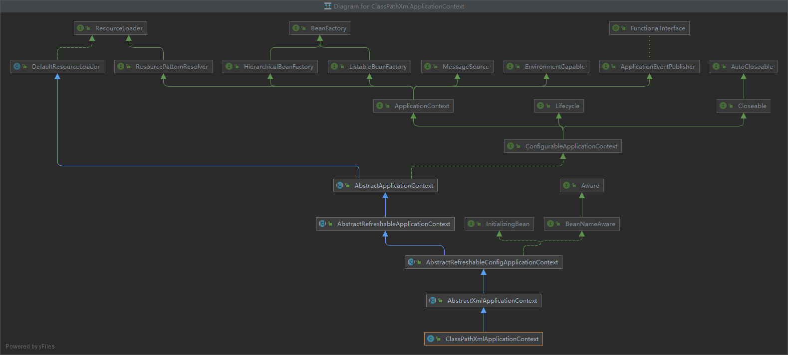
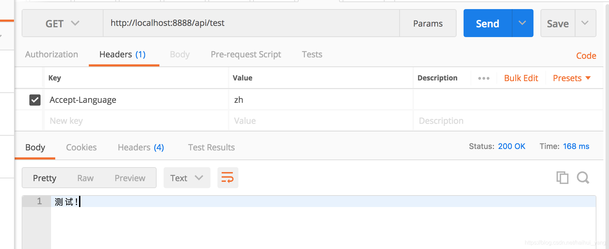
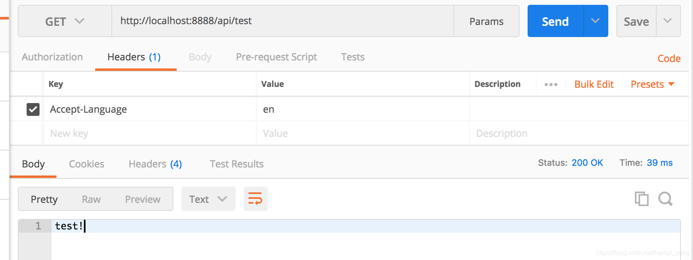

# Spring容器重要组件

容器的创建方式有两种，一种通过注解加载 bean，此时使用的是`AnnotationConfigApplicationContext`；另一种是通过 xml 配置文件加载，此时使用的上下文是`ClassPathXmlApplicationContext`，不过他们最终都会调用父类`AbstractApplicationContext`的`refresh()`方法来启动容器。

**1.AnnotationConfigApplicationContext**

```java
public class AnnotationConfigApplicationContext {
    public AnnotationConfigApplicationContext(Class<?>... componentClasses) {
        // ↓
        this();
        // 注册启动类的 BeanDefinition
        register(componentClasses);
        // 刷新容器
        refresh();
    }
    
    public AnnotationConfigApplicationContext() {
		StartupStep createAnnotatedBeanDefReader = this.getApplicationStartup().start("spring.context.annotated-bean-reader.create");
        // 注册以下组件的 BeanDefinition
        // ConfigurationClassPostProcessor
        // AutowiredAnnotationBeanPostProcessor
        // CommonAnnotationBeanPostProcessor
        // EventListenerMethodProcessor
        // DefaultEventListenerFactory
		this.reader = new AnnotatedBeanDefinitionReader(this);
		createAnnotatedBeanDefReader.end();
		this.scanner = new ClassPathBeanDefinitionScanner(this);
	}
}
```

`this()`

调用父类 GenericApplicationContext 的无参构造方法。

```java
public GenericApplicationContext() {
 // 创建一个 DefaultListableBeanFactory
 this.beanFactory = new DefaultListableBeanFactory();
}
```

继承关系


通过`SpringApplication.run()`方法启动时，流程稍有不同：

先根据类型创建容器：

- `ServletWebServerApplicationContext`
- `ReactiveWebServerApplicationContext`

再在重载的`run(String... args)`方法中执行`this.refreshContext(context)`来刷新容器：

```java
public class SpringApplication {
    private void refreshContext(ConfigurableApplicationContext context) {
        if (this.registerShutdownHook) {
            shutdownHook.registerApplicationContext(context);
        }
        // 刷新容器
        this.refresh(context);
    }
```

**2.ClassPathXmlApplicationContext**

```java
public ClassPathXmlApplicationContext(String configLocation) throws BeansException {
    this(new String[] {configLocation}, true, null);
}
public ClassPathXmlApplicationContext(
    String[] configLocations, boolean refresh, @Nullable ApplicationContext parent)
    throws BeansException {

    super(parent);
    setConfigLocations(configLocations);
    if (refresh) {
        refresh();
    }
}
```

继承关系



```java
class ConfigurationClassBeanDefinitionReader {

    public void loadBeanDefinitions(Set<ConfigurationClass> configurationModel) {
        TrackedConditionEvaluator trackedConditionEvaluator = new TrackedConditionEvaluator();
        for (ConfigurationClass configClass : configurationModel) {
            // ↓
            loadBeanDefinitionsForConfigurationClass(configClass, trackedConditionEvaluator);
        }
    }

    // ↑
    private void loadBeanDefinitionsForConfigurationClass(
        ConfigurationClass configClass, TrackedConditionEvaluator trackedConditionEvaluator) {

        if (trackedConditionEvaluator.shouldSkip(configClass)) {
            String beanName = configClass.getBeanName();
            if (StringUtils.hasLength(beanName) && this.registry.containsBeanDefinition(beanName)) {
                this.registry.removeBeanDefinition(beanName);
            }
            this.importRegistry.removeImportingClass(configClass.getMetadata().getClassName());
            return;
        }
        // 判断当前配置候选类是否由其他类 import 导入或者是否是某个配置类的 Bean
        // Import 导入的类在这里完成 Beandefinition 加载
        if (configClass.isImported()) {
            registerBeanDefinitionForImportedConfigurationClass(configClass);
        }
        // 调用 getBeanMethods() 获取所有存储的 BeanMethod 对象
        // 注册 @Bean 注解标注的 Bean 的 BeanDefinition！
        for (BeanMethod beanMethod : configClass.getBeanMethods()) {
            loadBeanDefinitionsForBeanMethod(beanMethod);
        }

        // 注册 ImportBeanDefinitionRegistrar 导入的 Beandefinition
        // 遍历 importBeanDefinitionRegistrars：Map
        loadBeanDefinitionsFromImportedResources(configClass.getImportedResources());
        loadBeanDefinitionsFromRegistrars(configClass.getImportBeanDefinitionRegistrars());
    }

}
```

## BeanDefinition

保存了 Bean 的一系列定义信息的对象，例如全类名、属性名、懒加载等。

## BeanFactoryPostProcessor

BeanFactory 的后置处理器，在 BeanFactory 标准初始化之后执行

## MessageSource

做国际化功能，消息绑定，消息解析。取出国际化配置文件中的某个 Key 的值，能按照区域信息获取。

### ResourceBundleMessageSource应用

1. `I18nService`封装`MessageSource`类，按照需要新增方法或简化调用链

   ```java
   public class I18nService {
   
       private final MessageSource messageSource;
   
       public I18nService(MessageSource messageSource) {
           this.messageSource = messageSource;
       }
   
       public String getMessage(String msgKey, Object[] args, Locale locale) {
           return messageSource.getMessage(msgKey, args, locale);
       }
   
       public String getMessage(String msgKey, Locale locale) {
           return messageSource.getMessage(msgKey, null, locale);
       }
   }
   ```

2. 配置`I18nService`，主要是配置资源文件的 baseNames

   ```java
   // 只注册一个 I18nService（推荐）， 只有当存在 messages[spring.messages.basename].properties 文件时，MessageSourceAutoConfiguration 才会自动向容器中注册 MessageSourceProperties 和 ResourceBundleMessageSource
   @Bean
   public I18nService i18nService(MessageSource messageSource) {
       return new I18nService(messageSource);
   }
   
   ================================================================================
   // 或者手动向容器中注册一个 ResourceBundleMessageSource，此时 MessageSourceAutoConfiguration 不再工作
   @Bean
   public I18nService i18nService(ResourceBundleMessageSource resourceBundleMessageSource) {
       return new I18nService(resourceBundleMessageSource);
   }
   
   @Bean
   public ResourceBundleMessageSource messageSource() {
       Locale.setDefault(Locale.CHINESE); // 在 ResourceBundle 会中调用 Locale.getDefault() 获取默认的地区
       ResourceBundleMessageSource source = new ResourceBundleMessageSource();
       source.setBasenames("messages"); // name of the resource bundle
       source.setUseCodeAsDefaultMessage(true);
       source.setDefaultEncoding("UTF-8");
       return source;
   }
   
   =================================================================================
   // 或者往容器中加入 messageSourceProperties 后利用配置文件更改属性
   @Bean
   public I18nService i18nService(ResourceBundleMessageSource resourceBundleMessageSource) {
       return new I18nService(resourceBundleMessageSource);
   }
   
   @ConfigurationProperties(prefix = "spring.messages")
   @Bean
   public MessageSourceProperties messageSourceProperties() {
       return new MessageSourceProperties();
   }
   
   @Bean
   public ResourceBundleMessageSource messageSource(MessageSourceProperties messageSourceProperties) {
       Locale.setDefault(Locale.CHINESE);
       ResourceBundleMessageSource source = new ResourceBundleMessageSource();
       source.setBasename(messageSourceProperties.getBasename()); // basename 可同时设置多个，用 "," 分隔开
       source.setDefaultEncoding(String.valueOf(messageSourceProperties.getEncoding()));
       return source;
   }
   ```

3. 多语言资源配置文件（basenames = i18n/messages），即配置文件所在目录为`i18n`，文件前缀为`messages`，和语言之间以下划线隔开，下划线后的语言可任意设置，需同 Locale 对象中传入的一致（由`ResourceBundle.toBundleName()`负责解析）

   - messages.properties

     ```properties
     message.key.test=测试!
     message.key.hello=你好！{0}~
     ```

   - messages_en.properties

     ```properties
     message.key.test=test!
     message.key.hello=hello！{0}~
     ```

4. 用于测试用的 controller

   ```java
   @Controller
   @RequestMapping(value = "/api")
   public class HelloJavaCoderController {
   
       private final I18nService i18nService;
   
       public HelloJavaCoderController(I18nService i18nService) {
           this.i18nService = i18nService;
       }
   
       @GetMapping("/hello-coder")
       public ResponseEntity greeting(@RequestHeader("Accept-Language") String lan) {
           return ResponseEntity.ok(i18nService.getMessage("message.key.hello", new Object[]{"JavaCoder"}, new Locale(lan)));
       }
   
       @GetMapping("/test")
       public ResponseEntity test(@RequestHeader("Accept-Language") String lan) {
           return ResponseEntity.ok(i18nService.getMessage("message.key.test", new Locale(lan))));
       }
   
   }
   ```

5. 使用 Postman 进行 restful API 测试

   1. 请求 http://localhost:8888/api/test 并在 header 中设置 Accept-Languate=zh，结果如下：

      

   2. 请求 http://localhost:8888/api/test 并在 header 中设置 Accept-Language=en，结果如下：

      

   3. 请求 http://localhost:8888/hello-coder 并在 header 中设置 Accept-Language=zh，结果如下：

      

   4. 请求 http://localhost:8888/hello-coder 并在 header 中设置 Accept-Languate=en，结果如下：

      
