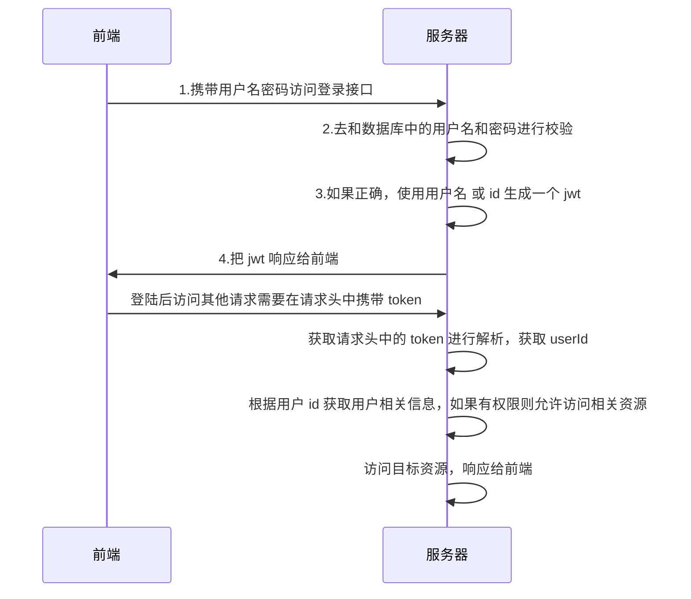
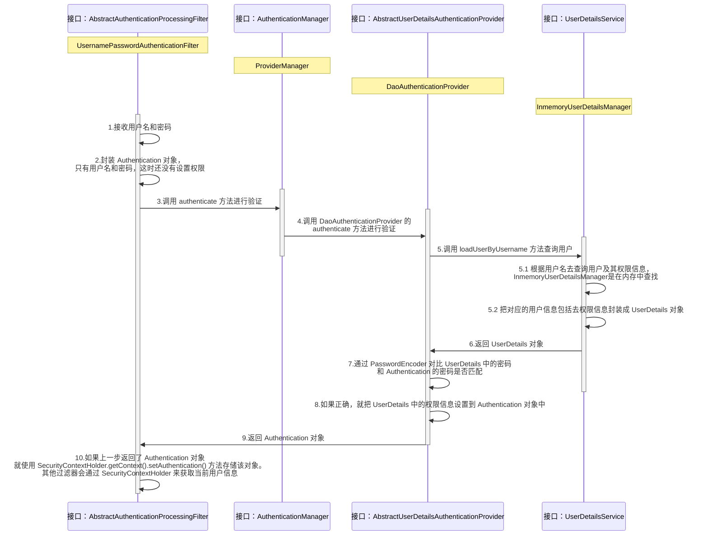

# Spring Security

## 1. 简介

>   - Spring Security是一个基于Spring的安全框架，提供了一套Web应用安全性的完整解决方案。一般来说，Web应用的安全性包括**用户认证**（Authentication）和**用户授权**（Authorization）两个部分。
>
>
>   - 用户认证指的是验证某个用户是否为系统中的合法主体，也就是说用户能否访问该系统。用户认证一般要求用户提供用户名和密码，系统通过校验用户名和密码来完成认证过程。
>
>   - 用户授权指的是验证某个用户是否有权限执行某个操作。在一个系统中，不同用户所具有的权限是不同的。一般来说，系统会为不同的用户分配不同的角色，而每个角色则对应一系列的权限。

### Spring Security 特点

> - 和 Spring 无缝整合
> - 全面的权限控制
> - 专门为 web 开发而设计
>   - 新版对整个框架进行了分层抽取，分成了核心模块和 web 模块，单独引入核心模块就可以脱离 web 环境
> - 重量级

---

## 2. 快速入门

> 1. 创建 springBoot 项目
>
> 2. 引入相关依赖
>
>    ```xml
>    <dependency>
>        <groupId>org.springframework.boot</groupId>
>        <artifactId>spring-boot-starter-security</artifactId>
>    </dependency>
>    ```
>
> 3. 编写 controller 测试
>
>    ```java
>    @RestController
>    public class TestController {
>
>        @GetMapping("/hello")
>        public String add() {
>            return "hello";
>        }
>    }
>    ```
>
> 4. 进入登陆页面
>
>    - 默认用户名：user
>    - 默认密码：启动时输出在控制台
>    
> 5. /logout 为退出页面

---

## 3. 基本原理

### 3.1 登录校验流程



### 3.2 过滤器加载过程

> - Spring Security 本质是一个**过滤器链**
>
>   
>
> - 重点三个过滤器
>
>   
>
>   1. `FilterSecurityInterceptor`：是一个权限过滤器，基本位于过滤链的最底部
>   2. `ExceptionTranslationFiler`：是一个异常过滤器，用来处理在认证授权过程中抛出的异常 AccessDeniedException 和 AuthenticationException
>   3. `UsernamePasswordAuthenticationFiler`：负责处理登陆页面填写了用户名和密码后的登录请求，校验表单中的用户名和密码
>
> - 过滤源码部分
>
>   - `DelegatingFilterProxy`
>
>     ```java
>     public void doFilter(ServletRequest request, ServletResponse response, FilterChain filterChain) throws ServletException, IOException {
>         Filter delegateToUse = this.delegate;
>         if (delegateToUse == null) {
>             synchronized(this.delegateMonitor) {
>                 delegateToUse = this.delegate;
>                 if (delegateToUse == null) {
>                     WebApplicationContext wac = this.findWebApplicationContext();
>                     if (wac == null) {
>                         throw new IllegalStateException("No WebApplicationContext found: no ContextLoaderListener or DispatcherServlet registered?");
>                     }
>                     // 初始化
>                     delegateToUse = this.initDelegate(wac);
>                 }
>                 this.delegate = delegateToUse;
>             }
>         }
>         this.invokeDelegate(delegateToUse, request, response, filterChain);
>     }
>     
>     protected Filter initDelegate(WebApplicationContext wac) throws ServletException {
>         String targetBeanName = this.getTargetBeanName(); // FilterChainProxy
>         Assert.state(targetBeanName != null, "No target bean name set");
>         Filter delegate = (Filter)wac.getBean(targetBeanName, Filter.class);
>         if (this.isTargetFilterLifecycle()) {
>             delegate.init(this.getFilterConfig());
>         }
>     
>         return delegate;
>     }
>     ```
>
>   - `FilterChainProxy`
>
>     ```java
>     private void doFilterInternal(ServletRequest request, ServletResponse response, FilterChain chain) throws IOException, ServletException {
>         FirewalledRequest firewallRequest = this.firewall.getFirewalledRequest((HttpServletRequest)request);
>         HttpServletResponse firewallResponse = this.firewall.getFirewalledResponse((HttpServletResponse)response);
>         // 获取所有 filter
>         List<Filter> filters = this.getFilters((HttpServletRequest)firewallRequest);
>         ...
>     }
>     ```

### 3.3 认证流程



> - **Authentication** 接口：它的实现类表示当前访问系统的用户，封装了用户的相关信息
> - **AuthenticationManager** 接口：定义了认证 Authentication 的方法
> - ==UserDetailsService== 接口：加载用户特定数据的核心接口，里面定义了一个根据用户名查询用户信息的方法
> - ==UserDetails== 接口：提供核心用户信息，通过 UserDetailsService 根据用户名获取处理的用户信息要封装成 UserDetails 对象返回，然后将这些信息封装到 Authentication 对象中

### 3.4 授权流程

> - 在 SpringSecurity 中，会使用默认的 FilterSecurityInterceptor 来进行权限验证，在 FilterSecurityInterceptor 中会从 SecurityContextHolder 获取其中的 Authentication，然后获取其中的权限信息

---

## 4. Web 权限方案

### 4.1 用户认证


#### 4.1.1 设置登陆密码

> 1. 通过配置文件
>
>    ```properties
>    spring.security.user.name=user
>    spring.security.user.password=password
>    ```
>
> 2. 通过配置类
>
>    ```java
>    @Configuration
>    public class SecurityConfig extends WebSecurityConfigurerAdapter {
>        @Override
>        protected void configure(AuthenticationManagerBuilder auth) throws Exception {
>            BCryptPasswordEncoder passwordEncoder = new BCryptPasswordEncoder();
>            String password = passwordEncoder.encode("root");
>            auth.inMemoryAuthentication().withUser("root").password(password).roles("admin");
>        }
>    
>        @Bean
>        PasswordEncoder passwordEncoder() {
>            return new BCryptPasswordEncoder();
>        }
>    }
>    ```
>
> 3. **自定义编写实现类**
>
>    1. 创建配置类，指定使用哪个 UserDetailsService 实现类
>
>       ```java
>       @Configuration
>       public class SecurityConfig extends WebSecurityConfigurerAdapter {
>       
>           @Autowired
>           private UserDetailsService userDetailsService;
>       
>           @Override
>           protected void configure(AuthenticationManagerBuilder auth) throws Exception {
>               auth.userDetailsService(userDetailsService).passwordEncoder(passwordEncoder());
>           }
>       
>           @Bean
>           PasswordEncoder passwordEncoder() {
>               return new BCryptPasswordEncoder();
>           }
>       
>       }
>       ```
>
>    2. 编写接口实现类，返回 User 对象（SpringSecurity 提供的 User 类）
>
>       ```java
>       @Service("userDetailsService")
>       public class MyUserDetailsService implements UserDetailsService {
>           @Override
>           public UserDetails loadUserByUsername(String username) throws UsernameNotFoundException {
>               List<GrantedAuthority> auths = AuthorityUtils.commaSeparatedStringToAuthorityList("role");
>               return new User("zhao", new BCryptPasswordEncoder().encode("123"), auths);
>           }
>       }
>       ```

#### 4.1.2 查询数据库完成认证

1. 编写配置类
2. 利用 mapper 查询数据库

```java
@Service("userDetailsService")
public class MyUserDetailsService implements UserDetailsService {

    @Autowired
    UsersMapper usersMapper;

    @Override
    public UserDetails loadUserByUsername(String username) throws UsernameNotFoundException {
        QueryWrapper<Users> wrapper = new QueryWrapper<>();
        wrapper.eq("username", username);
        Users users = usersMapper.selectOne(wrapper);
        if(users == null) {
            throw new UsernameNotFoundException("user is not exist");
        }
        List<GrantedAuthority> auths = AuthorityUtils.commaSeparatedStringToAuthorityList("role");
        return new User(users.getUsername(), new BCryptPasswordEncoder().encode(users.getPassword()), auths);
    }
}
```

```properties
spring.datasource.driver-class-name=com.mysql.cj.jdbc.Driver
spring.datasource.username=root
spring.datasource.password=root
spring.datasource.url=jdbc:mysql://localhost:3306/mybatis?useSSL=false&userUnicode=true&characterEncoding=utf-8&serverTimezone=GMT%2B8
```

#### 4.1.3 自定义用户登录界面

> 1. 自定义设置登陆界面
>
> 2. 不需要认证即可访问
>
>    - 在配置类中添加相关配置
>
>      ```java
>      @Override
>      protected void configure(HttpSecurity http) throws Exception {
>          http.formLogin() // 使用 默认的登录表单，同时添加 UsernamePasswordAuthenticationFiler
>              .loginPage("/login.html") // 登陆页面设置
>              
>              // 下面两个在 前后端分离中不太会使用
>              .loginProcessingUrl("/user/login") // 登陆访问路径，传递给 UsernamePasswordAuthenticationFiler
>              .defaultSuccessUrl("/index").permitAll() // 登陆成功后跳转路径
>              
>              .and()
>              .authorizeRequests()
>              .antMatchers("/", "/hello", "/user/login").permitAll() // 设置哪些路径可以直接访问
>              .anyRequest().authenticated()
>              .and()
>              .csrf().disable(); // 关闭 csrf 防护
>      }
>      ```
>    
>    - 登陆页面表单提交
>    
>      ```html
>      <body>
>          <form action="/user/login" method="post">
>              用户名： <input type="text" name="username">
>              <br>
>              密码： <input type="password" name="password">
>              <br>
>              <input type="submit" value="login">
>          </form>
>      </body>
>      ```

### 4.2 用户授权

#### 4.2.1 基于权限访问控制

> - `hasAuthority()`：如果当前主体具有指定的权限则返回 true，否则返回 false（只能用于指定单个权限）
>
>   - 设置配置类
>
>     ```java
>     @Override
>     protected void configure(HttpSecurity http) throws Exception {
>         http.formLogin()
>             .loginPage("/login.html")
>             .loginProcessingUrl("/user/login")
>             .defaultSuccessUrl("/index").permitAll()
>             .and()
>             .authorizeRequests()
>             .antMatchers("/", "/hello", "/user/login").permitAll()
>             .antMatchers("/index").hasAuthority("admins") // 当前用户只有具有 admins 权限才可以访问
>             .anyRequest().authenticated()
>             .and()
>             .csrf().disable();
>     }
>     ```
>
>   - 在 UserDetailsService 中设置权限
>
>     ```java
>     @Override
>     public UserDetails loadUserByUsername(String username) throws UsernameNotFoundException {
>         QueryWrapper<Users> wrapper = new QueryWrapper<>();
>         wrapper.eq("username", username);
>         Users users = usersMapper.selectOne(wrapper);
>         List<GrantedAuthority> auths = null;
>         if(users == null) {
>             throw new UsernameNotFoundException("user is not exist");
>         } else if ("zhao".equals(users.getUsername())) {
>             // 设置用户权限
>             auths = AuthorityUtils.commaSeparatedStringToAuthorityList("admins");
>         } else {
>             auths = AuthorityUtils.commaSeparatedStringToAuthorityList("users");
>         }
>         return new User(users.getUsername(), new BCryptPasswordEncoder().encode(users.getPassword()), auths);
>     }
>     ```
>
> - `hasAnyAuthority()`：为同一个地址指定多个访问权限
>
>   ```java
>   .antMatchers("/index").hasAnyAuthority("admins", "users")// admins 和 users 都可以访问
>   ```

#### 4.2.2 基于角色访问控制

> - `hasRole()`：如果用户具有指定角色，则返回 true
>
>   ~~~java
>   .antMatchers("/index").hasRole("sale") // 最终拼接成：ROLE_sale
>   ~~~
>
>   ```java
>   auths = AuthorityUtils.commaSeparatedStringToAuthorityList("admins,ROLE_sale");
>   ```
>
> - `hasAnyRole()`: 同 hasAnyAuthority()

#### 4.2.3 自定义 403 界面

> 在配置类中配置
>
> ```java
> @Override
> protected void configure(HttpSecurity http) throws Exception {
>     http.exceptionHandling().accessDeniedPage("/unAuth.html");
> }
> ```

#### 4.2.4 注解使用

##### 1. ==@Secured==

> - 用户具有某个角色，可以访问方法
>
> - 使用：
>
>   - 开启注解功能（启动类 or 配置类）
>
>     ```java
>     @SpringBootApplication
>     @EnableGlobalMethodSecurity(securedEnabled = true)
>     public class SecurityDemoApplication {
>     ```
>
>   - 在 controller 方法上使用注解，设置角色
>
>     ```java
>     @GetMapping("/update")
>     @Secured({"ROLE_sale","ROLE_manage"})
>     public String update() {
>         return "update";
>     }
>     ```
>
>   - 在 userDetailsService 中设置角色
>
>     ```java
>     auths = AuthorityUtils.commaSeparatedStringToAuthorityList("ROLE_manage,ROLE_sale");
>     ```

##### 2. ==@PreAuthorize==

> - 进入方法前的权限验证，可以将登陆用户的 roles/permissions 参数传到方法中
>
> - 使用：
>
>   - 开启注解功能（启动类 or 配置类）
>
>     ```java
>     @SpringBootApplication
>     @EnableGlobalMethodSecurity(securedEnabled = true, prePostEnabled = true)
>     public class SecurityDemoApplication {
>     ```
>
>   - 在 controller 方法上使用注解
>
>     ```java
>     @GetMapping("/update")
>     // @PreAuthorize("hasRole('ROLE_manage')")
>     @PreAuthorize("hasAnyAuthority('admins')")
>     public String update() {
>         return "update";
>     }
>     ```

##### 3. ==@PostAuthorize==

> - 方法执行后进行权限验证，适合验证带有返回值的权限
>
> - 使用：
>
>   - 开启注解功能（启动类 or 配置类）
>
>     ```java
>     @SpringBootApplication
>     @EnableGlobalMethodSecurity(securedEnabled = true, prePostEnabled = true)
>     public class SecurityDemoApplication {
>     ```
>
>   - 在 controller 方法上使用注解
>
>     ```java
>     @GetMapping("/update")
>     @PostAuthorize("hasAnyAuthority('admins')")
>     public String update() {
>         return "update";
>     }
>     ```
>
> - 注意：是在方法执行后校验，前端依然会跳转 403，但方法会执行完毕

##### 4. @PostFilter

> - 权限验证后对方法返回值进行过滤，留下用户名是 admin1 的数据
>
> - 表达式中的 filterObject 引用的是方法返回值 List 中的某一个元素
>
>   ```java
>   @RequestMapping("/getALl")
>   @PreAuthorize("hasRole('ROLE_manage')")
>   @PostFilter("filterObject.username == 'admin1'")
>   public List<UserInfo> getAllUser() {
>       ArrayList<UserInfo> list = new ArrayList<>();
>       list.add(new UserInfo(1l, "admin1", "666"));
>       list.add(new UserInfo(2l, "admin2", "888"));
>       return list;
>   }
>   ```

##### 5. @PreFilter

> - 进入控制器之前对参数进行过滤
>
> - 表达式中的 filterObject 引用的是参数 List 中的某一个元素
>
>   ```java
>   @RequestMapping("getTestPreFilter")
>   @PreAuthorize("hasRole('ROLE_manage')")
>   @PreFilter(value="filterObject.id%2==0")
>   @ResponseBody
>   public List<UserInfo> getTestPreFilter(@RequestBody List<UserInfo> list) {
>       list.forEach(t -> System.out.println(t.getId() + "\t" + t.getUsername()));
>       return list;
>   }
>   ```

### 4.3 用户注销

> 在配置类中添加退出映射地址
>
> ```java
> http.logout()
>     .logoutUrl("/logout") // 退出的地址
>     .logoutSuccessUrl("index") // 退出成功后的页面
>     .permitAll();
> ```

测试：

> 1. 修改配置类，登录成功后跳转到成功页面
> 2. 在成功页面添加超链接，设置退出路径：/logout

### 4.4 自动登录

#### 4.4.1 实现原理


#### 4.4.2 具体实现

> 1. 创建数据库表
>
> 2. 配置类中注入数据源，配置操作数据库对象
>
>    ```java
>    @Autowired
>    DataSource dataSource;
>    
>    @Bean
>    public PersistentTokenRepository persistentTokenRepository() {
>        JdbcTokenRepositoryImpl jdbcTokenRepository = new JdbcTokenRepositoryImpl();
>        jdbcTokenRepository.setDataSource(dataSource);
>        jdbcTokenRepository.setCreateTableOnStartup(true); // 自动创建表
>        return jdbcTokenRepository;
>    }
>    ```
>
> 3. 配置类配置自动登录
>
>    ```java
>    .and()
>        .rememberMe()
>        .tokenRepository(persistentTokenRepository())
>        .tokenValiditySeconds(60) // 设置有效时长，单位秒
>        .userDetailsService(userDetailsService)
>    ```
>
> 4. 页面添加记住复选框（remember-me）
>
>    ```html
>    <input type="checkbox" name="remember-me" title="记住密码"><br>
>    ```

### 4.5 CSRF

>   CSRF（Cross-site request forgery），也被称为：one click attack/session riding，中文名称：跨站请求伪造，缩写为：CSRF/XSRF。
>
>   一般来说，攻击者通过伪造用户的浏览器的请求，向访问一个用户自己曾经认证访问过的网站发送出去，使目标网站接收并误以为是用户的真实操作而去执行命令。常用于盗取账号、转账、发送虚假消息等。攻击者利用网站对请求的验证漏洞而实现这样的攻击行为，网站能够确认请求来源于用户的浏览器，却不能验证请求是否源于用户的真实意愿下的操作行为。
>
> 如下：
>
> 
>
> 
>
> 
>
>   其中 Web A 为存在 CSRF 漏洞的网站，Web B 为攻击者构建的恶意网站，User C 为 Web A 网站的合法用户。
> CSRF 攻击攻击原理及过程如下：
>
> 1. 用户C打开浏览器，访问受信任网站A，输入用户名和密码请求登录网站A；
> 2. 在用户信息通过验证后，网站A产生Cookie信息并返回给浏览器，此时用户登录网站A成功，可以正常发送请求到网站A；
> 3. 用户未退出网站A之前，在同一浏览器中，打开一个TAB页访问网站B；
> 4. 网站B接收到用户请求后，返回一些攻击性代码，并发出一个请求要求访问第三方站点A；
> 5. 浏览器在接收到这些攻击性代码后，根据网站B的请求，在用户不知情的情况下携带Cookie信息，向网站A发出请求。网站A并不知道该请求其实是由B发起的，所以会根据用户C的Cookie信息以C的权限处理该请求，导致来自网站B的恶意代码被执行。

> - 从 Spring Security 4.0 开始，默认情况下会启动 CSRF 保护，但仅针对 PATCH，POST，PUT，DELETE 方法
>
> - 在登陆页面加上一个 hidden 项
>
> - 或者关闭 CSRF，使用自定义 token
>
>   ```html
>   <input type="hidden" th:name="${_csrf.parammeterName}" th:value="${_csrf.token}"/> 
>   ```

---

## 5. 微服务

### 5.1 什么是微服务

>   微服务架构风格是一种使用一套小服务来开发单个应用的方式途径，每个服务运行在自己的进程中，并使用轻量级通信，通常是 HTTP API，这些服务基于业务能力构建，并能够通过自动化部署机制来独立部署，这些服务使用不同的编程语言实现，以及不同数据存储技术，并保持最低限度的集中式管理。
>
> **微服务优势：**
>
> 1. 微服务每个模块相当于一个单独的项目，项目间的耦合度小
> 2. 微服务每个模块都可以使用不同的存储方式（redis，mysql），数据库也是单个模块对应自己的数据库
> 3. 微服务每个模块都可以使用不同的开发技术，开发模式灵活
>
> **微服务本质：**
>
> 1. **微服务，关键其实不仅仅是微服务本身，而是系统要提供一套基础的架构，这种架构使得微服务可以独立的部署、运行、升级**，不仅如此，这个系统架构还让微服务与微服务之间在结构上“松耦合”，而在功能上则表现为一个统一的整体。这种所谓的“统一的整体”表现出来的是统一风格的界面，统一的权限管理，统一的安全策略，统一的上线过程，统一的日志和审计方法，统一的调度方式，统一的访问入口等等。
> 2. 微服务的目的是有效的拆分应用，实现敏捷开发和部署。
> 3. 微服务提倡的理念团队间应该是 inter-operate, not integrate。inter-operate 是定义好系统的边界和接口，在一个团队内全栈，让团队自治，原因就是因为如果团队按照这样的方式组建，将沟通的成本维持在系统内部，每个子系统就会更加内聚，彼此的依赖耦合能变弱，跨系统的沟通成本也就能降低。

### 5.2 认证授权过程分析

> 1. 如果是基于 Session，那么 Spring-security 会对 cookie 里的 sessionId 进行解析，找到服务器存储的 session 信息，然后判断当前用户是否符合请求的要求
>
> 2. 如果是 token，则是解析出 token，然后将当前请求加入到 Spring-security 管理的权限信息中去（推荐）
>
>    

### 5.3 案例

#### 5.3.1 认证

##### 1.1 分析

> - 用户登录后，可以将 userId 作为 key，用户信息作为 value 存入 redis
>
> - Jwt 认证时，可以直接从 redis 中获取用户信息
> - 基本思路：
>   - 登录
>     - **自定义登录接口**
>       - 调用 providerManager 的方法进行认证，如果认证通过则生成 jwt
>       - 把用户信息存入 redis 中
>     - 自定义 UserServiceDetails
>       - 在这个实现类中查询数据库
>   - 校验
>     - **定义 jwt 认证过滤器**
>       - 获取 token
>       - 解析 token 从中获取 userId
>       - 从 redis 中获取用户信息
>       - 存入 SecurityContextHolder

##### 1.2 准备工作

> 1. 添加依赖
>
>    ```xml
>    <dependency>
>        <groupId>io.jsonwebtoken</groupId>
>        <artifactId>jjwt</artifactId>
>        <version>0.9.1</version>
>    </dependency>
>    
>    <dependency>
>        <groupId>org.springframework.boot</groupId>
>        <artifactId>spring-boot-starter-data-redis</artifactId>
>    </dependency>
>    
>    <dependency>
>        <groupId>com.alibaba</groupId>
>        <artifactId>fastjson</artifactId>
>        <version>1.2.33</version>
>    </dependency>
>    ```
>
> 2. 添加 Redis 相关配置
>
>    ```java
>    public class FastJsonRedisSerializer<T> implements RedisSerializer<T> {
>    
>        public static final Charset DEFAULT_CHARSET = Charset.forName("UTF-8");
>    
>        private Class<T> clazz;
>    
>        static
>        {
>            ParserConfig.getGlobalInstance().setAutoTypeSupport(true);
>        }
>    
>        public FastJsonRedisSerializer(Class<T> clazz) {
>            super();
>            this.clazz = clazz;
>        }
>    
>        @Override
>        public byte[] serialize(T t) throws SerializationException {
>            if (t == null) {
>                return new byte[0];
>            }
>            return JSON.toJSONString(t, SerializerFeature.WriteClassName).getBytes(DEFAULT_CHARSET);
>        }
>    
>        @Override
>        public T deserialize(byte[] bytes) throws SerializationException {
>            if (bytes == null || bytes.length <= 0) {
>                return null;
>            }
>            String str = new String(bytes, DEFAULT_CHARSET);
>            return JSON.parseObject(str, clazz);
>        }
>    
>        protected JavaType getJavaType(Class<?> clazz) {
>            return TypeFactory.defaultInstance().constructType(clazz);
>        }
>    }
>    ```
>
>    ```java
>    @Configuration
>    public class RedisConfig {
>        
>        @Bean
>        @SuppressWarnings({"unchecked", "rawtypes"})
>        public RedisTemplate<Object, Object> redisTemplate(RedisConnectionFactory connectionFactory) {
>            RedisTemplate<Object, Object> template = new RedisTemplate<>();
>            template.setConnectionFactory(connectionFactory);
>            
>            FastJsonRedisSerializer serializer = new FastJsonRedisSerializer(Object.class);
>            
>            // 使用 StringRedisSerializer 来序列化和反序列化 redis 的 key
>            template.setKeySerializer(new StringRedisSerializer());
>            template.setValueSerializer(serializer);
>            
>            // Hash 的 key 也采用 StringRedisSerializer 的序列化方式
>            template.setHashKeySerializer(new StringRedisSerializer());
>            template.setHashValueSerializer(serializer);
>            
>            template.afterPropertiesSet();
>            return template;
>        }
>    }
>    ```
>
> 3. 响应类
>
>    ```java
>    @JsonInclude(JsonInclude.Include.NON_NULL)
>    @Data
>    public class ResponseResult<T> {
>    
>        private Integer code;
>    
>        private String msg;
>    
>        private T data;
>    
>        public ResponseResult(Integer code, String msg) {
>            this.code = code;
>            this.msg = msg;
>        }
>    
>        public ResponseResult(Integer code, T data) {
>            this.code = code;
>            this.data = data;
>        }
>    
>        public ResponseResult(Integer code, String msg, T data) {
>            this.code = code;
>            this.msg = msg;
>            this.data = data;
>        }
>    }
>    ```
>
> 4. Jwt 工具类
>
>    ```java
>    public class JwtUtil {
>        // 有效期为 1h
>        public static final Long JWT_TTL = 60 * 60 * 1000L;
>    
>        // 密钥
>        public static final String JWT_KEY = "sangeng";
>    
>        public static String getUUID() {
>            return UUID.randomUUID().toString().replaceAll("-", "");
>        }
>    
>        /**
>         * 生成jwt
>         * @param subject token 中存放的数据（Json 格式）
>         * @return
>         */
>        public static String createJWT(String subject) {
>            JwtBuilder builder = getJwtBuilder(subject, null, getUUID());
>            return builder.compact();
>        }
>    
>        public static String createJWT(String subject, Long ttlMillis) {
>            JwtBuilder builder = getJwtBuilder(subject, ttlMillis, getUUID());
>            return builder.compact();
>        }
>    
>        public static String createJWT(String id, String subject, Long ttlMillis) {
>            JwtBuilder builder = getJwtBuilder(subject, ttlMillis, id);
>            return builder.compact();
>        }
>    
>        private static JwtBuilder getJwtBuilder(String subject, Long ttlMillis, String uuid) {
>            SignatureAlgorithm signatureAlgorithm = SignatureAlgorithm.HS256;
>            SecretKey secretKey = generalKey();
>            long nowMillis = System.currentTimeMillis();
>            Date now = new Date(nowMillis);
>            if (ttlMillis == null) {
>                ttlMillis = JwtUtil.JWT_TTL;
>            }
>            long expMillis = nowMillis + ttlMillis;
>            Date expDate = new Date(expMillis);
>            return Jwts.builder()
>                    .setId(uuid) // 唯一 Id
>                    .setSubject(subject) // 主题，可以是 JSON
>                    .setIssuer("zhao") // 签发者
>                    .setIssuedAt(now) // 签发时间
>                    .signWith(signatureAlgorithm, secretKey) // 使用 HS256 对称加密算法签名，第二个参数为密钥
>                    .setExpiration(expDate);
>        }
>    
>        /**
>         * 生成加密后的密钥
>         * @return
>         */
>        public static SecretKey generalKey() {
>            byte[] encodedKey = Base64.getDecoder().decode(JwtUtil.JWT_KEY);
>            SecretKey key = new SecretKeySpec(encodedKey, 0, encodedKey.length, "AES");
>            return key;
>        }
>    
>        /**
>         * 解析
>         * @param jwt
>         * @return
>         * @throws Exception
>         */
>        public static Claims parseJWT(String jwt) throws Exception {
>            SecretKey secretKey = generalKey();
>            return Jwts.parser()
>                    .setSigningKey(secretKey)
>                    .parseClaimsJws(jwt)
>                    .getBody();
>        }
>    
>    }
>    ```
>
> 5. RedisCache
>
>    ```java
>    @SuppressWarnings({"unchecked", "rawtypes"})
>    @Component
>    public class RedisCache {
>    
>        @Autowired
>        RedisTemplate redisTemplate;
>    
>        /**
>         * 缓存的基本对象
>         * @param key
>         * @param value
>         * @param <T>
>         */
>        public <T> void setCacheObject(final String key, final T value) {
>            redisTemplate.opsForValue().set(key, value);
>        }
>    
>        /**
>         * 缓存的基本对象
>         * @param key
>         * @param value
>         * @param timeout 时间
>         * @param timeUnit 时间颗粒度
>         * @param <T>
>         */
>        public <T> void setCacheObject(final String key, final T value, final Integer timeout, final TimeUnit timeUnit) {
>            redisTemplate.opsForValue().set(key, value,timeout, timeUnit);
>        }
>    
>        public <T> long setCacheList(final String key, final List<T> dataList) {
>            Long count = redisTemplate.opsForList().rightPushAll(key, dataList);
>            return count == null ? 0 : count;
>        }
>    
>        public boolean expire(final String key, final long timeout) {
>            return expire(key, timeout, TimeUnit.SECONDS);
>        }
>    
>        public boolean expire(final String key, final long timeout, final TimeUnit timeUnit) {
>            return redisTemplate.expire(key, timeout,timeUnit);
>        }
>    
>        public <T> T getCacheObject(final String key) {
>            ValueOperations<String, T> operations = redisTemplate.opsForValue();
>            return operations.get(key);
>        }
>    
>        public <T> List<T> getCacheList(final String key) {
>            return redisTemplate.opsForList().range(key, 0, -1);
>        }
>    
>        public boolean deleteObject(final String key) {
>            return redisTemplate.delete(key);
>        }
>    
>        public long deleteObject(final Collection collection) {
>            return redisTemplate.delete(collection);
>        }
>    
>        public <T> BoundSetOperations<String, T> setCacheSet(final String key, final Set<T> dataSet) {
>            BoundSetOperations<String, T> setOperations = redisTemplate.boundSetOps(key);
>            Iterator<T> it = dataSet.iterator();
>            while(it.hasNext()) {
>                setOperations.add(it.next());
>            }
>            return setOperations;
>        }
>    
>        public <T> Set<T> getCacheSet(final String key) {
>            return redisTemplate.opsForSet().members(key);
>        }
>    
>        public <T> void setCacheMap(final String key, final Map<String, T> dataMap) {
>            if (dataMap != null) {
>                redisTemplate.opsForHash().putAll(key, dataMap);
>            }
>        }
>    
>        public <T> Map<String, T> getCacheMap(final String key) {
>            return redisTemplate.opsForHash().entries(key);
>        }
>    
>        public <T> void setCacheMapValue(final String key, final String hKey, final T value) {
>            redisTemplate.opsForHash().put(key, hKey, value);
>        }
>    
>        public <T> T getCacheMapValue(final String key, final String hKey) {
>            HashOperations<String, String, T> opeForHash = redisTemplate.opsForHash();
>            return opeForHash.get(key, hKey);
>        }
>    
>        public void delCacheMapValue(final String key, final String hKey) {
>            HashOperations hashOperations = redisTemplate.opsForHash();
>            hashOperations.delete(key, hKey);
>        }
>    
>        public <T> List<T> getMultiCacheMapValue(final String key, final Collection<Object> hkey) {
>            return redisTemplate.opsForHash().multiGet(key, hkey);
>        }
>    
>        public Collection<String> keys(final String pattern) {
>            return redisTemplate.keys(pattern);
>        }
>    
>    }
>    ```
>
> 6. WebUtils（向前端页面写数据，不重要）
>
>    ```java
>    public class WebUtils {
>        public static String renderString(HttpServletResponse response, String string) {
>            try{
>                response.setStatus(200);
>                response.setContentType("application/json");
>                response.setCharacterEncoding("UTF-8");
>                response.getWriter().print(string);
>            } catch (IOException e) {
>                e.printStackTrace();
>            }
>            return null;
>        }
>    }
>    ```
>
> 7. 实体类
>
>    ```java
>    @Data
>    @AllArgsConstructor
>    @NoArgsConstructor
>    public class User implements Serializable {
>        private static final long serialVersionUID = -40356785423868321L;
>          
>        @TableId(type= IdType.AUTO)
>        private Long id;
>        private String username;
>        private String password;
>    }
>    ```

##### 1.3 数据库校验用户

> 1. 创建 UserServiceDetails 实现类
>
>    ```java
>    @Service
>    public class MyUserDetailsService implements UserDetailsService {
>
>        @Autowired
>        UserMapper userMapper;
>
>        @Override
>        public UserDetails loadUserByUsername(String username) throws UsernameNotFoundException {
>
>            // 查询用户信息
>            LambdaQueryWrapper<User> wrapper = new LambdaQueryWrapper<>();
>            wrapper.eq(User::getUsername, username);
>            User user = userMapper.selectOne(wrapper);
>
>            // 如果没有查询到用户，就抛出异常
>            if(Objects.isNull(user)) {
>                throw new RuntimeException("用户名不存在");
>            }
>            // TODO 查询对应的权限信息
>
>           	// 把数据封装到 UserDetails 并返回
>           	return new LoginUser(user);
>       }
>    ```
>
> 2. 创建 UserDetails 实现类封装用户信息
>
>    ```java
>    @Data
>    @NoArgsConstructor
>    @AllArgsConstructor
>    public class LoginUser implements UserDetails {
>    
>    	private User user;
>        
>        @Override
>        public Collection<? extends GrantedAuthority> getAuthorities() {
>            return null;
>        }
>    
>        @Override
>        public String getPassword() {
>            return user.getPassword();
>        }
>    
>        @Override
>        public String getUsername() {
>            return user.getUsername();
>        }
>    
>        @Override
>        public boolean isAccountNonExpired() {
>            return true;
>        }
>    
>        @Override
>        public boolean isAccountNonLocked() {
>            return true;
>        }
>    
>        @Override
>        public boolean isCredentialsNonExpired() {
>            return true;
>        }
>    
>        @Override
>        public boolean isEnabled() {
>            return true;
>        }
>    }
>

##### 1.4 密码加密存储

> - 实际项目中不会把密码明文存储在数据库中
>
> - 默认使用的 PasswordEncoder 要求数据库中的密码格式为：{id}password，它会根据 id 去判断密码的加密方式，但是我们一般不会采用这种方式，所以需要替换 PasswordEncoder（{noop}表示没有经过加密的明文）
>
> - 我们一般使用 SpringSecurity 提供的 BCryptPasswordEncoder
>
>   - 每次加密的结果都不同 
>
>     ```java
>     void testPasswordEncoder() {
>         BCryptPasswordEncoder encoder = new BCryptPasswordEncoder();
>         String passwordFromDB = encoder.encode("123");
>         // SpringSecurity 会调用 matches 方法去匹配用户输入的密码和数据库中获得的加密的密码是否相同 
>         encoder.matches("123", passwordFromDB);
>     }
>     ```
>
> - **需要定义一个 SpringSecurity 的配置类，继承 WebSecurityConfigurerAdapter，在配置类中注册 BCryptPasswordEncoder**
>
>   ```java
>   @Configuration
>   public class SecurityConfig extends WebSecurityConfigurerAdapter {
>     
>       @Bean
>       public PasswordEncoder passwordEncoder() {
>           return new BCryptPasswordEncoder();
>       }
>   }
>   ```

##### 1.5 登录接口

> - 接下来要自定义登录接口，然后让 SpringSecurity 对这个接口放行，让用户访问这个接口的时候不用登陆也能访问
>
>   ```java
>   @RestController
>   public class LoginController {
>   
>       @Autowired
>       LoginService loginService;
>   
>       @PostMapping("/user/login")
>       public ResponseResult login(@RequestBody User user) {
>           // 登录
>           return loginService.login(user);
>       }
>   }
>   ```
>
>   ```java
>   // 配置类中
>   @Override
>   protected void configure(HttpSecurity http) throws Exception {
>       http.csrf().disable()
>           // 不通过 Session 获取 SecurityContext
>           .sessionManagement().sessionCreationPolicy(SessionCreationPolicy.STATELESS)
>           .and()
>           .authorizeRequests()
>           // 对于登录接口允许匿名访问，已认证状态则不能访问
>           .antMatchers("/user/login").anonymous()
>           // 对于其他接口全部需要验证
>           .anyRequest().authenticated();
>   }
>   ```
>
> - 在接口中我们通过 AuthenticationManager 的 authenticate 方法来进行用户认证，所以需要在配置类中把 AuthenticationManager 注入容器
>
>   ```java
>   // 配置类中
>   /**
>        * 向容器中添加一个 AuthenticationManager bean
>        * @return
>        * @throws Exception
>        */
>   @Bean
>   @Override
>   public AuthenticationManager authenticationManagerBean() throws Exception {
>       return super.authenticationManagerBean();
>   }
>   ```
>
> - 认证成功要生成一个 jwt 放入响应中返回。并且为了让用户下回请求时能通过 jwt 识别出具体是哪个用户，我们需要把用户信息存入 redis，可以把用户 id 作为 key
>
>   ```java
>   @Service
>   public class LoginService {
>       
>       @Autowired
>       private AuthenticationManager authenticationManager;
>       
>       @Autowired
>       RedisCache redisCache;
>       
>       public ResponseResult login(User user) {
>           // AuthenticationManager authenticate 进行认证
>           // authenticate 方法接受一个 Authentication 接口对象，我们可以创捷一个它的实现类  UsernamePasswordAuthenticationToken 对象
>           UsernamePasswordAuthenticationToken authenticationToken = new UsernamePasswordAuthenticationToken(user.getUsername(), user.getPassword());
>           Authentication authentication = authenticationManager.authenticate(authenticationToken);
>           // 认证没通过
>           if(Objects.isNull(authentication)) {
>               throw new RuntimeException("登陆失败");
>           }
>           // 认证通过，生成 JWT，JWT 存入 ResponseResult 返回
>           // 在认证时会调用 authenticate 方法 接收由 UserDetailsService 处理后的 UserDetails 对象
>           LoginUser loginUser = (LoginUser) authentication.getPrincipal();
>           String username = loginUser.getUsername();
>           String jwt = JwtUtil.createJWT(username);
>       
>           // 把完整的用户信息存入redis，userId 作为 key
>           redisCache.setCacheObject("login：" + username, loginUser);
>       
>           return new ResponseResult(200, "登陆成功", Collections.singletonMap("token", jwt));
>       }
>   }
>   ```

##### 1.6 认证过滤器

> 1. 编写过滤器类
>
>    ```java
>    /**
>     * 保证只会经过一次
>     */
>    @Component
>    public class JwtAuthenticationTokenFilter extends OncePerRequestFilter {
>    
>        @Autowired
>        RedisCache redisCache;
>    
>        @Override
>        protected void doFilterInternal(HttpServletRequest request, HttpServletResponse response, FilterChain filterChain) throws ServletException, IOException {
>    
>            // 获取 token
>            String token = request.getHeader("token");
>            if (!StringUtils.hasText(token)) {
>                // 如果没有 token 则放行，会在之后的拦截其中被拦截
>                filterChain.doFilter(request, response);
>                return;
>            }
>    
>            // 解析 token
>            String username;
>            try {
>                Claims claims = JwtUtil.parseJWT(token);
>                username = claims.getSubject();
>            } catch (Exception e) {
>                e.printStackTrace();
>                throw new RuntimeException("token非法");
>            }
>    
>            // 从 redis 中获取用户信息
>            String redisKey = "login:" + username;
>            LoginUser loginUser = redisCache.getCacheObject(redisKey);
>            if(Objects.isNull(loginUser)) {
>                throw new RuntimeException("用户未登录");
>            }
>    
>            // 存入 SecurityContextHolder，之后的过滤器都会从这个 context 中获取信息
>            // TODO 获取权限信息封装到 Authentication 中
>            UsernamePasswordAuthenticationToken usernamePasswordAuthenticationToken = new UsernamePasswordAuthenticationToken(loginUser, null, null);
>            SecurityContextHolder.getContext().setAuthentication(usernamePasswordAuthenticationToken);
>    
>            filterChain.doFilter(request, response);
>        }
>    }
>    ```
>
> 2. 配置过滤器
>
>    ```java
>    @Autowired
>    JwtAuthenticationTokenFilter jwtAuthenticationTokenFilter;
>       
>    @Override
>    protected void configure(HttpSecurity http) throws Exception {
>        http.csrf().disable()
>            // SecurityContext 不会创建 session 也不会通过 session 创建 SecurityContext 对象
>            .sessionManagement().sessionCreationPolicy(SessionCreationPolicy.STATELESS)
>            .and()
>            .authorizeRequests()
>            // 对于登录接口允许匿名访问
>            .antMatchers("/user/login").anonymous()
>            // 对于其他接口全部需要验证
>            .anyRequest().authenticated();
>       
>        // 添加 jwtAuthenticationTokenFilter 在 UsernamePasswordAuthenticationFilter 之前执行
>        http.addFilterBefore(jwtAuthenticationTokenFilter, UsernamePasswordAuthenticationFilter.class);
>    }
>    ```

##### 1.7 退出登录

> - 只需要定义一个退出接口，然后获取 SecurityContextHolder 中的认证信息，删除 redis 中对应的数据即可
>
>   ```java
>   @RestController
>   public class LogoutController {
>     
>       @Autowired
>       LogoutService logoutService;
>     
>       @GetMapping("/user/logout")
>       public ResponseResult logout() {
>           return logoutService.logout();
>       }
>   }
>   ```
>
>   ```java
>   @Service
>   public class LogoutService {
>     
>       @Autowired
>       RedisCache redisCache;
>     
>       public ResponseResult logout() {
>     
>           // 获取 SecurityContextHolder 中的用户信息，访问这个接口会经过 JwtAuthenticationTokenFilter 并向 SecurityContextHolder 中放入用户信息
>           UsernamePasswordAuthenticationToken authentication = (UsernamePasswordAuthenticationToken) SecurityContextHolder.getContext().getAuthentication();
>           LoginUser loginUser = (LoginUser) authentication.getPrincipal();
>           String username = loginUser.getUsername();
>     
>           // 删除 redis 中的值
>           redisCache.deleteObject("login:" + username);
>           return new ResponseResult(200, "注销成功");
>       }
>   }
>   ```

#### 5.3.2 授权

##### 2.1 分析

> - 我们在项目中只需要把当前登录用户的权限信息存入 Authentication
> - 然后设置资源所需要的权限

##### 2.2 设置资源所需权限

> 1. 在配置类上开启相关配置
>
>    ```java
>    @EnableGlobalMethodSecurity(prePostEnabled = true)
>    ```
>
> 2. 添加注解 -- `@PreAuthorize`
>
>    ```java
>    @RestController
>    public class HelloController {
>        @GetMapping("/hello")
>        @PreAuthorize("hasAuthority('sys:manager')")
>        public String hello() {
>            return "hello";
>        }
>    }
>    ```

##### 2.3 封装权限信息

> 1. LoginUser 中添加权限信息
>
>    ```java
>    @Data
>    @NoArgsConstructor
>    public class LoginUser implements UserDetails {
>    
>        private User user;
>    
>        private List<String> permissions;
>    
>        public LoginUser(User user, List<String> permissions) {
>            this.user = user;
>            this.permissions = permissions;
>        }
>    
>        // 默认泛型不会被 redis 序列化，会出异常，所以忽略此项目
>        @JSONField(serialize = false)
>        private List<SimpleGrantedAuthority> collect;
>    
>        @JSONField(serialize = false)
>        @Override
>        public Collection<? extends GrantedAuthority> getAuthorities() {
>            if (!Objects.isNull(collect)) {
>                return collect;
>            }
>            // 将 permissions 中的元素封装 GrantedAuthority 的实现类 SimpleGrantedAuthority
>            collect = permissions.stream().map(SimpleGrantedAuthority::new).collect(Collectors.toList());
>            return collect;
>        }
>    ```
>
> 2. UserDetailsService 中将查出权限信息并封装到 LoginUser 中
>
>    ```java
>    @Service
>    public class MyUserDetailsService implements UserDetailsService {
>    
>        @Autowired
>        UserMapper userMapper;
>    
>        @Override
>        public UserDetails loadUserByUsername(String username) throws UsernameNotFoundException {
>    
>            // 查询用户信息
>            LambdaQueryWrapper<User> wrapper = new LambdaQueryWrapper<>();
>            wrapper.eq(User::getUsername, username);
>            User user = userMapper.selectOne(wrapper);
>    
>            // 如果没有查询到用户，就抛出异常
>            if(Objects.isNull(user)) {
>                throw new RuntimeException("用户名不存在");
>            }
>    
>            // 查询对应的权限信息
>            List<String> permsList = Arrays.asList("test", "admin");
>    
>            // 把数据封装到 UserDetails 并返回
>            return new LoginUser(user, permsList);
>        }
>    }
>    ```
>
> 3. JwtAuthenticationTokenFilter 中获取权限信息封装到 Authentication 中
>
>    ```java
>    UsernamePasswordAuthenticationToken usernamePasswordAuthenticationToken = new UsernamePasswordAuthenticationToken(loginUser, null, loginUser.getAuthorities());
>    ```

##### 2.4 从数据库中查询权限信息

> 1. RBAC 权限模型
>
>    - Role-Based Access Control: 基于角色控制访问
>
>      <table style="text-align:center">
>          <tr>
>          	<td colspan="2">用户表 user</td>
>          </tr>
>          <tr>
>          	<td>id</td>
>              <td>user_name</td>
>          </tr>
>          <tr>
>          	<td>1</td>
>              <td>zhao1</td>
>          </tr>
>          <tr>
>          	<td>2</td>
>              <td>zhao2</td>
>          </tr>
>      </table>
>
>      <table style="text-align:center">
>          <tr>
>          	<td colspan="3">权限表 menu</td>
>          </tr>
>          <tr>
>          	<td>id</td>
>              <td>menu_name</td>
>              <td>perm_key</td>
>          </tr>
>          <tr>
>          	<td>1</td>
>              <td>删除图书</td>
>              <td>sys:book:delete</td>
>          </tr>
>          <tr>
>          	<td>2</td>
>              <td>查看图书</td>
>              <td>sys:book:list</td>
>          </tr>
>      </table>
>
>      <table style="text-align:center">
>          <tr>
>          	<td colspan="3">角色表 role</td>
>          </tr>
>          <tr>
>          	<td>id</td>
>              <td>role_name</td>
>              <td>role_key</td>
>          </tr>
>          <tr>
>          	<td>1</td>
>              <td>图书管理员</td>
>              <td>admin</td>
>          </tr>
>          <tr>
>          	<td>2</td>
>              <td>借阅人</td>
>              <td>reader</td>
>          </tr>
>      </table>
>
>      <table style="text-align:center">
>          <tr>
>          	<td colspan="2">角色权限关联表 role_menu</td>
>          </tr>
>          <tr>
>          	<td>role_id</td>
>              <td>menu_id</td>
>          </tr>
>          <tr>
>          	<td>1</td>
>              <td>1</td>
>          </tr>
>          <tr>
>          	<td>1</td>
>              <td>2</td>
>          </tr>
>          <tr>
>          	<td>2</td>
>              <td>2</td>
>          </tr>
>      </table>
>
>      <table style="text-align:center">
>          <tr>
>          	<td colspan="2">用户角色关联表 user_role</td>
>          </tr>
>          <tr>
>          	<td>user_id</td>
>              <td>role_id</td>
>          </tr>
>          <tr>
>          	<td>1</td>
>              <td>1</td>
>          </tr>
>          <tr>
>          	<td>1</td>
>              <td>2</td>
>          </tr>
>      </table>
>
> 2. 创建 menu 实体类
>
> 3. 创建对应的 mapper
>
>    ```xml
>    <?xml version="1.0" encoding="UTF-8" ?>
>    <!DOCTYPE mapper PUBLIC "-//mybatis.org//DTD Mapper 3.0//EN" "http://mybatis.org/dtd/mybatis-3-mapper.dtd" >
>    <mapper namespace="com.youyi.securitydemo.mapper.MenuMapper">
>        <select id="selectPermsByUserId" resultType="java.lang.String">
>            select distinct m.perm_key
>            from user_role ur
>                left join role r on ur.role_id = r.id
>                left join role_menu rm on ur.role_id = rm.role_id
>                left join menu m on m.id = rm.menu_id
>            where
>                user_id = #{userId}
>                and r.status = 0
>                and m.status = 0
>        </select>
>    </mapper>
>    ```
>
> 4. 修改 UserDetailsService
>
>    ```java
>    // 查询对应的权限信息
>    List<String> permsList = menuMapper.selectPermsByUserId(user.getId());
>    ```

#### 5.3.3 ==自定义失败处理==

> - 在 SpringSecurity 中，如果我们在认证或者授权过程中出现了异常会被 ExceptionTranslationFilter 捕获到，在 ExceptionTranslationFilter 中会判断是认证失败还是授权失败出现的异常
> - 如果是认证过程中出现的异常会被封装成 AUthenticationException 然后调用 **AuthenticationEntryPoint** 对象的方法进行异常处理
> - 如果是授权过程中出现的异常会被封装成 AccessDeniedException 然后调用 **AccessDeniedHandler** 对象的方法进行异常处理
> - 所以我们只需要自定义 AuthenticationEntryPoint 和 AccessDeniedHandler 然后配置给 SpringSecurity 即可

> 1. 自定义 AuthenticationEntryPoint
>
>    ```java
>    @Component
>    public class MyAuthenticationEntryPoint implements AuthenticationEntryPoint {
>        @Override
>        public void commence(HttpServletRequest request, HttpServletResponse response, AuthenticationException authException) throws IOException, ServletException {
>            // 处理异常
>            ResponseResult responseResult = new ResponseResult(HttpStatus.UNAUTHORIZED.value(), authException.getMessage());
>            String json = JSON.toJSONString(responseResult);
>            renderString(response, json);
>        }
>    
>        public static String renderString(HttpServletResponse response, String string) {
>            try{
>                response.setStatus(200);
>                response.setContentType("application/json");
>                response.setCharacterEncoding("UTF-8");
>                response.getWriter().print(string);
>            } catch (IOException e) {
>                e.printStackTrace();
>            }
>            return null;
>        }
>    }
>    ```
>
> 2. 自定义 AccessDeniedHandler
>
>    ```java
>    @Component
>    public class MyAccessDeniedHandler implements AccessDeniedHandler {
>        @Override
>        public void handle(HttpServletRequest request, HttpServletResponse response, AccessDeniedException accessDeniedException) throws IOException, ServletException {
>            // 处理异常
>            ResponseResult responseResult = new ResponseResult(HttpStatus.FORBIDDEN.value(), accessDeniedException.getMessage());
>            String json = JSON.toJSONString(responseResult);
>            renderString(response, json);
>        }
>    
>        public static String renderString(HttpServletResponse response, String string) {
>            try{
>                response.setStatus(200);
>                response.setContentType("application/json");
>                response.setCharacterEncoding("UTF-8");
>                response.getWriter().print(string);
>            } catch (IOException e) {
>                e.printStackTrace();
>            }
>            return null;
>        }
>    }
>    ```
>
> 3. 配置
>
>    ```java
>    @Autowired
>    MyAuthenticationEntryPoint myAuthenticationEntryPoint;
>    
>    @Autowired
>    MyAccessDeniedHandler myAccessDeniedHandler;
>    
>    @Override
>    protected void configure(HttpSecurity http) throws Exception {
>        http.csrf().disable()
>            // 不通过 Session 获取 SecurityContext
>            .sessionManagement().sessionCreationPolicy(SessionCreationPolicy.STATELESS)
>            .and()
>            .authorizeRequests()
>            // 对于登录接口允许匿名访问
>            .antMatchers("/user/login").anonymous()
>            // 对于其他接口全部需要验证
>            .anyRequest().authenticated();
>    
>        // 添加 jwtAuthenticationTokenFilter 在 UsernamePasswordAuthenticationFilter 之前执行
>        http.addFilterBefore(jwtAuthenticationTokenFilter, UsernamePasswordAuthenticationFilter.class);
>    
>        // 配置异常处理器
>        http.exceptionHandling()
>            // 认证失败处理器
>            .authenticationEntryPoint(myAuthenticationEntryPoint)
>            // 授权失败处理器
>            .accessDeniedHandler(myAccessDeniedHandler);
>    }
>    ```

#### 5.3.4 跨域

> - 浏览器出于安全考虑，使用 XMLHttpRequest 对象发起 HTTP 请求时必须遵守同源策略，否则就是跨域的 HTTP 请求，默认情况下是被禁止的。同源策略要求源相同才能正常进行通信，即协议，域名，端口号完全一致
> - 前后端分离项目，前端项目和后端项目一般都不会是同源的，所以肯定存在跨域请求的的问题。

> 1. 配置 SpringBoot，允许跨域请求
>
>    ```java
>    public class CoreConfig implements WebMvcConfigurer {
>        @Override
>        public void addCorsMappings(CorsRegistry registry) {
>            registry.addMapping("/**") // 设置允许跨域的路径
>                    .allowedOrigins("*") // 设置允许跨域请求的域名
>                    .allowCredentials(true) // 是否允许 cookie
>                    .allowedMethods("GET", "POST", "PUT", "DELETE") // 设置允许的请求方式
>                    .allowedHeaders("*") // 设置允许的 headers 属性
>                    .maxAge(3600); // 跨域允许时间
>        }
>    }
>    ```
>
> 2. 开启 SpringSecurity 跨域
>
>    ```java
>    @Override
>    protected void configure(HttpSecurity http) throws Exception {
>        http.csrf().disable()
>            // 不通过 Session 获取 SecurityContext
>            .sessionManagement().sessionCreationPolicy(SessionCreationPolicy.STATELESS)
>            .and()
>            .authorizeRequests()
>            // 对于登录接口允许匿名访问
>            .antMatchers("/user/login").anonymous()
>            // 对于其他接口全部需要验证
>            .anyRequest().authenticated();
>    
>        // 添加 jwtAuthenticationTokenFilter 在 UsernamePasswordAuthenticationFilter 之前执行
>        http.addFilterBefore(jwtAuthenticationTokenFilter, UsernamePasswordAuthenticationFilter.class);
>    
>        // 配置异常处理器
>        http.exceptionHandling()
>            // 认证失败处理器
>            .authenticationEntryPoint(myAuthenticationEntryPoint)
>            .accessDeniedHandler(myAccessDeniedHandler);
>    
>        // 允许跨域
>        http.cors();
>    }
>    ```

#### 5.3.5 ==自定义权限校验方法==

> 1. 自定义校验方法
>
>    ```java
>    @Component
>    public class ExpressionRoot {
>    
>        public boolean hasAuthority(String authority) {
>            // 获取当前用户的权限
>            Authentication authentication = SecurityContextHolder.getContext().getAuthentication();
>            LoginUser loginUser = (LoginUser) authentication.getPrincipal();
>            List<String> permissions = loginUser.getPermissions();
>            // 判断用户权限集合中是否存在 authority
>            return permissions.contains(authority);
>        }
>    
>    }
>    ```
>
> 2. 使用 SPEL 表达式
>
>    ```java
>    @GetMapping("/hello")
>    @PreAuthorize("@expressionRoot.hasAuthority('sys:manager')") // @ + Bean名称 可以获取到容器中的 Bean 对象
>    public String hello() {
>        return "hello";
>    }
>    ```

### 5.4 认证成功处理器

> - UsernamePasswordAuthenticationFiler 在认证完成后会调用 **AuthenticationSuccessHandler** 处理认证成功后的逻辑
>
>   - 需要调用 `http.formLogin()` 启用登陆表单
>
> - 可以自定义一个 AuthenticationSuccessHandler
>
>   ```java
>   @Component
>   public class MyAuthenticationSuccessHandler implements AuthenticationSuccessHandler {
>       @Override
>       public void onAuthenticationSuccess(HttpServletRequest request, HttpServletResponse response, Authentication authentication) throws IOException, ServletException {
>           System.out.println("success");
>       }
>   }
>   ```
>
> - 配置
>
>   ```java
>   @Autowired
>   MyAuthenticationSuccessHandler myAuthenticationSuccessHandler;
>   
>   protected void configure(HttpSecurity http) throws Exception {
>   	http.formLogin().successHandler(myAuthenticationSuccessHandler);
>       http.authorizeRequests().anyRequest().authenticated();
>   }
>   ```

### 5.5 认证失败处理器

> - UsernamePasswordAuthenticationFiler 在认证失败后会调用 **AuthenticationFailureHandler** 处理认证失败后的逻辑

### 5.6 注销成功处理器

```java
http.logout().logoutSuccessHandler(LogoutSuccessHandler);
```

---

## 6.其他认证方案

