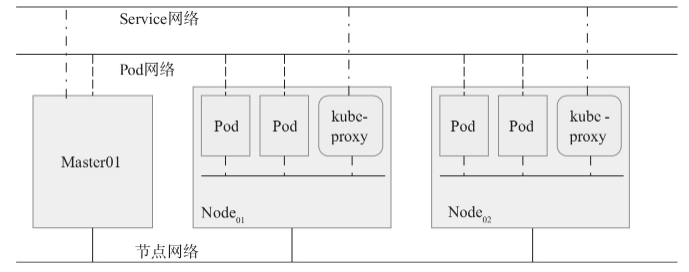
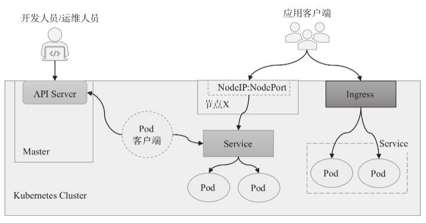
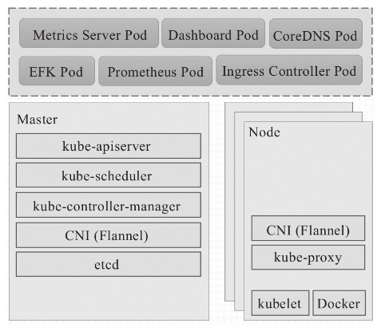
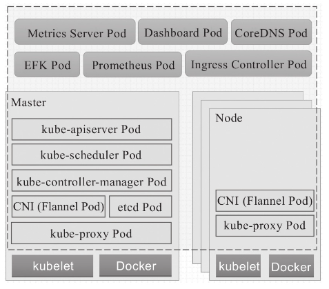
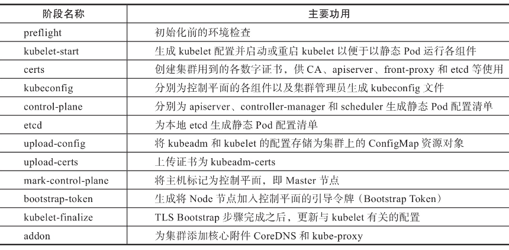
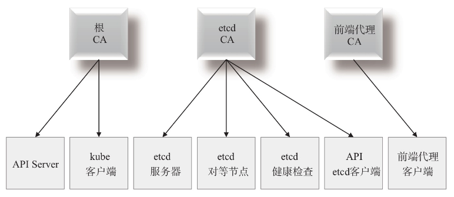

# 第01章_Kubernetes基础

## 1.基本介绍

### 1.1 使用背景

容器化部署方式给带来很多的便利，但是也会出现一些问题，比如说：

- 一个容器故障停机了，怎么样让另外一个容器立刻启动去替补停机的容器
- 当并发访问量变大的时候，怎么样做到横向扩展容器数量

这些容器管理的问题统称为**容器编排**问题，为了解决这些容器编排问题，就产生了一些容器编排的软件：

- **Swarm**：Docker 自己的容器编排工具
- **Mesos**：Apache 的一个资源统一管控的工具，需要和 Marathon 结合使用
- **Kubernetes**：Google 开源的的容器编排工具

### 1.2 简介

Kubernetes 是一个全新的基于容器技术的分布式架构领先方案，是谷歌严格保密十几年的秘密武器 - Borg 系统的一个开源版本，于2014年9月发布第一个版本，2015年7月发布第一个正式版本。

Kubernetes 的本质是**一组服务器集群**，它可以在集群的每个节点上运行特定的程序，来对节点中的容器进行管理。目的是实现资源管理的自动化，主要提供了如下的主要功能：

- **自我修复**：一旦某一个容器崩溃，能够在1秒中左右迅速启动新的容器
- **弹性伸缩**：可以根据需要，自动对集群中正在运行的容器数量进行调整
- **服务发现**：服务可以通过自动发现的形式找到它所依赖的服务
- **负载均衡**：如果一个服务起动了多个容器，能够自动实现请求的负载均衡
- **版本回退**：如果发现新发布的程序版本有问题，可以立即回退到原来的版本
- **存储编排**：可以根据容器自身的需求自动创建存储卷

### 1.3 组件

一个 Kubernetes 集群主要是由**控制节点（master）**、**工作节点（node）**构成，每个节点上都会安装不同的组件。

**master**：集群的控制平面，负责集群的决策 (管理)

- **ApiServer**：资源操作的唯一入口，接收用户输入的命令，提供认证、授权、API 注册和发现等机制

- **Scheduler**：负责集群资源调度，按照预定的调度策略将 Pod 调度到相应的 node 节点上

- **ControllerManager**：负责维护集群的状态，比如程序部署安排、故障检测、自动扩展、滚动更新等

- **Etcd**：负责存储集群中各种资源对象的信息

**node**：集群的数据平面，负责为容器提供运行环境 (干活)

- **Kubelet**：负责维护容器的生命周期，即通过控制 docker，来创建、更新、销毁容器
- **KubeProxy**：负责提供集群内部的服务发现和负载均衡
- **Docker**：负责节点上容器的各种操作


下面，以部署一个 nginx 服务来说明 Kubernetes 系统各个组件调用关系：

1. 首先要明确，一旦 Kubernetes 环境启动之后，master 和 node 都会将自身的信息存储到`etcd`数据库中
2. 一个 nginx 服务的安装请求会首先被发送到 master 节点的`ApiServer`组件
3. `ApiServer`组件会调用`Scheduler`组件来决定到底应该把这个服务安装到哪个 node 节点上，此时，它会从`etcd`中读取各个 node 节点的信息，然后按照一定的算法进行选择，并将结果告知`ApiServer`
4. `ApiServer`调用`controller-manager`去调度 Node 节点安装 nginx 服务
5. `kubelet`接收到指令后，会通知`docker`，然后由`docker`来启动一个 nginx 的`pod`
6. 同时用户需要额外创建一个具体的 Service 对象为 Pod 建立一个固定的访问入口

至此，一个 nginx 服务就运行了，如果需要访问 nginx，就需要通过`kube-proxy`来对`pod`产生访问的代理。

### 1.4 网络基础

Kubernetes 的网络中存在 4 种主要类型的通信：**同一 Pod 内的容器间通信**、**各 Pod 彼此间通信**、**Pod 与 Service 间的通信**以及**集群外部的流量与 Service 间的通信**。Kubernetes 对 Pod 和 Service 资源对象分别使用了专有网络，Service 的网络由 Kubernetes 集群自行管理，但集群自身并未实现任何形式的 Pod 网络，需要借助于兼容 CNI 规范网络插件配置实现，这些插件必须满足：

- 所有 Pod 间均不可经 NAT 机制而直接通信
- 所有节点间均可不经 NAT 机制直接与所有容器通信
- 所有 Pod 对象都位于同一平面网络，而且可以使用 Pod 自身的地址直接通信



Pod 网络及其 IP 由 Kubernetes 的网络插件负责配置和管理，例如 Flannel 网络插件默认使用 10.244.0.0/16 网络，而 Calico 默认使用 192.168.0.0/16。对比来说，**Service 的地址却是一个虚拟 IP 地址**，它不会被添加在任何网络接口设备上，而是由 kube-proxy 配置在每个工作节点上的 iptalbes 或 ipvs 规则中以进行流量分发，这些规则的作用域也仅限于当前节点，因此每个节点上的 kube-proxy 都会为每个 Service 创建相应的规则。

Service IP 也称为 Cluster IP，专用于集群内通信，一般使用不同于 Pod 网络的专用地址段，例如用 10.96.0.0/12。各 Service 对象的 IP 地址在此范围内由系统创建 Service 对象时动态分配，集群内的 Pod 对象可直接用 Cluster IP 作为目标服务的地址。 

概括来说，Kubernetes 集群上会存在 3 个分别用于节点、Pod 和 Service 的不同网络，3 种网络在工作节点之上实现交会，由节点内核中的路由组件以及 iptables/netfilter 和 ipvs 等完成网络间的报文转发：

- 节点网络：各主机（Master 和 Node）自身所属的网络
- Pod 网络：Pod 对象所属的网络，是一种虚拟网络，需要通过网络插件实现，常见的实现机制有 Overlay 和 Underlay
- Service 网络：一个虚拟网络，通过 Node 上的 kube-proxy 配置为节点的 iptables 或 ipvs 规则将流量调度至 Service 后端的各 Pod 对象之上



**Pod IP 和 Service IP 的区别：**

**Pod IP**

- 每个 Pod 都有自己的 IP 地址
- Pod IP 是临时的，如果 Pod 失败或被重新调度，它的 IP 地址可能会发生变化
- Pod IP 通常用于 Pod 之间的通信，因为它们可以直接相互访问

**Service IP**

- Service 是 Kubernetes 中的一种抽象，用于公开应用程序的网络端点，而不依赖于单个 Pod 的 IP 地址
- Service IP 是稳定的，即使 Pod 重启或重新调度，Service IP 仍然保持不变
- Service IP 通常用于从外部访问应用程序，负载均衡流量到后端的多个 Pod

### 1.5 相关概念

- **Master**：集群控制节点，每个集群需要至少一个 master 节点负责集群的管控
- **Node**：工作负载节点，由 master 分配容器到这些 node 工作节点上，然后 node 节点上的 docker 负责容器的运行
- **Pod**：kubernetes 的最小控制单元，容器都是运行在 pod 中的，一个 pod 中可以有 1 个或者多个容器
- **Controller**：控制器，通过它来实现对 pod 的管理，比如启动 pod、停止 pod、伸缩 pod 的数量等等
- **Service**：pod 对外服务的统一入口，下面可以维护者同一类的多个 pod
- **Label**：标签，用于对 pod 进行分类，同一类 pod 会拥有相同的标签
- **NameSpace**：命名空间，用来隔离 pod 的运行环境

### 1.6 核心附件

附件用于扩展 Kubernetes 的基本功能，他们通常运行于 Kubernetes 集群之上。

- **CoreDNS**：Kubernetes 使用定制的 NDS 应用程序实现名称解析和服务发现功能，它为每个 Service 配置 DNS 名称，允许集群内的客户端直接使用此名称发出访问请求，而 Service 通过 iptables 和 ipvs 内置了负载均衡机制
- **Dashboard**：基于 Web 的用户接口，用于可视化 Kubernetes 集群
- **容器资源监控系统**：常用的有 Metrics-Server、kube-state-metrics 和 Prometheus 等
- **集群日志系统**：常用的是由 ElasticSearch、Fluentd 和 Kibana（EFK）提供的整体解决方案
- **Ingress Controller**：Ingress 资源是 Kubernetes 将集群外部 HTTP/HTTPS 流量引用到集群内部专用的资源类型，仅用于控制流量的规则和配置的集合，通过 Ingress 控制器实现流量穿透

另外，Kubernetes 本身并未直接提供一套完整的应用管理体系，需要开发者手动构建，例如：

- **Docker Registry**：通过 Harbor 工件仓库、Docker Registry 等项目实现
- 网络：借助 Flannel、Calico 或 WeaveNet 等项目实现
- **遥测**：借助 Prometheus 和 EFK 栈（或者由 Promtail、Loki 和 Grafana 组成的 PLG 栈）等项目实现
- **容器化工作负载**：借助 Kubernetes 内置的工作负载控制器资源，甚至由社区扩展而来的各种Operator 完成应用的自动化编排，包括自愈合自动扩缩容等；应用打包要借助 Helm 或 Kustomize 等项目实现
- **CI/CD**：借助 Jenkins、Tekton、Flagger 或 Kepton 等项目实现

### 1.7 kubeadm部署工具

目前生产部署 Kubernetes 单点场景使用**minikuber**，而部署集群时主要有两种方式：

**kubeadm**

Kubeadm 可用于实现集群的部署、升降级以及卸载等。提供`kubeadm init`和`kubeadm join`，用于快速部署 Kubernetes 集群。它仅仅是为集群添加最关键的核心附件 CoreDNS 和 kube-proxy，余下的其他附件如 Dashboard、监控日志系统等则需要自行部署。

此外`kubeadm token`命令负责加入集群时使用的认证令牌，`kubeadm reset`负责删除集群构建过程中生成的文件并重置回初始状态。

官方地址：https://kubernetes.io/docs/reference/setup-tools/kubeadm/kubeadm/

**二进制包**

从 github 下载发行版的二进制包，手动部署每个组件，组成 Kubernetes 集群。

Kubeadm 降低部署门槛，但屏蔽了很多细节，遇到问题很难排查。如果想更容易可控，推荐使用二进制包部署 Kubernetes 集群，虽然手动部署麻烦点，期间可以学习很多工作原理，也利于后期维护。

### 1.8 集群组件运行模式

Kubernetes 集群主要由 Master 和 Node 两类节点组成：Master 节点主要运行 etcd、kube-apiserver、kube-controller-manager 和 kube-scheduler 这 4 个组件，而各 Node 节点则分别运行 kubelet 和 kube-proxy 等组件，以及容器的运行时引擎。事实上，这些组件自身也是应用程序，除了 kubelet 和 Docker 等容器引擎之外，其他几个组件同样可以运行为容器。原因在于，kubelet 运行在各 Node 之上，负责操作 Docker 这类运行时引擎，并管理容器网络和存储卷等宿主机级别的功能，而将 kubelet 运行于容器中显然难以完成其中的部分功能。

以集群的组件是否以容器方式运行，以及是否运行为自托管模式为标准，Kubernetes 集群可部署为 3 种运行模式。

1. 独立组件模式：Master 各组件和 Node 各组件直接以守护进程方式运行于节点之上，以二进制程序部署的集群隶属于此种类型

   

2. 静态 Pod 模式：控制平面的各组件以静态 Pod 对象形式运行在 Master 主机之上，而 Node 主机上的 kubelet 和 Docker 运行为系统级守护进程，kube-proxy 托管于集群上的 DaemonSet 控制器

   

3. 自托管（self-hosted）模式：类似于第二种模式，但控制平面的各组件运行为 Pod 对象（非静态），并且这些 Pod 对象同样托管运行在集群之上，且同样受控于 DaemonSet 类型的控制器

使用 kubeadm 部署的 Kubernetes 集群可运行为第二种或第三种模式，默认为静态 Pod 对象模式，当需要使用自托管模式时，可使用`kubeadm init`命令的`--features-gates=selfHosting`选项激活。在独立组件模式进行集群的构建时，需要把各组件运行在系统的独立守护进程中，其间需要用到的证书及 Token 等认证信息也都需要手动生成，过程烦琐且极易出错；若有必要，建议使用 GitHub 上的适当的项目辅助进行，例如通过 Ansible Playbook 进行自动部署等。

### 1.9 kubeadm init工作流程

kubeadm 拉起一个 Kubernetes 集群主要需要两个步骤：先在第一个 Master 主机上运行`kubeadm init`命令初始化控制平面，待其完成后，在其他主机上运行`kubeadm join`命令逐一加入控制平面，进而成为集群成员。`kubeadm init`命令将初始化分割成多个阶段逐一实现，例如环境预检（preflight）、启动kubelet（kubelet-start）、为集群生成所需 CA 及数字证书（cert）等 10 多个阶段，各阶段的描述可参考`kubeadm init --help`命令提供的配置信息。



表中的各阶段还可由`kubeadm init phase [PHASE]`命令来分步执行，或在必要时仅运行指定的阶段，例如`kubeadm init phase preflight`仅负责执行环境预检操作。此外，`kubeadm init`命令还支持众多选项设置其工作特性。具体来说，针对表中的各个阶段，`kubeadm init`命令通过以下过程拉起 Kubernetes 的控制平面节点。

1. 执行由众多步骤组成的环境预检操作，以确保节点配置能够满足运行为 Master 主机的条件。其中，有些错误仅触发警告，有些错误则被判定为严重问题且必须纠正后才能继续。这些预检操作可能包括如下内容：

   - 探测并确定可用的 CRI 套接字以确定容器运行时环境
   - 校验 Kubernetes 和 kubeadm 的版本
   - 检查 TCP 端口 6443、10259 和 10257 的可用性
   - 检查`/etc/kubernetes/manifests`目录下是否存在 kube-apiserver.yaml、kube-controller-manager.yaml、kube-scheduler.yaml 和 etcd.yaml 配置清单
   - 检查 crictl 是否存在且可执行
   - 校验内核参数`net.bridge.bridge-nf-call-iptables`和`net.ipv4.ip_forward`的值是否满足需求
   - 检查 Swap 设备是否处于启用状态
   - 检查 ip、iptables、mount、nsenter、ebtables、ethtool、socat、tc 和 touch 等可执行程序是否存在
   - 验证 kubelet 的版本号以及服务是否处于启用（enable）和活动（active）状态
   - 验证 TCP 端口 10250、2379 和 2380 是否可用，以及 /var/lib/etcd 目录是否存在与是否为空

   以上步骤出现任何一个严重错误都会导致`kubeadm init`命令执行过程提前中止，较为常见的严重错误有未禁用 Swap 设备、内核参数设定不当、kubeadm 和 kubelet 版本不匹配等。希望忽略特定类型的错误时，可以为该命令使用`--ignore-preflight-errors`选项进行指定。

2. 生成自签名的 CA，并为各组件生成必要的数字证书和私钥，相关文件存储在由`--cert-dir`选项指定的目录下，默认路径为 /etc/kubernetes/pki，相关的 CA 和证书如图所示。指定目录路径下事先存在 CA 证书和私钥时，表示用户期望使用现有的 CA，因而命令将不再执行相关的设定，而直接使用该目录下的 CA。

   

3. Kubernetes 集群的各个组件以 API Server 为中心完成彼此间的协作，这些组件间通信时的身份认证和安全通信一般借助第 2 步中生成的数字证书完成，但它们需要将相关的认证信息转换格式，并保存于`kubeconfig`配置文件中以便组件调用。kubeadm 在`kubeconfig`步骤中生成如下 4 个 kubeconfig 文件。

   - admin.conf：由命令行客户端 kubectl 使用的配置文件，相应的用户（CN）会被识别为集群管理员
   - controller-manager.conf：kube-controller-manager 专用的 kubeconfig 配置文件
   - kubelet.conf：当前节点上 kubelet 专用的 kubeconfig 配置文件
   - scheduler.conf：kube-scheduler 专用的 kubeconfig 配置文件

4. control-plane 阶段用于为 API Server、Controller Manager 和 Scheduler 生成静态 Pod 配置清单，而 etcd 阶段则为本地 etcd 存储生成静态 Pod 配置清单，它们都会保存于`/etc/kubernetes/manifests`目录中。当前主机上的 kubelet 服务会监视该目录中的配置清单的创建、变动和删除等状态变动，并根据变动完成 Pod 创建、更新或删除操作。因此，这两个阶段创建生成的各配置清单将会启动 Master 组件的相关 Pod，且 kubeadm 成功对`localhost:6443/healthz`这个 URL 进行健康状态检查后才会进行后续的步骤。

5. 等到控制平面的各组件成功启动后，会进入 upload-config 阶段。这个阶段会将 kubeadm 和 kubeconfig 的配置存储为 kube-system 名称空间中的 ConfigMap 资源对象。而 **upload-certs 阶段需要显式地由`--upload-certs`选项激活**，它会将 kubeadm 的证书存储在 Secret 资源对象中，以供后加入的其他 Master 节点使用。

6. mark-control-plane 阶段负责为当前主机打上`node-role.kubernetes.io/master=''`，将其标记为 Master，**并为该主机设置`node-role.kubernetes.io/master:NoSchedule`污点**，以防止其他工作负载 Pod 运行在当前主机上。

7. bootstrap-token 阶段会生成引导令牌，其他 Node 主机需要使用该令牌在加入集群时与控制平面建立双向信任。换句话说，只要持有 Bootstrap Token，任何节点都可使用`kubeadm join`命令加入该集群。该令牌也可由`kubeadm token`命令进行查看、创建和删除等管理操作。

8. kubelet-finalize 阶段进行一些必要的配置，以允许节点通过 Bootstrap Token 或 TLS Bootstrap 机制加入集群中。这类配置包括：生成 ConfigMap，设置 RBAC 以允许节点加入集群时能获取到必要的信息，允许 Bootstrap Token 访问 CSR 签署 API，以及能够自动签署 CSR 请求等。

9. 最后一个阶段则是为集群添加必要的基本附件，如 CoreDNS 和 kube-proxy，它们都以 Pod 形式托管运行在当前集群之上。

### 1.10 kubeadm join工作流程

由`kubeadm init`命令为构建的目标集群初始化第一个控制平面节点之后即可在其他各主机上使用`kubeadm join`命令将其加入集群中。根据用户的设定，新加入的主机可以成为新的 Master 主机（Master HA 模式中的其他节点），也可以成为 Worker 主机（工作节点）。
`kubeadm join`命令也需要进行环境预检操作，以确定所在节点满足可加入集群中的前提条件，这类关键检测的步骤包括：

- 探测并确定可用的CRI套接字以确定容器运行时环境
- 检查`/etc/kubernetes/manifests`目录下是否存在且是否为空
- 检查`/etc/kubernetes`目录下 kubelet.conf 和 bootstrap-kubelet.conf 文件是否存在
- 检查 crictl 是否存在且可执行
- 校验内核参数`net.bridge.bridge-nf-call-iptables`和`net.ipv4.ip_forward`的值是否满足需求
- 检查 Swap 设备是否处于启用状态
- 检查 ip、iptables、mount、nsenter、ebtables、ethtool、socat、tc 和 touch 等可执行程序是否存在
- 验证 kubelet 的版本号以及服务是否处于启用和活动状态
- 检查 TCP 端口 10250 的可用性
- 检查文件`/etc/kubernetes/pki/ca.crt`是否存在

以上步骤出现任何一个严重错误都会导致`kubeadm join`命令执行过程的中止，较为常见的严重错误有未禁用 Swap 设备和内核参数设定不当等，不过`--ignore-preflight-errors`选项允许用户指定要忽略的错误选项。

随后，同控制平面建立双向信任关系是新节点加入集群的关键一步，这种双向信任可分为发现和 TLS 引导程序两个阶段。具体过程是 kubelet 通过 TLS Bootstrap 使用共享令牌向 API Server 进行身份验证后提交证书并签署请求（CSR），随后在控制平面上自动签署该请求从而生成数字证书。

下来的过程会因新加入节点的不同角色而有所区别：

1. kubeadm 将为加入集群主机的**工作节点**基于接收到的数字证书生成 kubelet.conf 配置文件，这样 kubelet 程序便能够以该配置文件接入到集群当中并进行安全通信，再由 kube-proxy 的 DaemonSet 控制器为此节点启动 kube-proxy Pod，至此该过程完成。

2. 若加入的是其他 **Master** 主机，`kubeadm join`则会进行以下步骤
   - 从集群下载控制平面节点之间共享的数字证书，该证书在配置第一个 Master 的`kubeadm init`命令中的 upload-certs 阶段生成
   - 运行`kubeadm init`命令类型的预检操作，而后为新的控制平面各组件生成静态 Pod 配置清单、证书和 kubeconfig 后，再由 kubelet 启动相应的静态 Pod
   - 更新 kubelet 的配置信息并由其完成 TLS Bootstrap
   - 为本地运行的 etcd 生成配置清单，由 kubelet 启动相应的静态 Pod 并将其添加为现有的 etcd 集群成员
   - 将该节点的相关信息上传至 kube-system 名称空间中的 ConfigMap 对象的 kubeadm-config 中
   - 为该节点添加控制平面专用标签`node-role.kubernetes.io/master=''`和污点`node-role.kubernetes.io/master:NoSchedule`

在不同的节点上重复运行本节中描述的步骤，即可多次新增 Master 或 Node 主机到集群中。

### 1.11 kubeadm配置文件

初始化集群的`kubeadm inti`命令也可通过`--config`选项让配置文件接收配置信息，它支持 InitConfiguration、ClusterConfiguration、KubeProxyConfiguration 和 KubeletConfiguration 这 4 种配置类型，而且仅 InitConfiguration 或 ClusterConfiguration 其中之一为强制要求提供的配置信息。

- InitConfiguration 提供运行时配置，用于配置 Bootstrap Token 及节点自身特有的设置，例如节点名称等
- ClusterConfiguration 定义集群配置，主要包括 etcd、networking、kubernetesVersion、controlPlaneEndpoint、apiserer、controllerManager、scheduler、imageRepository 和 clusterName 等
- KubeProxyConfiguration 定义要传递给 kube-proxy 的自定义配置
- KubeletConfiguration 指定要传递给 kubelet 的自定义配置。

通过`kubeadm config print init-defaults`命令也能打印出默认使用的配置信息。

## 2.集群环境搭建

https://kubernetes.io/zh-cn/docs/setup/production-environment/tools/kubeadm/install-kubeadm/

### 2.1 准备环境

本次环境搭建使用一主二从，因此提前创建好 3 台虚拟机。

| 角色   | IP地址        | 所需组件                          |
| ------ | ------------- | --------------------------------- |
| master | 172.16.19.200 | docker，kubectl，kubeadm，kubelet |
| node01 | 172.16.19.201 | docker，kubectl，kubeadm，kubelet |
| node02 | 172.16.19.202 | docker，kubectl，kubeadm，kubelet |

本书示例中使用的操作系统、容器引擎、etcd及Kubernetes的相关版本如下：

- 操作系统：Ubuntu 22.04 LTS 64bit
- 容器运行时引擎：conotainerd
- Kubernetes：V1.28

### 2.2 环境初始化

https://kubernetes.io/zh-cn/docs/setup/production-environment/container-runtimes/

> **注意**
>
> kubeadm 与较新 Linux 发行版系统环境上的 nftables 兼容性不好，用户需要事先将 nftables 转为传统的 iptables 模式，这类 Linux 发行版包括 Debian 10、Ubuntu 19.04 和 Fedora 29 和 RHEL 8 等。具体部署方法请参考相关文档。
>

#### 1.开放端口

https://kubernetes.io/zh-cn/docs/reference/networking/ports-and-protocols/

控制面

```bash
6443 # kube-apiserver
2379-2380 # kube-apiserver, etcd
10250,10257,10259 # kubelet 端口
30000-32767 # 默认服务暴露地址
8472 # flannel
```

工作节点

```bash
30000-32767 # 默认服务暴露地址
10250 # kubelet 端口
8472 # flannel
```

#### 2.*主机名解析

为了方便集群节点间的直接调用，在这个配置一下主机名解析，企业中推荐使用内部 DNS 服务器

```bash
# 主机名解析，编辑三台服务器的 /etc/hosts 文件，添加下面内容
vim /etc/hosts
172.16.19.200 master
172.16.19.201 node1
172.16.19.202 node2
```

#### 3.时间同步

kubernetes 要求集群中的节点时间必须精确一直，这里使用chronyd服务从网络同步时间

企业中建议配置内部的会见同步服务器

```bash
# 启动 chronyd 服务
systemctl start chronyd
systemctl enable chronyd
date

# 设置地区
timedatectl list-timezones | grep Tokyo
sudo timedatectl set-timezone Asia/Tokyo
```

#### 4.关闭防火墙

```bash
sudo ufw disable && sudo ufw status
```

#### *5.禁用selinux

selinux 是 linux 系统下的一个安全服务，如果不关闭它，在安装集群中会产生各种各样的奇葩问题

查看 selinux 状态

```bash
getenforce
```

禁用

```bash
# 编辑 /etc/selinux/config 文件，修改 SELINUX 的值为 disable
# 注意修改完毕之后需要重启 linux 服务
vim /etc/selinux/config
SELINUX=disabled
```

#### 6.禁用swap分区

swap 分区指的是虚拟内存分区，它的作用是物理内存使用完，之后将磁盘空间虚拟成内存来使用，启用 swap 设备会对系统的性能产生非常负面的影响，因此 kubernetes 要求每个节点都要禁用 swap 设备，但是如果因为某些原因确实不能关闭 swap 分区，就需要在集群安装过程中通过明确的参数进行配置说明

查看 swap 分区状态

```bash
free -m
```

禁用

```bash
# 编辑分区配置文件 /etc/fstab，注释掉 swap 分区一行
# 注意修改完毕之后需要重启 linux 服务
vim /etc/fstab
# /dev/mapper/centos-swap swap
```

#### 7.修改linux的iptables规则

```bash
cat <<EOF | sudo tee /etc/modules-load.d/k8s.conf
overlay
br_netfilter
EOF

sudo modprobe overlay
sudo modprobe br_netfilter

# 设置所需的 sysctl 参数，参数在重新启动后保持不变
cat <<EOF | sudo tee /etc/sysctl.d/k8s.conf
net.bridge.bridge-nf-call-iptables  = 1
net.bridge.bridge-nf-call-ip6tables = 1
net.ipv4.ip_forward                 = 1
EOF

# 应用 sysctl 参数而不重新启动
sudo sysctl --system
```

通过运行以下指令确认 `br_netfilter` 和 `overlay` 模块被加载：

```bash
lsmod | grep br_netfilter
lsmod | grep overlay
```

通过运行以下指令确认 `net.bridge.bridge-nf-call-iptables`、`net.bridge.bridge-nf-call-ip6tables` 和 `net.ipv4.ip_forward` 系统变量在你的 `sysctl` 配置中被设置为 1：

```bash
sysctl net.bridge.bridge-nf-call-iptables net.bridge.bridge-nf-call-ip6tables net.ipv4.ip_forward
```

#### *8.配置ipvs功能

在 kubernetes 中 service 有两种带来模型，一种是基于 iptables 的，一种是基于 ipvs 的两者比较的话，ipvs 的性能明显要高一些，但是如果要使用它，需要手动载入 ipvs 模块

```bash
# 1.安装 ipset 和 ipvsadm
yum install ipset ipvsadm -y
# 2.添加需要加载的模块写入脚本文件
cat <<EOF> /etc/sysconfig/modules/ipvs.modules
#!/bin/bash
modprobe -- ip_vs
modprobe -- ip_vs_rr
modprobe -- ip_vs_wrr
modprobe -- ip_vs_sh
modprobe -- nf_conntrack_ipv4
# 高版本内核下使用
# modprobe -- nf_conntrack
EOF
# 3.为脚本添加执行权限
chmod +x /etc/sysconfig/modules/ipvs.modules
# 4.执行脚本文件
/bin/bash /etc/sysconfig/modules/ipvs.modules
# 5.查看对应的模块是否加载成功
lsmod | grep -e ip_vs -e nf_conntrack_ipv4
```

### 2.3 配置容器运行引擎

安装 Docker 的步骤：

- 更新`apt`索引信息并安装必要程序包

  ```bash
  sudo apt update
  sudo apt install apt-transport-https ca-certificates curl gnupg-agent software-properties-common
  ```

- 添加 Docker 官方的 GPG 证书验证程序包签名

  ```bash
  curl -fsSL https://download.docker.com/linux/ubuntu/gpg | sudo apt-key add -
  ```

- 为`apt`添加稳定版本的 Docker-CE 仓库

  ```bash
  sudo add-apt-repository "deb [arch=amd64] https://download.docker.com/linux/ubuntu $(lsb_release -cs) stable"
  # 国内可以使用 https://mirrors.aliyun.com/docker-ce/linux/ubuntu
  ```

- 更新`apt`索引后安装 docker-ce

  ```bash
  sudo apt update
  sudo apt install containerd.io docker-ce docker-ce-cli
  ```

- 配置 Docker

  ```bash
  # Docker 在默认情况下使用 Vgroup Driver 为 cgroupfs，而 Kubernetes 推荐使用 systemd 来替代 cgroupfs
  cat <<EOF> /etc/docker/daemon.json
  {
    "exec-opts": ["native.cgroupdriver=systemd"],
    "log-driver": "json-file",
    "log-opts": {
      "max-size": "100m"
    },
    "storage-driver": "overlay2"
  # "registry-mirrors": ["https://kn0t2bca.mirror.aliyuncs.com", "https://docker.mirrors.ustc.edu.cn", "https://registry.docker-cn.com"]
  }
  EOF
  ```

  启动 dokcer 并设置开机启动

  ```bash
  systemctl restart docker
  systemctl enable docker
  ```

> **说明**
>
> 在版本 1.28 之后暂时移除了 docker 的支持，需要额外安装`cri-dockerd`
>
> ```bash
> wget https://github.com/Mirantis/cri-dockerd/releases/download/v0.3.6/cri-dockerd_0.3.6.3-0.ubuntu-jammy_amd64.deb
> sudo dpkg -i cri-dockerd_0.3.6.3-0.ubuntu-jammy_amd64.deb
> ```
>
> 因此建议使用`containerd`，使用`containerd`时，在上面安装 docker 时只需安装`containerd.io`
>
> ```bash
> sudo apt install docker-ce docker-ce-cli containerd.io
> ```
>
> 配置 cgroup：
>
> 执行`containerd config default > /etc/containerd/config.toml`并修改`SystemdCgroup = true`和确保`disabled_plugins=[]`，修改完成后重启`sudo systemctl restart containerd`。
>
> 参考：https://kubernetes.io/zh-cn/docs/setup/production-environment/container-runtimes/#containerd-systemd

### 2.4 安装kubeadm、kubelet和kubectl

kubeadm 不会自行安装或者管理 kubelet 和 kubectl，所以需要用户确保它们与通过 kubeadm 安装的控制平面的**版本相匹配**。

- 添加官方密钥

  ```bash
  sudo curl https://mirrors.aliyun.com/kubernetes/apt/doc/apt-key.gpg | apt-key add -
  ```

- 在配置文件`/etc/apt/sources.list.d/kubernetes.list`中添加：

  ```bash
  deb https://mirrors.aliyun.com/kubernetes/apt/ kubernetes-xenial main
  ```

- 更新程序包索引并安装

  ```bash
  sudo apt update
  sudo apt install -y kubelet kubeadm kubectl
  ```

  kubectl 是最常用的集群管理工具之一，它是 API Server 的客户端程序，通过子命令实现集群及相关资源对象的管理操作。

  > **提示**
  > 若期望安装指定版本的 kubelet、kubeadm 和 kubectl 程序包，则需要为每个程序包单独指定发布的版本号（各程序包的版本号应该相同），格式为`PKG_NAME-VERSION-RELEASE`。例如，对 1.18.8 版本来说，需要使用的命令为`apt install -y kubelet=1.18.8-00 kubeadm=1.18.8-00 kubectl=1.18.8-00`。

- *配置 kubelet 的 cgroup 和 ipvs

  ```bash
  # 编辑 /etc/sysconfig/kubelet, 添加下面的配置
  vim /etc/sysconfig/kubelet
  KUBELET_CGROUP_ARGS="--cgroup-driver=systemd"
  KUBE_PROXY_MODE="ipvs"
  ```

  > **说明**
  >
  > 在版本 1.22 及更高版本中，如果用户没有设置`cgroupDriver`字段，`kubeadm`会将它设置为默认值`systemd`。

### 2.5 配置Kubernetes集群

#### *1.国内准备集群镜像

`kubeadm init`初始化的控制平面组件 kube-apiserver、kube-controller-manager 和 kube-scheduler，以及集群状态存储系统 etcd 均以静态 Pod 方式运行，相关镜像的默认获取仓库位于 gcr.io 站点，所需镜像可以通过下面命令查看：

```bash
kubeadm config images list
```

下载镜像

```bash
images=(
  registry.k8s.io/kube-apiserver:v1.26.1
  registry.k8s.io/kube-controller-manager:v1.26.1
  registry.k8s.io/kube-scheduler:v1.26.1
  registry.k8s.io/kube-proxy:v1.26.1
  registry.k8s.io/pause:3.9
  registry.k8s.io/etcd:3.5.6-0
  registry.k8s.io/coredns/coredns:v1.9.3
)
```

```bash
for imageName in ${images[@]};do
	# 从阿里源拉取镜像文件，但是名字格式不同
	docker pull registry.cn-hangzhou.aliyuncs.com/google_containers/$imageName
	# 重命名镜像名
	docker tag registry.cn-hangzhou.aliyuncs.com/google_containers/$imageName k8s.gcr.io/$imageName
	docker rmi registry.cn-hangzhou.aliyuncs.com/google_containers/$imageName 
done
```

#### 2.集群初始化

下面的操作只需要在 master 节点上执行即可

```bash
# 创建集群
kubeadm init --apiserver-advertise-address=10.0.0.4 --kubernetes-version=1.28.2 --service-cidr=10.96.0.0/12 --pod-network-cidr=10.244.0.0/16 # 国内传入 --image-repository=registry.aliyuncs.com/google_containers # 设置了cri-dockered后传入 --cri-socket=unix:///run/cri-dockerd.sock  
```

`kubeadm init`命令可从命令行选项读取简单配置参数，它也支持使用配置文件进行精细化配置设定。

- `--image-repository`：指定要使用的镜像仓库，默认为 gcr.io
- `--kubernetes-version`：Kubernetes 程序组件的版本号，它必须与安装的 kubelet 程序包的版本号相同
- `--control-plane-endpoint`：控制平面的固定访问端点，可以是 IP 地址或 DNS 名称，作为集群管理员与集群组件的 kubeconfig 配置文件的 API Server 的访问地址。单控制平面部署时可以不使用该选项
- `--pod-network-cidr`：Pod 网络的地址范围，其值为 CIDR 格式的网络地址，通常 Flannel 网络插件的默认值为`10.244.0.0/16`，Project Calico 插件的默认值为`192.168.0.0/16`
- `--service-cidr`：Service 的网络地址范围，其值为 CIDR 格式的网络地址，默认为`10.96.0.0/12`。通常，仅`Flannel`一类的网络插件需要手动指定该地址
- `--apiserver-advertise-address`：API Server 通告给其他组件的 IP 地址，一般为 Master 节点用于集群内通信的 IP 地址，0.0.0.0 表示节点上所有可用地址
- `--token-ttl`：共享令牌的过期时长，默认为 24 小时，0 表示永不过期。为防止不安全存储等原因导致的令牌泄露危及集群安全，建议为其设定过期时长

> **提示**
>
> 更多参数请参考 kubeadm 的文档，链接地址为https://kubernetes.io/docs/reference/setup-tools/kubeadm/kubeadm-init/；我们也可以把关键的配置信息以`kubeadm init`配置文件形式提供，将上述各选项转为 ClusterConfiguration 的配置，并由`kubeadm init`命令的`--config`选项加载即可。

#### 3.配置kubectl

kubectl 是 Kubernetes 集群的最常用命令行工具，默认情况下它会搜索当前用户主目录（保存于环境变量`HOME`中的值）中名为`.kube`的隐藏目录，定位其中名为 config 的配置文件以读取必要的配置，包括要接入 Kubernetes 集群以及用于集群认证的证书或令牌等信息。

使用`kubeadm init`后会自动生成一个用于管理员权限的配置文件`/etc/kubernetes/admin.conf`，将它复制为常用用户的`$HONE/.kube/config`文件便可以以管理员身份访问。

```bash
mkdir -p $HOME/.kube
sudo cp -i /etc/kubernetes/admin.conf $HONME/.kube/config
sudo chown $(id -u):$(id -g) $HOME/.kube/config

# 如果是管理员账户，直接执行
export KUBECONFIG=/etc/kubernetes/admin.conf
```

接下来可通过`kubectl get nodes`命令获取集群节点相关的状态信息。命令输出结果的 NotReady（未就绪）状态是因为集群中尚未部署网络插件所致。

```bash
kubectl get nodes
```

#### 4.安装网络插件

kubernetes 支持多种网络插件，如 flannel，calico，cannal 等，本次选择 flannel，类似于 CoreDNS 和 kube-proxy，Flannel 同样可运行为 Kubernetes 的集群附件，由 DaemonSet 控制器为每个节点（包括 Master）**运行一个相应的 Pod 实例**。

只在 master 节点操作即可，插件会通过 DaemonSet 控制器同步安装。

```bash
kubectl apply -f https://raw.githubusercontent.com/coreos/flannel/master/Documentation/kube-flannel.yml
```

`kubectl get pods -n kube-system | grep flannel`命令的结果显示 Pod 的状态为 Running 时，表示网络插件 Flannel 部署完成。

> **注意**
>
> 国内使用时下载文件并修改文件中 quay.io 仓库为`quay-mirror.qiniu.com`。
>
> 由于外网不好访问，如果出现无法访问的情况，可以直接下载下面的配置文件：
>
> ```bash
> https://github.com/flannel-io/flannel/tree/master/Documentation/kube-flannel.yml
> ```
>
> 然后运行
>
> ```bash
> kubectl apply -f kube-flannel.yml
> ```

> **问题**
>
> - 若是集群状态一直是 notready，用下面语句查看原因
>
>   ```bash
>   journalctl -f -u kubelet.service
>   ```
>
> - 若显示`cni plugin not initialized`，可尝试重启`contained`

#### 5.添加Node

在准备好基础环境的主机上运行`kubeadm join`命令便可将其加入集群中，该命令需要借助共享令牌进行首次与控制平面通信时的认证操作，相关的令牌信息及完成的命令由初始化控制平面的命令结果给出。

为满足后续 Master 与 Node 组件间的双向 TLS 认证的需求，`kubeadm join`命令发起的 TLS Bootstrap 在节点上生成私钥及证书签署请求，并提交给控制平面的 CA，由其自动进行签署。随后，当前节点上的 kubelet 组件的相关私钥及证书文件在命令执行结束后就会自动生成，它们默认保存于`/var/lib/kubelet/pki`目录中，然后以之创建一个 kubeconfig 格式的配置文件`/etc/kubernetes/kubelet.conf`，供 kubelet 进程与 API Server 安全通信时使用。

> **提示：重新获取加入命令**
>
> ```bash
> kubeadm token create --print-join-command
> ```

#### 6.重置

```bash
kubeadm reset -f
ipvsadm --clear
rm -rf /etc/cni/net.d
rm -rf $HOME/.kube/config
ip link delete flannel.1
ip link delete cni0
```

### 2.6 测试

**创建一个 nginx 服务**

```bash
kubectl create deployment nginx --image=nginx:1.14-alpine
```

**暴露端口**

```bash
kubectl expose deploy nginx --port=80 --target-port=80 --type=NodePort
```

**查看服务**

```bash
kubectl get pod
NAME                     READY   STATUS    RESTARTS   AGE
nginx-6db6dff665-nr59s   1/1     Running   0          9s

kubectl get svc
NAME         TYPE        CLUSTER-IP       EXTERNAL-IP   PORT(S)        AGE
kubernetes   ClusterIP   10.96.0.1        <none>        443/TCP        81s
nginx        NodePort    10.106.114.184   <none>        80:32513/TCP   10s
```

> **问题**
>
> - pod 始终处于`containerCreating`状态时，使用以下命令查看日志
>
>   ```bash
>   kubectl describe pod nginx-6db6dff665-9fglb
>   ```
>
> - 错误为`"cni0" already has an IP address`时，重置 kubernetes

可以访问任意节点 IP：`192.168.11.101:32513`

