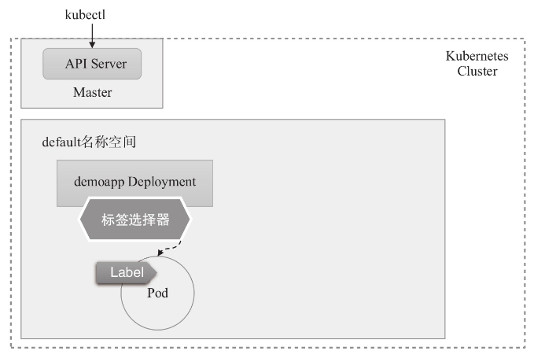
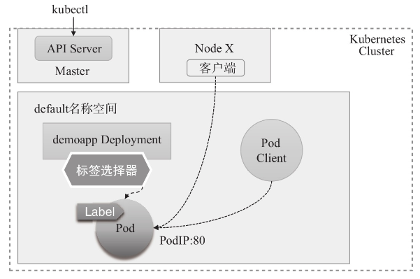
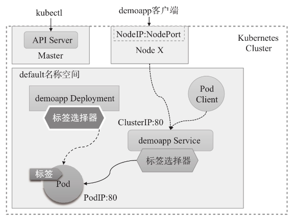
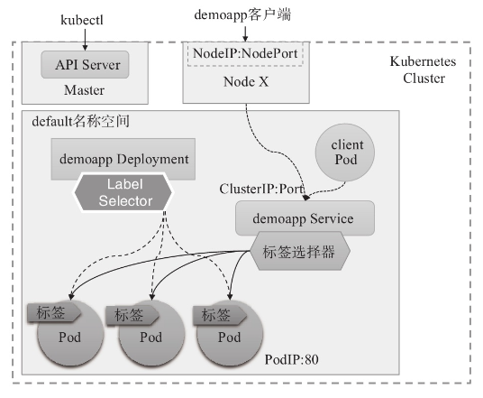
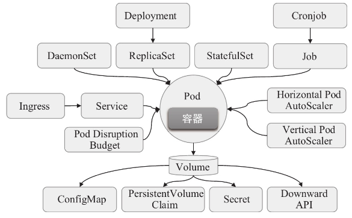

# 第02章_资源管理

Kubernetes API 是管理各种资源对象的唯一入口，它基于 HTTP/HTTPS 协议接收并响应客户端，提供了一个 RESTful 风格的 CRUD（Create、Read、Update和Delete）接口用于查询和修改集群状态，并将结果存储在集群状态存储系统 etcd 中。事实上，API Server 也是用于更新 etcd 中资源对象状态的**唯一途径**，Kubernetes 的其他所有组件和客户端都要通过它完成查询或修改操作。Kubernetes API 主要由资源类型和控制器两部分组成，资源通常是声明为 JSON 或 YAML 格式并写入集群的对象，而控制器则在集群将资源存储完成后自动创建并启动。

## 1.简介

在 kubernetes 中，所有的内容都抽象为**资源**，用户需要通过操作资源来管理 kubernetes。

kubernetes 的本质上就是一个集群系统，用户可以在集群中部署各种服务，所谓的部署服务，其实就是在 kubernetes 集群中运行一个个的容器，并将指定的程序跑在容器中。

kubernetes 的最小管理单元是 **Pod** 而不是容器，所以只能将容器放在 Pod 中，而 kubernetes 一般也不会直接管理 Pod，而是通过 **Pod控制器**来管理 Pod 的。

Pod 可以提供服务之后，就要考虑如何访问 Pod 中服务，kubernetes 提供了 Service 资源实现这个功能。

当然，如果 Pod 中程序的数据需要持久化，kubernetes 还提供了各种存储系统。


## 2.资源管理方式-kubectl

`kubectl`是 kubernetes 集群的命令行工具，通过它能够对集群本身进行管理，并能够在集群上进行容器化应用的安装部署。`kubectl`命令能够读取任何以 .yaml、.yml 或 .json 为后缀的文件。`kubectl`的多数子命令支持使用`-f`选项指定使用的清单文件路径或 URL，甚至直接指定存储有清单文件的目录，而该选项在同一命令中也可重复使用多次。若指定的目录路径存在子目录，也可按需同时使用`-R`选项以**递归获取**子目录中的配置清单。

经常使用的操作有下面这些：

| 命令分类     | 命令          | 命令作用                                                     |
| ------------ | ------------- | ------------------------------------------------------------ |
| 基本命令     | create        | 通过文件或标准输入创建一个资源                               |
|              | edit          | 编辑一个资源，相当于先使用`get`命令获取资源配置，由用户通过交互式编辑器修改后再自动使用`apply`命令将其应 |
|              | get           | 显示一个或多个资源，如`kubectl get all -n myns`可以获得 myns 命名空间下的所有类型的资源，`all`这里代表所有类型 |
|              | set           | 设置目标资源对象的特定属性                                   |
|              | patch         | 使用策略合并补丁更新资源字段                                 |
|              | delete        | 基于文件名、stdin、资源或名字，以及资源和选择器删除资源，如`~$ kubectl delete pods -l k8s-app=kube-proxy -n kube-system`，若要删除所有则可执行`~$ kubectl delete pods --all -n kube-public`；<br />另外，有些资源类型支持优雅删除的机制，它们有着默认的删除宽限期，例如 Pod 资源的默认宽限期为 30 秒，但用户可在命令中使用`--grace-period`选项或`--now`选项来覆盖默认的宽限期，但这种删除操作可能会导致相关容器无法终止并退出：`~$ kubectl delete pods demoapp --force --grace-period=0` |
|              | explain       | 展示资源配置清单格式文档                                     |
| 运行和调试   | run           | 在集群中以 Pod 形式运行指定的镜像，如创建一个 Pod 对象运行由用户指定的命令，且退出后将被自动删除：`kubectl run demoapp-$RANDOM --image="ikubernetes/demoapp:v1.0" --rm -it -- /bin/sh` |
|              | expose        | 基于 RC、Service、Deployment 或 Pod 创建 Service 资源        |
|              | describe      | 显示资源内部信息                                             |
|              | logs          | 输出容器在 pod 中的日志                                      |
|              | attach        | 附加终端至一个运行中的容器                                   |
|              | exec          | 执行容器中的一个命令，如`kubectl exec kube-apiserver-master.ilinux.io -n kube-system -- ps`，若 Pod 对象中存在多个容器，需要以`-c`选项指定容器后才能运行指定的命令 |
|              | cp            | 在Pod内外复制文件                                            |
|              | port-forward  | 将本地的一个或多个端口转发至指定的 Pod                       |
|              | proxy         | 创建能够访问 Kubernetes API Server 的代理                    |
|              | auth          | 打印授权信息                                                 |
| 部署命令     | rollout       | 管理资源的滚动更新                                           |
|              | scale         | 伸缩 Deployment、ReplicaSet、RC 或 Job 的规模                |
|              | autoscale     | 对 Deployment、ReplicaSet、RC 进行自动伸缩                   |
| 高级命令     | apply         | 通过比较资源在清单文件中的版本及前一次的版本执行更新操作，而不对未定义的属性产生额外作用 |
|              | label         | 更新资源上的标签                                             |
|              | diff          | 对比当前版本与即将应用的新版本的不同                         |
|              | replace       | 基于文件或 stdin 替换一个资源                                |
|              | wait          | 等待一个或多个资源上的指定境况                               |
|              | convert       | 为不同的 API 版本转换配置文件                                |
|              | kustomize     | 基于目录或 URL 构建 kustomization 目标                       |
| 集群管理命令 | cluster-info  | 显示集群信息                                                 |
|              | certificate   | 配置数字证书资源                                             |
|              | top           | 打印资源使用率                                               |
|              | cordon        | **将指定 node 设定为不可用（unschedulable）状态**            |
|              | uncordon      | 将指定 node 设定为可用状态                                   |
|              | drain         | **排空 Node 上的 Pod 以进入维护模式**                        |
|              | taint         | 为 Node 声明污点及标准行为                                   |
| 其他命令     |               |                                                              |
|              | version       | 显示当前 Server 和 Client 的版本                             |
|              | api-versions  | 以 group/version 格式打印服务器支持的 API 版本信息           |
|              | api-resources | 打印 API 支持的资源类型                                      |
|              | annotate      | 更新资源的注解                                               |
|              | completion    | 输出指定的 shell 的补全码                                    |
|              | config        | 配置 kubeconfig 文件的内容                                   |
|              | plugin        | 运行命令行插件                                               |
|              | alpha         | 仍处于 Alpha 阶段的子命令                                    |

同时，`kubectl get`命令能够支持多种不同的输出格式：

|     输出格式      |                           格式说明                           |
| :---------------: | :----------------------------------------------------------: |
|      -o wide      |                以纯文本格式显示资源的附加信息                |
|      -o name      |                       仅打印资源的名称                       |
|      -o yaml      |               以 YAML 格式化输出 API 对象信息                |
|      -o json      |               以 JSON 格式化输出 API 对象信息                |
|    -o jsonpath    | 以自定义 JSONPath 模板格式输出 API 对象信息，例如下面的命令先取出 dev 名称空间带有指定标签的一个 Pod 对象，然后查看该对象的日志：<br />`~$ DNS_POD=$(kubectl get pods -l  k8s-app=kube-dns -n kube-system -o jsonpath="{.items[0].metadata.name}")`<br />`~$ kubectl logs $DNS_POD -n kube-system` |
|  -o go-template   |           以自定义的 Go 模板格式输出 API 对象信息            |
| -o custom-columns |                      自定义要输出的字段                      |

此外还有许多通用选项，这个可以使用`kubectl options`获取，常用的有：

- `-s`或`-server`：指定 API Server 的地址和端口
- `-kubeconfig`：使用的 kubeconfig 配置文件路径，默认`~/.kube/config`
- `-n`或`-namespace`：命令执行的目标空间名称

`kubectl`的命令也可大体分为 3 类：

- **命令式命令**：直接使用命令去操作 kubernetes 资源

  ```bash
  kubectl run nginx-pod --image=nginx:1.17.1 --port=80
  ```

- **命令式对象配置**：通过命令配置和配置文件去操作 kubernetes 资源

  ```bash
  kubectl create/patch -f nginx-pod.yaml
  ```

- **声明式对象配置**：通过 apply 命令和配置文件去操作 kubernetes 资源

  ```bash
  kubectl apply -f nginx-pod.yaml
  ```

| 类型           | 操作对象 | 适用环境 | 优点                                       | 缺点                             |
| -------------- | -------- | -------- | ------------------------------------------ | -------------------------------- |
| 命令式命令     | 对象     | 测试     | 简单，常用于查看                           | 只能操作活动对象，无法审计、跟踪 |
| 命令式对象配置 | 文件     | 开发     | 可以审计、跟踪                             | 项目大时，配置文件多，操作麻烦   |
| 声明式对象配置 | 目录     | 开发     | 支持目录操作，可以执行目录下所有 yaml 文件 | 意外情况下难以调试               |

> **提示**
>
> 一般情况下，在 node 节点执行任意`kubectl`命令，例如：`kubectl get nodes`，命令会报错。
>
> `kubectl`的运行是需要进行配置的，需要将`admin.conf`文件上传到 node 节点的`/etc/kubernetes`目录下，在 master 节点上执行下面操作：
>
> ```bash
> scp -r /etc/kubernetes/admin.conf node1:/etc/kubernetes/admin.conf
> ```
>
> 再在 node 节点配置环境变量
>
> ```bash
> export KUBECONFIG=/etc/kubernetes/admin.conf
> ```


### 2.1 命令式命令

`kubectl`命令提供了基于命令行访问 Kubernetes API 的简洁方式，支持对各种类型资源的 CRUD 操作，能够满足针对Kubernetes系统的绝大部分的操作需求。例如，需要创建资源对象时，`kubectl`能够将资源清单内容以 POST 方式提交至 API Server 并接收其响应。

命令的语法如下：

```bash
kubectl [command] [type] [name] [flags]
```

- `comand`：指定要对资源执行的操作，例如 create、get、delete
- `type`：指定资源类型，比如 deployment、pod、service
- `name`：指定资源的名称，名称大小写敏感；省略时表示指定`type`的所有资源对象；同一类型的资源名称可于`type`后同时给出多个，也可以直接使用`type/name`的格式来为每个资源对象分别指定类型，如`kubectl get deployments/demoapp`等同于`kubectl get deployments demoapp`
- `flags`：指定额外的可选参数，例如`-s`或`--server`等；另外，`get`等命令在输出时还有一个常用的标志`-o <format>`用于指定输出格式

kubernetes 允许对资源进行多种操作，可以通过`--help`查看详细的操作命令

```bash
kubectl --help
```

### 2.2 命令式对象配置

命令式对象配置就是使用命令配合配置文件一起来操作 kubernetes 资源。

命令式对象配置管理方式包括`create`、`delete`、`get`和`replace`等命令。与命令式命令不同，它通过资源配置清单读取要管理的目标资源对象，通用格式为`kubectl create|delete|replace|get -f <filename|url>`，其中的`filename`和`url`分别是指以本地文件路径或 URL 来指定配置清单文件。命令式对象配置的管理操作直接作用于活动对象，因而即使修改配置清单中极小的一部分内容，在使用`replace`命令进行对象更新时也将会导致整个对象被完全替换。所以**混合使用命令式命令进行清单文件外的修改时，必然导致用户丢失活动对象的当前状态**。

1） 创建一个 nginxpod.yaml，内容如下：

```yaml
apiVersion: v1
kind: Namespace
metadata:
  name: dev

---

apiVersion: v1
kind: Pod
metadata:
  name: nginxpod
  namespace: dev
spec:
  containers:
  - name: nginx-containers
    image: nginx:latest
```

2）执行`create`命令，创建资源：

```bash
[root@master ~]# kubectl create -f nginxpod.yaml
namespace/dev created
pod/nginxpod created
```

此时发现创建了两个资源对象，分别是 namespace 和 pod。

3）执行`get`命令，查看资源：

```bash
[root@master ~]#  kubectl get -f nginxpod.yaml
NAME            STATUS   AGE
namespace/dev   Active   18s

NAME            READY   STATUS    RESTARTS   AGE
pod/nginxpod    1/1     Running   0          17s
```

这样就显示了两个资源对象的信息。

4）执行`delete`命令，删除资源：

```bash
[root@master ~]# kubectl delete -f nginxpod.yaml
namespace "dev" deleted
pod "nginxpod" deleted
```

此时发现两个资源对象被删除了。

### 2.3 声明式对象配置

声明式对象配置跟命令式对象配置很相似，但是它只有一个命令`apply`，且每次操作时，提供给命令的配置信息都将保存在对象的注解信息（kubectl.kubernetes.io/last-applied-configuration）中，它通过对比检查活动对象的当前状态、注解中的配置信息及资源清单中的配置信息进行变更合并，从而实现**仅修改变动字段**的高级补丁机制。

声明式对象配置支持针对目录进行操作，通过在目录中存储多个对象配置文件，然后由`apply`命令递归地创建、更新或删除这些对象，它保留对活动对象所做的更改操作，但并不会将更改合并回对象配置文件中。另外，`kubectl diff`命令提供了预览要更改的配置的方法。

- 创建：`kubectl apply -f <directory>/`
- 更新：`kubectl apply -f <directory>/`，可以先使用`kubectl diff -f <directory>/`命令预览
- 删除：`kubectl apply -f <directory/> --prune -l your=label`，这里删除的是文件中未定义的资源，建议使用命令式的方法`kubectl delete -f <filename>`
- 查看：命令式的方法`kubectl get -f <filename|url> -o yaml`

```bash
# 首先执行一次 kubectl apply -f yaml 文件，发现创建了资源
[root@master ~]#  kubectl apply -f nginxpod.yaml
namespace/dev created
pod/nginxpod created

# 再次执行一次，发现说资源没有变动
[root@master ~]#  kubectl apply -f nginxpod.yaml
namespace/dev unchanged
pod/nginxpod unchanged
```

**命令式对象配置和声明式对象配置对比**

- 命令式对象配置会导致整个对象被完全替换，声明式对象配置采用合并策略，只会修改配置文件的变动字段。
- 命令式对象配置要求**同一目录下的配置文件必须同时进行同一种操作**，例如要么都创建，要么都更新等，而且其他用户的更新也必须一并反映在配置文件中，否则将在执行时被覆盖；而声明式对象配置并无此要求或限制，它仅作用于自己声明的各对象，事先不存在的对象会被创建，而已存在对象则会被保留或者修改以吻合声明中的定义，具体操作取决于活动对象的当前状态与用户声明状态的对比结果。

推荐高级用户**使用声明式配置**，建议同时使用版本控制系统存储期望的状态和跨对象的历史信息。

### 2.4 kubectl插件

https://krew.sigs.k8s.io/docs/user-guide/setup/install/

kubectl 插件是指能够由 kubectl 调用的外部独立应用程序，这类应用程序都以`kubectl-$plugin_name`格式命名，表现为 kubectl 的名字是`$plugin_name`的子命令。例如，应用程序`/usr/bin/kubectl-whoami`就是 whoami 插件，我们可以使用`kubectl whoami`的格式来运行它。

插件程序能够从 kubectl 继承环境信息，但 kubectl 的插件机制并不会在该程序及调用的外部程序之间传递任何信息，它仅**仅提供了调用外部程序的一个统一接口**，于是我们可以使用任何熟悉的脚本语言或编程语言来开发 kubectl 插件，但最终的脚本或程序文件需要以`kubectl-`为名称前缀。安装插件时只需要将插件程序的可执行文件移动到系统的`PATH`环境变量上，指向任一路径即可。`kubectl plugin list`命令可遍历`PATH`环境变量指向的每一个路径，搜索并列出每一个以`kubectl-`为前缀的可执行程序文件路径。

Kubernetes SIG CLI 社区还提供了一个插件管理器——**Krew**，它能够帮助用户打包、分发、查找、安装和管理kubectl插件，项目地址为https://krew.sigs.k8s.io/。Krew 以跨平台的方式打包和分发插件，因此单一打包格式即能适配主流的系统平台。

Krew 自身也表现为 kubectl 的一个插件，需要以手动方式独立安装。先确保安装了 GIT，然后执行以下命令：

```bash
(
  set -x; cd "$(mktemp -d)" &&
  OS="$(uname | tr '[:upper:]' '[:lower:]')" &&
  ARCH="$(uname -m | sed -e 's/x86_64/amd64/' -e 's/\(arm\)\(64\)\?.*/\1\2/' -e 's/aarch64$/arm64/')" &&
  KREW="krew-${OS}_${ARCH}" &&
  curl -fsSLO "https://github.com/kubernetes-sigs/krew/releases/latest/download/${KREW}.tar.gz" &&
  tar zxvf "${KREW}.tar.gz" &&
  ./"${KREW}" install krew
)
```

添加以下命令到`$HOME/.bashrc`文件末尾并重启 shell：

```bash
export PATH="${KREW_ROOT:-$HOME/.krew}/bin:$PATH"
```

设定完成后，`kubectl krew`子命令便能执行 Krew 插件管理器的相关功能，例如查找和安装所需要的插件，它拥有 help、list、search、info、install、upgrade 和 uninstall 等二级子命令。下面的命令搜索 Krew 索引中包含字符串`who`的插件。

```bash
~$ kubectl krew search who
NAME     DESCRIPTION                                         INSTALLED
who-can  Shows who has RBAC permissions to access Kubern...     no
whoami   Show the subject that's currently authenticated...     no
```

插件的简要描述能够通过`info`子命令打印。例如，下面的命令打印了`whoami`插件的相关描述，该插件能够返回当前 kubectl 客户端将以哪个主体（subject）身份请求认证的信息。

```bash
~$ kubectl krew info whoami
NAME: whoami
……
DESCRIPTION: 
This plugin show the subject that's currently authenticated as.
……
```

安装插件则需要使用`install`命令，命令格式为`install PLUGIN_NAME`。仍然以`whoami`插件为例，使用如下命令即能完成该插件的安装。

```bash
~$ kubectl krew install whoami
```

`whoami`插件功能非常简单，它没有更多的选项可以使用，因此，`kubectl whoami`便能返回当前 kubectl 客户端会以哪种身份凭据认证到 API Server。下面命令的结果显示：当前客户端基于 kubeconfig 配置文件（kubecfg）加载 X509 数字证书格式的身份凭据（certauth），并由 API Server 认证为管理员（admin）。

```bash
~$ kubectl whoami
kubecfg:certauth:admin
```

**建议安装以下常用的插件：**

```bash
# ctx 以更便捷的方式完成 kubeconfig 中的 context 切换
~$ kubectl krew install whoami rbac-view ns ctx
```

## 3.实战：命令式应用编排

本节使用示例镜像 ikubernetes/demoapp:v1.0 演示容器应用编排的基础操作：应用部署、访问、查看，服务暴露和应用扩缩容等。一般说来，Kubernetes 之上应用程序的基础管理操作由如下几个部分组成。

1. 通过合用的控制器类的资源（例如`Deployment`或`ReplicationController`）创建并管控 Pod 对象以运行特定的应用程序：无状态（stateless）应用的部署和控制通常使用`Deployment`控制器，而有状态应用则需要使用`StatefulSet`控制器或扩展的 Operator。
2. 为 Pod 对象创建 Service 对象，以便向客户端提供固定的访问端点，并能够借助 KubeDNS 进行服务发现。
3. 随时按需获取各资源对象的简要或详细信息，以了解其运行状态。
4. 如有需要，对支持扩缩容的应用按需进行扩容或缩容；或者，为支持 HPA 的控制器组件（例如`Deployment`或`ReplicationController`）创建 HPA 资源对象，以实现 Pod 副本数目的自动伸缩。
5. 应用程序的镜像出现新版本时，对其执行更新操作，若相应的控制器支持，修改指定的控制器资源中 Pod 模板的容器镜像为指定的新版本即可自动触发更新过程。

以下操作命令均可在任何部署了 kubectl 并能正常访问 Kubernetes 集群的主机上执行，包括集群外的主机。复制 Master 主机上的`/etc/kubernetes/admin.conf`至相关用户主目录下的`.kube/config`文件即可正常执行，具体方法请参考`kubeadm init`命令结果中的提示。

### 3.1 应用编排

#### 1.创建 Deployment 控制器对象

`kubectl create deployment`能够以“命令式命令”直接创建`Deployment`控制器对象，经该对象编排的 Pod 对象将由该命令生成的 Pod 模板自动创建，但需要用户以`--image`选项指定要使用的容器镜像。该命令的`--dry-run={none|client|server}`选项可**用于测试运行**，并不真正执行资源对象的创建过程，因而可用于在真正运行之前测试其是否能成功创建出指定的 Deployment 资源。例如，下面的命令会创建一个名为 demoapp 的 Deployment 控制器对象，它使用镜像 ikubernetes/demoapp:v1.0 创建 Pod 对象，但仅用于测试，运行后即退出。

```bash
~$ kubectl create deployment demoapp --image="ikubernetes/demoapp:v1.0" --dry-run=client
deployment.apps/demoapp created (dry run)
```

确认测试命令无误后，可在移除`--dry-run`选项后再次执行命令以完成资源对象的创建。

```bash
~$ kubectl create deployment demoapp --image="ikubernetes/demoapp:v1.0" 
deployment.apps/demoapp created
```

该命令创建的 Deployment/demoapp 对象会借助指定的镜像在`default`名称空间中生成一个 Pod，**并自动为其添加 app=demoapp 标签**，而控制器对象自身也将使用该标签作为标签选择器。镜像 ikubernetes/demoapp:v1.0 中定义的容器主进程为默认监听于 80 端口的 Web 应用程序 demoapp。



#### 2.打印资源对象的相关信息

面是查看前面创建的 Deployment 对象的相关运行状态的命令及其输出结果：

```bash
root@VM-0-4-ubuntu:/# kubectl get deployments/demoapp
NAME      READY   UP-TO-DATE   AVAILABLE   AGE
demoapp   1/1     1            1           59s
```

- NAME：Deployment 资源对象的名称
- READY：以类似 m/n 格式返回两个数字，m 代表就绪的 Pod 数量，n 表示期望的总的 Pod 数量
- UP-TO-DATE：更新到最新版本定义的 Pod 对象副本数量，在控制器的滚动更新模式下，它表示已经完成版本更新的 Pod 对象副本数量
- AVAILABLE：当前处于可用状态的 Pod 对象副本数量，即可正常提供服务的副本数
- AGE：该资源的存在时长

> **提示**
>
> Deployment 资源对象是**通过 ReplicaSet 控制器对象作为中间层实例完成对 Pod 对象的控制**，各 Pod 的名称也是由 ReplicaSet 对象名称后跟几个随机字符构成。

由控制器创建的 Pod 对象的名称通常是以其隶属的 ReplicaSet 对象的名称为前缀，以随机字符为后缀，例如下面命令以 app=demoapp 为标签选择器打印筛选出的 Pod 对象的相关信息。

```bash
root@VM-0-4-ubuntu:/# kubectl get pods -l app=demoapp -o wide
NAME                      READY   STATUS    RESTARTS   AGE    IP           NODE             NOMINATED NODE   READINESS GATES
demoapp-7c58cd6bb-7hnbh   1/1     Running   0          5m3s   10.244.1.7   vm-0-16-ubuntu   <none>           <none>

root@VM-0-4-ubuntu:/# kubectl get rs
NAME                DESIRED   CURRENT   READY   AGE
demoapp-7c58cd6bb   1         1         1       5m26s
```

- STATUS：Pod 的当前状态，其值可能是 Pending、Running、Succeeded、Failed 和 Unknown 等其中之一，并存在某些类型的中间状态（容器状态）
- RESTARTS：Pod 对象可能会因容器进程崩溃、超出资源限额等故障而被重启，此字段记录了它重启的次数
- IP：Pod 的 IP 地址，通常由网络插件自动分配
- NODE：该 Pod 对象绑定的 Node，目标 Node 由 Scheduler 负责挑选

确认 Pod 对象转为 Running 状态后，即可在集群中任一节点（或其他 Pod 对象）直接访问容器化应用的服务：

```bash
root@VM-0-4-ubuntu:/# POD_IP=$(kubectl get pods -l app=demoapp -o jsonpath={.items[0].status.podIP})
root@VM-0-4-ubuntu:/# curl http://${POD_IP}
iKubernetes demoapp v1.0 !! ClientIP: 10.244.0.0, ServerName: demoapp-7c58cd6bb-7hnbh, ServerIP: 10.244.1.7!

# 在另一台 Node 上也可以访问
root@VM-0-16-ubuntu:~# curl http://10.244.1.7
iKubernetes demoapp v1.0 !! ClientIP: 10.244.1.1, ServerName: demoapp-7c58cd6bb-7hnbh, ServerIP: 10.244.1.7!
```



### 3.2 部署Service对象

Service 对象就是一组 Pod 的逻辑组合，它通过称为 **ClusterIP** 的地址和服务端口接收客户端请求，并将这些请求代理至使用标签选择器来过滤一个符合条件的 Pod 对象。

`kubectl create service`命令可创建 Service 对象以将应用程序“暴露”于网络中，它使用的标签选择器为`app=SVC_NAME`。例如，下面的命令**默认使用 app=demoapp 为标签选择器**创建了 service/demoapp 资源对象。

```bash
~$ kubectl create service nodeport demoapp --tcp=80
service/demoapp created
```

在上面的命令中，nodeport 是指 Service 对象的类型，它会在集群中各节点上随机选择一个节点端口（hostPort）为该 Service 对象接入集群外部的访问流量，集群内部流量则由 Service 资源通过 ClusterIP 直接接入。命令选项`--tcp=<port>[:<targetPort>]`用于指定 Service 端口及容器上要暴露的端口，**省略容器端口时表示与 Service 端口相同**。创建完成后，default 名称空间中的对象及其通信示意图如图所示。



这样我们既可以在任意节点通过 PodIP 来访问，也可以在其他任意一个 Pod 对象中来访问此 Pod。首先，使用`kubectl run`命令创建一个自主式 Pod 对象并直接接入其交互式接口，如下面命令的`-it`组合选项即用于交互式打开并保持其`shell`命令行接口。

```bash
~$ kubectl run client-pod --image="ikubernetes/admin-toolbox:v1.0" --rm -it -- /bin/sh
[root@client-pod /]#
```

接下来，在 client-pod 中测试 Service 对象的名称解析功能，如下面命令中的`demoapp`是指 Service 对象名称，而`default`是该 Service 所属的名称空间，`svc`代表 Service 资源，而`cluster.local`是集群域名。其中的`svc.cluster.local`通常可以省略，**如果客户端与目标 Service 对象在同一名称空间中，则名称空间也可省略**。

```bash
# nslookup 是一个用于执行 DNS 查询的命令行工具，可以使用它来查找域名的 IP 地址
[root@client-pod /]# nslookup -query=A demoapp.default.svc.cluster.local
Server:		10.96.0.10
Address:	10.96.0.10#53

Name:	demoapp.default.svc.cluster.local
Address: 10.103.6.130

[root@client-pod /]# nslookup -query=A demoapp.default
Server:		10.96.0.10
Address:	10.96.0.10#53

Name:	demoapp.default.svc.cluster.local
Address: 10.103.6.130
```

随后，可在 client-pod 通过`crul`命令对此前创建的 Service 对象的名称发起访问请求，下面的命令使用了短格式的服务名称。

```bash
[root@client-pod /]# curl http://demoapp
iKubernetes demoapp v1.0 !! ClientIP: 10.244.1.8, ServerName: demoapp-7c58cd6bb-7hnbh, ServerIP: 10.244.1.7!
```

`kubectl get services`命令能够列出 Service 对象的相关信息。

```bash
root@VM-0-4-ubuntu:/# kubectl get service/demoapp 
NAME      TYPE       CLUSTER-IP     EXTERNAL-IP   PORT(S)        AGE
demoapp   NodePort   10.103.6.130   <none>        80:31128/TCP   19m
```

其中，PORT(s) 字段中表明，集群中各工作节点会捕获发往本地的目标端口为 32687 的流量，并将其代理至当前 Service 对象的 80 端口，于是，集群外部的用户可以使用当前集群中任一节点的此端口来请求 Service 对象上的服务。`CLUSTER-IP`字段为当前 Service 的 IP 地址，它是一个虚拟 IP，并没有配置在集群中任何主机的任何接口之上，**但每个 Node 上的 kube-proxy 都会为`CLUSTER-IP`所在的网络创建用于转发的 iptables 或 ipvs 规则**。此时，用户可于集群外部任一浏览器请求 Kubernetes 集群任意一个节点的相关端口来进行访问测试。

### 3.3 扩容与缩容

前面示例中创建的 Deployment 对象 demoapp 仅创建了一个 Pod 对象，其所能够承载的访问请求数量受限于这个 Pod 对象的服务能力。用户可以通过 Kubernetes 的应用**扩容**（scaling up）机制来增加 Pod 副本数量，从而提升其服务容量。相应地，**缩容**是指缩减 Pod 副本数量，只不过这通常缘于与扩容操作相反的原因。

`kubectl scale`命令就是专用于变动控制器应用规模的命令，它支持对 Deployment、ReplicaSet、StatefulSet 等类型资源对象的扩容和缩容操作。例如，如果要将 Deployment/demoapp 中的 Pod 副本数量扩展为 3 个，可以使用如下命令完成。

```bash
root@VM-0-4-ubuntu:/# kubectl scale deployment/demoapp --replicas=3
deployment.apps/demoapp scaled
```

而后列出由 demoapp 创建的 Pod 副本，便可确认其扩展操作的完成状态。如下命令显示出其 Pod 副本数量已经扩增至 3 个，其中包括此前的 Pod。

```bash
root@VM-0-4-ubuntu:/# kubectl get pods -l app=demoapp
NAME                      READY   STATUS    RESTARTS   AGE
demoapp-7c58cd6bb-72lxm   1/1     Running   0          22s
demoapp-7c58cd6bb-7hnbh   1/1     Running   0          42m
demoapp-7c58cd6bb-xr6ht   1/1     Running   0          22s
```

Service 对象内置的负载均衡机制可**在其后端副本数量不止一个时自动进行流量分发**，它还会自动监控关联到的 Pod 的健康状态，以确保仅将请求流量分发至可用的后端 Pod 对象。因此，Deployment 对象 demoapp 规模扩展完成后，default 名称空间中的资源对象及其关联关系就变成了如图所示的情形。



而后由`kubectl describe deployment`命令打印 Deployment 对象 demoapp 的详细信息，了解其应用规模的变动及当前 Pod 副本的状态等相关信息。由命令结果可以看出，其 Pod 副本数量的各项指标都已经转换为新的目标数量，而其事件信息中也有相应事件显示其扩增操作已成功完成。

```bash
~$ kubectl describe deployment/demoapp 
Name:                   demoapp
……
Replicas:          3 desired | 3 updated | 3 total | 3 available | 0 unavailable
……
NewReplicaSet:   demoapp-6c5d545684 (3/3 replicas created)
Events:
Type    Reason             Age    From                   Message
----    ------             ----   ----                   -------
Normal  ScalingReplicaSet  2m16s  deployment-controller  Scaled up replica set   demoapp-6c5d545684 to 3
```

Service 对象 demoapp 的标签选择器动态纳入的新 Pod 副本也将成为该 Service 对象可用的代理后端，所有流量会被调度至其后端的所有 Pod 对象之上。每个能够接收流量的后端称为一个端点，它通常表现为相应主机或容器上可接收特定流量的访问入口（套接字），如下面命令结果中的`Endpoints`字段所示。

```bash
~$ kubectl describe service/demoapp
Name:                     demoapp
……
IP:                       10.102.6.223
Port:                     80  80/TCP
TargetPort:               80/TCP
NodePort:                 80  32687/TCP
Endpoints:                10.244.0.6:80,10.244.1.7:80,10.244.1.9:80
……
```

我们可以通过任何客户端对 Service/demoapp 的服务发起访问请求进行测试，这次我们在集群外的主机上通过访问节点 IP+NodePort 对该服务发起持续访问，以测试 Service 对象的流量调度机制是否能够正常工作。由命令的响应结果显示，Service/demoapp 已然将请求调度至 3 个不同的后端 Pod 之上。

```bash
flamezyy@DS220plus:/$ while true; do curl http://43.153.170.51:31128; sleep 0.2; done
iKubernetes demoapp v1.0 !! ClientIP: 10.244.0.1, ServerName: demoapp-7c58cd6bb-xr6ht, ServerIP: 10.244.0.6!
……
iKubernetes demoapp v1.0 !! ClientIP: 10.244.0.0, ServerName: demoapp-7c58cd6bb-7hnbh, ServerIP: 10.244.1.7!
……
iKubernetes demoapp v1.0 !! ClientIP: 10.244.0.0, ServerName: demoapp-7c58cd6bb-72lxm, ServerIP: 10.244.1.9!
```

应用规模缩容的方式和扩容相似，只不过是将 Pod 副本的数量调至比原来小的数字。例如，将 demoapp 的 Pod 副本缩减至 2 个，可以使用类似如下命令进行。

```bash
root@VM-0-4-ubuntu:/# kubectl scale deployment/demoapp --replicas=2
deployment.apps/demoapp scaled

root@VM-0-4-ubuntu:/# kubectl get pods -l app=demoapp
NAME                      READY   STATUS    RESTARTS   AGE
demoapp-7c58cd6bb-7hnbh   1/1     Running   0          67m
demoapp-7c58cd6bb-xr6ht   1/1     Running   0          25m
```

### 3.4 修改与删除对象

成功创建于 Kubernetes 之上的资源对象也称为活动对象（live object），其配置规范（live object configuration）由 API Server 保存在集群状态存储系统etcd中。`kubectl edit`命令可调用默认编辑器对活动对象的可配置属性进行编辑。例如，若需要将此前创建的 Service/demoapp 对象的类型修改为 ClusterIP，可以使用`kubectl edit service demoapp`命令打开编辑界面后，通过将`type`属性的值修改为`ClusterIP`使其实时生效。

有些命令是`kubectl edit`命令某一部分功能的二次封装，例如`kubectl scale`命令不过是专用于修改资源对象的 replicas 属性值而已，而`kubectl set image`通常用于修改工作负载型控制器资源规范中 Pod 模板的容器镜像，这两个命令同样直接作用于活动对象。

不再有价值的活动对象可使用`kubectl delete`命令予以删除。例如，下面的命令能够删除 service/demoapp 资源对象：

```bash
~$ kubectl delete service/demoapp
service "demoapp" deleted
```

有时候需要清空某一类型下的**所有对象**，此时只需要将上面命令对象名称换成`--all`选项便能实现。例如，删除 dafault 名称空间中所有的 Deployment 控制器：

```bash
~$ kubectl delete deployment --all
deployment.apps "demoapp" deleted
```

需要注意的是，受控于控制器的 Pod 对象在删除后会被重建，因而**删除此类对象需要直接删除其控制器对象**。默认情况下，删除 Deployment 一类的工作负载型控制器资源会级联删除相关的所有 Pod 对象，若要禁用该功能，需要在删除命令中使用`--cascade=false`选项。

## 4.资源对象与API

### 4.1 资源对象

kubernetes 中所有的内容都抽象为资源，可以通过下面的命令进行查看：

```bash
kubectl api-resources
```

Kubernetes 的 API 对象大体可分为**工作负载**、**发现与负载均衡**、**配置与存储**、**集群**和**元数据**几个类别。它们基本都是围绕一个核心目的而设计：如何更好地运行和丰富 Pod 资源，从而为容器化应用提供更灵活和更完善的操作与管理组件。



经常使用的资源有下面这些：

| 资源分类       | 资源名称                 | 缩写   | 资源作用                                                     |
| -------------- | ------------------------ | ------ | ------------------------------------------------------------ |
| 工作负载型资源 | pods                     | po     | 运行容器化应用及调度的原子单元，同一个 Pod 可同时运行多个容器，这些容器共享 Linux 内核名称空间，并能够访问同一组存储卷 |
|                | replicationcontrollers   | rc     | 控制 Pod 资源                                                |
|                | replicasets              | rs     | 控制 Pod 资源                                                |
|                | deployments              | deploy | 控制 Pod 资源，最常用的无状态应用控制器，支持应用的扩缩容、滚动更新等 |
|                | daemonsets               | ds     | 控制 Pod 资源                                                |
|                | jobs                     |        | 控制 Pod 资源                                                |
|                | cronjobs                 | cj     | 控制 Pod 资源                                                |
|                | horizontalpodautoscalers | hpa    | 控制 Pod 资源                                                |
|                | statefulsets             | sts    | 控制 Pod 资源                                                |
| 发现与负载均衡 | services                 | svc    | 统一 Pod 对外接口，为弹性变动且存在生命周期的 Pod 对象提供了一个固定的访问接口，便于服务发现和访问 |
|                | ingress                  | ing    | 统一 Pod 对外接口                                            |
| 配置与存储资源 | volumeattachments        |        | 存储                                                         |
|                | persistentvolumes        | pv     | 存储                                                         |
|                | persistentvolumeclaims   | pvc    | 存储                                                         |
|                | configmaps               | cm     | 配置                                                         |
|                | secrets                  |        | 配置                                                         |
| 集群级别资源   | nodes                    | no     | 集群组成部分                                                 |
|                | namespaces               | ns     | 隔离 Pod                                                     |
|                | Role                     |        | 角色权限                                                     |
|                | ClusterRole              |        | 集群角色                                                     |
|                | RoleBinding              |        | 绑定 Role 到一个或一组用户                                   |
|                | ClusterRoleBinding       |        | 绑定 ClusterRole 到一个或一组用户                            |

一个应用通常需要多个资源的支撑，例如用 **Deployment** 资源编排应用实例（**Pod**）、用 **ConfigMap** 和 **Secret** 资源保存应用配置、用 **Service** 或 **Ingress** 资源暴露服务、用 **Volume** 资源提供持久化存储等。

#### 1.工作负载型资源

**Pod** 用于承载容器化应用，代表着 Kubernetes 之上工作负载的表现形式。它负责运行容器，并为容器解决环境性的依赖，例如向容器注入临时或持久化的存储空间、配置信息或密钥数据等。而诸如滚动更新、扩容和缩容一类的编排任务则由**控制器**对象负责，专用于 Pod 编排任务的控制器也可统称为 **Pod 控制器**。

应用程序分为**无状态**和**有状态**两种类型，无状态应用中的每个 Pod 实例均可被其他同类实例所取代，但有状态应用的每个 Pod 实例均有其独特性，必须单独标识和管理，因而它们分别由两种不同类型的 Pod 控制器进行管理。例如，**ReplicationController**、**ReplicaSet** 和 **Deployment** 负责管理无状态应用，**StatefulSet** 则用于管控有状态类应用。还有些应用较为独特，有些需要在集群中的每个节点上运行单个 Pod 资源，负责收集日志或运行系统服务等任务，该类编排操作由 **DaemonSet** 控制器对象进行，而需要在正常完成后退出故无须始终处于运行状态任务的编排工作则隶属 **Job 控制器对象**。**CronJob 控制器**对象还能为 Job 型的任务提供定期执行机制。

- ReplicationController：用于确保每 个Pod 副本在任一时刻均能满足目标数量，即它用于保证每个容器或容器组总是运行并可访问；它是上一代的无状态 Pod 应用控制器，建议读者**使用新型控制器 Deployment 和 ReplicaSet 来取代它**
- **ReplicaSet**：新一代 ReplicationController，它与 ReplicationController 唯一不同之处在于支持的标签选择器不同，ReplicationController 只支持“等值选择器”，而 ReplicaSet 还支持基于集合的选择器
- **Deployment**：用于管理无状态的持久化应用，例如 HTTP 服务等；它用于为 Pod 和 ReplicaSet 提供声明式更新，是构建在 ReplicaSet 之上的、更为高级的控制器
- **StatefulSet**：用于管理有状态的持久化应用，例如数据库服务程序；与 Deployment 的不同之处在于，StatefulSet 会为每个 Pod 创建一个独有的**持久性标识符**，并会确保各 Pod 间的顺序性
- **DaemonSet**：用于确保每个节点都运行了某 Pod 的一个副本，包括后来新增的节点；而节点移除将导致 Pod 回收；DaemonSet 常用于运行各类**系统级守护进程**，例如 kube-proxy 和 Flannel 网络插件，以及日志收集和临近系统的 Agent 应用，例如 fluentd、Logstash、Prometheus 的 Node Exporter 等
- **Job**：用于管理运行完成后即可终止的应用，例如批处理作业任务；Job 创建一个或多个 Pod，并确保其符合目标数量，直到应用完成而终止

#### 2.发现与负载均衡

**Service** 是 Kubernetes 标准的资源类型之一，用于为工作负载实例提供固定的访问入口及负载均衡服务，它把每个可用后端实例定义为 Endpoint 资源对象，通过 IP 地址和端口等属性映射至 Pod 实例或相应的服务端点。**Ingress** 资源则为工作负载提供 7 层（HTTP/HTTPS）代理及负载均衡功能。

#### 3.配置与存储

**Kubernetes 支持在 Pod 级别附加 Volume 资源对象为容器添加可用的外部存储。**Kubernetes 支持众多类型的存储设备或存储系统，例如 GlusterFS、Ceph RBD 和 Flocker 等，还可通过 FlexVolume 及 CSI（Container Storage Interface）存储接口扩展支持更多类型的存储系统。

另外，基于镜像运行容器应用时，其配置信息在镜像制作时以硬编码的方式置入，所以很难为不同的环境定制所需的配置。Docker 使用环境变量等作为解决方案，但需要在容器启动时将配置作为变量值传入，且无法在运行时修改。Kubernetes 的 **ConfigMap 资源**能够以环境变量或存储卷的方式接入 Pod 资源的容器中，并可被多个同类的 Pod 共享引用，从而做到“一次修改，多处生效”。不过，这种方式不适用于存储敏感数据，例如证书、私钥和密码等，那是另一个资源类型 **Secret** 的功能。

#### 4.集群型资源

Kubernetes 还存在一些用于定义集群自身配置信息的资源类型，它们不属于任何名称空间且仅应该由集群管理员操作。常用的集群型资源有如下几种。

- **Namespace**：名称空间，为资源对象的名称提供了限定条件或作用范围，它为使用同一集群的多个团队或项目提供了逻辑上的隔离机制，降低或消除了资源对象名称冲突的可能性
- **Node**：Kubernetes 并不能直接管理其工作节点，但它会把由管理员添加进来的任何形式（物理机或虚拟机等）的工作节点映射为一个 Node 资源对象，因而节点名称（标识符）在集群中必须唯一
- **Role**：角色，隶属于名称空间，代表名称空间级别由规则组成的权限集合，可被 RoleBinding 引用
- **ClusterRole**：集群角色，隶属于集群而非名称空间，代表集群级别的、由规则组成的权限集合，可被 RoleBinding 和 ClusterRoleBinding 引用
- **RoleBinding**：用于将 Role 中的许可权限绑定在一个或一组用户之上，从而完成用户授权，它隶属于且仅能作用于名称空间级别
- **ClusterRoleBinding**：将 ClusterRole 中定义的许可权限绑定在一个或一组用户之上，通过引用全局名称空间中的 ClusterRole 将集群级别的权限授予指定用户

### 4.2 资源群组形式

资源对象代表了系统上的持久类实体，而 Kubernetes 用这些持久实体来表达集群的状态，包括容器化的应用程序正运行于哪些节点，每个应用程序有哪些资源可用，以及每个应用程序各自的行为策略，例如重启、升级及容错策略等。一个对象可能会由多个资源组合而成，用户可对这些资源执行增、删、改、查等管理操作。Kubernetes 通常使用标准的 RESTful 术语来描述 API 概念。

- **资源类型**是指在 URL 中使用的名称，例如 pods、namespaces 和 services 等，其 URL 格式为`GROUP/VERSION/RESOURCE`，例如`apps/v1/deployments`
- 每个资源类型都有一个对应的 **JSON 表示格式**，称为一个“种类”；客户端创建对象时，一般需要以 JSON 规范提交对象的配置信息
- **Kind** 代表资源对象所属的类型，例如 Namespace、Deployment、Service 及 Pod 等，而这些资源类型又大体可以分为 3 个类别
  - 对象类：对象表示 Kubernetes 系统上的持久化实体，一个对象可能包含多个资源，客户端可以对其执行多种操作；Namespace、Deployment、Service 及 Pod 等都属于这个类别
  - 列表类：通常是指同一类型资源的集合，例如 PodLists 和 NodeLists 等
  - 简单类：常用于在对象上执行某种特殊操作，或管理非持久化的实体，例如 /binding 或 /status 等

Kubernetes 绝大多数的 API 资源都属于**对象型类别**，代表集群中某个抽象组件的实例。有一小部分的 API 资源类型为“虚拟”类型，用于表达一类“操作”。所有的对象型资源都拥有一个独有的名称标识以完成幂等的创建及获取操作，但虚拟型资源无须获取或不依赖于幂等性时也可以不使用专用标识符。

有些资源类型的作用域为**集群级别**，操作权限归属于集群管理员，例如 Namespace 和 PersistentVolume 等，但绝大多数资源类型都隶属**名称空间级别**，可由用户使用，例如 Pod、Deployment 和 Service 等。名称空间级别资源的 URL 路径中含有其所属空间的名称，当这些资源对象在名称空间被删除时，其 URL 路径中的名称也会被一并删除，并且访问这些资源对象也将受控于其所属的名称空间级别的授权审查。

Kubernetes 把 API 分割为多个逻辑组合以便于扩展和管理，**每个组合称为一个 API 群组**，支持单独启用或禁用，并能够再次分解。API Server 支持为不同群组使用不同的版本，允许各组以不同的速度演进，而且支持同一群组同时存在不同的版本，例如 autoscaling/v1、autoscaling/v2beta2 和 autoscaling/v2beta1 等，因此能够在不同的群组中定义同名的资源类型，从而能在稳定版本的群组及新的实验群组中同时存在不同特性的同一个资源类型。在当前集群中，API Server 所支持的 API 群组及相关版本信息可通过`kubectl api-versions`命令获取，如下命令结果中显示的多数 API 群组会在后续章节配置资源清单时反复用到。

```bash
root@VM-0-4-ubuntu:~# kubectl api-versions
admissionregistration.k8s.io/v1
apiextensions.k8s.io/v1
apiregistration.k8s.io/v1
apps/v1
authentication.k8s.io/v1
authorization.k8s.io/v1
autoscaling/v1
autoscaling/v2
batch/v1
certificates.k8s.io/v1
coordination.k8s.io/v1
discovery.k8s.io/v1
events.k8s.io/v1
flowcontrol.apiserver.k8s.io/v1beta2
flowcontrol.apiserver.k8s.io/v1beta3
networking.k8s.io/v1
node.k8s.io/v1
policy/v1
rbac.authorization.k8s.io/v1
scheduling.k8s.io/v1
storage.k8s.io/v1
v1
```

Kubernetes 将 RESTful 风格的 API 以层级结构组织在一起，每个 API 群组表现为一个以`/apis`为根路径的 RESTful 路径，例如 /apis/apps/v1，不过名称为`core`的核心群组有一个专用的简化路径：`/api/v1`。目前，常用的 API 群组可归为如下两类。

- **核心群组**：包括一组原生的、内置的 Kubernetes 资源对象，例如命名空间集合`namespaces`，Pod 集合`pods`等，RESTful 路径为 **/api/v1**，在资源的配置信息 apiVersion 字段中引用时可以不指定路径，而仅给出版本，例如 apiVersion: v1，如上面的命令`kubectl api-versions`结果中最后一个群组所示
- **命名的群组**：包括自定义资源定义（Custom Resource Definitions，CRD）创建的自定义资源对象，以及某些扩展的 Kubernetes 资源对象，RESTful 路径为`/apis/$GROUP_NAME/$VERSION`，例如 **/apis/apps/v1**，在 apiVersion 字段中引用它时需要移除 /apis 前缀，例如 apiVersion: apps/v1 等

**名称空间级别**的每一个资源类型在 API 的 URL 路径表示都可简单抽象为形如`/apis/<group>/<version>/namespaces/<namespace>/<kind-plural>`的路径。例如 default 名称空间中，Deployment 类型的路径为 /apis/apps/v1/namespaces/default/deployments，通过此路径可获取到 default 名称空间中所有 Deployment 对象的列表。

```bash
~$ kubectl get --raw /apis/apps/v1/namespaces/default/deployments | jq .
{
  "kind": "DeploymentList",
  "apiVersion": "apps/v1",
  "metadata": {
    "selfLink": "/apis/apps/v1/namespaces/default/deployments",
    "resourceVersion": "454758"
  },
  "items": []
}
```

> **提示**
>
> `jq` 是一个非常强大的命令行工具，用于处理 JSON 数据。它允许你解析、查询、筛选、转换和格式化 JSON 数据，使其在命令行环境下变得更易于处理。以下是 `jq` 命令的一些常见用途：
>
> 1. **JSON 解析和格式化**：`jq` 可以将紧凑的 JSON 数据格式化成易于阅读的形式，这对于查看和理解 JSON 数据非常有帮助。例如：
>
>    ```
>    cat data.json | jq .
>    ```
>
> 2. **数据提取和查询**：可以使用 `jq` 选择和提取 JSON 数据中的特定字段或属性。例如：
>
>    ```
>    cat data.json | jq '.name'
>    ```
>
>    这将提取 JSON 数据中的 "name" 字段的值。
>
> 3. **条件过滤**：`jq` 允许根据条件筛选 JSON 数据。可以使用条件来选择满足特定条件的 JSON 对象。例如：
>
>    ```
>    cat data.json | jq 'select(.age > 18)'
>    ```

另外，Kubernetes 还支持由用户自定义资源类型，目前常用的方式有 3 种：一是修改 Kubernetes 源代码自定义类型；二是创建一个自定义的 API Server，并将其聚合至集群中；三是使用 CRD（Custom Resource Definition，自定义资源），它们都可用于 API 群组扩展。

### 4.3 访问Kubernetes RESTful API

kubeadm 部署的 API Server 通常仅支持双向 SSL/TLS 认证的 HTTPS 通信，**客户端需要事先在服务器端认证才能与之建立通信**。在临时测试的场景中，用户也可以借助`kubectl proxy`命令在本地主机上为 API Server 启动一个代理网关，从而在本地支持 HTTP 协议，即使用`curl`命令向该代理发起请求便能模拟资源对象的请求和响应过程。

下面的命令中，`kubectl`命令在本地回环接口上的 8080 端口启动了 API Server 的一个代理网关：

```bash
~$ kubectl proxy --port=8080 
Starting to serve on 127.0.0.1:8080
```

而后可在该主机的另一终端使用`curl`一类的客户端工具对此套接字地址发起访问请求，例如下面的命令请求获取集群上的 NamespaceList 资源对象，以列出集群上所有的 Namespace 对象：

```bash
~$ curl localhost:8080/api/v1/namespaces/
{
  "kind": "NamespaceList",
  "apiVersion": "v1",
  ……
}
```

我们也可以使用 JSON 的命令行处理器的`jq`命令对响应的 JSON 数据流进行内容过滤，例如下面的命令仅显示相关 NamespaceList 对象中的各成员对象的名称：

```bash
~$ curl -s localhost:8080/api/v1/namespaces/ | jq .items[].metadata.name
"default"
"kube-public"
"kube-system"
```

给出特定的 Namespace 资源对象的名称便能直接获取到相应的资源信息，以 kube-system 名称空间为例：

```bash
~$ curl -s localhost:8080/api/v1/namespaces/kube-system
{
  "kind": "Namespace",
  "apiVersion": "v1",
  "metadata": {
    "name": "kube-system",
    "uid": "46b6923f-0285-4c91-9e90-96bf01242569",
    "resourceVersion": "14",
    "creationTimestamp": "2023-10-23T04:06:58Z",
    "labels": {
      "kubernetes.io/metadata.name": "kube-system"
    },
    "managedFields": [
      ...
    ]
  },
  "spec": {
    "finalizers": [
      "kubernetes"
    ]
  },
  "status": {
    "phase": "Active"
  }
}
```

上述命令响应的结果中展现了 Kubernetes 大多数资源对象的资源配置格式，它是一个 JSON 序列化的数据结构，具有`kind`、`apiVersion`、`metadata`、`spec`和`status`这 5 个一级字段，各字段的意义和功能将在下一节中重点介绍。

## 5.对象类资源配置规范

创建 Kubernetes 对象时，必须提供描述该对象期望状态的规范以及相关的基本信息，例如对象名称、标签和注解等元数据，并以 JSON 格式提交给 API Server。在大多数情况下，用户以 YAML 格式的配置清单定义对象的相关信息，并由 kubectl 在发起 API 请求时将其自动转换为 JSON 格式。

API Server 接收和返回的所有 JSON 对象都遵循同一个模式，即它们都具有`kind`和`apiVersion`字段，分别用于标识对象所属的**资源类型**、**API 群组及相关的版本**，可合称为类型元数据（TypeMeta）。同时，大多数的对象或列表类型的资源还会有`metadata`、`spec`和`status`这 3 个嵌套型的字段。其中`metadata`字段为资源提供元数据信息，例如名称、隶属的名称空间和标签等，因而也称为**对象元数据**（ObjectMeta）；`spec`字段则是由用户负责声明**对象期望状态**的字段，不同资源类型的期望状态描述方式各不相同，因此其嵌套支持的字段也不尽相同；而`status`字段则记录活动对象的当前状态信息，也称为**观察状态**，它由 Kubernetes 系统自行维护，对用户来说为只读字段，不需要在配置清单中提供，而是在查询集群中的对象时由 API Server 在响应中返回。

每个资源类型代表一种特定格式的数据结构，它接收并返回该格式的对象数据，同时，一个对象也可嵌套多个独立的“小”对象，并支持每个小对象的单独管理操作。例如对 Pod 类型的资源来说，用户可创建、更新或删除 Pod 对象，而每个 Pod 对象的`metadata`、`spec`和`status`字段的值又是各自独立的对象型数据，所以它们可被单独操作。需要注意的是，`status`对象由 Kubernetes 系统单独进行自动更新，且不支持用户手动操作。

### 5.1 定义资源对象

相较于使用`curl`命令直接向 API 发起请求来说，`kubectl`命令或其他 UI 工具（例如 Dashboard）更为便捷和高效。例如，`kubectl get TYPE/NAME -o yaml`命令能获取到任何一个对象的YAML格式的配置清单，也可使用`kubectl get TYPE/NAME -o json`命令获取 JSON 格式的配置清单。

```bash
ubuntu@VM-0-4-ubuntu:/$ kubectl get namespace kube-system -o yaml
apiVersion: v1
kind: Namespace
metadata:
  creationTimestamp: "2023-10-23T04:06:58Z"
  labels:
    kubernetes.io/metadata.name: kube-system
  name: kube-system
  resourceVersion: "14"
  uid: 46b6923f-0285-4c91-9e90-96bf01242569
spec:
  finalizers:
  - kubernetes
status:
  phase: Active
```

除了极少数的资源外，Kubernetes 系统上的绝大多数资源都是由用户创建。用户只需要定义出声明式的对象配置清单，而后由相应的控制器通过控制循环来确保对象的运行状态与用户定义的期望状态无限接近或等同。承载对象定义的配置文件称为配置清单（manifest），虽然可直接以 JSON 格式描述对象，但更常见的还是以`.yaml`或`.yml`结尾的 YAML 文件。除了`status`字段，该类文件的格式类似`kubectl get`命令获取到的 YAML 或 JSON 形式的输出结果。例如，下面就是一个创建 Namespace 资源时提供的资源配置清单示例，它仅提供了几个必要的字段。

```yaml
apiVersion: v1
kind: Namespace
metadata:
  name: dev
spec:
  finalizers:
  - kubernetes
```

把上面配置清单中的内容保存到文件中，使用`kubectl create -f /PATH/TO/FILE`命令即可将其提交至集群。创建完成后打印其 YAML 或 JSON 格式的结果时可以看到 **Kubernetes 自动补全了未定义的字段**，并提供了相应的数据，这部分功能由准入控制器实现。事实上，Kubernetes 的大多数资源都能够以相同的方式创建和查看，而且它们几乎都遵循类似的组织结构。下面的命令显示了第 1 章中使用`kubectl run`命令创建的 Deployment 资源对象 demoapp 的状态信息。

```bash
~]$ kubectl get deployment demoapp -o yaml 
apiVersion: v1
kind: Deployment
metadata:
  ……
  name: demoapp
spec:
  replicas: 3
  selector:
    matchLabels:
      run: demoapp
  ……
status: 
  ……
```

对大多数资源来说，`apiVersion`、`kind`和`metadata`字段的功能基本相同，`spec`则是资源的期望状态。

### 5.2 对象元数据

metadata 字段内嵌多个字段以定义对象的元数据，这些字段大体可分为必要字段和可选字段两类。名称空间级别的资源的必选字段如下。

- `namespace`：当前对象隶属的名称空间，默认值为`default`
- `name`：当前对象的**名称标识**，同一名称空间下同一类型的对象名称必须唯一
- `uid`：当前对象的唯一标识符，其唯一性仅发生在特定的时间段和名称空间中，主要用于区别拥有同样名字的“已删除”和“重新创建”的同一个名称的对象

可选字段通常是指那些或由 Kubernetes 系统自行维护和设置，或存在默认值，或本身允许使用空值等一类的字段。常用的可选字段有如下几个。

- `labels`：该资源对象的标签，键值型数据，常被用作标签选择器的挑选条件
- `annotations`：非标识目的的元数据，键值格式，但**不可作为标签选择器的挑选条件**，其意义或解释方式一般由客户端自行定义
- `resourceVersion`：对象的内部版本标识符，用于让客户端确定对象变动与否
- `generation`：用于标识当前对象目标状态的代别
- `creationTimestamp`：当前对象创建时的时间戳
- `deletionTimestamp`：当前对象删除时的时间戳

配置清单中未在 metadata 字段中明确定义的可选嵌套字段，会**由一系列的`finalizer`组件予以自动填充**。而当用户需要强制对资源创建的目标资源对象进行校验或者修改时，则要使用`initializer`组件完成，例如，为每个待创建的 Pod 对象添加一个`Sidecar`容器。另外，不同的资源类型也会存在一些其专有的嵌套字段，例如`ConfigMap`资源还支持使用 clusterName 等。

### 5.3 资源的期望状态

Kubernetes API 中定义的大部分资源都有`spec`和`status`两个字段：前一个是声明式 API 风格的期望状态，**由用户负责定义**而由系统读取；后一个是系统写入的实际观测到的状态，可被用户读取，以了解 API 对象的实际状况。控制器负责将用户通过 spec 字段声明的 API 对象状态“真实”反映到集群之上，尤其是创建和更新操作，并持续确保系统观测到并写入`status`的实际状态符合用户期望的状态。

例如，Deployment 是负责编排无状态应用的声明式控制器，当创建一个具体的 Deployment 对象时，需要在其`spec`字段中指定期望运行的 Pod 副本数量、匹配 Pod 对象的标签选择器以及创建 Pod 的模板等。Deployment 控制器读取该对象的`spec`字段中的定义，过滤出符合标签选择器的所有 Pod 对象，并对比该类 Pod 对象的总数与用户期望的副本数量，进行“多退少补”操作，多出的 Pod 会被删除，少的将根据 Pod 模板进行创建，而后将结果保存于 Deployment 对象的`status`字段中。随后，Deployment 控制器在其控制循环中持续监控`status`字段与`spec`的差异，任何不同都将由控制器启动相应操作进行对齐。

不同资源类型的`spec`字段的定义格式也必然各不相同，具体使用时需要参照**资源配置清单格式文档**进行了解。

### 5.4 获取资源配置清单格式文档

kubernetes 中内置了这些文档，并提供了具体的打印命令`kubectl explain`，该命令将根据给出的对象类型或相应的嵌套字段来显示相关下一级文档。例如，下面的命令能够打印出 Pod 资源的**一级字段**及其使用格式。

```bash
~$ kubectl explain pods
KIND:       Pod
VERSION:    v1

DESCRIPTION:
    Pod is a collection of containers that can run on a host. This resource is
    created by clients and scheduled onto hosts.
    
FIELDS:
  apiVersion	<string>
    APIVersion defines the versioned schema of this representation of an object.
    Servers should convert recognized schemas to the latest internal value, and
    may reject unrecognized values. More info:
    https://git.k8s.io/community/contributors/devel/sig-architecture/api-conventions.md#resources

  kind	<string>
    Kind is a string value representing the REST resource this object
    represents. Servers may infer this from the endpoint the client submits
    requests to. Cannot be updated. In CamelCase. More info:
    https://git.k8s.io/community/contributors/devel/sig-architecture/api-conventions.md#types-kinds

  metadata	<ObjectMeta>
    Standard object's metadata. More info:
    https://git.k8s.io/community/contributors/devel/sig-architecture/api-conventions.md#metadata

  spec	<PodSpec>
    Specification of the desired behavior of the pod. More info:
    https://git.k8s.io/community/contributors/devel/sig-architecture/api-conventions.md#spec-and-status

  status	<PodStatus>
    Most recently observed status of the pod. This data may not be up to date.
    Populated by the system. Read-only. More info:
    https://git.k8s.io/community/contributors/devel/sig-architecture/api-conventions.md#spec-and-status
```

每个对象的`spec`字段的文档通常会包含`KIND`、`VERSION`、`RESOURCE`、`DESCRIPTION`和`FIELDS`几个小节，其中`FIELDS`一节中给出了可嵌套使用的字段、数据类型及功能描述。各字段的数据类型遵循 JSON 规范，包括数值型、字符串、布尔型、数组或列表、对象和空值等，其中数值型还可分为整型、分数（Fraction）和指数（Exponent）3 种。其中对象类型的字段还可以嵌套其他字段，且**每个对象的文档也支持单独打印**。例如，查看 Pod 资源内嵌的`Spec`对象支持嵌套使用的二级字段，可使用类似如下命令。

```bash
~$ kubectl explain pods.spec
KIND:     Pod
VERSION:  v1
RESOURCE: spec <Object>

  DESCRIPTION:
  Specification of the desired behavior of the pod. ……

PodSpec is a description of a pod.

FIELDS:
……
containers   <[]Object> -required-
  List of containers belonging to the pod. Containers cannot currently be
  added or removed. There must be at least one container in a Pod. Cannot be updated.
  ……
```

上面命令结果显示，`containers`字段的数据类型是对象列表（[]Object），也是一个必选字段（带有`-required-`标记）。任何值为对象类型数据的字段都会嵌套一到多个下一级字段，例如 Pod 对象中的每个容器也是对象型数据，它同样包含嵌套字段，但 Kubernetes 不支持单独创建容器对象，而是**容器对象必须包含在 Pod 对象的上下文中**。容器的配置文档可通过三级字段获取，命令及其结果示例如下：

```bash
~$ kubectl explain pods.spec.containers
KIND:     Pod
VERSION:  v1
RESOURCE: containers <[]Object>

DESCRIPTION:
List of containers belonging to the pod. Containers cannot currently be added 
or removed. There must be at least one container in a Pod. Cannot be updated.

A single application container that you want to run within a pod.

FIELDS:
args <[]string>
Arguments to the entrypoint. The docker image's CMD is used if this is not provided. ……

……
```

内置文档大大降低了用户手动创建资源配置清单的难度，`explain`也的确是用户的常用命令之一。更便捷的配置方式是**以同类型的现有活动对象的清单为==模板==生成目标资源的配置文件**。以活动对象生成配置模板的命令格式为`kubectl get TYPE NAME -o yaml --export`，其中`--export`选项用于省略输出由系统生成的信息，主要是指那些应该由系统生成并写入的`Status`字段的信息。例如，下面的命令能够基于现有的 Deployment 资源对象 demoapp 生成配置模板 deploy-demo.yaml 文件，随后修改该文件中的核心定义即可定义出新的控制器资源：

```bash
~$ kubectl get deployment demoapp -o yaml --export > deploy-demo.yaml
```

> **注意**
>
> `kubectl get`命令的`--export`选项在 Kubernetes v1.18 版本中正式废弃。
>
> 可以使用`neat`插件：
>
> ```bash
> ~$ kubectl krew install neat
> ```
>
> 执行：
>
> ```bash
> ~$ kubectl get deployment demoapp -o yaml | kubectl neat
> ```

## 6.名称空间

namespace 是 kubernetes 系统中的一种非常重要资源，它的主要作用是用来实现**多套环境的资源隔离**或者**多租户的资源隔离**。

> **注意**
> Kubernetes 的名称空间不同于 Linux 系统的名称空间，它们是各自独立的概念。另外，Kubernetes 名称空间并**不能实现 Pod 间的通信隔离**，它仅用于限制资源对象名称的作用域。

### 6.1 名称空间的作用

名称空间的核心功能在于限制集群上对象名称的作用域：同一类型的资源对象名称在同一个名称空间中必须唯一，但**不同名称空间却可为同一类型的资源使用相同的名称**。对于某些场景，这种功能有着非常实用的价值，例如名称空间可用于**分隔不同应用程序的生命周期环境**（例如开发、预发和生产等），从而能够在每个环境中维护具有相同名称的同一类型的资源对象。名称空间本身并不具有网络隔离和访问限制等功能，但它可以作为网络访问控制策略（NetworkPolicy）、授权策略（RBAC）、资源限制策略（ResourceQuota）和 Pod 安全策略（PodSecurityPolicy）等管理逻辑的承载组件，这也是支撑集群“多租户”机制的基础组件。

Kubernetes API 使用 Namespace 资源类型来表示名称空间，它自身是**集群级别**（或称为全局级别）的资源，不能嵌套于其他名称空间，但 Kubernetes 的绝大多数资源类型都隶属于名称空间级别，例如 Pod、Service、Deployment 和 StatefulSet 等。而集群级别的资源类型除了 Namespace 外还有 Node 和 PersistentVolume 等，它们的名称标识作用域为集群全局。

默认情况下，Kubernetes 集群会内置如下 4 个名称空间，其中第 4 个名称空间是为 kubelet 引入租约机制后才新增的。

```bash
[root@master ~]# kubectl  get namespace
NAME              STATUS   AGE
default           Active   45h     #  所有未指定 namespace 的对象都会被分配在 default 命名空间
kube-public       Active   45h     #  用于为集群上的所有用户（包括匿名用户）提供一个公共可用的名称空间，保留给集群使用，以防某些资源在整个集群中公开可见；该                                       名称空间的公共属性仅是约定，并非强制要求。
kube-system       Active   45h     #  所有由 kubernetes 系统创建的资源都处于这个命名空间，例如 kube-proxy、CNI 网络插件，甚至是 kube-apiserver、kube-                                         controller-manager 和 kube-scheduler 等控制平面组件的静态 Pod 等
kube-node-lease   Active   45h     #  目前是专用于放置 kubelet lease 对象的名称空间，这些对象对于 Kubernetes 系统自身健康运行至关重要
```

对于那些隶属名称空间级别的资源，通过API对其进行管理操作时必须明确指定名称空间，`kubectl`命令经常使用的选项`-n`或`--namespace`就用于此目的。例如，下面用于查看 kube-system 下的所有 Pod 资源的命令：

```bash
~$ kubectl get pods -n kube-system
```

### 6.2 管理名称空间资源

Kubernetes Namespace 资源的管理支持前面提到的 3 种方式，建议在非测试场景中使用**命令式对象配置**或**声明式对象配置**的管理机制。

#### 1.命令式命令

针对指定的资源运行`create`、`get`、`describe`、`edit`和`delete`命令即能完成资源的创建、查看、编辑和删除等基础管理操作。以 Namespace 资源为例，创建名称空间要使用`kubectl create namespace`命令，例如，下面的命令创建了名为 myns 的名称空间。

```bash
~$ kubectl create namespace myns 
namespace/myns created
```

> **注意**
> Namespace 资源的名称仅能由**字母**、**数字**、**连接线**、**下划线**等字符组成。

`get`命令默认显示资源对象简要状态信息，而使用`-o yaml`或`-o json`选项能够返回资源对象的元数据、期望的状态及当前状态等信息，这些其实是 Kubernetes 保存的当前 API 对象的完整规范定义，只不过 status 是由系统自己填充的。以 Namespace 对象 myns 为例的命令及结果如下所示。

```bash
~$ kubectl get namespaces myns -o yaml
apiVersion: v1
kind: Namespace
metadata:
  creationTimestamp: "2023-10-24T11:56:19Z"
  labels:
    kubernetes.io/metadata.name: myns
  name: myns
  resourceVersion: "161239"
  uid: 9fd5c5bd-b887-4bc5-bd4e-da31ba7db63b
spec:
  finalizers:
  - kubernetes
status:
  phase: Active
```

`get`命令也能够借助`custom-columns`选项自定义要显示的字段，例如下面的命令只显示了 myns 名称空间的简要信息中的 Name 字段。

```bash
~$ kubectl get namespaces myns -o custom-columns=NAME:metadata.name
NAME
myns
```

若要打印活动对象的详细信息，则需要用到`kubectl describe`命令，命令格式为`kubectl describe TYPE/NAME`。例如，显示 myns 名称空间的详细信息，可使用类似如下命令。

```bash
~$ kubectl describe namespace myns
Name:         myns
Labels:       kubernetes.io/metadata.name=myns
Annotations:  <none>
Status:       Active

No resource quota.

No LimitRange resource.
```

对于 Namespace 资源来说，`describe`命令能够返回活动对象的**名称**、**标签**、**注解**、**状态**、**资源配额**（Resource Quota）和**资源限制范围**（Limit Range）等信息。。**资源配额**用于跟踪名称空间中资源的总体使用情况，以及让管理员定义名称空间可以消耗的硬资源上限，而**限制范围**用于定义单个实体可以在 Namespace 中消耗的资源量的最小及最大约束，后面的章节对这两个概念将有详细描述。

对于活动对象**并非其每个属性值都支持修改**，例如 Namespace 对象的`metadata.name`字段就不支持修改，除非删除并重建它。对于那些支持修改的属性，可以使用`kubectl edit TYPE NAME`命令进行编辑，该命令会首先使用`get`命令**获取目标对象的配置清单**并保存在临时文件中，打开默认编辑器（由 EDITOR 或 KUBE_EDITOR 环境变量定义）进行编辑，在保存后提交（声明式操作命令`apply`）到系统之上。例如下面的命令可打开 myns 名称空间的配置的编辑界面，不过，名称空间资源并无太多可直接编辑的配置，因此一般很少会有修改需求，但也有些类型的资源（例如 Service 和 Deployme 等）的编辑操作很常见。

```bash
~$ kubectl edit namespaces myns
```

不再需要的名称空间可以使用`kubectl delete`命令予以删除，但==删除名称空间会级联清除其内部部署的所有资源==。在删除之前列出其内部所有资源并再三确认各资源是否仍被需要应该被视作一个常规步骤。管理员切不可对 Kubernetes 内置的名称空间进行删除操作。

```bash
~$ kubectl get all -n myns
No resources found in myns namespace.
~$ kubectl delete namespaces myns
namespace "myns" deleted
```

几种常用的删除命令

|               命令格式               |                  功能                  |
| :----------------------------------: | :------------------------------------: |
| `kubectl delete TYPE RESOURCE -n NS` |      删除指定名称空间内的指定资源      |
|  `kubectl delete TYPE --all -n NS`   | 删除指定名称空间内的指定类型的所有资源 |
|   `kubectl delete all --all -n NS`   | 删除指定名称空间内的所有类型的所有资源 |

#### 2.命令式对象配置

命令式对象配置管理机制，是将资源操作命令作用于资源对象的配置清单进行的管理操作，常用的命令有`create`、`delete`、`replace`、`get`和`describe`等。与前一节命令式命令的格式不同，这些命令都要使用`-f FILENAME`选项从配置清单中读取资源对象的相关信息，这也是将它称为命令式对象配置的主要原因。

绝大多数 API 资源对象的配置格式都遵循中<a href="#5.对象类资源配置规范">资源对象配置规范</a>，主要由`apiVersin`、`kind`、`metadata`和`spec`这 4 个一级字段组成，其中，`spec`是定义期望状态的核心所在。Namespace 资源对象的配置格式文档可通过`kubectl explain namespaces`命令得到。下面的配置清单定义了一个名为 demo 的 Namespace 对象：

```yaml
apiVersion: v1
kind: Namespace
metadata:
  name: demo
spec:
  finalizers:
  - kubernetes
```

Namespace 对象仅支持在`spec`中定义期望使用的终结器（`finalizer`，也称为垃圾收集器），用于让监测者在删除名称空间时清除相关的资源，它是个可选字段，且目前仅支持使用`kubernetes`作为其属性值。在 Namespace 对象上指定了不存在的终结器时并不影响创建操作，但**删除该 Namespace 对象的操作将会被“卡住”**，即删除操作将一直停留在 Terminating 状态。

把上面的配置清单保存于以 .yaml 或 .yml 结尾的文本格式的文件中，例如 ns-demo.yaml，使用`kubectl [COMMAND] -f /PATH/TO/YAML_FILE`命令就能够使用命令式对象配置进行资源对象创建，下面是相应的命令及响应结果。

```bash
$ kubectl create -f ns-demo.yaml
namespace/demo created
```

`create`命令中的`-f`选项也支持使用目录路径或 URL，而且目标路径为目录时，还支持使用`-R`选项进行子目录递归。另外，`--record`选项可以把命令本身记录为目标对象的注解信息 kubernetes.io/change-cause，而`--save-config`选项则能够把提供给命令的资源对象配置信息保存于对象的注解信息 kubectl.kubernetes.io/last-applied-configuration 中，后一个选项的功能**与声明式对象配置命令`apply`的功能相近**。

对于命令式对象配置来说，查看对象的配置或状态依然要通过`get`或`describe`命令进行，但要以`-f FILENAME`选项从指定配置清单中的`metadata.name`字段获取目标资源对象。

```bash
~$ kubectl get -f ns-demo.yaml 
NAME  STATUS   AGE
demo  Active   4s
```

`kubectl replace`命令提供了一种替换式对象更新机制，它删除了配置清单中目标资源的名称对应的现存对象，并基于配置清单重新创建了一个同名的该类型对象，因此这是一种**破坏性更新**（disruptive update）机制。同时为命令使用`--force[=true]`选项可实现立即执行删除操作而无视宽限期（grace-period）的定义。该命令仅支持更新操作，若目标对象不存在时则会报错并终止。例如，以前面创建的 Namespace 对象 demo 为例，删除其指定的终结器，首先需要将其`spec.finalizers`字段的值修改为空值，如下所示。

```yaml
apiVersion: v1
kind: Namespace
metadata:
  name: demo
spec:
  finalizers:
```

将上面的配置清单保存于指定的配置清单，例如 ns-demo-v2.yaml，而后使用下面的命令即可完成替换操作，即删除 demo 之后进行重新创建。

```bash
~$ kubectl replace --force -f ns-demo-v2.yaml 
namespace "demo" deleted
namespace/demo replaced
```

命令式对象配置的删除操作同样使用delete命令，它同样基于配置清单获取目标对象的资源类型及名称标识，而后针对相应的对象执行删除操作。例如，如下命令可删除前面创建的 demo 名称空间。

```bash
$ kubectl delete -f ns-demo.yaml 
namespace "demo" deleted
```

##### 2.1 解决删除NS时的Terminating状态

有时候，名称空间的**正常删除操作可能会莫名卡在`Terminating`状态**。常用的解决方案是获取并保存目标 Namespace 对象的 JSON 格式的配置清单，将`spec.finalizers`字段的值置空，而后手动终止相应的名称空间对象即可。以 demo 为例，首先获取其当前配置：

```bash
~$ kubectl get namespaces/demo -o json > ns-demo-term.json
```

编辑 ns-demo-term.json 文件，将其中的`spec.finalizers`的配置部分修改为如下所示：

```bash
……
"spec": {
  "finalizers": [
  ]
},
……
```

而后运行如下命令手动终止 demo 名称空间：

```bash
~$ kubectl replace --raw "/api/v1/namespaces/demo/finalize" -f ns-demo-term.json
```

#### 3.声明式对象配置

创建前面 ns-demo.yaml 中定义的名称空间，可以直接使用如下命令进行：

```bash
~$ kubectl apply -f ns-demo.yaml 
namespace/demo created
```

若`apply`的目标对象于集群中已然存在，且活动对象的当前配置、上一次管理操作时保存于注解中的存储，以及当前配置清单中的配置存在不同之外，则执行的是更新操作。否则，活动对象将保持不变。例如，将前面 ns-demo-v2.yaml 文件定义的配置 apply 到集群中实现更新操作的命令如下。

```bash
~$ kubectl apply -f ns-demo-v2.yaml 
namespace/demo configured
```

此类操作也完全能够使用`patch`命令直接进行补丁操作。而资源对象的删除操作依然可使用`apply`命令，但要同时使用`--prune`选项，命令的格式为`kubectl apply -f <directory/> --prune -l <labels>`。需要注意的是，此命令异常“凶险”，因为这个命令的目标是将指定目录中的资源对象的配置应用到集群中，同时使用标签选择器来确定哪些资源对象需要被处理。同时它也会检查已部署的资源对象，**删除那些在配置文件中未定义的或过时的资源对象**，以确保集群中的资源对象与配置文件中的定义保持一致。因此，需要删除资源对象时，依然建议使用命令式对象配置的命令`kubectl delete`进行，这样的命令格式操作目标明确且不易出现偏差。

## 7.节点资源

Kubernetes 把工作节点也抽象成了名为 **Node** 的 API 资源，但在现实中，工作节点是指需要运行 kubelet、kube-proxy 和容器运行时这 3 个关键组件的物理服务器或虚拟机，其核心任务在于以 Pod 形式运行工作负载，而这些工作负载将消耗节点上的计算资源（CPU 和内存），必要时还会占用一定的存储资源。显然，在创建一个 Node 资源对象时，Kubernetes 仅创建了一个资源对象来代表该主机，真正的主机设备需要由集群外部的云服务商创建或由管理员手动创建。

### 7.1 节点心跳与节点租约

节点控制器负责 Node 对象生命周期中的多个管理任务，包括节点注册到集群时的 CIDR 分配、与服务器交互以维护可用节点列表，以及监控节点的健康状态等。对于每一个 Node 对象，节点控制器都会根据其元数据字段`metadata.name`执行健康状态检查，以验证节点是否可用。可用的节点意味着它已经运行 kubelet、kube-proxy 和容器运行时，满足了运行 Pod 的基本条件。对于那些不可用的节点，Kubernetes 将持续对其进行健康状态检测，直到变为可用节点或由管理员手动删除相应的 Node 对象为止。

**kubelet** 是运行于节点之上的主代理程序，它负责从 API Server 接收并执行由自身承载的 Pod 管理任务，并需要向 Master 上报自身运行状态（心跳消息）以维持集群正常运行。在 Kubernetes 1.13 版本之前，节点心跳通过 NodeStatus 信息（包含容器镜像信息、存储卷信息等）每 10 秒发送一次。如果在参数`node-monitor-grace-period`指定的时长内（默认为 40 秒）没有收到心跳信息，节点控制器将把相应节点标记为 NotReady，而如果在参数`pod-eviction-timeout`指定的时长内仍然没有收到节点的心跳信息，则节点控制器将开始从该节点驱逐 Pod 对象。

考虑到节点之上维持的容器镜像和存储卷等信息，NodeStatus 信息在节点上有着较多镜像和存储卷的场景中可能会变得较大，进而也必将影响到 etcd 的存储效率，因此 Kubernetes 1.13 版本引入了与 NodeStatus 协同工作的更加轻便且可扩展的心跳指示器——**节点租约**（node lease）。每个节点的 kubelet 负责在专用的名称空间 **kube-node-lease** 中创建一个与节点同名的 Lease 对象以表示心跳信息，该资源隶属于名为 coordination.k8s.io 的新内置 API 群组。

```bash
~$ kubectl get leases -n kube-node-lease
NAME             HOLDER           AGE
vm-0-16-ubuntu   vm-0-16-ubuntu   33h
vm-0-4-ubuntu    vm-0-4-ubuntu    33h
```

节点租约与 NodeStatus 协同工作的逻辑如下：

- Kubelet 定期更新自己的 Lease 对象，默认为 10 秒钟
- Kubelet 定期（默认为 10 秒）计算一次 NodeStatus，但并不直接上报给 Master
- 仅 NodeStatus 发生变动，或者已经超过了由参数`node-status-update-period`指定的时长（默认为 5 分钟）时，kubelet 将发送 NodeStatus 心跳给 Master

### 7.2 节点状态

节点状态信息可使用`kubectl describe nodes [NODE]`命令予以打印，它通常包括节点地址（Addresses）、系统属性（System Info）、租约（Lease）、污点（Taints）、不可调度性（Unschedulable）、状况（Conditions）、系统容量（Capacity）、已分资源量（Allocated resources）、可分配容量（Allocatable）和 Pod 的可用地址池（PodCIDR 和 PodCIDRs）等。

**节点地址**包括节点 IP 地址和主机名，其中节点地址包括 InternalIP 和 ExternalIP，前者用于集群内部通信，后者是能够从集群外部路由并访问的 IP 地址。**Pod 可用地址池**则是指为当前节点中运行的 Pod 对象分配 IP 地址的 CIDR 格式的网络，若存在多个可用 CIDR 网络，则将其保存在 PodCIDRs 属性中。**系统信息**用于描述主机 ID、主机操作系统及标识（UUID）、内核版本、平台架构、kubelet 程序版本、kube-proxy 程序版本和容器运行时及版本等节点通用信息，它们由 kubelet 从其所在的节点收集而来。

**系统容量**用于描述节点上的总体可用资源：CPU、临时存储（指节点本地可被容器作为存储卷使用的存储空间）、大内存页、内存空间，以及可以调度到节点上的 Pod 对象的最大数量等，**可分配容量**则描述这些资源剩余总量。为了便于同 Kubernetes 上的“资源”区分开来，CPU 和内存通常被称为计算资源，而临时存储空间则被称为存储资源。

```bash
Capacity:
  cpu:                2
  ephemeral-storage:  41168220Ki
  hugepages-1Gi:      0
  hugepages-2Mi:      0
  memory:             2010908Ki
  pods:               110
Allocatable:
  cpu:                2
  ephemeral-storage:  37940631490
  hugepages-1Gi:      0
  hugepages-2Mi:      0
  memory:             1908508Ki
  pods:               110
```

**已分配资源量**用于描述当前节点上 CPU、内存和临时存储资源的已分配比例。Kubernetes 系统上的每个 Pod 在创建时可分别声明其计算资源及存储资源的需求量（request）和限制量（limit），**需求量**表示运行时一个 Pod 必须确保的某项最小资源，而**限制量**表示该 Pod 能够申请占用的某项资源的上限。在已分配资源量中，`Requests`代表所有 Pod 对象声明的资源需求量之和所占节点资源的比例，而`Limits`则表示所有 Pod 对象声明的资源限制量之和所占节点资源的比例。

```bash
Allocated resources:
  (Total limits may be over 100 percent, i.e., overcommitted.)
  Resource           Requests   Limits
  --------           --------   ------
  cpu                100m (5%)  0 (0%)
  memory             50Mi (2%)  0 (0%)
  ephemeral-storage  0 (0%)     0 (0%)
  hugepages-1Gi      0 (0%)     0 (0%)
  hugepages-2Mi      0 (0%)     0 (0%)
```

Kubernetes 调度器负责确保每个节点上所有 Pod 对象的总容量需求不会超过节点拥有容量，它计算已有的资源占用量时包括所有由 Scheduler 调度以及 kubelet 自身启动的 Pod 对象，但**不包括由容器运行时自行启动的容器，也不包括容器外运行的任何进程**。若需要为非 Pod 进程显式保留资源，需要使用`--system-reserved`和`--reserved-cpus`等选项进行定义。

**Conditions 字段**则用于描述节点当前所处的“境况”或者“条件”，每个条件都需要用布尔型值来表达其满足与否的状态，可用条件及其意义如表所示。

|      节点状况      |                             意义                             |
| :----------------: | :----------------------------------------------------------: |
|     OutOfDisk      |      True 表示结点的空闲磁盘空间已经不足以支撑新增 Pod       |
|       Ready        | True 表示节点健康且准备好接收 Pod，False 表示不健康且无法接收 Pod，Unknown 表示在最近的 40 秒内未收到节点的 NodeStatus |
|  MemotryPressure   |           True 表示内存资源存在压力，可用空间不足            |
|    PIDPressure     |                      True 表示进程过多                       |
|    DiskPressure    |                       表示磁盘可用量低                       |
| NetworkUnavailable |                      表示网络配置不正确                      |

一旦 Ready 条件的值不为 True 的时长超过 kube-controller-manager 程序的`--pod-eviction-timeout`选项指定的值（默认为 5 分钟），则该节点上的所有 Pod 对象都将被节点控制器计算删除。不过，当 kubelet 无法同 Master 通信时，必然无法接收到删除 Pod 对象的指令，但调度器可能已经将这些 Pod 的替代实例指派到了其他健康的节点之上运行。

### 7.3 手动管理Node资源与节点

借助 kubconfig 配置文件连接并认证到 API Server 后，**kubelet 默认会主动将自身注册到 API Server**，创建 Node 对象，并报告自身的 CPU 资源和内存资源的容量。若管理员希望手动创建 Node 对象，则应该将`--register-node`选项的值设定为 False，同时需要手动设置节点的 CPU、内存和临时存储等资源的容量。

面的配置清单定义了名为 temp-node.ilinux.io 的 Node 对象，定义中仅给出了 Pod 可用地址池，并未明确定义节点的容量及其他属性值。

```yaml
apiVersion: v1
kind: Node
metadata:
  name: temp-node.ilinux.io
spec:
  podCIDR: 10.244.6.0/24
  podCIDRs: [10.244.6.0/24]
```

使用命令式对象配置或声明式对象配置即可把该资源创建于集群之上，那些未明确定义的字段通常会以默认值填充。命令及响应结果如下所示：

```bash
~$ kubectl create -f node-demo.yaml 
node/temp-node.ilinux.io created
```

随后可运行`get`命令打印该 Node 对象的状态信息，若主机名 temp-node.ilinux.io 无法正常解析，或解析结果对应的地址不可达，则其`STATUS`为 Unknow，且 1 分钟之后变为 NotReady。

```bash
~$ kubectl get nodes/temp-node.ilinux.io
NAME                  STATUS    ROLES    AGE   VERSION
temp-node.ilinux.io   Unknown   <none>   11s
```

通过`describe`命令打印出的详细描述信息可以看出，该节点并不存在 Capacity 和 Allocable 状态信息，Conditions 中的各条件均为 Unknown，未设置 Lease 对象，且 System Info 的各属性值亦为空值。限于篇幅，下面的命令只给出部分结果。

```bash
~ $ kubectl describe node/temp-node.ilinux.io
……
Lease:
HolderIdentity:  <unset>
AcquireTime:     <unset>
RenewTime:       <unset>
……
```

管理员随后部署一个名为 temp-node.ilinux.io 的工作节点，该名称可被集群正确解析到该节点的 IP 地址，关闭 kubelet 的自动注册功能，将其连接、认证到 API Server 之上即可将该工作节点以手动创建 Node 对象的方式加入集群中。若不打算加入对应的工作节点，就需要在测试完成之后将对象删除，以避免节点控制器持续对其进行健康状态监测。

```bash
~$ kubectl delete node/temp-node.ilinux.io  
node "temp-node.ilinux.io" deleted
```

#### 1.手动重启或下线某个工作节点

安全的操作步骤是先手动**禁止调度器**继续向该节点调度新的 Pod 对象以**封锁**（cordon）该节点，但封锁操作并不会影响节点上现有的 Pod 对象，接下来还需要正常逐出该节点上运行着的工作负载以**排空**（drain）该节点。

**封锁节点**的命令是`kubectl cordon`，它专用于 Node 对象，因此命令中无须指明资源类型。例如，下面的命令可封锁 k8s-node03 节点。被封锁的节点的状态会在 Ready 后多一个`SchedulingDisabled`。

```bash
~$ kubectl cordon k8s-node03.ilinux.io
node/k8s-node03.ilinux.io cordoned
~$ kubectl get nodes/k8s-node03.ilinux.io
NAME                     STATUS                   ROLES    AGE   VERSION
k8s-node03.ilinux.io   Ready,SchedulingDisabled   <none>   24d   v1.17.3
```

> **注意**
> 封锁工作节点对 DaemonSet 控制器创建的 Pod 对象无效。

**排空节点**的目的是确保正常终止 Pod 对象，因此容器应该处理 SIGTERM 信号以关闭与客户端的活动连接，并干净彻底地提交或回滚数据库事务等，随后才能安全地由其他工作节点启动的同类实例所替代。

```bash
~$ kubectl drain nodes/k8s-node03.ilinux.io
node/k8s-node03.ilinux.io already cordoned
node/k8s-node03.ilinux.io drained
```

由命令结果可以看出，排空命令自身也会先封锁目标节点而后再进行排空操作，即完成封锁和排空两个步骤，故而不必事先进行单独的封锁操作。不过，仅期望封锁工作节点时，`cordon`命令显然更适用。随后，无论是运行`cordon`还是`drain`命令，若期望工作节点回归正常工作状态，都需要**使用`uncordo`命令对节点进行解封**。

```bash
~$ kubectl uncordon nodes/k8s-node03.ilinux.io
node/k8s-node03.ilinux.io uncordoned
```

> **注意**
>
> `drain`默认只能排空受控制器（如 Deployment、DaemonSet 或 StatefulSet 等）管理的 Pod 对象，而不受控于控制器的 Pod（例如静态 Pod）则会阻止命令的运行。如果要忽略这种阻止操作，可以为`drain`附加`--force`选项，以清理系统级 Pod 对象。

## 8.标签与标签选择器

它是附加在 Kubernetes 任何资源对象之上的**键值型数据**，常用于**标签选择器的匹配度检查**，从而完成资源筛选。Kubernetes 系统的部分基础功能的实现也要依赖标签和标签选择器，例如 Service 筛选并关联后端 Pod 对象，由 ReplicaSet、StatefulSet 和 DaemonSet 等控制器过滤并关联后端 Pod 对象等，从而提升用户的资源管理效率。

标签可在资源创建时直接指定，也可随时按需添加在活动对象上。一个对象可拥有不止一个标签，而同一个标签也可添加至多个对象之上。在实践中，可以为资源附加多个不同维度的标签以实现灵活的资源分组管理功能，例如版本标签、环境标签、分层架构标签等，用于交叉标识同一个资源所属的不同版本、环境及架构层级等。下面是较为常用的标签。

- **版本标签**："release" : "stable"，"release" : "canary"，"release" : "beta"
- **环境标签**："environment" : "dev"，"environment" : "qa"，"environment" : "prod"
- **应用标签**："app" : "ui"，"app" : "as"，"app" : "pc"，"app" : "sc"
- **架构层级标签**："tier" : "frontend"，"tier" : "backend"，"tier" : "cache"
- **分区标签**："partition" : "customerA"，"papartition" : "customerB"
- **品控级别标签**："track" : "daily"，"track" : "weekly"

标签中的键名称通常由“键前缀”和“键名”组成，其格式形如`KEY_PREFIX/KEY_NAME`，键前缀为可选部分。键名至多能使用 63 个字符，支持字母、数字、连接号（-）、下划线（_）、点号（.）等字符，且只能以字母或数字开头。而键前缀必须为 DNS 子域名格式，且不能超过 253 个字符。省略键前缀时，键将被视为用户的私有数据。由 Kubernetes 系统组件或第三方组件自动为用户资源添加的键必须使用键前缀，`kubernetes.io/`和`k8s.io/`前缀预留给了 Kubernetes 的核心组件使用，例如 Node 对象上常用的`kubernetes.io/os`、`kubernetes.io/arch`和`kubernetes.io/hostname`等。

标签的键值必须不能多于 63 个字符，键值**要么为空**，要么以字母或数字开头及结尾，且中间只能使用字母、数字、连接号（-）、下划线（_）或点号（.）等字符。

创建资源时，可直接在其`metadata`中嵌套使用`labels`字段定义要附加的标签项。例如在下面的 Namespace 资源配置清单文件中，示例 ns-with-labels.yaml 中使用了两个标签，`env=dev`和`app=eshop`。

### 8.1 资源标签

### 8.2 标签选择器

## 9.资源注解

