# 第03章_应用部署、运行与管理

**Pod** 是 Kubernetes 资源对象模型中可由用户创建或部署的最小化应用组件，而大多数其他 API 资源基本都是负责支撑和扩展 Pod 功能的组件。同一 Pod 内部的各容器具有超亲密关系，他们共享网络协议栈、网络设备、路由、IP 地址和端口等网络资源，可以基于本地回环接口 lo 互相通信。每个 Pod 还可附加一组存储卷（volume）资源实现数据共享，持久类型的数据卷还能保证数据的持久化。Kubernetes 集群的网络模型要求其各 Pod 对象的 IP 地址位于同一网络平面内（同一 IP 网段），各 Pod 间可使用真实 IP 地址直接进行通信，无论他们运行于集群内的哪个工作节点之上。

## 1.应用容器与Pod资源

### 1.1 Pod资源基础

**现代应用容器技术用来运行单个进程**（包括子进程），它在容器中 PID 名称空间中的进程号为 1，可直接接收并处理信号，因而该进程终止也将导致容器终止并退出。这种设计使得容器与内部进程具有共同的生命周期，更容易发现和判定故障，也更利于对单个应用程序按需求进行扩容和缩容。单进程容器可将应用日志直接送往标准输出（STDOUT）和标准错误（STDERR），有利于让容器引擎及容器编排工具获取、存储和管理。

但是单进程模型的应用容器显然**不利于有 IPC 通信（进程间通信）等需求的多个具有强耦合关系的进程间的协同**，除非在组织这类容器时人为地让它们运行于同一内核之上共享 IPC 名称空间。于是，跨多个主机运行的容器编排系统需要能够描述这种容器间的强耦合关系，并确保它们始终能够被调度至集群中的同一个节点之上，Kubernetes 为应对这种需求发明了 **Pod** 这一抽象概念，并将其设计为顶级 API 对象，是集群的“一等公民”。

事实上，任何人都能够配置容器运行时工具（例如 Docker CLI）来控制容器组内各容器之间的共享级别：首先创建一个基础容器作为父容器，而后使用必要的命令选项来创建与父容器共享指定环境的新容器，并管理好这些容器的生命周期即可。Kubernetes 使用名为 **pause** 的容器作为 Pod 中所有容器的父容器来支撑这种构想，因而也被称为 Pod 的基础架构容器，若用户为 Pod 启用了 PID 名称空间共享功能，pause 容器还能够作为同一 Pod 的各容器的 1 号 PID 进程以回收僵尸进程。不过，Kubernetes 默认不会为 Pod 内的各容器共享 PID 名称空间，它依赖于用户的显式设定。

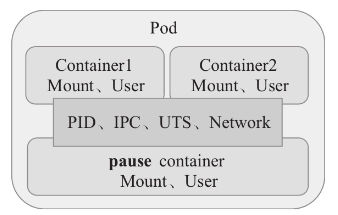

同一 Pod 中，这些共享 PID、IPC、Network 和 UTS 名称空间的容器彼此间可通过 IPC 通信，共享使用主机名和网络接口、IP 地址、端口和路由等各种网络资源，因而各容器进程能够通过 lo 网络接口通信且不能使用相同的网络套接字地址，一个 Pod 内通常仅应该运行具有**强耦合关系**的容器，例如，对于典型的传统三层应用来说，处理业务的服务器应用和数据库管理系统就应该分别组织在不同的 Pod 中。

Pod 本身并不能自愈，因工作节点故障或计算资源吃紧、管理需求以及 Pod 自身故障等，集群中的每个 Pod 都存在被删除的可能性，Kubernetes 可使用 **kubelet** 和**控制器**件来“复活”这种被弃用的 Pod 对象，并进行其他管理工作。因此，我们一般不应该手动创建这些“裸” Pod，而要**通过控制器对象，并借助于“Pod模板”来创建和管理**。

### 1.2 容器设计模式

基于容器的分布式系统中公有 3 类设计模式：

1. 单容器模式
2. 由强耦合容器协同共生的单节点模式（例如 Pod），即单节点多容器模式
3. 基于特定部署单元（Pod）实现分布式算法的多节点模式

这些容器设计模式也代表了它们可以在 Kubernetes 运行的模式，即于 Pod 中组织容器的机制。

#### 1.单容器模式

单容器模式就是指将应用程序封装为应用容器运行，每个容器仅承载一种工作负载。

#### 2.单节点多容器模式

单节点多容器模式是指跨容器的设计模式，其目的是在**单个主机之上同时运行多个共生关系的容器**，因而容器管理系统需要将它们作为一个原子单位进行统一调度。Kubernetes 编排系统设计的 Pod 概念就是这个设计模式的实现之一。若多个容器间存在强耦合关系，它们具有完全相同的生命周期，或者必须运行于同一节点之上时，通常应该将它们置于同一个 Pod 中，较常见的情况是为主容器并行运行一个助理式管理进程。单节点多容器模式的常见实现有 **Sidecar**（边车）、**适配器**（Adapter）、**大使**（Ambassador）、**初始化**（Initializer）容器模式等。

**（1）Sidecar 模式**

它由一个主应用程序（通常是 Web 应用程序）以及一个辅助容器（Sidecar 容器）组成，该辅助容器用于为主容器提供辅助服务以增强主容器的功能，最常见的 Sidecar 容器是日志记录服务、数据同步服务、配置服务和代理服务等。

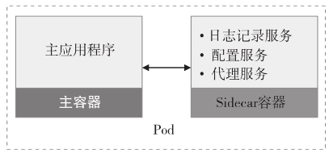

尽管完全可以将 Sidecar 容器集成到主容器内部，但是使用不同的容器来进行处理不同功能还是存在较多的优势：

- 辅助应用的运行时环境和编程语言与主应用程序无关
- 二者可基于 IPC、lo 接口或共享存储进行数据交换，不存在明显的通信延迟
- 将主应用与辅助应用划分为两个容器使得其可由不同团队开发和维护
- 容器限制了故障边界，使得系统整体可以优雅降级
- 容器是部署的基本单元，每个功能模块均可独立部署及回滚

**（2）大使模式**

它代表主容器发送网络请求至外部环境中，因此可以将其视作与客户端（主容器应用）位于同一位置的“外交官”。

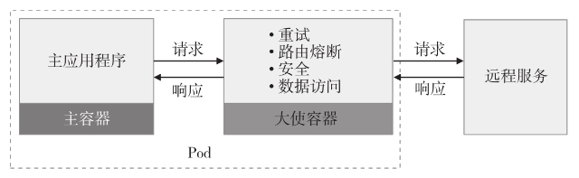

大使模式的最佳用例之一是提供对数据库的访问。实践中，开发环境、测试环境和生产环境中的主应用程序可能需要分别连接到不同的数据库服务。尽管使用环境变量可配置主容器应用完成此类功能，但更好的方案是让应用程序始终通过 localhost 连接至大使容器，而如何正确连接到目标数据的责任则由大使容器完成。

但是代理会增加网络开销并导致一定的延迟，因而对延迟敏感的应用应该仔细权衡模式的得失。

**（3）适配器模式**

适配器模式用于为主应用程序提供一致的接口，实现了模块重用，支持**标准化和规范化主容器应用程序的输出**以便于外部服务进行聚合。相比较来说，大使模式为内部容器提供了简化统一的外部服务视图，适配器模式则刚好反过来，它通过标准化容器的输出和接口，为外界展示了一个简化的应用视图。

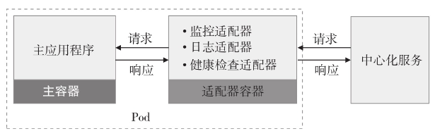

一个实际的例子就是借助于适配器容器确保系统内的所有容器**提供统一的监控接口**。尽管目前一些监控解决方案支持与多种类型的后端通信，但这种在监控系统内部置入与特定应用程序相关的代码却有违代码解耦及整洁性。

**（4）初始化容器模式**

初始化容器模式负责以不同于主容器的生命周期来完成那些必要的初始化任务，包括在文件系统上设置必要的特殊权限、数据库模式设置或为主应用程序提供初始数据等。但这些初始化逻辑无法包含在应用程序的镜像文件中，或者出于安全原因，应用程序镜像没有执行初始化活动的权限，再或者用户期望能延迟应用程序启动，直到外部环境满足其启动条件为止。

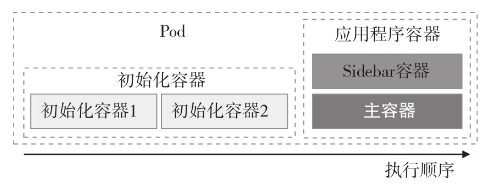

初始化容器可以不止一个，但它们需要以特定的顺序串行运行，并需要在启动应用程序容器之前成功终止。不过多个应用程序容器一般需要并行启动和运行。就 Kubernetes 来说，除了初始化容器之外，还有一些其他可用的初始化技术，例如 admission controllers、admission webhooks 和 PodPresets 等。

#### 3.多节点模式

多节点模式就是**将分布式应用的每个任务实例分布于多个节点**，分别以单节点模式运行，并以更高级的形式进行彼此通信和协同的更高级模式。这些任务可能依赖于外部的**协调机制**来确保各任务实例互不冲突，以避免导致争抢共享资源或者意外干扰其他实例正在执行的工作。

**（1）领导者选举模式**

若一个分布式应用支持同时运行某一任务的多个完全对等实例以提高服务可用性级别，但这些实例存在可写入的共享资源，或者支持将复杂计算分割为多个并行执行的任务实例并需要对结果进行聚合时，就**需要选举一个实例来充当领导者**以对其他下属任务实例的操作进行协调。

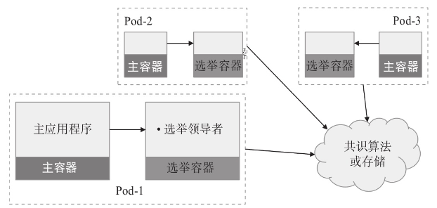

以 etcd、ZooKeeper 和 Consul 为代表的主流选举服务或存储系统业已相当成熟，但配套用于选举的代码库对特定业务领域的程序员来说通常难以掌握和正确使用，于是通过**为每个分布式应用程序的每个任务实例外挂一个选举容器**协同进行领导者选举便成了不错的解决方案。这些能够提供选举能力的容器可以由分布式协同领域的专业人员提供，相关代码编译一次之后该容器即可由各类编程语言的开发者所复用。

**（2）工作队列模式**

当某应用组件需要**将信息广播至大量订阅者**时，可能需要与多个独立开发的，可能使用了不同平台、编程语言和通信协议的应用程序或服务通信，并且无须订阅者实时响应地通信，此时工作队列模式将是较为适用的解决方案。

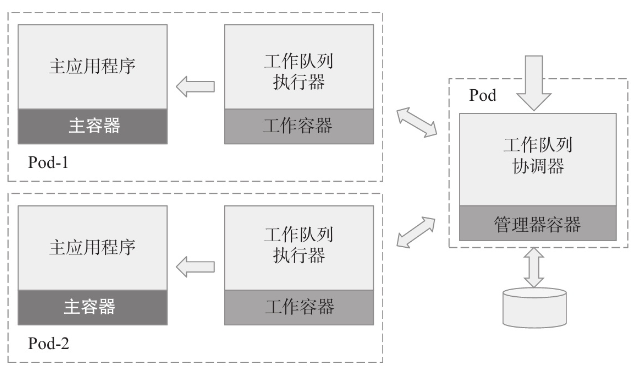

容器实现的接口支持开发人员便捷地创建出一个通用队列的容器，而后创建另一个**支持接受输入数据并将其转换为目标数据格式的容器**作为可重用框架容器，以便能够让主应用程序轻松使用工作队列。

**（3）分散/聚集**

分散/聚集模式与工作队列模式非常相似，它同样将大型任务拆分为较小的任务，区别是容器会立即将响应返回给用户，一个很好的例子是 **MapReduce 算法**。该模式需要两类组件：一个称为**根节点**或“父”节点的组件，将来自客户端的请求切分成多个小任务并分散到多个节点并行计算；另一类称为**计算节点**或“叶子”节点，每个节点负责运行一部分任务分片并返回结果数据，“根”节点收集这些结果数据并聚合为有意义的数据返回给客户端。

### 1.3 Pod的生命周期

Pod对象从创建开始至终止退出之间的时间称为其生命周期，Kubernetes 为 Pod 资源严格定义了 **5 种相位**，并将特定 Pod 对象的当前相位存储在其内部的子对象`PodStatus`的`phase`字段上，因而它总是应该处于其生命进程中以下几个相位之一。

- `Pending`：API Server 创建了 Pod 资源对象并已存入 etcd 中，但它尚未被调度完成，或仍处于从仓库中下载容器镜像的过程中
- `Running`：Pod 已经被调度至某节点，所有容器都已经被 kubelet 创建完成，且至少有一个容器处于启动、重启或运行过程中
- `Succeeded`：Pod 中的所有容器都已经成功终止且不会再重启
- `Failed`：所有容器都已经终止，但至少有一个容器终止失败，即容器以非 0 状态码退出或已经被系统终止
- `Unknown`：API Server 无法正常获取到 Pod 对象的状态信息，通常是由于其无法与所在工作节点的 kubelet 通信所致

需要注意的是，相位阶段仅是对 Pod 对象生命周期运行阶段的概括性描述，而**非 Pod 或内部容器状态的综合汇总**，因此 Pod 对象的`status`字段中的状态值未必一定是可用的相位，它也有可能是 Pod 的某个错误状态，例如 CrashLoopBackOff 或 Error 等。

Pod 资源的核心职责是**运行和维护称为主容器的应用程序容器**，在其整个生命周期之中的多种可选行为也是围绕更好地实现该功能而进行，如图所示。其中，初始化容器是常用的 Pod 环境初始化方式，健康状态检测（startupProbe、livenessProbe 和 readinessProbe）为编排工具提供了监测容器运行状态的编程接口，而事件钩子（preStop 和 postStart）则赋予了应用容器读取来自编排工具上自定义事件的机制。

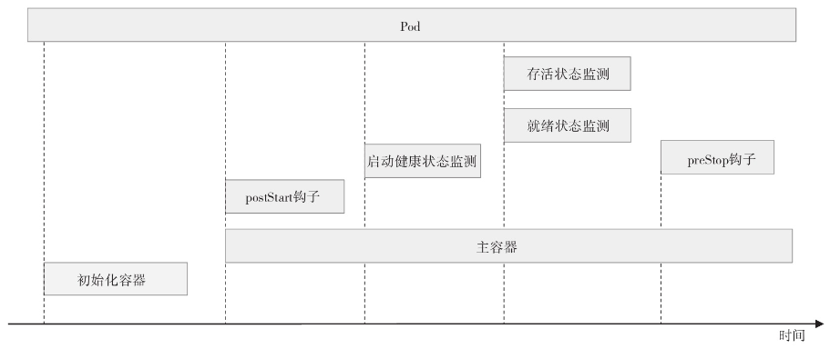

若用户给出了上述全部定义，则一个 Pod 对象生命周期的运行步骤如下。

1. 在启动包括初始化容器在内的任何容器之前先**创建 pause 基础容器**，它初始化 Pod 环境并为后续加入的容器提供共享的名称空间
2. 按顺序以串行方式运行用户定义的各个初始化容器进行 **Pod 环境初始化**；任何一个初始化容器运行失败都将导致 Pod 创建失败，并按其`restartPolicy`的策略进行处理，默认为重启
3. 待所有初始化容器成功完成后，**启动应用程序容器**，多容器 Pod 环境中，此步骤会并行启动所有应用容器，例如主容器和 Sidecar 容器，它们各自按其定义展开其生命周期；本步骤及后面的几个步骤都将以主容器为例进行说明；容器启动的那一刻会同时运行主容器上定义的`PostStart`钩子事件，该步骤失败将导致相关容器被重启
4. 运行容器启动**健康状态监测**（startupProbe），判定容器是否启动成功；该步骤失败，同样参照`restartPolicy`定义的策略进行处理；未定义时，默认状态为 Success
5. 容器启动成功后，定期进行**存活状态监测**（liveness）和**就绪状态监测**（readiness）；存活状态监测失败将导致容器重启，而就绪状态监测失败会使得该容器从其所属的 Service 对象的可用端点列表中移除
6. 终止 Pod 对象时，会先运行`preStop`钩子事件，并在宽限期（terminationGracePeriodSeconds）结束后终止主容器，==宽限期默认为 30 秒==

## 2.在Pod中运行应用

Pod资 源中可同时存在**初始化容器**、**应用容器**和**临时容器 **3 种类型的容器，不过创建并运行一个具体的 Pod 对象时**仅有应用容器是必选项**，并且可以仅为其定义单个容器。

### 2.1 单容器Pod资源

一个 Pod 对象的核心职责在于**以主容器形式运行单个应用**，因而定义 API 资源的关键配置就在于定义该容器，它以对象形式定义在 Pod 对象的`spec.containers`字段中，配置清单的基本格式如下：

```bash
apiVersion：v1
kind: Pod
metadata:
  name: …               # Pod的 标识名, 在名称空间中必须唯一
  namespace: …          # 可选字段，该 Pod 所属的名称空间, 省略时使用默认名称空间, 例如 default
spec:
  containers:           # 定义容器, 它是一个列表对象, 可包括多个容器的定义, 至少得有一个
  - name: …             # 必选字段, 容器名称, 在当前 Pod 中必须唯一
    image: …            # 可选字段，创建容器时使用的镜像
    imagePullPolicy: …  # 可选字段，容器镜像下载策略,
```

`image`虽为可选字段，这只是为方便更高级别的管理类资源（例如 Deployment 等）能覆盖它以实现某种高级管理功能而设置，对于**裸 Pod 来说并不能省略该字段**。下面是一个 Pod 资源清单示例文件，它仅指定了运行一个由`ikubernetes/demoapp:v1.0`镜像启动的主容器 demo，该 Pod 对象位于`default`名称空间。

```yaml
apiVersion: v1
kind: Pod
metadata:
  name: pod-demo
  namespace: default
spec:
  containers:
  - name: demo
    image: ikubernetes/demoapp:v1.0
    imagePullPolicy: IfNotPresent
```

把上面的内容保存于配置文件中，例如 pod-demo.yaml，随后即可使用`kubectl apply`或`kubectl create`命令进行资源对象创建，下面是相应的命令及响应结果。

```bash
root@VM-0-4-ubuntu:~# kubectl apply -f pod-demo.yaml 
pod/pod-demo created
```

该 Pod 对象由调度器绑定至特定工作节点后，由相应的 kubelet 负责创建和维护，实时状态也将同步给 API Server 并由其存储至 etcd 中。Pod 创建并尝试启动的过程中，可能会经历`Pending`、`ContainerCreating`、`Running`等多种不同的状态，若 Pod 可正常启动，则`kubectl get pods/POD`命令输出字段中的状态（STATUS）则显示为`Running`：

```bash
# 使用默认命名空间时可省略 -n default
root@VM-0-4-ubuntu:~# kubectl get pod/pod-demo
NAME       READY   STATUS    RESTARTS   AGE
pod-demo   1/1     Running   0          2m40s
```

镜像 demoapp 默认运行了一个 Web 服务程序，该服务监听 TCP 协议的 80 端口，镜像可通过 “/”、/hostname、/user-agent、/livez、/readyz 和 /configs 等路径服务于客户端的请求。例如，下面的命令先获取到 Pod 的 IP 地址，而后对其支持的 Web 资源路径`/`和`/user-agent`分别发出了一个访问请求：

```bash
root@VM-0-4-ubuntu:~# demoIP=$(kubectl get pods/pod-demo -o jsonpath={.status.podIP})
root@VM-0-4-ubuntu:~# curl -s http://$demoIP
iKubernetes demoapp v1.0 !! ClientIP: 10.244.0.0, ServerName: pod-demo, ServerIP: 10.244.1.12!
root@VM-0-4-ubuntu:~# curl -s http://$demoIP/user-agent
User-Agent: curl/7.81.0
```

Kubernetes 系统支持用户**自定义容器镜像文件的获取策略**，例如在网络资源较为紧张时可以禁止从仓库中获取镜像文件，或者不允许使用工作节点本地镜像等。容器的`imagePullPolicy`字段用于为其指定镜像获取策略，它的可用值包括如下几个：

- `Always`：每次启动 Pod 时都要从指定的仓库下载镜像
- `IfNotPresent`：仅本地镜像缺失时方才从目标仓库 wp 下载镜像
- `Never`：禁止从仓库下载镜像，仅使用本地镜像

对于标签为`latest`的镜像文件，其默认的镜像获取策略为`Always`，其他标签的镜像，默认策略则为`IfNotPresent`。需要注意的是，从私有仓库中下载镜像时通常需要事先到 Registry 服务器认证后才能进行。认证过程要么需要在相关节点上交互式执行`docker login`命令，要么将认证信息定义为专有的`Secret`资源，并配置 Pod 通过`imagePullSecretes`字段调用此认证信息完成。

**删除 Pod 对象**则使用`kubectl delete`命令。

- 命令式命令：`kubectl delete pods/NAME`
- 命令式对象配置：`kubectl delete -f FILENAME`

若删除后 Pod 一直处于`Terminating`状态，则可再一次执行删除命令，并同时使用`--force`和`--grace-period=0`选项进行强制删除。

### 2.2 获取Pod与容器状态

kubectl 有多个子命令，用于从不同角度显示对象的状态信息：

- `kubectl describe`：显示资源的详情，包括运行状态、事件等信息，但不同的资源类型输出内容不尽相同
- `kubectl logs`：查看 Pod 对象中容器输出到控制台的日志信息；当 Pod 中运行有多个容器时，需要使用选项`-c`指定容器名称
- `kubectl exec`：在 Pod 对象某容器内运行指定的程序，其功能类似于`docker exec`命令，可用于了解容器各方面的相关信息或执行必需的设定操作等，具体功能取决于容器内可用的程序

#### 1.打印Pod对象的状态

`kubectl describe pods/NAME -n NAMESPACE`命令可打印 Pod 对象的详细描述信息它会输出许多字段，不同的需求场景中，但`Priority`、`Status`、`Containers`和`Events`等字段通常是重点关注的目标字段。另外，也可以通过`kubectl get pods/POD -o yaml|json`命令的`status`字段来了解 Pod 的状态详情，它保存有 Pod 对象的当前状态。如下命令显示了 pod-demo 的状态信息。

```bash
root@VM-0-4-ubuntu:~# kubectl get pods/pod-demo -o yaml
status:
  conditions:
  - lastProbeTime: null
    lastTransitionTime: "2023-10-26T15:25:54Z"
    status: "True"
    type: Initialized
  - lastProbeTime: null
    lastTransitionTime: "2023-10-26T15:25:55Z"
    status: "True"
    type: Ready
  - lastProbeTime: null
    lastTransitionTime: "2023-10-26T15:25:55Z"
    status: "True"
    type: ContainersReady
  - lastProbeTime: null
    lastTransitionTime: "2023-10-26T15:25:54Z"
    status: "True"
    type: PodScheduled
……
  containerStatuses:   # 容器级别的状态信息
  - containerID: containerd://0033b6273945047fd60d82172901193846b3db14ca79f235a518e4745649be5c
    image: docker.io/ikubernetes/demoapp:v1.0
    imageID: docker.io/ikubernetes/demoapp@sha256:6698b205eb18fb0171398927f3a35fe27676c6bf5757ef57a35a4b055badf2c3
    lastState: {}      # 前一次的状态
    name: demo
    ready: true        # 是否已经就绪
    restartCount: 0    # 重启次数
    started: true      # 是否启动
    state:             # 当前状态
      running:
        startedAt: "2023-10-26T15:25:55Z"   # 启动时间
  hostIP: 10.0.0.16    # 节点 IP
  phase: Running       # Pod 当前的相位
  podIP: 10.244.1.13   # Pod 的主 IP 地址
  podIPs:              # Pod 上的所有 IP 地址
  - ip: 10.244.1.13
  qosClass: BestEffort # QoS 类别
  startTime: "2023-10-26T15:25:54Z"
```

上面的命令结果中，`conditions`字段是一个称为`PodConditions`的数组，它记录了 Pod 所处的“境况”或者“条件”，其中的每个数组元素都可能由如下 6 个字段组成。

- `lastProbeTime`：上次进行 Pod 探测时的时间戳
- `lastTransitionTime`：Pod 上次发生状态转换的时间戳
- `message`：上次状态转换相关的易读格式信息
- `reason`：上次状态转换原因，用驼峰格式的单个单词表示
- `status`：是否为状态信息，可取值有 True、False 和 Unknown
- `type`：境况的类型或名称，有 4 个固定值
  - `PodScheduled`表示已经与节点绑定
  - `Ready`表示已经就绪，可服务客户端请求
  - `Initialized`表示所有的初始化容器都已经成功启动
  - `ContainersReady`则表示所有容器均已就绪

另外，`containerStatuses`字段描述了 Pod 中各容器的相关状态信息。

#### 2.查看容器日志

规范化组织的应用容器一般仅运行单个应用程序，其日志信息均通过标准输出和标准错误输出直接打印至控制台，`kubectl logs POD [-c CONTAINER]`命令可直接获取并打印这些日志，若 Pod 对象中仅运行有一个容器，则可以省略`-c`选项及容器名称。

```bash
root@VM-0-4-ubuntu:~# kubectl logs pod-demo
 * Running on http://0.0.0.0:80/ (Press CTRL+C to quit)
10.244.0.0 - - [26/Oct/2023 15:36:10] "GET / HTTP/1.1" 200 -
```

日志查看命令仅能用于打印存在于 Kubernetes 系统上的 Pod 中容器的日志，对于已经删除的 Pod 对象其容器日志信息将无从获取。

#### 3.在容器中额外运行其他程序

`kubectl exec`可以让用户在 Pod 的某容器中运行用户所需要的任何存在于容器中的程序。一个便捷的使用接口是直接交互式运行容器中的某 shell 程序。例如，直接查看 Pod 中的容器运行的进程：

```bash
root@VM-0-4-ubuntu:~# kubectl exec pod-demo -- ps sux
PID   USER     TIME  COMMAND
    1 root      0:00 python3 /usr/local/bin/demo.py
    8 root      0:00 ps sux
```

还可使用`-it`选项并指定运行镜像中可用的 shell 程序就能进入交互式接口。

```bash
root@VM-0-4-ubuntu:~# kubectl exec -it pod-demo -- /bin/sh
[root@pod-demo /]# hostname
pod-demo
[root@pod-demo /]# netstat -tnl
Active Internet connections (only servers)
Proto Recv-Q Send-Q Local Address           Foreign Address         State       
tcp        0      0 0.0.0.0:80              0.0.0.0:*               LISTEN  
```

上述 3 个命令输出的信息对于了解应用运行状态，以及获取资源详细信息进行故障排除等有着非常重要的提示作用，因而也是 Kubernetes 用户**最为常用命令**。

### 2.3 自定义容器应用与参数

容器镜像启动容器时运行的默认应用程序由其 Dockerfile 文件中的`ENTRYPOINT`指令进行定义，传递给程序的参数则通过`CMD`指令设定，`ETRYPOINT`指令不存在时，`CMD`可同时指定程序及其参数。例如，要了解镜像`ikubernetes/demoapp:v1.0`中定义的`ENTRYPOINT`和`CMD`，可以在任何存在此镜像的节点上执行类似如下命令来获取：

```bash
~# docker inspect ikubernetes/demoapp:v1.0 -f {{.Config.Entrypoint}}
[/bin/sh -c python3 /usr/local/bin/demo.py]
~# docker inspect ikubernetes/demoapp:v1.0 -f {{.Config.Cmd}}
[]
```

Pod 配置中，`spec.containers[].command`字段可在容器上指定非镜像默认运行的应用程序，且可同时使用`spec.containers[].args`字段进行参数传递，它们将覆盖镜像中默认定义的参数。若定义了`args`字段，该字段值将作为参数传递给镜像中默认指定运行的应用程序；而仅定义了`command`字段时，其值将覆盖镜像中定义的程序及参数。

- 如果`command`和`args`均没有写，那么用 Dockerfile 的配置
- 如果`command`写了，但`args`没有写，那么 Dockerfile 默认的配置会被忽略，执行输入的`command`
- 如果`command`没写，但`args`写了，那么 Dockerfile 中配置的`ENTRYPOINT`的命令会被执行，使用当前`args`的参数
- 如果`command`和`args`都写了，那么 Dockerfile 的配置被忽略，执行`command`并追加上`args`参数

下面的资源配置清单把镜像`ikubernetes/demoapp:v1.0`的默认应用程序修改为`/bin/sh -c`，参数定义为`python3 /usr/local/bin/demo.py -p 8080`，其中的`-p`选项可修改服务监听的端口为指定的自定义端口。

```yaml
apiVersion: v1
kind: Pod
metadata:
  name: pod-demo-with-cmd-and-args
  namespace: default
spec:
  containers:
  - name: demo
    image: ikubernetes/demoapp:v1.0
    imagePullPolicy: IfNotPresent
    command: ['/bin/sh', '-c']
    args: ['python3 /usr/local/bin/demo.py -p 8080']
```

上面的配置相当于执行`/bin/sh -c python3 /usr/local/bin/demo.py -p 8080`下面将上述清单中定义的 Pod 对象创建到集群上，验证其监听的端口是否从默认的 80 变为了指定的 8080：

```bash
root@VM-0-4-ubuntu:~# kubectl exec pod-demo-with-cmd-and-args -- netstat -tnl
Active Internet connections (only servers)
Proto Recv-Q Send-Q Local Address           Foreign Address         State       
tcp        0      0 0.0.0.0:8080            0.0.0.0:*               LISTEN 
```

### 2.4 容器环境变量-value

非容器化的传统管理方式中，复杂应用程序的配置信息多数由配置文件进行指定；对于容器隔离出的环境中的应用程序更多的是采用**由环境变量在容器启动时传递配置信息**。

> **注意**
> 这种方式需要应用程序支持通过环境变量进行配置，否则用户要在制作 Docker 镜像时通过`entrypoint`脚本完成环境变量到程序配置文件的同步。

向 Pod 对象中容器环境变量传递数据的方法有两种：`env`和`envFrom`，这里重点介绍第一种方式，第二种方式将在介绍`ConfigMap`和`Secret`资源时进行说明。

通过环境变量的配置容器化应用时，需要在容器配置段中嵌套使用`env`字段，它的值是一个由环境变量构成的列表。每个环境变量通常由`name`和`value`字段构成。

- `name <string>`：环境变量的名称，必选字段
- `value <string>`：传递给环境变量的值，通过`$(VAR_NAME)`引用，逃逸格式为`$$(VAR_NAME)`（表示字符串 "`$(VAR_NAME)`" 时使用），默认值为空

示例中使用镜像 demoapp 中的应用服务器支持通过 HOST 与 PORT 环境变量分别获取监听的地址和端口，它们的默认值分别为 0.0.0.0 和 80，下面的配置保存在清单文件 pod-using-env.yaml 中，它分别为 HOST 和 PORT 两个环境变量传递了一个不同的值，以改变容器监听的地址和端口。

```yaml
apiVersion: v1
kind: Pod
metadata:
  name: pod-using-env
  namespace: default
spec:
  containers:
  - name: demo
    image: ikubernetes/demoapp:v1.0
    imagePullPolicy: IfNotPresent
    env:
    - name: HOST
      value: "127.0.0.1"
    - name: PORT
      value: "8080"
```

下面将清单文件中定义的 Pod 对象创建至集群中，并查看应用程序监听的地址和端口来验证配置结果：

```bash
root@VM-0-4-ubuntu:~# kubectl apply -f pod-using-env.yaml 
pod/pod-using-env created
root@VM-0-4-ubuntu:~# kubectl exec pod-using-env -- netstat -tnl
Active Internet connections (only servers)
Proto Recv-Q Send-Q Local Address           Foreign Address         State       
tcp        0      0 127.0.0.1:8080          0.0.0.0:*               LISTEN  
```

传递给容器的环境变量都会直接注入容器的 shell 环境中，使用`printenv`一类的命令就能在容器中获取到所有环境变量的列表。

### 2.5 Pod的创建与删除

下图描述了一个 Pod 资源对象的典型创建过程。

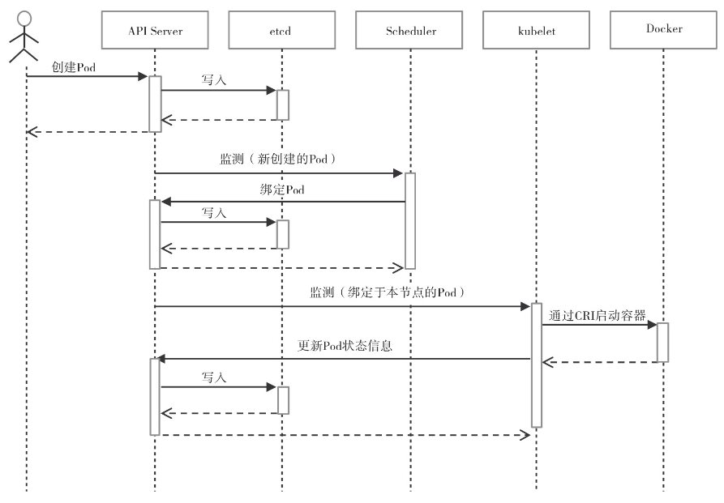

- 用户通过 kubectl 或其他 API 客户端提交 Pod Spec 给 API Server
- API Server 尝试着将 Pod 对象的相关信息存入 etcd 中，待写入操作执行完成，API Server 即会返回确认信息至客户端
- Scheduler（调度器）通过其 watcher 监测到 API Server 创建了新的 Pod 对象，于是为该 Pod 对象挑选一个工作节点并将结果信息更新至 API Server
- 调度结果信息由 API Server 更新至 etcd 存储系统，并同步给 Scheduler
- 相应节点的 kubelet 监测到由调度器绑定于本节点的 Pod 后会读取其配置信息，并由本地容器运行时创建相应的容器启动 Pod 对象后将结果回存至 API Server
- API Server 将 kubelet 发来的 Pod 状态信息存入 etcd 系统，并将确认信息发送至相应的 kubelet

Pod 的终止过程如下图所示。

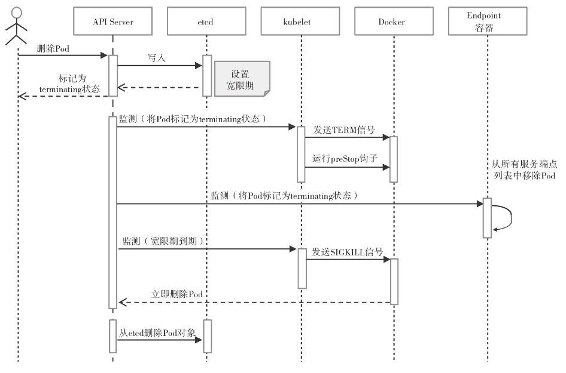

- 用户发送删除 Pod 对象的命令

- API 服务器中的 Pod 对象会随着时间的推移而更新，在宽限期内（默认为 30 秒），Pod 被视为 dead

- 将 Pod 标记为`Terminating`状态

  kubelet 在监控到 Pod 对象转为`Terminating`状态的同时启动 Pod 关闭过程

  端点控制器监控到 Pod 对象的关闭行为时将其从所有匹配到此端点的 Service 资源的端点列表中移除

- 如果当前 Pod 对象定义了 preStop 钩子句柄，在其标记为`terminating`后即会以同步方式启动执行；如若宽限期结束后，preStop 仍未执行完，则重新执行第 2 步并额外获取一个时长为 2 秒的小宽限期

- Pod 对象中的容器进程收到 TERM 信号

- 宽限期结束后，若存在任何一个仍在运行的进程，Pod 对象即会收到 SIGKILL 信号

- Kubelet 请求 API Server 将此 Pod 资源的宽限期设置为 0 从而完成删除操作，它变得对用户不再可见

默认情况下，所有删除操作的宽限期都是 30 秒，不过`kubectl delete`命令可以使用`--grace-period=<seconds>`选项自定义其时长，使用0值则表示直接强制删除指定的资源，不过此时需要同时为命令使用`--force`选项。

## 3.暴露容器服务

Pod 对象的 IP 地址**仅在集群内可达**，它们无法直接接收来自集群外部客户端的请求流量。不考虑通过 Service 资源进行服务暴露的情况下，服务于集群外部的客户端的常用方式有两种：

1. 在其运行的节点上进行端口映射，由节点 IP 和选定的协议端口向 Pod 内的应用容器进行 DNAT 转发
2. 另一种是让 Pod 共享其所在的工作节点的网络名称空间，应用进程将直接监听工作节点 IP 地址和协议端口

### 3.1  容器端口映射

在 Kubernetes 系统的网络模型中各 Pod 的 IP 地址处于同一网络平面，**无论是否为容器指定了要暴露的端口（containerPort）都不会影响集群中其他节点之上的 Pod 客户端对其进行访问**，这意味着，任何在非本地回环接口 lo 上监听的端口都可直接通过 Pod 网络被请求。从这个角度来说，**容器端口只是信息性数据**，它仅为集群用户提供了一个快速了解相关 Pod 对象的可访问端口的途径，但显式指定容器的服务端口可额外为其赋予一个名称以方便按名称调用。

定义容器端口的`ports`字段的值是一个列表，由一到多个端口对象组成，它的常用嵌套字段有如下几个：

- `containerPort <integer>`：必选字段，指定在 Pod 对象的 IP 地址上暴露的容器端口，有效范围为`(0,65536)`；使用时需要指定为容器应用程序需要监听的端口
- `name <string>`：当前端口的名称标识，必须符合 IANA_SVC_NAME 规范且在当前 Pod 内要具有唯一性；此端口名**可被 Service 资源按名调用**
- `protocol <string>`：端口相关的协议，其值仅支持 TCP、SCTP 或 UDP 三者之一，默认为 TCP

需要借助于 Pod 所在节点将容器服务暴露至集群外部时，还需要使用`hostIP`与`hostPort`两个字段来指定占用的工作节点地址和端口，**否则`ports`只起到定义端口名的作用**，不会映射到所在节点。如图所示的 Pod A 与 Pod C 可分别通过各自所在节点上指定的`hostIP`和`hostPort`服务于客户端请求。


- `spec.containers.ports.hostPort <integer>`：主机端口，它将接收到的请求通过 NAT 机制转发至由`container-Port`字段指定的容器端口
- `spec.containers.ports.hostIP <string>`：主机端口要绑定的主机 IP，默认为主机之上所有可用的 IP 地址；该字段通常使用默认值

下面的资源配置清单示例中定义的 demo 容器指定了要暴露容器上 TCP 协议的 80 端口，并将之命名为 http，该容器可通过工作节点的 10080 端口接入集群外部客户端的请求。

```yaml
apiVersion: v1
kind: Pod
metadata:
  name: pod-using-hostport
  namespace: default
spec:
  containers:
  - name: demo
    image: ikubernetes/demoapp:v1.0
    imagePullPolicy: IfNotPresent
    ports:
    - name: http
      containerPort: 80
      protocol: TCP
      hostPort: 30080
```

在集群中创建配置清单中定义的 Pod 对象后，需**获取其被调度至的目标节点**，而后从集群外部向该节点的 10080 端口发起 Web 请求进行访问测试：

```bash
root@VM-0-4-ubuntu:~# kubectl describe pods/pod-using-hostport | grep '^Node:'
Node:             vm-0-16-ubuntu/10.0.0.16
root@VM-0-4-ubuntu:~# curl 10.0.0.16:30080
iKubernetes demoapp v1.0 !! ClientIP: 10.0.0.4, ServerName: pod-using-hostport, ServerIP: 10.244.1.19!
```

> **注意**
>
> `hostPort`与`NodePort`类型的 Service 对象暴露端口的方式不同，NodePort 可以通过**所有节点**暴露容器服务，而`hostPort`则只能能经由 **Pod 对象所在节点的 IP 地址**进行。但 Pod 对象绑定的工作节点都由调度器根据其调度机制确定，除非人为地指示调度器将其绑定到指定的工作节点。

### 3.2 配置Pod使用节点网络 

同一个 Pod 对象的各容器运行于一个独立、隔离的 Network、UTS 和 IPC 名称空间中，共享同一个网络协议栈及相关的网络设备，但也有些特殊的 Pod 对象需要运行于所在节点的名称空间中，执行系统级的管理任务（例如查看和操作节点的网络资源甚至是网络设备等），或借助节点网络资源向集群外客户端提供服务等，例如由 kubeadm 部署的 Kubernetes 集群中的 kube-apiserver、kube-controller-manager、kube-scheduler，以及 kube-proxy 和 kube-flannel 等通常都是第二种类型的 Pod 对象。

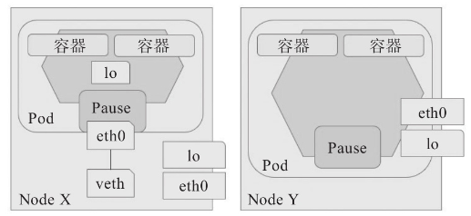

用户配置的 Pod 对象，仅需要设置其`spec.hostNetwork`的属性为`true`即可创建共享节点网络名称空间的 Pod 对象。

```yaml
apiVersion: v1
kind: Pod
metadata:
  name: pod-using-hostnetwork
  namespace: default
spec:
  containers:
  - name: demo
    image: ikubernetes/demoapp:v1.0
    imagePullPolicy: IfNotPresent
  hostNetwork: true
```

查看主机名称或网络接口的相关属性信息以验证它是否能共享使用工作节点的网络名称空间。

```bash
root@VM-0-4-ubuntu:~# kubectl apply -f pod-using-hostnetwork.yaml 
pod/pod-using-hostnetwork created
root@VM-0-4-ubuntu:~# kubectl exec pod-using-hostnetwork -- hostname
VM-0-16-ubuntu
```

结果显示出节点的主机名称，表示该 Pod 已然共享了其所在节点的 UTS 名称空间，以及 Network 和 IPC 名称空间。这意味着，Pod 对象中运行容器化应用可在其所在的工作节点的 IP 地址之上监听，这可以通过直接向所在节点发起请求来验证。

```bash
root@VM-0-4-ubuntu:~# curl 10.0.0.16
iKubernetes demoapp v1.0 !! ClientIP: 10.0.0.4, ServerName: VM-0-16-ubuntu, ServerIP: 127.0.1.1!
```

与容器端口映射存在的同样问题是，用户**无法事先预知 Pod 对象会调度至哪个节点**，除非事先指示调度器将 Pod 绑定至固定的目标节点之上。

## 4.容器安全上下文

尽管容器技术提供了强大的软件级别的资源隔离功能，但共享内核机制导致其遭受到内部攻击，容器运行时通常为管理员提供了许多**与安全相关的可配置选项**，例如可使用的系统调用集与是否可运行为特权模式（具有访问主机设备的权限）等，管理员需要根据这些选项与容器的实际运行需求来精心组织和设定容器的运行时选项以降低安全风险。

Kubernetes 为安全运行 Pod 及容器运行设计了**安全上下文机制**，该机制允许用户和管理员定义 Pod 或容器的特权与访问控制，以配置容器与主机以及主机之上的其他容器间的隔离级别。安全上下文就是一组用来决定**容器是如何创建和运行的约束条件**，这些条件代表创建和运行容器时使用的运行时参数。需要提升容器权限时，用户通常只应授予容器执行其工作所需的访问权限，以**最小权限法则**来抑制容器对基础架构及其他容器产生的负面影响。

Kubernetes 支持用户在 Pod 及容器级别配置安全上下文，并允许管理员通过 Pod 安全策略在集群全局级别限制用户在创建和运行 Pod 时可设定的安全上下文。Pod和容器的安全上下文设置包括以下几个方面：

- 自主访问控制（DAC）：传统 UNIX 的访问控制机制，它允许对象（OS 级别，例如文件等）的所有者基于 UID 和 GID 设定对象的访问权限
- Linux 功能：Linux 为突破系统上传统的两级用户（root 和普通用户）授权模型，而将内核管理权限打散成多个不同维度或级别的权限子集，每个子集称为一种“功能”或“能力”，例如 CAP_NET_ADMIN、CAP_SYS_TIME、CAP_SYS_PTRACE 和 CAP_SYS_ADMIN 等，从而允许进程仅具有一部分内核管理功能就能完成必要的管理任务
- seccomp：全称为 secure computing mode，是 Linux 内核的安全模型，用于为默认可发起的任何系统调用进程施加控制机制，人为地禁止它能够发起的系统调用，有效降低了程序被劫持时的危害级别
- AppArmor：全称为 Application Armor，意为“应用盔甲”，是 Linux 内核的一个安全模块，通过加载到内核的配置文件来定义对程序的约束与控制
- SELinux：全称为 Security-Enhanced Linux，意为安全加强的 Linux，是 Linux 内核的一个安全模块，提供了包括强制访问控制在内的访问控制安全策略机制
- Privileged 模式：即特权模式容器，该模式下容器中的 root 用户拥有所有的内核功能，即具有真正的管理员权限，它能看到主机上的所有设备，能够挂载文件系统，甚至可以在容器中运行容器；**容器默认运行于非特权（unprivileged）模式**
- AllowPrivilegeEscalation：控制是否允许特权升级，即进程是否能够获取比父进程更多的特权；运行于特权模式或具有 CAP_SYS_ADMIN 能力的容器默认允许特权升级

这些安全上下文相关的特性多数嵌套定义在 Pod 或容器的`securityContext`字段中，而且有些特性对应的嵌套字段还不止一个。而 seccomp 和 AppArmor 的安全上下文则需要以资源注解的方式进行定义，而且仅能由管理员在集群级别进行 Pod 安全策略配置。

### 4.1 配置格式速览

```yaml
apiVersion: v1
kind: Pod
metadata:
  ...
spec:
  securityContext:                         # Pod 级别的安全上下文, 对内部所有容器均有效
    runAsUser <integer>                    # 以指定的用户身份运行容器进程, 默认由镜像中的 USER 指定
    runAsGroup <integer>                   # 以指定的用户组运行容器进程, 默认使用的组随容器运行时设定
    supplementalGroups <[]integer>         # 为容器中 1 号进程的用户添加的附加组
    fsGroup <integer>                      # 为容器中的 1 号进程附加一个专用组, 其功能类似于 sgid
    runAsNonRoot <boolean>                 # 是否以非 root 身份运行
    seLinuxOptions <Object>                # SELinux 的相关配置
    sysctls <[]Object>                     # 应用到当前 Pod 名称空间级别的 sysctl 参数设置列表
    windowsOptions <Object>                # Windows 容器专用的设置
  containers:
  - name:
    image:
    securityContext:                       # 容器级别的安全上下文, 仅在当前容器生效
      runAsUser <integer>                  # 以指定的用户身份运行容器进程
      runAsGroup <integer>                 # 以指定的用户组运行容器进程
      runAsNonRoot <boolean>               # 是否以非 root 身份运行
      allowPrivilegeEscalation <boolean>   # 是否允许特权升级
      capabilities <Object>                # 为当前容器添加或删除内核能力
        add <[]string>                     # 添加由列表定义的各内核能力
        drop <[]string>                    # 移除由列表定义的各内核能力
      privileged <boolean>                 # 是否运行为特权容器
      procMount <string>                   # 设置容器的 procMount 类型, 默认为 DefaultProcMount
      readOnlyRootFilesystem <boolean>     # 是否将根文件系统设置为只读模式
      seLinuxOptions <Object>              # SELinux 的相关配置
      windowsOptions <Object>              # Windows 容器专用的设置
```

Kubernetes 默认以**非特权模式**创建并运行容器，同时**禁用了其他与管理功能相关的内核能力**，但未额外设定其他上下文参数。

### 4.2 管理运行身份

制作 Docker 镜像时，Dockerfile 支持以`USER`指令明确指定运行应用进程时的用户身份。对于未通过`USER`指令显式定义运行身份的镜像，创建和启动容器时，其进程的**默认用户身份为容器中的 root 用户和 root 组**，该用户有着其他一些附加的系统用户组，例如 sys、daemon、wheel 和 bin 等。然而，有些应用程序的进程需要以特定的专用用户身份运行，或者以指定的用户身份运行时才能获得更好的安全特性，这种需求可以在 Pod 或容器级别的安全上下文中使用`runAsUser`得以解决，必要时可同时使用`runAsGroup`设置进程的组身份。

下面的资源清单配置以 1001 这个 UID 和 GID 的身份来运行容器中的 demoapp 应用，考虑到非特权用户默认无法使用 1024 以下的端口号，文件中通过环境变量改变了应用监听的端口。

```yaml
apiVersion: v1
kind: Pod
metadata:
  name: securitycontext-runasuer-demo
  namespace: default
spec:
  securityContext:
      runAsUser: 1001
      runAsGroup: 1001
  containers:
  - name: demo
    image: ikubernetes/demoapp:v1.0
    imagePullPolicy: IfNotPresent
    env:
    - name: PORT
      value: "8080"
```

下面的命令先将配置清单中定义的 Pod 对象创建到集群上，随后的两条命令验证了容器用户身份确为配置中预设的 UID 和 GID。

```bash
root@VM-0-4-ubuntu:~# kubectl apply -f securitycontext-runasuer-demo.yaml 
pod/securitycontext-runasuer-demo created
root@VM-0-4-ubuntu:~# kubectl exec securitycontext-runasuer-demo -- id
uid=1001 gid=1001 groups=1001
root@VM-0-4-ubuntu:~# kubectl exec securitycontext-runasuer-demo -- ps aux
PID   USER     TIME  COMMAND
    1 1001      0:00 python3 /usr/local/bin/demo.py
   14 1001      0:00 ps aux
```

若有必要，我们还可在上面的配置清单中的安全上下文定义中，同时使用`supplement-Groups`选项定义主进程用户的**其他附加用户组**，这对于有着复杂权限模型的应用是一个非常有用的选项。另外，若运行容器时使用的镜像文件中已经使用`USER`指令指定了非 root 用户的运行身份，我们也可以在安全上下文中使用`runAsNonRoot`参数定义容器必须使用指定的非 root 用户身份运行，而无须使用`runAsUser`参数额外指定用户。

### 4.3 管理容器内核

传统 UNIX 仅实现了**特权**和**非特权**两类进程，前者是指以 0 号 UID 身份运行的进程，而后者则是从属非 0 号 UID 用户的进程。Linux 内核从 2.2 版开始将附加于超级用户的权限分割为多个独立单元，这些单元是线程级别的，它们可配置在每个线程之上，为其赋予特定的管理能力。Linux 内核常用的功能包括但不限于如下这些。

- `CAP_CHOWN`：改变文件的 UID 和 GID
- `CAP_MKNOD`：借助系统调用`mknod()`创建设备文件
- `CAP_NET_ADMIN`：网络管理相关的操作，可用于管理网络接口、netfilter 上的 iptables 规则、路由表、透明代理、TOS、清空驱动统计数据、设置混杂模式和启用多播功能等
- `CAP_NET_BIND_SERVICE`：绑定小于 1024 的特权端口，但该功能在重新映射用户后可能会失效
- `CAP_NET_RAW`：使用 RAW 或 PACKET 类型的套接字，并可绑定任何地址进行透明代理
- `CAP_SYS_ADMIN`：支持内核上的很大一部分管理功能
- `CAP_SYS_BOOT`：重启系统
- `CAP_SYS_CHROOT`：使用`chroot()`进行根文件系统切换，并能够调用`setns()`修改 Mount 名称空间
- `CAP_SYS_MODULE`：装载内核模块
- `CAP_SYS_TIME`：设定系统时钟和硬件时钟
- `CAP_SYSLOG`：调用`syslog()`执行日志相关的特权操作等

为 Kubernetes 上运行的进程设定内核功能则需要在 Pod 内容器上的安全上下文中嵌套`capabilities`字段，添加和移除内核能力还需要分别在下一级嵌套中使用`add`或`drop`字段。这两个字段可接受以内核能力名称为列表项，但引用各内核能力名称时需移除`CAP_`前缀，例如可使用`NET_ADMIN`和`NET_BIND_SERVICE`这样的功能名称。

下面的配置清单中定义的 Pod 对象的 demo 容器，在安全上下文中启用了内核功能`NET_ADMIN`，并禁用了`CHOWN`。demo 容器的镜像未定义`USER`指令，它将默认以 root 用户的身份运行容器应用。

```yaml
apiVersion: v1
kind: Pod
metadata:
  name: securitycontext-capabilities-demo
  namespace: default
spec:
  containers:
  - name: demo
    image: ikubernetes/demoapp:v1.0
    imagePullPolicy: IfNotPresent
    command: ["/bin/sh", "-c"]
    args: ["/sbin/iptables -t nat -A PREROUTING -p tcp --dport 8080 -j REDIRECT --to-port 80 && /usr/bin/python3 /usr/local/bin/demo.py"]
    securityContext:
      capabilities:
        add: ['NET_ADMIN']
        drop: ['CHOWN']
```

**容器中的 root 用户将默认映射为系统上的普通用户**，它实际上**并不具有管理网络接口、iptables 规则和路由表等相关的权限**，但内核功能`NET_ADMIN`可以为其开放此类权限。但容器中的 root 用户默认就具有修改容器文件系统上的文件从属关系的能力，而禁用`CHOWN`功能则关闭了这种操作权限。而后，检查 Pod 网络名称空间中 netfilter 之上的规则，清单中的 iptables 命令添加的规则位于 NAT 表的 PREROUTING 链上。下面的命令结果表示 iptables 命令已然生成的规则，`NET_ADMIN`功能启用成功。

```bash
root@VM-0-4-ubuntu:~# kubectl apply -f securitycontext-capabilities-demo.yaml 
pod/securitycontext-capabilities-demo created
root@VM-0-4-ubuntu:~# kubectl exec securitycontext-capabilities-demo -- iptables -t nat -nL PREROUTING
Chain PREROUTING (policy ACCEPT)
target     prot opt source               destination         
REDIRECT   tcp  --  0.0.0.0/0            0.0.0.0/0            tcp dpt:8080 redir ports 80
```

下面用于检查 demo 容器中的 root 用户是否能够修改容器文件系统上文件的属主和属组的命令结果表示，其`CHOWN`功能已然成功关闭。

```bash
root@VM-0-4-ubuntu:~# kubectl exec securitycontext-capabilities-demo -- chown 200.200 /etc/hosts
chown: /etc/hosts: Operation not permitted
command terminated with exit code 1
```

注意`SYS_ADMIN`功能拥有内核中的许多管理权限，出于安全方面的考虑，用户应该基于最小权限法则组合使用内核功能完成容器运行。

### 4.4 特权模式容器

相较于内核功能，`SYS_ADMIN`赋予了进程很大一部分的系统级管理功能，**特权（privileged）容器**几乎将宿主机内核的完整权限全部开放给了容器进程，它提供的是**远超`SYS_ADMIN`的授权**，包括写操作到`/proc`和`/sys`目录以及管理硬件设备等，因而仅应该用到基础架构类的系统级管理容器之上。例如，使用 kubeadm 部署的集群中，kube-proxy 中的容器就运行于特权模式。

> **提示**
> 我们可以将特权容器理解为**拥有宿主机 root 用户权限**的容器，这显然严重违背了容器的隔离原则。

下面的第一个命令从 kube-system 名称空间中取出一个 kube-proxy 相关的 Pod 对象名称，第二个命令则用于打印该 Pod 对象的配置清单。

```bash
root@VM-0-4-ubuntu:~# pod_name=$(kubectl get pods -l k8s-app=kube-proxy -n kube-system -o jsonpath={.items[0].metadata.name})
root@VM-0-4-ubuntu:~# kubectl get pods $pod-name -n kube-system -o yaml
# 从命令结果中截取的启动容器应用的命令及传递的参数
containers:
- command:
  - /usr/local/bin/kube-proxy
  - --config=/var/lib/kube-proxy/config.conf
  - --hostname-override=$(NODE_NAME)
  image: ……
  imagePullPolicy: IfNotPresent
  name: kube-proxy
  resources: {}
  securityContext:
    privileged: true
```

最后两行是定义特权容器的格式，唯一用到的`privileged`字段只能**嵌套在容器的安全上下文中**，它使用布尔型值，`true`表示启用特权容器机制。

### 4.5 在Pod上使用sysctl

Linux 系统上的`sysctl`接口允许**在运行时修改内核参数**，管理员可通过`/proc/sys/`下的虚拟文件系统接口来修改或查询这些与内核、网络、虚拟内存或设备等各子系统相关的参数。Kubernetes 也允许在 Pod 上独立安全地设置支持名称空间级别的内核参数，它们默认处于启用状态，而节点级别内核参数则被认为是不安全的，它们默认处于禁用状态。截至目前，仅`kernel.shm_rmid_forced`、`net.ipv4.ip_local_port_range`和`net.ipv4.tcp_syncookies`这 3 个内核参数被 Kubernetes 视为安全参数，它们可在 Pod 安全上下文的`sysctl`参数内嵌套使用，而余下的绝大多数的内核参数都是非安全参数，需要管理员手动在每个节点上通过 kubelet 选项逐个启用后才能配置到 Pod 上。例如，在各工作节点上编辑`/etc/default/kubelet`文件，添加如下内容以允许在 Pod 上使用指定的两个非安全的内核参数，并重启 kubelet 服务使之生效。

```bash
KUBELET_EXTRA_ARGS='--allowed-unsafe-sysctls=net.core.somaxconn,net.ipv4.ip_unprivileged_port_start'
```

`net.core.somaxconn`参数定义了系统级别入站连接队列最大长度，默认值是 128；而`net.ipv4.ip_unprivileged_port_start`参数定义的是**非特权用户**（root 是容器的特权用户）可以使用的内核端口起始值，默认为 1024，它限制了非特权用户所能够使用的端口范围。

下面配置清单中定义的 Pod 对象在安全上下文中通过`sysctls`字段嵌套使用了一个安全的内核参数`kernel.shm_rmid_forced`，以及一个已经启用的非安全内核参数`net.ipv4.ip_unprivileged_port_start`，它将该非安全内核参数的值设置为 0 来允许非特权用户使用 1024 以内端口的权限。

```yaml
apiVersion: v1
kind: Pod
metadata:
  name: securitycontext-sysctls-demo
  namespace: default
spec:
  securityContext:
    sysctls:
    - name: kernel.shm_rmid_forced
      value: "0"
      - name: net.ipv4.ip_unprivileged_port_start
      value: "0"
  containers:
  - name: demo
    image: ikubernetes/demoapp:v1.0
    imagePullPolicy: IfNotPresent
    securityContext:
      runAsUser: 1001
      runAsGroup: 1001
```

尽管上面配置清单设定了以非特权用户 1001 的身份运行容器应用，但受上面内核参数的影响，非管理员用户也具有了监听 80 端口的权限，因而不会遇到无法监听特权端口的情形。

```bash
root@VM-0-4-ubuntu:~# kubectl apply -f securitycontext-sysctls-demo.yaml 
pod/securitycontext-sysctls-demo created
```

下面的命令结果显示，以普通用户身份运行的 demo 容器成功监听了 TCP 协议的 80 端口。

```bash
root@VM-0-4-ubuntu:~# kubectl exec securitycontext-sysctls-demo -- netstat -tnlp
Active Internet connections (only servers)
Proto Recv-Q Send-Q Local Address  Foreign Address    State   PID/Program name    
tcp        0      0 0.0.0.0:80        0.0.0.0:*      LISTEN    1/python3
```

在 Pod 对象之上启用非安全内核参数，其配置结果可能会存在无法预料的结果，在正式使用之前一定要经过充分测试。例如，在某一 Pod 之上同时配置启用前面示例的两个非安全内核参数可能存在生效结果异常的情况。设置特权容器和添加内核功能等，以及在 Pod 上共享宿主机的 Network 和 PID 名称空间等，对于多项目或多团队共享的 Kubernetes 集群存在着不小的安全隐患，这就要求管理员应该在集群级别使用 Pod 安全策略（PodSecurityPolicy）。

## 5.容器应用的管理接口

任何为运行于云原生环境而开发的应用程序都应该为运行时环境提供**监测自身运行状态**的 API，并支持通过生命周期管理 API 接收平台的管理事件，这是以统一方式自动化容器更新及生命周期的基本要求和先决条件。

### 5.1 健康状态检测接口

监测容器自身运行的 API 包括分别用于健康状态检测、指标、分布式跟踪和日志等实现类型，即便没有完全实现，至少容器化应用也应该提供用于健康状态检测（liveness 和 readiness）的 API，以便编排系统能更准确地判定应用程序的运行状态。

Kubelet 仅能在控制循环中根据容器主进程的运行状态来判断其健康与否，主进程以非 0 状态码退出代表处于不健康状态，其他均为正常状态。然而，有些异常场景中，仍处于运行状态的进程内部的业务处理机制可能已然处于**僵死状态**或**陷入死循环**等，无法正常处理业务请求，对于这种状态的判断便要依赖应用自身专用于**健康状态监测的接口**。

**存活状态**（liveness）检测用于定期检测容器是否正常运行，**就绪状态**（readiness）检测用于定期检测容器是否可以接收流量，它们能够通过减少运维问题和提高服务质量来使服务更健壮和更具弹性。Kubernetes 在 Pod 内部的容器资源上提供了`livenessProbe`和`readinessProbe`两个字段，分别让用户自定义容器应用的存活状态和就绪状态检测。对于合格的云原生应用，它们可**调用容器应用自身定义的相应 API** 完成，而对于不具该类 API 的传统应用程序，用户也可精心设置一个更能反映其相应状态的系统命令或服务请求完成该功能。

- 存活状态检测：用于判定容器是否处于“运行”状态；若此类检测未通过，kubelet 将杀死容器并根据其`restartPolicy`决定是否将其重启；未定义存活性检测的容器的默认状态为 Success
- 就绪状态检测：用于判断容器是否准备就绪并可对外提供服务；未通过该检测时，端点控制器（例如 Service 对象）会将其 IP 地址从所有匹配到此 Pod 对象的 Service 对象的端点列表中移除；检测通过之后，会再次将其 IP 添加至端点列表中；未定义就绪状态检测的容器的默认状态为 Success

**容器探测**是 Pod 对象生命周期中的一项重要日常任务，它由 kubelet 周期性执行。kubelet 可在活动容器上分别执行由用户定义的**启动状态检测**（startupProbe）、**存活状态检测**（livenessProbe）和**就绪状态检测**（readinessProbe），定义在容器上的存活状态和就绪状态操作称为**检测探针**，它要通过容器的句柄（handler）进行定义。Kubernetes 定义了用于容器探测的 3 种句柄。

- `ExecAction`：通过在容器中执行一个命令并根据其返回的状态码进行的诊断操作称为 Exec 探测，状态码为 0 表示成功，否则即为不健康状态
- `TCPSocketAction`：通过与容器的某 TCP 端口尝试建立连接进行诊断，端口能够成功打开即为正常状态，否则为不健康状态
- `HTTPGetAction`：通过向容器 IP 地址的某指定端口的指定 path 发起 http GET 请求进行诊断，响应码为`2xx`或`3xx`即为成功，否则为失败

上面的每种探测方式都可能存在 3 种返回结果：Success（成功）、Failure（失败）或 Unknown（未知），仅第一种结果表示成功通过检测。

另外，Kubernetes 自 v1.16 版本起还支持**启动状态**（startup）检测。将传统模式开发的大型应用程序迁移至容器编排平台运行时，可能需要相当长的时间进行启动后的初始化，但其初始过程是否正确完成的检测机制和探测参数都可能有别于存活状态检测，例如需要更长的间隔周期和更高的错误阈值等。该类检测的结果处理机制与存活状态检测相同，检测失败时 kubelet 将杀死容器并根据其`restartPolicy`决定是否将其重启，而未定义时的默认状态为 Success。需要注意的是，一旦定义了启动检测探针，则必须等启动检测成功完成之后，存活探针和就绪探针才可启动。

### 5.2 容器存活状态检测

存活性探测是隶属于容器级别的配置，kubelet 可基于它判定何时需要重启容器。目前，Kubernetes 在容器上支持的存活探针有 3 种类型：`ExecAction`、`TCPSocketAction`和`HTTPGetAction`。

> 注意
>
> 这种检测方式仅对分层架构中的当前一层有效，例如，它能检测应用程序工作正常与否的状态，但**重启操作却无法解决其后端服务**（例如数据库或缓存服务）导致的故障。此时，容器可能会被反复重启，直到后端服务恢复正常。

#### 1.存活探针配置格式

Pod 配置格式中，`spec.containers.livenessProbe`字段用于定义此类检测，配置格式如下所示。但**一个容器之上仅能定义一种类型的探针**，即`exec`、`httpGet`和`tcpSocket`三者互斥，它们不可在一个容器同时使用。

```yaml
spec:
  containers:
  - name: …
    image: …
    livenessProbe:
      exec <Object>                   # 命令式探针
      httpGet <Object>                # http GET 类型的探针
      tcpSocket <Object>              # tcp Socket 类型的探针
      initialDelaySeconds <integer>   # 发起初次探测请求的延后时长
      periodSeconds <integer>         # 请求周期
      timeoutSeconds <integer>        # 超时时长
      successThreshold <integer>      # 成功阈值
      failureThreshold <integer>      # 失败阈值
```

探针之外的其他字段用于定义探测操作的行为方式，用户没有明确定义这些属性字段时，它们会使用各自的默认值，各字段的详细说明如下。

- `initialDelaySeconds <integer>`：首次发出存活探测请求的延迟时长，即容器启动多久之后开始第一次探测操作，显示为`delay`属性；默认为 0 秒，即容器启动后便立刻进行探测；该参数值应该大于容器的最大初始化时长，以避免程序永远无法启动
- `timeoutSeconds <integer>`：存活探测的超时时长，显示为`timeout`属性，默认为 1 秒，最小值也为 1 秒；应该为此参数设置一个合理值，以避免因应用负载较大时的响应延迟导致 Pod 被重启
- `periodSeconds <integer>`：存活探测的频度，显示为`period`属性，默认为 10 秒，最小值为 1 秒；需要注意的是，过高的频率会给 Pod 对象带来较大的额外开销，而过低的频率又会使得对错误反应不及时
- `successThreshold <integer>`：处于失败状态时，探测操作至少连续多少次的成功才被认为通过检测，显示为`#success`属性，仅可取值为 1
- `failureThreshold`：处于成功状态时，探测操作至少连续多少次的失败才被视为检测不通过，显示为`#failure`属性，默认值为 3，最小值为 1；尽量设置宽容一些的失败计数，能有效避免一些场景中的服务级联失败

使用`kubectl describe`命令查看配置了存活性探测的 Pod 对象的详细信息时，其相关容器中会输出类似如下一行内容，它给出了探测方式及其额外的配置属性 delay、timeout、period、success 和 failure 及其各自的相关属性值。

```bash
Liveness:  …… delay=0s timeout=1s period=10s #success=1 #failure=3
```

#### 2.exec探针

`exec`类型的探针通过在目标容器中执行由用户自定义的命令来判定容器的健康状态，命令状态返回值为 0 表示“成功”通过检测，其余值均为“失败”状态。`spec.containers.livenessProbe.exec`字段只有一个可用属性`command`，用于指定要执行的命令。

demoapp 应用程序通过`/livez`输出内置的存活状态检测接口，服务正常时，它以 200 响应码返回 OK，否则为 5xx 响应码，我们可基于`exec`探针使用 HTTP 客户端向该 path 发起请求，并根据命令的结果状态来判定容器健康与否。它还支持由用户按需向该路径发起 POST 请求，并向参数`livez`传值来**自定义其响应内容**。

```yaml
apiVersion: v1
kind: Pod
metadata:
  name: liveness-exec-demo
  namespace: default
spec:
  containers:
  - name: demo
    image: ikubernetes/demoapp:v1.0
    imagePullPolicy: IfNotPresent
    livenessProbe:
      exec:
        command: ['/bin/sh', '-c', '[ "$(curl -s 127.0.0.1/livez)" == "OK" ]']
      initialDelaySeconds: 5
      periodSeconds: 5
```

命令成功执行则表示容器正常运行，否则 3 次检测失败之后则将其判定为检测失败。首次检测在容器启动 5 秒之后进行，请求间隔也是 5 秒。创建完成后，Pod 中的容器 demo 会正常运行，若要测试存活状态检测的效果，可以手动将`/livez`的响应内容修改为`OK`之外的其他值，例如`FAIL`。

```bash
root@VM-0-4-ubuntu:~# kubectl exec liveness-exec-demo -- curl -s -X POST -d 'livez=FAIL' 127.0.0.1/livez
```

而后经过 1 个检测周期，可通过 Pod 对象的描述信息来获取相关的事件状态，例如，由下面命令结果中的事件可知，容器因健康状态检测失败而被重启。

```bash
root@VM-0-4-ubuntu:~# kubectl describe pod/liveness-exec-demo
...
Events:
...
  Warning  Unhealthy  1s (x3 over 11s)  kubelet            Liveness probe failed:
  Normal   Killing    1s                kubelet            Container demo failed liveness probe, will be restarted
```

另外，下面输出信息中的`Containers`一段中还清晰显示了容器健康状态检测及状态变化的相关信息：容器当前处于 Running 状态，但前一次是为`Terminated`，原因是退出码为 137 的错误信息，它表示进程是被外部信号所终止。137 事实上由两部分数字之和生成：128+signum，其中`signum`是导致进程终止的信号的数字标识，9 表示`SIGKILL`，这意味着进程是被强行终止的。

```bash
Containers:
  demo:
    ...
    State:          Running
      Started:      Fri, 27 Oct 2023 22:17:49 +0800
    Last State:     Terminated
      Reason:       Error
      Exit Code:    137
      Started:      Fri, 27 Oct 2023 22:16:59 +0800
      Finished:     Fri, 27 Oct 2023 22:17:49 +0800
    Ready:          True
    Restart Count:  1
    Liveness:       exec [/bin/sh -c [ "$(curl -s 127.0.0.1/livez)" == "OK" ]] delay=5s timeout=1s period=5s #success=1 #failure=3
    ...
```

待容器重启完成后，`/livez`的响应内容会重置镜像中默认定义的 OK，因而其存活状态检测不会再遇到错误，这模拟了一种典型的通过“重启”应用而解决问题的场景。需要特别说明的是，`exec`指定的命令运行在容器中，会**消耗容器的可用计算资源配额**，另外考虑到探测操作的效率等因素，探测操作的命令应该尽可能简单和轻量。

#### 3.HTTP探针

HTTP 探针是基于HTTP协议的探测（HTTPGetAction），通过向目标容器发起一个 GET 请求，并根据其响应码进行结果判定，`2xx`或`3xx`类的响应码表示检测通过。HTTP 探针可用配置字段有如下几个。

- `host <string>`：请求的主机地址，默认为 Pod IP；也可以在`httpHeaders`使用`Host:`来定义
- `port <string>`：请求的端口，必选字段
- `httpHeaders <[]Object>`：自定义的请求报文头部
- `path <string>`：请求的 HTTP 资源路径，即 URL path
- `scheme`：建立连接使用的协议，仅可为 HTTP 或 HTTPS，默认为 HTTP

下面是一个定义在资源清单文件中的示例，它使用 HTTP 探针直接对`/livez`发起访问请求，并根据其响应码来判定检测结果。

```yaml
apiVersion: v1
kind: Pod
metadata:
  name: liveness-httpget-demo
  namespace: default
spec:
  containers:
  - name: demo
    image: ikubernetes/demoapp:v1.0
    imagePullPolicy: IfNotPresent
    livenessProbe:
      httpGet:
        path: '/livez'
        port: 80
        scheme: HTTP
      initialDelaySeconds: 5
```

镜像中定义的默认响应是以`200`状态码响应、以`OK`为响应结果，存活状态检测会成功完成。为了测试存活状态检测的效果，同样可以手动将`/livez`的响应内容修改为`OK`之外的其他值，例如`FAIL`。

```bash
root@VM-0-4-ubuntu:~# kubectl exec liveness-httpget-demo -- curl -s -X POST -d 'livez=FAIL' 127.0.0.1/livez
root@VM-0-4-ubuntu:~# kubectl describe pods/liveness-httpget-demo
...
Events:
  Type     Reason     Age                  From               Message
  ----     ------     ----                 ----               -------
  Normal   Scheduled  3m25s                default-scheduler  Successfully assigned default/liveness-httpget-demo to vm-0-16-ubuntu
  Warning  Unhealthy  55s (x3 over 75s)    kubelet            Liveness probe failed: HTTP probe failed with statuscode: 506
  Normal   Killing    55s                  kubelet            Container demo failed liveness probe, will be restarted
  Normal   Pulled     25s (x2 over 3m25s)  kubelet            Container image "ikubernetes/demoapp:v1.0" already present on machine
  Normal   Created    25s (x2 over 3m25s)  kubelet            Created container demo
  Normal   Started    25s (x2 over 3m25s)  kubelet            Started container dem
```

#### 4.TCP探针

TCP 探针是基于 TCP 协议进行存活性探测（TCPSocketAction），通过向容器的特定端口发起 TCP 请求并尝试建立连接进行结果判定，连接建立成功即为通过检测。相比较来说，它比基于 HTTP 协议的探测要更高效、更节约资源，但**精准度略低**，毕竟连接建立成功未必意味着页面资源可用。

`spec.containers.livenessProbe.tcpSocket`字段用于定义此类检测，它主要有以下两个可用字段：

- `host <string>`：请求连接的目标 IP 地址，默认为 Pod 自身的 IP
- `port <string>`：请求连接的目标端口，必选字段，可以名称调用容器上显式定义的端口

下面是一个定义在资源清单文件的示例，它向 Pod 对象的 TCP 协议的 80 端口发起连接请求，并根据连接建立的状态判定测试结果。为了能在容器中通过 iptables 阻止接收对 80 端口的请求以验证 TCP 检测失败，下面的配置还在容器上启用了特殊的内核权限`NET_ADMIN`。

```yaml
apiVersion: v1
kind: Pod
metadata:
  name: liveness-tcpsocket-demo
  namespace: default
spec:
  containers:
  - name: demo
    image: ikubernetes/demoapp:v1.0
    imagePullPolicy: IfNotPresent
    ports:
    - name: http
      containerPort: 80
    securityContext:
      capabilities:
        add:
        - NET_ADMIN
    livenessProbe:
      tcpSocket:
        port: http
      periodSeconds: 5
      initialDelaySeconds: 20
```

容器应用 demoapp 启动后即监听于 TCP 协议的 80 端口，tcpSocket 检测也就可以成功执行。为了测试效果，可使用下面的命令在 Pod 的 Network 名称空间中设置 iptables 规则以阻止对 80 端口的请求：

```bash
root@VM-0-4-ubuntu:~# kubectl exec liveness-tcpsocket-demo -- iptables -A INPUT -p tcp --dport 80 -j REJECT
```

由下面命令的结果中的事件可知，容器因健康状态检测失败而被重启。

```bash
root@VM-0-4-ubuntu:~# kubectl describe pods/liveness-tcpsocket-demo
...
Events:
  Type     Reason     Age                From               Message
  ----     ------     ----               ----               -------
  Normal   Scheduled  97s                default-scheduler  Successfully assigned default/liveness-tcpsocket-demo to vm-0-16-ubuntu
  Warning  Unhealthy  31s (x3 over 41s)  kubelet            Liveness probe failed: dial tcp 10.244.1.26:80: connect: connection refused
  Normal   Killing    31s                kubelet            Container demo failed liveness probe, will be restarted
  Normal   Pulled     1s (x2 over 96s)   kubelet            Container image "ikubernetes/demoapp:v1.0" already present on machine
  Normal   Created    1s (x2 over 96s)   kubelet            Created container demo
  Normal   Started    1s (x2 over 96s)   kubelet            Started container demo
```

不过重启容器并不会导致 Pod 资源的重建操作，网络名称空间的设定附加在`pause`容器之上，因而**添加的 iptables 规则在应用重启后依然存在**，它是一个无法通过重启而解决的问题。若需要手消除该问题，删除添加至 Pod 中的 iptables 规则即可。

### 5.3 Pod的重启策略

Pod 对象的应用容器因程序崩溃、启动状态检测失败、存活状态检测失败或容器申请超出限制的资源等原因都可能导致其被终止，此时是否应该重启则取决于 Pod 上的`spec.restartPolicy`（重启策略）字段的定义，该字段支持以下取值。

- `Always`：无论因何原因、以何种方式终止，kubelet 都将重启该 Pod，此为默认设定
- `OnFailure`：仅在 Pod 对象以非 0 方式退出时才将其重启
- `Never`：不再重启该 Pod

`restartPolicy`适用于 Pod 对象中的所有容器，而且它仅用于控制在**同一个节点**上重新启动 Pod 对象的相关容器。首次需要重启的容器，其重启操作会立即进行，而再次重启操作将由 kubelet 延迟一段时间后进行，反复的重启操作的延迟时长依次为 10 秒、20 秒、40 秒、80 秒、160 秒和 300 秒，300 秒是最大延迟时长。

> **注意**
>
> 事实上，一旦绑定到一个节点，Pod 对象将永远不会被重新绑定到另一个节点，它要么被重启，要么被终止，直到节点故障、被删除或被驱逐。

### 5.4 容器就绪状态检测

Pod 对象启动后，应用程序通常需要一段时间完成其初始化过程，因此通常应该避免在 Pod 对象启动后立即让其处理客户端请求，而是需要等待容器初始化工作执行完成并转为“就绪”状态。

与存活探针不同的是，就绪状态检测是用来判断容器应用就绪与否的周期性（默认周期为 10 秒钟）操作，它用于检测容器是否已经初始化完成并可服务客户端请求。检测失败时，就绪探针**不会杀死或重启容器**来确保其健康状态，而仅仅是通知其尚未就绪，并触发依赖其就绪状态的其他操作（例如从 Service 对象中移除此 Pod 对象），以确保不会有客户端请求接入此 Pod 对象。

就绪探针也支持`Exec`、`HTTP GET`和`TCP Socket`这 3 种探测方式，且它们各自的定义机制与存活探针相同，甚至有些场景中的就绪探针与存活探针的配置可以完全相同。

demoapp 应用程序通过`/readyz`暴露了专用于就绪状态检测的接口，它于程序启动约 15 秒后能够以 200 状态码响应、以 OK 为响应结果，也支持用户使用 POST 请求方法通过`readyz`参数传递自定义的响应内容，不过所有非 OK 的响应内容都被响应以 5xx 的状态码。

```yaml
apiVersion: v1
kind: Pod
metadata:
  name: readiness-httpget-demo
  namespace: default
spec:
  containers:
  - name: demo
    image: ikubernetes/demoapp:v1.0
    imagePullPolicy: IfNotPresent
    readiessProbe:
      httpGet:
        path: '/readyz'
        port: 80
        scheme: HTTP
      initialDelaySeconds: 15
      timeoutSeconds: 2
      periodSeconds: 5
      failureThreshold: 3
  restartPolicy: Always
```

按照配置，将 Pod 对象创建在集群上约 15 秒后启动首次探测，在该探测结果成功返回之前，Pod 将一直处于未就绪状态。运行`kubectl get -w`命令监视其资源变动信息，由如下命令结果可知，尽管 Pod 对象处于 Running 状态，但直到就绪检测命令执行成功后 Pod 资源才转为“就绪”。

```bash
root@VM-0-4-ubuntu:~# kubectl apply -f readiness-httpget-demo.yaml 
pod/readiness-httpget-demo created

root@VM-0-4-ubuntu:~# kubectl get pod readiness-httpget-demo -w
NAME                     READY   STATUS    RESTARTS   AGE
readiness-httpget-demo   0/1     Running   0          2s
readiness-httpget-demo   1/1     Running   0          35s
```

Pod 运行过程中的某一时刻，无论因何原因导致的就绪状态检测的连续失败都会使得该 Pod 从就绪状态转变为“未就绪”，并且会从各个通过标签选择器关联至该 Pod 对象的 Service 后端端点列表中删除。为了测试就绪状态检测效果，下面修改`/readyz`响应以非 OK 内容。

```bash
root@VM-0-4-ubuntu:~# kubectl get pod readiness-httpget-demo
NAME                     READY   STATUS    RESTARTS   AGE
readiness-httpget-demo   0/1     Running   0          6m19s

root@VM-0-4-ubuntu:~# kubectl describe pods/readiness-httpget-demo
Containers:
    ...
    State:          Running
      Started:      Sat, 28 Oct 2023 00:25:59 +0800
    Ready:          False
...
Events:
  Type     Reason     Age                   From               Message
  ----     ------     ----                  ----               -------
  ...
  Warning  Unhealthy  4m58s (x3 over 5m8s)  kubelet            Readiness probe failed: Get "http://10.244.1.36:80/readyz": context deadline exceeded (Client.Timeout exceeded while awaiting headers)
  Warning  Unhealthy  0s (x9 over 35s)      kubelet            Readiness probe failed: HTTP probe failed with statuscode: 507
```

> **注意**
>
> 未定义就绪性检测的 Pod 对象在进入`Running`状态后将立即“就绪”，这在容器需要时间进行初始化的场景中可能会导致客户请求失败。因此，生产实践中，**必须为关键性 Pod 资源中的容器定义就绪探针**。

### 5.5 容器生命周期

容器应用生命周期管理是指它可从平台接收管理事件并执行相应的操作，以便于平台能够更好地管理容器的生命周期机制，因而也称为容器生命周期管理 API。

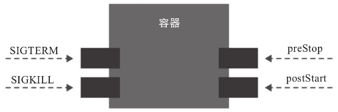

容器需要处理来自平台的最重要事件是`SIGTERM`信号，任何需要“干净”关闭进程的应用程序都需要捕捉该信号进行必要处理，例如释放文件锁、关闭数据库连接和网络连接等，而后尽快终止进程，以避免宽限期过后强制关闭信号`SIGKILL`的介入。`SIGKILL`信号是由底层操作系统接收的，而非应用进程，一旦检测到该信号，内核将停止为相应进程提供内核资源，并终止进程正在使用的所有 CPU 线程，类似于直接切断了进程的电源。

但是仅依赖信号终止进程很可能不足以完成所有的必要操作。因此，容器还需要支持`postStart`和`preStop`事件，前者常用于为程序启动前进行预热，后者则一般在“干净”地关闭应用之前释放占用的资源。

- `postStart`：在容器创建完成后立即运行的钩子句柄，该钩子定义的事件执行完成后容器才能真正完成启动过程；不过 Kubernetes **无法确保它一定会在容器的主应用程序（由`ENTRYPOINT`定义）之前运行**
- `preStop`：在容器终止操作执行之前立即运行的钩子句柄，它以同步方式调用，因此在其完成之前会**阻塞删除容器的操作**；这意味着该钩子定义的事件成功执行并退出，容器终止操作才能真正完成

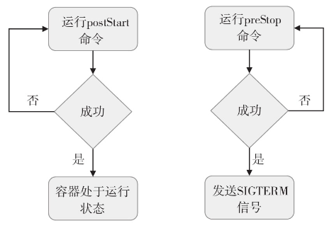

钩子句柄的实现方式类似于容器探针句柄的类型，同样有`exec`、`httpGet`和`tcpSocket`这 3 种，它们各自的配置格式和工作逻辑也完全相同，`exec`在容器中执行用户定义的一个或多个命令，`httpGet`在容器中向指定的本地 URL 发起 HTTP 连接请求，而`tcpSocket`则试图与指定的端口建立 TCP 连接。

`postStart`和`preStop`句柄定义在`spec.containers.lifecycle`字段中，其内部一次仅支持嵌套使用一种句柄类型。下面的配置清单示例中同时使用了`postStart`和`preStop`钩子处理相应的事件。

```yaml
apiVersion: v1
kind: Pod
metadata:
  name: lifecycle-demo
  namespace: default
spec:
  containers:
  - name: demo
    image: ikubernetes/demoapp:v1.0
    imagePullPolicy: IfNotPresent
    securityContext:
      capabilities:
        add:
        - NET_ADMIN
    livenessProbe:
      httpGet:
        path: 'livez'
        port: 80
        scheme: HTTP
      initialDelaySeconds: 5
    lifecycle:
      postStart:
        exec:
          command: ['/bin/sh', '-c', 'iptables -t nat -A PREROUTING -p tcp --dport 8080 -j REDIRECT --to-ports 80']
      preStop:
        exec:
          command: ['/bin/sh', '-c', 'while killall python3; do sleep 1; done']
  restartPolicy: Always
```

示例中的 demo 容器通过`postStart`执行 iptables 命令设置端口重定向规则，将发往该 Pod IP 的 8080 端口的所有请求重定向至 80 端口，从而让容器应用能够同时从 8080 端口接收请求。demo 容器又借助`preStop`执行`killall`命令，它假设该命令能够更优雅地终止基于 Python3 运行的容器应用 demoapp。将清单中的 Pod 对象创建于集群中便可展开后续的测试：

```bash
root@VM-0-4-ubuntu:~# kubectl apply -f lifecycle-demo.yaml 
pod/lifecycle-demo created
```

而后可获取容器内网络名称空间中`PREROUTING`链上的 iptables 规则，验证`postStart`钩子事件的执行结果：

```bash
root@VM-0-4-ubuntu:~# kubectl exec lifecycle-demo -- iptables -t nat -nL PREROUTING
Chain PREROUTING (policy ACCEPT)
target     prot opt source               destination         
REDIRECT   tcp  --  0.0.0.0/0            0.0.0.0/0            tcp dpt:8080 redir ports 80
```

上面的配置清单中有意同时添加了`httpGet`类型的存活探针，我们可以人为地将探针检测结果置为失败状态，以促使 kubelet 重启 demo 容器验证`preStop`钩子事件的执行。不过，该示例中给出的操作是终止容器应用，那么容器成功重启即验证了相应脚本的运行完成。

## 6.多容器Pod

容器设计模式中的单节点多容器模型中，初始化容器和 Sidecar 容器是目前使用较多的模式，尤其是**服务网格**的发展极大促进了 Sidecar 容器的应用。

### 6.1 初始化容器

初始化容器的典型应用需求有如下几种：

- 用于运行需要管理权限的工具程序，例如`iptables`命令等，出于安全等方面的原因，应用容器不适合拥有运行这类程序的权限
- 提供主容器镜像中不具备的工具程序或自定义代码
- 为容器镜像的构建和部署人员提供了分离、独立工作的途径
- 初始化容器和应用容器处于不同的文件系统视图中，因此可分别安全地使用敏感数据，例如 Secrets 资源等
- 初始化容器要先于应用容器串行启动并运行完成，因此可用于延后应用容器的启动直至其依赖的条件得以满足

Pod 对象中的所有初始化容器必须按**定义的顺序串行运行**，直到它们全部成功结束才能启动应用容器，因而初始化容器通常很小，以便它们能够以轻量的方式快速运行。某初始化容器运行失败将会导致整个 Pod 重新启动（重启策略为 Never 时例外），初始化容器也必将再次运行，因此需要确保所有初始化容器的操作具有**幂等性**，以避免无法预知的副作用。

Pod 资源的`spec.initContainers`字段以列表形式定义可用的初始化容器，其嵌套可用字段类似于`spec.containers`。下面的资源清单在 Pod 对象上定义了一个名为 iptables-init 的初始化容器示例。

```yaml
apiVersion: v1
kind: Pod
metadata:
  name: init-container-demo
  namespace: default
spec:
  initContainers:
  - name: iptables-init
    image: ikubernetes/admin-box:latest
    imagePullPolicy: IfNotPresent
    command: ["/bin/sh", "-c"]
    args: ["iptables -t nat -A PREROUTING -p tcp --dport 8080 -j REDIRECT --to-port 80"]
    securityContext:
      capabilities:
        add:
        - NET_ADMIN
  containers:
  - name: demo
    image: ikubernetes/demoapp:v1.0
    imagePullPolicy: IfNotPresent
    ports:
    - name: http
      containerPort: 80
```

示例中，应用容器 demo 默认监听 TCP 协议的 80 端口，但我们又期望该 Pod 能够在 TCP 协议的 8080 端口通过端口重定向方式为客户端提供服务，因此需要在其网络名称空间中添加一条相应的 iptables 规则。但是，添加该规则的 iptables 命令依赖于内核中的网络管理权限，**出于安全原因我们并不期望应用容器拥有该权限**，因而使用了拥有网络管理权限的初始化容器来完成此功能。下面先把配置清单中定义的资源创建于集群之上：

```bash
root@VM-0-4-ubuntu:~# kubectl apply -f init-container-demo.yaml
pod/init-container-demo created
```

随后，在 Pod 对象 init-container-demo 的描述信息中的初始化容器信息段可以看到如下内容，它表明初始化容器启动后执行完成返回 0 状态码并成功退出。

```bash
root@VM-0-4-ubuntu:~# kubectl describe Pod/init-container-demo
...
Init Containers:
  iptables-init:
    Container ID:  containerd://d691238e2c014dcb090e2377b079e8ec5c8298b6f494e602ee4087bb9567b7ed
    Image:         ikubernetes/admin-box:latest
    Image ID:      docker.io/ikubernetes/admin-box@sha256:56e2413d2bcc279c6667d36fa7dfc7202062a933d0f69cd8a1769b68e2155bbf
    Port:          <none>
    Host Port:     <none>
    Command:
      /bin/sh
      -c
    Args:
      iptables -t nat -A PREROUTING -p tcp --dport 8080 -j REDIRECT --to-port 80
    State:          Terminated
      Reason:       Completed
      Exit Code:    0
      Started:      Mon, 06 Nov 2023 11:59:44 +0800
      Finished:     Mon, 06 Nov 2023 11:59:44 +0800
    Ready:          True
    Restart Count:  0
```

这说明向 Pod 网络名称空间中添加 iptables 规则的操作已经完成，如果通过应用容器试图查看规则会因为缺少网络管理权限而拒绝：

```bash
root@VM-0-4-ubuntu:~# kubectl exec init-container-demo -- iptables -t nat -vnL
Defaulted container "demo" out of: demo, iptables-init (init)
iptables v1.8.3 (legacy): can't initialize iptables table `nat': Permission denied (you must be root)
Perhaps iptables or your kernel needs to be upgraded.
command terminated with exit code 3
```

同时应用容器中的服务则可以通过  8080 端口接受并响应：

```bash
root@VM-0-4-ubuntu:~# podIP=$(kubectl get pods/init-container-demo -o jsonpath={.status.podIP})
root@VM-0-4-ubuntu:~# curl http://${podIP}:8080
iKubernetes demoapp v1.0 !! ClientIP: 10.244.0.0, ServerName: init-container-demo, ServerIP: 10.244.1.38!
```

由此可见，初始化容器及容器的 preStart 钩子都能完成特定的初始化操作，但 **preStart 必须在应用容器内部完成**，它依赖的条件（例如管理权限）也必须为应用容器所有，这无疑会为应用容器引入安全等方面的风险，因此使用初始化容器也就成了不二之选。

### 6.2 Sidecar容器

Sidecar 容器是 Pod 中与主容器松散耦合的实用程序容器，遵循容器设计模式，并以**单独容器**进程运行，负责运行应用的非核心功能，以扩展、增强主容器。Sidecar 模式最著名的用例是充当服务网格中的微服务的代理应用（例如 Istio 中的数据控制平面 Envoy），其他典型使用场景包括日志传送器、监视代理和数据加载器等。

下面的配置清单中定义了两个容器：一个是运行 demoapp 的主容器 demo，一个运行 envoy 代理的 Sidecar 容器 proxy。

```yaml
apiVersion: v1
kind: Pod
metadata:
  name: sidecar-container-demo
  namespace: default
spec:
  containers:
  - name: proxy
    image: envoyproxy/envoy-alpine:v1.13.1
    command: ["/bin/sh", "-c"]
    args: ["sleep 3 && envoy -c /etc/envoy/envoy.yaml"]
    lifecycle:
      postStart:
        exec:
          command: ["/bin/sh", "-c", "wget -O /etc/envoy/envoy.yaml https://raw.githubusercontent.com/iKubernetes/Kubernetes_Advanced_Practical_2rd/master/chapter4/envoy.yaml"]
  - name: demo
    image: ikubernetes/demoapp:v1.0
    imagePullPolicy: IfNotPresent
    env:
    - name: HOST
      value: "127.0.0.1"
    - name: PORT
      value: "8080"
```

Envoy 程序是**服务网格**领域著名的数据平面实现，它在 Istio 服务网格中以 Sidecar 的模式同每一个微服务应用程序单独组成一个 Pod，负责代理该微服务应用的所有通信事件，并为其提供限流、熔断、超时、重试等多种高级功能。这里我们将 demoapp 视作一个微服务应用，配置 Envoy 为其代理并调度入站（Ingress）流量，因而在示例中 demo 容器基于环境变量被配置为监听 127.0.0.1 地址上一个特定的 8080 端口，而 proxy 容器将监听 Pod 所有 IP 地址上的 80 端口，以接收客户端请求。proxy 容器上的 postStart 事件用于为 Envoy 代理下载一个适用的配置文件，以便将 proxy 接收到的所有请求均代理至 demo 容器。

下面说明整个测试过程。先将配置清单中定义的对象创建到集群之上。

```bash
root@VM-0-4-ubuntu:~# kubectl apply -f sidecar-container-demo.yaml 
pod/sidecar-container-demo created
```

等待 Pod 中的两个容器成功启动且都转为就绪状态，可通过各 Pod 内端口监听的状态来确认服务已然正常运行。下面命令的结果表示，Envoy 已经正常运行并监听了 TCP 协议的 80 端口和 9901 端口（Envoy 的内置管理接口）。

```bash
root@VM-0-4-ubuntu:~# kubectl exec sidecar-container-demo -c proxy -- netstat -tnlp
Active Internet connections (only servers)
Proto Recv-Q Send-Q Local Address           Foreign Address         State       PID/Program name    
tcp        0      0 0.0.0.0:9901            0.0.0.0:*               LISTEN      1/envoy
tcp        0      0 127.0.0.1:8080          0.0.0.0:*               LISTEN      -
tcp        0      0 0.0.0.0:80              0.0.0.0:*               LISTEN      1/envoy
```

接下来，我们向 Pod 的 80 端口发起 HTTP 请求，若它能以 demoapp 的页面响应，则表示代理已然成功运行，甚至可以根据响应头部来判断其是否有代理服务 Envoy 发来的代理响应，如下面的命令及结果所示。

```bash
root@VM-0-4-ubuntu:~# podIP=$(kubectl get pods/sidecar-container-demo -o jsonpath={.status.podIP})
root@VM-0-4-ubuntu:~# curl http://$podIP
iKubernetes demoapp v1.0 !! ClientIP: 127.0.0.1, ServerName: sidecar-container-demo, ServerIP: 10.244.1.40!

root@VM-0-4-ubuntu:~# curl -I http://$podIP
HTTP/1.1 200 OK
content-type: text/html; charset=utf-8
content-length: 108
server: envoy
date: Mon, 06 Nov 2023 13:42:22 GMT
x-envoy-upstream-service-time: 1
```

虽然 Sidecar 容器可以称得上是 Pod 中的常规容器，但直到 v1.18 版本 Kubernetes 才将其添加作为内置功能。在此之前，Pod 中的各应用程序彼此间没有区别，用户无从预测和控制容器的启动及关闭顺序，但多数场景都要求 Sidecar 容器必须要先于普通应用容器启动以做一些准备工作，例如分发证书、创建存储卷或获取一些数据等，且它们需要晚于其他应用容器终止。Kubernetes 从 v1.18 版本开始支持用户在生命周期字段中将容器标记为 Sidecar，**这类容器全部转为就绪状态后普通应用容器方可启动**。因而，这个新特性根据生命周期将 Pod 的容器重新划分成了初始化容器、Sidecar 容器和应用容器 3 类。

所有的 Sidecar 容器都是应用容器，唯一不同之处是，需要手动为 Sidecar 容器在`lifecycle`字段中嵌套定义`type`类型的值为`Sidecar`。配置格式如下所示：

```bash
spec:
  containers:
  - name: proxy
    image: envoyproxy/envoy-alpine:v1.13.1
    lifecycle:
      type: Sidecar
```

另外，可能也有一些场景需要 Sidecar 容器启动晚于普通应用容器，这种特殊的应用需求，目前可通过 OpernKruise 项目中的 SidecarSet 提供的 PostSidecar 模型来解决。将来，该项目或许支持以 DAG 的方式来灵活编排容器的启动顺序。

## 7.资源需求与限制

容器在运行时具有多个维度，例如内存占用、CPU 占用和其他资源的消耗等。每个容器都应该声明其资源需求，并将该信息传递给管理平台。

### 7.1 资源需求与限制

在 Kubernetes 上，可由容器或 Pod 请求与消费的“资源”主要是指 CPU 和内存（RAM），它可统称为**计算资源**，另一种资源是事关可用存储卷空间的存储资源。

相比较而言，CPU 属于可压缩型资源，即资源额度可按需弹性变化，而内存（当前）则是不可压缩型资源，对其执行压缩操作可能会导致进程崩溃等问题。目前，资源隔离仍属于**容器级别**，CPU 和内存资源的配置主要在 Pod 对象中的容器上进行，并且每个资源存在如下图所示的需求和限制两种类型。

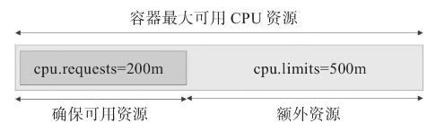

- 资源需求：定义需要系统预留给该容器使用的资源**最小可用值**，容器运行时可能用不到这些额度的资源，但用到时必须确保有相应数量的资源可用
- 资源限制：定义该容器可以申请使用的资源**最大可用值**，超出该额度的资源使用请求将被拒绝；显然，该限制需要大于等于 requests 的值，但系统在某项资源紧张时，会从容器回收超出 request 值的那部分

在 Kubernetes 系统上，1 个单位的 CPU 相当于虚拟机上的 1 颗虚拟 CPU（vCPU）或物理机上的一个超线程（Hyperthread，或称为一个逻辑 CPU），它支持分数计量方式，一个核心（1 core）相当于 1000 个微核心（millicores，以下简称为 m），因此 500m 相当于是 0.5 个核心，即 1/2 个核心。内存的计量方式与日常使用方式相同，默认单位是字节，也可以使用 E、P、T、G、M 和 K 为单位后缀，或 Ei、Pi、Ti、Gi、Mi 和 Ki 形式的单位后缀。

### 7.2 容器资源需求

下面的配置清单示例中的自主式 Pod 要求为 stress 容器确保 128MiB 的内存及 1/5 个 CPU 核心（200m）资源可用。Pod 运行 stress-ng 镜像启动一个进程（`-m 1`）进行内存性能压力测试，另外再启动一个专用的 CPU 压力测试进程（`-c 1`）。stress-ng 是一个多功能系统压力测试具，master/worker 模型，master 为主进程，负载生成和控制子进程，worker 是负责执行各类特定测试的子进程，例如测试 CPU 的子进程，以及测试 RAM 的子进程等。

```yaml
apiVersion: v1
kind: Pod
metadata:
  name: stress-pod
spec:
  containers:
  - name: stress
    image: ikubernetes/stress-ng
    command: ["/usr/bin/stress-ng", "-m 1", "-c 1"]
    resources:
      requests:
        memory: "128Mi"
        cpu: "200m"
```

接下来创建并运行此 Pod 对象以对其资源限制效果进行检查。因为显示结果涉及资源占用比例等，因此同样的测试配置对不同的系统环境来说，其结果也会有所不同。而后在 Pod 资源的容器内运行`top`命令，观察 CPU 及内存资源占用状态，如下所示。其中 {stress-ng-vm} 是执行内存压测的子进程，它默认使用 256MB 的内存空间，{stress-ng-cpu} 是执行 CPU 压测的专用子进程。

```bash
root@VM-0-4-ubuntu:~# kubectl apply -f resource-requests-demo.yaml 
pod/stress-pod created

root@VM-0-4-ubuntu:~# kubectl exec stress-pod -- top
Mem: 1895292K used, 115616K free, 5564K shrd, 82660K buff, 1038924K cached
CPU:  98% usr   1% sys   0% nic   0% idle   0% io   0% irq   0% sirq
Load average: 1.72 0.61 0.22 3/315 15
  PID  PPID USER     STAT   VSZ %VSZ CPU %CPU COMMAND
    9     8 root     R     262m  13%   1  49% {stress-ng-vm} /usr/bin/stress-ng 
    7     1 root     R     6904   0%   0  48% {stress-ng-cpu} /usr/bin/stress-ng
    1     0 root     S     6260   0%   1   0% /usr/bin/stress-ng -m 1 -c 1
    8     1 root     S     6260   0%   1   0% {stress-ng-vm} /usr/bin/stress-ng 
   10     0 root     R     1520   0%   0   0% top
```

`top`命令的输出结果显示，每个测试进程的 CPU 占用率约为 50%，{stress-ng-vm} 的内存占用量为 262MB（VSZ），此两项资源占用量都远超其请求的用量，原因是 stress-ng 会在可用范围内尽量多地占用相关的资源。两个测试线程分布于两个 CPU 核心（0 和 1），以接近满载的方式运行，这台服务器共有 2 个核心，因此 CPU 使用率为接近 100%。另外，节点上的内存资源充裕，所以，尽管容器的内存用量远超 128MB，但它依然可以运行。一旦资源紧张时，节点仅保证该容器有 1/5 个 CPU 核心（其需求中的定义）可用。对于 2 核的系统来说占用率为 1/10，多占用的资源会被压缩。内存为非可压缩型资源，该 Pod 对象在内存资源紧张时可能会因 OOM 被杀死。

对于压缩型的资源 CPU 来说，若未定义容器的资源请求用量，以确保其最小可用资源量，该 Pod 占用的 CPU 资源**可能会被其他 Pod 对象压缩至极低的水平**，甚至到该 Pod 对象无法被调度运行的境地。而对于非压缩型内存资源来说，资源紧缺情形下可能导致相关的容器进程被杀死。因此，在 Kubernetes 系统上运行关键型业务相关的 Pod 时，**必须要使用`requests`属性为容器明确定义资源需求**。当然，我们也可以为 Pod 对象定义较高的优先级来改变这种局面。

集群中的每个节点都拥有定量的 CPU 和内存资源，调度器将 Pod 绑定至节点时，计算资源余量可满足该 Pod 对象需求量的节点才能作为该 Pod 运行的可用目标节点。也就是说，Kubernetes 的调度器会根据容器的`requests`属性定义的资源需求量来判定哪些节点可接收并运行相关的 Pod 对象，而对于一个节点的资源来说，每运行一个 Pod 对象，该 Pod 对象上所有容器`requests`属性定义的请求量都要给予预留，直到节点资源被绑定的所有 Pod 对象瓜分完毕为止。

### 7.3 容器资源限制

容器为保证其可用的最少资源量，并不限制可用资源上限，因此对应用程序自身 Bug 等多种原因导致的系统资源被长时间占用无计可施，这就需要通过资源限制功能为容器定义资源的最大可用量。一旦定义资源限制，分配资源时，可压缩型资源 CPU 的控制阀可自由调节，容器进程也就无法获得超出其 CPU 配额的可用值。但是，若进程申请使用超出`limits`属性定义的内存资源时，该进程将可能被杀死。不过，该进程随后仍可能会被其控制进程重启，例如，当 Pod 对象的重启策略为`Always`或`OnFailure`时，或者容器进程存在有监视和管理功能的父进程等。

下面的配置清单文件中定义使用 simmemleak 镜像运行一个 Pod 对象，它模拟内存泄漏操作不断地申请使用内存资源，直到超出`limits`属性中`memory`字段设定的值而被杀死。

```bash
apiVersion: v1
kind: Pod
metadata:
  name: memleak-pod
  labels:
    app: memleak
spec:
  containers:
  - name: simmemleak
    image: ikubernetes/simmemleak
    imagePullPolicy: IfNotPresent
    resources:
      requests:
        memory: "64Mi"
        cpu: "1"
      limits:
        memory: "64Mi"
        cpu: "1"
```

Pod 资源的默认重启策略为`Always`，于是在 simmemleak 容器因内存资源达到硬限制而被终止后会立即重启，因此用户很难观察到其因 OOM 而被杀死的相关信息。不过，多次因内存资源耗尽而重启会触发 Kubernetes 系统的**重启延迟机制（退避算法）**，即每次重启的时间间隔会不断地拉长，因而用户看到 Pod 对象的相关状态通常为 CrashLoopBackOff。

```bash
root@VM-0-4-ubuntu:~# kubectl apply -f resource-limits-demo.yaml 

root@VM-0-4-ubuntu:~# kubectl get pods -l app=memleak
NAME          READY   STATUS    RESTARTS      AGE
memleak-pod   1/1     Running   3 (24s ago)   43s
root@VM-0-4-ubuntu:~# kubectl get pods -l app=memleak
NAME          READY   STATUS      RESTARTS      AGE
memleak-pod   0/1     OOMKilled   3 (29s ago)   48s
root@VM-0-4-ubuntu:~# kubectl get pods -l app=memleak
NAME          READY   STATUS             RESTARTS      AGE
memleak-pod   0/1     CrashLoopBackOff   3 (33s ago)   75s
```

上面的命令结果中，OOMKilled 表示容器因内存耗尽而被终止，因此为`limits`属性中的`memory`设置一个合理值至关重要。与资源需求不同的是，一个节点上的所有 Pod 对象的资源限制数量之和可以大于节点拥有的资源量，即**支持资源的过载使用**（overcommitted）。

另外需要说明的是，Kubernetes 仅会确保 Pod 对象获得它们请求的 CPU 时间额度，它们能否取得额外（throttled）的 CPU 时间，则取决于其他正在运行作业的 CPU 资源占用情况。例如对于总数为 1000m 的 CPU 资源来说，容器 A 请求使用 200m，容器 B 请求使用 500m，在不超出它们各自最大限额的前下，则余下的 300m 在双方都需要时会以 2 : 5（200m : 500m）的方式进行配置。

### 7.4 容器可见资源

可以观察到，在容器中运行`top`等命令观察资源可用量信息时，容器可用资源受限于`requests`和`limits`属性中的定义，但容器中可见的资源量依然是**节点级别**的可用总量。例如为前面定义的 stress-pod 添加如下 limits 属性定义。

```yaml
limits:
  memory: "512Mi"
  cpu: "400m"
```

重新创建stress-pod对象，其可见的内存和 CPU 资源总量如下所示。

```bash
root@VM-0-4-ubuntu:~# kubectl exec stress-pod -- cat /proc/meminfo | grep ^MemTotal
MemTotal:        2010908 kB
root@VM-0-4-ubuntu:~# kubectl exec stress-pod -- cat /proc/cpuinfo | grep -c ^processor
2
```

命令结果中显示其可用内存资源总量为 2010908 kB（2GB），CPU 核心数为 2 个，这是节点级的资源数量，而非由容器的`limits`属性所定义的 512MiB 和 400m。

其实，这会给有些容器应用的配置带来不小的负面影响。较为典型的是在 Pod 中运行 Java 应用程序时，若未使用`-Xmx`选项指定 JVM 的堆内存可用总量，则会默认设置为主机内存总量的一个空间比例（例如 30%），这会导致**容器中的应用程序申请内存资源时很快达到资源文件定义的上限**，而转为 OOMKilled 状态。另外，即便使用了`-Xmx`选项设置其堆内存上限，但该设置对非堆内存的可用空间不产生任何限制作用，仍然存在达到容器内存资源上限的可能性。

另一个典型代表是在 Pod 中运行 Nginx 应用时，其配置参数`worker_processes`的值设置为`auto`，则会创建与可见 CPU 核心数量等同的 worker 进程数，若容器的 CPU 可用资源量远小于节点所需资源量时，这种设置在较大的访问负荷下会产生严重的资源竞争，并且会带来更多的内存资源消耗。一种较为妥当的解决方案是使用 Downward API 将`limits`定义的资源量暴露给容器，这将在后面的章节中予以介绍。

### 7.5 Pod服务质量类别

Kubernetes 允许节点的 Pod 对象过载使用资源，这意味着节点无法同时满足绑定其上的所有 Pod 对象以资源满载的方式运行。因而在内存资源紧缺的情况下，**应该以何种次序终止哪些 Pod 对象就变成了问题**。事实上，Kubernetes 无法自行对此做出决策，它需要借助于 Pod 对象的服务质量和优先级等完成判定。根据 Pod 对象的`requests`和`limits`属性，Kubernetes 把 Pod 对象归类到`BestEffort`、`Burstable`和`Guaranteed`这 3 个服务质量类别（Quality of Service，QoS）类别下。

- `Guaranteed`：Pod 对象为其每个容器都设置了 CPU 资源需求和资源限制，且二者具有相同值；同时为每个容器都设置了内存资源需求和内存限制，且二者具有相同值。这类 Pod 对象具有最高级别服务质量
- `Burstable`：至少有一个容器设置了 CPU 或内存资源的`requests`属性，但不满足 Guaranteed 类别的设定要求，这类 Pod 对象具有中等级别服务质量
- `BestEffort`：不为任何一个容器设置`requests`或`limits`属性，这类 Pod 对象可获得的服务质量为最低级别

一旦内存资源紧缺，`BestEffort`类别的容器将**首当其冲地被终止**，因为系统不为其提供任何级别的资源保证，但换来的好处是，**它们能够做到尽可能多地占用资源**。若此时系统上已然不存任何`BestEffort`类别的容器，则接下来将轮到`Burstable`类别的 Pod 被终止。**`Guaranteed`类别的容器拥有最高优先级**，它们不会被杀死，除非其内存资源需求超限，或者 OOM 时没有其他更低优先级的 Pod 对象存在。

每个运行状态的容器都有其 **OOM 评分**，**评分越高越优先被杀死**。OOM 评分主要根据两个维度进行计算：由服务质量类别继承而来的默认分值，以及容器的可用内存资源比例，而同等类别的 Pod 对象的默认分值相同。下面的代码片段取自`pkg/kubelet/qos/policy.go`源码文件，它们定义的是各种类别的 Pod 对象的 OOM 调节（Adjust）分值，即默认分值。其中，`Guaranteed`类别 Pod 资源的 Adjust 分值为`–998`，而`BestEffort`类别的默认分值为`1000`，`Burstable`类别的 Pod 资源的 Adjust 分值经由相应的算法计算得出。

```bash
const (
  PodInfraOOMAdj        int = -998
  KubeletOOMScoreAdj    int = -999
  DockerOOMScoreAdj     int = -999
  KubeProxyOOMScoreAdj  int = -999
  guaranteedOOMScoreAdj int = -998
  besteffortOOMScoreAdj int = 1000
)
```

同等级别优先级的 Pod 资源在 OOM 时，与自身的`requests`属性相比，其**内存占用比例最大的 Pod 对象将先被杀死**。例如，图中的同属于`Burstable`类别的 Pod A 将先于 Pod B 被杀死，虽然其内存用量小，但与自身的`requests`值相比，它的占用比例为 95%，要大于 Pod B 的 80%。

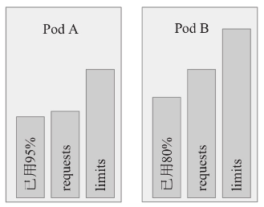

> **注意**
>
> 需要特别说明的是，OOM 是**内存耗尽**时的处理机制，与可压缩型资源 CPU 无关，因此 CPU 资源的需求无法得到保证时，Pod 对象仅仅是暂时获取不到相应的资源来运行而已。

## 8.综合应用案例

下面的配置清单中定义的 Pod 对象 all-in-one 将前面的用到的大多数配置整合在一起：它有一个初始化容器和两个应用容器，其中 sidecar-proxy 为 Sidecar 容器，负责为主容器 demo 代理服务客户端请求。

```yaml
apiVersion: v1
kind: Pod
metadata:
  name: all-in-one
  namespace: default
spec:
  # 创建初始容器用于修改 iptables 规则转发 8080 到 80
  initContainers:
  - name: iptables-init
    image: ikubernetes/admin-box:latest
    imagePullPolicy: IfNotPresent
    command: ["/bin/sh", "-c"]
    args: ["iptables -t nat -A PREROUTING -p tcp --dport 8080 -j REDIRECT --to-port 80"]
    securityContext:
      capabilities:
        add:
        - NET_ADMIN
  containers:
  # 创建 sidecar 容器用于代理 80 端口
  - name: sidecar-proxy
    image: envoyproxy/envoy-alpine:v1.13.1
    command: ["/bin/sh", "-c"]
    args: ["sleep 3 && envoy -c /etc/envoy/envoy.yaml"]
    lifecycle:
      postStart:
        exec:
          command: ["/bin/sh", "-c", "wget -O /etc/envoy/envoy.yaml https://raw.githubusercontent.com/iKubernetes/Kubernetes_Advanced_Practical_2rd/master/chapter4/envoy.yaml"]
    livenessProbe:
      tcpSocket:
        port: 80
      initialDelaySeconds: 5
    readinessProbe:
      tcpSocket:
        port: 80
      initialDelaySeconds: 5
  # 创建 demo 容器
  - name: demo
    image: ikubernetes/demoapp:v1.0
    imagePullPolicy: IfNotPresent
    env:
    - name: PORT
      value: "8080"
    livenessProbe:
      httpGet:
        path: "/livez"
        port: 8080
      initialDelaySeconds: 5
    readinessProbe:
      httpGet:
        path: "/readyz"
        port: 8080
      initialDelaySeconds: 15
    securityContext:
      runAsUser: 1001
      runAsGroup: 1001
    resources:
      requests:
        cpu: 0.5
        memory: "64Mi"
      limits:
        cpu: 2
        memory: "1024Mi"
  securityContext:
    supplementalGroups: [1002, 1003]
    fsGroup: 2000
```

配置清单的 Pod 对象的各容器中，主容器 demo 在 Pod 的 IP 地址上监听 TCP 协议的 8080 端口，以接收并响应 HTTP 请求；Sidecar 容器 sidecar-proxy 监听 TCP 协议的 80 端口，接收 HTTP 请求并将其代理至 demo 容器的 8080 端口；初始化容器在 Pod 的 Network 名称空间中添加了一条 iptables 重定向规则，该规则负责把所有发往 Pod IP 上 8080 端口的请求重定向至 80 端口。因此访问 Pod 的 8080  端口和 80 端口最终都会访问到主容器 demo 的 8080 端口。

```bash
root@VM-0-4-ubuntu:~# kubectl get pods/all-in-one -o jsonpath={.status.podIP}
10.244.1.45

root@VM-0-4-ubuntu:~# curl http://10.244.1.45:80
iKubernetes demoapp v1.0 !! ClientIP: 127.0.0.1, ServerName: all-in-one, ServerIP: 10.244.1.45!
root@VM-0-4-ubuntu:~# curl http://10.244.1.45:8080
iKubernetes demoapp v1.0 !! ClientIP: 127.0.0.1, ServerName: all-in-one, ServerIP: 10.244.1.45!
```

## 9.配置项总结

下面是 Pod 的资源清单：

```yaml
apiVersion: v1     #必选，版本号，例如v1
kind: Pod       　 #必选，资源类型，例如 Pod
metadata:       　 #必选，元数据
  name: string     #必选，Pod名称
  namespace: string  #Pod所属的命名空间,默认为"default"
  labels:       　　  #自定义标签列表
    - name: string      　          
spec:  #必选，Pod中容器的详细定义
  containers:  #必选，Pod中容器列表
  - name: string   #必选，容器名称
    image: string  #必选，容器的镜像名称
    imagePullPolicy: [ Always|Never|IfNotPresent ]  #获取镜像的策略 
    command: [string]   #容器的启动命令列表，如不指定，使用打包时使用的启动命令
    args: [string]      #容器的启动命令参数列表
    workingDir: string  #容器的工作目录
    volumeMounts:       #挂载到容器内部的存储卷配置
    - name: string      #引用pod定义的共享存储卷的名称，需用volumes[]部分定义的的卷名
      mountPath: string #存储卷在容器内mount的绝对路径，应少于512字符
      readOnly: boolean #是否为只读模式
    ports: #需要暴露的端口库号列表
    - name: string        #端口的名称
      containerPort: int  #容器需要监听的端口号
      hostPort: int       #容器所在主机需要监听的端口号，默认与Container相同
      protocol: string    #端口协议，支持TCP和UDP，默认TCP
    env:   #容器运行前需设置的环境变量列表
    - name: string  #环境变量名称
      value: string #环境变量的值
    resources: #资源限制和请求的设置
      limits:  #资源限制的设置
        cpu: string     #Cpu的限制，单位为core数，将用于docker run --cpu-shares参数
        memory: string  #内存限制，单位可以为Mib/Gib，将用于docker run --memory参数
      requests: #资源请求的设置
        cpu: string    #Cpu请求，容器启动的初始可用数量
        memory: string #内存请求,容器启动的初始可用数量
    lifecycle: #生命周期钩子
        postStart: #容器启动后立即执行此钩子,如果执行失败,会根据重启策略进行重启
        preStop: #容器终止前执行此钩子,无论结果如何,容器都会终止
    livenessProbe:  #对Pod内各容器健康检查的设置，当探测无响应几次后将自动重启该容器
      exec:       　 #对Pod容器内检查方式设置为exec方式
        command: [string]  #exec方式需要制定的命令或脚本
      httpGet:       #对Pod内个容器健康检查方法设置为HttpGet，需要制定Path、port
        path: string
        port: number
        host: string
        scheme: string
        HttpHeaders:
        - name: string
          value: string
      tcpSocket:     #对Pod内个容器健康检查方式设置为tcpSocket方式
         port: number
       initialDelaySeconds: 0       #容器启动完成后首次探测的时间，单位为秒
       timeoutSeconds: 0    　　    #对容器健康检查探测等待响应的超时时间，单位秒，默认1秒
       periodSeconds: 0     　　    #对容器监控检查的定期探测时间设置，单位秒，默认10秒一次
       successThreshold: 0
       failureThreshold: 0
       securityContext:
         privileged: false
  restartPolicy: [Always | Never | OnFailure]  #Pod的重启策略
  nodeName: <string> #设置NodeName表示将该Pod调度到指定到名称的node节点上
  nodeSelector: obeject #设置NodeSelector表示将该Pod调度到包含这个label的node上
  imagePullSecrets: #Pull镜像时使用的secret名称，以key：secretkey格式指定
  - name: string
  hostNetwork: false   #是否使用主机网络模式，默认为false，如果设置为true，表示使用宿主机网络
  volumes:   #在该pod上定义共享存储卷列表
  - name: string    #共享存储卷名称 （volumes类型有很多种）
    emptyDir: {}       #类型为emtyDir的存储卷，与Pod同生命周期的一个临时目录。为空值
    hostPath: string   #类型为hostPath的存储卷，表示挂载Pod所在宿主机的目录
      path: string      　　        #Pod所在宿主机的目录，将被用于同期中mount的目录
    secret:       　　　#类型为secret的存储卷，挂载集群与定义的secret对象到容器内部
      scretname: string  
      items:     
      - key: string
        path: string
    configMap:         #类型为configMap的存储卷，挂载预定义的configMap对象到容器内部
      name: string
      items:
      - key: string
        path: string
```
