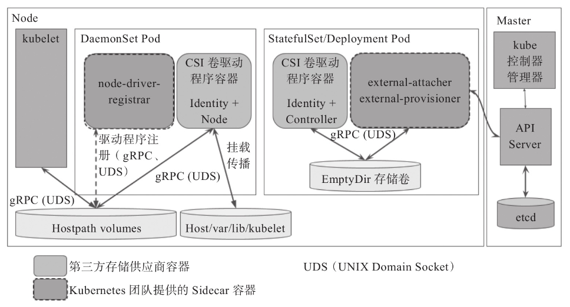

# 第04章_存储卷与数据持久化

Kubernetes 也支持类似 Docker 的存储卷功能以实现短生命周期的容器应用数据的持久化，不过，其存储卷**绑定于 Pod 对象**而非容器级别，并可共享给内部的所有容器使用。

## 1.存储卷基础

Pod 本身有生命周期，其应用容器及生成的数据自身均无法独立于该生命周期之外持久存在，并且同一 Pod 中的容器可共享 PID、Network、IPC（进程间通信）和 UTS（世界协调时间）名称空间，但 Mount 和 USER 名称空间却各自独立，因而**跨容器的进程彼此间默认无法基于共享的存储空间交换文件或数据**。

### 1.1 存储卷概述

简单来说，存储卷是定义在 Pod 资源之上可被其内部的所有容器挂载的共享目录，该目录关联至宿主机或某外部的存储设备之上的存储空间，可由 Pod 内的多个容器同时挂载使用。Pod 存储卷独立于容器自身的文件系统，因而也独立于容器的生命周期，它存储的数据可于容器重启或重建后继续使用。


每个工作节点基于本地内存或目录向 Pod 提供存储空间，也能够使用借助驱动程序挂载的网络文件系统或附加的块设备，例如使用挂载至本地某路径上的 NFS 文件系统等。Kubernetes 系统具体支持的存储卷类型要取决于存储卷插件的内置定义，如图所示，不过 Kubernetes 也支持管理员基于扩展接口配置使用第三方存储。另外，Kubernetes 甚至还支持一些有着特殊功用的存储卷，例如将外部信息投射至 Pod 之中的 ConfigMap、Secret 和 Downward API 等。


存储卷隶属于 Pod 资源，且**与所属的特定 Pod 对象有着相同的生命周期**，因而通过 API Server 管理声明了存储卷资源的 Pod 对象时也会相应触发存储卷的管理操作。在具体的执行过程中，首选由调度器将该 Pod 对象绑到一个工作节点之上，若该 Pod 定义存储卷尚未被挂载，Controller Manager 中的 AD 控制器（Attach/Detach Controller）会先借助相应的存储卷插件把远程的存储设备附加到该目标节点，而由内置在 kubelet中 的 Pod 管理器（Pod Manager）触发本地的存储卷操作实现，它借助存储卷管理器（Volume  Manager）调用存储卷插件进行关联并驱动相应存储服务，并完成设备的挂载、格式化和卸载等操作。**存储卷独立于 Pod 对象中容器的生命周期**，从而使得容器重启或更新之后数据依然可用，但**删除 Pod 对象时也必将删除其存储卷**。定义 Pod 资源时，用户可在其`spec.volumes`字段中嵌套配置选定的存储卷插件。

目前，Kubernetes 支持的存储卷可简单归为以下类别，它们也各自有着不少的实现插件。

1. 临时存储卷：`emptyDir`
2. 本地存储卷：`hostPath`和`local`
3. 网络存储卷
   - 云存储：awsElasticBlockStore、gcePersistentDisk、azureDisk 和 azureFile
   - 网络文件系统：NFS、GlusterFS、CephFS 和 Cinder
   - 网络块设备：iscsi、FC、RBD 和 vSphereVolume
   - 网络存储平台：Quobyte、PortworxVolume、StorageOS 和 ScaleIO
4. 特殊存储卷：Secret、ConfigMap、DownwardAPI 和 Projected
5. 扩展支持第三方存储的存储接口（Out-of-Tree 卷插件）：CSI 和 FlexVolume

通常，这些 Kubernetes 内置提供的存储卷插件可归类为`In-Tree`类型，它们同 Kubernetes 源代码一同发布和迭代，而由存储服务商借助于 CSI 或 FlexVolume 接口扩展的独立于 Kubernetes 代码的存储卷插件则统称为`Out-Of-Tree`类型，集群管理员也可根据需要创建自定义的扩展插件，目前 CSI 是较为推荐的扩展接口。

### 1.2 配置Pod存储卷

在 Pod 中定义使用存储卷的配置由两部分组成：一部分通过`.spec.volumes`字段定义在 Pod 之上的存储卷列表，它经由特定的存储卷插件并结合特定的存储系统的访问接口进行定义；另一部分是嵌套定义在容器的`volumeMounts`字段上的存储卷挂载列表，它只能挂载当前 Pod 对象中定义的存储卷。不过，定义了存储卷的 Pod 内的容器也可以选择不挂载任何存储卷。

```yaml
spec:
  volumes:
  - name <string>  # 存储卷名称标识, 仅可使用 DNS 标签格式的字符, 在当前 Pod 中必须唯一
    VOL_TYPE <Object>          # 存储卷插件及具体的目标存储系统的相关配置
  containers:
  - name: …
    image: …
    volumeMounts:
    - name <string>             # 要挂载的存储卷的名称, 必须匹配存储卷列表中某项的定义
      mountPath <string>        # 容器文件系统上的挂载点路径
      readOnly <boolean>        # 是否挂载为只读模式, 默认为“否”
      subPath <string>          # 挂载存储卷上的一个子目录至指定的挂载点
      subPathExpr <string>      # 挂载由指定模式匹配到的存储卷的文件或目录至挂载点
      mountPropagation <string> # 挂载卷的传播模式
```

Pod配置清单中的`.spec.volumes`字段的值是一个对象列表，每个列表项定义一个存储卷，它由存储卷名称（`.spec.volumes.name <String>`）和存储卷对象（`.spec.volumes.VOL_TYPE <Object>`）组成，其中`VOL_TYPE`是使用的存储卷类型名称，它的内嵌字段随类型的不同而不同，具体参数需要参阅 Pod 上各存储卷插件的相关文档说明。

定义好的存储卷可由当前 Pod 资源内的各容器进行挂载。Pod 中仅有一个容器时，使用存储卷的目的通常在于数据持久化，以免重启时导致数据丢失，当多个容器挂载同一个存储卷时“共享”才有了具体的意义。挂载卷的**传播模式**（`mountPropagation`）就是用于配置容器将其挂载卷上的数据变动传播给同一 Pod 中的其他容器，甚至是传播给同一个节点上的其他 Pod 的一个特性，该字段的可用值包括如下几项：

- `None`：该挂载卷不支持传播机制，当前容器不向其他容器或 Pod 传播自己的挂载操作，也不会感知主机后续在该挂载卷或其任何子目录上执行的挂载变动；此为默认值
- `HostToContainer`：主机向容器的单向传播，即当前容器能感知主机后续对该挂载卷或其任何子目录上执行的挂载变动
- `Bidirectional`：主机和容器间的双向传播，当前容器创建的存储卷挂载操作会传播给主机及使用了同一存储卷的所有 Pod 的所有容器，也能感知主机上后续对该挂载卷或其任何子目录上执行的挂载变动；该行为存在破坏主机操作系统的危险，因而仅可用于**特权模式**下的容器中

## 2.临时存储卷

Kubernetes 支持的存储卷类型中，`emptyDir`存储卷的生命周期与其所属的 Pod 对象相同，它无法脱离 Pod 对象的生命周期提供数据存储功能，因此通常仅用于**数据缓存**或**临时存储**。不过，基于`emptyDir`构建的`gitRepo`存储卷可以在 Pod 对象的生命周期起始时，从相应的 Git 仓库中克隆相应的数据文件到底层的`emptyDir`中，也就使得它具有了一定意义上的持久性。临时存储卷`emptyDir`和`gitRepo`的生命周期同 Pod 对象，但`gitRepo`能够通过引用外部 Git 仓库的数据实现数据持久化。

### 2.1 emptyDir存储卷

`emptyDir`存储卷可以理解为 Pod 对象上的一个**临时目录**，类似于 Docker 上的“Docker 挂载卷”，在 Pod 对象启动时即被创建，而在 Pod 对象被移除时一并被删除。因此，`emptyDir`存储卷只能用于某些特殊场景中，例如同一 Pod 内的多个容器间的**文件共享**，或作为容器数据的临时存储目录用于**数据缓存系统**等。

`emptyDir`存储卷嵌套定义在`.spec.volumes.emptyDir`字段中，可用字段主要有两个：

- `medium`：此目录所在的存储介质的类型，可用值为`default`或`Memory`，默认为`default`，表示使用节点的默认存储介质；`Memory`表示使用基于 RAM 的临时文件系统 tmpfs，总体可用空间受限于内存，但性能非常好，通常用于为容器中的应用提供**缓存**存储
- `sizeLimit`：当前存储卷的空间限额，默认值为`nil`，表示不限制；不过，在`medium`字段值为`Memory`时，建议务必定义此限额

下面是一个使用了`emptyDir`存储卷的简单示例：

```yaml
apiVersion: v1
kind: Pod
metadata:
  name: volumes-emptydir-demo
  namespace: default
spec:
  initContainers:
  - name: config-file-downloader
    image: ikubernetes/admin-box
    imagePullPolicy: IfNotPresent
    command: ["/bin/sh", "-c", "wget -O /data/envoy.yaml https://raw.githubusercontent.com/iKubernetes/Kubernetes_Advanced_Practical_2rd/master/chapter4/envoy.yaml"]
    volumeMounts:
    - name: config-file-store
      mountPath: /data
  containers:
  - name: envoy
    image: envoyproxy/envoy-alpine:v1.13.1
    command: ["/bin/sh", "-c"]
    args: ["envoy -c /etc/envoy/envoy.yaml"]
    volumeMounts:
    - name: config-file-store
      mountPath: /etc/envoy
      readOnly: true
  volumes:
  - name: config-file-store
    emptyDir:
      medium: Memory
      sizeLimit: 16Mi
```

在该示例清单中，为 Pod 对象定义了一个名为 config-file-store 的、基于`emptyDir`存储插件的存储卷。初始化容器将该存储卷挂载至 /data 目录后，下载 envoy.yaml 配置文件并保存于该挂载点目录下。主容器将该存储卷挂载至 /etc/envoy 目录，再通过自定义命令让容器应用在启动时加载的配置文件 /etc/envoy/envoy.yaml 上。


Pod 资源的详细信息中会显示存储卷的相关状态，包括其是否创建成功（`Events`字段中输出）、相关的类型及参数（`Volumes`字段中输出），以及容器中的挂载状态等信息（`Containers`字段中输出）。

```bash
root@VM-0-4-ubuntu:~# kubectl describe pods volumes-emptydir-demo
...
Init Containers:
  config-file-downloader:
    Mounts:
      /data from config-file-store (rw)
...
Containers:
  envoy:
    Mounts:
      /etc/envoy from config-file-store (ro)
...
Volumes:
  config-file-store:
    Type:       EmptyDir (a temporary directory that shares a pod's lifetime)
    Medium:     Memory
    SizeLimit:  16Mi
...
```

为 Envoy 下载的配置文件中定义了一个监听所有可用 IP 地址上 TCP 80 端口的 Ingress 侦听器，以及一个监听所有可用 IP 地址上 TCP 的 9901 端口的 Admin 接口。这与 Envoy 镜像中默认配置文件中的定义均有不同（默认的 Ingress 监听端口是 10000）。

```bash
root@VM-0-4-ubuntu:~# kubectl exec volumes-emptydir-demo -- netstat -tnl
Defaulted container "envoy" out of: envoy, config-file-downloader (init)
Active Internet connections (only servers)
Proto Recv-Q Send-Q Local Address           Foreign Address         State       
tcp        0      0 0.0.0.0:80              0.0.0.0:*               LISTEN      
tcp        0      0 0.0.0.0:9901            0.0.0.0:*               LISTEN 
```

`emptyDir`卷简单易用，但仅能用于临时存储。

### 2.2 gitRepo存储卷（deprecated）

`gitRepo`存储卷可以看作是`emptyDir`存储卷的一种实际应用，使用该存储卷的 Pod 资源可以通过挂载目录**访问指定的代码仓库中的数据**。使用`gitRepo`存储卷的 Pod 资源在创建时，会首先创建一个空目录（`emptyDir`）并克隆一份指定的 Git 仓库中的数据至该目录，而后再创建容器并挂载该存储卷。

定义`gitRepo`类型的存储卷时，其可嵌套使用字段有如下 3 个：

- `repository <string>`：Git 仓库的 URL，必选字段
- `directory <string>`：目标目录名称，但名称中不能包含`..`字符；`.`表示将仓库中的数据直接克隆至存储卷映射的目录中，其他字符则表示将数据克隆至存储卷上以用户指定的字符串为名称的子目录中
- `revision <string>`：特定 revision 的提交哈希码，会执行`git checkout <revision>`的操作，因此也可以是 branch 名

> **注意**
>
> 使用`gitRepo`存储卷的 Pod 资源运行的工作节点上必须安装有 Git 程序，否则克隆仓库的操作将无法完成。

下面的配置清单示例中的 Pod 资源在创建时，会先创建一个空目录，将指定的Git仓库`https://github.com/iKubernetes/Kubernetes_Advanced_Practical_2rd.git`中的数据克隆一份直接保存在此目录中，而后将此目录创建为存储卷 html，再由容器 nginx 将此存储卷挂载到 /usr/share/nginx/html 目录上。

```yaml
apiVersion: v1
kind: Pod
metadata:
  name: volumes-gitrepo-demo
spec:
  containers:
  - name: nginx
    image: nginx:alpine
    volumeMounts:
    - name: html
      mountPath: /usr/share/nginx/html
  volumes:
  - name: html
    gitRepo:
      repository: https://github.com/iKubernetes/Kubernetes_Advanced_Practical_2rd.git
      directory: .
      revision: "main"
```

访问此 Pod 资源中的 nginx 服务，即可看到它来自 Git 仓库中的页面资源。不过，`gitRepo`存储卷在其创建完成后**不会再与指定的仓库执行同步操作**。此时可以为 Pod 资源创建一个`Sidecar`容器来执行此类的同步操作，尤其是数据来源于私有仓库时，通过`Sidecar`容器完成认证等必要步骤后再进行克隆操作就更为必要。

`gitRepo`存储卷构建于`emptyDir`之上，其生命周期与 Pod 资源一样，故使用中不应在此类存储卷中保存由容器生成的重要数据。另外，`gitRepo`存储插件==即将废弃==，建议在初始化容器或`Sidecar`容器中运行`git`命令来完成相应的功能。

## 3.hostPath存储卷

`hostPath`存储卷插件是将**工作节点**上某文件系统的目录或文件关联到 Pod 上的一种存储卷类型，其数据具有**同工作节点生命周期一样**的持久性。配置`hostPath`存储卷的嵌套字段有两个：一个用于指定工作节点上的目录路径的必选字段`path`；另一个用于指定节点之上存储类型的`type`。`hostPath`支持使用的节点存储类型有如下几种：

- `DirectoryOrCreate`：指定的路径不存在时，自动将其创建为 0755 权限的空目录，属主和属组均为 kubelet
- `Directory`：事先必须存在的目录路径
- `FileOrCreate`：指定的路径不存在时，自动将其创建为 0644 权限的空文件，属主和属组均为 kubelet
- `File`：事先必须存在的文件路径
- `Socket`：事先必须存在的 Socket 文件路径
- `CharDevice`：事先必须存在的字符设备文件路径
- `BlockDevice`：事先必须存在的块设备文件路径
- `""`：空字符串，默认配置，在关联`hostPath`存储卷之前不进行任何检查

这类 Pod 对象通常受控于`DaemonSet`类型的 Pod 控制器，它运行在集群中的每个工作节点上，负责收集工作节点上系统级的相关数据，然而在节点上创建的文件或目录**默认仅 root 用户可写**，若期望容器内的进程拥有写权限，则需要将该容器运行于**特权模式**，不过这存在潜在的安全风险。

下面是定义在配置清单中的 Pod 对象，容器中的 filebeat 进程负责收集工作节点及容器相关的日志信息并发往 Redis 服务器，它使用了 3 个`hostPath`类型的存储卷，第一个指向了宿主机的日志文件目录 /var/logs，后面两个则与宿主机上的容器运行时环境有关。

```yaml
apiVersion: v1
kind: Pod
metadata:
  name: vol-hostpath-pod
spec:
  containers:
  - name: filebeat
    image: ikubernetes/filebeat:5.6.7-alpine
    env:
    - name: REDIS_HOST
      value: redis.ilinux.io:6379
    - name: LOG_LEVEL
      value: info
    volumeMounts:
    - name: varlog
      mountPath: /var/log
    - name: socket
      mountPath: /run/containerd/containerd.sock
    - name: varlibcontainers
      mountPath: /var/lib/containerd
      readOnly: true
  terminationGracePeriodSeconds: 30
  volumes:
  - name: varlog
    hostPath:
      path: /var/log
  - name: socket
    hostPath:
      path: /run/containerd/containerd.sock
  - name: varlibcontainers
    hostPath:
      path: /var/lib/containerd
```

上面配置清单中 Pod 对象的正确运行要依赖于 REDIS_HOST 和 LOG_LEVEL 环境变量，它们分别用于定义日志缓冲队列服务和日志级别。如果有可用的 Redis 服务器，我们就可通过环境变量 REDIS_HOST 将其对应的主机名或I P 地址传递给 Pod 对象，待 Pod 对象准备好之后即可通过 Redis 服务器查看到由该 Pod 发送的日志信息。测试时，我们仅需要给 REDIS_HOST 环境变量传递一个任意值（例如清单中的 redis.ilinux.io）便可直接创建 Pod 对象，只不过该 Pod 中容器的日志会报出无法解析指定主机名的错误，但这并不影响存储卷的配置和使用。

> **提示**
>
> 在 Filebeat 的应用架构中，这些日志信息可能会由 Logstash 收集后发往集中式日志存储系统 Elasticsearch，并通过 Kibana 进行展示。

对于由 Deployment 或 StatefulSet 等一类控制器管控的、使用了`hostPath`存储卷的 Pod 对象来说，需要注意**在 Pod 对象被重新调度至其他节点时，容器进程此前创建的文件或目录则大多不会存在**。一个常用的解决办法是通过在 Pod 对象上使用`nodeSelector`或者`nodeAffinity`赋予该 Pod 对象指定要绑定到的具体节点来影响调度器的决策，但即便如此，管理员仍然不得不手动管理涉及的多个节点之上的目录，低效且易错。因此，`hostPath`存储卷虽然能持久保存数据，但对于由调度器按需调度的应用来说并不适用。

## 4.网络存储卷

Kubernetes 内置了多种类型的网络存储卷插件，它们支持的存储服务包括传统的 NAS 或 SAN 设备（例如 NFS、iscsi 和 FC 等）、分布式存储（例如 GlusterFS、CephFS 和 RBD 等）、云存储（例如 gcePersistentDisk、azureDisk、Cinder 和 awsElasticBlockStore 等）以及构建在各类存储系统之上的抽象管理层（例如 flocker、portworxVolume 和 vSphereVolume 等）。这类服务通常都是独立运行的存储系统，因相应的存储卷可以支持超越节点生命周期的数据持久性。NFS、GlusterFS 和 RBD 等是企业内部较为常用的独立部署的持久存储系统。

### 4.1 NFS存储卷

NFS 即**网络文件系统**（Network File System），它是一种分布式文件系统协议，最初是由 Sun Microsystems 公司开发的类 UNIX 操作系统之上的经典网络存储方案，其功能旨在允许客户端主机可以像访问本地存储一样通过网络访问服务器端文件。Kubernetes 的 NFS 存储卷用于关联某事先存在的 NFS 服务器上导出的存储空间到 Pod 对象中以供容器使用，该类型的存储卷在 Pod 对象终止后仅是**被卸载**而非被删除。而且，NFS 是文件系统级共享服务，它支持同时存在的多路挂载请求，可由多个 Pod 对象同时关联使用。定义 NFS 存储卷时支持嵌套使用以下几个字段。

- `server <string>`：NFS 服务器的 IP 地址或主机名，必选字段
- `path <string>`：NFS 服务器导出（共享）的文件系统路径，必选字段
- `readOnly <boolean>`：是否以只读方式挂载，默认为 false

下面的配置清单示例中以 Redis 为例来说明 NFS 存储卷的功能与用法。

```yaml
apiVersion: v1
kind: Pod
metadata:
  name: volumes-nfs-demo
  labels:
    app: redis
spec:
  containers:
  - name: redis
    image: redis:alpine
    ports:
    - containerPort: 6379
      name: redisport
    securityContext:
      runAsUser: 777
    volumeMounts:
    - mountPath: /data
      name: redisdata
  volumes:
  - name: redisdata
    nfs:
      server: localhost
      path: /data/redis
      readOnly: false
```

镜像文件会默认以 redis 用户（UID：777）运行 redis-server 进程，并将数据持久保存在容器文件系统上的 /data 目录中，因此需要确保 UID 777 的用户有权限读写该目录。同时 NFS 服务器上用于该 Pod 对象的存储卷的导出目录（/data/redis）也需要确保让 UID 为 999 的用户拥有读写权限，因此需要在 nfs.ilinux.io 服务器上创建该用户，将该用户设置为 /data/redis 目录的属主，或通过 facl 设置该用户拥有读写权限。

以 Ubuntu 为例，在一个服务器上以 root 用户设定所需的 NFS 服务器的步骤如下：

1. 安装 NFS Server 程序包
   
   ```bash
   ~# apt -y install nfs-kernel-server
   ```

2. 设定基础环境
   
   ```bash
   ~# mkdir /data/redis
   ~# useradd -u 777 redis
   ~# chown redis /data/redis
   ```

3. 编辑 /etc/exports 配置文件
   
   ```bash
   /data/redis 10.0.0.0/16(rw,sync,no_root_squash) 10.244.0.0/16(rw,sync,no_root_squash) 127.0.0.1(rw,sync,no_root_squash)
   ```

   10.0.0.0/16 和 10.244.0.0/16、127.0.0.1 是允许挂载的网络网段和地址，分别是 Master 的内网网段和 Pod 的网段；而 (rw,sync,no_root_squash) 部分表示允许以读写方式挂载，确保写操作同步到磁盘，并且不对 root 用户进行权限限制。
  
4. 启动 NFS 服务器
   
   ```bash
   ~# systemctl start nfs-server
   ```

5. 在各工作节点安装 NFS 服务客户端程序包
   
   ```bash
   ~# apt install -y nfs-common
   ```
   
6. 确认挂载

   ```bash
   root@VM-0-4-ubuntu:~# showmount -e localhost
   Export list for localhost:
   /data/redis    10.244.0.0/16,10.0.0.0/16,127.0.0.1
   ```

> **扩展：CentOS 上安装 NFS**
>
> ```bash
> yum install -y nfs-utils
> echo "/data/nfs *(insecure,rw,sync,no_root_squash)" > /etc/exports
> mkdir -p /data/nfs && chmod -R 777 /data/nfs
> exportfs -r
> systemctl enable rpcbind && systemctl start rpcbind
> systemctl enable nfs && systemctl start nfs
> # 以下 适用于 CentOS 8 及以后
> # systemctl enable rpcbind.socket && systemctl start rpcbind.socket
> # systemctl enable nfs-server && systemctl start nfs-server 
> ```

执行完成后，切换回 kubernetes 主机上运行创建 Pod 对象：

```bash
~# kubectl apply -f volumes-nfs-demo.yml
```

资源创建完成后，可通过命令客户端 redis-cli 创建测试数据，并手动触发与存储系统同步：

```bash
~# kubectl exec -it volumes-nfs-demo -- redis-cli
127.0.0.1:6379> set mykey "hello redis"
OK
127.0.0.1:6379> get mykey
"hello redis"
127.0.0.1:6379> BGSAVE
Background saving started
127.0.0.1:6379> exit
```

为了测试数据持久化效果，下面先删除并重新创建 Pod 对象：

```bash
~# kubectl delete -f volumes-nfs-demo.yaml
~# kubectl apply -f volumes-nfs-demo.yaml
```

然后进入容器后观察是否还保存有此前存储的数据：

```bash
~# kubectl exec -it volumes-nfs-demo -- redis-cli
127.0.0.1:6379> get mykey
"hello redis"
```

可以观察到重新创建 Pod 后键值依然存在。若需要在删除 Pod 后清除存储设备上的数据则需要用户通过存储系统的管理接口手动进行。

### 4.2 RBD存储卷

#### 1.简介

Ceph 是一个专注于分布式的、弹性可扩展的、高可靠的、性能优异的存储系统平台，同时支持提供块设备、文件系统和对象存储 3 种存储接口。它提供了一个命令行界面用于监视和控制其存储集群。Kubernetes 支持通过 RBD 卷插件和 CephFS 卷插件，基于 Ceph 存储系统为 Pod 提供存储卷。要配置 Pod 对象使用 RBD 存储卷，需要事先满足以下条件：

- 存在某可用的 Ceph RBD 存储集群
- 在 Ceph RBD 集群中创建一个能满足 Pod 资源数据存储需要的存储映像
- 在 Kubernetes 集群内各个节点上安装 Ceph 客户端程序包——ceph-common

定义 RBD 类型的存储卷时需要指定要连接的目标服务器和认证信息等配置，他们依赖如下几个可用的嵌套字段：

- `monitors<[] string>`：Ceph 存储监视器，逗号分隔的字符串列表，必选字段
- `image<string>`：rados image 的名称，必选字段
- `pool<string>`：Ceph 存储池名称，默认为 rbd
- `user<string>`：Ceph 用户名，默认为 admin
- `keyring<string>`：用户认证到 Ceph 集群时使用的 kerying 文件路径，默认为 /etc/ceph/keyring
- `secretRef<Object>`：用户认证到 Ceph 集群时使用的保存有相应认证信息的 Secret 资源对象，该字段会覆盖由 keyring 字段提供的密钥信息
- `readOnly<boolean>`：是否以只读方式访问
- `fsType`：要挂载的存储卷的文件系统类型，至少应该是节点操作系统支持的文件系统，如 Ext4、xfs、NTFS 等，默认为 Ext4

下面定义一个 volumes-rbd-demo.yaml 配置清单文件，它使用 kube 用户认证到 Ceph 集群中，并关联 RDB 存储池 kube 中的存储映像 redis-img1 为 Pod 对象 volumes-rbd-demo 的存储卷，由容器进程挂载至 /data 目录进行数据存取：

```yaml
apiVersion: v1
kind: Pod
metadata:
  name: volumes-rbd-demo
spec:
  containers:
  - name: redis
    image: redis:alpine
    ports:
    - containerPort: 6379
      name: redisport
    volumeMounts:
    - mountPath: /data
      name: redis-rbd-vol
  volumes:
  - name: redis-rbd-vol
    rbd:
      monitors:
      - 10.0.0.1:6789
      - 10.0.0.2:6789
      - 10.0.0.3:6789
      pool: kube
      image: redis-img1
      fsType: xfs
      readOnly: false
      user: kube
      keyring: /etc/ceph/ceph.client.kube.keyring
```

RBD 存储卷插件依赖 Ceph 存储集群作为存储系统，这里假设其监视器的地址为 10.0.0.1、10.0.0.2 和 10.0.0.3，集群上的存储池 kube 中需要有事先创建好的存储映像 redis-img1。客户端访问集群时要事先认证到 Ceph 集群并获得相应授权才能进行后续的访问操作，该示例使用了用户的 keyring 文件。逻辑架构如下图所示：


#### 2.事先准备

1. 在 Ceph 集群上的 kube 存储池中创建用作 Pod 存储卷的 RBD 映像文件，并设置映像特性

   ```bash
   ~# rbd create --pool kube --size 1G redis-img1
   ~# rbd feature disable -p kube redis-img1 object-map fast-diff deep-flatten
   ```

2. 在 Ceph 集群上创建存储卷客户端账号并进行合理授权

   ```bash
   ~# ceph auth get-or-create client.kube mon 'allow r' \
   osd 'allow class-read object_prefix rbd_children, allow rwx pool=kube' \
   -o /etc/ceph/ceph/client.kube.keyring
   ```

3. 在 Kubernetes 集群的各工作节点上安装 Ceph 客户端库

   ```bash
   ~# wget -q -O - https://mirrors.aliyun.com/ceph/keys/release.asc | apt-key add -
   ~# echo deb https://mirrors.aliyun.com/ceph/debian-nautilus/ $(lsb_release -sc) main \
   | tee /etc/apt/sources.list.d/ceph.list 
   ~# apt update && apt install ceph-common
   ```

4. 在 Ceph 集群某节点上复制 Ceph 集群的配置文件以及客户端认证使用的 keyring 文件到 Kubernetes 集群的各个工作节点

   ```bash
   ~# for kubehost in k8s-node01 k8s-node02 k8s-node03; do \
   scp -p /etc/ceph/{ceph.conf,ceph.client.kube.keyring} ${kubehost}:/etc/ceph/; done
   ```

#### 3.测试

创建 Pod

```bash
~$ kubectl apply -f volumes-rbd-demo.yaml 
pod/volumes-rbd-demo created
```

随后从集群上的 Pod 对象 volumes-rbd-demo 的详细描述中获取存储的相关状态信息，确保其创建操作得以成功执行。

```bash
~$ kubectl describe pods/volumes-rbd-demo
...
Volumes:
redis-rbd-vol:
Type:  RBD (a Rados Block Device mount on the host that shares a pod's lifetime)
CephMonitors:  [172.29.200.1:6789 172.29.200.2:6789 172.29.200.3:6789]
RBDImage:      redis-img1
FSType:        xfs
RBDPool:       kube
RadosUser:     kube
Keyring:       /etc/ceph/ceph.client.kube.keyring
SecretRef:     nil
ReadOnly:      false
```

删除 Pod 对象仅会解除它对 RBD 映像的引用而非级联删除它，因而 RBD 映像及数据将依然存在，除非管理员手动进行删除。另外，实践中，应该把认证到 Ceph 集群上的用户的认证信息存储为 Kubernetes 集群上的`Secret`资源，并通过`secretRef`字段进行指定，而非像该示例中那样，直接使用`keyring`字段引用相应用户的 keyring 文件。

### 4.3 CephFS存储卷

CephFS（Ceph 文件系统）是在分布式对象存储 RADOS 之上构建的 POSIX 兼容的文件系统，它致力于为各种应用程序提供多用途、高可用和高性能的文件存储。CephFS 将文件元数据和文件数据分别存储在各自专用的 RADOS 存储池中，其中 MDS 通过元数据子树分区等支持高吞吐量的工作负载，而数据则由客户端直接相关的存储池直接进行读写操作，其扩展能跟随底层 RADOS 存储的大小进行线性扩展。Kubernetes 的 CephFS 存储卷插件以 CephFS 为存储方案为 Pod 提供存储卷，因而可受益于 CephFS 的存储扩展和性能优势。

CephFS 存储卷插件嵌套定义于 Pod 资源的`spec.volumes.cephfs`字段中，它支持通过如下字段的定义接入到存储预配服务中。

- `monitors <[]string>`：Ceph 存储监视器，为逗号分隔的字符串列表，必选字段
- `user <string>`：Ceph 集群用户名，默认为 admin
- `secretFile <string>`：用户认证到 Ceph 集群时使用的 Base64 格式的密钥文件（非 keyring 文件），默认为 /etc/ceph/user.secret
- `secretRef <Object>`：用户认证到 Ceph 集群过程中加载其密钥时使用的 Kubernetes Secret 资源对象
- `path <string>`：挂载的文件系统路径，默认为 CephFS 文件系统的根（/），可以使用 CephFS 文件系统上的子路径，例如 /kube/namespaces/default/redis1 等
- `readOnly <boolean>`：是否挂载为只读模式，默认为 false

下面提供的 CephFS 存储卷插件使用示例定义在 volumes-cephfs-demo.yaml 配置清单文件中，它使用 fsclient 用户认证到 Ceph 集群中，并关联 CephFS 上的子路径 /kube/namespaces/default/redis1，作为 Pod 对象 volumes-cephfs-demo 的存储卷，并由容器进程挂载至 /data 目录进行数据存取。

```yaml
apiVersion: v1
kind: Pod
metadata:
  name: volumes-cephfs-demo
spec:
  containers:
  - name: redis
    image: redis:alpine
    volumeMounts:
    - mountPath: /data
      name: redis-cephfs-vol
  volumes:
  - name: redis-cephfs-vol
    cephfs:
      monitors:
      - 10.0.0.1:6789
      - 10.0.0.2:6789
      - 10.0.0.3:6789
      path: /kube/namespaces/default/redis1
      user: fsclient
      secretFile: "/etc/ceph/fsclient.key"
      readOnly: false
```

Kubernetes 集群上需要启用 CephFS，并提供了满足条件的用户账号及授权才能使用 CephFS 存储卷插件。客户端访问集群时需要事先认证到 Ceph 集群并获得相应授权才能进行后续的访问操作，该示例使用了保存在 /etc/ceph/fsclient.key 文件中的 CephFS 专用用户认证信息。要完成示例清单中定义的资源的测试，需要事先完成如下几个步骤：

1. 将授权访问 CephFS 的用户 fsclient 的 Secret 文件 fsclient.key 复制到 Kubernetes 集群的各工作节点，以便 kubelet 可加载并使用它。在生成 fsclient.key 的 Ceph 节点上执行如下命令以复制必要的文件

   ```bash
   ~# for kubehost in k8s-node01 k8s-node02 k8s-node03; do \
   scp -p /etc/ceph/fsclient.key /etc/ceph/ceph.conf ${kubehost}:/etc/ceph/; done
   ```

2. 在 Kubernetes 集群的各工作节点上执行如下命令，以安装 Ceph 客户端库

   ```bash
   ~# wget -q -O - https://mirrors.aliyun.com/ceph/keys/release.asc | apt-key add -
   ~# echo deb https://mirrors.aliyun.com/ceph/debian-nautilus/ $(lsb_release -sc) main \
   | tee /etc/apt/sources.list.d/ceph.list 
   ~# apt update && apt install ceph-common
   ```

   > **提示**
   >
   > 若已经在 Kubernetes 集群的各节点上安装过 ceph-common，则无须重复执行该步骤。

3. 在 Kubernetes 的某工作节点上手动挂载 CephFS，以创建由 Pod 对象使用的数据目录

   ```bash
   ~# mount -t ceph ceph01:6789:/ /mnt -o name=fsclient,secretfile=/etc/ceph/fsclient.key
   ~# mkdir -p /mnt/kube/namespaces/default/redis1
   ```

   上述准备步骤执行完成后即可运行如下命令创建清单 volumes-cephfs-demo.yaml 中定义的 Pod 资源，并进行测试：

   ```bash
   ~$ kubectl apply -f volumes-cephfs-demo.yaml        
   pod/volumes-cephfs-demo created
   ```

随后通过 Pod 对象 volumes-cephfs-demo 的详细描述了解其创建及运行状态，若一切无误，则相应的存储卷会显示出类似如下的描述信息：

```bash
Volumes:
redis-cephfs-vol:
Type:        CephFS (a CephFS mount on the host that shares a pod's lifetime)
                     Monitors:    [172.29.200.1:6789 172.29.200.2:6789 172.29.200.3:6789]
                     Path:        /kube/namespaces/default/redis1
                     User:        fsclient
                     SecretFile:  /etc/ceph/fsclient.key
                     SecretRef:   nil
                     ReadOnly:    false
```

删除 Pod 对象仅会卸载其挂载的 CephFS 文件系统（或子目录），因而文件系统（或目录）及相关数据将依然存在，除非管理员手动进行删除。另外在实践中，应该把认证到 CephFS 文件系统上的用户的认证信息存储为 Kubernetes 集群上的`Secret`资源，并通过`secretRef`字段进行指定，而非像该示例中那样，直接使用`secretFile`字段引用相应用户密钥信息文件。

### 4.4 GlusterFS存储卷

GlusterFS（Gluster File System）是一个开源的分布式文件系统，是水平扩展存储解决方案 Gluster 的核心，它具有强大的横向扩展能力，通过扩展能够支持 PB 级的存储容量和数千个客户端。GlusterFS 借助 TCP/IP 或 InfiniBand RDMA 网络将物理分布的存储资源聚集在一起，使用单一全局命名空间来管理数据，它基于可堆叠的用户空间设计，可为各种不同的数据负载提供优异的性能，是另一种流行的分布式存储解决方案。Kubernetes 的 GlusterFS 存储卷插件依赖于 GlusterFS 存储集群作为存储方案。要配置 Pod 资源使用 GlusterFS 存储卷，需要事先满足以下条件：

1. 存在某可用的 GlusterFS 存储集群
2. 在 GlusterFS 集群中创建一个能满足 Pod 资源数据存储需要的卷
3. 在 Kubernetes 集群内的各节点上安装 GlusterFS 客户端程序包（glusterfs 和 glusterfs-fuse）

GlusterFS 存储卷嵌套定义在 Pod 资源的·spec.volumes.glusterfs·字段中，它常用的配置字段有如下几个：

- `endpoints <string>`：Endpoints 资源的名称，此资源需要事先存在，用于提供 Gluster 集群的部分节点信息作为其访问入口，选字段
- `path <string>`：用到的 GlusterFS 集群的卷路径，例如 kube-redis，必选字段
- `readOnly <boolean>`：是否为只读卷

下面提供的 GlusterFS 存储卷插件使用示例定义在 volumes-glusterfs-demo.yaml 配置清单文件中，它通过 glusterfs-endpoints 资源中定义的 GlusterFS 集群节点信息接入集群，并以 kube-redis 卷作为 Pod 资源的存储卷。glusterfs-endpoints 资源需要在 Kubernetes 集群中事先创建，而 kube-redis 则需要先于 Gluster 集群创建。

```yaml
apiVersion: V1
kind: Pod
metadata:
  name: volumes-glusterfs-demo
  labels:
    app: redis
spec:
  containers:
  - name: redis
    image: redis:alpine
    ports:
    - containerPort: 6379
      name: redisport
    volumeMounts:
    - mountPath: /data
      name: redisdata
  volumes:
  - name: redisdata
    glusterfs:
      endpoints: glusterfs-endpoints
      path: kube-redis
      readOnly: false
```

用于访问 Gluster 集群的相关节点信息要事先保存在某特定的 Endpoint 资源中，例如上面示例中调用的 glusterfs-endpoints。此类的 Endpoint 资源依赖用户根据实际需求手动创建，例如，下面保存在 glusterfs-endpoints.yaml 文件中的资源示例定义了 3 个接入相关的 Gluster 存储集群的节点：gfs01.ilinux.io、gfs02.ilinux.io 和 gfs03.ilinux.io，其中的端口信息仅为满足 Endpoint 资源的必选字段要求，因此其值可以随意填写。

```yaml
apiVersion: v1
kind: Endpoints
metadata:
  name: glusterfs-endpoints
  subsets:
  - addresses:
    - ip: gfs01.ilinux.io
      ports:
      - port: 24007
        name: glusterd
  - addresses:
    - ip: gfs02.ilinux.io
      ports:
      - port: 24007
        name： glusterd
  - addresses:
    - ip: gfs03.ilinux.io
      ports:
      - port: 24007
        name： glusterd
```

准备好必要的存储供给条件后，先创建 Endpoint 资源 glusterfs-endpoints，之后创建 Pod 资源 vol-glusterfs-pod，即可测试其数据持久存储的效果。

## 5.持久存储卷

使用网络存储卷时，用户必须要清晰了解用到的网络存储系统的访问细节才能完成存储卷相关的配置任务，例如 RBD 存储卷插件配置中的监视器（monitor）、存储池（pool）、存储映像（image）和密钥环（keyring）等来自于 Ceph 存储系统中的概念，这就要求用户对该类存储系统有着一定的了解才能够顺利使用。这与 Kubernetes 向用户和开发隐藏底层架构的目标有所背离，最好对存储资源的使用也能像计算资源一样，用户和开发人员既无须了解 Pod 资源究竟运行在哪个节点，也不用了解存储系统是什么设备、位于何处以及如何访问。

PV（PersistentVolume）与PVC（PersistentVolumeClaim）就是在用户与存储服务之间添加的一个**中间层**，管理员事先根据 PV 支持的存储卷插件及适配的存储方案（目标存储系统）细节定义好可以支撑存储卷的底层存储空间，而后由用户通过 PVC 声明要使用的存储特性来绑定符合条件的最佳 PV 定义存储卷，从而实现存储系统的使用与管理职能的解耦，大大简化了用户使用存储的方式。

PV 和 PVC 的生命周期由 Controller Manager 中专用的 PV 控制器（PV Controller）独立管理，这种机制的存储卷不再依附并受限于 Pod 对象的生命周期，从而实现了用户和集群管理员的**职责相分离**，也充分体现出 Kubernetes 把简单留给用户，把复杂留给自己的管理理念。

### 5.1 PV与PVC基础

PV 是由集群管理员于全局级别配置的**预挂载存储空间**，它通过支持的存储卷插件及给定的配置参数关联至某个存储系统上可用数据存储的一段空间，这段存储空间可能是 Ceph 存储系统上的一个存储映像、一个文件系统（CephFS）或其子目录，也可能是 NFS 存储系统上的一个导出目录等。PV 将存储系统之上的存储空间抽象为 Kubernetes 系统全局级别的 API 资源，由集群管理员负责管理和维护。

将 PV 提供的存储空间用于 Pod 对象的存储卷时，用户需要事先使用 PVC 在名称空间级别声明所需要的存储空间大小及访问模式并提交给 Kubernetes API Server，接下来由 PV 控制器负责查找与之匹配的 PV 资源并完成绑定。随后，用户在 Pod 资源中使用 persistentVolumeClaim 类型的存储卷插件指明要使用的 PVC 对象的名称即可使用其绑定到的 PV 所指向的存储空间，如下图所示。


尽管 PVC 及 PV 将存储资源管理与使用的职责分离，简化了用户对存储资源的使用机制，但也对二者之间的协同能力提出了要求。管理员需要精心预测和规划集群用户的存储使用需求，提前创建出多种规格的 PV，以便于在用户声明 PVC 后能够由 PV 控制器在集群中找寻到合适的甚至是最佳匹配的 PV 进行绑定。

但是这种通过管理员手动创建 PV 来满足 PVC 需求的**静态预配**（static provisioning）存在着不少的问题：

1. 集群管理员难以预测出用户的真实需求，很容易导致某些类型的 PVC 无法匹配到 PV 而被挂起，直到管理员参与到问题的解决过程中
2. 那些能够匹配到 PV 的 PVC 也很有可能存在资源利用率不佳的状况，例如一个声明使用 5G 存储空间的 PVC 绑定到一个 20GB 的 PV 之上

更好的解决方案是一种称为**动态预配**、按需创建 PV 的机制。集群管理员要做的仅是事先借助存储类（StorageClass）的 API 资源创建出一到多个“PV模板”，并在模板中定义好基于某个存储系统创建 PV 所依赖的存储组件（例如 Ceph RBD 存储映像或 CephfFS 文件系统等）时需要用到的配置参数。创建 PVC 时，用户需要为其指定要使用 PV 模板（StorageClass 资源），而后 PV 控制器会自动连接相应存储类上定义的目标存储系统的管理接口，请求创建匹配该 PVC 需求的存储组件，并将该存储组件创建为 Kubernetes 集群上可由该 PVC 绑定的 PV 资源。

PV 和 PVC 是一对一的关系：一个 PVC 仅能绑定一个 PV，而一个 PV 在某一时刻也仅可被一个 PVC 所绑定。为了能够让用户更精细地表达存储需求，PV 资源对象的定义支持存储容量、存储类、卷模型和访问模式等属性维度的约束。相应地，PVC 资源能够从访问模式、数据源、存储资源容量需求和限制、标签选择器、存储类名称、卷模型和卷名称等多个不同的维度向 PV 资源发起匹配请求并完成筛选。

### 5.2 PV的生命周期

从较为高级的实现上来讲，Kubernetes 系统与存储相关的组件主要有存储卷插件、存储卷管理器、PV/PVC 控制器和 AD 控制器（Attach/Detach Controller）这 4 种：


- 存储卷插件：Kubernetes 存储卷功能的基础设施，是存储任务相关操作的执行方；它是存储相关的扩展接口，用于对接各类存储设备
- 存储卷管理器：kubelet 内置管理器组件之一，用于在当前节点上执行存储设备的挂载（mount）、卸载（unmount）和格式化（format）等操作；另外，存储卷管理器也可执行节点级别设备的附加（attach）及拆除（detach）操作
- PV 控制器：负责 PV 及 PVC 的绑定和生命周期管理，并根据需求进行存储卷的预配和删除操作
- AD 控制器：专用于存储设备的附加和拆除操作的组件，能够将存储设备关联（attach）至目标节点或从目标节点之上剥离（detach）

PV 控制器、AD 控制器和存储卷管理器均构建于存储卷插件之上，以提供不同维度管理功能的接口，具体的实现逻辑均由存储卷插件完成。

除了创建、删除 PV 对象，以及完成 PV 和 PVC 的状态迁移等生命周期管理之外，PV 控制器还要负责绑定 PVC 与 PV 对象，而且 PVC 只能在绑定到 PV 之后方可由 Pod 作为存储卷使用。创建后未能正确关联到存储设备的 PV 将处于 Pending 状态，直到成功关联后转为 Available 状态。而后一旦该 PV 被某个 PVC 请求并成功绑定，其状态也就顺应转为 Bound，直到相应的 PVC 删除后而自动解除绑定，PV 才会再次发生状态转换，此时的状态为（Released），随后 PV 的去向将由其“回收策略”（reclaim policy）所决定，具体如下。

1. **Retain（保留）**：删除 PVC 后将保留其绑定的 PV 及存储的数据，但会把该 PV 置为 Released 状态，它不可再被其他 PVC 所绑定，且需要由管理员手动进行后续的回收操作：首先删除 PV，接着手动清理其关联的外部存储组件上的数据，最后手动删除该存储组件或者基于该组件重新创建 PV。
2. **Delete（删除）**：对于支持该回收策略的卷插件，删除一个 PVC 将同时删除其绑定的 PV 资源以及该 PV 关联的外部存储组件；动态的 PV 回收策略继承自 StorageClass 资源，默认为 Delete。多数情况下，管理员都需要根据用户的期望修改此默认策略，以免导致数据非计划内的删除。
3. **Recycle（回收）**：对于支持该回收策略的卷插件，删除 PVC 时，其绑定的 PV 所关联的外部存储组件上的数据会被清空，随后，该 PV 将转为 Available 状态，可再次接受其他 PVC 的绑定请求。不过，该策略已被**废弃**。

相应地，创建后的 PVC 也将处于 Pending 状态，仅在遇到条件匹配、状态为 Available 的 PV，且 PVC 请求绑定成功才会转为 Bound 状态。PV 和 PVC 的状态迁移如下图所示：


1. 存储预配（provision）：存储预配是指为 PVC 准备 PV 的途径，Kubernetes 支持**静态**和**动态**两种 PV 预配方式，前者是指由管理员以手动方式创建 PV 的操作，而后者则是由 PVC 基于 StorageClass 定义的模板，按需请求创建 PV 的机制。
2. 存储绑定：用户基于一系列存储需求和访问模式定义好 PVC 后，PV 控制器即会为其查找匹配的 PV，完成关联后它们二者同时转为已绑定状态，而且动态预配的 PV 与 PVC 之间存在强关联关系。无法找到可满足条件的 PV 的 PVC 将一直处于 Pending 状态，直到有符合条件的 PV 出现并完成绑定为止。
3. 存储使用：Pod 资源基于 persistenVolumeClaim 存储卷插件的定义，可将选定的 PVC 关联为存储卷并用于内部容器应用的数据存取。
4. 存储回收：存储卷的使用目标完成之后，删除 PVC 对象可使得此前绑定的 PV 资源进入 Released 状态，并由 PV 控制器根据 PV 回收策略对 PV 作出相应的处置。目前，可用的回收策略有 Retaine、Delete 和 Recycle 这 3 种。

如前所述，处于绑定状态的 PVC 删除后，相应的 PV 将转为 Released 状态，之后的处理机制依赖于其回收策略。而删除处于绑定状态的 PV 将会导致相应的 PVC 转为 Lost 状态，而无法再由 Pod 正常使用，除非 PVC 再绑定至其他 Available 状态的 PV 之上，但应用是否能正常运行，则取决于对此前数据的依赖度。另一方面，为了避免使用中的存储卷被移除而导致数据丢失，Kubernetes 自 1.9 版引入了“**PVC保护机制**”，其目的在于，用户删除了仍被某 Pod 对象使用中的 PVC 时，Kubernetes **不会立即移除该 PVC**，而是会推迟到它不再被任何 Pod 对象使用后方才真正执行删除操作。处于保护阶段的PVC资源的 status 字段值为 Termination，并且其 Finalizers 字段值中包含有 kubernetes.io/pvc-protection。

### 5.3 静态PV资源

PersistentVolume 是隶属于 Kubernetes 核心 API 群组中的标准资源类型，它的目标在于通过存储卷插件机制，将支持的外部存储系统上的存储组件定义为可被 PVC 声明所绑定的资源对象。但 PV 资源隶属于 Kubernetes 集群级别，因而它只能由集群管理员进行创建。这种**由管理员手动定义和创建**的 PV 被人们习惯地称为静态 PV 资源。

PV 支持的存储卷插件类型是 Pod 对象支持的存储卷插件类型的一个子集，它仅涵盖 Pod 支持的网络存储卷类别中的所有存储插件以及 local 卷插件。除了存储卷插件之外，`PersistentVolume`资源规范`Spec`字段主要支持嵌套以下几个通用字段，它们用于定义 PV 的容量、访问模式和回收策略等属性。

- `capacity <map[string]string>`：指定 PV 的容量；目前，`Capacity`仅支持存储容量设定，将来应该还可以指定 IOPS 和吞吐量（throughput）
- `accessModes <[]string>`：指定当前 PV 支持的访问模式；存储系统支持的存取能力大体可分为 ReadWriteOnce（单路读写）、ReadOnlyMany（多路只读）和 ReadWrite-Many（多路读写）3 种类型，某个特定的存储系统可能会支持其中的部分或全部的能力
- `persistentVolumeReclaimPolicy <string>`：PV 空间被释放时的处理机制；可用类型仅为`Retain`（默认）、`Recycle`或`Delete`。目前，仅 NFS 和 hostPath 支持 Recycle 策略，也仅有部分存储系统支持 Delete 策略
- `volumeMode <string>`：该 PV 的卷模型，用于指定此存储卷被格式化为文件系统使用还是直接使用裸格式的块设备；默认值为`Filesystem`，仅块设备接口的存储系统支持该功能
- `storageClassName <string>`：当前 PV 所属的 StorageClass 资源的名称，指定的存储类需要事先存在；默认为空值，即不属于任何存储类
- `mountOptions <string>`：挂载选项组成的列表，例如 ro、soft 和 hard 等
- `nodeAffinity <Object>`：节点亲和性，用于限制能够访问该 PV 的节点，进而会影响与该 PV 关联的 PVC 的 Pod 的调度结果

需要注意的是，PV 的访问模式用于反映它关联的存储系统所支持的某个或全部存取能力，例如 NFS 存储系统支持以上 3 种存取能力，于是 NFS PV 可以仅支持 ReadWriteOnce 访问模式。PV 在某个特定时刻仅可基于一种模式进行存取，哪怕它同时支持多种模式。

#### 1.NFS PV示例

下面的 pv-nfs-demo.yaml 资源清单定义了一个使用 NFS 存储系统的 PV 资源，它将空间大小限制为 5GB，并支持多路的读写操作。

```bash
apiVersion: v1
kind: PersistentVolume
metadata:
  name: pv-nfs-demo
spec:
  capacity:
    storage: 5Gi
  volumeMode: Filesystem
  accessModes:
  - ReadWriteMany
  persistentVolumeReclaimPolicy: Retain
  mountOptions:
  - hard
  - nfsvers=4.1
  nfs:
    path: "/data/redis002"
    server: localhost
```

需要实现配置 NFS 服务器：

1. 设定基础环境

   ```bash
   ~# mkdir /data/redis002
   ```

2. 编辑 /etc/exports 配置文件

   ```bash
   /data/redis002 127.0.0.1(rw,sync,no_root_squash)
   ```


配置好 NFS 服务器后创建 PV 资源：

```bash
kubectl apply -f pv-nfs-demo.yaml
```

若能够正确关联到指定的后端存储，该 PV 对象的状态将显示为 Available，否则其状态为 Pending，直至能够正确完成存储资源关联或者被删除。我们同样可使用`describe`命令来获取 PV 资源的详细描述信息。

```bash
root@VM-0-4-ubuntu:~# kubectl describe pv/pv-nfs-demo
Name:            pv-nfs-demo
...
Finalizers:      [kubernetes.io/pv-protection]
StorageClass:    
Status:          Available
Claim:           
Reclaim Policy:  Retain
...     
Source:
    Type:      NFS (an NFS mount that lasts the lifetime of a pod)
    Server:    localhost
    Path:      /data/redis002
    ReadOnly:  false
Events:        <none>
```

描述信息中的 Available 表明该 PV 已经可以接受 PVC 的绑定请求，并在绑定完成后转变其状态至 Bound。

#### 2.RBD PV示例

下面是另一个 PV 资源的配置清单（pv-rbd-demo.yaml），它使用了 RBD 存储后端，空间大小等同于指定的 RBD 存储映像的大小（这里为 2GB），并限定支持的访问模式为`RWO`，回收策略为`Retain`。除此之外，该 PV 资源还拥有一个名为 usedof 的资源标签，该标签可被 PVC 的标签选择器作为筛选 PV 资源的标准之一。

```bash
apiVersion: v1
kind: PersistentVolume
metadata:
  name: pv-rbd-demo
  labels:
    usedof: redisdata
spec:
  capacity:
    storage: 2Gi
  accessModes:
  - ReadWriteOnce
  rbd:
    monitors:
    - ceph01.ilunux.io
    - ceph02.ilunux.io
    - ceph03.ilunux.io
    pool: kube
    image: pv-test
    user: kube
    keyring: /etc/ceph/ceph.client.kube.keyring
    fsType: xfs
    readOnly: false
  persistentVolumeReclaimPolicy: Retain
```

将RBD卷插件内嵌字段相关属性值设定为Ceph存储系统的实际的环境，包括监视器地址、存储池、存储映像、用户名和认证信息（keyring或secretRef）等。测试时，事先部署好 Ceph 集群，准备好[基础环境](#2.事先准备)，并在 Ceph 集群的管理节点运行如下命令创建用到的存储映像：

```bash
~$ rbd create pv-test --size 2G --pool kube
~$ rbd feature disable -p kube pv-test object-map fast-diff deep-flatten
```

待所有准备工作就绪后创建示例清单中定义的 PV 资源 pv-rbd-demo：

```bash
$ kubectl apply -f pv-rbd-demo.yaml 
persistentvolume/pv-rbd-demo created
```

同样可以使用`describe`命令了解 pv-rbd-demo 的详细描述，若处于 Pending 状态则需要详细检查存储卷插件的定义是否能吻合存储系统的真实环境。

### 5.4 PVC资源

PersistentVolumeClaim 也是 Kubernetes 系统上标准的 API 资源类型之一，它位于核心 API 群组，属于名称空间级别。用户提交新建的 PVC 资源最初处于 Pending 状态，由 PV 控制器找寻最佳匹配的 PV 并完成二者绑定后，两者都将转入 Bound 状态，随后 Pod 对象便可基于`persistentVolumeClaim`存储卷插件配置使用该 PVC 对应的持久存储卷。

定义 PVC 时，用户可通过访问模式（accessModes）、数据源（dataSource）、存储资源空间需求和限制（resources）、存储类、标签选择器、卷模型和卷名称等匹配标准来筛选集群上的 PV 资源，其中，`resources`和`accessModes`是最重要的筛选标准。PVC 的`Spec`字段的可嵌套字段有如下几个：

- `accessModes <[]string>`：PVC 的访问模式；它同样支持 RWO、RWX 和 ROX 这 3 种模式
- `dataSrouces <Object>`：用于从指定的数据源恢复该 PVC 卷，它目前支持的数据源包括一个现存的卷快照对象（snapshot.storage.k8s.io/VolumeSnapshot）、一个既有的 PVC 对象或一个既有的用于数据转存的自定义资源对象（resource/object）
- `resources <Object>`：声明使用的存储空间的最小值和最大值；目前，PVC 的资源限定仅支持空间大小一个维度
- `selector <Object>`：筛选 PV 时额外使用的标签选择器（matchLabels）或匹配条件表达式（matchExpressions）
- `storageClassName <string>`：该 PVC 资源隶属的存储类资源名称；指定了存储类资源的 PVC 仅能在同一个存储类下筛选 PV 资源，否则就只能从所有不具有存储类的 PV 中进行筛选
- `volumeMode <string>`：卷模型，用于指定此卷可被用作文件系统还是裸格式的块设备；默认值为 Filesystem
- `volumeName <string>`：直接指定要绑定的 PV 资源的名称

下面通过匹配前一节中创建的 PV 资源的两个具体示例来说明 PVC 资源的配置方法：

```bash
root@VM-0-4-ubuntu:~# kubectl get pv
NAME          CAPACITY   ACCESS MODES   RECLAIM POLICY   STATUS      CLAIM   STORAGECLASS   REASON   AGE
pv-nfs-demo   5Gi        RWX            Retain           Available                                   14m
pv-rbd-demo   2Gi        RWO            Retain           Available
```

#### 1.NFS PVC示例

定义期望的存储空间范围、访问模式和卷模式以筛选集群上的 PV 资源。

```yaml
apiVersion: v1
kind: PersistentVolumeClaim
metadata:
  name: pvc-demo-0001
spec:
  accessModes: ["ReadWriteMany"]
  volumeMode: Filesystem
  resources:
    requests:
      storage: 3Gi
    limits:
      storage: 10Gi
```

显然，此前创建的两个 PV 资源中，pv-nfs-demo 能够完全满足该 PVC 的筛选条件，因而创建示例清单中的资源后，它能够迅速绑定至 PV 之上，如下面的创建和资源查看命令结果所示。

```bash
root@VM-0-4-ubuntu:~# kubectl apply -f pvc-demo-0001.yaml 
persistentvolumeclaim/pvc-demo-0001 created
root@VM-0-4-ubuntu:~# kubectl get pvc pvc-demo-0001
NAME            STATUS   VOLUME        CAPACITY   ACCESS MODES   STORAGECLASS   AGE
pvc-demo-0001   Bound    pv-nfs-demo   5Gi        RWX                           16s
```

被 PVC 资源 pvc-demo-0001 绑定的 PV 资源 pv-nfs-demo 的状态也将从 Available 转为 Bound。

```bash
root@VM-0-4-ubuntu:~# kubectl get pv/pv-nfs-demo -o jsonpath={.status.phase}
Bound
```

#### 2.RBD PVC示例

下面在 pvc-demo-0002.yaml 中的配置清单定义了一个 PVC 资源，除了期望的访问模式、卷模型和存储空间容量边界之外，它使用了标签选择器来匹配 PV 资源的标签。

```bash
apiVersion: v1
kind: PersistentVolumeClaim
metadata:
  name: pvc-demo-0002
spec:
  accessModes: ["ReadWriteOnce"]
  volumeMode: Filesystem
  resources:
    requests:
      storage: 2Gi
    limits:
      storage: 5Gi
  selector:
    matchLabels:
      usedof: "redisdata"
```

其筛选条件可由 PV/pv-rbd-demo 完全满足，因而创建配置清单中的 PVC/pvc-demo-0002 资源后会即刻绑定于该 PV 之上，如下面命令的结果所示。

```bash
~$ kubectl apply -f pvc-demo-0002.yaml
persistentvolumeclaim/pvc-demo-0002 created
~$ kubectl get pvc/pvc-demo-0002
NAME            STATUS  VOLUME  CAPACITY   ACCESS MODES  STORAGECLASS  AGE
pvc-demo-0002   Bound   pv-rbd-demo  2Gi     RWO                       10s
```

删除一个 PVC 将导致其绑定的 PV 资源转入 Released 状态，并由相应的回收策略完成资源回收。反过来，直接删除一个仍由某 PVC 绑定的 PV 资源，会由 PVC 保护机制延迟该删除操作至相关的 PVC 资源被删除。

### 5.5 在Pod中使用PVC

PVC资源隶属**名称空间级别**，它仅可被同一名称空间中的 Pod 对象通过`persistentVolumeClaim`插件所引用并作为存储卷使用，该存储卷插件可嵌套使用如下两个字段。

- `claimName`：要调用的 PVC 存储卷的名称，PVC 卷要与 Pod 在同一名称空间中
- `readOnly`：是否强制将存储卷挂载为只读模式，默认为 false

下面的配置清单（volumes-pvc-demo.yaml）定义了一个 Pod 资源，该配置清单将指定使用 PVC 存储卷。

```yaml
apiVersion: v1
kind: Pod
metadata:
  name: volumes-pvc-demo
spec:
  containers:
  - name: redis
    image: redis:alpine
    imagePullPolicy: IfNotPresent
    ports:
    - containerPort: 6339
      name: redisport
    volumeMounts:
    - mountPath: /data
      name: redis-nfs-vol
  volumes:
  - name: redis-nfs-vol
    persistentVolumeClaim:
      claimName: pvc-demo-0001
```

### 5.6 存储类

存储类也是 Kubernetes 系统上的 API 资源类型之一，它位于 storage.k8s.io 群组中。存储类通常由集群管理员为管理 PV 资源之便而按需创建的**存储资源类别**（逻辑组），例如可将存储系统按照其性能高低或者综合服务质量级别分类、依照备份策略分类，甚至直接按管理员自定义的标准分类等。存储类也是 PVC 筛选 PV 时的**过滤条件之一**，这意味着 PVC **仅能在其隶属的存储类之下**找寻匹配的 PV 资源。不过，Kubernetes 系统自身无法理解“类别”到底意味着什么，它仅仅把存储类中的信息当作 PV 资源的特性描述使用。

存储类的最重要功能之一便是对 PV 资源**动态预配机制的支持**，它可被视作动态 PV 资源的创建模板，能够让集群管理员从维护 PVC 和 PV 资源之间的耦合关系的束缚中解脱出来。需要用到具有持久化功能的存储卷资源时，用户只需要向满足其存储特性要求的存储类声明一个 PVC 资源，存储类将会根据该声明创建恰好匹配其需求的 PV 对象。

#### 1.StorageClass资源

StorageClass 资源的期望状态直接与`apiVersion`、`kind`和`metadata`定义在同一级别而无须嵌套在`spec`字段中，它支持使用的字段包括如下几个。

- `allowVolumeExpansion <boolean>`：是否支持存储卷空间扩展功能
- `allowedTopologies <[]Object>`：定义可以动态配置存储卷的节点拓扑，仅启用了卷调度功能的服务器才会用到该字段；每个卷插件都有自己支持的拓扑规范，空的拓扑选择器表示无拓扑限制
- `provisioner <string>`：必选字段，用于指定存储服务方（provisioner，或称为预配器），存储类要基于该字段值来判定要使用的存储插件，以便适配到目标存储系统；Kubernetes 内置支持许多的 provisioner，它们的名字都以 kubernetes.io/ 为前缀，例如 kubernetes.io/glusterfs 等
- `parameters <map[string]string>`：定义连接至指定的 provisioner 类别下的某特定存储时需要使用的各相关参数；不同 provisioner 的可用参数各不相同
- `reclaimPolicy <string>`：由当前存储类动态创建的 PV 资源的默认回收策略，可用值为`Delete`（默认）和`Retain`两个；但那些静态 PV 的回收策略则取决于它们自身的定义
- `volumeBindingMode <string>`：定义如何为 PVC 完成预配和绑定，默认值为`Volume-BindingImmediate`；该字段仅在启用了存储卷调度功能时才能生效
- `mountOptions <[]string>`：由当前类动态创建的 PV 资源的默认挂载选项列表

下面是一个定义在 storageclass-rbd-demo.yaml 配置文件中的 StorageClass 资源清单，它定义了一个以 Ceph 存储系统的 RBD 接口为后端存储的 StorageClass 资源 fast-rbd，因此，其存储预配标识为`kubernetes.io/rbd`。

```yaml
apiVersion: storage.k8s.io/v1
kind: StorageClass
metadata:
  name: fast-rbd
provisioner: kubernetes.id/rbd
parameters:
  monitors: ceph01.ilinux.io:6789,ceph02.ilinux.io:6789
  adminId: admin
  adminSecretName: ceph-admin-secret
  adminSecretNamespace: kube-system
  pool: kube
  userId: kube
  userSecretName: ceph-kube-secret
  userSecretNamespace: kube-system
  fsType: ext4
  imageFormat: "2"
  imageFeatures: "layering"
reclaimPolicy: Retain
```

不同的 provisioner 的 parameters 字段中可嵌套使用的字段各有不同，上面示例中 Ceph RBD 存储服务可使用的各字段及意义如下。

- `monitors <string>`：Ceph 存储系统的监视器访问接口，多个套接字间以逗号分隔
- `adminId <string>`：有权限在指定的存储池中创建 image 的管理员用户名，默认为 admin
- `adminSecretName <string>`：存储有管理员账号认证密钥的 Secret 资源名称
- `adminSecretNamespace <string>`：管理员账号相关的 Secret 资源所在的名称空间
- `pool <string>`：Ceph 存储系统的 RBD 存储池名称，默认为 rbd
- `userId <string>`：用于映射 RBD 镜像的 Ceph 用户账号，默认同 adminId 字段
- `userSecretName <string>`：存储有用户账号认证密钥的 Secret 资源名称
- `userSecretNamespace <string>`：用户账号相关的 Secret 资源所在的名称空间
- `fsType <string>`：存储映像格式化的文件系统类型，默认为 ext4
- `imageFormat <string>`：存储映像的格式，其可用值仅有 “1” 和 “2”，默认值为 “2”
- `imageFeatures <string>`：“2” 格式的存储映像支持的特性，目前仅支持 layering，默认为空值，并且不支持任何功能

> **提示**
>
> 存储类接入其他存储系统时使用的参数请参考https://kubernetes.io/docs/concepts/storage/storage-classes/。

与 Pod 或 PV 资源上的 RBD 卷插件配置格式不同的是，StorageClass 上的 RBD 供给者参数不支持使用`keyring`直接认证到 Ceph，它仅能引用`Secret`资源中存储的认证密钥完成认证操作。因而，我们需要先将 Ceph 用户 admin 和 kube 的认证密钥分别创建为`Secret`资源对象。

1. 在 Ceph 管理节点上分别获取 admin 和 kube 的认证密钥，不同 Ceph 集群上的输出结果应该有所不同

   ```bash
   ~$ ceph auth get-key client.admin 
   AQAl+Ite/2/cBBAA8yRfa6p1VwLKcywcEMS7YA==
   ~$ ceph auth get-key client.kube
   AQB9+4teoywxFxAAr2d63xPmV3Yl/E2ohfgOxA=
   ```

2. 在 Kubernetes 集群管理客户端上使用`kubectl`命令分别将二者创建为`Secret`资源，在具体测试操作中，需要将其中的密钥分别替换为前一步中的命令输出结果

   ```bash
   ~$ kubectl create secret generic ceph-admin-secret --type="kubernetes.io/rbd" \
   --from-literal=key='AQAl+Ite/2/cBBAA8yRfa6p1VwLKcywcEMS7YA==' \
   --namespace=kube-system
   ~$ kubectl create secret generic ceph-kube-secret --type="kubernetes.io/rbd" \
   --from-literal=key='AQB9+4teoywxFxAAr2d63xPmV3Yl/E2ohfgOxA==' \
   --namespace=kube-system
   ```

待相关`Secret`资源准备完成后，将示例清单中的`StorageClass`资源创建在集群上，即可由 PVC 或 PV 资源将其作为存储类。

```bash
~$ kubectl apply -f storageclass-rbd-demo.yaml 
storageclass.storage.k8s.io/fast-rbd created
```

可以使用`kubectl get sc/NAME`命令打印存储类的相关信息，或者使用`kubectl describe sc NAME`命令获取详细描述来进一步了解其状态。

#### 2.PV动态预配

动态 PV 预配功能的使用有两个前提条件：支持动态 PV 创建功能的卷插件，以及一个使用了对应于该存储卷插件的后端存储系统的 StorageClass 资源。不过，Kubernetes 并非内置支持所有的存储卷插件的 PV 动态预配功能，具体信息如下。

| Volume Plugin  | Internal Provisioner |
| :------------- | :------------------: |
| AzureFile      |          ✓           |
| CephFS         |          -           |
| FC             |          -           |
| FlexVolume     |          -           |
| iSCSI          |          -           |
| NFS            |          -           |
| RBD            |          ✓           |
| VsphereVolume  |          ✓           |
| PortworxVolume |          ✓           |
| Local          |          -           |

用户于该存储类中创建 PVC 资源后，运行于 kube-controller-manager 守护进程中的 PV 控制器会根据 fast-rbd 存储类的定义接入 Ceph 存储系统创建出相应的存储映像，并在自动创建一个关联至该存储映像的 PV 资源后，将其绑定至 PVC 资源。

动态 PV 预配的过程中，PVC 控制器会调用相关存储系统的管理接口 API 或专用的客户端工具来完成后端存储系统上的存储组件管理。以 Ceph RBD 为例，PV 控制器会以存储类参数 adminId 中指定的用户身份调用 rbd 命令创建存储映像。然而，以`kubeadm`部署且运行为静态 Pod 资源的 kube-controller-manager 容器并未自行附带此类工具，如 ceph-common 程序包。

常见的解决方案有 3 种：在 Kubernetes 系统上部署 kubernetes-incubator/external-storage 中的 rbd-provisioner，从而以外置的方式提供相关工具程序，或基于 CSI 卷插件使用 ceph-csi 项目来支持更加丰富的卷功能，或定制 kube-controller-manager 的容器镜像，为其安装 ceph-common 程序包。本节将给出第三种方式的实现过程。

> **提示**
>
> 若以二进制程序包部署 Kubernetes 集群，则直接在 Master 节点安装 ceph-common 就能解决问题。

首先，我们使用如下的 Dockerfile 文件，并基于现有 kube-controller-manager 镜像文件为其额外安装 ceph-common 程序包，随后重新打包为容器镜像。

```bash
ARG KUBE_VERSION="v1.19.0"

FROM registry.aliyuncs.com/google_containers/kube-controller-manager:${KUBE_VERSION}

RUN apt update && apt install -y wget  gnupg lsb-release

ARG CEPH_VERSION="octopus"
RUN wget -q -O - https://mirrors.aliyun.com/ceph/keys/release.asc | apt-key 
add - && \
echo deb https://mirrors.aliyun.com/ceph/debian-${CEPH_VERSION}/ $(lsb_
release -sc) main > /etc/apt/sources.list.d/ceph.list && \
apt update && \
apt install -y ceph-common ceph-fuse

RUN rm -rf /var/lib/apt/lists/* /var/cache/apt/archives/*
```

将上面的内容保存于某专用目录下（例如 kube-controller-manager）的名为 Dockerfile 的文件中，而后使用如下命令将其打包为镜像即可。其中，构建时参数`KUBE_VERSION`和`CEPH_VERSION`可分别修改为适用的版本。

```bash
~$ cd kube-controller-manager
~$ docker image build . --build-args KUBE_VERSION= "v1.19.0" \
--build-args CEPH_VERSION=“octopus”\
-t ikubernetes/kube-controller-manager:v1.19.0
```

而后，将该镜像分发至各 Master 节点，并分别修改它们的 /etc/kubernetes/manifests/kube-controller-manager.yaml 配置清单中的容器镜像为定制的镜像 ikubernetes/kube-controller-manager:vx.x.x，待 Controller Manager 相关的 Pod 自动重启后即可进行动态 PV 的创建测试。下面是定义于 pvc-dyn-rbd-demo.yaml 配置清单中的 PVC 资源，它向存储类 fast-rbd 声明了需要的存储空间及访问模式。

```yaml
apiVersion: v1
kind: PersistentVolumeClaim
metadata:
  name: pvc-dyn-rbd-demo
  namespace: default
spec:
  accessModes: ["ReadWriteOnce"]
  volumeMode: Filesystem
  resources:
    requests:
      storage: 3Gi
    limits:
      storage: 10Gi
  storageClassName: fast-rbd
```

将示例清单中的 PVC 资源创建至 Kubernetes 集群之上，便会触发 PV 控制器在指定的存储类中自动创建匹配的 PV 资源。

```bash
~$ kubectl apply -f pvc-dyn-rbd-demo.yaml
persistentvolumeclaim/pvc-dyn-rbd-demo created
```

下面的命令显示出该 PVC 资源已经绑定到了一个名为 pvc-6c4b09cd-a74b-4b53-b106-7b16a98cf8ce 的 PV 之上。

```bash
~$ kubectl get pvc/pvc-dyn-rbd-demo -o jsonpath={.spec.volumeName}
pvc-6c4b09cd-a74b-4b53-b106-7b16a98cf8ce
```

如下命令输出的该 PV 的详细描述之中，`Annotations`中的 kubernetes.io/createdby: rbd-dynamic-provisioner 表示它是由 rbd-dynamic-provisioner 动态创建，而`Source`段中的信息更能印证这种结论。

```bash
~$ kubectl describe pv pvc-6c4b09cd-a74b-4b53-b106-7b16a98cf8ce
Name:            pvc-6c4b09cd-a74b-4b53-b106-7b16a98cf8ce
Labels:          <none>
Annotations:     kubernetes.io/createdby: rbd-dynamic-provisioner
pv.kubernetes.io/bound-by-controller: yes
pv.kubernetes.io/provisioned-by: kubernetes.io/rbd
Finalizers:      [kubernetes.io/pv-protection]
StorageClass:    fast-rbd
Status:          Bound
Claim:           default/pvc-sc-rbd-demo
Reclaim Policy:  Delete      # 回收策略
Access Modes:    RWO         # 访问模式
VolumeMode:      Filesystem  # 卷模式
Capacity:        3Gi         # 卷空间容量
Node Affinity:   <none>
Message:         
Source:  # 数据源标识
Type:          RBD (a Rados Block Device mount on the host that shares a 
                    pod's lifetime)
                    CephMonitors:  [ceph01.ilinux.io:6789 ceph02.ilinux.io:6789 ceph03.ilinux.
                                    io:6789]
                    RBDImage:      kubernetes-dynamic-pvc-9a016d53-df1b-4118-9cf4-545ac058441e
                    FSType:        ext4
                    RBDPool:       kube
                    RadosUser:     kube
                    Keyring:       /etc/ceph/keyring
                    SecretRef:     &SecretReference{Name:ceph-kube-secret,Namespace:kube-system,}
                    ReadOnly:      false
                    Events:            <none>
```

上面命令结果中显示出，该 PV 的容量、访问模式和卷模式均符合 PVC 所声明的要求，并且能够通过下面的命令验证相关的存储映像已经存在于 Ceph 存储集群之上：

```bash
~$ rbd ls -p kube
kubernetes-dynamic-pvc-9a016d53-df1b-4118-9cf4-545ac058441e
```

另外，该 PV 继承自存储类 fast-rbd 中的回收策略为 Delete，这也是存储类默认使用的回收策略，因此，删除其绑定的 PVC 对象也将删除该 PV 对象。对于多数持久存储场景而言，这可能是存在着一定风险的策略，建议定义存储类时手动修改该策略。

#### 3.NFS动态分配示例

1. 在节点上安装 nfs-common（ubuntu）或者 nfs-utils（CentOS）

2. 创建外部 provisioner

   参考：https://github.com/kubernetes-sigs/nfs-subdir-external-provisioner

   ```bash
   [root@k8s-master tmp]# wget http://raw.githubusercontent.com/kubernetes-incubator/external-storage/master/nfs-client/deploy/deployment.yaml
   [root@k8s-master tmp]# vim deployment.yaml
   ```

   ```yaml
   apiVersion: apps/v1
   kind: Deployment
   metadata:
     name: nfs-client-provisioner
     labels:
       app: nfs-client-provisioner
     # replace with namespace where provisioner is deployed
     namespace: default
   spec:
     replicas: 1            ### 想做高可用的话这里可以改成 3，一般为大于等于 3 的奇数
     strategy:
       type: Recreate
     selector:
       matchLabels:
         app: nfs-client-provisioner
     template:
       metadata:
         labels:
           app: nfs-client-provisioner
       spec:
         serviceAccountName: nfs-client-provisioner  ### 指定 account 账户
         containers:
           - name: nfs-client-provisioner
             image: gcr.io/k8s-staging-sig-storage/nfs-subdir-external-provisioner:v4.0.0 # 修改镜像
             volumeMounts:
               - name: nfs-client-root
                 mountPath: /persistentvolumes
             env:
               - name: PROVISIONER_NAME			   
                 value: my-prov                       ### 这个名字必须与 storageclass 里面的名字一致，不然 storageclass 找不到 provisioner
               - name: ENABLE_LEADER_ELECTION         ### 设置高可用允许选举，如果 replicas 参数等于 1，那这个参数可以不用配置
                 value: "True"
               - name: NFS_SERVER
                 value: 127.0.0.1                   ### 修改 nfsserver 地址
               - name: NFS_PATH                      
                 value: /data/share                 ### 修改共享地址
         volumes:
           - name: nfs-client-root
             nfs:
               server: 127.0.0.1                    ### 修改 nfsserver 地址
               path: /data/share                    ### 修改共享地址
   ```

   ```bash
   [root@k8s-master data]# kubectl apply -f deployment.yaml
   ```

3. 创建 account 并绑定角色

   ```yaml
   apiVersion: v1
   kind: ServiceAccount
   metadata:
     name: nfs-client-provisioner
   
   ---
   kind: ClusterRole
   apiVersion: rbac.authorization.k8s.io/v1
   metadata:
     name: nfs-client-provisioner-runner
   rules:
     - apiGroups: [""]
       resources: ["persistentvolumes"]
       verbs: ["get", "list", "watch", "create", "delete"]
     - apiGroups: [""]
       resources: ["persistentvolumeclaims"]
       verbs: ["get", "list", "watch", "update"]
     - apiGroups: ["storage.k8s.io"]
       resources: ["storageclasses"]
       verbs: ["get", "list", "watch"]
     - apiGroups: [""]
       resources: ["events"]
       verbs: ["list", "watch", "create", "update", "patch"]
     - apiGroups: [""]
       resources: ["endpoints"]
       verbs: ["create", "delete", "get", "list", "watch", "patch", "update"]
   
   
   ---
   kind: ClusterRoleBinding
   apiVersion: rbac.authorization.k8s.io/v1
   metadata:
     name: run-nfs-client-provisioner
   subjects:
     - kind: ServiceAccount
       name: nfs-client-provisioner
       namespace: default
   roleRef:
     kind: ClusterRole
     name: nfs-client-provisioner-runner
     apiGroup: rbac.authorization.k8s.io
   ```

   ```bash
   [root@k8s-master data]# kubectl apply -f nfs-client-class.yaml
   ```

4. 创建 storageclass
   ```yaml
   apiVersion: storage.k8s.io/v1
   kind: StorageClass
   metadata:
     name: course-nfs-storage
   provisioner: my-prov  ## 配置与 PROVISIONER_NAME 相同的名字
   # parameters:
   #   pathPattern: "${.PVC.namespace}/${.PVC.annotations.nfs.io/storage-path}" 支持 NFS 创建子目录，用于不同应用使用 NFS 的不同目录
   #   onDelete: "retain" or "delete"，表示保存或删除目录
   ```

   ```bash
   kubectl apply -f course-nfs-storage.yaml
   ```

5. 创建 PVC

   ```yaml
   apiVersion: v1
   kind: PersistentVolumeClaim
   metadata:
     name: pvc-dyn-nfs-demo
   spec:
     accessModes:
     - ReadWriteOnce
     resources:
       requests:
         storage: 3Gi
       limits:
         storage: 10Gi
     storageClassName: course-nfs-storage
   ```

   ```bash
   kubectl apply -f pvc-dyn-nfs-demo.yaml
   ```

查看发现自动创建了 PV：

```bash
root@VM-0-4-ubuntu:~# kubectl get pv
NAME                                       CAPACITY   ACCESS MODES   RECLAIM POLICY   STATUS   CLAIM                      STORAGECLASS         REASON   AGE
pvc-a7710a6c-10b8-4a90-a38e-b511d145156e   3Gi        RWO            Delete           Bound    default/pvc-dyn-nfs-demo   course-nfs-storage            11s

root@VM-0-4-ubuntu:~# kubectl get pvc
NAME               STATUS   VOLUME                                     CAPACITY   ACCESS MODES   STORAGECLASS         AGE
pvc-dyn-nfs-demo   Bound    pvc-a7710a6c-10b8-4a90-a38e-b511d145156e   3Gi        RWO            course-nfs-storage   13s
```

## 6.容器存储接口CSI

存储卷管理器通过调用存储卷插件实现当前节点上存储卷相关的附加、分离、挂载/卸载等操作，对于未被 Kubernetes 内置（In-Tree）的卷插件所支持的存储系统或服务来说，扩展定义新的卷插件是解决问题的唯一途径。但将存储供应商提供的第三方存储代码打包到 Kubernetes 的核心代码可能会导致可靠性及安全性方面的问题，因而这就需要一种简单、便捷的、外置于 Kubernetes 代码树（Out-Of-Tree）的扩展方式，FlexVolume 和 CSI（容器存储接口）就是这样的存储卷插件，换句话说，它们自身是内置的存储卷插件，但实现的却是第三方存储卷的扩展接口。

### 6.1 CSI基础

FlexVolume 是 Kubernetes 自 v1.8 版本进入 GA（高可用）阶段的一种存储插件扩展方式，它要求将外部插件的二进制文件部署在预先配置的路径中（例如 /usr/libexec/kubernetes/kubelet-plugins/volume/exec/），并设定系统环境满足其正常运行所需要的全部依赖关系。事实上，一个 FlexVolume 类型的插件就是一款可被 kubelet 驱动的可执行文件，它实现了特定存储的挂载、卸载等存储插件接口，而对该类插件的调用相当于请求运行该程序文件，并要求返回 JSON 格式的响应内容。

而自 Kubernetes 的 v1.13 版进入 GA 阶段的 CSI 是一种更加开放的存储卷插件接口标准，它独立于 Kubernetes，由 CSI 社区制定，可被 Mesos 和 CloudFoundry 等编排系统共同支持，而且能够以容器化形式部署，更加符合云原生的要义。除了允许第三方供应商外置实现存储插件之外，CSI 支持使用存储类、PV 和 PVC 等组件，因而它们与内置的存储卷插件具有一脉相承的功能和特性。

第三方需要提供的 CSI 组件主要是两个 CSI 存储卷驱动程序，一个是**节点插件**（Identity+Node），用于同 kubelet 交互实现存储卷的挂载和卸载等功能，另一个是**自定义控制器**（Identity+Controller），负责处理来自 API Server 的存储卷管理请求，例如创建和删除等，它的功能类似于控制器管理器中的PV控制器，如图中实线的圆角方框所示。



kubelet 对存储卷的挂载和卸载操作将通过 UNIX Socket 调用在同一主机上运行的外部 CSI 卷驱动程序完成。初始化外部 CSI 卷驱动程序时，kubelet 必须调用 CSI 方法 NodeGetInfo 才能将 Kubernetes 的节点名称映射为 CSI 的节点标识（NodeID）。于是，为了降低部署外部容器化的 CSI 卷驱动程序时的复杂度，Kubernetes 团队提供了一个以 Sidecar 容器运行的应用——Kubernetes CSI Helper，以辅助自动完成 UNIX Sock 套接字注册及 NodeID 的初始化，如图中的 node-driver-registrar 容器所示。

不受 Kubernetes 信任的第三方卷驱动程序运行为独立的容器，它无法直接同控制器管理器通信，而是要借助于 Kubernetes API Server 进行；换句话说，CSI 存储卷驱动需要注册监视（watch）API Server 上的特定资源并针对存储卷管理器面向其存储卷的请求执行预配、删除、附加和分离等操作。同样为了降低外部容器化 CSI 卷驱动及控制器程序部署的复杂度，Kubernetes 团队提供了一到多个以 Sidecar 容器运行的代理应用 Kubernetes to CSI 来负责监视 Kubernetes API，并触发针对 CSI 卷驱动程序容器的相应操作，如图中的 external-attacher 和 external-privisioner 等，它们各自的简要功能如下所示。

- external-privisioner：CSI 存储卷的创建和删除
- external-attacher：CSI 存储卷的附加和分离
- external-resizer：CSI 存储卷的容量调整（扩缩容）
- external-snapshotter：CSI 存储卷的快照管理（创建和删除等）

尽管 Kubernetes 并未指定 CSI 卷驱动程序的打包标准，但它提供了以下建议，以简化容器化 CSI 卷驱动程序的部署。

1. 创建一个独立 CSI 卷驱动容器镜像，由其实现存储卷插件的标准行为，并在运行时通过 UNIX Socket 公开其 API。
2. 将控制器级别的各辅助容器（external-privisioner 和 external-attacher 等）以 Sidecar 的形式同带有自定义控制器功能的 CSI 卷驱动程序容器运行在同一个 Pod 中，而后借助 StatefulSet 或 Deployment 控制器资源确保各辅助容器可正常运行相应数目的实例副本，将负责各容器间通信的 UNIX Socket 存储到共享的 emptyDir 存储卷上。
3. 将节点上需要的辅助容器 node-driver-registrar以Sidecar 的形式与运行 CSI 卷驱动程序的容器运行在同一 Pod 中，而后借助 DaemonSet 控制器资源确保辅助容器可在每个节点上运行一个实例。

### 6.2 Longhorn存储系统

Longhorn 是由 Rancher 实验室创建的一款云原生的、轻量级、可靠且易用的开源分布式块存储系统，后来由 CNCF 孵化。它借助 CSI 存储卷插件以外置的存储解决方案形式运行。Longhorn 遵循微服务的原则，利用容器将小型独立组件构建为分布式块存储，并使用编排工具来协调这些组件，从而形成弹性分布式系统。部署到 Kubernetes 集群上之后，**Longhorn 会自动将集群中所有节点上可用的本地存储（默认为 /var/lib/longhorn/ 目录所在的设备）聚集为存储集群**，而后利用这些存储管理分布式、带有复制功能的块存储，且支持快照及数据备份操作。

Longhorn 充分利用了近年来关于如何编排大量容器的关键技术，采用**微服务**的设计模式，将大型复杂的存储控制器切分为每个存储卷一个专用的、小型存储控制器，而后借助现代编排工具来管理这些控制器，从而将每个 CSI 卷构建为一个独立的微服务。如下图所示的存储架构中，3 个 Pod 分别使用了一个 Longhorn 存储卷，每个卷有一个专用的控制器（Engine）资源和两个副本（Replica）资源，它们都是为了便于描述其应用而由 Longhorn 引入的自定义资源类型。


Engine 容器仅负责单个存储卷的管理，其**生命周期与存储卷相同**，因而它并非真正的 CSI 插件级别的卷控制器或节点插件。Longhorn 上负责处理来自 Kubernetes CSI 卷插件的 API 调用，以及完成存储卷管理的组件是 Longhorn Manager（node-driver-registrar），它是一个容器化应用且受 DaemonSet 控制器资源编排，在 Kubernetes 集群的每个节点上运行一个副本。Longhorn Manager 持续监视 Kubernetes API 上与 Longhorn 存储卷相关的资源变动，一旦发现新的资源创建，它负责在该卷附加的节点（即 Pod 被 Kubernetes 调度器绑定的目标节点）上创建一个 Engine 资源对象，并在副本相关的每个目标节点上相应创建一个 Replica 资源对象。

Kubernetes 集群内部通过 CSI 插件接口调用 Longhorn 插件以管理相关类型的存储卷，而 Longhorn 存储插件则基于 Longhorn API 与 Longhorn Manager 进行通信，卷管理之外的其他功能则要依赖 Longhorn UI 完成，例如快照、备份、节点和磁盘的管理等。另外，Longhorn 的块设备存储卷的实现建立在 iSCSI 协议之上，因而需要调用 Longhorn 存储卷的 Pod 所在节点必须部署了相关的程序包，例如 open-iscsi 或 iscsiadm 等。

目前版本（v1.0.1）的 Longhorn 要求运行于 v.1.13 或更高版本的 Docker 环境下，以及 v.1.4 或更高版本的 Kubernetes 之上，并且要求各节点部署了 open-iscsi、curl、findmnt、grep、awk、blkid 和 lsblk 等程序包。基础环境准备完成后，我们使用类似如下的命令即能完成 Longhorn 应用的部署。

```bash
~$ kubectl apply -f https://raw.githubusercontent.com/longhorn/longhorn/master/deploy/longhorn.yaml
```

该部署清单会在默认的 longhorn-system 名称空间下部署 csi-attacher、csi-provisioner、csi-resizer、engine-image-ei、longhorn-csi-plugin 和 longhorn-manager 等应用相关的 Pod 对象，待这些 Pod 对象成功转为 Running 状态之后即可测试使用 Longhorn CSI 插件。

该部署清单还会**默认创建**（无需手动创建）如下面资源清单中定义的名为 longhorn 的 StorageClass 资源，它以部署好的 Longhorn 为后端存储系统，支持存储卷动态预配机制。我们也能够以类似的方式定义基于该存储系统的、使用了不同配置的其他 StorageClass 资源，例如仅有一个副本以用于测试场景或对数据可靠性要求并非特别高的应用等。

```yaml
kind: StorageClass               # 资源类型
apiVersion: storage.k8s.io/v1    # API群组及版本
metadata:
name: longhorn
provisioner: driver.longhorn.io  # 存储供给驱动
allowVolumeExpansion: true       # 是否支持存储卷弹性扩缩容
parameters:
numberOfReplicas: "3"          # 副本数量
staleReplicaTimeout: "2880"    # 过期副本超时时长
fromBackup: ""
```

随后，我们随时可以按需创建基于该存储类的 PVC 资源来使用 Longhorn 存储系统上的持久存储卷提供的存储空间。下面的示例资源清单（pvc-dyn-longhorn-demo.yaml）便定义了一个基于 Longhorn 存储类的 PVC，它请求使用 2GB 的空间。

```bash
apiVersion: v1
kind: PersistentVolumeClaim
metadata:
  name: pvc-dyn-longhorn-demo
spec:
  accessModes:
  - ReadWriteOnce
  volumeMode: Filesystem
  resources:
    requests:
      storage: 2Gi
  storageClassName: longhorn
```

如前所述，Longhorn 存储设备支持动态预配，于是以默认创建的存储类 Longhorn 为模板的 PVC 在无满足其请求条件的 PV 时，可由控制器自动创建出适配的 PV 卷来。下面两条命令及结果也反映了这种预配机制。

```bash
root@VM-0-4-ubuntu:~# kubectl apply -f pvc-dyn-longhorn-demo.yaml 
persistentvolumeclaim/pvc-dyn-longhorn-demo created
root@VM-0-4-ubuntu:~# kubectl get pvc/pvc-dyn-longhorn-demo
NAME                    STATUS   VOLUME                                     CAPACITY   ACCESS MODES   STORAGECLASS   AGE
pvc-dyn-longhorn-demo   Bound    pvc-2d4b628b-e496-4e9b-85b3-56b67686016c   2Gi        RWO            longhorn       7s
```

Engines 资源对象的详细描述或资源规范中的`spec`和`status`字段记录有当前资源的详细信息，包括关联的副本、purge 状态、恢复状态和快照信息等。

```bash
~$ kubectl describe engines pvc-2d4b628b-e496-4e9b-85b3-56b67686016c-e-0 -n longhorn-system
……
Spec:
Backup Volume:     
Desire State:      stopped
Disable Frontend:  false
Engine Image:      longhornio/longhorn-engine:v1.0.1
Frontend:          blockdev
Log Requested:     false
Node ID:               # 绑定的节点, 它必须与调用了该存储卷的 Pod 运行于同一节点
Replica Address Map:   # 关联的存储卷副本
pvc-c67415ae-560b-49c7-8515-3467f4160794-r-4e2755e3:  10.244.3.58:10000
pvc-c67415ae-560b-49c7-8515-3467f4160794-r-ba483050:  10.244.2.53:10000
pvc-c67415ae-560b-49c7-8515-3467f4160794-r-daccc0db:  10.244.1.61:10000
Volume Name:  pvc-c67415ae-560b-49c7-8515-3467f4160794
Volume Size:  2147483648
```

Replicas 也是 Longhorn 提供的一个独立资源类型，每个资源对象对应着一个存储卷副本，如下面的命令结果所示。

```bash
root@VM-0-4-ubuntu:/var/lib/longhorn# kubectl get replicas -n longhorn-system
NAME                                                  STATE     NODE            DISK                                   INSTANCEMANAGER   IMAGE   AGE
pvc-2d4b628b-e496-4e9b-85b3-56b67686016c-r-9749320c   stopped                                                                                    6m6s
pvc-2d4b628b-e496-4e9b-85b3-56b67686016c-r-b15501ef   stopped                                                                                    6m5s
pvc-2d4b628b-e496-4e9b-85b3-56b67686016c-r-e560186b   stopped   vm-0-4-ubuntu   a92efc5a-327d-48f9-b8a0-733aaf53dfaa                             6m6s

```

基于 Longhorn 存储卷的 PVC 被 Pod 引用后，Pod 所在的节点便是该存储卷 Engine 对象运行所在的节点，Engine 的状态也才会由 Stopped 转为 Running。示例清单 volumes-pvc-longhorn-demo.yaml 定义了一个调用 pvc/pvc-dyn-longhorn-demo 资源的 Pod 资源，因而该 Pod 所在的节点便是该 PVC 后端 PV 相关的 Engine 绑定的节点，如下面 3 个命令及其结果所示。

```bash
~$ kubectl apply -f volumes-pvc-longhorn-demo.yaml 
pod/volumes-pvc-longhorn-demo created
~$ kubectl get pods/volumes-pvc-longhorn-demo -o jsonpath='{.spec.nodeName}'
vm-0-4-ubuntu
~$ kubectl get engines/pvc-2d4b628b-e496-4e9b-85b3-56b67686016c-e-0 -n longhorn-system -o jsonpath='{.spec.nodeID}'
vm-0-4-ubuntu
```

由以上 Longhorn 存储系统的部署及测试结果可知，该存储系统不依赖于任何外部存储设备，仅基于 Kubernetes 集群工作节点本地的存储即能正常提供存储卷服务，且支持动态预配等功能。但应用于生产环境时，还是有许多步骤需要优化，例如将数据存储与操作系统等分离到不同的磁盘设备，是否可以考虑关闭底层的 RAID 设备等，具体请参考 Longhorn 文档中的[最佳实践](https://longhorn.io/docs/1.5.3/best-practices/)。

为了便于通过 Kubernetes 集群外部的浏览器访问该用户接口，我们需要把相关的 Service 对象的类型修改为 NodePort。

```bash
~$ kubectl patch svc/longhorn-frontend -p '{"spec":{"type":"NodePort"}}' -n longhorn-system
service/longhorn-frontend patched

~$ kubectl get svc/longhorn-frontend -n longhorn-system -o jsonpath='{.spec.ports[0].nodePort}'
30241
```

随后，我们经由任意一个节点的IP地址节点端口（例如上面命令中自动分配而来的 30180）即可访问该 UI。节点、存储卷、备份和系统设置导航标签各自给出了相关功能的配置入口，感兴趣的读者可自行探索其使用细节。

需要注意的是，考虑到该 UI 并没有内嵌用户认证机制，如此将其发布到集群外部可能会带来安全风险，解决办法请参考【Ingress与服务发布】章节相关的内容。另外，从以上基于 Longhorn 存储系统的 CSI 插件存储卷的使用方式来看，它与 Kubernetes 内置支持的 PV 存储卷在使用上并无本质区别。

## 7.容器化应用配置

实践中，人们通常都不会以默认的配置参数运行应用程序，而是使用**配置文件**根据特定的环境或具体目标定制其运行特性，例如 Nginx、Tomcat 或 Envoy 等。

### 7.1 容器化应用配置的常见方式

容器镜像一般由多个只读层叠加组成，构建完成后无法进行修改，另一方面，“黑盒化”运行的容器使用隔离的专用文件系统，传统实践中，通常有以下几种途径为容器化应用提供配置信息：

- **启动容器时直接向应用程序传递参数**

  Dockerfile 中的 `ENTRYPOINT` 和 `CMD` 指令用于指定容器启动时要运行的程序及其相关的参数。其中，`CMD` 指令以**列表形式**指定要运行的程序及其相关的参数，若同时存在 `ENTRYPOINT` 指令，则 `CMD` 指令中的列表所有元素均被视作由 `ENTRYPOINT` 指定程序的命令行参数。另外，在基于某镜像创建容器时，可以通过向 `ENTRYPOINT` 中的程序传递额外的自定义参数，甚至还可以修改要运行的应用程序本身。例如，使用 `docker run` 命令创建并启动容器的格式为：

  ```dockerfile
  docker run [OPTIONS] IMAGE [COMMAND] [ARG...]
  ```

  其中的 `[COMMAND]` 即为自定义运行的程序，`[ARG]` 则是传递给程序的参数。若定义相关的镜像文件时使用了 `ENTRYPOINT` 指令，则 `[COMMAND]` 和 `[ARG]` 都会被当作命令行参数传递给 `ENTRYPOINT` 指令中指定的程序，除非为 `docker run` 命令额外使用 `--entrypoint` 选项覆盖 `ENTRYPOINT` 指令而指定运行其他程序。

  在 Kubernetes 系统上创建 Pod 资源时也可以[传递命令行参数](第03章_应用部署、运行与管理.md#2.3-自定义容器应用与参数)，甚至指定运行其他应用程序。

- **将定义好的配置文件硬编码（嵌入）于镜像文件中**

  所谓将配置文件嵌入镜像文件，是指用户在 Dockerfile 中使用 `COPY` 指令把定义好的配置文件复制到镜像文件系统上的目标位置，或者使用 `RUN` 指令调用 `sed` 或 `echo` 一类的命令修改配置文件，从而达到为容器化应用提供自定义配置文件之目的。

  这种方式的优势在于简单易用，用户无须任何额外的设定就能启动符合需求的容器。但配置文件相关的任何额外的修改需求都不得不通过**重新构建镜像文件**来实现，路径长且效率低。

- **通过环境变量传递配置数据**

  通过环境变量为镜像提供配置信息是最常见的容器应用配置方式之一，例如使用 MySQL 官方提供的镜像文件启动 MySQL 容器时使用的 `MYSQL_ROOT_PASSWORD` 环境变量，它用于为 MySQL 服务器的 root 用户设置登录密码。

  在基于此类镜像启动容器时，通过 `docker run` 命令的 `-e` 选项向环境变量传值即能实现应用配置，命令的使用格式为 `docker run -e SETTING1=foo -e SETTING2=bar ... <image name>`。非云原生的应用程序容器化时通常会借助 `entrypoint` 启动脚本以在启动时获取到这些环境变量，并在启动容器应用之前，通过 `sed` 或 `echo` 等一类命令将变量值替换到配置文件中。

  使用环境变量这种配置方式的优势在于配置信息的动态化供给，不过有些应用程序的配置也可能会复杂到难以通过键值格式的环境变量完成。我们也可以让容器的 `entrypoint` 启动脚本通过**网络中的键值存储系统**获取配置参数，常用的该类存储系统有 Consul 或 etcd 等，它们能够支持多级嵌套的数据结构，因而能够提供较之环境变量更为复杂的配置信息。不过，这种方式为容器化应用引入了额外的依赖条件。

  Kubernetes 系统支持在为 Pod 资源配置容器时使用 `spec.containers.env` 为[容器的环境变量](第03章_应用部署、运行与管理.md#2.4-容器环境变量)传值从而完成应用的配置。

- **基于存储卷传送配置文件**

  Docker 存储卷能够将宿主机之上的任何文件或目录映射进容器文件系统上，因此，可以事先将配置文件放置于宿主机之上的某特定路径中，而后在启动容器时进行加载。这种方式灵活易用，但也依赖于用户事先将配置数据提供在宿主机上的特定路径。而且在多主机模型中，若容器存在**被调度至任一主机运行**的可能性时，用户还需要将配置共享在任一宿主机以确保容器能正确获取到它们。

  Kubernetes 系统把配置信息保存于标准的 API 资源 `ConfigMap` 和 `Secret` 中，Pod 资源可通过抽象化的同名存储卷插件将相关的资源对象关联为存储卷，而后引用该存储卷上的数据赋值给环境变量，或者由容器直接挂载作为配置文件使用。`ConfigMap` 和 `Secret` 资源是 `Kubernetes` 系统上的“一等公民”，也是配置 Pod 中容器应用**最常用的方式**。


### 7.2 容器环境变量-valueFrom

使用环境变量时要确保应用程序支持读取环境参数，如果不支持则通行的做法是在制作 Docker 镜像时，为 `ENTRYPOINT` 指令定义一个脚本，它能够在启动容器时**将环境变量替换至应用程序的配置文件中**，而后由此脚本启动相应的应用程序。基于这类镜像运行容器时，即可通过向环境变量传值的方式来配置应用程序。

通过环境变量配置容器化应用时，需要在容器配置段中嵌套使用 `env` 字段，它的值是一个由环境变量构建的列表。每个环境变量通常由 `name` 和 ` value`（或 `valueFrom`）字段构成，其中 `value` 在[容器环境变量](第03章_应用部署、运行与管理.md#2.4-容器环境变量)中介绍过了，本节主要介绍 `valueFrom`。

- `name <string>`：环境变量的名称，必选字段
- `valueFrom <Object>`：环境变量值的引用源，例如当前 Pod 资源的名称、名称空间、标签等，不能与非空值的 `value` 字段同时使用，即环境变量的值要么源于 `value` 字段，要么源于 `valueFrom` 字段，二者**不可同时提供数据**

`valueFrom` 字段可引用的值有多种来源，包括当前 Pod 资源的属性值，容器相关的系统资源配置、`ConfigMap` 对象中的 `Key` 以及 `Secret` 对象中的 `Key`，它们分别要使用不同的嵌套字段进行定义。

- `fieldRef <Object>`：当前 Pod 资源的指定字段，值是一个对象，它一般由 `apiVersion`（创建当前 Pod 资源的 API 版本）或 `fieldPath` 嵌套字段所定义。目前支持使用的字段包括 `metadata.name`、`metadata.namespace`、`metadata.labels`、`metadata.annotations`、`spec.nodeName`、`spec.serviceAccountName`、`status.hostIP` 和 `status.podIP` 等

- `configMapKeyRef <Object>`：`ConfigMap` 对象中的特定 `Key`
- `secretKeyRef <Object>`：`Secret` 对象中的特定 `Key`
- `resourceFieldRef <Object>`：当前容器的特定系统资源的最小值（配额）或最大值（限额），目前支持的引用包括 `limits.cpu`、`limits.memory`、`limits.ephemeral-storage`、`requests.cpu`、`requests.memory` 和 `requests.ephemeral-storage`

下面是定义在资源清单文件 env-demo.yaml 中的 Pod 资源，它配置容器通过环境变量引用当前 Pod 资源及其所在的节点的相关属性值。

```yaml
apiVersion: v1
kind: Pod
metadata:
  name: env-demo
  labels:
    purpose: demonstrate-environment-variables
spec:
  containers:
  - name: env-demo-container
    image: busybox
    command: ["httpd"]
    args: ["-f"]
    env:
    - name: HELLO_WORLD
      value: just a demo
    - name: MY_NODE_NAME
      valueFrom:
        fieldRef:
          fieldPath: spec.nodeName
    - name: MY_NODE_IP
      valueFrom:
        fieldRef:
          fieldPath: status.hostIP
    - name: MY_POD_NAMESPACE
      valueFrom:
        fieldRef:
          fieldPath: metadata.namespace
  restartPolicy: OnFailure
```

建上面资源清单中定义的 Pod 对象，而后打印它的环境变量列表，命令及其结果如下。

```bash
root@VM-0-4-ubuntu:~# kubectl exec env-demo -- printenv
PATH=/usr/local/sbin:/usr/local/bin:/usr/sbin:/usr/bin:/sbin:/bin
HOSTNAME=env-demo
MY_POD_NAMESPACE=default
HELLO_WORLD=just a demo
MY_NODE_NAME=vm-0-4-ubuntu
MY_NODE_IP=10.0.0.4
KUBERNETES_PORT_443_TCP_PORT=443
KUBERNETES_PORT_443_TCP_ADDR=10.96.0.1
KUBERNETES_SERVICE_HOST=10.96.0.1
KUBERNETES_SERVICE_PORT=443
KUBERNETES_SERVICE_PORT_HTTPS=443
KUBERNETES_PORT=tcp://10.96.0.1:443
KUBERNETES_PORT_443_TCP=tcp://10.96.0.1:443
KUBERNETES_PORT_443_TCP_PROTO=tcp
HOME=/root
```

通过容器的启动脚本或应用程序调用处理这些环境变量，即可实现容器化应用的配置。相较于命令行参数的方式来说，使用环境变量的配置方式清晰、易懂。不过，这种配置方式有着一个共同的缺陷：无法在容器应用运行过程中**动态更新环境变量**。这通常意味着用户不得不为 production、development 和 stage 等不同的环境分别配置 Pod 资源。好在，用户还有 `ConfigMap` 资源可用。

## 8.应用程序配置管理与ConfigMap资源

`ConfigMap` 资源用于在运行时将配置文件、命令行参数、环境变量、端口号以及其他配置工件绑定至 Pod 的容器和系统组件。`Kubernetes` 借助于 `ConfigMap` 对象实现了**将配置文件从容器镜像中解耦**，使配置更易于更改和管理。但 `ConfigMap` 资源用于存储和共享**非敏感、未加密**的配置信息，若要在集群中使用敏感信息，则必须使用 `Secret` 资源。

一个 `ConfigMap` 对象就是一系列配置数据的集合，这些数据可注入到 `Pod` 的容器当中为容器应用所使用，注入的途径有**直接挂载存储卷**和**传递为环境变量**两种。`ConfigMap` 支持存储诸如单个属性一类的细粒度的信息，也可用于存储粗粒度的信息，例如将整个配置文件保存在 `ConfigMap` 对象之中。

### 8.1 创建ConfigMap对象

`ConfigMap` 是 `Kubernetes` 标准的 API 资源类型，它隶属名称空间级别，支持**命令式命令**、**命令式对象配置**及**声明式对象配置** 3 种管理接口。命令式命令的创建操作可通过 `kubectl create configmap` 进行，它支持基于目录、文件或字面量值获取配置数据完成 `ConfigMap` 对象的创建。

该命令的语法格式如下所示。

```bash
kubectl create configmap <map-name> <data-source>
```

命令中的 `<data-source>` 就是可以通过直接给定的键值、文件或目录（内部的一到多个文件）来获取的配置数据来源，但无论是哪一种数据供给方式，配置数据都要转换为**键值类型**，其中的键由用户在命令行给出或是文件类型数据源的文件名，且仅能由字母、数字、连接号和点号组成，而值则是字面量值或文件数据源的内容。

#### 1. 字面量值数据源

为 `kubectl create configmap` 命令使用 `--from-literal` 选项可在命令行直接给出键值对来创建 `ConfigMap` 对象，重复使用此选项则可以一次传递多个键值对。命令格式如下：

```bash
kubectl create configmap configmap_name --from-literal=key1=value1 ...
```

例如，下面的命令创建 demoapp-config 时传递了两个键值对，一个是 `demoapp.host= 0.0.0.0`，一个是 `demoapp.port=8080`。

```bash
root@VM-0-4-ubuntu:~# kubectl create configmap demoapp-config --from-literal=demoapp.host='0.0.0.0' --from-literal=demoapp.port="8080" --namespace='default'
```

`ConfigMap` 对象仅是 Kubernetes API 存储中的数据，并没有与之相关联的其他组件存在，因而无须 `status` 字段来区分期望的状态（desired state）和当前状态（current state）。我们从下面的 `get configmap` 命令中输出的 demoapp-config 对象 YAML 格式信息可以看出，`ConfigMap` 资源没有 `spec` 和 `status` 字段，而是直接使用 `data` 字段嵌套键值数据。

```bash
root@VM-0-4-ubuntu:~# kubectl get configmap demoapp-config -o yaml
apiVersion: v1
data:
  demoapp.host: 0.0.0.0
  demoapp.port: "8080"
kind: ConfigMap
metadata:
  creationTimestamp: "2023-12-21T06:48:33Z"
  name: demoapp-config
  namespace: default
  resourceVersion: "1260876"
  uid: 92b6ae1d-3c3a-421e-828c-fa909248e992
```

若要基于配置清单创建 `ConfigMap` 资源时，仅需要指定 `apiVersion`、`kind`、`metadata` 和 `data` 这 4 个字段，以类似上面的格式定义出相应的资源即可。

#### 2.文件数据源

`ConfigMap` 资源也可用于为应用程序提供大段配置，这些大段配置通常保存于一到多个文本编码的文件中，可由 `kubectl create configmap` 命令通过 `--from-file` 选项一次加载一个配置文件的内容为指定键的值，多个文件的加载可重复使用 `--from-file` 选项完成。命令格式如下，省略键名时将默认使用指定的目标文件的基名。

```bash
kubectl create configmap <configmap_name> --from-file[=<key-name>]=<path-to-file>
```

例如，下面的命令可以把事先准备好的 Nginx 配置文件模板保存于 `ConfigMap` 对象 nginx-confs 中，其中一个直接使用 my-nginx.conf 文件名作为键名，而另一个 mime.types 对应的键名则自定义为 mimeTypes。

```bash
root@VM-0-4-ubuntu:/usr/local/openresty/nginx/conf# kubectl create configmap nginx-confs --from-file=/usr/local/openresty/nginx/conf/my-nginx.conf \
> --from-file=mimeTypes=/usr/local/openresty/nginx/conf/mime.types --namespace="default"
```

我们可以从 nginx-confs 对象的配置清单来了解各键名及其相应的键值。

```bash
~ $ kubectl get configmap nginx-confs -o yaml
apiVersion: v1
data:
  mimeTypes: |2              # “|”是键名及多行键值的分割符, 多行键值要进行固定缩进
      types {                # 该缩进范围内的文本块即为多行键值
          text/html                                        html htm shtml;
          text/css                                         css;
          ...
      }
              
  my-nginx.conf: |
  "worker_processes  1;\n\nevents {\n    worker_connections  1024;\n}\n\n\nhttp
    {\n    include       mime.types;\n    default_type  application/octet-stream;\n\n
    \   sendfile        on;\n\n    keepalive_timeout  65;\n\n\n    server {\n        listen
    8080;\n\tserver_name domain.admin.com;\n\troot /www;\n\tlocation ^~ /static {\n\t
    \   root /www/resources;\n\t}\n    }\n\n}\n"
kind: ConfigMap
……
```

通过这种方式创建的 `ConfigMap` 资源可以直接以**键值形式**收纳应用程序的完整配置信息，各个文件的内容以键值的形式保存于专用的键名称之下。当需要配置清单保留 `ConfigMap` 资源的定义，而键数据又较为复杂时，也需要以类似上面命令输出结果中的格式，将配置文件内容直接定义在配置清单当中。

#### 3.目录数据源

对于配置文件较多且又无须自定义键名称的场景，可以直接在 `kubectl create configmap` 命令的 `--from-file` 选项上附加一个**目录路径**就能将该目录下的所有文件创建于同一 `ConfigMap` 资源中，各文件名为即为键名，无法再为各文件内容自定义其键名称。

命令格式如下：

```bash
kubectl create configmap <configmap_name> --from-file=<path-to-directory>
```

下面的命令把 nginx-conf.d 目录下的所有文件都保存于 nginx-config-files 对象中。

```bash
~$ kubectl create configmap nginx-config-files --from-file=./nginx-conf.d/
```

此目录中包含 myserver.conf、status.cfg 和 gzip.cfg 这 3 个配置文件，它们会被分别存储为 3 个键值数据，如下面的命令及其结果所示。

```bash
~$ kubectl describe configmap nginx-config-files
Name:         nginx-config-files
Namespace:    default
Labels:       <none>
Annotations:  <none>

Data
====
myserver-gzip.cfg:      # 键值数据 1, describe 命令的输出中键和值使用“----”分割符
----
gzip on;
……

myserver.conf:          # 键值数据 2
----
server {
  ……
}

myserver-status.cfg:    # 键值数据 3
----
location /nginx-status {
  stub_status on;
  access_log off;
}

Events:  <none>
```

> **注意**
>
> `describe` 命令和 `get -o yaml` 命令都可显示由文件创建而成的键与值，但二者使用的键和值之间的分隔符不同。

基于字面量值和基于文件创建的方式也可以混合使用。例如下面的命令创建 demoapp-confs 对象时，使用 `--from-file` 选项加载 demoapp-conf.d 目录下的所有文件（共有 envoy.yaml 和 eds.conf 两个），又同时使用了两次 `--from-literal` 选项分别以字面量值的方式定义了两个键值数据。

```bash
~$ kubectl create configmap demoapp-confs --from-file=./demoapp-conf.d/ \
--from-literal=demoapp.host='0.0.0.0' --from-literal=demoapp.port='8080'
```

该对象共有 4 个数据条目，它们分别是来自于 demoapp-conf.d 目录下的 envoy.yaml 和 eds.conf，以及命令行直接给出的 demoapp.host 和 demoapp.port。

```bash
~$ kubectl get configmaps/demoapp-confs
NAME           DATA    AGE
demoapp-confs   4      12s
```

#### 4.ConfigMap资源配置清单

基于配置文件创建 `ConfigMap` 资源时，它所使用的字段包括通常的 `apiVersion`、`kind` 和 `metadata` 字段，以及用于存储数据的关键字段 `data`。例如下面的示例所示。

```yaml
apiVersion: v1
kind: ConfigMap
metadata:
  name: configmap-demo
  namespace: default
data:
  host: 0.0.0.0
  port: "8080"
  app.config: |
    threads = 4
    connections = 1024
```

若键值来自文件内容，使用配置文件创建 `ConfigMap` 资源的便捷性远不如**直接通过命令行**进行创建，因此我们可先使用命令行加载文件或目录的方式进行创建，在创建完成后使用 `get -o yaml` 命令获取到相关信息后进行编辑留存。

### 8.2 通过环境变量引用ConfigMap键值

Pod 资源配置清单中，除了使用 `value` 字段直接给定变量值之外，容器环境变量的赋值还支持通过在 `valueFrom` 字段中嵌套 `configMapKeyRef` 来引用 `ConfigMap` 对象的键值，它的具体使用格式如下。

```yaml
env:
- name <string>          # 要赋值的环境变量名
  valueFrom:             # 定义变量值引用
    configMapKeyRef:     # 变量值来自 ConfigMap 对象的某个指定键的值
      key <string>       # 键名称
      name <string>      # ConfigMap 对象的名称
      optional <boolean> # 指定的 ConfigMap 对象或者指定的键名称是否为可选
```

这种方式赋值的环境变量的使用方式与直接赋值的环境变量并无区别，它们都可用于容器的启动脚本或直接传递给容器应用等。

下面是保存于配置文件 configmaps-env-demo.yaml 的资源定义示例，它包含了两个资源，彼此间使用 “---” 相分隔。第一个资源是名为 demoapp-config 的 `ConfigMap` 对象，它包含了两个键值数据；第二个资源是名为 configmaps-env-demo 的 Pod 对象，它在环境变量 PORT 和 HOST 中分别引用了 demoapp-config 对象中的 `demoapp.port` 和 `demoapp.host` 的键的值。

```yaml
apiVersion: v1
kind: ConfigMap
metadata:
  name: demoapp-config
data:
  demoapp.port: "8080"
  demoapp.host: 0.0.0.0
---
apiVersion: v1
kind: Pod
metadata:
  name: configmaps-env-demo
spec:
  containers:
  - name: demoapp
    image: ikubernetes/demoapp:v1.0
    env:
    - name: PORT
      valueFrom:
        configMapKeyRef:
          name: demoapp-config
          key: demoapp.port
          optional: false
    - name: HOST
      valueFrom:
        configMapKeyRef:
          name: demoapp-config
          key: demoapp.host
          optional: true
```

demoapp 支持通过环境变量 HOST 和 PORT 为其指定监听的地址与端口。将上面配置文件中的资源创建完成后，我们便可以来验证 Pod 资源监听的端口等配置信息是否为 demoapp-config 对象中定义的内容：

```bash
~$ kubectl apply -f configmaps-env-demo.yaml
configmap/demoapp-config created
pod/configmaps-env-demo created

~$ kubectl exec configmaps-env-demo -- netstat -tnl 
Active Internet connections (only servers)
Proto Recv-Q Send-Q Local Address      Foreign Address         State       
tcp        0      0 0.0.0.0:8080        0.0.0.0:*             LISTEN
```

> **注意**
>
> 被引用的 `ConfigMap` 资源必须事先存在，否则将无法在 Pod 对象中启动引用了 `ConfigMap` 对象的容器，另外，`ConfigMap` 是名称空间级别的资源，它必须与引用它的 Pod 资源在**同一空间**内。

> **提示**
>
> 在容器清单中的 `command` 或 `args` 字段中引用环境变量要使用 `$(VAR_NAME)` 的格式。

若 `ConfigMap` 资源中存在较多的键值数据，为容器逐一配置相应的环境变量将十分困难。对此，Pod 资源支持在容器中使用 `spec.containers.envFrom` 字段直接将 `ConfigMap` 资源中的所有键值一次性地导入。

```yaml
envFrom: 
- prefix <string>        # 为引用的 ConfigMap 对象中的所有变量添加一个前缀名
  configMapRef:          # 定义引用的 ConfigMap 对象
    name <string>        # ConfigMap 对象的名称
    optional <boolean>   # 该 ConfigMap 对象是否为可选
```

`envFrom` 字段值是对象列表，用于同时从多个 `ConfigMap` 对象导入键值数据。为了避免从多个 `ConfigMap` 引用键值数据时产生键名冲突，可以为每个引用中将被导入的键使用 `prefix` 字段指定一个特定的前缀，例如 `HTCFG_` 一类的字符串，于是 `ConfigMap` 对象中的 PORT 键名将成为容器中名为 `HTCFG_PORT` 的变量。

例如，可以把上面示例中的配置清单转为如下形式的定义（configmap-envfrom-demo.yaml 配置文件）：

```yaml
apiVersion: v1
kind: ConfigMap
metadata:
  name: demoapp-config-for-envfrom
data:
  PORT: "8080"
  HOST: 0.0.0.0
---
apiVersion: v1
kind: Pod
metadata:
  name: configmaps-envfrom-demo
spec:
  containers:
  - name: demoapp
    image: ikubernetes/demoapp:v1.0
    envFrom:
    - configMapRef:
        name: demoapp-config-for-envfrom
        optional: false
```

由 `envFrom` 从 `ConfigMap` 对象一次性引入环境变量时无法自定义每个环境变量的名称，因此，`ConfigMap` 对象中的键名称必须要与容器中的应用程序引用的**变量名保持一致**。待 Pod 资源创建完成后，可通过查看其环境变量验证其导入的结果。

```bash
~$ kubectl apply -f configmaps-envfrom-demo.yaml      
configmap/demoapp-config-for-envfrom created
pod/configmaps-envfrom-demo created

~$ kubectl exec configmaps-envfrom-demo -- printenv | grep -E '^(PORT|HOST)\b'
HOST=0.0.0.0
PORT=8090
```

### 8.3 ConfigMap存储卷

Pod 资源的 `configMap` 存储卷插件用于以存储卷形式引用 `ConfigMap` 对象，其键值数据是容器中的 `ConfigMap` 存储卷挂载点路径或直接指向的配置文件。

#### 1.挂载整个存储卷

`ConfigMap` 对象可由内部的容器挂载为一个目录，该 `ConfigMap` 对象的每个键名将转为容器挂载点路径下的一个文件名，键值则映射为相应文件的内容。显然，挂载点路径应该以容器加载配置文件的目录为其名称，每个键名也应该有意设计为对应容器应用加载的配置文件名称。

下面是在配置文件 configmaps-volume-demo.yaml 中定义的 Pod 资源，它引用了前面创建的 `ConfigMap` 对象 nginx-config-files，并由 nginx-server 容器挂载至 Nginx 加载配置文件模块的目录 `/etc/nginx/conf.d`（用于存放 `server` 配置文件）之下。

```yaml
apiVersion: v1
kind: Pod
metadata:
  name: configmaps-volume-demo
spec:
  containers:
  - name: nginx-server
    image: nginx:alpine
    volumeMounts:
    - name: ngxconfs
      mountPath: /etc/nginx/conf.d/
  volumes:
  - name: ngxconfs
    configMap:
      name: nginx-config-files
      optional: false
```

同时将 nginx 配置文件（将 `root` 指向 `/etc/nginx/conf.d`）和 hello.html 文件创建为一个 `ConfigMap`（nginx-config-files）。

创建此 Pod 资源后，在 Kubernetes 集群中的某节点直接向 Pod IP 的 8080 端口发起访问请求，即可验证由 nginx-config-files 资源提供的配置信息是否生效：

```bash
root@VM-0-4-ubuntu:~# POD_IP=$(kubectl get pod configmaps-volume-demo -o go-template={{.status.podIP}})
root@VM-0-4-ubuntu:~# curl http://${POD_IP}:8080/hello.html
<p>hello world!</>
```

也可以直接在相应容器中执行命令来确认文件是否存在于挂载点目录中：

```bash
root@VM-0-4-ubuntu:~# kubectl exec configmaps-volume-demo -- ls /etc/nginx/conf.d/
hello.html
my-nginx.conf
```

我们还可以在容器中运行其他命令来进一步测试由 `ConfigMap` 对象提供的配置信息是否已生效，以示例中的 Nginx 为例，我们可运行如下的配置测试与打印命令进行配置信息的生效确认。

```bash
root@VM-0-4-ubuntu:~# kubectl exec  configmaps-volume-demo -- nginx -T
...
# configuration file /etc/nginx/conf.d/my-nginx.conf:
server {
    listen 8080;
    server_name 127.0.0.0;
    root /etc/nginx/conf.d;
    location ^~ /static {
    }
}
```

#### 2.挂载存储卷中的部分键值

前面曾创建了一个名为 demoapp-confs 的 `ConfigMap` 对象，它包含有 4 个键值，其中的 envoy.yaml 和 eds.conf 可为 envoy 代理提供配置文件，而 `demoapp.port` 能够为 demoapp（通过环境变量）定义监听的端口。

下面配置清单示例定义的 Pod 资源中定义了两个容器，envoy 和 demoapp，demoapp-confs 为 envoy 容器提供两个配置文件，为 demoapp 容器提供了一个配置参数。

```yaml
apiVersion: v1
kind: Pod
metadata:
  name: configmaps-volume-demo2
spec:
  containers:
  - name: proxy
    image: envoyproxy/envoy-alpine:v1.14.1
    volumeMounts:
    - name: appconfs
      mountPath: /etc/envoy
      readOnly: treu
  - name: demo
    image: ikubernetes/demoapp:v1.0
    imagePullPolicy: IfNotPresent
    env:
    - name: PORT
      valueFrom:
        configMapKeyRef:
          name: demoapp-confs
          key: demoapp.port
          optional: false
  volumes:
  - name: appconfs
    configMap:
      name: demoapp-confs
      items:
      - key: envoy.yaml
        path: envoy.yaml
        mode: 0644
      - key: eds.conf
        path: eds.conf
        mode: 0644
        optiona: false
```

`configMap` 卷插件中的 `items` 字段的值是一个对象列表，可嵌套使用 3 个字段来组合指定要引用的特定键。

- `key <string>`：要引用的键名称，必选字段
- `path <string>`：对应的键在挂载点目录中映射的文件名称，它可不同于键名称，必选字段
- `mode <integer>`：文件的权限模型，可用范围为 0～0777

上面的配置示例中，把 envoy.yaml 和 eds.conf 两个键名分别映射为 /etc/envoy 目录下的两个与键同名的文件，且均使用 0644 的权限。

#### 3.挂载存储卷中的单个键值

前面的两种方式中，无论是装载 `ConfigMap` 对象中的所有还是部分文件，挂载点目录下**原有的文件都会被隐藏**。对于期望将 `ConfigMap` 对象提供的配置文件补充在挂载点目录下的需求来说，这种方式显然难以如愿。以 Nginx 应用为例，基于 nginx:alpine 启动的容器的 `/etc/nginx/conf.d` 目录中原本就存在一些文件（例如 default.conf 等），有时候我们需要把 nginx-config-files 这个 `ConfigMap` 对象中的全部或部分文件装载进此目录中而**不影响其原有的文件**。

此种需求可以通过在容器上的 `volumeMounts` 字段中使用 `subPath` 字段来解决，该字段用于支持从存储卷挂载单个文件或单个目录而非整个存储卷。例如，下面的示例就单独挂载了两个文件在 `/etc/nginx/conf.d` 目录中，但保留了目录下原有的文件。

```yaml
apiVersion: v1
kind: Pod
metadata:
  name: configmaps-volume-demo3
spec:
  containers:
  - name: nginx-server
    image: nginx:alpine
    volumeMounts:
    - name: ngxconfs
      mountPath: /etc/nginx/conf.d/my-nginx.conf
      subPath: my-nginx.conf
      readOnly: true
  volumes:
  - name: ngxconfs
    configMap:
      name: nginx-config-files
```

基于上述配置创建了 Pod 资源后，即可通过命令验证 `/etc/nginx/conf.d` 目录中原有文件确实能够得以保留，如下面的命令及其结果所示。

```bash
root@VM-0-4-ubuntu:~# kubectl exec configmaps-volume-demo3 -- ls /etc/nginx/conf.d/
default.conf
my-nginx.conf
```

### 8.4 容器应用重载新配置

相较于环境变量来说，使用 `ConfigMap` 资源为容器应用提供配置的优势之一在于支持容器应用**动态更新**其配置：用户直接更新 `ConfigMap`对象，而后由相关 Pod 对象的容器应用重载其配置文件即可。

载有 `ConfigMap` 存储卷的容器上，挂载点目录中的文件都是**符号链接**，它们指向了挂载点目录中名为 `..data` 隐藏属性的子目录，而 `..data` 自身也是一个符号链接，它指向了名字形如 `..2023_12_21_11_26_06.4264188714` 这样的以挂载操作时的时间戳命名的临时隐藏目录，该目录才是存储卷的真正挂载点。例如，查看 Pod 对象 configmaps-volume-demo 的容器中的挂载点目录下的文件列表，它将显示出类似如下结果。

```bash
root@VM-0-4-ubuntu:~# kubectl exec -it configmaps-volume-demo -- ls -lA /etc/nginx/conf.d
total 4
drwxr-xr-x    2 root     root          4096 Dec 21 11:26 ..2023_12_21_11_26_06.4264188714
lrwxrwxrwx    1 root     root            32 Dec 21 11:26 ..data -> ..2023_12_21_11_26_06.4264188714
lrwxrwxrwx    1 root     root            17 Dec 21 11:26 hello.html -> ..data/hello.html
lrwxrwxrwx    1 root     root            20 Dec 21 11:26 my-nginx.conf -> ..data/my-nginx.conf
```

当引用的 `ConfigMap` 对象中的数据发生改变时，它将被重新挂载至一个以当前时间戳命名的新的临时目录下，而后将 `..data` 指向这个新的挂载点便达到了同时更新存储卷上所有文件数据的目的。

例如，使用 `kubectl edit cm` 命令直接在 `ConfigMap` 对象 nginx-config-files 中的 my-nginx.conf 配置段增加 “allow 127.0.0.0/8;” 和 “deny all;” 两行，稍等片刻之后再次查看 configmap-volume-demo 中容器挂载点目录中的文件列表，结果是其挂载点已经指向新的位置，例如下面的命令及其结果所示。

```bash
root@VM-0-4-ubuntu:~# kubectl edit configmaps/nginx-config-files -n default

apiVersion: v1
data:
  hello.html: |
    <p>hello world!</>
  my-nginx.conf: |
    server {
        listen 8080;
        root /etc/nginx/conf.d;
        location /nginx-status {
            stub_status on;
            access_log off;
            allow 127.0.0.0/8;
            deny all;
        }
    }
...
root@VM-0-4-ubuntu:~# kubectl exec -it configmaps-volume-demo -- ls -lA /etc/nginx/conf.d
total 4
drwxr-xr-x    2 root     root          4096 Dec 21 12:05 ..2023_12_21_12_05_35.966637672
lrwxrwxrwx    1 root     root            31 Dec 21 12:05 ..data -> ..2023_12_21_12_05_35.966637672
lrwxrwxrwx    1 root     root            17 Dec 21 11:26 hello.html -> ..data/hello.html
lrwxrwxrwx    1 root     root            20 Dec 21 11:26 my-nginx.conf -> ..data/my-nginx.conf
```

`ConfigMap` 对象中的数据更新同步至应用容器后并不能直接触发生效新配置，还需要在容器上执行应用重载操作。例如 Nginx 可通过其 `nginx -s reload` 命令完成配置文件重载，如下面的命令所示。

```bash
root@VM-0-4-ubuntu:~# kubectl exec configmaps-volume-demo -- nginx -s reload
2023/12/21 12:06:55 [notice] 58#58: signal process started
```

新增的两行配置信息对 /nginx-status 这个 URL 施加了访问控制机制，它仅允许来自本地回环接口上的访问请求，因而此容器之外访问 /nginx-status 页面的请求将会被拒绝。

```bash
10.244.0.59root@VM-0-4-ubuntu:~# POD_IP=$(kubectl get pod configmaps-volume-demo -o jsonpath={.status.podIP})

root@VM-0-4-ubuntu:~# curl ${POD_IP}:8080/nginx-status
<html>
<head><title>403 Forbidden</title></head>
<body>
<center><h1>403 Forbidden</h1></center>
<hr><center>nginx/1.25.3</center>
</body>
</html>
```

由于新的配置信息并非同步推送进所有容器中，而且在各容器中进行的手动重载操作也未必能同时进行，因此在更新时，短时间内仍然会存在配置不一致的现象。还有，以单个文件形式（[单个键值](#3.挂载存储卷中的单个键值)）独立挂载 `ConfigMap` 存储卷中的容器并未采用两级链接的方式进行文件映射，因此存储卷无法确保所有挂载的文件可以被同时更新至容器中。为了确保配置信息的一致性，目前**单个文件形式**的挂载**不支持文件更新操作**。

例如对于下面的配置文件：

```yaml
apiVersion: v1
kind: Pod
metadata:
  name: configmaps-volume-demo
spec:
  containers:
  - name: my-nginx
    image: nginx:alpine
    volumeMounts:
    - name: ngxconfs
      mountPath: /etc/nginx/conf.d/my-nginx.yaml
      subPath: my-nginx.yaml
  volumes:
  - name: ngxconfs
    configMap:
      name: my-nginx
      optional: false
```

挂载时只挂载了 my-nginx.yaml 文件，此时执行容器命令发现并没有两级链接。

```bash
root@VM-0-4-ubuntu:~# kubectl exec configmaps-volume-demo -- ls -lA /etc/nginx/conf.d
total 8
-rw-r--r--    1 root     root          1093 Dec 21 12:19 default.conf
drwxrwxrwx    2 root     root          4096 Dec 21 12:19 my-nginx.yaml
```

有些云原生应用支持配置更新时的自动重载功能，例如 Envoy 支持基于 XDS 协议订阅文件系统上的配置文件，并在该类配置文件更新时间戳发生变动时自动重载配置。然而，采用联合挂载多层叠加且进行写时复制的容器隔离文件系统来说，这种时间戳的更新未必能够触发内核中的通知机制，也就难以触发应用程序的自动重载功能。

总结起来，在 Pod 资源中调用 `ConfigMap` 对象时要注意以下几个问题：

- 以存储卷方式引用的 `ConfigMap` 对象必须先于 Pod 对象存在，除非在 Pod 对象中把它们统统标记为 `optional`，否则将会导致 Pod 无法正常启动；同样，即使 `ConfigMap` 对象存在，但引用的键名不存在时，也会导致同样的错误
- 以环境变量方式引用的 `ConfigMap` 对象的键不存在时会被忽略，Pod 对象可以正常启动，但错误引用的信息会以 `InvalidVariableNames` 事件记录于日志中
- `ConfigMap` 对象是名称空间级的资源，能够引用它的 Pod 对象必须位于同一名称空间
- Kubelet 仅支持那些由 API Server 管理的 Pod 资源来引用 `ConfigMap` 对象，因而那些由 kubelet 在节点上通过 `--manifest-url`（配置文件的远程 URL）或 `--config` 选项加载配置清单创建的静态 Pod，以及由用户直接通过 kubelet 的 RESTful API 创建的 Pod 对象

`ConfigMap` 无法替代配置文件，它仅在 Kubernetes 系统上代表对应用程序配置文件的引用，我们可以将它类比为在 Linux 主机上表示 /etc 目录及内部文件的一种方法。

## 9.Secret资源：向容器注入配置信息

将敏感数据存储在 Secret 中比明文存储在 ConfigMap 或 Pod 配置清单中更加安全，例如 Redis 或 MySQL 服务的访问口令。类似于 ConfigMap 对象，Secret 中也以**键值方式**存储数据，在 Pod 资源中通过环境变量或存储卷进行数据访问。不同的地方在于，Secret 对象**仅会被分发至**调用了该对象的 Pod 资源所在的工作节点，且仅支持由节点将其临时存储于**内存**中。另外，Secret 对象的数据存储及打印格式为 Base64 编码的字符串而**非明文字符**，用户在创建 Secret 对象时需要事先手动完成数据的格式转换。但在容器中以环境变量或存储卷的方式访问时，它们会被自动解码为明文数据。

Secret 对象以非加密格式存储于 etcd 中，管理员必须精心管控对 etcd 服务的访问以确保敏感数据的机密性，包括借助于 TLS 协议确保 etcd 集群节点间以及 API Server 间的加密通信和双向身份认证等。此外还要精心组织 Kubernetes API Server 服务的访问认证和授权。

目前，Secret 资源主要有两种用途：一是作为存储卷注入 Pod 对象上，供容器应用程序使用；二是用于 kubelet 为 Pod 里的容器拉取镜像时向私有仓库提供认证信息。不过，后面使用 ServiceAccount 资源自建的 Secret 对象是一种更安全的方式。

### 9.1 创建Secret资源

Secret 对象划分为如下 3 种类别。

- `generic`：基于本地文件、目录或字面量值创建的 Secret，一般用来存储密码、密钥、信息、证书等数据
- `docker-registry`：用于认证到 Docker Registry 的 Secret，以使用私有容器镜像
- `tls`：基于指定的公钥/私钥对创建 TLS Secret，专用于 TLS 通信中；指定公钥和私钥必须事先存在，公钥证书必须采用 PEM 编码，且应该与指定的私钥相匹配

这些类别也体现在 `kubectl create secret generic|docker-registry|tls` 命令之中，每个类别代表一个子命令，并分别有着各自专用的命令行选项。

#### 1.通用Secret

通用类型的 Secret 资源用于保存除用于 TLS 通信之外的证书和私钥，以及专用于认证到 Docker 注册表服务之外的敏感信息，包括访问服务的用户名和口令、SSH 密钥、OAuth 令牌、CephX 协议的认证密钥等。

使用 Secret 为容器中运行的服务提供用于认证的用户名和口令是一种较为常见的应用场景，以 MySQL 或 PostgreSQL 代表的开源关系型数据库系统的镜像就支持通过环境变量来设置管理员用户的默认密码。此类 Secret 对象可以直接使用 `kubectl create secret generic <SECRET_NAME> --from-literal=key=value` 命令，以给定的字面量值直接进行创建，通常用户名要使用 username 为键名，而密码则要使用 password 为键名。例如下面的命令，以 root/iLinux 分别为用户名和密码创建了一个名为 mysql-root-authn 的 Secret 对象：

```bash
root@VM-0-4-ubuntu:~# kubectl create secret generic mysql-root-authn --from-literal=username=root --from-literal=password=tempPassword
secret/mysql-root-authn created
```

由下面获取 Secret 对象资源规范的命令及其输出结果可以看出：未指定类型时，以 `generic` 子命令创建的 Secret 对象是 `Opaque` 类型，其键值数据会以 Base64 编码格式保存和打印。

```bash
root@VM-0-4-ubuntu:~# kubectl get secret mysql-root-authn -o yaml
apiVersion: v1
data:
  password: dGVtcFBhc3N3b3Jk
  username: cm9vdA==
kind: Secret
metadata:
  creationTimestamp: "2023-12-22T13:38:54Z"
  name: mysql-root-authn
  namespace: default
  resourceVersion: "1418119"
  uid: cdbc644a-8de6-4441-9d66-254f1d646ba9
type: Opaque
```

但 Base64 编码数据并非加密格式，例如将上面命令结果中的 password 字段的值可交由下面所示的 Base64 命令进行解码。

```bash
root@VM-0-4-ubuntu:~# echo "dGVtcFBhc3N3b3Jk" | base64 -d
tempPassword
```

将用户名和密码用于 Basic 认证时，需要在创建命令中额外使用 `--type` 选项明确定义 Secret 对象的类型，该选项值固定为 **`kubernetes.io/basic-auth`**，并要求用户名和密码各自的键名必须为 username 和 password，如下面 Secret 对象的创建和显示命令结果所示。

```bash
rootroot@VM-0-4-ubuntukubectl create secret generic web-basic-authn --from-literal=username=ops \
--from-literal=password=iK8S --type="kubernetes.io/basic-auth"
secret/web-basic-authn created

root@VM-0-4-ubuntu:~# kubectl get secrets/web-basic-authn
NAME              TYPE                       DATA   AGE
web-basic-authn   kubernetes.io/basic-auth   2      46s
```

有些应用场景仅需要在 Secret 中**保存密钥信息即可**，用户名能够以明文的形式由客户端直接提供而无须保存于 Secret 对象中。例如，在 Pod 或 PV 资源上使用的 RBD 存储卷插件以 CephX 协议认证到 Ceph 存储集群时，使用内嵌的 `user` 字段指定用户名，以 `secretRef` 字段引用保存有密钥的 Secret 对象，且创建该类型的 Secret 对象需要明确指定类型为 **`kubernetes.io/rbd`**，如下面的命令所示。

```bash
$ kubectl create secret generic ceph-kube-secret --type="kubernetes.io/rbd" --from-literal=key='AQB9+4teoywxFxAAr2d63xPmV3Yl/E2ohfgOxA=='
```

对于文件中的敏感数据，可以在命令上使用 `--from-file` 选项以直接将该文件作为数据源，例如创建用于 SSH 认证的 Secret 对象时就可以直接从认证的私钥文件加载认证信息，其键名需要使用 `ssh-privatekey`，而类型标识为 **`kubernetes.io/ssh-auth`**。下面的命令先创建出一对用于测试的认证密钥，而后将其私钥创建为 Secret 对象。

```bash
~$ ssh-keygen -t rsa -P "" -f  ${HOME}/.ssh/id_rsa
~$ kubectl create secret generic ssh-key-secret --from-file=ssh-privatekey=${HOME}/.ssh/id_rsa --type="kubernetes.io/ssh-auth"
```

以配置清单创建以上各种类型的通用 Secret 对象，除 `Opaque` 外，**都需要使用 `type` 字段明确指定类型**，并在 `data` 字段中嵌套使用符合要求的字段指定所需要数据。

> **扩展**
>
> Kubernetes 系统上还有一种专用于保存 ServiceAccount 认证令牌的 Secret 对象，它存储有 Kubernetes 集群的私有 CA 的证书（ca.crt）以及当前 Service 账号的名称空间和认证令牌。该类资源以 `kubernetes.io/service-account-token` 为类型标识，并附加专用资源注解 `kubernetes.io/service-account.name` 和 `kubernetes.io/service-account.uid` 来指定所属的 ServiceAccount 账号名称及 ID 信息。
>
> kube-system 名称空间中默认存在许多该类型的 Secret 对象，下面的第一个命令先获取到以 node-controller 开头的 Secret 资源（`ServiceAccount/node-controller` 资源的专用 Secret）的名称，而后第二个命令以 YAML 格式打印该资源的详细规范。下面命令用于打印 kube-system 名称空间下的 Secret/node-controller 资源对象的信息。
>
> ```bash
> ~$ secret_name=$(kubectl get secrets -n kube-system | awk '/^node-controller/{print $1}')
> ~$ kubectl get secrets $secret_name -o yaml -n kube-system
> apiVersion: v1
> data:
>   ca.crt: ……
>   namespace: a3ViZS1zeXN0ZW0=
>   token: ……
> kind: Secret
> metadata:
>   annotations:
>     kubernetes.io/service-account.name: node-controller
>     kubernetes.io/service-account.uid: 54dedc06-09db-4024-b756-e4e64ed1a1cf
>     name: node-controller-token-6wlvm
>     namespace: kube-system
> ……
> type: kubernetes.io/service-account-token
> ```
>
> 还有一种专用于 Kubernetes 集群自动引导（bootstrap）过程的 Secret 类型，最早由 kubeam 引入，类型标识为 `bootstrap.kubernetes.io/token`，它需要由 `auth-extra-groups`、`description`、`token-id` 和 `token-secret` 等专用键名来指定所需的数据。由 kubeadm 部署的集群上，会在 kube-system 名称空间中默认生成一个以 `bootstrap-token` 为前缀的该类 Secret 对象。
>
> ```bash
> ~$ bs_name=$(kubectl get secrets -n kube-system | awk '/^bootstrap-token/{print $1}')
> ~$ kubectl get secret $bs_name -o yaml -n kube-system                                              
> apiVersion: v1
> data:
>   auth-extra-groups: ……
>   description: ……
>   token-id: ZG5hY3Y3
>   token-secret: YjE1MjAzcm55ODV2ZW5kdw==
>   usage-bootstrap-authentication: dHJ1ZQ==
>   usage-bootstrap-signing: dHJ1ZQ==
> kind: Secret
> metadata:
>   name: bootstrap-token-dnacv7
>   namespace: kube-system
> ……
> type: bootstrap.kubernetes.io/token
> ```

#### 2.TLS Secret

为 TLS 通信场景提供专用数字证书和私钥信息的 Secret 对象有其专用的 **`TLS`** 子命令，以及专用的选项 `--cert` 和 `--key`。例如，为运行于 Pod 中的 Nginx 应用创建 SSL 虚拟主机之时，需要事先通过 Secret 对象向相应容器注入服务证书和配对的私钥信息，以供 nginx 进程加载使用。出于测试的目的，我们先使用类似如下命令生成私钥和自签证书。

```bash
# 会生成随机数据并将其写入 OpenSSL 的随机数文件 (.rnd)，这是 OpenSSL 在生成密钥时使用的随机种子文件
~$ openssl rand -writerand $HOME/.rnd
# 设置当前 shell 进程的文件创建掩码，将权限屏蔽掉 group 和 others 的读、写、执行权限，而后使用 OpenSSL 生成一个 RSA 私钥文件 (nginx.key)，长度为 2048 比特
~$ (umask 077; openssl genrsa -out nginx.key 2048)
```

```bash
~$ openssl req -new -x509 -key nginx.key -out nginx.crt -subj /C=CN/ST=Beijing/L=Beijing/O=DevOps/CN=www.ilinux.io
```

- `openssl req`: 创建一个新的证书请求
- `-new`: 创建一个新的请求
- `-x509`: 生成自签名的 X.509 证书
- `-key nginx.key`: 使用之前生成的私钥文件
- `-out nginx.crt`: 指定生成的 X.509 证书的输出文件
- `-subj /C=CN/ST=Beijing/L=Beijing/O=DevOps/CN=www.ilinux.io`：指定证书的主题信息，这里包括：
  - `C` (Country)：国家/地区，这里是中国 (CN)
  - `ST` (State)：省/州，这里是北京 (Beijing)
  - `L` (Locality)：城市/地区，这里也是北京 (Beijing)
  - `O` (Organization)：组织/公司，这里是 DevOps
  - `CN` (Common Name)：通用名称，这里是 www.ilinux.io。通常在 HTTPS 中，该字段会包含服务器的域名

而后即可使用如下命令将这两个文件创建为 secret 对象。需要注意的是，无论用户提供的证书和私钥文件使用什么名称，它们一律会分别转换为以 `tls.key`（私钥）和 `tls.crt`（证书）为其键名。

```bash
~$ kubectl create secret tls nginx-ssl-secret --key=./nginx.key --cert=./nginx.crt
secret "nginx-ssl-secret" created
```

该类型的 Secret 对象的类型标识符为 `kubernetes.io/tls`，例如下面命令结果所示。

```bash
root@VM-0-4-ubuntu:~/secret# kubectl get secret nginx-ssl-secret -o yaml
apiVersion: v1
data:
  tls.crt: ...
  tls.key: ...
kind: Secret
metadata:
  creationTimestamp: "2023-12-22T14:17:15Z"
  name: nginx-ssl-secret
  namespace: default
  resourceVersion: "1421266"
  uid: 7c55d716-4e9c-4aa3-9382-4095c2a89222
type: kubernetes.io/tls
```

#### 3.Docker Registry Secret

当 Pod 配置清单中定义容器时指定要使用的镜像来自私有仓库时，需要先认证到目标 Registry 以下载指定的镜像，`pod.spec.imagePullSecrets` 字段指定认证 Registry 时使用的、保存有相关认证信息的 Secret 对象，该字段的值是一个列表对象，它支持指定多个不同的 Secret 对象以认证到不同的 Resgistry，这在多容器 Pod 中尤为有用。

通常，认证到 Registry 的过程需要向 kubelet 提供 Registry 服务器地址、用户名和密码，以及用户的 E-mail 信息，因此 `docker-registry` 子命令需要同时使用以下 4 个选项：

- `--docker-server`：Docker Registry 服务器的地址，默认为 `https://index.docker.io/v1/`
- `--docker-user`：请求 Registry 服务时使用的用户名
- `--docker-password`：请求访问 Registry 服务的用户密码
- `--docker-email`：请求访问 Registry 服务的用户 E-mail

下面的命令创建了名为 local-registry 的 docker-registry Secret 对象。

```bash
~$ kubectl create secret docker-registry local-registry --docker-username=Ops --docker-password=Opspass --docker-email=ops@ilinux.io
```

该类 secret 对象打印的类型信息为 `kubernetes.io/dockerconfigjson`：

```bash
~$ kubectl get secrets local-registry
NAME             TYPE               DATA    AGE
local-registry   kubernetes.io/dockerconfigjson   1         7s
```

另外，创建 docker-registry Secret 对象时依赖的认证信息也可使用 `--from-file` 选项从 dockercfg 配置文件（例如 `~/.dockercfg`）或 JSON 格式的 Docker 配置文件（例如 `~/.docker/config.json`）中加载，但前者的类型标识为 `kubernetes.io/dockercfg`，后者的类型则与前面使用字面量值的创建方式相同。

在 Pod 资源上使用 docker-registry Secret 对象的方法有两种。一种方法是使用 `spec.imagePullSecrets` 字段直接引用；另一种是将 docker-registry Secret 对象添加到某特定的 `ServiceAccount` 对象之上，而后配置 Pod 资源通过 `spec. serviceAccountName` 来引用该服务账号。第二种方法的实现我们放在 `ServiceAccount` 资源的相关话题中进行介绍，这里先以下面的示例说明第一种方法的用法。

```yaml
apiVersion: v1
kind: Pod
metadata:
  name: secret-imagepull-demo
spec:
  containers:
  - image: my.demoapp:latest
	name: demoapp
  imagePullSecrets:
  - name: local-registry
```

当运行的多数容器镜像均来自私有仓库时，我们应该将 docker-registry Secret 对象的引用定义在一个特定的 `ServiceAccount` 之上，而后由各相关的 Pod 资源进行引用才是更好的选择。

#### 4.Secret资源清单

Secret 资源是标准的 Kubernetes API 资源类型之一，但它仅是存储于 API Server 上的数据定义，无须使用 `spec` 和 `status` 字段。除了 `apiVersion`、`kind` 和 `metadata` 字段，它可用的其他字段如下。

- `data <map[string]string>`：`key:value` 格式的数据，通常是敏感信息，数据格式需是以 Base64 格式编码的字符串，因此需要用户事先完成编码。另外，不同类型的 Secret 资源要求使用的嵌套字段（键名）也不尽相同，甚至 `ServiceAccount` 专用类型的 `Secret` 对象还要求使用专用的注解信息
- `stringData <map[string]string>`：以明文格式（非 Base64 编码）定义的键值数据。无须用户事先对数据进行 Base64 编码，而是在创建为 Secret 对象时自动进行编码并保存于 `data` 字段中。`stringData` 字段中的明文不会被 API Server 输出，但使用 `kubectl apply` 命令进行创建的 Secret 对象，其注解信息可能会直接输出这些信息
- `type <string>`：仅为了便于编程处理 Secret 数据而提供的类型标识

下面是保存于配置文件 secrets-demo.yaml 中的 Secret 资源定义示例，它使用 `stringData` 提供了明文格式的键–值数据。

```yaml
apiVersion: v1
kind: Secret
metadata:
  name: secrets-demo
stringData:
  username: redis
  password: redisp@ss
type: Opaque
```

为保存于配置清单文件中的敏感信息创建 Secret 对象时，用户需要先将敏感信息读出并转换为 Base64 编码格式，再将其创建为清单文件，过程烦琐，反而不如命令式创建来得便捷。

### 9.2 使用Secret资源

类似于 Pod 资源使用 ConfigMap 对象的方式，Secret 对象可以注入为容器环境变量，也能够通过 `Secret` 卷插件定义为存储卷并由容器挂载使用。

#### 1.环境变量

Pod 资源以环境变量方式消费 Secret 对象也存在两种途径：

- 一对一地将指定键的值传递给指定的环境变量
- 将 Secret 对象上的全部键名和键值一次性全部映射为容器的环境变量

前者在容器上使用 `env.valueFrom` 字段进行定义，而后者则直接使用 `envFrom` 字段，如下面给出的详细配置格式所示。

```yaml
containers:
- name:
  image:
  env:
  - name: <string>                 # 变量名
    valueFrom:                     # 键值引用
      secretKeyRef:
        name: <string>             # 引用的 Secret 对象的名称，需要与该 Pod 处于同一 ns
        key: <string>              # 引用的 Secret 对象上的键
        optional: <boolean>        # 是否为可选引用
   envFrom:                        # 整体引用指定的 Secret 对象的全部键名和键值
   - prefix: <string>              # 将所有键名引用为环境变量时统一添加的前缀
     secretRef:
       name: <string>              # 引用的 Secret 对象名称
       optional: <boolean>         # 是否为可选引用
```

下面 Pod 资源配置清单（secrets-env-demo.yaml）示例中，容器 mariadb 运行时初始化 root 用户的密码，引用自此前创建的 Secret 对象 mysql-root-authn 中的 password 键的值。

```yaml
apiVersion: v1
kind: Pod
metadata:
  name: secrets-env-demo
spec:
  containers:
  - name: mysql
    image: mysql
    env:
    - name: MYSQL_ROOT_PASSWORD
      valueFrom:
        secretKeyRef:
          name: mysql-root-authn
          key: password
```

下面首先将清单中的 Pod 对象创建在集群上：

```bash
~$ kubectl apply -f secrets-env-demo.yaml 
pod/secrets-env-demo created
```

而后使用保存在 mysql-root-authn 对象中的 password 字段的值 `tempPassword` 作为密码进行数据库访问

```bash
root@VM-0-4-ubuntu:~# kubectl exec -it secrets-env-demo -- mysql -uroot -ptempPassword
mysql: [Warning] Using a password on the command line interface can be insecure.
Welcome to the MySQL monitor.  Commands end with ; or \g.
Your MySQL connection id is 8
Server version: 8.2.0 MySQL Community Server - GPL

Copyright (c) 2000, 2023, Oracle and/or its affiliates.

Oracle is a registered trademark of Oracle Corporation and/or its
affiliates. Other names may be trademarks of their respective
owners.

Type 'help;' or '\h' for help. Type '\c' to clear the current input statement.

mysql> 
```

#### 2.Secret存储卷

Pod 资源上的 Secret 存储卷插件的使用方式同 ConfigMap 存储卷插件非常相似，除了其类型及引用标识要替换为 `secret` 及 `secretName` 之外，几乎完全类似于 ConfigMap 存储卷。

下面是定义在配置清单文件 secrets-volume-demo.yaml 中的 Secret 资源使用示例，它将 nginx-ssl-secret 对象关联为 Pod 对象上名为 nginxcert 的存储卷，而后由容器 ngxservrer 挂载至 /etc/nginx/certs 目录下。

```yaml
apiVersion: v1
kind: Pod
metadata:
  name: secrets-volume-demo
  namespace: default
spec:
  containers:
  - name: ngxserver
    image: nginx:alpine
    volumeMounts:
    - name: nginxcerts
      mountPath: /etc/nginx/certs/
      readOnly: true
    - name: nginxconfs
      mountPath: /etc/nginx/conf.d/
      readOnly: true
  volumes:
  - name: nginxcerts
    secret:
      secretName: nginx-ssl-secret
  - name: nginxconfs
    configMap:
      name: nginx-sslvhosts-confs
      optional: false
```

由Pod资源引用的所有 ConfigMap 和 Secret 对象必须事先存在，除非它们被显式标记为 `optional: true`。因此需要实现将下面的 nginx-sslvhosts-confs.conf 配置文件创建为 ConfigMap 对象。

```nginx
server {
    listen 443 ssl;
    server_name www.ilinux.io;
        
    ssl_certificate /etc/nginx/certs/tls.crt;
    ssl_certificate_key /etc/nginx/certs/tls.key;
    ssl_session_timeout 5m;
    ssl_protocols TLSv1 TLSv1.1 TLSv1.2;
    ssl_ciphers ECDHE-RSA-AES128-GCM-SHA256:HIGH:!aNULL:!MD5:!RC4:!DHE;
    ssl_prefer_server_ciphers on;
    
    location / {
        root /usr/share/nginx/html;
    }
}

server {
    listen 80;
    server_name www.ilinux.io;
    return 301 https://$host$request_uri;
}
```

```bash
root@VM-0-4-ubuntu:~/nginx# kubectl create configmap nginx-sslvhosts-confs --from-file=./nginx-sslvhosts-confs.conf
configmap/nginx-sslvhosts-confs created
```

创建 Pod：

```bash
root@VM-0-4-ubuntu:~# kubectl apply -f secrets-volume-demo.yaml 
pod/secrets-volume-demo created
```

而后，使用 `openssl s_cleint` 命令向该 Pod 对象的 IP 地址发起 TLS 访问请求，确认其证书是否为前面自签生成的测试证书。

```bash
podIP=$(kubectl get pods secrets-volume-demo -o jsonpath={.status.podIP})
openssl s_client -connect $podIP:443 -state
```

不过，这里的测试请求使用了 IP 地址而非证书中的主体名称 `www.ilinux.io`，因而证书的验证会失败，但我们只需关注证书内容即可，尤其是证书链中显示的信息。

## 10.应用Download API存储卷配置信息


### 10.1 环境变量式元数据注入

### 10.2 存储卷式元数据注入

