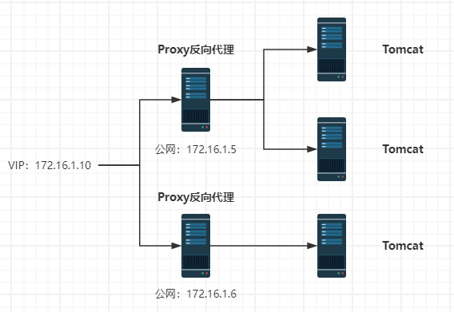
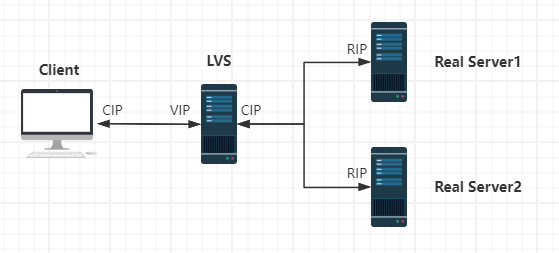

# 第01章_LVS简介

集群高可用有两个方向：横向扩容（scale out）和纵向扩容（scale up），前者指增加集群的节点数，后者指增加单个节点的资源数，如 CPU 和内存。

## 1.集群功能分类

### 1.1 LB（Load Balancing）

负载均衡，用来分发请求到不同的节点，具有一定高可用能力，但不是高可用集群。

#### 1.软件负载均衡

**（1）LVS**

Linux Virtual Server，LVS 是一个在 Linux 内核中实现的负载均衡方案，用于分发网络服务请求到多个服务器上，以提高性能和可靠性。

**（2）HAproxy**

HAproxy 是一个开源的负载均衡器，能够进行 TCP/HTTP 及自定义协议的代理和负载均衡，可以检测服务器的存活，常用于提供**高可用性**和伸缩性。

**（3）Nginx**

Nginx 是一个流行的开源 Web 服务器，提供 HTTP 和 HTTPS 服务，也可用作反向代理服务器和负载均衡器，但通常不会主动执行服务器存活性检测。它以高性能和低消耗资源而闻名，经常用于处理网站流量、处理静态资源和应用程序交付。

#### 2.硬件负载均衡

**（1）F5**

F5 Networks 是一家专门提供应用交付网络技术的公司，用于网络流量管理、负载平衡和应用交付控制。这些设备旨在确保网络服务的高可用性、安全性和性能，通过智能地管理流量分发到服务器上，以提供最佳的用户体验。 F5 Networks 也提供软件解决方案，但其硬件负载均衡设备是该公司的主要产品之一。

**（2）Citrix**

Citrix 提供数字工作空间解决方案，包括虚拟化、网络和云服务，以实现远程办公和安全访问应用程序和数据。

**（3）Nescaler**

Citrix 旗下产品，NetScaler 是由 Citrix 开发的应用交付控制器（ADC），为网络应用提供负载平衡、安全性和加速功能。

**（4）A10**

A10 Networks 是一家提供网络和安全解决方案的公司，他们提供应用交付控制器、DDoS 防护和各种云和安全解决方案。

**（5）深信服**

深信服科技是一家中国科技公司，提供IT基础设施解决方案，包括网络、安全、云计算等多个领域的产品和服务。

#### 3.按负载方式划分

##### 3.1 http重定向

根据用户的 http 请求计算出一个真实的 web 服务器地址，并将该 web 服务器地址写入 http 重定向响应中返回给客户端，由浏览器重定向进行访问。

优点：实现简单

缺点：客户端需要多次请求服务器才能完成一次访问

##### 3.2 DNS负载均衡

DNS 负载均衡是通过 DNS（Domain Name System）来分发流量到不同的服务器或资源。当用户输入 URL 访问特定网站时，DNS 服务器将解析域名并返回与之相关的 IP 地址。负载均衡可以将流量引导到不同的服务器，以分担服务器负载并提高性能。

优点：将负载均衡的任务交给了 DNS，省却了管理维护的成本

缺点：

- DNS 解析是多级解析，每一级 DNS 都可能缓存映射，当某服务器下线后，DNS 服务商无法感知到该服务器的下线，则仍然会把流量打到该服务器
- 无法实现具体的分配负载策略

##### 3.3 反向代理负载均衡

反向代理处于 web 服务器，属于**应用层负载均衡**（七层负载均衡），在这种设置中，反向代理服务器充当前端服务器和客户端之间的中介。当客户端发送请求时，它们会首先到达反向代理服务器，然后反向代理服务器根据预定义的规则和算法将请求转发到后端服务器，这些后端服务器可能是相同或不同的服务器，以实现负载均衡。常见的有 Nginx。

##### 3.4 IP负载均衡

IP 负载均衡器通常位于网络架构的前端，属于**网络层负载均衡**（四层负载均衡），接收传入的网络流量，然后根据预定义的规则和算法将请求分发到多个后端服务器。它使用单一的前端 IP 地址，接收流量并将其转发到多个后端服务器的 IP 地址，从而将负载分散到多个服务器上，避免单个服务器过载，提高整体性能和可用性。常见的有 lvs-nat。

##### 3.5 数据链路层负载均衡

主要指根据 Mac 地址进行负载均衡，负载均衡服务器的 IP 和它所管理的 web 服务群的虚拟 IP 一致。在分发过程中不修改访问地址的 IP 地址，而是修改 Mac 地址。

##### 3.6 F5硬件负载均衡

例如 BIG-IP 系列，设计用于处理大量的网络流量，并根据预定义的规则和算法来分发流量到多个后端服务器。

### 1.2 HA（High Availability）

高可用集群，增加服务可用性，着眼提升服务**始终在线**能力。

衡量可用性：在线时间 / （在线时间 + 故障处理时间）

- `99%`：一年有 3 天不在线
- `99.9%`：一年有 0.3 天不在线
- `99.99%`：一年有 0.03 天不在线

**Keepalived**

Keepalived 是一个开源软件，用于在 Linux 系统上实现高可用性。它可以提供故障转移和负载均衡服务。

### 1.3 HPC（High Performance Computing）

高性能计算集群，通过并行处理和大规模数据处理来提供远超普通计算机性能的计算能力，多用于科学研究领域。

## 2.LVS概述

LVS 工作在一台 server 上提供 Directory（负载均衡）的功能，本身不提供服务，只是把特定的请求转发给对应的 real server，从而实现集群环境中的负载均衡。

### 2.1 工作模式

#### 1.NAT转发模式

Network Address Translation，网络地址转换。

请求处理流程：

- 客户端将请求发往前端的负载均衡器（LVS），请求报文源地址是 Client IP（CIP），目标地址为 Virtual IP（VIP）
- 负载均衡器收到报文后，根据规则将客户端请求报文的目标地址 IP 改为后端真实服务器的 IP（RIP）并将报文发送出去
- 真实服务器收到报文后，处理请求并将响应结果返回给 LVS
- LVS 将该请求返回给客户端

**案例：本机VMware虚拟机模拟**

1. 新建 2 个虚拟网络 Vmnet2、Vmnet3
2. 新建 4 台虚拟机，两两分别分配在 Vmnet2 和 Vmnet3 网络下

#### 2.DR直接路由模式

