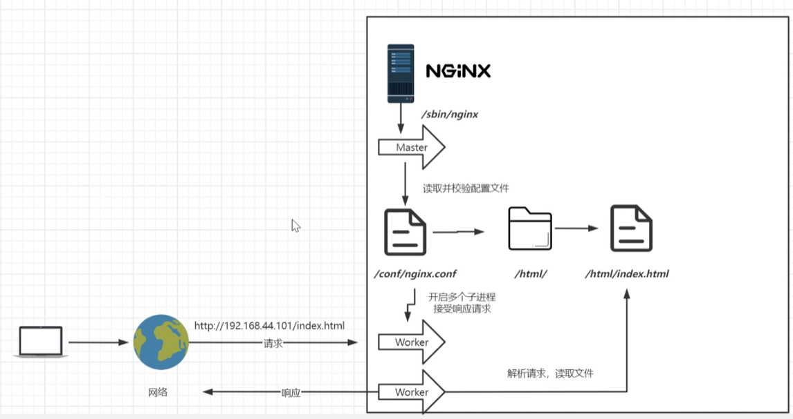
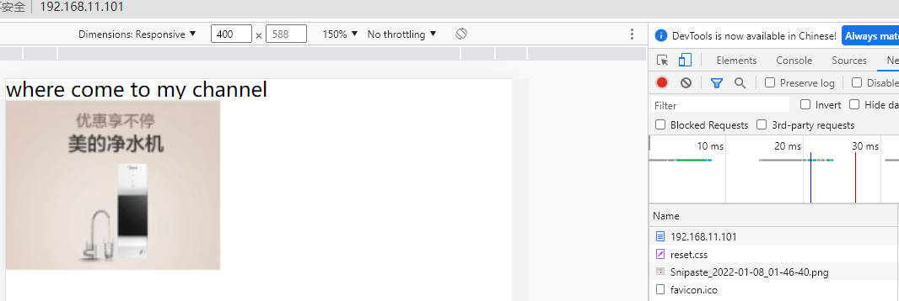

# 第02章_基础使用

## 1.目录结构

进入 Nginx 的主目录我们可以看到这些文件夹

```bash
- nginx
	- client_body_temp
	- conf
	- fastcgi_temp html
	- logs
	- proxy_temp
	- sbin scgi_temp
	- uwsgi_temp
```

其中这几个文件夹在刚安装后是没有的，主要用来存放运行过程中的临时文件

```bash
- client_body_temp
- fastcgi_temp
- proxy_temp
- scgi_temp
```

**conf**

用来存放配置文件相关

**html**

用来存放静态文件的默认目录 html、css 等

**sbin**

nginx 的主程序

**logs**

用来记录每个用户的访问日志，占用会不断增大，需要注意

## 2.基本运行原理

### 2.1 Reactor模型

Nginx 对高并发 IO 的处理使用了 Reactor 事件驱动模型，基本组件包含**事件收集器**、**事件发送器**、**事件处理器** 3 个基本单元，核心思想是将所有要处理的 IO 事件注册到一个中心 IO 多路复用器上，同时主线程阻塞在多路复用器上，一旦有 IO 事件到来或准备就绪（文件描述符或 Socket 可读、可写），多路复用器返回并将事先注册的相应 IO 事件分发到对应的处理器中。

- 事件收集器：负责收集 Worker 进程的各种 IO 请求
  
- 事件发送器：负责将 IO 事件发送到事件处理器

- 事件处理器：负责各种事件的响应工作

事件收集器是基于操作系统提供的"多路 IO 复用"技术（如`select`、`epoll`）将各个连接通道的 IO 事件放入一个待处理事件列，通过事件发送器发送给对应的事件处理器来处理。

> **扩展：C10K**
>
> 网络服务在处理数以万计的客户端连接时往往出现效率低下甚至完全瘫痪，这类问题被称为 C10K 问题，Nginx 由于使用了多路复用技术，完美解决了此类问题。

### 2.2 Nginx的两类进程

一般来说 Nginx 在启动后会以`daemon`方式在后台运行，其后台进程有两类：Master 进程（管理进程）和 Worker 进程。

Nginx 启动方式有两种：

1. 单进程启动
   
   此时系统中仅有一个进程，该进程既充当 Master 管理进程角色，又充当 Worker 工作进程角色。多用于调试。

2. 多进程启动
   
   默认启动方式，此时系统有且仅有一个 Master 管理进程，至少有一个 Worker 工作进程。多用于生产环境，并且 Worker 工作进程的数量和机器 CPU 核数配置不一样多。

   ```bash
   [root@myServer1 nginx]# ps -ef | grep nginx
   root      25192      1  0 21:22 ?        00:00:00 nginx: master process /usr/local/nginx/sbin/nginx -c /usr/local/nginx/conf/nginx.conf
   nobody    25194  25192  0 21:22 ?        00:00:00 nginx: worker process
   ```

#### 1.Master进程

Master 管理进程主要负责调度 Worker 工作进程，比如加载配置、启动工作进程、接受来自外界的信号、向各 Worker 进程发送信号、监控 Worker 进程的运行状态等。

Master 进程还负责创建监听套接口，交由 Worker 进程进行连接监听。



#### 2.Worker进程

Worker 进程主要用来处理网络事件，当一个 Worker 进程在接收一条连接通道后，就开始读取请求、解析请求、处理请求，处理完成产生数据后再返回给客户端，最后断开连接通道。

各个 Worker 进程间相互独立，同等竞争来自客户端的请求，一个请求只可能在一个 Worker 进程中处理。如果启动了多个 Worker 进程，每个 Worker 子进程独自尝试接收已连接的 Socket 监听通道，`accept`操作默认会上锁，优先使用操作系统的共享内存原子锁，如果操作系统不支持，就使用文件上锁。

> **补充**
>
> 经过配置，Worker 进程的接收操作也可以不使用锁，此时当一个连接进来的时候多个 Worker 进程会被同时唤醒，导致惊群问题；而在上锁的情况下，只会有一个 Worker 阻塞在`accept`上，其他的进程会因为不能获取锁而阻塞。

### 2.3 Nginx的模块化设计

Nginx 服务器被分解为多个模块，每个模块都聚焦于一个功能。在 Nginx 的实现中，一个模块包含一系列命令和这些，命令相对应的处理函数。Nginx 的 Worker 进程在执行过程中会通过配置文件的配置指令定位到对应的功能模块的某个命令，然后调用命令对应的处理函数完成相应的处理。


1. **Core 核心模块**
   
   Core 模块为其他模块构建了基本的运行时环境，Nginx 的 Worker 进程首先会调用该模块，其主要负责循环处理事件收集、事件分发和事件处理。具体地说，负责网络请求处理的相关操作，如网络读写、存储读写、内容传输、外出过滤以及将请求发往上游服务器等。

   Nginx 的 Core 模块在启动时一定会被加载，而其他模块只有在解析配置时遇到了这个模块的命令才会加载相应的模块。

2. **标准 HTTP 模块**
   
   提供 HTTP 协议解析相关的功能，比如端口配置、网页编码设置、HTTP 响应头设置等。

3. **可选 HTTP 模块**
   
   主要用于扩展标准 HTTP 模块，让 Nginx 能处理一些特殊的服务，比如 Flash 多媒体传输、网络传输压缩、安全协议 SSL 的支持等。

4. **邮件服务模块**
   
   用于支持 Nginx 的邮件服务，包括对 POP3 协议、IMAP 协议和 SMTP 协议的支持。

5. **第三方模块**
   
   为了扩展 Nginx 服务器的功能，定制开发者自定义功能，比如 JSON 支持、Lua 支持等。

Nginx 的非核心模块可以在编译时按需加入。

## 3.Nginx配置文件与处理流程

一个典型的配置文件如下：

```nginx
worker_processes  1;                              # 启动时创建业务进程的数量，默认为 1，最好跟内核数量一样
error_log logs/error.log debug;                   # 指定 error log 的存储位置和日志级别

events {
    worker_connections  1024;                     # 单个业务进程可接受连接数，默认 1024
}
http {
    include       mime.types;                     # 引入另一个文件，记录了 http mime 类型，例如 text/html
    default_type  application/octet-stream;       # 默认类型，这里表示如果 mime 类型没匹配上，则使用二进制流的方式传输
    sendfile        on;                           # 使用 linux 的 sendfile(socket, file, len) 高效网络传输，也就是数据 0 拷贝
    keepalive_timeout  65;                        # 保持连接时超时的时间
    server {
        listen       80;                          # 监听端口号
        server_name  localhost;                   # 主机名
        root /var/www/;                           # root 指令把"查找文件的根目录"设置为 /var/www，默认为 nginx 的安装目录
        location / {                              # 匹配路径
            # 若想拒绝还可以使用 deny all;
            root   html;                          # 指定文件根目录为 上下文目录（默认为 nginx 安装目录）下的 html，具有更高优先级，会覆盖 /var/www/
            # 默认页名称
            index  index.html index.htm;
        }
        error_page   500 502 503 504  /50x.html;  # 报错编码对应页面
        location = /50x.html {
            root   html;
        }
    }
}
```

### 3.1 配置文件上下文结构

一个 Nginx 配置文件包含若干配置项，每个配置项由**配置指令**和**指令参数**两部分组成，可以简单认为配置项是一个键-值对。


配置文件中的配置指令如果包含空格，就需要使用单引号或双引号引起来。指令参数如果是由简单的字符串构成，简单配置项就需要以分号结束；如果是复杂的多行字符串，配置项就需要用花括号`{}`括起来。

Nginx 配置项的具体功能与其所处的作用域强相关，Nginx 指令的作用域配置块大致有 5 种，其层次关系如下：

```bash
main
 |
 |--http
 |   |
 |   |--server
 |        |
 |        |--location
 |--main
```

一个标准的 Nginx 配置文件的上下文结构如下：

```nginx
...                         # main 全局配置块，如工作进程数，错误日志等


events {                    # events 事件处理模式配置块，例如 IO 读写模式、连接数等
}


http {                      # HTTP 协议配置块
  ...                       # HTTP 协议的全局配置
  server {                  # server 虚拟服务器配置块一
    ...                     # server 全局配置
    location [PATTERN] {    # location 路有规则配置块一
    }
    location [PATTERN] {    # location 路有规则配置块二
    }
  }

  server {                  # server 虚拟服务器配置块二
  }

  ...                       # 其他 HTTP 协议的全局配置
}


mail {                      # mail 服务配置块
  ...                       # mail 相关协议配置，如 SMTP/IMAP/POP3
}
```

- **main 全局配置块**
  
  配置影响 Nginx 全局的指令，一般有运行 Nginx 服务器的用户组、Nginx 进程 PID 存放路径、日志存放路径、配置文件引入、允许生成的 Worker 进程数等。

2. **events 事件处理模式配置块**
   
   配置 Nginx 服务器的 IO 多路复用模型、客户端的最大连接数限制等。Nginx 支持多种 IO 多路复用模型，可以使用`use`指令在配置文件中设置 IO 读写模型。

3. **HTTP 协议配置块**
   
   可以配置与 HTTP 协议处理相关的参数，比如`keepalive`长连接参数、GZIP 压缩参数、日志输出参数、mime-type 参数，连接超时参数等。

4. **server 虚拟服务器配置块**
   
   配置虚拟主机的相关参数，如主机名称、端口等。一个 HTTP 协议配置块中可以有多个 server 虚拟服务器配置块。

5. **location 路由规则块**
   
   配置客户端请求的路由匹配规则以及请求过程中的处理流程。一个 server 虚拟服务器配置块中一般会有多个 location 路由规则块。

6. **mail 服务配置块**
   
   Nginx 为 email 相关协议（SMTP/IMAP/POP3）提供反向代理时，mail 服务配置块负责配置一些相关的配置项。

以上介绍的 Nginx 配置块主要针对的是 Nginx 基本应用程序配置文件，包括基本配置文件在内，Nginx 的常用配置文件大致有下面这些：

- nginx.conf：应用程序基本配置文件

- mime.types：与 MIME 类型关联的扩展配置文件

- fastcgi.conf：与 FastCGI 相关的配置文件

- proxy.conf：与 Proxy 相关的配置文件

- sites.conf：单独配置 Nginx 提供的虚拟机主机

### 3.2 Nginx请求处理流程

Nginx 中 HTTP 请求的处理流程可以分为 4 步：

1. 读取解析请求行

2. 读取解析请求头

3. 多阶段处理，即执行 handler 处理器列表

4. 将结果返回给客户端

在完成第一步读取请求行和第二部读取请求头之后，Nginx 将整个请求封装到了一个请求结构体`ngx_http_request_t`实例中，然后进入第三步多阶段处理，执行 handler 处理器列表。列表中的每个 handler 处理器都会对请求对象进行处理，例如重写 URI、权限控制、路径查找、生成内容以及记录日志等。handler 处理器的执行次序除了和配置文件中对应指令的配置顺序相关外，还和指令所处的阶段先后次序相关。

类似于 Nginx 将所有的业务处理器装配成一条处理器的流水线 pipeline，Nginx 把第三步请求处理流程划分成了 11 个阶段，每个阶段都涉及一些 handler 处理器。HTTP 请求到来时，这些组装在一个列表的 handler 处理器会按组装的先后次序执行。


第三方模块的处理器都在不同的处理阶段注册。

### 3.3 详解请求处理的11个阶段

11 个阶段中，有些阶段是必备的，有些是可选的，各个阶段可以允许多个模块的指令同时注册。但是 find-config、post-rewrite、post-access、try-files 四个阶段是不允许其他模块的处理指令注册的，它们仅注册了 HTTP 框架自身实现的几个固定的方法。同一个阶段内的指令，Nginx 会按照各个指令的**上下文顺序**执行对应的 handler 处理器方法。

#### 1.post-read

进入多阶段后第一个就是 post-read 阶段，注册在该阶段的处理器不多，标准模块的`ngx_realip`处理器就注册在这个阶段，用途是改写请求的来源地址。

> **扩展：为何要改写请求的来源地址？**
>
> 当 Nginx 处理的请求经过了某个正向代理服务器（Nginx、CDN）的转发户，请求中的 IP 地址（`$remote_addr`）可能就不是客户端的真实 IP 了，而是下游代理服务器的 IP。在下游的正向代理服务器会把请求的原始来源地址编码成某个特殊的 HTTP 请求头，此时在 Nginx 中就会把这个请求头中编码的地址恢复出来，然后传给 Nginx 后面的上游服务器。`ngx_realip`模块就是用来处理这个需求的。

下面是一个简单的例子，假定前面的正向代理服务器能将客户端 IP 编码成某个特殊的 HTTP 请求头（如 X-My-IP），Nginx 就可以通过 `ngx_realip` 模块的 `real_ip_header` 指令将 X-My-IP 请求头的 IP 取出，作为请求中的 IP 地址（`$remote_addr`）。

```nginx
server {
    listen 8080;
    set_real_ip_from 192.168.0.100;
    real_ip_header X-My-IP;
    location /test {
        echo "from: $remote_addr";
    }
}
```

这里的配置是让 Nginx 把来自正向代理服务器 192.168.0.100 的所有请求的 IP 来源地址都改写为请求头 X-My-IP 所指定的值，放在`$remote_addr`内置标准变量中。

#### 2.server-rewrite

请求地址重写阶段。在进行请求 URI 与 location 路由规则匹配之前可以修改请求的 URI 地址。大部分直接配置在 server 配置块中的配置项都运行在 server-rewrite 阶段。

```nginx
server {
    listen 8080;
    set $a hello; # server-rewrite 阶段运行
    location /test {
        set $b "$a, world";
        echo $b;
    }
    set $b hello; # server-rewrite 阶段运行
}
```

#### 3.find-config

server-rewrite 阶段后面的是 find-config 阶段，即配置查找阶段，主要功能是根据请求 URL 地址去匹配 location 路由表达式。

find-config 阶段由 Nginx HTTP Core（`ngx_http_core_module`）模块全部负责，完成当前请求 URL 与 location 配置块之间的配对工作，这个阶段不支持 Nginx 模块注册处理程序。

在 find-config 阶段前，客户端请求并没有与任何 location 配置块相关联。因此，对于运行在此之前的 post-read 和 server-rewrite 阶段来说，只有 server 配置块以及更外层作用域中的配置项才会起作用，location 配置块中的配置项不起作用。

#### 4.rewrite

由于 Nginx 已经在 find-config 阶段完成了当前请求与 location 的匹配，因此从 rewrite 阶段开始，**location 配置块**中的指令就可以产生作用。

rewrite 阶段也叫做请求地址重写阶段，注册在 rewrite 阶段的指令首先是`ngx_rewrite`模块的指令，比如`break`、`if`、`return`、`rewrite`、`set`等。其次，第三方`ngx_lua`模块中的`set_by_lua`指令和`rewrite_by_lua`指令也能在此阶段注册。

#### 5.post-rewrite

请求地址 URI 重写提交阶段，防止递归修改 URI 造成死循环（一个请求执行 10 次就会被 Nginx 认定为死循环），该阶段只能由 Nginx HTTP Core（`ngx_http_core_module`）模块实现。

#### 6.preaccess

访问权限检查准备阶段，控制访问频率的`ngx_limit_req`模块和限制并发度的`ngx_limit_zone`模块的相关指令就注册在此阶段。

#### 7.access

在访问权限检查阶段，配置指令多是执行访问控制类型的任务，比如检查用户的访问权限、检查用户的来源 IP 地址是否合法等。在此阶段能注册的指令有：HTTP 标准模块`ngx_http_access_module`的指令、第三方`ngx_auth_request`模块的指令、第三方`ngx_lua`模块的`access_by_lua`指令等。

比如 `deny`和`allow`指令属于`ngx_http_access_module`模块，它的使用示例如下：

```nginx
server {
    ...
    # 拒绝全部，被拒绝的请求会响应 403 错误
    location = /denyall {
        deny all;
    }

    # 只允许来源 IP 属于 192.168.0.0.24 网段或 127.0.0.1 的请求
    location = /allowsome {
        allow 192.168.0.4/24;
        allow 127.0.0.1;
        deny all;
        echo "you are ok";
    }
    ...
}
```

如果同一个 location 快配置了多个`allow/deny`配置项，access 阶段的配置项之间按配置的先后顺序匹配，匹配成功一个便跳出。上面的例子中，如果客户端源 IP 是 127.0.0.1，则匹配到`allow 127.0.0.1;`，配置项后就不再匹配后面的`deny all;`，即该请求不会被拒绝。如果这些配置项的指令来自不同的模块，则每个模块会执行一个访问控制类型的指令。

> **注意**
>
> `echo`指令用于返回内容，在 location 上下文中，该指令注册在 content 生产阶段。由于`echo`指令不是注册在 access 阶段，因此在 access 阶段不执行该指令的配置项。

#### 8.post-access

访问权限检查提交阶段。如果请求不被允许访问 Nginx 服务器，该阶段就负责**向用户返回错误响应**。在 access 阶段可能存在多个访问控制模块的指令注册，post-access 阶段的`satisfy`配置指令可以用于控制它们彼此之间的协作方式。下面是一个简单的示例：

```nginx
# satisfy 指令进行协调
location = /satisfy-demo {
    satisfy any;
    access_by_lua "ngx.exit(ngx.OK)";
    deny all;
    echo "you are ok";
}
```

在上面的例子中，`deny`指令属于 HTTP 标准模块的`ngx_http_access_module`访问控制模块，而`access_by_lua`指令属于第三方`ngx_lua`模块，两个模块都有自己的计算结果，需要经过最终的结果统一。

这里的`satisfy`指令负责统一不同访问控制模块的计算结果，有两种统一的方式：

1. 逻辑或操作：`satisfy any`，表示访问控制模块间只要任意一个通过验证就算通过

2. 逻辑与操作：`satisfy all`，表示所有访问控制模块都通过验证才能最终通过。

#### 9.try-files

如果 HTTP 请求访问静态文件资源，则 try-files 配置项可以使这个请求按顺序访问多个静态文件资源，直到某个静态文件资源符合选取条件。这个阶段只有一个标准配置指令`try-files`，并不支持 Nginx 模块注册处理程序。

`try-files`接收两个以上任意数量的参数，每个参数都指定了一个 URI，Nginx 会在 try-files 阶段依次把前 N-1 个参数映射为文件系统上的对象（文件或者目录），然后检查这些对象是否存在。若 Nginx 发现某个文件系统对象存在则查找成功，进而在 try-files 阶段把当前请求的 URI 改写为该对象所对应的参数 URI（但不会包含末尾的斜杠字符，也不会发生内部跳转）。如果前 N-1 个参数所对应的文件系统对象都不存在，try-files 阶段就会立即发起**内部跳转**，跳转带最后一个参数（第 N 个参数）所指定的 URI。

下面是一个示例：

```nginx
# root 指令把"查找文件的根目录"设置为 /var/www
root /var/www/;

location = /try_files-demo {
    try_files /foo /bar /last;
}

# 对应 try_files 的最后一个 URI
location /last {
    echo "uri: $uri";
}
```

这里 try-files 会在文件系统查找前两个参数对应的文件 /var/www/foo 和 /var/www/bar 所对应的文件是否存在。如果存在则返回文件；如果不存在，此时 Nginx 就会在 try-fils 阶段发起到最后一个参数所指定的 URI(/last) 的内部跳转（客户端的显示 URI 不会变化）。

#### 10.content

大部分 HTTP 模块会介入内容产生阶段，是所有请求处理阶段中重要的阶段。Nginx 的`echo`指令、第三方`ngx_lua`模块的`content_by_lua`指令都注册在此阶段。

> **注意**
>
> 每个 location 只能由一个内容处理程序。当在 location 中同时使用多个模块的 content 阶段指令时，只有一个模块能成功注册为内容处理器。例如`echo`和`content_by_lua`同时注册时最终只会有一个生效，但具体哪一个生效则不稳定。

#### 11.log

日志模块处理阶段记录日志。


## 4. 基础配置

### 4.1 events事件驱动配置

一个典型的 events 事件模型配置块的示例如下：

```nginx
events {
    use epoll;                  # 使用 epoll 类型的 IO 多路复用模型
    worker_connections 204800;  # 最大连接数限制
    accept_mutex on;            # 各个 Worker 通过锁来获取新连接
}
```

#### 1.worker_connections

`worker_connections`指令用于配置每个 Worker 进程能够打开的最大并发连接数量，指令参数为连接数的上限。

#### 2.use

`use`指令用于配置 IO 多路复用模型，常用的有 `epoll`、`select` 两种。

Linux 系统下，`select`类型 IO 多路复用模型有两个较大的缺陷：

1. 单服务进程并发数不够，默认最大的客户端连接数为 1024/2048，因为 Linux 系统一个进程所打开的 FD 文件描述符是有限制的，可通过宏 `FD_SETSIZE` 进行设置，默认值是 1024/2048，因此 `select` 模型的最大并发数被限制了。

2. 性能不足，每次 IO 事件查询都会线性扫描全部的 FD 集合，连接数越大，性能越会线性下。

在 Linux 系统下建议使用 `epoll` 类型的 IO 多路复用模型。`epoll` 模型是在 Linux 2.6 内核中实现，是 `select` 系统调用的增强版本。`epoll` 模型中有专门的 IO 就绪队列，不再像 `select` 模型一样进行全体连接扫描，时间复杂度从 `select` 模型的 O(n) 下降到了 O(1)。在 IO 事件的查询效率上，无论上百万连接还是数十个连接，对于 `epoll` 模型而言差距是不大的；而对 `select` 模型而言效率差距就非常显著了。

`select`、`epoll` 本质上都是查询多个 FD 描述符，一旦某个描述符的 IO 事件就绪（一般是读就绪或写就绪）就进行相应的读写操作，而且都是在读写事件就绪后，应用程序自己负责进行读写。所以 `select` 和 `epoll` 本质上都是同步 I/O，因为它们的读写过程是阻塞的。虽然不是异步 I/O，但通过合理设计，`epoll` 类型的 IO 多路复用模型性能是非常高的。

如果没有配置 IO 多路复用模型，在 Windows 平台下 nginx 默认的模型是 `select`，在 Linux 下默认是 `epoll`。可通过设置 error_log 的日志级别为 debug 来查看：

```nginx
worker_processes 1;
error_log logs/error.log debug;
...
```

启动 nginx 后查看 error_log 日志：

```bash
2023/12/16 10:25:50 [notice] 69116#69116: using the "epoll" event method
```

#### 3.accept_mutex

`accept_mutex` 指令用于配置各个 Worker 进程是否通过互斥锁有序接收新的连接请求。`on` 参数表示各个 Worker 通过互斥锁有序接收新请求；`off` 参数指每个新请求到达时会唤醒所有的 Worker 进程参与争抢，但只有一个进程可获得连接。

由于 `off ` 参数会造成"惊群"问题影响性能。`accept_mutex` 默认为 `on`。

### 4.2 虚拟主机配置

配置虚拟主机可使用 `server` 指令。

#### 1.监听套接字配置

虚拟主机套接字配置使用 `listen` 指令，具体的配置有多种形式：

1. 使用 `listen` 指令直接配置监听端口
   
   ```nginx
   server {
       # 监听所有可用的网络接口（包括本地网络和外部网络）
       listen 80;
       ...
   }
   ```

2. 使用 `listen` 指令配置监听的 IP 和端口
   
   ```nginx
       # 监听本地回环的 80 端口，只有本地可以发起请求
       listen 127.0.0.1:80;
       ...
   ```

#### 2.虚拟主机名称配置

虚拟机主机名称配置可使用 `server_name` 指令。演示示例如下：

```nginx
server {
    listen 80;
    server_name admin.demo.com;

    location / {
        default_type 'text/html';
        charset utf-8;
        echo "this is admin server";
    }
}

server {
    listen 80;
    server_name file.demo.com;
    
    location / {
        default_type 'text/html';
        charset utf-8;
        echo "this is file server";
    }
}

server {
    listen 80;
    server_name demo.com *.demo.com;

    location / {
        default_type 'text/html';
        charset utf-8;
        echo "this is default server";
    }
}
```

当然客户端要能通过域名服务器或者本地 hosts 文件解析出域名对应的服务器 IP。在`/etc/hosts`中添加以下映射规则：

```bash
127.0.0.1 admin.demo.com file.demo.com other.demo.com
```

重启 Nginx，访问域名：

```bash
[root@localhost logs]# curl domain.demo.com
this is admin server
[root@localhost logs]# curl file.demo.com
this is file serve
[root@localhost logs]# curl other.demo.com
this is default serve
```

多个虚拟主机之间匹配优先级**与位置无关**，与使用的匹配规则有关，从高到低大致如下：

1. 字符串精确匹配
   
   如果请求的域名为 `admin.demo.com` 则首先会匹配到名称为 `admin.demo.com` 的虚拟管理主机。

2. 左侧*通配符匹配
   
   若浏览器请求的域名为 `other.demo.com` 则会匹配到 `*.demo.com` 虚拟主机。因为配置文件中并没有 `server_name` 为 `other.demo.com` 的主机。

3. 右侧*通配符匹配
   
   右侧*通配符和左侧*通配符匹配类似，优先级低于左侧*通配符。

4. 正则表达式匹配
   
   以符号 `~` 开头表示开启正则匹配，优先级更低。

5. `default_server`
   
   在 `listen` 指令后面如果带有 `default_server` 的指令参数，就代表这是默认的、最后兜底的虚拟主机：
   
   ```nginx
   listen 8080 default_server;
   ```
   
   如果没有配置 `defult` 且都没有匹配上，则会优先访问第一个 `server` 站点。因此配置该选项并不能阻止远程访问。

#### 3.错误页面配置

错误页面的配置指令为 `error_page`，格式如下：

```nginx
error_page code ... [=[response]] uri;
```

`code`表示响应码，可以同时配置多个；`uri`表示错误页面，一般为服务器上的静态资源页面。例如，下面的例子分别为 404 和 500 等错误码设置了错误页面：

```nginx
server {
    listen 80;
    server_name admin.demo.com;
    root /var/www/;

    location / {
        default_type 'text/html';
        charset utf-8;
        echo "this is admin server";
    }

    # 设置错误页面
    error_page 404 /404.html;
    # 需要创建文件名为 50x 的 html 文件
    error_page 500 502 503 504 /50x.html;
}
```

为了防止 404 页面被劫持，也就是被前面的代理服务器换掉，可以修改响应状态码：

```nginx
error_page 404 =200 /404.html
```

`error_page` 指令除了可用于 `server` 上下文外，还可用于 `http`、`location`、`if in location` 等上下文。

#### 4.长连接相关配置

配置长连接的**有效时长**可使用 `keepalive_timeout` 指令，格式如下：

```nginx
keepalive_timeout timeout [header_timeout];
```

配置项中的 `timeout` 参数用于设置保持连接超时时常，0 表示禁止长连接，默认为 75 秒。

如果要配置长连接的**一条连接允许的最大请求数**，那么可以使用 `keepalive_requests` 指令，格式如下：

```nginx
keepalive_requests number;
```

配置项中的 `number` 参数用于设置在一条长连接上允许被请求的资源的最大数量，默认 100.

如果要配置向客户端发送响应报文的**超时时限**，可以使用下面的指令：

```nginx
send_timeout time;
```

配置项中的 `time` 参数用于设置 Nginx 向客户端发送响应报文的超时时限，此处时长是指**两次向客户端写操作之间的间隔时长**，并非整个响应过程的传输时长。

#### 5.访问日志配置

Nginx 将客户端的访问日志信息记录到指定的日志文件中，用于后期分析用户的浏览行为等，此功能由 `nginx_http_log_module` 模块负责，其指令在 HTTP 处理流程的 log 阶段执行。

访问记录配置指令的完整格式如下：

```nginx
access_log path [format [buffer=size] [gzip[=level]] [flush=time] [if=condition]];
```

其中，`path` 表示日志文件的本地路径；`format` 表示日志输出的格式名称。定义日志输出格式的配置指令为 `log_format`，它的完整格式如下：

```nginx
log_format name string ...;
```

其中，`name` 参数用于制定格式名称；`string` 参数用于设置格式字符串，可以有多个。字符串中可以使用 Nginx 核心模块以及其他模块的内置变量。

下面是一个比较完整的例子：

```nginx
http {
    # 先定义日志格式，format_main 是日志格式的名字
    log_format format_main '$remote_addr - $remote_user [$time_local] $request - $status - $body_bytes_sent [$http_referer] [$http_user_agent] [$http_x_forwarded_for]';

    # 配置：日志文件、访问日志格式
    access_log logs/access_main.log format_main;
}
```

修改配置后需要重启 Nginx。然后在浏览器访问 `http://domain.demo.com/demo/hello`，在 access_main.log 文件中可以看到一条新增的日志记录：

```bash
192.168.11.30 - - [17/Dec/2023:07:16:57 -0800] GET /favicon.ico HTTP/1.1 - 200 - 17 [http://domain.demo.com/demo/hello] [Mozilla/5.0 (Windows NT 10.0; Win64; x64) AppleWebKit/537.36 (KHTML, like Gecko) Chrome/109.0.0.0 Safari/537.36] [-]
```

- `$request`：记录用户的 HTTP 请求的起始行信息

- `$status`：记录 HTTP 响应状态码

- `$remote_addr`：记录访问网站的客户端地址

- `$remote_user`：记录远程客户端用户名称

- `$time_local`：记录访问时间与时区

- `$body_bytes_sent`：记录服务器发送给客户端的响应 body 字节数

- `$http_referer`：记录此次请求是从哪个链接访问过来的，可以根据其进行盗链的监测

- `$http_user_agent`：记录客户端访问信息，如浏览器、手机客户端等

- `$http_x_forwarded_for`：当前端有正向代理服务器时，此参数用于保持客户端真是的 IP 地址。但该参数生效的前提是，前端的代理服务器上配置了 `x_forwarded_for`。

#### 6.核心模块内置变量

Nginx 核心模块 `ngx_http_core_module` 中定义了一系列存储 HTTP 请求信息的变量，例如 `$http_user_agent`、`$http_cookie` 等。这些内置变量在 Nginx 配置过程中使用较多。

- `$arg_PARAMETER`
  
  请求 URL 中以 PARAMETER 为名称的参数值。请求参数即 URL 的 "?" 号后面的 `name=value` 形式的参数对，变量 `$arg_name` 得到的值为 value。

  另外，`$arg_PARAMETER` 中的参数名称不区分字母大小写，Nginx 会在匹配参数名之前自动把原始请求中的参数名调整为全部小写的形式。

- `$args`
  
  请求 URL 中的整个参数串，作用与 `$query_string` 相同。

- `$binary_remote_addr`
  
  二进制形式的客户端地址。

- `$body_bytes_sent`
  
  传输给客户端的字节数，响应头不计算在内。

- `$bytes_sent`
  
  传输给客户端的字节数，包括响应头和响应体。

- `$content_length`
  
  等同于 `$http_content_length`，用于获取请求体 body 的大小，指的是 Nginx 从客户端收到的请求头中 Content-length 字段的值，不是发送给客户端响应中的值。如果要获取响应中的 Content-Length 字段值，需要使用 `$sent_http_content_length`。

- `$request_length`
  
  请求的字节数（包括请求行、请求头和请求体）。注意，由于 `$request_length` 是请求解析过程中不断累加的，如果解析请求时出现异常，则 `$request_length` 是已经累加部分的长度，并不是 Nginx 从客户端收到的完整请求的总字节数。

- `$connection`
  
  TCP 连接的序列号。

- `$connection_requests`
  
  TCP 连接当前的请求数量。

- `$content_type`
  
  请求中的 Content-Type 请求头字段值。

- `$cookie_name`
  
  请求中名称 name 的 cookie 值。

- `document_root`
  
  当前请求的文档根目录或别名。

- `$uri`
  
  当前请求中的 URI（不带请求参数，参数在 `$args` 变量中）。`$uri` 变量值不包括主机名，例如 "/foo/bar.html"。此参数可以修改，通过内部重定向。

- `$request_uri`
  
  包含客户端请求参数的原始 URI，不包括主机名，此参数不可以修改，例如 "/foo/bar.html?name=value"。

- `$host`
  
  请求的主机名。优先级为：HTTP 请求行的主机名 > HOST 请求头字段 > 符合请求的服务器名。

- `$http_name`
  
  名称为 name 的请求头的值。如果实际请求头 name 中包含中画线 "-"，那么需要将中画线替换为下画线 "_"；如果实际请求头 name 中包含大写字母，那么可以替换为小写字母。例如获取 Accept-Language 请求头的值，变量名称为 `$http_accept_language`。

- `$msec`
  
  当前的 UNIX 时间戳。UNIX 时间戳是从 1970 年 1 月 1 日（UTC/GMT 的午夜）开始所经过的秒数，不考虑闰年。

- `$nginx_version`
  
  获取 Nginx 版本。

- `$pid`
  
  获取 Worker 工作进程的 PID。

- `$proxy_protocol_addr`
  
  代理访问服务器的客户端地址，如果是直接访问则该字段为空。

- `$realpath_root`
  
  当前请求的文档根目录或别名的真实路径，会将所有符号连接转换为真实路径。

- `$remote_addr`
  
  客户端请求地址。

- `$remote_port`
  
  客户端请求端口。

- `$request_body`
  
  客户端请求主体。此变量可在 `location` 中使用，将请求主体通过 `proxy_pass`、`fastcgi_pass`、`uwsgi_pass` 和 `scgi_pass` 传递给下一级的代理服务器。

- `$request_completion`
  
  如果请求成功则为 OK；如果请求未完成或者请求不是一个范围请求的最后一部分，则该值为空。

- `$request_filename`
  
  当前请求的文件路径，由 `root` 或者 `alias` 指令与 URI 请求结合生成。

- `$request_length`
  
  请求的长度，包括请求的地址、HTTP 请求头和请求主体。

- `$request_method`
  
  HTTP 请求方法，比如 GET 或 POST 等。

- `$request_time`
  
  处理客户端请求使用的时间，从读取客户端的第一个字节开始计时。

- `$scheme`
  
  请求使用的 Web 协议，如 HTTP 或 HTTPS。

- `$sent_http_name`
  
  设置任意名称为 name 的 HTTP 响应头字段。例如，如果需要设置响应头 Content-length，那么将 "-" 替换为 "_"，大写字母替换为小写字母，变量为 `$sent_http_content_length`。

- `$server_addr`
  
  服务器端地址为了避免访问操作系统内核，应将 IP 地址提前设置在配置文件中。

- `$server_name`
  
  虚拟主机的服务器名。

- `$server_port`
  
  虚拟主机的服务器端口。

- `$server_protocol`
  
  服务器的 HTTP 版本，通常为 HTTP/1.0 或 HTTP/1.1。

- `$status`
  
  HTTP 响应码。

### 4.3 location路由规则配置详解

#### 1.location语法详解

Nginx 配置文件中，`location` 配置项的语法格式如下：

```nginx
location  [=|~|~*|^~]  模式字符串  {
 ... 
}
```

按照匹配的符号不同，`location` 路由匹配主要分成**精准匹配**、**普通匹配**、**正则匹配**、**默认根路径匹配**。

1. **精准匹配**

   精准匹配的符号标记为 “`=`”，下面是一个简单的精准匹配 `location` 的例子：

   ```nginx
   location = /lua {
       echo  "hit location: =/Lua";
   }
   ```

   如果请求 URI 和精准匹配的模式字符串 /lua 完全相同，那么精准匹配通过。在所有的匹配类型中，精准匹配的**==优先级最高==**。

2. **普通匹配**（默认）

   普通匹配的符号标记为 “`^~`”（可不指定），下面是一个简单的普通匹配 `location` 的例子：

   ```nginx
   #普通匹配一
   location ^~  /lua {
         echo  "普通匹配:  ^~  /lua";
   }
   
   #普通匹配二, 长一点
   location  ^~  /lua/long  {
         echo  "普通匹配:  ^~  /lua/long";
   }
   ```

   普通匹配属于字符串前缀匹配，详细来说：如果请求路径 URI 头部匹配到 `location` 的模式字符串，那么匹配成功。如果匹配到多个前缀，那么**==最长模式匹配优先==**。

   由于 `location` 不能严格重复，因此例如定义如下两个 `location` 则会报错：

   ```nginx
   # 不带类型符号, 默认为普通匹配
   location   /demo {
         echo  "hit location: /demo ";
   }
   
   # 带“^~”符号, 普通匹配
   location  ^~  /demo {
         echo  "hit location: ^~ /demo";
   }
   ```

   启动会报错：

   ```bash
   ... 17:33:39 [emerg] 18760#25944: duplicate location "/demo" in .../nginx-location-demo.conf:115
   ```

3. **正则匹配**

   正则匹配的类型按照类型符号的不同可以细分为以下 4 种：

   - `~`：标准正则匹配，**区分**字母大小写，进行正则表达式测试，若测试成功，则匹配成功
   - `~*`：标准正则匹配，**不区分**字母大小写，进行正则表达式测试，若测试成功，则匹配成功
   - `! ~`：反向正则匹配，**区分**字母大小写，进行正则表达式测试，若测试不成功，则匹配成功
   - `! ~*`：反向正则匹配，**不区分**字母大小写，进行正则表达式测试，若测试不成功，则匹配成功

   下面是一个正则匹配的例子，可以匹配以 hello.php 或 hello.asp 结尾的 URL 请求：

   ```nginx
   location ~*hello\.(php|asp)$ {}
   ```

   如果配置文件中存在多个正则匹配 `location`，那么它们之间的规则是**==顺序优先==**的，只要匹配到第一个正则类型的 `location`，就停止后面的正则类型的 `location` 测试。

4. **默认根路径匹配**

   根路径的路径规则就是使用单个 “`/`” 符号，示例如下：

   ```nginx
   location  /  {
     echo "默认根路径匹配: /";
   }
   ```

   表面看上去，`location /{...}` 根路径匹配非常类似普通匹配，但实际上该规则自成一类，虽然只有唯一的一个路径，但是此类规则优先级是==**最低**==的。

#### 2.location匹配次序

1. 类型之间的优先级：精准匹配>普通匹配>正则匹配>“`/`” 默认根路径匹配
2. 普通匹配同类型 `location` 之间的优先级为**==最长前缀优先==**；普通匹配的优先级与 `location` 在配置文件中所处的==**先后顺序无关**==，而与匹配到的==**前缀长度有关**==
3. 正则匹配同类型 `location` 之间的优先级为**==顺序优先==**。只要匹配到第一个正则规则的 `location`，就停止后面的正则规则的测试。正则匹配与 `location` 规则定义在配置文件中的==**先后顺序强相关**==

#### 3.常用的location路由配置

第一个应该配置的属于 “`/`” 根路由规则。“`/`” 根路由规则可以路由到一个静态首页：

```nginx
location  / {
	root   html;
	index  index.html index.htm;
}
```

表示在请求 URI 匹配到 “`/`” 根路由规则时，首先 Nginx 会在 `html` 目录下查找 `index.html` 文件，如果没有找到，就查找 `index.htm` 文件，将找到的文件内容返回给客户端。

> **扩展：alias 与 root**
>
> ```nginx
> location /html {
> 	alias /usr/local/nginx/html;
> 	index index.html index.htm;
> }
> ```
>
> `root` 用来设置根目录，不带 `"/"` 前缀时表示从 nginx 根目录开始，带 `"/"` 时表示从系统根目录开始，同时查找时会在路径上带上 `location`。而`alias` 只接受根目录参数，在接受请求的时候在路径上不会加上 `location`。
>
> - alias 指定的目录是准确的，即 location 匹配访问的 path 目录下的文件直接是在 alias 目录下查找的
>
> - root 指定的目录是 `location` 匹配访问的 path 目录的上一级目录，这个 path 目录一定要是真实存在 root 指定目录下的
>
> - 对于两者：
>
>   - location 匹配的 path 目录如果后面不带 `/`（/html），那么访问的 url 地址中这个 path 目录后面不加 `/` 也可以，此时访问时会再发起一次 301 重定向加上 `/`。
>
>   - 如果 location 匹配的 path 目录后面加上 `/`（/html/），访问时不会发起重定向加上 `/`，因此访问的 url 地址最后必须要加上 `/`（`http://host/html/`），否则 404，不过一般情况下浏览器会帮忙加。
>
>     如果此时使用 alias 的话，alias 路径最后也必须加上 `/`（/usr/loca/nginx/html/）否则 403，root 路径不需要（`.` 就行）。
>
> 总结：`location` 最后最好不要加 `/`。

“`/`” 根路由规则也可以路由到一个访问很频繁的上游服务，比如 Spring Cloud 微服务架构中的服务网关：

```nginx
location  / {
      proxy_pass http://127.0.0.1:7799/;
}
```

这里的 `127.0.0.1：7799` 假定为网关的 IP 和端口，当请求匹配到 “`/`” 根路由规则时，将直接转发给上游应用网关服务器。

第二个应该配置的属于**静态文件路由规则**。对静态文件请求进行响应，这是 Nginx 作为 HTTP 服务器的强项。静态文件匹配规则有两种配置方式：目录匹配（前缀匹配）和后缀匹配（正则匹配），可以任选其一，也可以搭配使用。

1. **目录匹配**

   ```nginx
   location ^~  /static {
   	root  /www/resources;       # 默认是 html，如果不自定义的话则会去 nginx 的安装目录下的 html/static 找相应的文件
   }
   ```

   所有匹配 `/static/...` 规则的静态资源请求（如 `demo.com/static/hello.html`）都将路由到 `root` 指令所配置的文件目录 `/www/resources/static/` 下对应的某个文件，（如 `/www/resources/static/` 下的 `hello.html`）。即找文件时会在 `location` 的地址 `/static` 前拼接 `root` 指令的地址 `/www/resources`。

2. **后缀匹配**

   ```nginx
   location ~*\.(gif|jpg|jpeg|png|css|js|ico)$ {
   	root /www/resources/;
   }   
   ```

   所有匹配到以上正则规则的静态资源请求（如 `demo.com/static/img/2.png`）都将路由到 `root` 指令所配置的文件目录 `/www/resources/static/` 下对应的某个文件（如 `/www/resources/` 下的 `static/img/2.png`）。


### 4.4 rewrite模块指令

Nginx 的 `rewrite` 模块即 `ngx_http_rewrite_module` 标准模块，主要功能是重写请求 URI，也是 Nginx 默认安装的模块。`rewrite` 模块会根据 `PCRE` 正则匹配重写URI，然后根据指令参数或者发起**内部跳转**再一次进行 `location` 匹配，或者直接进行 **30x 重定向**返回客户端。

#### 1.set指令

`set` 指令是由 `ngx_http_rewrite_module` 标准模块提供的，用于向变量存放值。在 `Nginx` 配置文件中，变量只能存放**字符串**。

`set` 指令的配置项格式如下：

```nginx
set $variable  value;
```

> **注意**
>
> 在 Nginx 配置文件中，变量定义和使用都要以 `$` 开头。所有的 Nginx 变量在引用时必须带上 `$` 前缀。另外，Nginx 变量不能与 Nginx 服务器预设的全局变量同名。

比如，我们的 nginx.conf 文件中有下面这一行配置：

```nginx
set  $a  "hello world";
```

上面的语句中，`set` 配置指令对变量 `$a` 进行了赋值操作，把字符串 hello world 赋给了它。

也可以直接把变量嵌入字符串常量中以构造出新的字符串：

```nginx
set  $a  "foo";
set  $b  "$a, $a";
```

这两条指令顺序执行完之后，`$a` 的值是 "foo"，而 `$b` 的值则是 "foo，foo"。这种把变量嵌入字符串常量中构造出新字符串的方法被称为“**变量插值**”（Variable Interpolation）。

`set` 指令不仅有赋值的功能，还有**创建 Nginx 变量**的副作用，即当作为赋值对象的变量尚不存在时，它会自动创建该变量。比如在上面这个例子中，若`$a` 这个变量尚未创建，则 `set` 指令会自动创建 `$a` 这个用户变量。且 Nginx 变量一旦创建，其变量名的可见范围就是**整个 Nginx 配置**，甚至可以跨越不同虚拟主机的 `server` 配置块。但是，对于每个请求，所有变量都有一份独立的副本，彼此互不干扰。Nginx 变量的生命期是**不可能跨越请求边界的**。

#### 2.rewrite指令

`rewrite` 指令是由 `ngx_http_rewrite_module` 标准模块提供的，主要功能是改写请求 URI。格式如下：

```nginx
rewrite regrex replacement [flag];
```

如果 `regrex` 匹配 URI，URI 就会被替换成 `replacement` 的计算结果，`replacement` 一般是一个“变量插值”表达式，可以使用正则捕获组设置变量，其计算之后的字符串就是新的 URI。

下面的例子配置了两个 `rewrite` 指令：

```nginx
location /donwload/ {
    rewrite ^/download/(.*)/vedio/(.*)$ /view/$1/mp3/$2.mp3 last;
    rewrite ^/download/(.*)/audio/(.*)$ /view/$1/mp3/$2.rmvb last;
    return 404;
}

location /view {
    echo "uri: $uri ";
}
```

在浏览器中请求 `http://127.0.0.1:8080/download/1/video/10`，地址会被重写，并且发生了 `location` 的跳转（内部重定向）。

```bash
root@VM-0-4-ubuntu:/usr/local/openresty/nginx# curl 127.0.0.1:8080/download/1/vedio/10
uri: /view/1/mp3/10.mp3 
```

`rewrite` 指令可以使用的上下文为：`server`、`location`、`if in location`。

如果 `rewrite` 同一个上下文中有多个这样的 `rewrite` 指令，匹配会按照出现的顺序依次进行下去，匹配成功之后并不会终止，而是会继续往下匹配，直到返回最后一一个匹配的为止。如果想要中途终止，可以使用第三个参数 `flag`，可选值有 `last`、`break`、`redirect`、`permanent`。

- `last`

  如果匹配成功，则停止处理任何 `rewrite` 相关的指令，立即用计算后的新 URI 开始下一轮的 `location` 匹配和跳转。

- `break`

  如果匹配成功，则停止处理任何 `rewrite` 相关的指令，但是不进行 `location` 跳转。

  将上面的 `rewrite` 例子中的 `last` 改为 `break`：

  ```nginx
  location /donwload/ {
      rewrite ^/download/(.*)/vedio/(.*)$ /view/$1/mp3/$2.mp3 break;
      rewrite ^/download/(.*)/audio/(.*)$ /view/$1/mp3/$2.rmvb break;
      echo "break uri: $uri ";
  }
  
  location /view {
      echo "uri: $uri ";
  }
  ```

  访问 `http://127.0.0.1:8080/download/1/video/10`，可以发现地址被重写了，但是没有发生 `location` 跳转：

  ```bash
  root@VM-0-4-ubuntu:/usr/local/openresty/nginx# curl 127.0.0.1:8080/download/1/vedio/10
  new uri: /view/1/mp3/10.mp3 
  ```

  > **注意**
  >
  > - `last` 和 `break` 的区别仅仅发生在 `location` 上下文中；如果是在 `server` 中，则 `last` 和 `break` 都会发起内部重定向。
  >
  > - 在 `location` 上下文中的 `rewrite` 指令使用 `last` 指令参数会再次以新的 URI 重新发起内部重定向，再次进行 `location` 匹配，而新的 URI 极有可能和旧的 URI 一样再次匹配到相同的目标 `location` 中，从而导致死循环。==当循环到 10 次时，Nginx 会终止循环并返回 500 错误==。

- `permanent`

  如果匹配成功，进行外部重定向，也就是在客户端进行重定向。此时服务器将新的 URI 地址返回给客户端浏览器，并且返回 301（永久重定向的相应码）给客户端。客户端将使用新的重定向地址再发起一次远程请求。

  > **注意**
  >
  > 外部重定向与内部重定向有本质区别：
  >
  > - 内部重定向只有一次请求，外部重定向有两次，第一次响应状态码为 301
  > - 外部重定向时浏览器的地址也会变成重定向后的地址，内部重定向时地址始终是第一次访问的地址

- `redirect`

  如果匹配成功，就进行外部重定向，其表现的行为和 `permanent` 参数完全一样，不同的是返回 302（临时重定向的相应码）给客户端。

#### 3.if条件指令

`if` 条件指令配置项的格式如下：

```nginx
if (condition) {...}
```

当 `if` 条件满足时，执行配置块中的配置指令。`if` 的配置块相当于引入一个新的上下文作用域。`if` 条件指令适用于 `server` 和 `location` 中。

`condition` 条件表达式可以用到一系列比较操作符，大致如下：

- `==`：相等
- `!=`：不等
- `~`：区分字母大小写模式匹配
- `~*`：不区分字母大小写模式匹配
- 其他：如判断文件及目录是否存在的符号等

下面的演示程序中，根据内置变量 `$http_user_agent` 的值判断客户端类型：

```nginx
location /if_demo {
    if ($http_user_agent ~*"Firefox") {
        return 403;
    }
    if ($http_user_agent ~*"Chrome") {
        return 301;
    }
}
```

在不同的浏览器访问 `localhost/if_demo` 会得到不同的状态相应码。

#### 4.return指令

在上面的演示代码中使用到了 `return` 指令，用于返回 HTTP 的状态码。`return` 指令会停止同一个作用域的剩余指令处理，并返回给客户端指定的响应码。

`return` 指令可以作用于 `server`、`location`、`if` 上下文中，执行阶段是 `rewrite` 阶段。命令格式如下：

```nginx
# 格式一：返回响应的状态码和提示文字，提示文字可选，会称为响应体，同 echo
return code [test];
# 格式二：返回响应的重定向状态码（如 301）和重定向 URL
return code URL;
# 格式三：返回响应的重定向 URL，默认的响应状态码是临时重定向 302
return 302;
```

#### 5.add_header指令

用于设置返回响应头，格式如下：

```nginx
add_header key value;
```

常见的有：

```nginx
add_header Cache-Control no-store
# 由于存在 “;”，因此需要用 '' 括起来
add_header Content-Type 'text/html; charset=utf-8'
```

由于没有单独设置 `charset` 的 key，因此要设置响应的 `charset` 就要使用 `Content-Type` 来指定 `charset`。

**应用**

使用 AJAX 进行跨域请求时，浏览器会向跨域资源的服务器发送一个 `OPTIONS` 请求，用于判断实际请求是否安全或者判断服务器是否允许跨域请求，这种请求也叫做**预检请求**。跨域访问的预检请求是浏览器自动发出的，如果不进行特别的配置，那么客户端发出一次请求，在服务端往往会受到两个请求：一个预检请求；一个正式请求。后端服务器如果不进行特殊过滤，很容易将 `OPTIONS` 预检请求当成正式的数据请求。

对于客户端而言，只有预检请求返回成功，客户端才开始正式请求。在实际的适用场景中，预检请求比较影响性能，因此一般会在 Nginx 代理服务端对预检请求进行提前拦截，同时对预检请求设置较长的有效期。

```nginx
upstream gateway{
    server "192.168.11.100:8080";
    keepalive 1000;
}

server {
    listen 80;
    server_name nginx.server *.nginx.server;
    default_type 'text/html';
    charset utf-8;
    
    location / {
        if ($request_method = 'OPTIONS') {
            add_header Access-Control-Max_Age 1728000;
            add_header Access_Control_Allow-Origin *;
            add_header Access_Control_Allow_Credentials true;
            add_header Access_Control_Allow_Methods 'GET, POST, OPTIONS';
            add_header Access_Control_Allow_Headers 'Keep-Alive,User-Agent,X-Request-With,If-Modified-Since,Cache-Control,Content-Type,token';
            return 204;
        }
        proxy_pass http://gateway/;
    }
}
```

#### 6.指令的执行顺序

当同一个 `location` 配置块使用了多个 Nginx 模块的配置指令时，这些指令的执行顺序很可能跟它们的书写顺序大相径庭。例如对于下面的实例：

```nginx
location /sequence_demo_1 {
    set $a foo;
    echo $a;
    
    set $a bar;
    echo $a;
}
```

如果是 Java 代码则一定会输出 `foo bar`，但是实际上会输出 `bar bar`。

前面讲到 Nginx 的请求处理阶段共有 11 个，分别是 post-read、server-rewrite、find-config、rewrite、post-rewrite、preaccess、access、post-access、try-files、content 及 log。其中 3 个比较常见的按照执行时的先后顺序依次是 `rewrite`、`access` 和 `content`。

Nginx 的配置指令一般只会注册并运行在其中的某一个处理阶段，如 `set` 指令就是在 `rewrite` 阶段运行，而 `echo` 指令只会在 `content` 阶段运行。在一次请求处理中，`rewrite` 阶段总是在 `content` 阶段之前运行，即便 `content` 的指令（如 `echo`）写在 `rewrite` 指令（如 `set`）之前。因此上述配置会先执行两个 `set` 指令，导致后面的 `set` 覆盖了前面的值。

### 4.5 反向代理与负载均衡配置

单体 Nginx 的性能虽然不错，但是也有瓶颈。如用户发起一个请求，网站显示图片量比较大，如果这个时候有大量用户同时访问，可能会造成服务器崩溃。因此高并发场景下往往需要多台服务器进行集群。一般来说 Nginx 完成 10 万多用户同时访问就会容易崩溃。

要做到高并发和高可用，肯定需要做 Nginx 集群的负载均衡，而 nginx 负载均衡的基础之一就是反向代理。

#### 1.演示环境

配置两个 server 虚拟主机，一个端口为 80，作为代理主机接受外部请求；另一个为 8080，作为目标主机提供资源，具体如下：

```nginx 
# 模拟目标主机
server {
    # 只能从本地访问 8080 端口
    listen 127.0.0.1:8080;
    server_name localhost;
    default_type 'text/html';
    charset utf-8;
    
    location / {
        echo "-uri= $uri"
             "-host= $host"
             "-remote_addr=$remove_addr"
             "-proxy_add_x_forwarded_for= $proxy_add_x_forwarded_for"
             "-http_x_forwarded_for= $http_x_forwarded_for";
    }
}

# 模拟代理主机
server {
    listen 80 default;
    server_name localhost;
    default_type 'text/html';
    charset utf-8;
    
    location / {
        echo "默认跟路径匹配：/";
    }
}
```

#### 2.proxy_pass反向代理指令

`proxy_pass` 指令处于 `ngx_http_proxy_module` 模块，并且注册在 HTTP 请求的 `content` 阶段。其格式如下：

```nginx
proxy_pass 目标 URL 前缀;
```

当 `proxy_pass` 后面的目标 URL 格式为 `“协议” + "IP[: port] + "/"跟路径` 格式时，表示最终的结果路径会把 `location` 指令的 URI 前缀也给加上，称为不带前缀路径；如果目标 URL 为 `"协议" + "IP[: port]"` 而没有 `"/"` 跟路径时，Nginx 不会把 `location` 的 URI 前缀加到结果路径中，这里称为带前缀代理。

##### 2.1 不带前缀代理

```nginx
location /foo_no_prefix {
    proxy_pass http://127.0.0.1:8080/;
}
```

从外部机器通过 `curl` 指令访问 `http://localhost/foo_no_prefix/bar.html`：

```bash
youyi@Yuki ~ % curl 43.153.170.51:80/foo_no_prefix/bar.htm
-uri= /bar.htm -host= 127.0.0.1 -remote_addr=127.0.0.1 -proxy_add_x_forwarded_for= 127.0.0.1 -http_x_forwarded_for= 
```

可以看到 `$uri` 变量输出的代理 URI 为 `/bar.html`，并没有在结果 URL 中看到 `location` 配置指令的前缀 `/foo_no_prefix`。

##### 2.2 带前缀代理

```nginx
location /foo_prefix {
    proxy_pass http://127.0.0.1:8080;
}
```

此时访问 `http://localhost/foo_prefix/bar.html`：

```bash
youyi@Yuki ~ % curl 43.153.170.51:80/foo_prefix/bar.htm 
-uri= /foo_prefix/bar.htm -host= 127.0.0.1 -remote_addr=127.0.0.1 -proxy_add_x_forwarded_for= 127.0.0.1 -http_x_forwarded_for= 
```

可以看到输出的代理 URI 为 `/foo_prefix/bar.html`，即加上了 `location` 配置的前缀 `/foo_prefix`。

##### 2.3 带部分URI路径的代理

如果 `proxy_pass` 的路径参数中不只有 IP 和端口，还有部分目标 URI 的路径，则不论结尾带不带 `"/"` 都不会加上 `location` 的前缀：

```nginx
location /foo_uri_1 {
    proxy_pass http://127.0.0.1:8080/contextA/;
}

location /foo_uri_2 {
    proxy_pass http://127.0.0.1:8080/contextA;
}
```

通过 `curl` 指令分别访问这两个地址：

```bash
youyi@Yuki ~ % curl 43.153.170.51:80/foo_uri_1/bar.htm    
-uri= /contextA/bar.htm -host= 127.0.0.1 -remote_addr=127.0.0.1 -proxy_add_x_forwarded_for= 127.0.0.1 -http_x_forwarded_for= 
youyi@Yuki ~ % curl 43.153.170.51:80/foo_uri_2/bar.htm
-uri= /contextA/bar.htm -host= 127.0.0.1 -remote_addr=127.0.0.1 -proxy_add_x_forwarded_for= 127.0.0.1 -http_x_forwarded_for= 
```

可以看出，两者都没有加上 `location` 匹配的前缀。

但是使用 `proxy_pass` 指令进行请求转发时会丢失很多原始请求信息，如客户端 IP 地址，前面的例子中的请求都是从外部机器访问的，但是经过代理服务器之后 `remote_addr` 变成了 `127.0.0.1`。

> **补充**
>
> - `proxy_pass` 和 `root` 属性不要一起使用
> - 代理转发时，客户端显示地址不会改变

#### 3.proxy_set_header请求头设置

在反向代理之前，`proxy_set_header` 指令能重新定义/添加字段传递给代理服务器的请求头。请求头的值可以包含文本、变量和它们的组合。格式如下：

```nginx
proxy_set_header head_field field_value;
```

如果要取得真实 IP，可以通过 `proxy_set_header` 指令在发生反向代理调用前将保持在内置变量 `$remote_addr` 中的真实客户端地址保存到请求头中（一般是 `X-real-ip`）。

```nginx
location /foo_no_prefix {
    proxy_pass http://127.0.0.1:8080/;
    proxy_set_header X-real-ip $remote_addr;
}
```

在 Java 端使用 `request.getHeader("X-real-ip")` 就能获得真实 IP。

在整个请求处理的链条上可能不止一次反向代理，为了获取整个代理转发记录，也可以使用 `proxy_set_header` 指令来完成，在配置文件中进行如下配置：

```nginx
location /foo_prefix {
    proxy_set_header X-Forwarded-For $proxy_add_x_forwarded_for;
    proxy_pass http://127.0.0.1:8080;
}
```

`$proxy_add_x_forwarded_for` 这个内置变量的作用就是记录转发历史，其值的第一个地址就是真实地址，然后每经过一个代理服务器就在后面累加一次代理服务器的地址。如果在 Java 服务器端获取 `X-Forwarded_for` 请求头，则值为 `133.203.55.21, 127.0.0.1`，表示最初的客户端 IP 为 `133.203.55.21`，经过了 `127.0.0.1` 代理服务器。每经过一次代理服务器，都会在后边追加上它的 IP，并使用逗号隔开。

为了不丢失信息，反向代理的设置如下：

```nginx
location /hello {
    proxy_pass http://127.0.0.1:8080;
    proxy_set_header Host $host;
    proxy_set_header X-real-ip $remote_addr;
    proxy_set_header X-Forwarded_for $proxy_add_x_forwarded_for;
    proxy_redirect off;
}
```

> **扩展：proxy_redirect**
>
> `proxy_redirect` 指令的作用是修改从上游被代理服务器传来的重定向应答头中的 `Location` 和 `Refresh` 字段。
>
> 假设 Nginx 的主机地址为 hostA，配置如下：
>
> ```nginx
> server {
>     listen 80;
>     servername hostA;
> 
>     location /app {
>         proxy_pass hostB:8080/test_app/;
>     }
> }
> ```
>
> 在 `hostB/test_app/a.jsp` 中重定向到 `b.jsp`：
>
> ```php
> <%response.sendRedirect("b.jsp");%>
> ```
>
> 此时访问 `hostA/app/a.jsp` 默认情况下会重定向到 `hostA/app/b.jsp`。
>
> 如果将 `proxy_redirect` 关掉：
>
> ```nginx
> location /app {
>     proxy_pass hostB:8080/test_app/;
>     proxy_redirect off;
> }
> ```
>
> 则会跳转到 `hostB:8080/test_app/b.jsp`。
>
> 其他情况如下：
>
> - `proxy_redirect hostB:8080/ /app/`：跳转到 `hostA/app/test_app/b.jsp`
> - `proxy_redirect  hostB:8080/ /`：跳转到 `hostA/test_app/b.jsp`
> - `proxy_redirect / /`：等同于 off
> - `proxy_redirect hostB:8080/test_app/ /app/`：等同于 default
> - `proxy_redirect hostB:8080/test-app/ hostA/app/`：等同于 default
> - `proxy_redirect hostB:8080/test_app/ /`：跳转到 `hostA/b.jsp`

> proxy_redirect / /;
>
> 跳转到：hostB:8080/test_app/b.jsp

#### 4.upstream上游服务器

Nginx 在配置反向代理时可以通过负载均衡机制配置一个上游服务器组。当组内的某台服务器宕机时仍能保持系统可用，从而实现高可用。

Nginx 的负载均衡配置主要用到 `upstream` 指令，格式如下：

```nginx
upstream name {}
```

`name` 是上游服务器组的名称，`upstream` 块中使用 `server` 指令定义组内的上游候选服务器。

一个示例配置如下：

```nginx
upstream balanceNode {
    server "192.168.1.2:8080";
    server "192.168.1.3:8080";
    ...
}
```

这里的 `balanceNode` 相当于一个主机节点，其具有负载均衡类型。当请求过来时，`balanceNode` 主机节点的作用是默认按照**负载均衡算法**（带权重的轮训算法）在候选服务中选取一个进行请求转发。

下面的示例配置中配置了 3 个 `server` 主机和一个 `upstream` 负载均衡主机组。在一个 `server` 中监听 80 端口 并将请求发送到 `upstream` 主机组。

```nginx
upstrea balance {
    server "127.0.0.1:8080";
    server "127.0.0.1:8081";
}

server {
    listen 127.0.0.1:8080;
    server_name localhost;
    location / {
        echo "server port:8080";
    }
}

server {
    listen 127.0.0.1:8081;
    server_name localhost;
    location / {
        echo "server port:8081";
    }
}

server {
    listen 80 default;
    
    location /balance {
        proxy_pass http://balance;
    }
}
```

访问 `http://43.153.170.51/balance` 可以发现虚拟主机 1 和虚拟主机 2 被轮流访问到。

##### 4.1 服务器配置

`upstream` 块中使用 `server` 指令定义组内的上游候选服务器。内部 `server` 的指令语法如下：

```nginx
server address [parameters];
```

此内嵌的 `server` 指令用于定义上游服务器的地址和其他可选参数，它的地址可以指定为域名或 IP 地址带有可选端口，如果未指定端口，就使用 80。

内嵌的 `server` 指令的可选参数大致如下：

**（1）weight=number**

默认情况下 `upstream` 使用加权轮训负载均衡算法在上游服务器之间分发请求。`weight` 值默认为 1，并且各上游服务器的 `weight` 值相同，表示每个请求按先后顺序逐一分配到不同的上游服务器，如果某个上游服务器宕机就自动剔除。

```nginx
upstream balance {
    server "127.0.0.1:8080" weight=2;
    server "127.0.0.1:8081" weight=1;
}
```

权重越大的节点被分配到的请求越多。

**（2）max_conns=number**

`max_conns` 参数限制到上游节点的最大同时活动连接数。默认值为 0，表示没有限制。如果 `upstream` 服务器组没有通过 `zone` 指令设置共享内存，那么在单个 Worker 工作进程范围内对上游服务的最大连接数进行限制；如果 `upstream` 服务器组通过 `zone` 指令设置了共享内存，则在全体的 Worker 工作进程范围内对上游服务进行统一的最大连接数限制。

**（3）backup**

`backup` 参数标识该 `server` 是备份的上游节点，当普通的上游服务（非 `backup`）不可用时，请求将被转发到备份的上游节点；当普通的上游服务可用时，备份的上游节点不接受处理请求。

**（4）down**

`down` 参数标识该上游 `server` 节点为不可用或者永久下线的状态。

**（5）max_fails=number**

`max_fails` 标识请求转发最多失败 number 次就判定该 `server` 为不可用。默认值为 1，表示转发失败 1 次就认为该 `server` 不可用。如果设置为 0，在转发失败时就会一直不断地尝试连接 `server`。

**（6）fail_timeout=time**

一般和 `max_fails` 协同使用，标识失败测试的时间长度，默认值为 10 秒。该参数指的是在 `fail_timeout` 时间范围内最多尝试 `max_fails` 次，就判定该 `server` 不可用。

> **扩展：`zone`**
>
> `server` 指令在进行 `max_conns` 连接数配置时，Nginx 内部会涉及共享内存区域的使用，配置共享内存区域的指令为 `zone`，具体格式如下：
>
> ```nginx
> zone name [size];
> ```
>
> `zone` 的 `name` 参数设置共享内存区的名称，`size` 可选参数用于设置共享内存区域的大小。如果配置了 `upstream` 的共享内存区域，则其运行时状态（包括最大连接数）在所有的 Worker 工作进程之间是共享的。在 `name` 相同的情况下，不同的 `upstream` 组将共享同一个区，这种情况下，`size` 参数的大小值只需设置一次。
>
> 下面是一个示例：
>
> ```nginx
> upstream gatway {
>     zone upstream_gateway 64k;		// 设置了一个大小为 64k 的共享内存区域
>     server "192.168.11.2:7799" weight=5 max_conns=500;
>     server "192.168.11.3:7799" fail_timeout=20s max_fails=2;
>     server "192.168.11.4:7799" backup;
> }
> ```

##### 4.2 负载均衡方式

**（1）加权轮训**（默认）

默认的权重 `weight` 值为 1，并且各上游服务器 `weight` 值相同时，每个请求按到达的先后顺序逐一分配到不同的上游服务器，如果某个上游服务器宕机就自动剔除。其值和分配比率成正比。

**（2）hash**

基于 `hash` 函数值进行负载均衡，`hash` 函数的 key 可以包含文本、变量或二者的组合。`hash` 函数负载均衡是一个独立的指令，格式如下：

```nginx
hash key [consistent];
```

> **注意**
>
> 如果 `upstream` 组中摘除掉一个 `server` 就会导致 hash 值重新计算，原来的 key 可能就会分配到不同的 `server` 上。此时可以配置 `consistent` 参数使用 Ketama 算法。这个算法的优势是，如果有 `server` 被剔除掉，只有少量的 key 会重新映射到其他 `server` 上，大多数 key 还会走原来的 `server`，对提高缓存 `server` 命中率有很大帮助。

下面是一个示例通过请求的 `request_uri` 进行 `hash` 负载均衡：

```nginx
upstream backend {
    hash $request_uri consistent;
    server 192.168.1.101;
    server 192.168.1.102;
    server 192.168.1.103;
}
```

**（3）ip_hash**

基于客户端 IP 的 hash 值进行负载均衡，这样每个客户端固定访问同一个后端服务器，可已解决类似 session 不能跨服务器的问题。如果上游 `server` 不可用，就需要手工摘除或配置 `down` 参数。

```nginx
upstream backend {
    ip_hash;
    server 192.168.1.101:7777;
    server 192.168.1.102:8888;
    server 192.168.1.103:9999;
}
```

**（4）least_conn**

最少连接访问，优先转发到连接次数较少的服务器，有些请求占用的时间很长，会导致其所在的后端负载较高。这种情况下，`least_conn` 这种方式就可以达到更好的负载均衡效果

```nginx
upstream backend{
	least_conn;
	server 192.168.200.146:9001;
	server 192.168.200.146:9002;
	server 192.168.200.146:9003;
}
server {
	listen 8083;
	server_name localhost;
	location /{
		proxy_pass http://backend;
	}
}
```

**（5）fair**

需要第三方插件，根据后端服务器响应时间转发请求，但是会有流量倾斜的风险。

### 4.6 sendfile

`http` 上下文中的配置，默认关闭，开启后会启用 `sendfile()` 系统调用来替换 `read()` 和 `write()` 调用，减少系统上下文切换从而提高性能，当 nginx 是静态文件服务器时，能极大提高 nginx 的性能表现，而当 nginx 是反向代理服务器时，则没什么用。

```nginx
http {
...
    sendfile on
...
}
```

## 5.实战：动静分离

把静态资源放到`Nginx`中，动态资源由`Tomcat`处理。

首先将项目部署到`192.168.11.103`的`Tmocat`中，在`192.168.11.101`的`Nginx`配置文件中修改代理地址：

```bash
location / {
	# 103 的 Tomcat 地址
	proxy_pass http://192.168.11.103:8080;
}
```

访问`192.168.11.101`：


可以发现`CSS`和图片等信息都能加载，这些资源现在都是从`103`机器上得到的，接下来把它们移动到`101`的`Nginx`服务器中。

首先删除`103`上的`CSS`和图片资源，再访问`192.168.11.101`时就会发现已经不会加载不到这些资源了。


接下来将资源移动到`101`的`nginx`中：

```bash
[root@myServer1 html]# pwd
/usr/local/nginx/html
[root@myServer1 html]# ll
总用量 8
-rw-r--r--. 1 root root 497 5ﾔﾂ  19 21:12 50x.html
drwxr-xr-x. 2 root root  61 5ﾔﾂ  21 21:19 css
drwxr-xr-x. 2 root root 126 5ﾔﾂ  21 21:19 img
-rw-r--r--. 1 root root 615 5ﾔﾂ  19 21:12 index.html
```

配置`nginx.conf`文件，对每一类资源设置其相应的`location`：

```bash
location / {
	proxy_pass http://192.168.11.103:8080;
}

location /css {
	root   html;
	index  index.html index.htm;
}

location /img {
	root   html;
	index  index.html index.htm;
}
```

再次访问`192.168.11.101`可以发现成功加载了所有资源：



## 6.防盗链

对于资源的访问不是由本站点发起的，而是由其他站点或非正当访问发起的，该种行为被称为**盗链**。有时候我们是不禁止这种行为的，但是当需要防盗链时，可以通过检查 `http` 请求头中的 `refer` 属性来判断该请求是否由本站点发起的。

```nginx
valid_referers none | blocked | server_names | strings ....;
```

- `none`：检测 `Referer` 头域不存在的情况
- `blocked`：检测 `Referer` 头域的值被防火墙或者代理服务器删除或伪装的情况。这种情况该头域的值不以 `“http://”` 或 `“https://”` 开头。
- `server_names`：设置一个或多个 URL ，检测 `Referer` 头域的值是否是这些 URL 中的某一个

### 6.1 返回错误码

在需要防盗链的 `location` 中配置：

```bash
location ~*/(js|img|css) {
	# 表示只允许 refer 是 192.168.11.101 的访问请求
    valid_referers 192.168.11.101;
    # 如果是其他站点访问
    if ($invalid_referer) {
    	# 返回错误码
        return 403;
    }
    root html;
    index index.html index.htm;
}
```

使用 curl 测试

```Bash
# -I：返回相应的头信息
$ curl -I http://192.168.11.101/img/Snipaste_2022-01-08_01-46-40.png
HTTP/1.1 403 Forbidden
Server: nginx/1.21.6
Date: Sun, 22 May 2022 13:50:11 GMT
Content-Type: text/html
Content-Length: 153
Connection: keep-alive
```

带上`192.168.11.101`的引用之后就可以访问了：

```bash
# -e：带上引用 refer
$ curl -e "http://192.168.11.101" -I http://192.168.11.101/img/Snipaste_2022-01-08_01-46-40.png
HTTP/1.1 200 OK
Server: nginx/1.21.6
Date: Sun, 22 May 2022 13:52:14 GMT
Content-Type: image/png
Content-Length: 16353
Last-Modified: Sat, 21 May 2022 12:19:28 GMT
Connection: keep-alive
ETag: "6288d8d0-3fe1"
Accept-Ranges: bytes
```

> 如果希望没有 `refer` 时也可以正常访问（直接访问该资源），可设置 `none` 参数：
>
> ```nginx
> location ~*/(js|img|css) {
> 	# 表示只允许 refer 是 192.168.11.101 或没有 refer 的访问请求
>    	valid_referers none 192.168.11.101;
>    	if ($invalid_referer) {
>    		return 403;
>    	}
>    	root html;
>    	index index.html index.htm;
> }
> ```

### 6.2 指定返回错误页面

在 html 目录下新建一个 `403.html` 作为错误页面。修改配置文件：

```bash
# 新添加一个 error_page 配置
error_page   403  /403.html;
# 添加一个 404.html 的 location
location = /403.html {
	root   html;
}
```

### 6.3 返回报错图片

不返回错误码或错误页面，而是直接 `rewrite` 到错误图片：

```bash
location ~*/(css|img) {
	valid_referers 192.168.11.101;
	if ($invalid_referer) {
		# 重写从 "/" 开始的 URI
		rewrite ^/ /img/xxx.png break;
	}
	root   html;
	index  index.html index.htm;
}
```

## 7.HTTP证书

HTTP 使用**非对称加密**：公钥加密，私钥解密；私钥加密，公钥解密；公钥不能解密公钥。但是非对称加密是不安全的，拦截者可能会截获公钥然后篡改数据发送到服务器，得到服务器传回的私密信息后分配一个假私钥，然后糊弄客户端。为了保证中间数据不会被篡改，CA 机构诞生了。

- **CA机构**

  服务端首先向 CA 机构提交公钥认证，认证通过后 CA 机构会用自己的私钥对提交的公钥进行非对称加密，制作成证书。当客户端申请公钥时，直接将证书下发回去。操作系统中内置了 CA 机构的公钥。如果操作系统能够顺利解开该证书得到服务器的公钥，说明该证书没有经过篡改。 

- **自签名**

  - OpenSSL

    是一款开源软件，可以用来生成证书。其包含：SSL 协议库、应用程序以及密码算法库

  - 图形化工具 XCA

    下载地址：https://www.hohnstaedt.de/xca/index.php/download

### 7.1 申请域名

### 7.2 申请服务器

注意修改防火墙端口开放。

### 7.3 安装lnmp环境（可选）

该环境集成了 nginx、mysql、PHP，可在 `oneinstack.com` 进行配置然后生成安装命令。

### 7.4 解析域名到主机

### 7.5 在线申请证书

申请 SSL 证书，绑定域名。

### 7.6 配置Nginx证书

查看 nginx 是否安装 `http_ssl_module` 模块。

```javascript
$ /usr/local/nginx/sbin/nginx -V
```

如果出现 configure arguments: –with-http_ssl_module，则已安装（下面的步骤可以跳过，进入 nginx.conf 配置）。

> **补充：安装 http_ssl_module**
>
> 下载安装包
>
> ```javascript
> $ cd /usr/local/src
> $ wget http://nginx.org/download/nginx-1.15.9.tar.gz
> ```
>
> 解压安装包
>
> ```javascript
> $ tar -zxvf nginx-1.15.9.tar.gz
> ```
>
> 配置 SSL 模块
>
> ```javascript
> $ cd nginx-1.15.9
> $ ./configure --prefix=/usr/local/nginx --with-http_ssl_module
> ```
>
> 使用 `make` 命令编译（使用 `make install` 会重新安装 nginx），此时当前目录会出现 objs 文件夹。
>
> 用新的 nginx 文件覆盖当前的 nginx 文件
>
> ```javascript
> $ cp ./objs/nginx /usr/local/nginx/sbin/
> ```
>
> 再次查看安装的模块
>
> ```javascript
> $ /usr/local/nginx/sbin/nginx -V
> 
> nginx version: nginx/1.15.9
> ...
> configure arguments: --with-http_ssl_module // 说明 ssl 模块已安装
> ```

下载证书，包含两个文件 `.key`、`.pem`，传到服务器上 `nginx` 目录下的 `conf` 文件夹下。

**修改 Nginx 配置文件**

新添加一个 `server` 标签：

```bash
server {
	# 服务器端口使用 443，开启 ssl, 这里 ssl 就是上面安装的 ssl 模块
	listen 443 ss1;
	# 指定需要证书访问的域名，多个以空格隔开
	server_name youyi.com www.youyi.com;
	
	# 自动从 Nginx 的 conf 路径下找
	ss1_certificate xxx.pem;
	ss1_certificate_key xxx.key;
}
```

http 重定向 https

```javascript
server {
    listen       80;
    server_name  youyi.com www.youyi.com;
    return 301 https://$server_name$request_uri;
}
```

## 8.扩展

**安装 Discuz BBS开源**

将压缩包解压到 `html` 文件夹下，直接通过浏览器访问 `/upload`（可以重命名）文件夹就可以在线安装。

