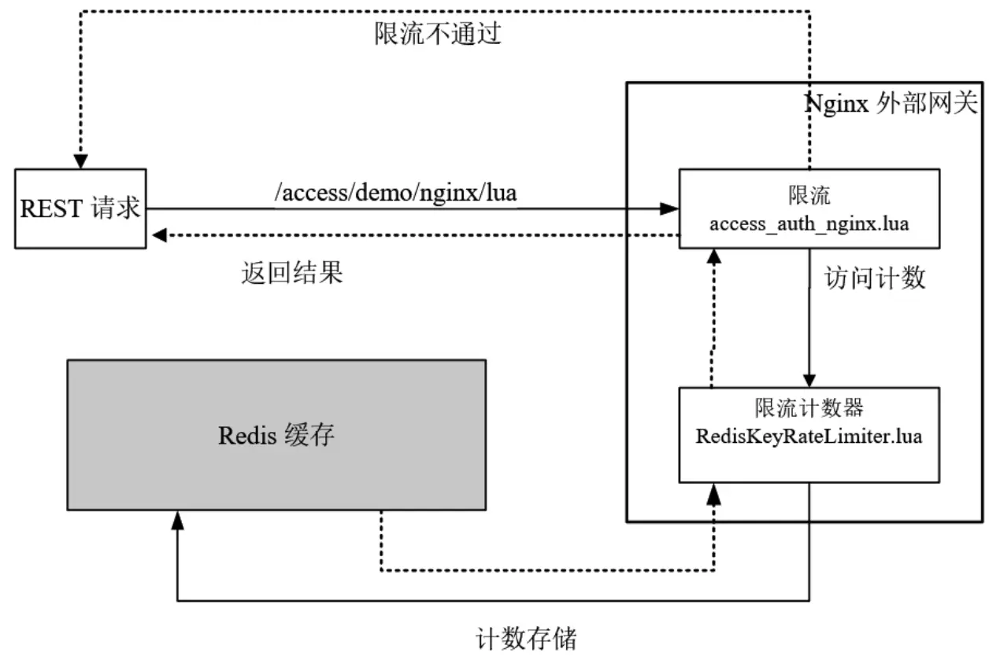
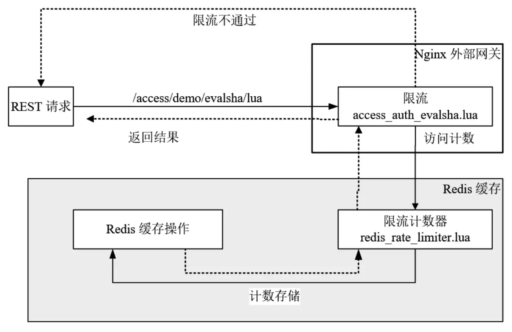

# 第04章_限流原理与实战

限流技术用来控制在高并发、大流量的场景中服务接口请求的速率，例如秒杀、抢购等场景。假设某个接口能够扛住的 QPS 为 10000，此时有 20000 个请求进来，经过限流模块，会先放 10000 个请求，其余的请求会阻塞一段时间，不至于返回 404。


## 1.限流策略原理与参考实现

接口限流的算法主要有以下 4 种：

- **计数器**：在一段时间窗口内，处理请求的最大数量固定，超过部分不做处理
- **漏桶**：漏桶大小固定，处理速度固定，但请求进入的速度不固定（请求过多时多余的会被丢弃）
- **令牌桶**：令牌桶大小固定，令牌产生速度固定，但是消耗令牌的速度不固定；每个请求都会从令牌桶中取出令牌，如果没有令牌就丢弃这次请求
- **滑动窗口**：为了解决计数器精度问题，将一段窗口时间划分为更小的单位，每过一个时间单位就将窗口整体向右移动一个单位，每次计算窗口内的最大数量

### 1.1 计数器限流

```java
class CounterLimiter {
    // 起始时间
    private static long startTime = System.currentTimeMillis();
    // 时间窗口的间隔
    private static long interval = 1000;
    // 每秒限制数量
    private static long maxCount = 2;
    // 累加器
    private static AtomicLong accumulator = new AtomicLong();

    // 判断是否超出限制
    public static boolean tryAcquire() {
        long now = System.currentTimeMillis();
        // 还在时间窗口内，判断累加和是否超出限制
        if (now < startTime + interval) {
            long count = accumulator.incrementAndGet();
            if (count <= maxCount)
            	return true;
            else
            	return false;
        }
        // 超过了时间窗口，重新设置起始时间和累加器
        else {
            synchronized (CounterLimiter.class) {
                if (now > startTime + interval) {
                    accumulator.set(0);
                    startTime = now;
                }
            }
            return false;
        }
    }
}
```

下面创建 2 个线程，分别执行 10 次获取操作，每次间隔 200 毫秒，总计运行 2 秒钟：

```java
@Test
void test() {
    ExecutorService pool = Executors.newFixedThreadPool(10);
    CountDownLatch cd = new CountDownLatch(2);
    AtomicInteger count = new AtomicInteger(0);
    Runnable r = () -> {
        for (int i = 0; i < 10; i++) {
            if (CounterLimiter.tryAcquire()) {
                count.incrementAndGet();
            }
            try {
                Thread.sleep(200);
            } catch (InterruptedException e) {}
        }
        cd.countDown();
    };
    pool.submit(r);
    pool.submit(r);
    try {
        cd.await();
    } catch (InterruptedException e) {}
    System.out.println("运行时间：2s, 通过总数：" + count.get() + ", 执行总数：20, 通过的比例：" + (float) count.get() / 20);
}
```

结果

```bash
运行时间：2s, 通过总数：4, 执行总数：20, 通过的比例：0.2
```

计算器算法无法解决以下场景问题：如果在前一个时间单位的最后请求数达到最大值 maxCount，并且后一个时间单位的最开始请求数达到最大值 maxCount，此时在这一段时间范围内请求数达到了最大值的两倍 2 * maxCount。

### 1.2 漏桶限流

大致规则如下：

- 请求以任意速率流入漏桶，可以放入桶中则意味着可以接受请求，并不意味着立即处理
- 漏桶的容量固定，出水（处理请求）速率固定
- 如果处理速度太慢，桶内水量（请求数）超过桶的容量，则后面的请求就会溢出，表示拒绝

代码如下：

```java
class LeakBucketLimiter {
    // 漏斗容量
    private int capacity;
    // 等待队列
    private BlockingQueue<Thread> queue;

    public LeakBucketLimiter(int rate, int capacity) {
        this.capacity = capacity;
        this.queue = new ArrayBlockingQueue<>(capacity);
        // 创建一个定时任务，每隔 1000 / rate MS 执行队列头部的任务
        Executors.newScheduledThreadPool(1).scheduleWithFixedDelay(() -> {
            try {
                // take 为阻塞方法
                Thread t = queue.take();
                synchronized (t) {
                    t.notify();
                }
            } catch (InterruptedException e) {}
        }, 0, 1000 / rate, TimeUnit.MILLISECONDS);
    }

    @SneakyThrows
    public boolean tryAcquire() {
	if (queue.size() < capacity) {
	    synchronized (Thread.currentThread()) {
            // 双重判断队列容量小于最大容量
            if (queue.size() < capacity) {
                // 将当前线程放入队列中，并调用 wait 方法使当前线程等待
                queue.add(Thread.currentThread());
                Thread.currentThread().wait();
                return true;
            } else {
                return false;
            }
	    }
	}
	return false;
    }
}
```

漏桶的出水速度固定，因而不能有效应对突发流量，但能起到平滑突发流量的作用。

### 1.3 令牌桶限流

令牌桶算法以一个设定的速率产生令牌并放入令牌桶，每次用户请求都得申请令牌，如果令牌不足就会拒绝请求。令牌的数量也是有上限的，随着流逝的时间越长，会不断往桶里加入越多令牌，如果令牌发放的速度比申请速度快，令牌桶就会放满令牌。

另外，令牌的发放速率可以设置，从而可以对突发流量进行有效的应对。

令牌桶的大致规则如下：

- 进水口按照某个速度向桶中放入令牌
- 令牌的容量固定，但放行的速度不固定，只要桶中还有剩余令牌，请求就能申请成功
- 如果令牌的发放速度慢于申请速度，则桶内无令牌时请求会被拒绝

参考实现如下：

```java
class TokenBucketLimiter {
    // 上次令牌发放时间
    private long lastOutTime;
    // 令牌桶容量
    private int capacity;
    // 令牌发放速率，个/秒
    private int rate;
    // 当前令牌数量
    private int tokens;

    public TokenBucketLimiter(int capacity, int rate) {
        this.lastOutTime = System.currentTimeMillis();
        this.capacity = capacity;
        this.rate = rate;
        this.tokens = capacity;
    }

    public synchronized boolean tryAcquire() {
        long now = System.currentTimeMillis();
        long gap = now - lastOutTime;
        tokens = Math.min(capacity, (int) (tokens + gap * rate / 1000));
        if (tokens >= 1) {
            tokens--;
            lastOutTime = now;
            return true;
        } else {
            return false;
        }
    }
}
```

令牌桶的好处之一就是可以方便地应对突发流量。比如可以改变令牌的发放速度，算法能按照新的发送速率调大令牌的发放数量。

### 1.4 滑动窗口

参考 Sentinel 滑动窗口实现

```java
class LeapArray {
    // 每个窗口长度
    private long windowLengthInMs;
    // 窗口数组
    private AtomicReferenceArray<WindowWrap> array;
    // 重入锁，保证重制窗口时的线程安全
    private ReentrantLock lock = new ReentrantLock();
    // 窗口总长度
    private int intervalInMs;

    /**
     * 
     * @param windowCount:  窗口个数
     * @param intervalInMs: 所有窗口的总长度
     */
    public LeapArray(int windowCount, int intervalInMs) {
        this.windowLengthInMs = intervalInMs / windowCount;
        this.array = new AtomicReferenceArray<>(windowCount);
        this.intervalInMs = intervalInMs;
    }

    /*
     * 获取当前时间窗口
     */ 
    public WindowWrap getCurrentWindow() {
        long now = System.currentTimeMillis();
        // 确定数组下标
        int idx = calculateIndex(now);
        // 判断起始时间
        long windowStart = getWindowStart(now);
        WindowWrap old = array.get(idx);
        while (true) {
            if (old == null) {
            	WindowWrap newWindow = new WindowWrap(windowLengthInMs, windowStart, new LongAdder());
            if (array.compareAndSet(idx, null, newWindow))
                return newWindow;
            else {
                Thread.yield();
            }
            } else if (old.getStartTime() == windowStart) {
            	return old;
            } else if (old.getStartTime() < windowStart) {
            if (lock.tryLock()) {
                try {
                	return resetWindow(old, windowStart);
                } finally {
                	lock.unlock();
                }
            } else {
                Thread.yield();
            }
            } else if (old.getStartTime() > windowStart) {
            	return new WindowWrap(windowLengthInMs, windowStart, new LongAdder());
            }
        }
    }

    /*
     * 重制窗口
     */
    private WindowWrap resetWindow(WindowWrap old, long windowStart) {
        old.setStartTime(windowStart);
        old.getPass().reset();
        return old;
    }

    private long getWindowStart(long now) {
		return now - now % windowLengthInMs;
    }

    private int calculateIndex(long now) {
        long id = now / windowLengthInMs;
        return (int) (id % array.length());
    }

    /*
     * 获取所有有效窗口內的请求数
     */
    public int getReqNum(long now) {
        int ans = 0;
        for (int i = 0; i < array.length(); i++) {
            WindowWrap wrap = array.get(i);
            if (wrap != null && now - wrap.getStartTime() <= intervalInMs) {
                ans += wrap.getPass().sum();
            }
        }
        return ans;
    }
}

/*
 * 滑动窗口的指标操作类
 */
class ArrayMetric {
    private final LeapArray data;
    private final int limit;

    public ArrayMetric(int windowCount, int intervalInMs, int limit) {
        this.data = new LeapArray(windowCount, intervalInMs);
        this.limit = limit;
    }

    private void addPass() {
		data.getCurrentWindow().getPass().add(1L);
    }

    public boolean tryAcquire() {
        if (data.getReqNum(System.currentTimeMillis()) < limit) {
            addPass();
            return true;
        }
        return false;
    }
}

@Data
@AllArgsConstructor
class WindowWrap {
    private long windowLengthInMs;
    private long startTime;
    private LongAdder pass;
}

```

## 2.分布式计数器限流

### 2.1 Nginx Lua分布式计数器限流

本小节以对用户 IP 计数器限流为例实现单 IP 在一定时间周期（如 10 秒）內只能访问一定次数（如 10 次）的限流功能。架构如下：



首先是限流计数器脚本 RedisKeyRateLimiter.lua

```lua
local redisOp = require "luaScript.module.demo.RedisOperator"
local _Module = {}

function _Module:new(key)
    local obj = setmetatable({}, _Module)
    self.__index = self
    local red = redisOp:new()
    red:open()
    obj.red = red
    obj.key = "count_rate_limit:" .. key
    return obj;
end

-- 判断是否能通过流量控制，注意这里存在线程安全问题！
function _Module:acquire()
    local current = self.red:incrValue(self.key)
    -- 判断是否大于限制次数
    local isLimited = current and current ~= ngx.null and tonumber(current) > 10
    if isLimited then
        return false
    end

    if not current or current == ngx.null then
        self.red:setValue(self.key, 1)
        -- 限流的时间范围，10 秒
        self.red:expire(self.key, 10)
    end
    return true
end

-- 取得访问次数
function _Module:getCount()
    local current = self.red:getValue(self.key)
    if current and current ~= ngx.null then
        return tonumber(current)
    end
    return 0
end

function _Module:close()
    self.red:close()
end

return _Module
```

接下来是 AccessAuthNginx.lua 脚本，该脚本使用 RedisKeyRateLimiter.lua 完成针对同一 IP 的限流操作：

```lua
local cjson = require "cjson"
local RedisKeyRateLimiter = require "luaScript.module.demo.RedisKeyRateLimiter"
-- 定义出错的 JSON 对象
local errorOut = {resp_code=-1,resp_msg="限流出错",datas={}}
-- 取得用户 ip
local shortKey = ngx.var.remote_addr;
if not shortKey or shortKey == ngx.null then
    errorOut.resp_msg = "ip 不能为空"
    ngx.say(cjson.encode(errorOut))
    return
end

-- 拼接 key
local key = "ip:" .. shortKey
local limiter = RedisKeyRateLimiter:new(key)
local isPassed = limiter:acquire()

-- 如果通过流量控制
if isPassed then
    ngx.var.count = limiter:getCount()
end

limiter:close()

-- 如果没有通过
if not isPassed then
    errorOut.resp_msg = "限流了"
    ngx.say(cjson.encode(errorOut))
end
```

最后是 Nginx 的配置文件

```nginx
location = /access/demo/nginx/lua {
    set $count 0;
    access_by_lua_file luaScript/module/demo/AccessAuthNginx.lua;
    content_by_lua_block {
        ngx.say("当前访问总数：", ngx.var.count)
    }
}
```

上面的代码中设置的限流规则为单 IP 10 秒内限制访问 10 次，因此在浏览器中刷新 10 次后再次访问就会被限流。

以上代码存在两处缺陷：

- 线程安全问题：计数器的读取和自增通过两次 Redis 操作完成，不具备原子性，多线程访问（如设置了多个网关或者设置了 `worker_processes` 大于 1）下会出现线程安全问题
- 性能问题：同一次限流操作需要多次访问 Redis，存在多次网络传输

### 2.2 Redis Lua分布式计数器限流

Redis 允许将 Lua 脚本加载到 Redis 服务器中执行，可以调用大部分 Redis 指令，并且保证了原子性。本小节架构如下：



首先是限流的计数器脚本 RedisRateLimiter.lua

```lua
-- 该脚本在 redis 中执行
-- 返回 0 表示拒绝
local cacheKey = KEYS[1]
local data = redis.call("incr", cacheKey)
local count = tonumber(data)
-- 首次访问设置过期时间
if count == 1 then
    redis.call("expire", cacheKey, 10)
end
if count > 10 then
    return 0
end
return count
```

需要将这个脚本加载到 Redis 中，并且获取其加载后的 sha1 编码，以供 Nginx 的脚本使用。加载到 Redis 的 Linux Shell 命令如下：

```bash
redis-cli -a 123456 script load "$(cat /home/RedisRateLimiter.lua)"     
"0adf08f9a10cdb5ba149516b8a03fb14b7663558"
```

然后是 AccessAuthEvalsha.lua

```lua
local redisExecutor = require("luaScript.module.demo.RedisOperator")
local cjson = require "cjson"
local errorOut = { respCode = -1, resp_msg = "限流出错", datas = {} }
-- 取得用户的ip
local shortKey =  ngx.var.remote_addr

-- 没有限流关键字段， 提示错误
if not shortKey or shortKey == ngx.null then
    errorOut.resp_msg = "shortKey 不能为空"
    ngx.say(cjson.encode(errorOut))
    return
end

-- 拼接计数的 redis key
local key = "ip:" .. shortKey

local rateLimiterSha = "0adf08f9a10cdb5ba149516b8a03fb14b7663558"

--创建自定义的redis操作对象
local red = redisExecutor:new()
--打开连接
red:open()
local connection=red:getConnection()

--执行限流的 redis 内部脚本，传入 1 个参数 key
local resp, err = connection:evalsha(rateLimiterSha, 1, key)
--归还连接到连接池
red:close()

--这里要注意判空的方式
if not resp or resp == ngx.null then
    errorOut.resp_msg = err
    ngx.say(cjson.encode(errorOut))
    return
end

local count = tonumber(resp)
-- 如果通过流控
if count == 0 then
    errorOut.resp_msg = "抱歉，被限流了"
    ngx.say(cjson.encode(errorOut))
    return
end

--设置ngx的变量
ngx.var.count = count
-- 注意，在这里直接输出，会导致content 阶段的指令被跳过
-- ngx.say( "目前的访问总数：",count,"<br>");
```

最后是 Nginx 配置文件

```nginx
location = /access/demo/evalsha/lua {
    set $count 0;
    access_by_lua_file luaScript/module/demo/AccessAuthEvalsha.lua;
    content_by_lua_block {
    	ngx.say("目前的访问总数：", ngx.var.count)
    }
}
```

> **扩展：eval()**
>
> 也可以不把 redis lua 执行脚本部署在 redis 服务器中，可以将其定义在 OpenResty 中：
>
> ```lua
> local resp, err = connection:eval([[
>     local cacheKey = KEYS[1]
>     local data = redis.call("incr", cacheKey)
>     local count = tonumber(data)
>     -- 首次访问设置过期时间
>     if count == 1 then
>         redis.call("expire", cacheKey, 10)
>     end
>     if count > 10 then
>         return 0
>     end
>     return count
>     ]], 1, key)
> ```
>
> redis 中可以直接使用 cjson 命令：
>
> ```bash
> 127.0.0.1:6379> eval 'local test = cjson.encode({test=1}) return test' 0
> "{\"test\":1}"
> 127.0.0.1:6379> eval 'local test = cjson.decode("{\"test\":1}") return test.test' 0
> (integer) 1
> ```

## 3.Nginx漏桶限流

## 4.实战：分布式令牌桶限流

## 5.实战：秒杀