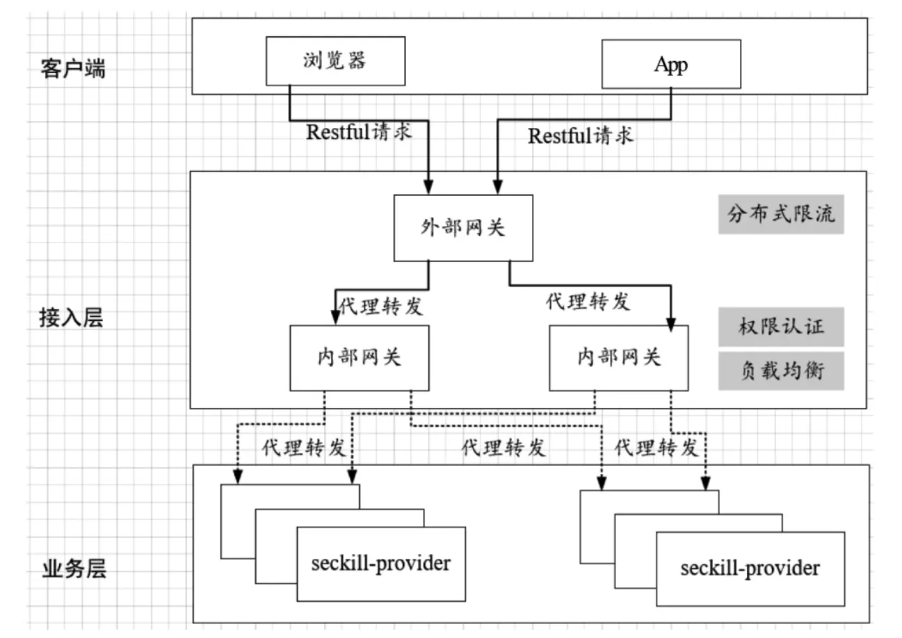

# 第04章_限流原理与实战

限流技术用来控制在高并发、大流量的场景中服务接口请求的速率，例如秒杀、抢购等场景。假设某个接口能够扛住的 QPS 为 10000，此时有 20000 个请求进来，经过限流模块，会先放 10000 个请求，其余的请求会阻塞一段时间，不至于返回 404。

## 1.限流策略原理与参考实现

接口限流的算法主要有以下 4 种：

- **计数器**：在一段时间窗口内，处理请求的最大数量固定，超过部分不做处理
- **漏桶**：漏桶大小固定，处理速度固定，但请求进入的速度不固定（请求过多时多余的会被丢弃）
- **令牌桶**：令牌桶大小固定，令牌产生速度固定，但是消耗令牌的速度不固定；每个请求都会从令牌桶中取出令牌，如果没有令牌就丢弃这次请求
- **滑动窗口**：为了解决计数器精度问题，将一段窗口时间划分为更小的单位，每过一个时间单位就将窗口整体向右移动一个单位，每次计算窗口内的最大数量

### 1.1 计数器限流

```java
class CounterLimiter {
    // 起始时间
    private static long startTime = System.currentTimeMillis();
    // 时间窗口的间隔
    private static long interval = 1000;
    // 每秒限制数量
    private static long maxCount = 2;
    // 累加器
    private static AtomicLong accumulator = new AtomicLong();

    // 判断是否超出限制
    public static boolean tryAcquire() {
        long now = System.currentTimeMillis();
        // 还在时间窗口内，判断累加和是否超出限制
        if (now < startTime + interval) {
            long count = accumulator.incrementAndGet();
            if (count <= maxCount)
            	return true;
            else
            	return false;
        }
        // 超过了时间窗口，重新设置起始时间和累加器
        else {
            synchronized (CounterLimiter.class) {
                if (now > startTime + interval) {
                    accumulator.set(0);
                    startTime = now;
                }
            }
            return false;
        }
    }
}
```

下面创建 2 个线程，分别执行 10 次获取操作，每次间隔 200 毫秒，总计运行 2 秒钟：

```java
@Test
void test() {
    ExecutorService pool = Executors.newFixedThreadPool(10);
    CountDownLatch cd = new CountDownLatch(2);
    AtomicInteger count = new AtomicInteger(0);
    Runnable r = () -> {
        for (int i = 0; i < 10; i++) {
            if (CounterLimiter.tryAcquire()) {
                count.incrementAndGet();
            }
            try {
                Thread.sleep(200);
            } catch (InterruptedException e) {}
        }
        cd.countDown();
    };
    pool.submit(r);
    pool.submit(r);
    try {
        cd.await();
    } catch (InterruptedException e) {}
    System.out.println("运行时间：2s, 通过总数：" + count.get() + ", 执行总数：20, 通过的比例：" + (float) count.get() / 20);
}
```

结果

```bash
运行时间：2s, 通过总数：4, 执行总数：20, 通过的比例：0.2
```

计算器算法无法解决以下场景问题：如果在前一个时间单位的最后请求数达到最大值 maxCount，并且后一个时间单位的最开始请求数达到最大值 maxCount，此时在这一段时间范围内请求数达到了最大值的两倍 2 * maxCount。

### 1.2 漏桶限流

大致规则如下：

- 请求以任意速率流入漏桶，可以放入桶中则意味着可以接受请求，并不意味着立即处理
- 漏桶的容量固定，出水（处理请求）速率固定
- 如果处理速度太慢，桶内水量（请求数）超过桶的容量，则后面的请求就会溢出，表示拒绝

代码如下：

```java
class LeakBucketLimiter {
    // 漏斗容量
    private int capacity;
    // 等待队列
    private BlockingQueue<Thread> queue;

    public LeakBucketLimiter(int rate, int capacity) {
        this.capacity = capacity;
        this.queue = new ArrayBlockingQueue<>(capacity);
        // 创建一个定时任务，每隔 1000 / rate MS 执行队列头部的任务
        Executors.newScheduledThreadPool(1).scheduleWithFixedDelay(() -> {
            try {
                // take 为阻塞方法
                Thread t = queue.take();
                synchronized (t) {
                    t.notify();
                }
            } catch (InterruptedException e) {}
        }, 0, 1000 / rate, TimeUnit.MILLISECONDS);
    }

    @SneakyThrows
    public boolean tryAcquire() {
	if (queue.size() < capacity) {
	    synchronized (Thread.currentThread()) {
            // 双重判断队列容量小于最大容量
            if (queue.size() < capacity) {
                // 将当前线程放入队列中，并调用 wait 方法使当前线程等待
                queue.add(Thread.currentThread());
                Thread.currentThread().wait();
                return true;
            } else {
                return false;
            }
	    }
	}
	return false;
    }
}
```

漏桶的出水速度固定，因而不能有效应对突发流量，但能起到平滑突发流量的作用。

### 1.3 令牌桶限流

令牌桶算法以一个设定的速率产生令牌并放入令牌桶，每次用户请求都得申请令牌，如果令牌不足就会拒绝请求。令牌的数量也是有上限的，随着流逝的时间越长，会不断往桶里加入越多令牌，如果令牌发放的速度比申请速度快，令牌桶就会放满令牌。

另外，令牌的发放速率可以设置，从而可以对突发流量进行有效的应对。

令牌桶的大致规则如下：

- 进水口按照某个速度向桶中放入令牌
- 令牌的容量固定，但放行的速度不固定，只要桶中还有剩余令牌，请求就能申请成功
- 如果令牌的发放速度慢于申请速度，则桶内无令牌时请求会被拒绝

参考实现如下：

```java
class TokenBucketLimiter {
    // 上次令牌发放时间
    private long lastOutTime;
    // 令牌桶容量
    private int capacity;
    // 令牌发放速率，个/秒
    private int rate;
    // 当前令牌数量
    private int tokens;

    public TokenBucketLimiter(int capacity, int rate) {
        this.lastOutTime = System.currentTimeMillis();
        this.capacity = capacity;
        this.rate = rate;
        this.tokens = capacity;
    }

    public synchronized boolean tryAcquire() {
        long now = System.currentTimeMillis();
        long gap = now - lastOutTime;
        tokens = Math.min(capacity, (int) (tokens + gap * rate / 1000));
        if (tokens >= 1) {
            tokens--;
            lastOutTime = now;
            return true;
        } else {
            return false;
        }
    }
}
```

令牌桶的好处之一就是可以方便地应对突发流量。比如可以改变令牌的发放速度，算法能按照新的发送速率调大令牌的发放数量。

### 1.4 滑动窗口

参考 Sentinel 滑动窗口实现

```java
class LeapArray {
    // 每个窗口长度
    private long windowLengthInMs;
    // 窗口数组
    private AtomicReferenceArray<WindowWrap> array;
    // 重入锁，保证重制窗口时的线程安全
    private ReentrantLock lock = new ReentrantLock();
    // 窗口总长度
    private int intervalInMs;

    /**
     * 
     * @param windowCount:  窗口个数
     * @param intervalInMs: 所有窗口的总长度
     */
    public LeapArray(int windowCount, int intervalInMs) {
        this.windowLengthInMs = intervalInMs / windowCount;
        this.array = new AtomicReferenceArray<>(windowCount);
        this.intervalInMs = intervalInMs;
    }

    /*
     * 获取当前时间窗口
     */ 
    public WindowWrap getCurrentWindow() {
        long now = System.currentTimeMillis();
        // 确定数组下标
        int idx = calculateIndex(now);
        // 判断起始时间
        long windowStart = getWindowStart(now);
        WindowWrap old = array.get(idx);
        while (true) {
            if (old == null) {
            	WindowWrap newWindow = new WindowWrap(windowLengthInMs, windowStart, new LongAdder());
            if (array.compareAndSet(idx, null, newWindow))
                return newWindow;
            else {
                Thread.yield();
            }
            } else if (old.getStartTime() == windowStart) {
            	return old;
            } else if (old.getStartTime() < windowStart) {
            if (lock.tryLock()) {
                try {
                	return resetWindow(old, windowStart);
                } finally {
                	lock.unlock();
                }
            } else {
                Thread.yield();
            }
            } else if (old.getStartTime() > windowStart) {
            	return new WindowWrap(windowLengthInMs, windowStart, new LongAdder());
            }
        }
    }

    /*
     * 重制窗口
     */
    private WindowWrap resetWindow(WindowWrap old, long windowStart) {
        old.setStartTime(windowStart);
        old.getPass().reset();
        return old;
    }

    private long getWindowStart(long now) {
		return now - now % windowLengthInMs;
    }

    private int calculateIndex(long now) {
        long id = now / windowLengthInMs;
        return (int) (id % array.length());
    }

    /*
     * 获取所有有效窗口內的请求数
     */
    public int getReqNum(long now) {
        int ans = 0;
        for (int i = 0; i < array.length(); i++) {
            WindowWrap wrap = array.get(i);
            if (wrap != null && now - wrap.getStartTime() <= intervalInMs) {
                ans += wrap.getPass().sum();
            }
        }
        return ans;
    }
}

/*
 * 滑动窗口的指标操作类
 */
class ArrayMetric {
    private final LeapArray data;
    private final int limit;

    public ArrayMetric(int windowCount, int intervalInMs, int limit) {
        this.data = new LeapArray(windowCount, intervalInMs);
        this.limit = limit;
    }

    private void addPass() {
		data.getCurrentWindow().getPass().add(1L);
    }

    public boolean tryAcquire() {
        if (data.getReqNum(System.currentTimeMillis()) < limit) {
            addPass();
            return true;
        }
        return false;
    }
}

@Data
@AllArgsConstructor
class WindowWrap {
    private long windowLengthInMs;
    private long startTime;
    private LongAdder pass;
}

```

## 2.分布式计数器限流

### 2.1 Nginx Lua分布式计数器限流

本小节以对用户 IP 计数器限流为例实现单 IP 在一定时间周期（如 10 秒）內只能访问一定次数（如 10 次）的限流功能。架构如下：


首先是限流计数器脚本 RedisKeyRateLimiter.lua

```lua
local redisOp = require "luaScript.module.demo.RedisOperator"
local _Module = {}

function _Module:new(key)
    local obj = setmetatable({}, _Module)
    self.__index = self
    local red = redisOp:new()
    red:open()
    obj.red = red
    obj.key = "count_rate_limit:" .. key
    return obj;
end

-- 判断是否能通过流量控制，注意这里存在线程安全问题！
function _Module:acquire()
    local current = self.red:incrValue(self.key)
    -- 判断是否大于限制次数
    local isLimited = current and current ~= ngx.null and tonumber(current) > 10
    if isLimited then
        return false
    end

    if not current or current == ngx.null then
        self.red:setValue(self.key, 1)
        -- 限流的时间范围，10 秒
        self.red:expire(self.key, 10)
    end
    return true
end

-- 取得访问次数
function _Module:getCount()
    local current = self.red:getValue(self.key)
    if current and current ~= ngx.null then
        return tonumber(current)
    end
    return 0
end

function _Module:close()
    self.red:close()
end

return _Module
```

接下来是 AccessAuthNginx.lua 脚本，该脚本使用 RedisKeyRateLimiter.lua 完成针对同一 IP 的限流操作：

```lua
local cjson = require "cjson"
local RedisKeyRateLimiter = require "luaScript.module.demo.RedisKeyRateLimiter"
-- 定义出错的 JSON 对象
local errorOut = {resp_code=-1,resp_msg="限流出错",datas={}}
-- 取得用户 ip
local shortKey = ngx.var.remote_addr;
if not shortKey or shortKey == ngx.null then
    errorOut.resp_msg = "ip 不能为空"
    ngx.say(cjson.encode(errorOut))
    return
end

-- 拼接 key
local key = "ip:" .. shortKey
local limiter = RedisKeyRateLimiter:new(key)
local isPassed = limiter:acquire()

-- 如果通过流量控制
if isPassed then
    ngx.var.count = limiter:getCount()
end

limiter:close()

-- 如果没有通过
if not isPassed then
    errorOut.resp_msg = "限流了"
    ngx.say(cjson.encode(errorOut))
end
```

最后是 Nginx 的配置文件

```nginx
location = /access/demo/nginx/lua {
    set $count 0;
    access_by_lua_file luaScript/module/demo/AccessAuthNginx.lua;
    content_by_lua_block {
        ngx.say("当前访问总数：", ngx.var.count)
    }
}
```

上面的代码中设置的限流规则为单 IP 10 秒内限制访问 10 次，因此在浏览器中刷新 10 次后再次访问就会被限流。

以上代码存在两处缺陷：

- 线程安全问题：计数器的读取和自增通过两次 Redis 操作完成，不具备原子性，多线程访问（如设置了多个网关或者设置了 `worker_processes` 大于 1）下会出现线程安全问题
- 性能问题：同一次限流操作需要多次访问 Redis，存在多次网络传输

### 2.2 Redis Lua分布式计数器限流

Redis 允许将 Lua 脚本加载到 Redis 服务器中执行，可以调用大部分 Redis 指令，并且保证了原子性。本小节架构如下：


首先是限流的计数器脚本 RedisRateLimiter.lua

```lua
-- 该脚本在 redis 中执行
-- 返回 0 表示拒绝
local cacheKey = KEYS[1]
local data = redis.call("incr", cacheKey)
local count = tonumber(data)
-- 首次访问设置过期时间
if count == 1 then
    redis.call("expire", cacheKey, 10)
end
if count > 10 then
    return 0
end
return count
```

需要将这个脚本加载到 Redis 中，并且获取其加载后的 sha1 编码，以供 Nginx 的脚本使用。加载到 Redis 的 Linux Shell 命令如下：

```bash
redis-cli -a 123456 script load "$(cat /home/RedisRateLimiter.lua)"     
"0adf08f9a10cdb5ba149516b8a03fb14b7663558"
```

然后是 AccessAuthEvalsha.lua

```lua
local redisExecutor = require("luaScript.module.demo.RedisOperator")
local cjson = require "cjson"
local errorOut = { respCode = -1, resp_msg = "限流出错", datas = {} }
-- 取得用户的ip
local shortKey =  ngx.var.remote_addr

-- 没有限流关键字段， 提示错误
if not shortKey or shortKey == ngx.null then
    errorOut.resp_msg = "shortKey 不能为空"
    ngx.say(cjson.encode(errorOut))
    return
end

-- 拼接计数的 redis key
local key = "ip:" .. shortKey

local rateLimiterSha = "0adf08f9a10cdb5ba149516b8a03fb14b7663558"

--创建自定义的redis操作对象
local red = redisExecutor:new()
--打开连接
red:open()
local connection=red:getConnection()

--执行限流的 redis 内部脚本，传入 1 个参数 key
local resp, err = connection:evalsha(rateLimiterSha, 1, key)
--归还连接到连接池
red:close()

--这里要注意判空的方式
if not resp or resp == ngx.null then
    errorOut.resp_msg = err
    ngx.say(cjson.encode(errorOut))
    return
end

local count = tonumber(resp)
-- 如果通过流控
if count == 0 then
    errorOut.resp_msg = "抱歉，被限流了"
    ngx.say(cjson.encode(errorOut))
    return
end

--设置ngx的变量
ngx.var.count = count
-- 注意，在这里直接输出，会导致content 阶段的指令被跳过
-- ngx.say( "目前的访问总数：",count,"<br>");
```

最后是 Nginx 配置文件

```nginx
location = /access/demo/evalsha/lua {
    set $count 0;
    access_by_lua_file luaScript/module/demo/AccessAuthEvalsha.lua;
    content_by_lua_block {
    	ngx.say("目前的访问总数：", ngx.var.count)
    }
}
```

> **扩展：eval()**
>
> redis Eval 命令基本语法如下：
>
> ```bash
> eval script numkeys key [key ...] arg [arg ...] 
> ```
>
> 参数说明：
>
> - `numkeys`：用于指定键名参数的个数
> - `key [key ...]`： 从 EVAL 的第三个参数开始算起，表示在脚本中所用到的那些 Redis 键，这些键名参数可以在 Lua 中通过全局变量 KEYS 数组，用 1 为基址的形式访问（KEYS[1] ， KEYS[2] ，以此类推）。
> - `arg [arg ...]`：附加参数，在 Lua 中通过全局变量 ARGV 数组访问，访问的形式和 KEYS 变量类似（ARGV[1] 、 ARGV[2] ，诸如此类）
>
> 返回值为 ture 时会转换为 integer 1，false 时会转换为 `nil`。
>
> 所以可以不把 redis lua 执行脚本部署在 redis 服务器中，可以将其定义在 OpenResty 中：
>
> ```lua
> local resp, err = connection:eval([[
>  local cacheKey = KEYS[1]
>  local data = redis.call("incr", cacheKey)
>  local count = tonumber(data)
>  -- 首次访问设置过期时间
>  if count == 1 then
>      redis.call("expire", cacheKey, 10)
>  end
>  if count > 10 then
>      return 0
>  end
>  return count
>  ]], 1, key)
> ```
>
> redis 中可以直接使用 `cjson` 命令操作 JSON：
>
> ```bash
> 127.0.0.1:6379> eval 'local test = cjson.encode({test=1}) return test' 0
> "{\"test\":1}"
> 127.0.0.1:6379> eval 'local test = cjson.decode("{\"test\":1}") return test.test' 0
> (integer) 1
> ```

## 3.Nginx漏桶限流

### 3.1 入门

使用 Nginx 可以通过配置的方式完成接入层的限流，其 ngx_http_limit_req_module 模块所提供的 `limit_req_zone` 和 `limit_req` 两个指令使用漏桶算法进行限流。其中 `limit_req_zone` 指令用于定义一个限流的具体规则（或计数内存区），`limit_req` 指令应用前者定义的规则完成限流动作。

假定要配置 Nginx 虚拟主机的限流规则为单 IP 限制为每秒 1 次请求，整个应用限制为每秒 10 次请求，具体配置如下：

```nginx
# 第一条规则为 perip，每个相同客户端 IP 的请求限速在 6 次/分钟
limit_req_zone $binary_remote_addr zone=perip:10m rate=6r/m;
# 第二条规则名称为 perserver，同一虚拟主机的请求限速在 10 次/秒
limit_req_zone $server_name zone=perserver:1m rate=10r/s;

server {
    server_name localhost;
    default_type 'text/html';
    charset utf-8;
    
    limit_req zone=perip;
    limit_req zone=perserver;
    
    location /nginx/ratelimit/demo {
        echo "-uri=$uri -remote_addr=$remote_addr" "-server_name=$server_name";
    }
}
```

上面的配置通过 `limit_req_zone` 指令定义了两条限流规则：第一条规则名称为 `perip`，将来自每个相同客户端 IP 的请求限速在 6 次/分钟（1 次/10 秒）；第二条限流规则名称为 `perserver`，用于将同一虚拟主机的请求限速在 10 次/秒。

第一次访问时：

```bash
-uri=/nginx/ratelimit/demo -remote_addr=125.196.194.101 -server_name=localhost
```

10 秒内访问次数超过 1 次后：

```bash
503 Service Temporarily Unavailable
openresty/1.21.4.3
```

### 3.2 指令介绍

`limit_req_zone` 用于定义一个限流的具体规则，`limit_req` 应用前者定义的规则，这两个指令要配合使用。

#### 1.limit_req_zone

用于 `http` 上下文中，语法格式如下：

```nginx
limit_req_zone key zone=name:size rate=rate [sync];
```

- `key`

  一个表达式，其运行时的值将作为流量计数的标识，key 表达式包含变量、文本和它们的组合。例如上面的示例中，`$binary_remote_addr` 和 `$server_name` 为两个 Nginx 变量， `$binary_remote_addr` 为客户端 IP 地址的二进制值，`$server_name` 为虚拟机主机名称。在限流规则应用后，它们的值将作为限流关键字，同一个 key 值会在限流的共享内存区域保存一份请求计数，而 `limit_req_zone` 限流指令所配置的速度限制只会对同一个 key 值发生作用。

- `zone`

  用于定义存储相同 key 值的请求计数的共享内存区域，格式为 `name:size`，`name` 表示共享内存区域的名称，`size` 为共享内存区域的大小。上面的示例中，`perip:10m` 表示一个名字为 `perip`、大小为 10MB 的内存区域。1MB 大约能存储 16000 个 IP 地址，10MB 大约可以存储 16 万个 IP 地址，即可以对 16 万个客户端进行并发限速，当共享内存区域耗尽时，Nginx 会使用 LRU 算法淘汰最长时间为使用的 key 值。

- `rate`

  用于设置最大访问速率，`rate=10r/s` 表示一个 key 值每秒最多能计数的访问数为 10 个，`rate=6r/m` 表示一个 key 值每分钟最多能访问 6 次。由于 Nginx 的漏桶限流算法的时间计算是基于毫秒的，当设置的速度为 6r/m 时，即每 10 秒内单个 IP 只允许通过 1 个请求，从第 11 秒开始才允许通过第二个请求。

`limit_req_zone` 指令只是定义限流的规则和共享内存区域，规则生效需要靠 `limit_req` 指令。

#### 2.limit_req

用于 `http`、`server`、`location` 配置块中，语法格式如下：

```nginx
limit_req zone=name [burst=number1] [nodelay | delay=number2];
```

- `zone`

  指定限流共享内存区域与限流规则指令 `limit_req_zone` 中的 `name` 对应。

- `burst`

  突发属性，表示可以处理的突发请求数量，这个参数设置了一个大小为 `number1` 的爆发缓冲区，当有大量请求过来时，**超过了限流频率的请求**会被先放到爆发缓冲区内，直到爆发缓冲区满后才拒绝。

  该参数的配置使得 Nginx 限流具备一定的突发流量的缓冲能力。但是 `burst` 仅仅是让爆发的请求先放到队里中，然后慢慢处理，其处理速度是由 `limit_req_zone` 规则指令配置的速度决定的，在速率低的情况下，其缓冲效果其实并不太理想。

- `delay=number2 | nodelay`

  配置了 `burst` 后如果想迅速处理爆发的话，可以配置 `nodelay` 参数，队列中的请求会立即处理，同时将队列中的槽位标记为已占用，然后按照给定的 `rate` 释放槽位；如果设置了 `delay=number2` 的话则表示允许突发处理最多 `number1` 个请求，其中前 `number2` 个请求将直接被处理，其他请求会被放进队列中按照指定的速率进行处理，超过 `number1` 的请求将被拒绝，直到队列中有新的槽位。

> **扩展**
>
> 类似的，Nginx 还提供了 `limit_conn_zone` 和 `limit_conn` 两个参数来对连接数进行限制。
>
> ```nginx
> limit_conn_zone $binary_remote_addr zone=perip:10m;
> limit_conn_zone $server_name zone=perserver:10m;
> 
> server {
>     location ~* \.(html)$ {
>         // 同一 IP 的并发数最大为 3
>         limit_conn perip 3;
>         // 同一 server 的最大并发数为 1000
>         limit_conn perserver 1000;
>     }
> }
> ```

## 4.实战：分布式令牌桶限流

本小节的限流通过 Lua + Java 完成。首先在 Lua 脚本中完成限流的计算，在 Java 代码中进行组织和调用。

### 4.1 Lua脚本

```lua
-- 申请令牌，-1 表示 fail，1 表示 success
-- @param key: 限流关键字
-- @param apply: 申请的令牌数量
local function acquire(key, apply)
    local times = redis.call('TIME')
    -- times[1]：UNIX 时间戳，秒数
    -- times[2]：微秒数
    -- 转换为毫秒数
    local cur_mill_second = (times[1] * 1000000 + times[2]) / 1000;
    local cacheInfo = redis.pcall("HMGET", key, "last_mill_second", "pre_permits", "max_permits", "rate")
    -- 上次申请的时间
    local last_mill_second = cacheInfo[1]
    -- 之前剩余的令牌数
    local pre_permits = tonumber(cacheInfo[2])
    -- 桶的容量
    local max_permits = tonumber(cacheInfo[3])
    -- 令牌的发放速度
    local rate = cacheInfo[4]
    -- 本次可以申请的令牌数
    local cur_permits = max_permits
    
    -- 当字段不存在时该字段会返回 false
    if (type(last_mill_second) ~= 'boolean' and last_mill_second ~= nil) then
        -- 计算新增加的令牌数
        local reverse_permits = math.floor((cur_mill_second - last_mill_second) / 1000 * rate)
        -- 令牌总数
        local expect_cur_permits = reverse_permits + pre_permits
        -- 可以申请的令牌数
        cur_permits = math.min(expect_cur_permits, cur_permits)
    end
    
    local result = -1;
    -- 有足够的令牌
    if (cur_permits - apply >= 0) then
        -- 保存剩余令牌
        redis.pcall("HSET", key, "pre_permits", cur_permits - apply)
        -- 保存时间
        redis.pcall("HSET", key, "last_mill_second", cur_mill_second)
        result = 1
    else
        result = -1
    end
    return result
end

-- 初始化，1 表示 success
-- @param key
-- @param max_permits 桶的容量
-- @param rate 令牌的发放速度
local function init(key, max_permits, rate)
    redis.pcall("HMSET", key, "max_permits", max_permits, "rate", rate, "pre_permits", max_permits)
    return 1;
end

-- 删除限流 key
local function delete(key)
    redis.pcall("DEL", key)
    return 1;
end

local key = KEYS[1]
local method = ARGV[1]
if method == 'acquire' then
    return acquire(key, ARGV[2])
elseif method == 'init' then
    return init(key, ARGV[2], ARGV[3])
elseif method == 'delete' then
    return delete(key)
else
    -- ignore
end
```

> **注意**
>
> - `redis.call()` 会抛出异常，导致执行中断
>
>   如对于下面的命令：`EVAL "redis.call('SET', 'KEY1', 'VALUE1'); redis.call('INCRBY', 'KEY2', '1/0'); redis.call('SET', 'KEY3', 'VALUE3');" 0`，当执行 `INCRBY KEY2 1/0` 时失败会抛出异常，导致 `SET KEY3 VALUE3` 不会被执行。
>
> - `redis.pcall()` 会内部捕获异常，不会阻断脚本执行
>
>   对于 `EVAL "redis.pcall('SET', 'KEY1', 'VALUE1'); redis.call('INCRBY', 'KEY2', '1/0'); redis.call('SET', 'KEY3', 'VALUE3');" 0`，会执行 `SET KEY3 VALUE3`。

### 4.2 Java代码

lua 脚本既可以在 Java 中调用，也可以在 Nginx 中调用。本小节介绍在 Java 中如何调用。

**配置实体类**

```java
@Data
@ConfigurationProperties(prefix = "application.rate.limit.redis")
public class RedisRateLimitProperties {
    private List<RedisRateLimiter.LimiterInfo> limiterInfos;
}
```

**限流类**

```java
@Slf4j
public class RedisRateLimiter implements InitializingBean {

    private static final String RATE_LIMITER_KEY_PREFIX = "rate_limiter:";
    public static final String RATE_LIMITER_LUA_SHA1 = RATE_LIMITER_KEY_PREFIX + "sha1";

    private RedisRateLimitProperties redisRateLimitProperties;

    private RedisTemplate<String, String> redisTemplate;

    // lua 脚本的实例
    private static RedisScript<Long> rateLimiterScript = null;

    private Map<String, LimiterInfo> limiterInfoMap = new ConcurrentHashMap<>();

    public RedisRateLimiter(RedisRateLimitProperties redisRateLimitProperties,
	    RedisTemplate<String, String> redisTemplate) {
	this.redisRateLimitProperties = redisRateLimitProperties;
	this.redisTemplate = redisTemplate;
	try (InputStream in = this.getClass().getClassLoader().getResourceAsStream("script/rate_limiter.lua")) {
	    byte[] bytes = new byte[in.available()];
	    in.read(bytes);
	    String script = new String(bytes, Charset.forName("UTF-8"));
	    rateLimiterScript = new DefaultRedisScript<>(script, Long.class);
	} catch (Exception e) {
	    e.printStackTrace();
	}

    }

    @Builder
    @Data
    public static class LimiterInfo {
        private String key;
        @Builder.Default
        private String type = "default";
        private Integer maxPermits;
        private Integer rate;

        public String fullKey() {
            return RATE_LIMITER_KEY_PREFIX + type + ":" + key;
        }

        public String cashKey() {
            return type + ":" + key;
        }
    }

    /**
     * 限流检测：是否超过 redis 计数限制器的限制
     *
     * @param cacheKey 计数器的key
     * @return true 成功获得令牌
     */
    public boolean tryAcquire(String cashKey) {
        if (cashKey == null) {
            return true;
        }
        if (cashKey.indexOf(":") <= 0) {
            cashKey = "default:" + cashKey;
        }
        LimiterInfo limiterInfo = limiterInfoMap.get(cashKey);
        if (limiterInfo == null) {
            return true;
        }
        Long acquire = redisTemplate.execute(rateLimiterScript, Collections.singletonList(limiterInfo.fullKey()),
            "acquire", "1");
        return acquire == 1;
    }

    /**
     * 加载配置文件中的限速配置
     */
    @Override
    public void afterPropertiesSet() throws Exception {

	try {
	    List<LimiterInfo> limiterInfos = redisRateLimitProperties.getLimiterInfos();
	    if (null == limiterInfos) {
		return;
	    }
	    for (LimiterInfo limiterInfo : limiterInfos) {
		initLimitKey(limiterInfo);
	    }
	    log.info("redis rate limit inited !");
	} catch (Exception e) {
	    log.error("redis rate limit  error.....", e);
	}
    }

    /**
     * 创建一个限流的 key
     *
     * @param limiterInfo 限流的类型
     */
    public void initLimitKey(LimiterInfo limiterInfo) {
        if (null == rateLimiterScript) {
            return;
        }
        String maxPermits = limiterInfo.getMaxPermits().toString();
        String rate = limiterInfo.getRate().toString();

        // 执行redis 脚本
        Long result = redisTemplate.execute(rateLimiterScript, Collections.singletonList(limiterInfo.fullKey()), "init",
            maxPermits, rate);

        limiterInfoMap.put(limiterInfo.cashKey(), limiterInfo);
    }

    /**
     * 创建一个限流的 key
     *
     * @param type       类型
     * @param key        id
     * @param maxPermits 上限
     * @param rate       速度
     */
    public void initLimitKey(String type, String key, Integer maxPermits, Integer rate) {
        LimiterInfo limiterInfo = LimiterInfo.builder().type(type).key(key).maxPermits(maxPermits).rate(rate).build();
        initLimitKey(limiterInfo);
        /**
         * 缓存秒杀 lua 的 sha 编码，方便在其他地方获取
         */
        cacheRateLimiterSha1();
    }

    /**
     * 获取 redis lua 脚本的 sha1 编码并缓存到 redis，使用时需要先将该脚本加载进 redis
     */
    public String cacheRateLimiterSha1() {
        String sha1 = rateLimiterScript.getSha1();
        redisTemplate.opsForValue().set(RATE_LIMITER_LUA_SHA1, sha1);
        return sha1;
    }

}
```

配置类

```java
@Configuration
@EnableConfigurationProperties(RedisRateLimitProperties.class)
public class RedisConfiguration {

    @Bean
    RedisTemplate<String, String> redisTemplate(RedisConnectionFactory connectionFactory) {
        RedisSerializer<String> stringRedisSerializer = new StringRedisSerializer();
        // 定义RedisTemplate，并设置连接工程
        RedisTemplate<String, String> redisTemplate = new RedisTemplate<>();
        // key 和 value 的序列化采用 StringRedisSerializer
        redisTemplate.setKeySerializer(stringRedisSerializer);
        redisTemplate.setHashKeySerializer(stringRedisSerializer);
        // 注意这里不要使用 jsonSerializer，否则在判断方法名时会匹配不上！
        redisTemplate.setValueSerializer(stringRedisSerializer);
        redisTemplate.setHashValueSerializer(stringRedisSerializer);
        // 设置连接工厂
        redisTemplate.setConnectionFactory(connectionFactory);
        redisTemplate.setEnableTransactionSupport(false);
        return redisTemplate;
    }

    @Bean
    RedisRateLimiter redisRateLimiter(RedisRateLimitProperties redisRateLimitProperties,
	    RedisTemplate<String, String> redisTemplate) {
        return new RedisRateLimiter(redisRateLimitProperties, redisTemplate);
    }
}
```

**测试类**

将脚本放在 `test/resources` 下并执行测试

```java
@SpringBootTest
@Slf4j
public class RedisRateLimiterTest {

    @Autowired
    RedisRateLimiter redisRateLimiter;

    private ExecutorService pool = Executors.newFixedThreadPool(10);

    @Test
    @SneakyThrows
    public void testRedisRateLimiter() {
	redisRateLimiter.initLimitKey("seckill", "101", 2, 2);
	// 记录限制的次数
	AtomicInteger reject = new AtomicInteger();
	long start = System.currentTimeMillis();
	final int thread = 2;
	final int turns = 20;
	CountDownLatch cd = new CountDownLatch(thread);
	for (int i = 0; i < thread; i++) {
	    pool.submit(() -> {
		try {
		    for (int j = 0; j < turns; j++) {
			boolean tryAcquire = redisRateLimiter.tryAcquire("seckill:101");
			if (!tryAcquire) {
			    reject.getAndIncrement();
			}
			Thread.sleep(200);
		    }
		} catch (Exception e) {
		    e.printStackTrace();
		}
		cd.countDown();
	    });
	}
	cd.await();
	float time = (System.currentTimeMillis() - start) / 1000F;
	log.info("时长: " + time);
	log.info("限制的次数: " + reject.get());
	log.info("通过的次数: " + (thread * turns - reject.get()));
    }
}
```

两条线程各执行 20 次，每次休眠 200 毫秒，总计耗时 4 秒，运行 40 次，得到以下结果：

```bash
[main] INFO 时长: 4.334
[main] INFO 限制的次数: 32
[main] INFO 通过的次数: 8
```

## 5.实战：秒杀

在开发高并发系统时常用的三把利器：**缓存**、**降级**和**限流**。缓存的目的是提升系统访问速度和增大系统能处理的容量；降级是当服务出现问题或者影响到核心流程的性能时需要暂时屏蔽掉服务请求；但是有些场景不能用缓存和降级来解决，例如稀缺资源（秒杀、抢购）、写服务（评论、下单）、频繁的复杂查询（如评论的最后几页），因此需要有一种手段来限制这些场景的并发请求量，即限流。

### 5.1 业务功能和技术难点

#### 1.业务功能

从业务角度来说秒杀非常简单：根据先后顺序下订单减库存，主要有以下特点：

- 秒杀一般是访问请求数量远远大于库存数量，只有少部分用户能够秒杀成功，这种场景下需要借助分布式锁等保障数据一致性
- 秒杀时大量用户会在同一时间同时进行桥沟，网站瞬时访问流量激增，此时就需要削峰和限流

从系统角度来说，秒杀系统的业务功能分成两大维度：商户维度和用户维度。

1. **商户维度**

   商户维度主要涉及两个操作：

   - **增加秒杀**

     通过后台的管理控制台界面增加特定商品、特定数量、特定时段的秒杀。

   - **暴露秒杀**

     将符合条件的秒杀暴露给用户，以便互联网用户能参与商品的秒杀。

2. **用户维度**

   用户维度也涉及两个操作：

   - **减库存**

     在减库存时需要考虑如何避免同一用户重复秒杀的行为，而且在多个微服务并发的情况下需要保障库存数据的一致性，避免超卖的情况。

   - **下订单**

     减库存后需要下订单，即在订单表中添加订单记录，记录购买用户的姓名、手机号、购买的商品 ID 等。

#### 2.技术难点

**（1）限流**

需要限制大部分流量而只允许少部分流量进入服务后端。

**（2）分布式缓存**

秒杀系统最大的瓶颈一般都是数据库读写，如果能够把部分数据或业务逻辑转移到分布式缓存，效率就会极大提升。

**（3）可拓展**

秒杀系统的服务节点一定是可以弹性拓展的。如果流量来了就可以按照流量预估进行服务节点的动态增加和摘除。

**（4）超卖或者少买**

如果并发同步处理没有做好，往往会造成多减库存或者少减库存。

**（5）削峰**

限流完成后，对于后端系统而言，秒杀系统仍然会瞬时涌入大量请求，所以在抢购一开始会有很高的瞬间峰值，此时可以通过消息队列异步处理请求，从而平稳流量。

### 5.2 系统架构

#### 1.分层架构

从分层的角度来说，秒杀系统架构可以分成 3 层：

（1）客户端：负责内容提速和交互控制

客户端需要完成秒杀商品的静态化展示。无论是在桌面浏览器还是移动端 APP 展示秒杀商品，秒杀商品的图片和文字元素都需要尽可能静态化，尽量减少动态元素。这样就可以通过 CDN 来提速和抗峰值。

同时在客户端可以具备一定的控制用户行为的能力。例如当用户提交秒杀请求后将秒杀按钮置为不可用，禁止重复提交。

（2）接入层：负责认证、负载均衡、限流

对于总流量较小的系统，可以在内部网关（如 SpringCloudGateway）完成用户认证、负载均衡、接口限流的功能。

对于流量较大的系统会有一层甚至多层外部网关，因此限流的职责会从内部网关剥离到外部网关，内部网关仍然具备权限认证、负载均衡的能力。



（3）业务层：负责保障数据的一致性

秒杀的业务逻辑主要是下订单和减库存，都是数据库操作，非常脆弱，同时又需要进行事务保护。在业务层还需要防止超买超卖，可以使用分布式锁对秒杀的数据库操作进行保护。

#### 2.限流架构

由于秒杀商品总数是有限的，同时服务节点的处理能力、数据库的处理能力也是有限的，因此需要根据系统的负载能力进行秒杀限流。总体来说在接入层可以进行两个级别的限流策略：应用级别的限流和接口级别的限流。

**（1）应用级别的限流**

当请求数超过了 QPS 后整个应用就会不响应或响应得非常慢，因此需要在整个应用的维度做好限流配置。应用级别的限流应该配置在最顶层的反向代理，例如可以用过 Nginx 的 `limit_req_zone` 和 `limit_req` 两个指令完成。假定要配置 Nginx 虚拟主机的限流规则为单 IP 限制为每秒 1 次请求，整个应用限制为每秒 10 次请求，则具体的配置如下：

```nginx
limit_req_zone $binary_remote_addr zone=perip:10m rate=1r/s;
limit_req_zone $server_name zone=perserver:1m rate=10r/s;

server {
    ...
    limit_req zone=perip burst=5;
    limit_req zone=perserver burst=10;
}
```

**（2）接口级别的限流**

单个接口可能会由于突发访问量太大而导致崩溃，接口级别的限流就是配置单个接口的请求速率，是细粒度的限流。

理论上接入层的限流有多个维度：

- **用户维度的限流**

  在某一段时间内只允许用户提交一次请求，比如可以采取客户端 IP 或者用户 ID 作为限流的 key。

- **商品维度的限流**

  对于同一个抢购商品，在某个时间段内只允许一定数量的请求进入，可以采取秒杀商品 ID 作为限流的 key。

接口级别的限流可以通过 Nginx 的 `limit_req_zone` 和 `limit_req` 两个指令配合完成，对获取秒杀令牌的接口，同时进行用户 ID 和商品 ID 限流的配置如下：

```nginx
# 根据请求参数的 goodId 值进行限流，同一个 goodId 的限速为每秒 100 次请求
limit_req_zone $arg_goodId zone=pergood:100m rate=100r/s;
# 根据请求参数的 userId 值进行限流，同一个 userId 值的限速为每秒 1 次请求
limit_req_zone $arg_userId zone=peruser:1m rate=1r/s;

server {
    location = /seckill-provider/api/seckill/redis/token/v2 {
        limit_req zone=peruser burst=5;
        limit_req zone=pergood burst=10;
        
        content_by_lua_file luaScript/getToken.lua;
    }
}
```

但是 Nginx 的限流指令只能在同一块内存区域有效，而在生产场景中秒杀的外部网关往往是采用多节点部署的，这就需要用到分布式限流组件。高性能的分布式限流组件可以使用 Redis + Lua 来开发。

#### 3.分布式锁架构

解决超买或者少卖问题的方法之一就是利用分布式锁对同一个商品的并行数据库操作予以串行化，该分布式锁应该具备以下条件：

- 一个方法在同一时间内只能被一个机器的一个线程执行
- 高可用地获取锁与释放锁
- 高性能地获取锁与释放锁
- 可重入
- 具备锁失效机制，防止因为异常导致锁无法释放
- 具备非阻塞特性，即没有获取到锁将直接返回获取锁失败

常用的分布式锁有两种：Zookeeper 分布式锁和 Redis 分布式锁。Zookeeper 分布式锁虽然高可靠，但是性能不高（保障了一致性和分区容错性，但是损失的可用性），不满足秒杀场景分布式锁的第 3 个条件，所以在秒杀的场景中优先使用 Redis 分布式锁。 

#### 4.削峰架构

当秒杀的订单量很大时，还需要进行削峰来延缓用户请求，是的最终落地到数据库的请求数要尽量少。通过消息队列可以大大地缓冲瞬时流量，把同步的直接调用转换成异步的间接推送。消息队列就像水库一样，拦蓄上游的洪水，削减进行下游河道的洪峰流量，从而达到减免洪水灾害的目的。

对于秒杀消息的入队可以直接在内部网关完成。内部网关在完成用户的权限验证、秒杀令牌的有效性验证后可以直接将秒杀消息发网消息队列。秒杀服务通过消息队列的订阅完成秒杀消息的消费。

### 5.3 参考实现

#### 1.数据表和PO实体类

为了简化流程，这里主要涉及两张表：秒杀商品表和订单表。

**商品表**

```java
@Data
@AllArgsConstructor
@NoArgsConstructor
@Builder
@TableName(value = "SECKILL_GOOD")
public class SeckillGoodDO {

    private Long id;

    private String title;

    private BigDecimal seckillPrice;

    @TableField(fill = FieldFill.INSERT)
    private LocalDateTime createTime;

    private LocalDateTime startTime;

    private LocalDateTime endTime;

    // 剩余库存
    private Long remainStock;

    // 原始库存
    private Long rawStock;
}
```

**订单表**

```java
@Data
@AllArgsConstructor
@NoArgsConstructor
@Builder
@TableName(value = "SECKILL_ORDER")
public class SeckillOrderDO {

    @TableId(type = IdType.ASSIGN_ID)
    private Long id;

    private Long userId;

    private Long goodId;

    // -1: 无效; 0: 成功; 1: 已付款
    private Short status;

    @TableField(fill = FieldFill.INSERT)
    private LocalDateTime createTime;

    // 付款时间
    private Date payTime;

}
```

**数据传输实体类**

```java
@Data
@NoArgsConstructor
public class SeckillDTO {
    private Long goodId;
    private Long userId;
    private String token;
}
```

**响应类**

```java
@Data
@AllArgsConstructor
@NoArgsConstructor
public class ResultVO {

    private String errorCode;
    private String errorMessage;
    private Object data;

    public static ResultVO success(Object data) {
        ResultVO vo = new ResultVO();
        vo.setData(data);
        return vo;
    }

    public static ResultVO fail(Error error) {
        ResultVO vo = new ResultVO();
        vo.setErrorCode(error.getErrorCode());
        vo.setErrorMessage(error.getErrorMessage());
        return vo;
    }

    @AllArgsConstructor
    @Getter
    public enum Error {

        UNKNOW_ERROR("100", "未知错误"),
        NO_STOCK("101", "没有库存了"),
        ALREADY_EXIST("102", "已经下单了"),
        NO_GOOD("103", "商品未找到"),
        INVALID_TOKEN("104", "token 无效");

        private final String errorCode;
        private final String errorMessage;
    }
}
```

#### 2.控制层

```java
@RestController
public class SeckillController {

    @Autowired
    SeckillService seckillService;

    // 获得 token
    @PostMapping("/getToken")
    public ResultVO getToken(@RequestBody SeckillDTO seckillDTO) {
       return seckillService.getToken(seckillDTO);
    }

    // 扣减库存
    @PostMapping("/doSeckill")
    public ResultVO doSeckill(@RequestBody SeckillDTO seckillDTO) {
        return seckillService.doSeckill(seckillDTO);
    }
}
```

#### 3.服务层

```java
@Component
public class SeckillService {

    @Autowired
    RedisTemplate<String, String> redisTemplate;

    @Autowired
    GoodMapper goodMapper;

    @Autowired
    OrderMapper orderMapper;

    static RedisScript<Long> seckillScript = null;

    // 获取 token
    public ResultVO getToken(SeckillDTO seckillDTO) {
        String token = UUID.randomUUID().toString();
        Long res = redisTemplate.execute(
                seckillScript,
                Collections.singletonList("setToken"),
                String.valueOf(seckillDTO.getGoodId()),
                String.valueOf(seckillDTO.getUserId()),
                token
        );
        if (res == 2) {
            return ResultVO.fail(ResultVO.Error.NO_GOOD);
        }
        if (res == 4) {
            return ResultVO.fail(ResultVO.Error.NO_STOCK);
        }
        if (res == 5) {
            return ResultVO.fail(ResultVO.Error.ALREADY_EXIST);
        }
        if (res != 1) {
            return ResultVO.fail(ResultVO.Error.UNKNOW_ERROR);
        }
        return ResultVO.success(token);
    }

    // 执行秒杀
    @Transactional
    public ResultVO doSeckill(SeckillDTO seckillDTO) {
        Long res = redisTemplate.execute(
                seckillScript,
                Collections.singletonList("checkToken"),
                String.valueOf(seckillDTO.getGoodId()),
                String.valueOf(seckillDTO.getUserId()),
                seckillDTO.getToken()
        );
        // 如果 token 不存在则返回错误
        if (res != 1) {
            return ResultVO.fail(ResultVO.Error.INVALID_TOKEN);
        }
        // 如果记录已存在则返回错误
        QueryWrapper<SeckillOrderDO> qw = new QueryWrapper<>();
        qw.eq("user_id", seckillDTO.getUserId());
        qw.eq("good_id", seckillDTO.getGoodId());
        if (orderMapper.exists(qw)) {
            return ResultVO.fail(ResultVO.Error.ALREADY_EXIST);
        }
        updateDB(seckillDTO);
        return ResultVO.success("成功");
    }

    // 执行事务操作
    @Transactional
    public void updateDB(SeckillDTO seckillDTO) {
        SeckillOrderDO seckillOrderDO = SeckillOrderDO.builder()
                        .userId(seckillDTO.getUserId())
                        .goodId(seckillDTO.getGoodId()).build();
        orderMapper.insert(seckillOrderDO);
        UpdateWrapper<SeckillGoodDO> uw = new UpdateWrapper<>();
        uw.eq("id", seckillDTO.getGoodId());
        uw.setSql("remain_stock = remain_stock - 1");
        goodMapper.update(uw);
    }

    // 初始化加载 lua 脚本
    @PostConstruct
    void init() {
        try (InputStream in = this.getClass().getClassLoader().getResourceAsStream("script/seckill.lua")) {
            byte[] bytes = new byte[in.available()];
            in.read(bytes);
            String script = new String(bytes, StandardCharsets.UTF_8);
            seckillScript = new DefaultRedisScript<>(script, Long.class);
        } catch (Exception e) {
            e.printStackTrace();
        }
    }
}
```

#### 4.Lua脚本

```lua
-- 1: 排队成功
-- 2: 商品未找到
-- 3: 人数超过限制
-- 4: 库存不足
-- 5: 排队过了
-- 6: 秒杀过了
-- -2: 方法不存在

local function setToken(goodId, userId, token)
    -- 检查令牌是否存在
    local oldToken = redis.call("hget", "seckill:queue:" .. goodId, userId)
    if oldToken then
        return 5 -- 已排队
    end

    -- 获取商品缓存库存数
    local stock = redis.call("get", "seckill:goods:" .. goodId)
    if not stock then
        return 2 -- 未找到商品
    end

    local stockNumber = tonumber(stock)
    if stockNumber <= 0 then
        return 4 -- 库存不足
    end
    stockNumber = stockNumber - 1
    redis.call("set", "seckill:goods:" .. goodId, stockNumber)
    redis.call("hset", "seckill:queue:" .. goodId, userId, token)
    return 1 -- 排队成功
end

local function checkToken(goodId, userId, token)
    local oldToken = redis.call("hget", "seckill:queue:" .. goodId, userId)
    if oldToken and (oldToken == token) then
        return 1; -- token 存在
    end
    return -1; -- token 不存在
end

local method = KEYS[1]
local goodId = ARGV[1]
local userId = ARGV[2]
local token = ARGV[3]

if method == "setToken" then
    return setToken(goodId, userId, token)
elseif method == "checkToken" then
    return checkToken(goodId, userId, token)
else
    return -2
end
```

#### 5.配置类

**日期自动插入处理器**

```java
@Component
public class DateObjectHandler implements MetaObjectHandler {


    @Override
    public void insertFill(MetaObject metaObject) {
        this.strictInsertFill(metaObject, "createTime", LocalDateTime.class, LocalDateTime.now());
    }

    @Override
    public void updateFill(MetaObject metaObject) {
    }
}
```

**Redis 配置类**

```java
@Configuration
public class RedisConfig {

    @Bean
    public ObjectMapper objectMapper(Jackson2ObjectMapperBuilder builder) {
        builder.visibility(PropertyAccessor.ALL, JsonAutoDetect.Visibility.ANY);
        builder.serializationInclusion(JsonInclude.Include.NON_NULL);
        return builder.build();
    }

    @Bean
    public RedisTemplate<String, String> redisTemplate(RedisConnectionFactory redisConnectionFactory) {
        RedisSerializer<String> stringRedisSerializer = new StringRedisSerializer();
        RedisTemplate<String, String> redisTemplate = new RedisTemplate<>();
        redisTemplate.setKeySerializer(stringRedisSerializer);
        redisTemplate.setHashKeySerializer(stringRedisSerializer);
        redisTemplate.setValueSerializer(stringRedisSerializer);
        redisTemplate.setHashValueSerializer(stringRedisSerializer);
        redisTemplate.setConnectionFactory(redisConnectionFactory);
        redisTemplate.setEnableTransactionSupport(false);
        return redisTemplate;

    }
}
```

**配置文件**

```properties
mybatis-plus.configuration.map-underscore-to-camel-case=true
spring.datasource.url=jdbc:mysql://43.153.170.51:30306/seckill?&rewriteBatchedStatements=true
spring.datasource.username=root
spring.datasource.password=root
spring.datasource.driver-class-name=com.mysql.cj.jdbc.Driver
spring.data.redis.host=43.153.170.51
spring.data.redis.port=30379
```

### 5.4 Nginx实现秒杀限流

Nginx 秒杀限流有两种架构：

**（1）Nginx 限流 + 内部网关认证和路由 + 微服务秒杀**

这种是非常典型的 Nginx + Spring Cloud 微服务架构，限流的逻辑处于外部网关 Nginx，用户的权限认证处于内部网关，而获取秒杀令牌的逻辑处于微服务中。

**（2）Nginx 限流 + Lua 脚本秒杀**

这种架构属于高性能的秒杀架构，不只是限流的逻辑处于外部网关 Nginx，获取秒杀令牌逻辑也处于外部网关 Nginx。由于可以减少网络传输，因此性能较高。这里主要涉及两个 Lua 脚本：

- `getToken.lua`：用于获取秒杀令牌
- `getToken_access_limit.lua`：用于限流

具体配置如下：

```nginx
location = /getToken {
    default_type "application/json";
    charset utf-8;
    access_by_lua_file luaScript/module/seckill/getToken_access_limit.lua;
    content_by_lua_file luaScript/module/seckill/getToken.lua;
}
```

接下来主要介绍第二种实现。

#### 1.获取秒杀令牌脚本

需要事先将[执行秒杀的 lua 脚本](#4.Lua脚本)加载到 redis 并将 sha1 进行缓存。

**UUID 生成脚本**

```lua
local ffi          = require "ffi"
local ffi_new      = ffi.new
local ffi_str      = ffi.string
local ffi_load     = ffi.load
local ffi_cdef     = ffi.cdef
local C            = ffi.C
local OSX          = ffi.os == "OSX"
local pcall        = pcall
local assert       = assert
local tonumber     = tonumber
local setmetatable = setmetatable

ffi_cdef[[
typedef unsigned char uuid_t[16];
typedef long time_t;
typedef struct timeval {
    time_t tv_sec;
    time_t tv_usec;
} timeval;
   void uuid_generate(uuid_t out);
   void uuid_generate_random(uuid_t out);
   void uuid_generate_time(uuid_t out);
    int uuid_generate_time_safe(uuid_t out);
    int uuid_parse(const char *in, uuid_t uu);
   void uuid_unparse(const uuid_t uu, char *out);
    int uuid_type(const uuid_t uu);
    int uuid_variant(const uuid_t uu);
 time_t uuid_time(const uuid_t uu, struct timeval *ret_tv);
]]

local function L(n)
    local ok, lib = pcall(ffi_load, n)
    if ok then return lib end
    ok, lib = pcall(ffi_load, n .. '.so.1')
    assert(ok, lib)
    return lib
end

local lib = OSX and C or L "uuid"
local uid = ffi_new "uuid_t"
local tvl = ffi_new "timeval"
local buf = ffi_new("char[?]", 36)

local uuid = {}
local mt   = {}

local function unparse(id)
    lib.uuid_unparse(id, buf)
    return ffi_str(buf, 36)
end

local function parse(id)
    return lib.uuid_parse(id, uid) == 0 and uid or nil
end

function uuid.generate()
    lib.uuid_generate(uid)
    return unparse(uid)
end

function uuid.generate_random()
    lib.uuid_generate_random(uid)
    return unparse(uid)
end

function uuid.generate_time()
    lib.uuid_generate_time(uid)
    return unparse(uid)
end

function uuid.generate_time_safe()
    assert(not OSX, "uuid_generate_time_safe is not supported on OS X.")
    local safe = lib.uuid_generate_time_safe(uid) == 0
    return unparse(uid), safe
end

function uuid.type(id)
    assert(not OSX, "uuid_type is not supported on OS X.")
    local parsed = parse(id)
    return parsed and lib.uuid_type(parsed)
end

function uuid.variant(id)
    assert(not OSX, "uuid_variant is not supported on OS X.")
    local parsed = parse(id)
    return parsed and lib.uuid_variant(parsed)
end

function uuid.time(id)
    local parsed = parse(id)
    if parsed then
        local secs = lib.uuid_time(parsed, tvl)
        return tonumber(secs), tonumber(tvl.tv_usec)
    end
end

function uuid.is_valid(id)
    return not not parse(id)
end

mt.__call = uuid.generate

return setmetatable(uuid, mt)
```

**getToken.lua**

```lua
local redisExecutor = require("luaScript.redis.RedisOperator")
local uuid = require 'luaScript.module.common.uuid'
local cjson = require 'cjson'

ngx.req.read_body()
-- 获取请求体
local data = ngx.req.get_body_data()

-- 字符串转成 JSON
local args = cjson.decode(data)
local goodId = args["goodId"]
local userId = args["userId"]

-- 生成令牌的 uuid
local token = uuid.generate()

local restOut = { code = 0, msg = "操作成功", datas = {} }
local errorOut = { code = -1, msg = "操作失败", datas = {} }

local seckillSha = nil;

local red = redisExecutor:new()
red:open()

-- 获取秒杀 lua 脚本的 sha1 编码
seckillSha = red:getValue("lua:sha1:seckill")

-- 如果 redis 未缓存秒杀脚本
if not seckillSha or seckillSha == ngx.null then
    errorOut.msg = "秒杀还未启动"
    ngx.say(cjson.encode(errorOut))
    red:close()
    return
end

-- 执行秒杀脚本
local rawFlag = red:evalSeckillSha(seckillSha, "setToken", goodId, userId, token)
red:close()
if not rawFlag or rawFlag == ngx.null then
    ngx.say(cjson.encode(errorOut))
    return
end

local flag = tonumber(rawFlag)

if flag == 5 then
    errorOut.msg = "已经排过队了"
    ngx.say(cjson.encode(errorOut))
    return
end

if flag == 2 then
    errorOut.msg = "秒杀商品没有找到"
    ngx.say(cjson.encode(errorOut))
    return
end

if flag == 4 then
    errorOut.msg = "库存不足，稍后再来"
    ngx.say(cjson.encode(errorOut))
    return
end

if flag ~= 1 then
    errorOut.msg = "未知错误"
    ngx.say(cjson.encode(errorOut))
    return
end

restOut.datas = token
ngx.say(cjson.encode(restOut))
```

#### 2.限流脚本

和秒杀脚本一样，需要事先将[分布式令牌桶脚本](#4.1 Lua脚本) `rate_limiter.lua` 加载进 Redis 中并执行初始化操作。

**getToken_access_limit.lua**

```lua
local redisExecutor = require 'luaScript.redis.RedisOperator'
local cjson = require("cjson")

-- 获取请求体
ngx.req.read_body()
local data = ngx.req.get_body_data()

local args = cjson.decode(data)
local goodId = args["goodId"]
local userId = args["userId"]

local errorOut = { code = -1, msg = "限流出错", datas = {} }
local key = "rate_limiter:seckill:" .. goodId;

local rateLimiterSha = nil;
local red = redisExecutor:new()
red:open()

rateLimiterSha = red:getValue("lua:sha1:rate_limiter")

if not rateLimiterSha or rateLimiterSha == ngx.null then
    errorOut.msg = "秒杀还未启动"
    ngx.say(cjson.encode(errorOut))
    red:close()
    return
end

local connection = red:getConnection()
local resp, err = connection:evalSha(rateLimiterSha, 1, key, "acquire", "1")
red:close()

if not resp or resp == ngx.null then
    errorOut.msg = err;
    ngx.say(cjson.encode(errorOut))
    return
end

local flag = tonumber(resp)
if flag ~= 1 then
    errorOut.msg = "被限流了"
    ngx.say(cjson.encode(errorOut))
    ngx.exit(ngx.HTTP_UNAUTHORIZED)
end
```

**执行初始化操作代码**

```java
try (InputStream in = this.getClass().getClassLoader().getResourceAsStream("script/rate_limiter.lua")) {
    byte[] bytes = new byte[in.available()];
    in.read(bytes);
    String script = new String(bytes, StandardCharsets.UTF_8);
    DefaultRedisScript<Long> seckillScript = new DefaultRedisScript<>(script, Long.class);
    Long res = redisTemplate.execute(
            seckillScript,
            Collections.singletonList("rate_limiter:seckill:1"),
            "init",
            "1",
            "2"
    );
    redisTemplate.opsForValue().set("lua:sha1:rate_limiter", seckillScript.getSha1());
} catch (Exception e) {
    e.printStackTrace();
}
```

#### 3.JWT认证

可以使用开源插件 `jwt-lua` 完成用户的认证过程。[官网](https://github.com/SkyLothar/lua-resty-jwt?tab=readme-ov-file#verification)

一个简单的示例如下：

```lua
local jwt = require "resty.jwt"
local validators = require "resty.jwt-validators"
if ngx.var.request_method ~= "OPTIONS" and not string.match(ngx.var.uri, "login") then
	local jwtToken = ngx.var.http_Authorization
    if jwtToken == nil then
        ngx.status = ngx.HTTP_UNAUTHORIZED
        ngx.header.content_type = "application/json; charset=utf-8"
        ngx.say("{\"error\": \"Forbidden\"}")
        ngx.exit(ngx.HTTP_UNAUTHORIZED)
 	end
 	local claim_spec = { exp = validators.is_not_expired() }
    local jwt_obj = jwt:verify('secret', jwtToken, claim_spec)
    if not jwt_obj["verified"] then
        ngx.status = ngx.HTTP_UNAUTHORIZED
        ngx.header.content_type = "application/json; charset=utf-8"
        ngx.say("{\"error\": \"INVALID_JWT\"}")
        ngx.exit(ngx.HTTP_UNAUTHORIZED)
 	end
end
```

## 6.扩展

### 6.1 Guava令牌桶工具类

Guava 提供了一个 `RateLimiter` 用来实现令牌桶的限流策略。

https://www.bilibili.com/video/BV1xs4y1y7WM/?spm_id_from=333.337.search-card.all.click&vd_source=5b004fc5b31265edeacd61f026781ce2