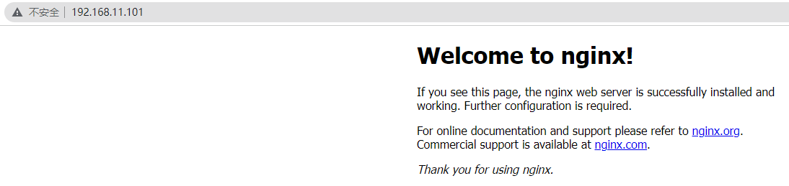

# 第1章_安装部署

常用版本分为 4 大阵营：

- Nginx 开源版：http://nginx.org/

  自主开发难度大。

- Nginx plus 商业版：https://www.nginx.com

- Openresty：http://openresty.org

  是一款基于 Nginx 和 Lua 的开源版本，支持中文文档。

- Tengine：http://tengine.taobao.org/

## 1.下载

https://nginx.org/en/download.html?_ga=2.258547530.1315840284.1652959040-1417345686.1652959040

## 2.编译安装与检查依赖

### 2.1 解压文件

```bash
tar zxvf nginx-1.21.6.tar.gz
```

### 2.2 编译

```bash
./configure --prefix=/usr/local/nginx
make & make install
```

**如果出现警告或报错：**

```bash
checking for OS
 + Linux 3.10.0-693.el7.x86_64 x86_64
checking for C compiler ... not found
./configure: error: C compiler cc is not found
```

安装gcc

```bash
yum install -y gcc
```

**如果提示：**

```bash
./configure: error: the HTTP rewrite module requires the PCRE library.
You can either disable the module by using --without-http_rewrite_module
option, or install the PCRE library into the system, or build the PCRE library
statically from the source with nginx by using --with-pcre=<path> option.
```

安装 perl 库

```bash
yum install -y pcre pcre-devel
```

**如果提示：**

```bash
./configure: error: the HTTP gzip module requires the zlib library.
You can either disable the module by using --without-http_gzip_module
option, or install the zlib library into the system, or build the zlib library
statically from the source with nginx by using --with-zlib=<path> option.
```

安装zlib库

```bash
yum install -y zlib zlib-devel
```

接下来执行

```bash
make & make install
```

### 2.3 启动Nginx

进入安装好的目录`/usr/local/nginx/sbin`

```bash
# 默认后台启动
./nginx 启动
./nginx -s stop 快速停止
./nginx -s quit 优雅关闭，在退出前完成已经接受的连接请求
./nginx -s reload 重新加载配置
```

**关于防火墙**

关闭防火墙

```bash
systemctl stop firewalld.service
```

禁止防火墙开机启动

```bash
systemctl disable firewalld.service
```

放行端口

```bash
firewall-cmd --zone=public --add-port=80/tcp --permanent
```

重启防火墙

```bash
firewall-cmd --reload
```

**安装成系统服务**

创建服务脚本

```bash
vi /usr/lib/systemd/system/nginx.service
```

服务脚本内容

```bash
[Unit]
Description=nginx - web server
After=network.target remote-fs.target nss-lookup.target
[Service]
Type=forking
PIDFile=/usr/local/nginx/logs/nginx.pid
ExecStartPre=/usr/local/nginx/sbin/nginx -t -c /usr/local/nginx/conf/nginx.conf
ExecStart=/usr/local/nginx/sbin/nginx -c /usr/local/nginx/conf/nginx.conf
ExecReload=/usr/local/nginx/sbin/nginx -s reload
ExecStop=/usr/local/nginx/sbin/nginx -s stop
ExecQuit=/usr/local/nginx/sbin/nginx -s quit
PrivateTmp=true
[Install]
WantedBy=multi-user.target
```

重新加载系统服务

```bash
systemctl daemon-reload
```

启动服务

```bash
systemctl start nginx.service
```

开机启动

```bash
systemctl enable nginx.service
```

检查是否运行成功



