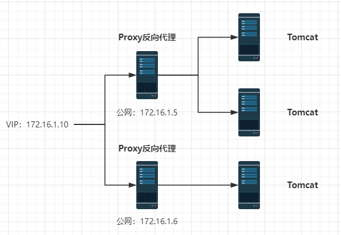
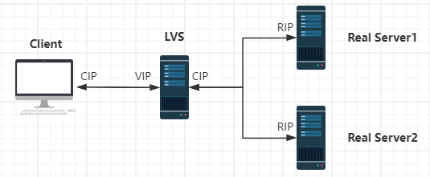
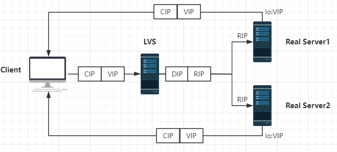
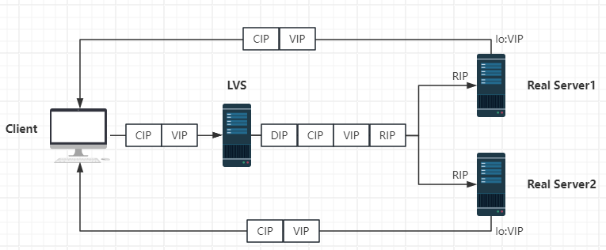

# 高可用集群

集群高可用有两个方向：横向扩容（scale out）和纵向扩容（scale up），前者指增加集群的节点数，后者指增加单个节点的资源数，如 CPU 和内存。

## 1.集群功能分类

### 1.1 LB（Load Balancing）

负载均衡，用来分发请求到不同的节点，具有一定高可用能力，但不是高可用集群。

#### 1.软件负载均衡

**（1）LVS**

Linux Virtual Server，LVS 是一个在 Linux 内核中实现的负载均衡方案，用于分发网络服务请求到多个服务器上，以提高性能和可靠性，属于 4 层负载均衡。

**（2）HAproxy**

HAproxy 是一个开源的负载均衡器，能够进行 TCP/HTTP 及自定义协议的代理和负载均衡，可以检测服务器的存活，常用于提供**高可用性**和伸缩性，属于 7 层负载均衡。

**（3）Nginx**

Nginx 是一个流行的开源 Web 服务器，提供 HTTP 和 HTTPS 服务，也可用作反向代理服务器和负载均衡器，但通常不会主动执行服务器存活性检测。它以高性能和低消耗资源而闻名，经常用于处理网站流量、处理静态资源和应用程序交付，属于 7 层负载均衡。

#### 2.硬件负载均衡

**（1）F5**

F5 Networks 是一家专门提供应用交付网络技术的公司，用于网络流量管理、负载平衡和应用交付控制。这些设备旨在确保网络服务的高可用性、安全性和性能，通过智能地管理流量分发到服务器上，以提供最佳的用户体验。 F5 Networks 也提供软件解决方案，但其硬件负载均衡设备是该公司的主要产品之一。

**（2）Citrix**

Citrix 提供数字工作空间解决方案，包括虚拟化、网络和云服务，以实现远程办公和安全访问应用程序和数据。

**（3）Nescaler**

Citrix 旗下产品，NetScaler 是由 Citrix 开发的应用交付控制器（ADC），为网络应用提供负载平衡、安全性和加速功能。

**（4）A10**

A10 Networks 是一家提供网络和安全解决方案的公司，他们提供应用交付控制器、DDoS 防护和各种云和安全解决方案。

**（5）深信服**

深信服科技是一家中国科技公司，提供IT基础设施解决方案，包括网络、安全、云计算等多个领域的产品和服务。

#### 3.按负载方式划分

**（1）HTTP 重定向**

根据用户的 http 请求计算出一个真实的 web 服务器地址，并将该 web 服务器地址写入 http 重定向响应中返回给客户端，由浏览器重定向进行访问。

优点：实现简单

缺点：客户端需要多次请求服务器才能完成一次访问

**（2）DNS 负载均衡**

DNS 负载均衡是通过 DNS（Domain Name System）来分发流量到不同的服务器或资源。当用户输入 URL 访问特定网站时，DNS 服务器将解析域名并返回与之相关的 IP 地址。负载均衡可以将流量引导到不同的服务器，以分担服务器负载并提高性能。

优点：将负载均衡的任务交给了 DNS，省却了管理维护的成本

缺点：

- DNS 解析是多级解析，每一级 DNS 都可能缓存映射，当某服务器下线后，DNS 服务商无法感知到该服务器的下线，则仍然会把流量打到该服务器
- 无法实现具体的分配负载策略

**（3）反向代理负载均衡**

反向代理处于 web 服务器，属于**应用层负载均衡**（7 层负载均衡），在这种设置中，反向代理服务器充当前端服务器和客户端之间的中介。当客户端发送请求时，它们会首先到达反向代理服务器，然后反向代理服务器根据预定义的规则和算法将请求转发到后端服务器，这些后端服务器可能是相同或不同的服务器，以实现负载均衡。常见的有 Nginx。

**（4）IP 负载均衡**

IP 负载均衡器通常位于网络架构的前端，属于**网络层负载均衡**（4 层负载均衡），接收传入的网络流量，然后根据预定义的规则和算法将请求分发到多个后端服务器。它使用单一的前端 IP 地址，接收流量并将其转发到多个后端服务器的 IP 地址，从而将负载分散到多个服务器上，避免单个服务器过载，提高整体性能和可用性。常见的有 lvs-nat。

**（5）数据链路层负载均衡**

主要指根据 Mac 地址进行负载均衡，负载均衡服务器的 IP 和它所管理的 web 服务群的虚拟 IP 一致。在分发过程中不修改访问地址的 IP 地址，而是修改 Mac 地址。

**（6）F5 硬件负载均衡**

例如 BIG-IP 系列，设计用于处理大量的网络流量，并根据预定义的规则和算法来分发流量到多个后端服务器。

### 1.2 HA（High Availability）

高可用集群，是指以减少服务中断时间为目的的服务器集群技术。

衡量可用性：在线时间 MTTF / （在线时间 MTTF + 故障处理时间 MTTR）

- `99%`（基本可用性）：一年有 3 天不在线
- `99.9%`（较高可用性）：一年有 0.3 天不在线
- `99.99%`（具有故障自动恢复能力的可用性）：一年有 0.03 天不在线

**Keepalived** 是一个开源软件，用于在 Linux 系统上实现高可用性。它可以提供故障转移和负载均衡服务。



### 1.3 HPC（High Performance Computing）

高性能计算集群，通过并行处理和大规模数据处理来提供远超普通计算机性能的计算能力，多用于科学研究领域。

## 2.LVS概述

LVS 工作在一台 server 上提供 Directory（负载均衡）的功能，本身不提供服务，只是把特定的请求转发给对应的 real server，从而实现集群环境中的负载均衡。

### 2.1 工作模式

#### 1.NAT转发模式

Network Address Translation，网络地址转换。



请求处理流程：

- 客户端将请求发往前端的负载均衡器（LVS），请求报文源地址是 Client IP（CIP），目标地址为 Virtual IP（VIP）
- 负载均衡器收到报文后，根据规则将客户端请求报文的目标地址 IP 改为后端真实服务器的 IP（RIP）并将报文按规则发送给真实服务器
- 真实服务器收到报文后，处理请求并将响应结果返回给 LVS
- LVS 将该请求返回给客户端

##### 1.1 案例：本机VMware虚拟机测试

**（1）环境搭建**

1. 新建 1 个虚拟网络 Vmnet2（该网卡无法直接与外网通信，只能与宿主机间通信）
2. 新建 4 台虚拟机并配置网卡
   - Client：Vmnet0（桥接网卡）（192.168.11.32）
   - LVS：Vmnet0（192.168.11.33）、Vmnet2（新增网络适配器）（192.168.13.128）
   - Web1：Vmnet2（提前安装`httpd`，可使用 Vmnet8 网卡，再切换到 Vmnet2）（192.168.13.129）
   - Web2：Vmnet2（提前安装`httpd`）（192.168.13.131）
3. **关闭防火墙**和`selinux`

**（2）配置**

1. 为 web1、web2 配置网站和路由（临时生效）

   ```bash
   systemctl start httpd
   systemctl enable httpd
   echo web1 > /var/www/html/index.html
   #echo web2 > /var/www/html/index.html
   
   # 配置网络网关指定网络出口路由，意味着当数据包要发送到 192.168.11.0/24 网络时，它将被发送到 192.168.13.128，然后由该网关负责将数据包路由到最终目标
   route add -net 192.168.11.0/24 gw 192.168.13.128
   ```

2. LVS-NAT 配置路由功能（临时生效）和负载均衡

   ```bash
   # 启动路由转发
   echo 1 > /proc/sys/net/ipv4/ip_forward
   # 安装 LVS
   yum install -y ipvsadm
   # 添加一个新的虚拟服务(-A)，其 IP 地址为 192.168.11.33，端口为 80，并使用循环 Robin 调度算法进行负载均衡
   ipvsadm -A -t 192.168.11.33:80 -s rr
   # 将一个真实服务器添加到虚拟服务中(-a)，该虚拟服务的 IP 地址是 192.168.11.33，端口是 80，同时标记该真实服务器为主动服务器(-m)，将接受并处理通过 IPVS 虚拟服务传递的连接
   ipvsadm -a -t 192.168.11.33:80 -r 192.168.13.129:80 -m
   ipvsadm -a -t 192.168.11.33:80 -r 192.168.13.131:80 -m
   ```

**（3）测试**

从 Client 服务器访问：

```bash
[root@localhost client]# curl 192.168.11.33
web2
[root@localhost client]# curl 192.168.11.33
web1
```

##### 1.2 总结

优点：安全的网络隔离；节约 IP 地址

缺点：LVS 服务器会成为网络瓶颈，当真实服务器在 20 台以上时效率会下降

#### 2.DR直接路由模式

Direct Routing，直接路由。



##### 2.1 案例：本机VMware虚拟机测试

**（1）新建虚拟机**

1. 新建 3 台虚拟机并配置网卡

   - Client：windows

   - LVS：Vmnet0（192.168.11.33）

   - Web1：Vmnet0（192.168.11.34）

   - Web2：Vmnet0（192.168.11.35）

2. **关闭防火墙**和`selinux`

**（2）配置**

1. LVS 添加 VIP

   ```bash
   # 在 ens33 网卡下新建子网卡，设置虚拟 IP 192.168.11.123
   ifconfig ens33:0 192.168.11.123 broadcast 192.168.11.255 netmask 255.255.255.0 up
   # 添加路由：将任何发往 IP 地址 192.168.11.123 的主机的流量通过网络接口 ens33:0 路由
   route add -host 192.168.11.123 dev ens33:0
   ```

2. LVS 设置路由转发

   编辑`/etc/sysctl.conf`添加：

   ```bash
   net.ipv4.ip_forward=1
   # 禁止转发重定向报文
   net.ipv4.conf.all.send_redirects=0
   # 禁止 ens33 转发重定向报文
   net.ipv4.conf.ens33.send_redirects=0
   # 禁止转发默认重定向报文
   net.ipv4.conf.default.send_redirects=0
   ```

3. LVS 设置负载均衡规则

   ```bash
   yum install -y ipvsadm
   # 清除所有 ipvs 规则
   ipvsadm -C
   ipvsadm -A -t 192.168.11.123:80 -s rr
   ipvsadm -a -t 192.168.11.123:80 -r 192.168.11.34:80 -g
   ipvsadm -a -t 192.168.11.123:80 -r 192.168.11.35:80 -g
   ```

4. 让 LVS 配置永久生效

   ```bash
   ipvsadm-save > /etc/sysconfig/ipvsadm
   systemctl enable ipvsadm
   ```

5. 将 web 服务器的 lo 网卡设置子网掩码为 32 位 VIP（临时）

   ```bash
   ifconfig lo:0 192.168.11.123/32
   ```

6. 配置 web 服务器内核参数（临时）

   ```bash
   # 忽略 arp 响应
   echo 1 > /proc/sys/net/ipv4/conf/all/arp_ignore
   # 在接收到接口上的 ARP 请求时将本地地址作为回复目标进行公告
   echo 2 > /proc/sys/net/ipv4/conf/all/arp_announce
   ```

查看请求连接

```bash
[root@lvs client]# ipvsadm -Lnc
IPVS connection entries
pro expire state       source             virtual            destination
TCP 01:55  FIN_WAIT    192.168.11.30:10932 192.168.11.123:80  192.168.11.34:80
TCP 01:56  FIN_WAIT    192.168.11.30:10936 192.168.11.123:80  192.168.11.35:80
TCP 01:56  FIN_WAIT    192.168.11.30:10934 192.168.11.123:80  192.168.11.34:80
```

查看 IP 路由规则

```bash
[root@lvs client]# ipvsadm -Ln
IP Virtual Server version 1.2.1 (size=4096)
Prot LocalAddress:Port Scheduler Flags
  -> RemoteAddress:Port           Forward Weight ActiveConn InActConn
TCP  192.168.11.123:80 rr
  -> 192.168.11.34:80             Route   1      0          3         
  -> 192.168.11.35:80             Route   1      0          3  
```

##### 2.2 总结

优点：LVS 服务器仅处理入站请求，出战请求由资源服务器发出

缺点：节点和 LVS 服务器必须在同一网段，同时节点必须支持隔离 arp 广播

#### 3.隧道模式（了解）

LVS 收到报文后会在首部封装一层 IP 报文，将源地址改为 DIP，目标地址改为 RIP 并发送给真实服务器。



#### 4.FULL-NAT模式（了解）

解决的是 LVS  和 RS 跨越互联网的问题。

### 2.2 轮询算法

1. **==RR==**：轮询，调度器通过轮询调度算法将外部请求按顺序轮流分配到集群中的真实服务器上，不论服务器上实际的连接数和系统负载。
2. **==WRR==**：加权轮询，调度器根据真实服务器的不同处理能力来调度访问请求，调度器可以自动询问真实服务器的负载情况，并动态调整权重值。
3. **SH**：源地址哈希。
4. **DH**：目标地址哈希。
5. **==LC==**：最小连接，调度器动态地将网络请求调度到已建立的链接数最少的服务器上。
6. **==WLC==**：加权最少连接，具有较高权重的服务器将承受较大比例的活动连接负载。
7. **LBLC**：基于本地的最少连接。
8. **LBLCR**：带复制的基于本地的最少连接。

### 2.3 命令

#### 1.管理虚拟服务

添加一个虚拟服务 192.168.11.100:80，使用轮询算法：

```bash
ipvsadm -A -t 192.168.11.100:80 -s rr
```

修改虚拟服务的算法为加权轮询：

```bash
ipvsadm -E -t 192.168.11.100:80 -s wrr
```

删除虚拟服务：

```bash
ipvsadm -D -t 192.168.11.100:80
```

清除所有规则：

```bash
ipvsadm -C
```

#### 2.管理真实服务

添加一个真实服务器 192.168.11.11，使用 DR 模式，权重 2：

```bash
ipvsadm -a -t 192.168.11.100:80 -r 192.168.11.11 -g -w 2
```

修改真实服务器的权重：

```bash
ipvsadm -e -t 192.168.11.100:80 -r 192.168.11.11 -g -w 2
```

删除真实服务器：

```bash
ipvsadm -d -t 192.168.11.100:80 -r 192.168.11.11
```

#### 3.查看统计

查看当前配置的虚拟服务和各个 RS 的权重：

```bash
ipvsadm -Ln
```

查看当前 ipvs 中记录的连接：

```bash
ipvsadm -Lnc
```

查看 ipvs 转发情况统计：

```bash
ipvsadm -Ln --stats --rate
```

## 3.Keepalived简介

### 3.1 介绍

Keepalived 是集群管理中保证集群高可用的一个服务软件，用来防止单点故障。它是以 **VRRP 协议**（Virtual Router Redundancy Protocol，虚拟路由冗余协议）为基础，将 N 台提供相同功能的服务器组成一个服务器组，这个组中有一个 master 和多个 backup，master 上面有一个对外提供服务的 vip，master 会发**组播**，当 backup 收不到 VRRP 包时就认为 master 宕掉了，这时就需要根据 VRRP 的优先级**选举**一个 backup 当 master。

> **扩展：组播**
>
> IPv4 组播使用特殊的 IP 地址范围（224.0.0.0 到 239.255.255.255），其中的地址被用于组播通信。IPv6 组播则使用特殊的地址范围（ff00::/8）。

Keepalived 主要有三个模块：

1. **core**：负责主进程的启动、维护以及全局配置文件的加载和解析
2. **check**：负责健康检查
3. **vrrp**：负责实现 VRRP 协议

### 3.2 感知服务器上下线

#### 1.环境准备

1. 准备两台 Centos（192.168.11.34、192.168.11.35），安装 keepalived

   ```bash
   yum -y install keepalived
   ```

2. 编辑配置文件

   ```bash
   vim /etc/keepalived/keepalived.conf
   ```

   覆盖为以下内容：

   ```bash
   !Configuration File for keepalived
   
   global_defs {                            # 全局配置 
     router_id 1                            # 设备在组中的唯一标识
   }
   
   vrrp_instance VI_1 {                     # VI_1 是实例名称的组号，主从要一致！
     state MASTER                           # 主从状态
     interface ens33                        # 监控网卡
     mcast_src_ip 192.168.11.34             # 心跳源 IP，这个地址用于发送 VRRP 消息，确保主备之间的通信，单网卡时不需要配置
     virtual_router_id 55                   # 虚拟路由编号，主从要一致！
     priority 100                           # 优先级，用于确定主服务器
     advert_int 1                           # 心跳间隔，单位 S
     
     authentication {
       auth_type PASS                       # 密钥认证，1-8 位
       auth_pass 123456
     }
     
     virtual_ipaddress {
       192.168.11.140
     }
   }
   ```
   
   从服务器修改设置：`router_id 2`、`state BACKUP`、`mcast_src_ip 192.168.11.35`、`priority 99`
   
3. 安装 Nginx

   ```bash
   yum install -y epel-release
   yum install -y nginx
   ```

   编辑主页信息：

   ```bash
   vim /usr/share/nginx/html/index.html
   ```

#### 2.测试

访问 192.168.11.140 发现访问到了 192.168.11.34 的 Nginx 页面。此时停机 192.168.11.34 发现访问到了 192.168.11.35；重新上线 34 发现又连回到了 34。

但是此时会有一个==问题==：keepalived 不关心具体的服务，这里无法感知 nginx 的状态，如果不停机 34 而是关闭 nginx，会发现访问依然指向了 34，此时打开页面会提示连接失败。

### 3.3 感知服务上下限

#### 1.环境准备

1. 添加脚本

   ```bash
   vim /etc/keepalived/chk_ng.sh
   chmod 755 /etc/keepalived/chk_ng.sh
   ```

   ```bash
   #!/bin/bash
   # 检查 nginx 进程是否存在
   counter=$(ps -C nginx --no-heading | wc -l)
   if [ "${counter}" = "0" ]; then
     # 尝试启动 nginx
     systemctl restart nginx
     sleep 5
     counter=$(ps -C nginx --no-heading | wc -l)
     if [ "${counter}" = "0" ]; then
       # 如果启动没有成功就杀掉 keepalived 触发主备切换
       systemctl stop keepalived
     fi
   fi
   ```

2. 修改 keepalived 配置文件

   ```bash
   !Configuration File for keepalived
   global_defs {
     router_id 1
     script_user root                      # 指定 script 运行用户
     enable_script_security                # 开启 script 安全策略
   }
   
   vrrp_script chk_nginx {                 # 健康检查
     script "/etc/keepalived/chk_ng.sh"    # 检查版本
     interval 2                            # 检查频率，单位 S
     weight -5                             # 减去权重（因为脚本中已经杀死 keepalived 所里这里不设置也行）
     fall 3                                # 失败次数（因为脚本中已经杀死 keepalived 所里这里不设置也行）
   }
   
   vrrp_instance VI_1 {                     # VI_1 是实例名称的组号，主从要一致！
     state MASTER                           # 主从状态
     interface ens33                        # 监控网卡
     mcast_src_ip 192.168.11.34             # 心跳源 IP，这个地址用于发送 VRRP 消息，确保主备之间的通信，单网卡时本地 IP 即可
     virtual_router_id 55                   # 虚拟路由编号，主从要一致！
     priority 100                           # 优先级，用于确定主服务器
     advert_int 1                           # 心跳间隔，单位 S
     
     authentication {
       auth_type PASS                       # 密钥认证，1-8 位
       auth_pass 123456
     }
     
     virtual_ipaddress {
       192.168.11.140
     }
     
     track_script {                          # 引用脚本
       chk_nginx
     }
   }
   ```

3. 重启 keepalived

#### 2.测试

关闭 nginx 发现 nginx 被自动重启了。

### 3.4 与LVS搭配使用

keepalived 默认集成了 ipvs，因此只需设置 keepalived 的配置即可。

#### 1.环境准备

1. 启动 4 台虚拟机：master（192.168.11.37），backup（192.168.11.38），web1（192.168.11.39），web2（192.168.11.40）

2. 在 master 上安装 keepalived 和 ipvsadm，并关闭 firewalld 和 selinux

3. master 上配置 keepalived

   ```bash
   !Configuration File for keepalived
   
   global_defs {
     router_id Director1
   }
   
   vrrp_instance VI_1 {
     state MASTER
     interface ens33
     virtual_router_id 51
     priority 150
     advert_int 1
     
     authentication {
       auth_type PASS
       auth_pass 1111
     }
     
     virtual_ipaddress {
       192.168.11.150 dev ens33       # 将发送到 192.168.11.150 的请求经由 ens33 路由
     }
   }
   
   # LVS 配置
   virtual_server 192.168.11.150 80 {
     delay_loop 3                      # 轮询服务的时间间隔，单位 S
     lb_algo rr                        # LVS 调度算法
     lb_kind DR                        # LVS 集群模式
     protocol TCP
     
     real_server 192.168.11.39 80 {
       weight 1
       TCP_CHECK {                     # 健康检查方式
         connect_timeout 3             # 连接超时时间
         nb_get_retry 3                # 允许失败三次
         delay_before_retry 3          # 每三秒检测一次
         connect_port 80
       }
     }
     
     real_server 192.168.11.40 80 {
       weight 1
       TCP_CHECK {
         connect_timeout 3
       }
     }
     
   }
   ```

   > **扩展：健康检查方式**
   >
   > 除了`TCP_CHECK`还支持`HTTP_GET`：通过 GET 请求确认主机是否正常工作
   >
   > ```bash
   > HTTP_GET {
   > 
   >   # 通过 md5sum 进行网页内容的检查
   >   url {	# 可以有多个 url
   >     path /xxx.html	# 页面
   >     digest xxxxx	# 页面的 md5sum 值
   >   }
   >   
   >   # 通过状态码进行检查
   >   url {
   >     path /endpoint
   >     status_code 200 # 状态码
   >   }
   > }
   > ```
   >
   > `MISC_CHECK`：调用外部配置名脚本进行检测确认后端主机是否正常
   >
   > ```bash
   > MISC_CHECK {
   >   misc_path <STRING>|<QUOTED-STRING>  # 外部程序或者脚本路径
   >   misc_timeout <INT>                  # 执行脚本的超时时间
   >   misc_dynamic                        # 如果设置了 misc_dynamic，healthchecker 程序的退出状态码会用来动态调整服务器的权重：
   >                                           # 返回 0：健康检查 OK，权重不被修改
   >                                           # 返回 1：健康检查失败，权重设为 0
   >                                           # 返回 2-255：健康检查 OK，权重设置为：退出状态码 -2，比如返回 255，那么 weight=255-2=253
   > }
   > ```
   >
   > 例：
   >
   > ```bash
   > 
   > #不传参配置
   > real_server 192.168.200.6 1358 {
   >   weight 1
   >   MISC_CHECK {
   >     misc_path /usr/local/bin/script.sh
   >   }
   > }
   > #传参配置
   > real_server 192.168.200.6 1358 {
   >   weight 1
   >   MISC_CHECK {
   >     misc_path "/usr/local/bin/script.sh arg1 arg2"
   >   }
   > }
   > ```

4. 在 backup 上安装 keepalived 和 ipvsadm 并配置 keepalived

   ```bash
   # 修改点
   global_defs {
     router_id Director2
   }
   
   vrrp_instance VI_1 {
     state BACKUP
     ...
     priority 100
     ...
   }
   ```

5. 在 master 和 backup 上启动 keepalived

6. 在 web1 和 web2 上安装 httpd

   ```bash
   yum install -y httpd && systemctl start httpd && systemctl enable httpd
   
   # 修改访问页面
   echo web1 > /var/www/html/index.html
   #echo web2 > /var/www/html/index.html
   ```

7. 在 web1 和 web2 上配置虚拟 IP（永久生效）

   ```bash
   # 复制 lo 本地回环配置文件
   cp /etc/sysconfig/network-scripts/{ifcfg-lo,ifcfg-lo:0}
   # 编辑
   vim /etc/sysconfig.network-scripts/ifcfg-lo:0
   DEVICE=lo:0
   IPADDR=192.168.11.150
   NETMASK=255.255.255.255
   # 开机启动
   ONBOOT=yes
   # 删除其他行
   ```

8. 在 web1 和 web2 上配置路由（永久生效）

   ```bash
   vim /etc/rc.local
   # 添加规则，将任何发往 192.168.11.150 的包经由 lo:0 路由
   /sbin/route add -host 192.168.11.150 dev lo:0
   ```

9. 在 web1 和 web2 上配置忽略 arp 请求（永久生效）

   ```bash
   vim /etc/sysctl.conf
   # 添加以下规则
   net.ipv4.conf.all.arp_ignore=1
   net.ipv4.conf.all.arp_announce=2
   ```

#### 2.测试

访问 192.168.11.150 可以发现每隔 3 秒访问的服务器就会切换一次。

停止 web2 上的 httpd 后发现切换到了 web1；再次启动 web2 后可以发现仍然可以正常切换。

停止 master 的 keepalived 发现依然可以正常访问。

## 4.七层负载均衡

四层负载均衡主要基于 IP 地址和端口号进行负载均衡，通常使用 TCP 和 UDP 协议；而七层负载均衡工作在**应用层**，理解并操作应用层协议，例如 HTTP、HTTPS、FTP。它可以基于更高级别的信息，如 URL、Cookie、报文内容等进行智能的流量分发。因此相对更复杂，可能需要更多的计算资源，但提供更高级别的控制和优化。

以下是七层负载均衡的一些关键特点和优势：

1. **内容转发**：负载均衡器可以根据请求的内容来进行智能的转发决策，例如，根据请求的 URL 来将流量分发到不同的后端服务器
2. **会话保持**：七层负载均衡器可以实现会话保持，确保用户的请求一直被转发到同一台后端服务器
3. **SSL终端**：支持对 SSL/TLS 协议的终端，负载均衡器可以在前端对 SSL 进行解密，然后再将请求发送到后端服务器，从而减轻服务器负担
4. **应用优化**：负载均衡器可以进行一些应用优化，例如压缩、缓存、HTTP 加速等，以提高性能和用户体验
5. **灵活性**： 可以基于多种条件进行负载均衡决策，如请求头、Cookie、URL 等，提供更灵活的负载均衡策略
6. **高级健康检查**： 对后端服务器进行更深入的健康检查

### 4.1 HAproxy

一款高性能的 7 层负载均衡软件，支持 TCP/HTTP 两种协议，基于事件驱动的链接处理模式及单进程处理模式使其性能和 Nginx 相当；拥有一个功能出色的监控页面；提供功能强大的 ACL（访问控制列表）。

#### 1.环境准备

1. 准备 3 台 linux：HAproxy（）、web1（）、web2（）

2. 在本地做域名解析

   ```bash
   vim /etc/hosts
   # 添加以下解析
          haproxy
   192.16 web1
          web2
   ```

3. web1 和 web2 上安装 httpd 并更改页面

   ```bash
   echo web1 > /var/www/html/index.html
   #echo web2 > /var/www/html/index.html
   ```

4. 安装并配置 HAproxy

   安装

   ```bash
   yum install -y epel-release
   yum install -y haproxy
   ```

   配置

   ```bash
   vim /etc/haproxy/haproxy.cfg
   ```

   ```bash
   global                                     # 全局配置
     log 127.0.0.1 local3 info                # 日志配置
     maxconn 4096                             # 最大连接（优先级低）
     user nobody
     group nobody
     daemon                                   # 以守护进程运行
     nbproc 1                                 # haproxy 的进程数，推荐和服务器 CPU 核心数一致
     pidfile /run/haproxy.pod
   
   defaults                                   # 如果 listen 和 backend 块中没设置，则使用 default 设置
     log global                               # 使用全局设置
     mode http                                # 使用 7 层 LB，可选值：http（七层）、tcp（四层）
     maxcoon 2048                             # 会覆盖 global
     retries 3                                # 健康检查次数，3 次失败则任务服务不可用
     option redispatch                        # 服务不可用后，重定向到其他健康服务器
     timeout connect 5000                          # 连接超时时间，即当客户端发起连接但尚未建立时，等待的最大时间（以毫秒为单位）
     timeout client 50000                         # 客户端超时时间，即在建立连接后，等待客户端发送请求的最大时间（以毫秒为单位）
     timeout server 50000                         # 服务器超时时间，即在连接建立并接收到请求后，等待服务器响应的最大时间
     option abortonclose                      # 当服务器负载很高时，自动结束掉当前队列处理比较久的连接
     
     stats uri /admin?stats                   # 设置统计页面的 uri 为 /admin?stats
     stats realm enter password               # 设置统计页面认证时的提示内容
     stats auth admin:admin                   # 设置统计页面认证的用户名和密码，可设置多个
     stats hide-version                       # 隐藏统计页面上的版本信息
   
   frontend http-in                           # 前端配置快，面向用户
     bind 0.0.0.0:80                          # 外部访问本机的哪个 IP 提供服务，0.0.0.0 表示所有本机 IP
     mode http
     log global
     option httplog                           # 默认的 log 非常简陋，httplog 将包含几乎所有 HTTP 请求的信息 
     option httpclose                         # 每次请求完毕关闭 http 连接
     acl html url_reg -i \.html$              # 定义一个名为 "html" 的 ACL，使用正则表达式匹配请求的 URL 是否以 .html 结尾，不区分大小写
     use_backend html-server if html          # 如果请求匹配名为 "html" 的 ACL 规则，则使用名为 "html_servers" 的后端服务器
     default_backend html-server              # 默认的后端服务器
   
   backend html-server
     mode http
     balance roundrobin                       # 采用轮询的负载均衡策略
     option httpchk GET /index.html           # 使用 http 协议检查健康
     cookie SERVERID insert indirect nocache  # 用于在 HTTP 响应中插入一个名为 SERVERID 的 cookie，确保用户的连续请求都被发送到相同的后端服务器
     server html-A web1:80 weight 1 cookie 3 check inter 2000 rise 2 fall 5
     server html-B web2:80 weight 1 cookie 4 check inter 2000 rise 2 fall 5
   ```

   对`server`标签的解释：

   - `server html-A`: 这是定义后端服务器的名称，通常是一个描述性的标识符，可以根据需要进行命名
   - `web1:80`: 这是后端服务器的地址和端口号。在这里，服务器的地址是`web1`，端口号是`80`
   - `weight 1`: 这表示后端服务器的权重为 1，权重用于指定流量分发的比例，如果有多个后端服务器，具有更高权重的服务器将接收到更多的流量。在这里，权重为 1 表示平等权重
   - `cookie 3`: 这表示使用名为 3 的 cookie 进行会话粘性，具体的会话标识符将存储在这个 cookie 中
   - `check`: 这表示启用对后端服务器的健康检查
   - `inter 2000`: 这表示健康检查的时间间隔为 2000 毫秒
   - `rise 2`: 这表示在连续 2 次健康检查中如果服务器被标记为"上升"（rise）（即由不健康状态转为健康状态），则认为服务器是健康的
   - `fall 5`: 这表示在连续 5 次健康检查中如果服务器被标记为"下降"（fall）（即由健康状态转为不健康状态），则认为服务器是不健康的。当达到此条件时，HAProxy 将停止将流量发送到该服务器

#### 2.测试

访问 haproxy

### 4.2 Nginx
