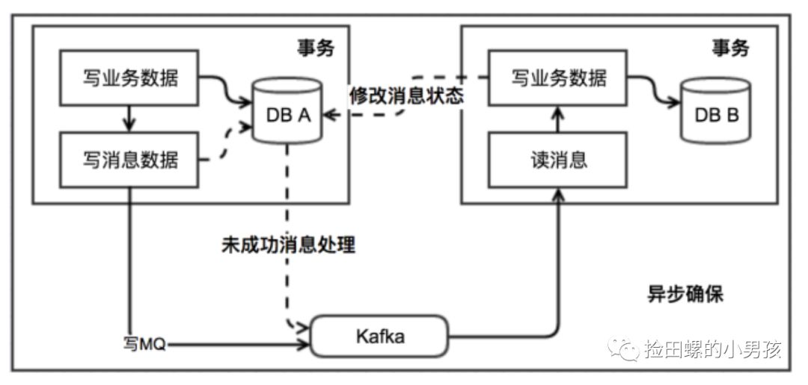
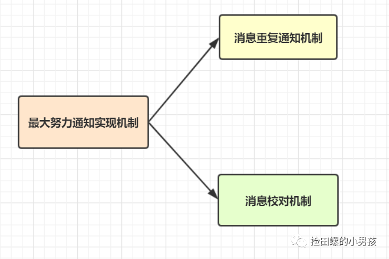

# 分布式知识点

## 1.什么是分布式系统

拿一个最简单的例子，就比如说我们的图书管理系统。之前的系统包含了所有的功能，比如用户注册登录、管理员功能、图书借阅管理等。这叫做集中式系统。也就是一个人干了好几件事。

后来随着功能的增多，用户量也越来越大。集中式系统维护太麻烦，拓展性也不好。于是就考虑着把这些功能分开。通俗的理解就是原本需要一个人干的事，现在分给n个人干，各自干各自的，最终取得和一个人干的效果一样。

稍微正规一点的定义就是：一个业务分拆多个子业务，部署在不同的服务器上。 然后通过一定的通信协议，能够让这些子业务之间相互通信。

## 2.CAP理论

CAP理论指的是一个分布式系统最多只能同时满足**一致性**（Consistency）、**可用性**（Availability）和**分区容错性**（Partition tolerance）这三项中的两项。

（1）一致性

指的是所有节点在同一时间的数据完全一致，从客户端来看，一致性主要指的是多并发访问时更新过的数据如何获取的问题；从服务端来看，则是更新如何分布到整个系统，以保证数据最终一致。

一致的程度不同大体可以分为强、弱、最终一致性三类。

1. 强一致性：对于关系型数据库，要求更新过的数据能被后续的访问都能看到。

2. 弱一致性：如果能容忍后续的部分或者全部访问不到，则是弱一致性。

3. 最终一致性：如果经过一段时间后要求能访问到更新后的数据，则是最终一致性。

（2）可用性

可用性指服务一直可用，而且是正常响应时间。不管什么时候访问，都可以正常的获取数据值，而不会出现问题。好的可用性主要是指系统能够很好的为用户服务，不出现用户操作失败或者访问超时等用户体验不好的情况。

（3）分区容错性

分区容错性指在遇到某节点或网络分区故障的时候，仍然能够对外提供满足一致性和可用性的服务。

**具体实例**

A 在访问节点 N1 的时候将 D1 中的数据从 V0 更改到 V1，D1 发现数据更改便通知 D2 更新数据，此时 B 试图访问节点 N2 中的 D2 获取更新过的 V1 数据，但是在 D1 通知 D2 更新数据时发信了网络故障。

现在我们依然想要我们的系统具有 CAP 三个特性，我们分析一下会发生什么：

（1）系统网络发生了故障，但是系统依然可以访问，因此具有容错性

（2）A 在访问节点 N1 的时候更改了 V0 到 V1，想要 B 访问节点 N2 的 D2 数据库的时候是 V1，因此需要等网络故障恢复，将 N2 节点的数据库进行更新才可以。

（3）在网络故障恢复的这段时间内，想要系统满足可用性，是不可能的。因为可用性要求随时随地访问系统都是正确有效的。这就出现了矛盾。

有两种选择：

（1）牺牲数据一致性，也就是 A 看到的衣服数量是 10，买了一件应该是 9 了。但是 B 看到的依然是 10。

（2）牺牲可用性，也就是 A 看到的衣服数量是 10，买了一件应该是 9 了。但是 B 想要获取的最新的数据的话，那就一直等待阻塞，一直到网络故障恢复。

**CAP特性的取舍**

（1）满足 CA 舍弃 P，也就是满足一致性和可用性，舍弃容错性。但是这也就意味着你的系统不是分布式的了，因为涉及分布式的想法就是把功能分开，部署到不同的机器上。

（2）满足 CP 舍弃 A，也就是满足一致性和容错性，舍弃可用性。如果你的系统允许有段时间的访问失效等问题，这个是可以满足的。就好比多个人并发买票，后台网络出现故障，你买的时候系统就崩溃了。

（3）满足 AP 舍弃 C，也就是满足可用性和容错性，舍弃一致性。这也就是意味着你的系统在并发访问的时候可能会出现数据不一致的情况。

事实证明，大多数都是牺牲了一致性。像 12306 还有淘宝网，就好比是你买火车票，本来你看到的是还有一张票，其实在这个时刻已经被买走了，你填好了信息准备买的时候发现系统提示你没票了。这就是牺牲了一致性。

但是不是说牺牲一致性一定是最好的。就好比 mysql 中的事务机制，张三给李四转了 100 块钱，这时候必须保证张三的账户上少了 100，李四的账户多了 100。因此需要数据的一致性，但是转钱失败是可以允许的，也就是牺牲了可用性。

## 3.BASE理论

BASE 理论是对 CAP 中的**一致性**和**可用性**进行一个权衡的结果，理论的核心思想就是：我们无法做到强一致，但每个应用都可以根据自身的业务特点，采用适当的方式来使系统达到最终一致性。

**Basically Available（基本可用）**

（1）响应时间上的损失：正常情况下，处理用户请求需要 0.5s 返回结果，但是由于系统出现故障，处理用户请求的时间变成 3s。

（2）系统功能上的损失：正常情况下，用户可以使用系统的全部功能，但是由于系统访问量突然剧增，系统的非核心功能无法使用。

**Soft state（软状态）**

数据同步允许一定的延迟。

**Eventually consistent（最终一致性）**

系统中所有的数据副本，在经过一段时间的同步后，最终能够达到一个一致的状态，不要求实时。

## 分布式事务解决方案

分布式事务：分布式事务指的就是分布式系统中的事务，它的存在就是为了保证不同数据库节点的数据一致性。

分布式事务的几种解决方案：

- 2PC(二阶段提交)方案、3PC
- TCC（Try、Confirm、Cancel）
- 本地消息表
- 最大努力通知
- seata

**2PC(二阶段提交)方案**

2PC，即两阶段提交，它将分布式事务的提交拆分为2个阶段：`prepare和commit/rollback`，即准备阶段和提交执行阶段。在prepare准备阶段需要等待所有参与子事务的反馈，因此可能造成数据库资源锁定时间过长，不适合并发高以及子事务生命周长较长的业务场景。并且协调者宕机的话，所有的参与者都收不到提交或回滚指令。

**3PC**

两阶段提交分别是：`CanCommit，PreCommit 和 doCommit`，这里不再详述。3PC 利用超时机制解决了 2PC 的同步阻塞问题，避免资源被永久锁定，进一步加强了整个事务过程的可靠性。但是 3PC 同样无法应对类似的宕机问题，只不过出现多数据源中数据不一致问题的概率更小。

**TCC**

TCC 采用了补偿机制，其核心思想是：针对每个操作，都要注册一个与其对应的确认和补偿（撤销）操作。它分为三个阶段：`Try-Confirm-Cancel`

- try阶段：尝试去执行，完成所有业务的一致性检查，预留必须的业务资源。
- Confirm阶段：该阶段对业务进行确认提交，不做任何检查，因为try阶段已经检查过了，默认Confirm阶段是不会出错的。
- Cancel 阶段：若业务执行失败，则进入该阶段，它会释放try阶段占用的所有业务资源，并回滚Confirm阶段执行的所有操作。

TCC方案让应用可以自定义数据库操作的粒度，降低了锁冲突，可以提升性能。但是应用侵入性强，try、confirm、cancel三个阶段都需要业务逻辑实现。

**本地消息表**

ebay最初提出本地消息表这个方案，来解决分布式事务问题。业界目前使用这种方案是比较多的，它的核心思想就是将分布式事务拆分成本地事务进行处理。可以看一下基本的实现流程图：

**最大努力通知**

最大努力通知方案的目标，就是发起通知方通过一定的机制，最大努力将业务处理结果通知到接收方。

**seata**

Saga 模式是 Seata 提供的长事务解决方案。核心思想是将长事务拆分为多个本地短事务，由Saga事务协调器协调，如果正常结束那就正常完成，如果某个步骤失败，则根据相反顺序一次调用补偿操作。

Saga的并发度高，但是一致性弱，对于转账，可能发生用户已扣款，最后转账又失败的情况。