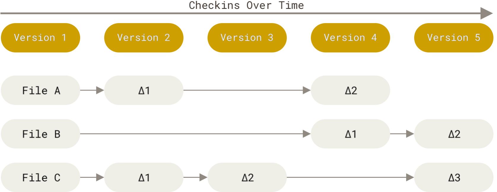
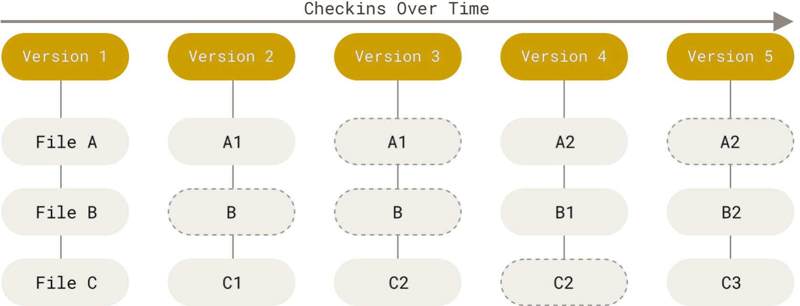
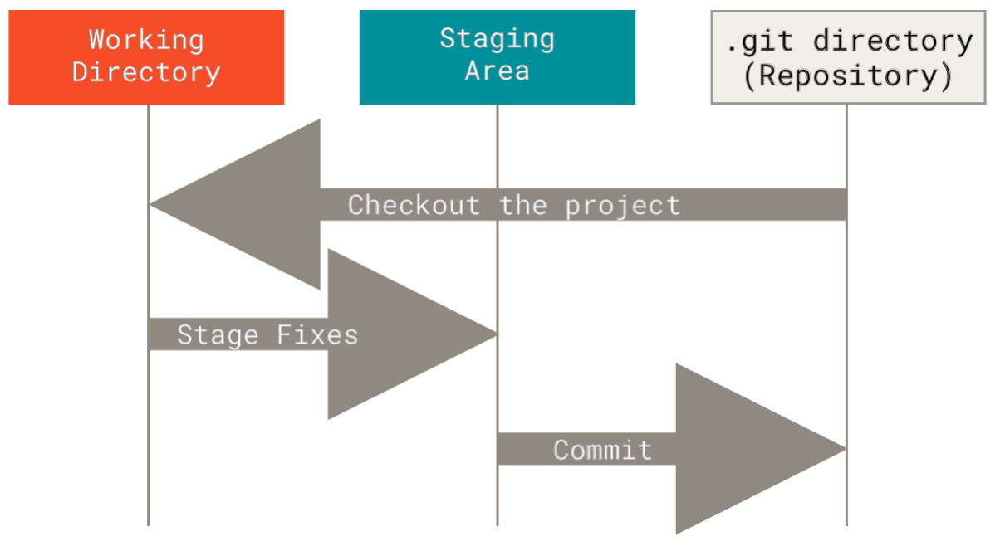

# 第1章_Git简介

## 1.版本控制

 版本控制（Version Control Systems，简称 VCS）是一种记录一个或若干文件内容变化，以便将来查阅特定版本修订情况的系统。

你可以将选定的文件回溯到之前的状态，甚至将整个项目都回退到过去某个时间点的状态，你可以比较文件的变化细节，查出最后是谁修改了哪个地方，从而找出导致怪异问题出现的原因，又是谁在何时报告了某个功能缺陷等等。 

### 1.1 本地版本控制系统

只有在本地管理版本控制。

### 1.2 集中化版本控制系统

集中化版本控制系统（Centralized Version Control Systems，简称 CVCS），可以让不同系统上的开发者协同合作，其有一个单一的集中管理的服务器，保存所有文件的修订版本，而协同工作的人们都通过客户端
连到这台服务器，取出最新的文件或者提交更新。 

这么做最显而易见的缺点是中央服务器的单点故障。 如果宕机一小时，那么在这一小时内，谁都无法提交更新，也就无法协同工作。 如果中心数据库所在的磁盘发生损坏，又没有做恰当备份，毫无疑问你将丢失所有数据——包括项目的整个变更历史，只剩下人们在各自机器上保留的单独快照。 本地版本控制系统也存在类似问题，只要整个项目的历史记录被保存在单一位置，就有丢失所有历史更新记录的风险。

### 1.3 分布式版本控制系统

分布式版本控制系统（Distributed Version Control System，简称 DVCS），客户端并不只提取最新版本的文件快照， 而是把**代码仓库完整地镜像下来**，包括完整的历史记录。 这么一来，任何一处协同工作用的服务器发生故障，事后都可以用任何一个镜像出来的本地仓库恢复。 因为每一次的克隆操作，实际上都是一次对代码仓库的完整备份。

## 2.Git是什么

### 2.1 直接记录快照，而非差异比较

Git 和其它版本控制系统（包括 Subversion 和近似工具）的主要差别在于 Git 对待数据的方式。其它大部分系统以文件变更列表的方式存储信息，这类系统（CVS、Subversion、Perforce、Bazaar 等
等） 将它们存储的信息看作是一组基本文件和每个文件随时间逐步**累积的差异**。



反之，Git 更像是把数据看作是对小型文件系统的一系列快照。 在 Git 中，每当你提交更新或保存项目状态时，它基本上就会对当时的全部文件创建一个快照并保存这个快照的索引。为了效率，如果文件没有修改，Git 不再重新存储该文件，而是只保留一个链接指向之前存储的文件。 Git 对待数据更像是一个**快照流**。



### 2.2 近乎所有操作都是本地执行

在 Git 中的绝大多数操作都只需要访问本地文件和资源，一般不需要来自网络上其它计算机的信息。因为你在本地磁盘上就有项目的完整历史，所以大部分操作看起来瞬间完成。

### 2.3 保证完整性

Git 中所有的数据在存储前都计算校验和，然后以校验和来引用。

Git 用以计算校验和的机制叫做`SHA-1`散列（hash）。 这是一个由 40 个十六进制字符（0-9 和 a-f）组成的字符串，基于 Git 中文件的内容或目录结构计算出来。`SHA-1`哈希看起来是这样：

```bash
24b9da6552252987aa493b52f8696cd6d3b00373
```

实际上，Git 数据库中保存的信息都是以文件内容的哈希值来索引，而不是文件名。

### 2.4 一般只添加数据

你执行的 Git 操作，几乎只往 Git 数据库中**添加数据**。 你很难使用 Git 从数据库中删除数据，也就是说 Git 几乎不会执行任何可能导致文件不可恢复的操作。 同别的 VCS 一样，未提交更新时有可能丢失或弄乱修改的内容。但是一旦你提交快照到 Git 中， 就难以再丢失数据，特别是如果你定期的推送数据库到其它仓库的话。

### ==2.5 三种状态==

Git 有三种状态，你的文件可能处于其中之一：

（1）**已修改（modified）**：表示修改了文件，但还没保存到数据库中。

（2）**已暂存（staged）**：表示对一个已修改文件的当前版本做了标记，使之包含在下次提交的快照中。

（3）**已提交（committed）**：表示数据已经安全地保存在本地数据库中。


这会让我们的 Git 项目拥有三个阶段：工作区、暂存区以及 Git 目录。



工作区（working Directory）是对项目的某个版本独立提取出来的内容。 这些从 Git 仓库的压缩数据库中提取出来的文件，放在磁盘上供你使用或修改。

暂存区（Staging Area）是一个文件，保存了**下次将要提交的文件列表信息**，一般在 Git 仓库目录中。 按照 Git 的术语叫做“索引”，不过一般说法还是叫“暂存区”。

Git 仓库目录（Git Repository）是 Git 用来保存项目的元数据和对象数据库的地方。 这是 Git 中最重要的部分，从其它计算机克隆仓库时，复制的就是这里的数据。

基本的 Git 工作流程如下：

1. 在工作区中修改文件。
2. 将你想要下次提交的更改选择性地暂存，这样只会将更改的部分添加到暂存区。
3. 提交更新，找到暂存区的文件，将快照永久性存储到 Git 目录。

如果 Git 目录中保存着特定版本的文件，就属于**已提交**状态。 如果文件已修改并放入暂存区，就属于**已暂存**状态。 如果自上次检出后，作了修改但还没有放到暂存区域，就是**已修改**状态。

## 3.安装Git

### 3.1 在Linux上安装

如果你想在 Linux 上用二进制安装程序来安装基本的 Git 工具，可以使用发行版包含的基础软件包管理工具来安装。 以 Fedora 为例，如果你在使用它（或与之紧密相关的基于 RPM 的发行版，如 RHEL 或 CentOS），你可以使用`dnf`：

```bash
$ sudo dnf install git-all
```

如果你在基于 Debian 的发行版上，如 Ubuntu，请使用`apt`：

```bash
$ sudo apt install git-all
```

要了解更多选择，[Git 官方网站](https://git-scm.com/download/linux)上有在各种 Unix 发行版的系统上安装步骤。

```bash
$ $ sudo yum install git-all
```

### 3.2 在macOS上安装

在 Mac 上安装 Git 有多种方式。 最简单的方法是安装`Xcode Command Line Tools`。Mavericks （10.9）或更高版本的系统中，在 Terminal 里尝试首次运行 git 命令即可。

```bash
$ git --version
```

如果没有安装过命令行开发者工具，将会提示你安装。

如果你想安装更新的版本，可以使用二进制安装程序。 官方维护的 macOS Git 安装程序可以在[Git 官方网站](https://git-scm.com/download/mac)下载。

你也可以将它作为 GitHub for macOS 的一部分来安装。 它们的图形化 Git 工具有一个安装命令行工具的选项。你可以从[GitHub for macOS 网站](https://mac.github.com)下载该工具。

### 3.3 在Windows上安装

在 Windows 上安装 Git 也有几种安装方法。 官方版本可以在[Git 官方网站](https://git-scm.com/download/win)下载。要注意这是一个名为`Git for Windows`的项目（也叫做 msysGit），和 Git 是分别独立的项目；更多信息请访问 http://msysgit.github.io/。

要进行自动安装，你可以使用`Git Chocolatey`包。 注意 Chocolatey 包是由社区维护的。

另一个简单的方法是安装`GitHub Desktop`。 该安装程序包含图形化和命令行版本的 Git。 它也能支持 Powershell，提供了稳定的凭证缓存和健全的换行设置。 稍后我们会对这方面有更多了解，现在只要一句话就够了，这些都是你所需要的。 你可以在[GitHub for Windows](https://desktop.github.com/)网站下载。

### 3.4 从源代码安装

如果你想从源码安装 Git，需要安装 Git 依赖的库：autotools、curl、zlib、openssl、expat 和 libiconv。 如果你的系统上有 dnf （如 Fedora）或者 apt（如基于 Debian 的系统），可以使用对应的命令来安装最少的依赖以便编译并安装 Git 的二进制版：

```bash
$ sudo dnf install dh-autoreconf curl-devel expat-devel gettext-devel \
  openssl-devel perl-devel zlib-devel
$ sudo apt-get install dh-autoreconf libcurl4-gnutls-dev libexpat1-dev \
  gettext libz-dev libssl-dev
```

为了添加文档的多种格式（doc、html、info），需要以下附加的依赖：

```bash
$ sudo dnf install asciidoc xmlto docbook2X
$ sudo apt-get install asciidoc xmlto docbook2x
```

> 使用 RHEL 和 RHEL 衍生版，如 CentOS 和 Scientific Linux 的用户需要开启 EPEL 库以便下载 docbook2X 包。

如果你使用基于 Debian 的发行版（Debian/Ubuntu/Ubuntu-derivatives），你也需要`install-info`包：

```bash
$ sudo apt-get install install-info
```

如果你使用基于 RPM 的发行版（Fedora/RHEL/RHEL衍生版），你还需要`getopt`包 （它已经在基于 Debian的发行版中预装了）：

```bash
$ sudo dnf install getopt
```

此外，如果你使用 Fedora/RHEL/RHEL衍生版，那么你需要执行以下命令：

```bash
$ sudo ln -s /usr/bin/db2x_docbook2texi /usr/bin/docbook2x-texi
```

以此来解决二进制文件名的不同。

当你安装好所有的必要依赖，你可以继续从几个地方来取得最新发布版本的 tar 包。 你可以从[Kernel.org](https://www.kernel.org/pub/software/scm/git)网站获取， 或从[GitHub 网站](https://github.com/git/git/releases)上的镜像来获得。 通常在 GitHub 上的是最新版本，但 kernel.org 上包含有文件下载签名，如果你想验证下载正确性的话会用到。

接着，编译并安装：

```bash
$ tar -zxf git-2.8.0.tar.gz
$ cd git-2.8.0
$ make configure
$ ./configure --prefix=/usr
$ make all doc info
$ sudo make install install-doc install-html install-info
```

完成后，你可以使用 Git 来获取 Git 的更新：

```bash
$ git clone git://git.kernel.org/pub/scm/git/git.git
```

## 4.初次运行前的配置

Git 自带一个`git config`的工具来帮助设置控制 Git 外观和行为的配置变量。 这些变量存储在三个不同的位置：

1. /etc/gitconfig 文件：包含系统上每一个用户及他们仓库的通用配置。 如果在执行`git config`时带上`--system`选项，那么它就会读写该文件中的配置变量。（由于它是系统配置文件，因此你需要管理员或超级用户权限来修改它）

2. ~/.gitconfig 或 ~/.config/git/config 文件：只针对当前用户。你可以传递`--global`选项让 Git 读写此文件，这会对你系统上**所有的仓库**生效。

3. 当前使用仓库的 Git 目录中的 config 文件（即 .git/config ）：针对该仓库。 你可以传递`--local`（默认，可以不加该参数）选项让 Git 强制读写此文件。（当然，你需要进入某个 Git 仓库中才能让该选项生效）

每一个级别会覆盖上一级别的配置，所以 .git/config 的配置变量会覆盖 /etc/gitconfig 中的配置变量。

在 Windows 系统中，Git 会查找 $HOME 目录下（一般情况下是 C:\Users\$USER ）的 .gitconfig 文件。Git 同样也会寻找 /etc/gitconfig 文件，但只限于 MSys 的根目录下，即安装 Git 时所选的目标位置。 如果你在 Windows 上使用 Git 2.x 以后的版本，那么还有一个系统级的配置文件，Windows XP 上在 C:\Documents and Settings\All Users\Application Data\Git\config ，Windows Vista 及更新的版本在 C:\ProgramData\Git\config 。此文件只能以管理员权限通过`git config -f <file>`来修改。

你可以通过以下命令查看所有的配置以及它们所在的文件：

```bash
$ git config --list --show-origin
```

### 4.1 用户信息

安装完 Git 之后，要做的第一件事就是设置你的**用户名**和**邮件地址**。 这一点很重要，因为每一个 Git 提交都会使用这些信息，它们会写入到你的每一次提交中，不可更改：

```bash
$ git config --global user.name "zhao"
$ git config --global user.email zhao@gmail.com
```

再次强调，如果使用了`--global`选项，那么该命令只需要运行一次。 当你想针对特定项目使用不同的用户名称与邮件地址时，可以在那个项目目录下运行**没有**`--global`选项的命令来配置。

### 4.2 文本编辑器

你可以配置默认文本编辑器，当 Git 需要你输入信息时会调用它。 如果未配置，Git 会使用操作系统默认的文本编辑器。

如果你想使用不同的文本编辑器，例如 Emacs，可以这样做：

```bash
$ git config --global core.editor emacs
```

在 Windows 系统上，如果你想要使用别的文本编辑器，那么必须指定可执行文件的完整路径。

对于 Notepad++，一个流行的代码编辑器来说，你可能想要使用 32 位的版本， 因为在本书编写时 64 位的版本尚不支持所有的插件。 如果你在使用 32 位的 Windows 系统，或在 64 位系统上使用 64 位的编辑器，那么你需要输入如下命令：

```bash
$ git config --global core.editor "'C:/ProgramFiles/Notepad++/notepad++.exe' -multiInst -notabbar -nosession -noPlugin"
```

> Vim、Emacs 和 Notepad++ 都是流行的文本编辑器，通常程序员们会在 Linux 和 macOS 这类基于 Unix 的系统或 Windows 系统上使用它们。 如果你在使用其他的或 32 位版本的编辑器，请在`git config core.editor`命令中查看设置为该编辑器的具体步骤。

### 4.3 检查配置信息

如果想要检查你的配置，可以使用`git config --list`命令来列出所有 Git 当时能找到的配置。

```bash
$ git config --list
user.name=John Doe
user.email=johndoe@example.com
color.status=auto
color.branch=auto
color.interactive=auto
color.diff=auto
...
```

你可能会看到重复的变量名，因为 Git 会从不同的文件中读取同一个配置（例如：/etc/gitconfig 与 ~/.gitconfig）。 这种情况下，Git 会使用它找到的每一个变量的最后一个配置。

你可以通过输入`git config <key>`来检查 Git 的某一项配置：

```bash
$ git config user.name
John Doe
```

> 由于 Git 会从多个文件中读取同一配置变量的不同值，因此你可能会在其中看到意料之外的值而不知道为什么。 此时，你可以查询 Git 中该变量的 原始 值，它会告诉你哪一个配置文件最后设置了该值：
>
> ```bash
> $ git config --show-origin user.name
> file:C:/Users/Administrator/.gitconfig  admin
> ```

### 4.4 获取帮助

有三种等价的方法可以找到 Git 命令的综合手册（manpage）：

```bash
$ git help <verb>
$ git <verb> --help
$ man git-<verb>
```

例如，要想获得`git config`命令的手册，执行

```bash
$ git help config
```

如果你觉得手册或者本书的内容还不够用，你可以尝试在[Freenode IRC](https://freenode.net)服务器上的 #git 或 #github 频道寻求帮助。

此外，如果你不需要全面的手册，只需要可用选项的快速参考，那么可以用 -h 选项获得更简明的 “help” 输出：

```bash
$ git remote -h
usage: git remote [-v | --verbose]
   or: git remote add [-t <branch>] [-m <master>] [-f] [--tags | --no-tags] [--mirror=<fetch|push>] <name> <url>
   or: git remote rename <old> <new>
   or: git remote remove <name>
   or: git remote set-head <name> (-a | --auto | -d | --delete | <branch>)
   or: git remote [-v | --verbose] show [-n] <name>
   or: git remote prune [-n | --dry-run] <name>
   or: git remote [-v | --verbose] update [-p | --prune] [(<group> | <remote>)...]
   or: git remote set-branches [--add] <name> <branch>...
   or: git remote get-url [--push] [--all] <name>
   or: git remote set-url [--push] <name> <newurl> [<oldurl>]
   or: git remote set-url --add <name> <newurl>
   or: git remote set-url --delete <name> <url>

    -v, --verbose         be verbose; must be placed before a subcommand
```

## 5.Git更新

### 5.1 Windows下更新

```bash
git update-git-for-windows
```

