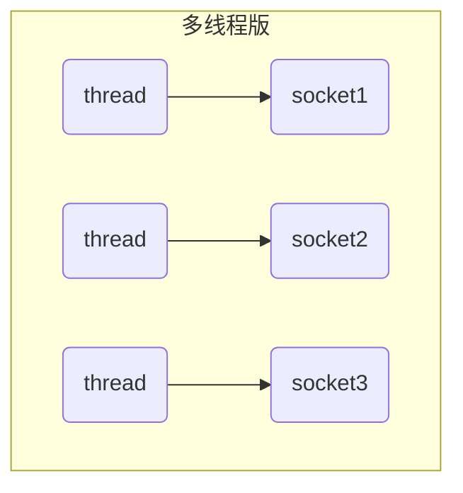
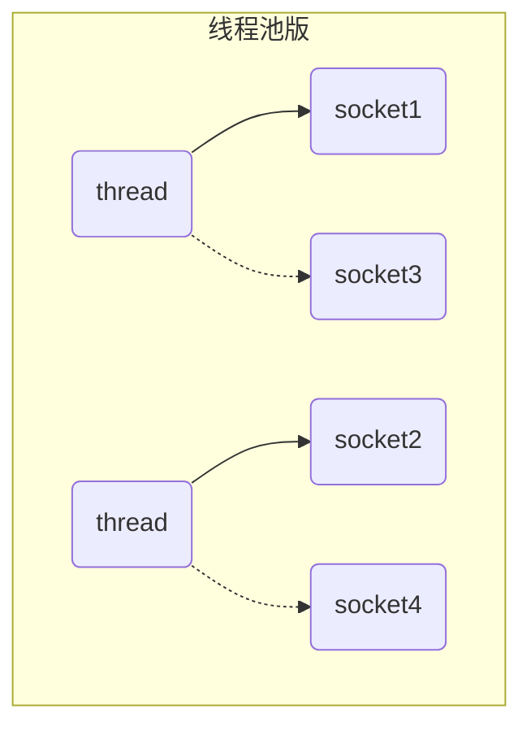
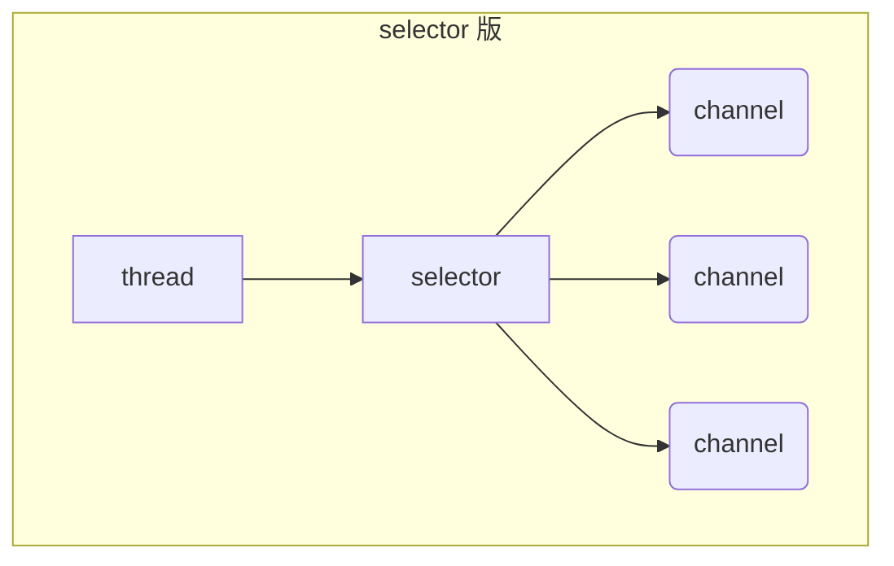
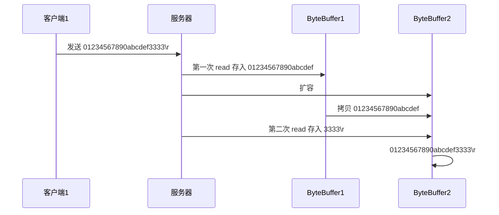

# 第2章_NIO基础

Java NIO（New IO）也有人称之为 java non-blocking IO 是从 Java 1.4 版本开始引入的一个新的 IO API，可以替代标准的 Java IO API。NIO 与原来的 IO 有同样的作用和目的，但是使用的方式完全不同，NIO 支持**面向缓冲区**的、基于**通道**的 IO 操作。NIO 将以更加高效的方式进行文件的读写操作。

NIO 可以理解为非阻塞 IO，传统的 IO 的 read 和 write 只能阻塞执行，线程在读写 IO 期间不能干其他事情，比如调用`socket.read()`时，如果服务器一直没有数据传输过来，线程就一直阻塞，而 NIO 中可以配置 socket 为非阻塞模式。NIO 相关类都被放在`java.nio`包及子包下，并且对原`java.io`包中的很多类进行改写。Java NIO 的非阻塞模式，使一个线程从某通道发送请求或者读取数据，但是它仅能得到目前可用的数据，如果目前没有数据可用时，就什么都不会获取，而不是保持线程阻塞，所以直至数据变的可以读取之前，该线程可以继续做其他的事情。 非阻塞写也是如此，一个线程请求写入一些数据到某通道，但不需要等待它完全写入，这个线程同时可以去做别的事情。

**NIO和BIO的比较**

* BIO 以流的方式处理数据，而 NIO 以块的方式处理数据，块 I/O 的效率比流 I/O 高很多
* BIO 是阻塞的，NIO 则是非阻塞的
* BIO 基于字节流和字符流进行操作，而 NIO 基于 Channel（通道）和 Buffer（缓冲区）进行操作，数据总是从通道读取到缓冲区中，或者从缓冲区写入到通道中。Selector（选择器）用于监听多个通道的事件（比如：连接请求，数据到达等），因此使用单个线程就可以监听多个客户端通道

| NIO                       | BIO                  |
| ------------------------- | -------------------- |
| 面向缓冲区（Buffer）      | 面向流（Stream）     |
| 非阻塞（Non Blocking IO） | 阻塞 IO(Blocking IO) |
| 选择器（Selectors）       |                      |

NIO 有三大核心部分：**Channel(通道) 、Buffer(缓冲区)、Selector(选择器)**。

## 1.三大组件

### 1.1 缓冲区（Buffer）

一个用于特定基本数据类型的容器。由`java.nio`包定义的，所有缓冲区都是 Buffer 抽象类的子类.。Java NIO 中的 Buffer 主要用于与 NIO 通道进行交互，数据是从通道读入缓冲区，从缓冲区写入通道中的。


#### 1.Buffer类及其子类

**Buffer**就像一个数组，可以保存多个相同类型的数据。根据数据类型不同 ，有以下 Buffer 常用子类：

* ByteBuffer 
* CharBuffer 
* ShortBuffer 
* IntBuffer 
* LongBuffer 
* FloatBuffer 
* DoubleBuffer 

上述 Buffer 类都采用相似的方法进行管理数据，只是各自管理的数据类型不同而已。都是通过如下方法获取一个 Buffer 对象：

```java
// 创建一个容量为 capacity 的 XxxBuffer 对象
static XxxBuffer allocate(int capacity) {}
```

#### 2.缓冲区的基本属性

Buffer 中的重要概念：

* **容量（capacity）**：作为一个内存块，Buffer 具有一定的固定大小，也称为"容量"，缓冲区容量不能为负，并且创建后不能更改。 
* **限制（limit）**：表示缓冲区中可以操作数据的大小（limit 后数据不能进行读写）。缓冲区的限制不能为负，并且不能大于其容量。 写入模式，限制等于 buffer 的容量。读取模式下，limit 等于写入的数据量。
* **位置（position）**：下一个要读取或写入的数据的索引，缓冲区的位置不能为负，并且不能大于其限制。
* **标记（mark）与重置（reset）**：标记是一个索引，通过 Buffer 中的`mark()`方法 指定 Buffer 中一个特定的 position，之后可以通过调用 reset() 方法恢复到这个 position。

标记、位置、限制、容量遵守以下不变式：`0 <= mark <= position <= limit <= capacity`

一开始


写模式下，position 是写入位置，limit 等于容量，下图表示写入了 4 个字节后的状态


flip 动作发生后，position 切换为读取位置，limit 切换为读取限制（Limit 为 5）


读取 4 个字节后，状态


clear 动作发生后，状态


compact 方法，是把未读完的部分向前压缩，然后切换至写模式


#### 3.Buffer常见方法

可以使用`allocate()`或`allocateDirect()`方法为 ByteBuffer 分配空间，其它 buffer 类也有该方法：

```java
Bytebuffer heapByteBuffer = ByteBuffer.allocate(16);
Bytebuffer DirectByteBuffer = ByteBuffer.allocateDirect(16);
System.out.println(heapByteBuffer.getClass()); // java.nio.HeapByteBuffer - 使用 java 堆内存，读写效率低，受 GC 影响
System.out.println(DirectByteBuffer.getClass()); // java.nio.DirectByteBuffer - 使用直接内存，读写效率高，不受 GC 影响，分配内存效率低下，存在内存泄漏问题
```

> **allocate 和 directAllocate**
>
> 根据官方文档的描述：
>
> ​    `byte byffer`可以是两种类型，一种是基于直接内存（也就是非堆内存）；另一种是非直接内存（也就是堆内存）。对于直接内存来说，JVM 将会在 IO 操作上具有更高的性能，因为它直接作用于本地系统的 IO 操作。而非直接内存，也就是堆内存中的数据，如果要作 IO 操作，会先从本进程内存复制到直接内存，再利用本地IO处理。
>
> 从数据流的角度，非直接内存是下面这样的作用链：
>
> ```
> 本地IO-->直接内存-->非直接内存-->直接内存-->本地IO
> ```
>
> 而直接内存是：
>
> ```
> 本地IO-->直接内存-->本地IO
> ```
>
> ​    很明显，在做IO处理时，比如网络发送大量数据时，直接内存会具有更高的效率。直接内存使用 allocateDirect 创建，但是它比申请普通的堆内存需要耗费更高的性能。不过，这部分的数据是在 JVM 之外的，因此它不会占用应用的内存。所以呢，当你有很大的数据要缓存，并且它的生命周期又很长，那么就比较适合使用直接内存。只是一般来说，如果不是能带来很明显的性能提升，还是推荐直接使用堆内存。字节缓冲区是直接缓冲区还是非直接缓冲区可通过调用其 isDirect()  方法来确定。
>
> ​    虽然 directAllocate 分配的内存不由 jvm 管理但他所属的对像还是由 jvm 管理的（比如 ByteBuffer 这类型的对像），所以当对像消亡时就是这段内存释放的时候
>
> **使用场景**
>
> - 1 有很大的数据需要存储，它的生命周期又很长
> - 2 适合频繁的 IO 操作，比如网络并发场景

**其他常用方法**

```java
Buffer clear() 清空缓冲区并返回对缓冲区的引用
Buffer flip() 将缓冲区的界限设置为当前位置，并将当前位置重置为 0
int capacity() 返回 Buffer 的 capacity 大小
boolean hasRemaining() 判断缓冲区中是否还有元素
int limit() 返回 Buffer 的界限（limit）的位置
Buffer limit(int n) 将 limit 设置为 n, 并返回一个具有新 limit 的缓冲区对象
Buffer mark() 对缓冲区设置标记
int position() 返回缓冲区的当前位置 position
Buffer position(int n) 将 position 设置为 n, 并返回修改后的 Buffer 对象
int remaining() 返回 position 和 limit 之间的元素个数
Buffer reset() 将 position 转到以前设置的 mark 所在的位置
Buffer rewind() 将 position 设为 0，取消设置的 mark
```

> **`clear()`、`rewind()`、`flip()`方法的区别**
>
> - `clear()`方法用于写模式，其作用为清空 Buffer 中的内容，所谓清空是指将 limit 设置为 capacity 大小，同时将当前写位置置为最前端下标为 0 处
>
> - `rewind()`在读写模式下都可用，它单纯的将当前位置置 0，同时取消 mark 标记
> - `flip()`函数的作用是将写模式转变为读模式，即将写模式下的 Buffer 中内容的最后位置变为读模式下的 limit 位置，作为读越界位置，同时将当前读位置置为 0，表示转换后重头开始读，同时再消除写模式下的 mark 标记

**字符串与ByteBuffer互转**

```java
/// 字符串转换为 ByteBuffer
// 1.ByteBuffer.put()
ByteBuffer buffer1 = ByteBuffer.allocate(16);
buffer1.put("hello".getBytes());
// 2.ByteBuffer.wrap()
ByteBuffer buffer2 = ByteBuffer.wrap("hello".getBytes());
// 3.使用 StandardCharsets
ByteBuffer buffer3 = StandardCharsets.UTF_8.encode("你好");

/// ByteBuffer 转换为字符串
// 使用 StandardCharsets
CharBuffer buffer5 = StandardCharsets.UTF_8.decode(buffer2);
String str1 = buffer5.toString();
// 注意：使用 decode 时必须将 position 重置，对于第一种字符串转换为 ByteBuffer 方法，由于其 position 还没有重置，直接使用 decode 会转换第 5 位到 15 位的字符
String str2 = StandardCharsets.UTF_8.decode(buffer1).toString();
System.out.println("str2: " + str2 + "; str2.length: " + str2.length()); // str2:            ; str2.length: 11

// 使用 flip() 重置 position 为 0
buffer1.flip();
// 使用 limit() 重置 limit 为 5
buffer1.limit(5);
String str3 = StandardCharsets.UTF_8.decode(buffer1).toString();
System.out.println("str3: " + str3); // str3: hello
```

#### 4.缓冲区的数据操作

```java
// Buffer 所有子类提供了两个用于数据操作的方法：get() put() 方法
// 获取 Buffer 中的数据
get()：读取单个字节
get(byte[] dst)：批量读取多个字节到 dst 中
get(int index)：读取指定索引位置的字节(不会移动 position)
get(byte[] dst, int offset, int length)：
    for (int i = offset; i < end; i++)
            dst[i] = get();
    
// 放入数据到 Buffer 中
put(byte b)：将给定单个字节写入缓冲区的当前位置
put(byte[] src)：将 src 中的字节写入缓冲区的当前位置
put(int index, byte b)：将指定字节写入缓冲区的索引位置(不会移动 position)
```

**使用 Buffer 读写数据一般遵循以下四个步骤：**

* 写入数据到 Buffer

* 调用`flip()`方法，转换为读取模式

* 从 Buffer 中读取数据

* 调用`buffer.clear()`方法或者`buffer.compact()`方法清除缓冲区

  > **`clear`与`compact`**
  >
  > - `clear`是把 position=0，limit=capcity 等，也就是说，除了内部数组，其他属性都还原到 buffer 创建时的初始值，而内部数组的数据虽然没赋为 null，但只要不在 clear 之后误用 `buffer.get`就不会有问题，正确用法是使用`buffer.put`从头开始写入数据;
  >
  > - `compcat`是把 buffer 中内部数组剩余未读取的数据复制到该数组从索引为 0 开始，然后 position 设置为复制剩余数据后的最后一位元素的索引 +1，limit 设置为 capcity，此时在 0\~position 之间是未读数据，而 position~limit 之间是 buffer 的剩余空间，可以 put 数据。
  >
  > 使用场景：
  >
  > 当 buffer 未被完全读取完时，可以执行`compact`把剩余未读取数据往缓冲数据前面移动，compact 移动完后，可以再次使用 put 往该 buffer 里 put 数据，此时数据会被写到剩余数据之后

#### 5.Buffer的线程安全

Buffer 是==非线程安全的==。

#### 6.入门案例

有一普通文本文件 data.txt，内容为：

```
1234567890abcd
```

使用 FileChannel 来读取文件内容：

```java
@Slf4j
public class ChannelDemo1 {
    public static void main(String[] args) {
        try (RandomAccessFile file = new RandomAccessFile("helloword/data.txt", "rw")) {
            FileChannel channel = file.getChannel();
            ByteBuffer buffer = ByteBuffer.allocate(10);
            do {
                // 向 buffer 写入
                int len = channel.read(buffer);
                log.debug("读到字节数：{}", len);
                if (len == -1) {
                    break;
                }
                // 切换 buffer 读模式
                buffer.flip();
                while(buffer.hasRemaining()) { // 是否还有剩余未读数据
                    // 打印读取的数据
                    log.debug("读到的数据：{}", (char)buffer.get());
                }
                // 切换 buffer 写模式
                buffer.clear();
            } while (true);
        } catch (IOException e) {
            e.printStackTrace();
        }
    }
}
```

#### 7.练习

网络上有多条数据发送给服务端，数据之间使用`\n`进行分隔，但由于某种原因这些数据在接收时，被进行了重新组合，例如原始数据有 3 条为：

* Hello,world\n
* I'm zhangsan\n
* How are you?\n

变成了下面的两个 byteBuffer：

* Hello,world\nI'm zhangsan\nHo（黏包）
* w are you?\n（半包）

现在要求你编写程序，将错乱的数据恢复成原始的按`\n`分隔的数据

```java
public static void main(String[] args) {
    ByteBuffer source = ByteBuffer.allocate(32);
    //                     11            24
    source.put("Hello,world\nI'm zhangsan\nHo".getBytes());
    split(source);

    source.put("w are you?\nhaha!\n".getBytes());
    split(source);
}

private static void split(ByteBuffer source) {
    source.flip();
    int length = source.limit();
    for (int i = 0; i < length; i++) {
        if (source.get(i) == StringUtil.LINE_FEED) {
            // 修改 limit 为当前换行符位置
            source.limit(i);
            // 申请 ByteBuffer 空间
            ByteBuffer out = ByteBuffer.allocate(i - source.position());
            // 向 out 中写入 source 的 position 到 limit 的内容
            out.put(source);
            debugAll(out);
            // 重置 limit，否则当 position 大于 limit 则会报错
            source.limit(length);
            // 修改 position 为换行符下一个字符
            source.position(i + 1);
        }
    }
    source.compact();
}
```

#### 💡 调试工具类

扩展 Netty 自带的`ByteBufUtil`工具类。

```java
public class ByteBufferUtil {
    private static final char[] BYTE2CHAR = new char[256];
    private static final char[] HEXDUMP_TABLE = new char[256 * 4];
    private static final String[] HEXPADDING = new String[16];
    private static final String[] HEXDUMP_ROWPREFIXES = new String[65536 >>> 4];
    private static final String[] BYTE2HEX = new String[256];
    private static final String[] BYTEPADDING = new String[16];

    static {
        final char[] DIGITS = "0123456789abcdef".toCharArray();
        for (int i = 0; i < 256; i++) {
            HEXDUMP_TABLE[i << 1] = DIGITS[i >>> 4 & 0x0F];
            HEXDUMP_TABLE[(i << 1) + 1] = DIGITS[i & 0x0F];
        }

        int i;

        // Generate the lookup table for hex dump paddings
        for (i = 0; i < HEXPADDING.length; i++) {
            int padding = HEXPADDING.length - i;
            StringBuilder buf = new StringBuilder(padding * 3);
            for (int j = 0; j < padding; j++) {
                buf.append("   ");
            }
            HEXPADDING[i] = buf.toString();
        }

        // Generate the lookup table for the start-offset header in each row (up to 64KiB).
        for (i = 0; i < HEXDUMP_ROWPREFIXES.length; i++) {
            StringBuilder buf = new StringBuilder(12);
            buf.append(NEWLINE);
            buf.append(Long.toHexString(i << 4 & 0xFFFFFFFFL | 0x100000000L));
            buf.setCharAt(buf.length() - 9, '|');
            buf.append('|');
            HEXDUMP_ROWPREFIXES[i] = buf.toString();
        }

        // Generate the lookup table for byte-to-hex-dump conversion
        for (i = 0; i < BYTE2HEX.length; i++) {
            BYTE2HEX[i] = ' ' + StringUtil.byteToHexStringPadded(i);
        }

        // Generate the lookup table for byte dump paddings
        for (i = 0; i < BYTEPADDING.length; i++) {
            int padding = BYTEPADDING.length - i;
            StringBuilder buf = new StringBuilder(padding);
            for (int j = 0; j < padding; j++) {
                buf.append(' ');
            }
            BYTEPADDING[i] = buf.toString();
        }

        // Generate the lookup table for byte-to-char conversion
        for (i = 0; i < BYTE2CHAR.length; i++) {
            if (i <= 0x1f || i >= 0x7f) {
                BYTE2CHAR[i] = '.';
            } else {
                BYTE2CHAR[i] = (char) i;
            }
        }
    }

    /**
     * 打印所有内容
     * @param buffer
     */
    public static void debugAll(ByteBuffer buffer) {
        int oldlimit = buffer.limit();
        buffer.limit(buffer.capacity());
        StringBuilder origin = new StringBuilder(256);
        appendPrettyHexDump(origin, buffer, 0, buffer.capacity());
        System.out.println("+--------+-------------------- all ------------------------+----------------+");
        System.out.printf("position: [%d], limit: [%d]\n", buffer.position(), oldlimit);
        System.out.println(origin);
        buffer.limit(oldlimit);
    }

    /**
     * 打印可读取内容
     * @param buffer
     */
    public static void debugRead(ByteBuffer buffer) {
        StringBuilder builder = new StringBuilder(256);
        appendPrettyHexDump(builder, buffer, buffer.position(), buffer.limit() - buffer.position());
        System.out.println("+--------+-------------------- read -----------------------+----------------+");
        System.out.printf("position: [%d], limit: [%d]\n", buffer.position(), buffer.limit());
        System.out.println(builder);
    }

    private static void appendPrettyHexDump(StringBuilder dump, ByteBuffer buf, int offset, int length) {
        if (isOutOfBounds(offset, length, buf.capacity())) {
            throw new IndexOutOfBoundsException(
                    "expected: " + "0 <= offset(" + offset + ") <= offset + length(" + length
                            + ") <= " + "buf.capacity(" + buf.capacity() + ')');
        }
        if (length == 0) {
            return;
        }
        dump.append(
                "         +-------------------------------------------------+" +
                        NEWLINE + "         |  0  1  2  3  4  5  6  7  8  9  a  b  c  d  e  f |" +
                        NEWLINE + "+--------+-------------------------------------------------+----------------+");

        final int startIndex = offset;
        final int fullRows = length >>> 4;
        final int remainder = length & 0xF;

        // Dump the rows which have 16 bytes.
        for (int row = 0; row < fullRows; row++) {
            int rowStartIndex = (row << 4) + startIndex;

            // Per-row prefix.
            appendHexDumpRowPrefix(dump, row, rowStartIndex);

            // Hex dump
            int rowEndIndex = rowStartIndex + 16;
            for (int j = rowStartIndex; j < rowEndIndex; j++) {
                dump.append(BYTE2HEX[getUnsignedByte(buf, j)]);
            }
            dump.append(" |");

            // ASCII dump
            for (int j = rowStartIndex; j < rowEndIndex; j++) {
                dump.append(BYTE2CHAR[getUnsignedByte(buf, j)]);
            }
            dump.append('|');
        }

        // Dump the last row which has less than 16 bytes.
        if (remainder != 0) {
            int rowStartIndex = (fullRows << 4) + startIndex;
            appendHexDumpRowPrefix(dump, fullRows, rowStartIndex);

            // Hex dump
            int rowEndIndex = rowStartIndex + remainder;
            for (int j = rowStartIndex; j < rowEndIndex; j++) {
                dump.append(BYTE2HEX[getUnsignedByte(buf, j)]);
            }
            dump.append(HEXPADDING[remainder]);
            dump.append(" |");

            // Ascii dump
            for (int j = rowStartIndex; j < rowEndIndex; j++) {
                dump.append(BYTE2CHAR[getUnsignedByte(buf, j)]);
            }
            dump.append(BYTEPADDING[remainder]);
            dump.append('|');
        }

        dump.append(NEWLINE +
                "+--------+-------------------------------------------------+----------------+");
    }

    private static void appendHexDumpRowPrefix(StringBuilder dump, int row, int rowStartIndex) {
        if (row < HEXDUMP_ROWPREFIXES.length) {
            dump.append(HEXDUMP_ROWPREFIXES[row]);
        } else {
            dump.append(NEWLINE);
            dump.append(Long.toHexString(rowStartIndex & 0xFFFFFFFFL | 0x100000000L));
            dump.setCharAt(dump.length() - 9, '|');
            dump.append('|');
        }
    }

    public static short getUnsignedByte(ByteBuffer buffer, int index) {
        return (short) (buffer.get(index) & 0xFF);
    }
}
```

### 1.2 Channel

通道（Channel）由`java.nio.channels`包定义的，Channel 表示 IO 源与目标打开的连接，Channel 类似于传统的“流”，只不过 Channel 本身不能直接访问数据，Channel 只能与 Buffer 进行交互。

-  NIO 的通道类似于流，但有些区别如下：

   * 通道可以同时进行读写，而流只能读或者只能写


  *  通道可以实现异步读写数据


  *  通道可以从缓冲读数据，也可以写数据到缓冲


- BIO 中的 stream 是单向的，例如 FileInputStream 对象只能进行读取数据的操作，而 NIO 中的通道（Channe）是双向的，可以读操作，也可以写操作

- Channel 在 NIO 中是一个接口

#### 1.常用的Channel实现类

* FileChannel：用于读取、写入、映射和操作文件的通道

* DatagramChannel：通过 UDP 读写网络中的数据通道

* SocketChannel：通过 TCP 读写网络中的数据

* ServerSocketChannel：可以监听新进来的 TCP 连接，对每一个新进来的连接都会创建一个 SocketChannel


> ServerSocketChanne 类似 ServerSocket , SocketChannel 类似 Socket

#### 2.FileChannel类

FileChannel 只能工作在阻塞模式下。

获取通道的一种方式是对支持通道的对象调用`getChannel()`方法，支持通道的类如下：

* FileInputStream
* FileOutputStream
* RandomAccessFile
* DatagramSocket
* Socket
* ServerSocket

获取通道的其他方式是使用 Files 类的静态方法`newByteChannel()`获取字节通道，或者通过通道的静态方法`open()`打开并返回指定通道

**FileChannel的常用方法**

（1）获取

不能直接打开 FileChannel，必须通过`FileInputStream`、`FileOutputStream`或者`RandomAccessFile`来获取 FileChannel，它们都有`getChannel()`方法

* 通过`FileInputStream`获取的 channel 只能读
* 通过`FileOutputStream`获取的 channel 只能写
* 通过`RandomAccessFile`是否能读写根据构造`RandomAccessFile`时的读写模式决定

（2）读取

会从 channel 读取数据填充 ByteBuffer，返回值表示读到了多少字节，-1 表示到达了文件的末尾。

```java
int readBytes = channel.read(buffer);
```

（3）写入

`SocketChannel`写入的正确姿势如下：

```java
ByteBuffer buffer = ...;
buffer.put(...); // 存入数据
buffer.flip();   // 切换读模式

while(buffer.hasRemaining()) {
    channel.write(buffer);
}
```

在 while 中调用`channel.write()`是因为`write()`方法并不能保证一次将 buffer 中的内容全部写入 channel

（4）关闭

channel 必须关闭，不过调用了`FileInputStream`、`FileOutputStream`或者`RandomAccessFile`的`close()`方法会间接地调用 channel 的`close()`方法

（5）位置

获取当前位置：

```java
long pos = channel.position();
```

设置当前位置：

```java
long newPos = ...;
channel.position(newPos);
```

设置当前位置时，如果设置为文件的末尾

* 这时读取会返回 -1 
* 这时写入，会追加内容，但要注意如果 position 超过了文件末尾，再写入时在新内容和原末尾之间会有空洞（00）

（6）大小

使用`size()`方法获取文件的大小

（7）强制写入

操作系统出于性能的考虑，会将数据缓存，不是立刻写入磁盘。可以调用`force(true)`方法将文件内容和元数据（文件的权限等信息）立刻写入磁盘。

**案例1-本地文件写数据**

需求：使用前面学习后的 ByteBuffer（缓冲）和 FileChannel（通道）， 将 "hello，黑马Java程序员！" 写入到 data.txt 中

```java
package com.itheima;


import org.junit.Test;

import java.io.FileNotFoundException;
import java.io.FileOutputStream;
import java.io.OutputStream;
import java.nio.ByteBuffer;
import java.nio.channels.FileChannel;

public class ChannelTest {
    @Test
    public void write(){
        try {
            // 1、字节输出流通向目标文件
            FileOutputStream fos = new FileOutputStream("data01.txt");
            // 2、得到字节输出流对应的通道Channel
            FileChannel channel = fos.getChannel();
            // 3、分配缓冲区
            ByteBuffer buffer = ByteBuffer.allocate(1024);
            buffer.put("hello,黑马Java程序员！".getBytes());
            // 4、切换指针到起始位置
            buffer.flip();
            channel.write(buffer);
            channel.close();
            System.out.println("写数据到文件中！");
        } catch (Exception e) {
            e.printStackTrace();
        }
    }
}
```

**案例2-本地文件读数据**

需求：使用前面学习后的 ByteBuffer（缓冲）和 FileChannel（通道），将 data01.txt 中的数据读入到程序，并显示在控制台屏幕

```java
public class ChannelTest {

    @Test
    public void read() throws Exception {
        // 1、定义一个文件字节输入流与源文件接通
        FileInputStream is = new FileInputStream("data01.txt");
        // 2、需要得到文件字节输入流的文件通道
        FileChannel channel = is.getChannel();
        // 3、定义一个缓冲区
        ByteBuffer buffer = ByteBuffer.allocate(1024);
        // 4、读取数据到缓冲区
        channel.read(buffer);
        buffer.flip();
        // 5、读取出缓冲区中的数据并输出即可
        String rs = new String(buffer.array(),0,buffer.remaining());
        System.out.println(rs);

    }
```

**案例3-使用Buffer完成文件复制**

使用 FileChannel(通道) ，完成文件的拷贝。

```java
@Test
public void copy() throws Exception {
    // 源文件
    File srcFile = new File("C:\\Users\\dlei\\Desktop\\BIO,NIO,AIO\\文件\\壁纸.jpg");
    File destFile = new File("C:\\Users\\dlei\\Desktop\\BIO,NIO,AIO\\文件\\壁纸new.jpg");
    // 得到一个字节字节输入流
    FileInputStream fis = new FileInputStream(srcFile);
    // 得到一个字节输出流
    FileOutputStream fos = new FileOutputStream(destFile);
    // 得到的是文件通道
    FileChannel isChannel = fis.getChannel();
    FileChannel osChannel = fos.getChannel();
    // 分配缓冲区
    ByteBuffer buffer = ByteBuffer.allocate(1024);
    while(true){
        // 必须先清空缓冲然后再写入数据到缓冲区
        buffer.clear();
        // 开始读取一次数据
        int flag = isChannel.read(buffer);
        if(flag == -1){
            break;
        }
        // 已经读取了数据，移动头指针到初始位置
        buffer.flip();
        // 把数据写出到
        osChannel.write(buffer);
    }
    isChannel.close();
    osChannel.close();
    System.out.println("复制完成！");
}
```

**案例4-分散和聚集**

**分散读取**（Scatter）是指把 Channel 通道的数据读入到多个缓冲区中去。

**聚集写入**（Gathering）是指将多个 Buffer 中的数据“聚集”到 Channel。

```java
//分散和聚集
@Test
public void test() throws IOException {
    RandomAccessFile raf1 = new RandomAccessFile("1.txt", "rw");
    //1. 获取通道
    FileChannel channel1 = raf1.getChannel();

    //2. 分配指定大小的缓冲区
    ByteBuffer buf1 = ByteBuffer.allocate(10);
    ByteBuffer buf2 = ByteBuffer.allocate(1024);

    //3. 分散读取 -- 按顺序写入到每个缓冲区中
    ByteBuffer[] bufs = {buf1, buf2};
    channel1.read(bufs);

    for (ByteBuffer byteBuffer : bufs) {
        byteBuffer.flip();
    }

    System.out.println(new String(bufs[0].array(), 0, bufs[0].limit()));
    System.out.println("-----------------");
    System.out.println(new String(bufs[1].array(), 0, bufs[1].limit()));

    //4. 聚集写入
    RandomAccessFile raf2 = new RandomAccessFile("2.txt", "rw");
    FileChannel channel2 = raf2.getChannel();

    channel2.write(bufs);
    raf1.close();
    raf2.close();
}
```

**案例5-transferFrom()**

从目标通道中去复制原通道数据

```java
@Test
public void test02() throws Exception {
    // 1、字节输入管道
    FileInputStream is = new FileInputStream("data01.txt");
    FileChannel isChannel = is.getChannel();
    // 2、字节输出流管道
    FileOutputStream fos = new FileOutputStream("data03.txt");
    FileChannel osChannel = fos.getChannel();
    // 3、复制，底层调用了 mappedByteBuffer
    osChannel.transferFrom(isChannel, isChannel.position(), isChannel.size());
    isChannel.close();
    osChannel.close();
}
```

**案例6-transferTo()**

把原通道数据复制到目标通道

```java
@Test
public void test02() throws Exception {
    // 1、字节输入管道
    FileInputStream is = new FileInputStream("data01.txt");
    FileChannel isChannel = is.getChannel();
    // 2、字节输出流管道
    FileOutputStream fos = new FileOutputStream("data04.txt");
    FileChannel osChannel = fos.getChannel();
    // 3、复制
    isChannel.transferTo(isChannel.position() , isChannel.size() , osChannel);
    isChannel.close();
    osChannel.close();
}
```

> **注意**
>
> `transferTo`一次最大仅可支持传输 2G 的数据。

超过 2G 大小的文件传输：

```java
public class TestFileChannelTransferTo {
    public static void main(String[] args) {
        try (
                FileChannel from = new FileInputStream("data.txt").getChannel();
                FileChannel to = new FileOutputStream("to.txt").getChannel();
        ) {
            long size = from.size();
            // left 变量代表还剩余多少字节
            for (long left = size; left > 0; ) {
                System.out.println("position:" + (size - left) + " left:" + left);
                left -= from.transferTo((size - left), left, to);
            }
        } catch (IOException e) {
            e.printStackTrace();
        }
    }
}
```

实际传输一个超大文件

```
position:0 left:7769948160
position:2147483647 left:5622464513
position:4294967294 left:3474980866
position:6442450941 left:1327497219
```

### 1.3 Selector

Selector 是一个 Java NIO 组件，可以能够检查一个或多个 NIO 通道，并确定哪些通道已经准备好进行读取或写入。这样，一个单独的线程可以管理多个 channel，从而管理多个网络连接，提高效率。

#### 1.多线程版设计


**缺点**

* 内存占用高
* 线程上下文切换成本高
* 只适合连接数少的场景

#### 2.线程池版设计


**缺点**

* 阻塞模式下，线程仅能处理一个 socket 连接
* 仅适合短连接场景

#### 3.selector版设计

selector 的作用就是配合一个线程来管理多个 channel，获取这些 channel 上发生的事件，这些 channel 工作在非阻塞模式下，不会让线程吊死在一个 channel 上。适合连接数特别多，但流量低的场景。



调用 selector 的`select()`会阻塞直到 channel 发生了读写就绪事件，这些事件发生，select 方法就会返回这些事件交给 thread 来处理。

## 2.文件编程

### 2.1 Path

jdk7 引入了 Path 和 Paths 类

* Path 用来表示文件路径
* Paths 是工具类，用来获取 Path 实例

```java
Path source = Paths.get("1.txt"); // 相对路径 使用 user.dir 环境变量来定位 1.txt

Path source = Paths.get("d:\\1.txt"); // 绝对路径 代表了  d:\1.txt

Path source = Paths.get("d:/1.txt"); // 绝对路径 同样代表了  d:\1.txt

Path projects = Paths.get("d:\\data", "projects"); // 代表了  d:\data\projects
```

* `.` 代表了当前路径
* `..` 代表了上一级路径

例如目录结构如下

```
d:
	|- data
		|- projects
			|- a
			|- b
```

代码

```java
Path path = Paths.get("d:\\data\\projects\\a\\..\\b");
System.out.println(path);
System.out.println(path.normalize()); // 正常化路径
```

会输出

```
d:\data\projects\a\..\b
d:\data\projects\b
```

### 2.2 Files

检查文件或文件夹是否存在

```java
Path path = Paths.get("helloword/data.txt");
System.out.println(Files.exists(path));
```

创建一级目录

```java
Path path = Paths.get("helloword/d1");
Files.createDirectory(path);
```

* 如果目录已存在，会抛异常 FileAlreadyExistsException
* 不能一次创建多级目录，否则会抛异常 NoSuchFileException

创建多级目录用

```java
Path path = Paths.get("helloword/d1/d2");
Files.createDirectories(path);
```

拷贝文件，与`transferTo()`效率差不多：

```java
Path source = Paths.get("helloword/data.txt");
Path target = Paths.get("helloword/target.txt");

Files.copy(source, target);
```

* 如果文件已存在，会抛异常 FileAlreadyExistsException

如果希望用 source **覆盖掉** target，需要用`StandardCopyOption`来控制：

```java
Files.copy(source, target, StandardCopyOption.REPLACE_EXISTING);
```

移动文件

```java
Path source = Paths.get("helloword/data.txt");
Path target = Paths.get("helloword/data.txt");

Files.move(source, target, StandardCopyOption.ATOMIC_MOVE);
```

* `StandardCopyOption.ATOMIC_MOVE`保证文件移动的原子性

删除文件

```java
Path target = Paths.get("helloword/target.txt");

Files.delete(target);
```

* 如果文件不存在，会抛异常 NoSuchFileException

删除目录

```java
Path target = Paths.get("helloword/d1");

Files.delete(target);
```

* 如果目录还有内容，会抛异常 DirectoryNotEmptyException

遍历目录文件

```java
public static void main(String[] args) throws IOException {
    Path path = Paths.get("C:\\Program Files\\Java\\jdk1.8.0_91");
    AtomicInteger dirCount = new AtomicInteger();
    AtomicInteger fileCount = new AtomicInteger();
    Files.walkFileTree(path, new SimpleFileVisitor<Path>(){
        @Override
        public FileVisitResult preVisitDirectory(Path dir, BasicFileAttributes attrs) 
            throws IOException {
            System.out.println(dir);
            // 统计文件夹的个数
            dirCount.incrementAndGet();
            return super.preVisitDirectory(dir, attrs);
        }

        @Override
        public FileVisitResult visitFile(Path file, BasicFileAttributes attrs) 
            throws IOException {
            System.out.println(file);
            // 统计文件的个数
            fileCount.incrementAndGet();
            return super.visitFile(file, attrs);
        }
    });
    System.out.println(dirCount); // 133
    System.out.println(fileCount); // 1479
}
```

统计 jar 的数目

```java
Path path = Paths.get("C:\\Program Files\\Java\\jdk1.8.0_91");
AtomicInteger fileCount = new AtomicInteger();
Files.walkFileTree(path, new SimpleFileVisitor<Path>(){
    @Override
    public FileVisitResult visitFile(Path file, BasicFileAttributes attrs) 
        throws IOException {
        if (file.toFile().getName().endsWith(".jar")) {
            fileCount.incrementAndGet();
        }
        return super.visitFile(file, attrs);
    }
});
System.out.println(fileCount); // 724
```

删除多级目录

```java
Path path = Paths.get("d:\\a");
Files.walkFileTree(path, new SimpleFileVisitor<Path>(){
    @Override
    public FileVisitResult visitFile(Path file, BasicFileAttributes attrs) 
        throws IOException {
        Files.delete(file);
        return super.visitFile(file, attrs);
    }

    @Override
    public FileVisitResult postVisitDirectory(Path dir, IOException exc) 
        throws IOException {
        Files.delete(dir);
        return super.postVisitDirectory(dir, exc);
    }
});
```

#### ⚠️ 删除很危险

> 删除是危险操作，确保要递归删除的文件夹没有重要内容

拷贝多级目录

```java
long start = System.currentTimeMillis();
String source = "D:\\Snipaste-1.16.2-x64";
String target = "D:\\Snipaste-1.16.2-x64aaa";

Files.walk(Paths.get(source)).forEach(path -> {
    try {
        String targetName = path.toString().replace(source, target);
        // 是目录
        if (Files.isDirectory(path)) {
            Files.createDirectory(Paths.get(targetName));
        }
        // 是普通文件
        else if (Files.isRegularFile(path)) {
            Files.copy(path, Paths.get(targetName));
        }
    } catch (IOException e) {
        e.printStackTrace();
    }
});
long end = System.currentTimeMillis();
System.out.p	rintln(end - start);
```

## 3.网络编程

### 3.1 非阻塞vs阻塞

#### 1.阻塞

* 阻塞模式下，相关方法都会导致线程暂停
  * `ServerSocketChannel.accept()`会在没有连接建立时让线程暂停
  * `SocketChannel.read()`会在没有数据可读时让线程暂停
  * 阻塞的表现其实就是线程暂停了，暂停期间不会占用 cpu，但线程相当于闲置
* 单线程下，阻塞方法之间相互影响，几乎不能正常工作，需要多线程支持
* 但多线程下有新的问题，体现在以下方面
  * 32 位 jvm 一个线程 320k，64 位 jvm 一个线程 1024k，如果连接数过多，必然导致 OOM，并且线程太多，反而会因为频繁上下文切换导致性能降低
  * 可以采用线程池技术来减少线程数和线程上下文切换，但治标不治本，如果有很多连接建立，但长时间 inactive，会阻塞线程池中所有线程，因此不适合长连接，只适合短连接

**服务器端**

```java
// 使用 nio 来理解阻塞模式, 单线程
// 0. ByteBuffer
ByteBuffer buffer = ByteBuffer.allocate(16);
// 1. 创建了服务器
ServerSocketChannel ssc = ServerSocketChannel.open();

// 2. 绑定监听端口
ssc.bind(new InetSocketAddress(8080));

// 3. 连接集合
List<SocketChannel> channels = new ArrayList<>();
while (true) {
    // 4. accept 建立与客户端连接， SocketChannel 用来与客户端之间通信
    log.debug("connecting...");
    SocketChannel sc = ssc.accept(); // 阻塞方法，线程停止运行
    log.debug("connected... {}", sc);
    channels.add(sc);
    for (SocketChannel channel : channels) {
        // 5. 接收客户端发送的数据
        log.debug("before read... {}", channel);
        channel.read(buffer); // 阻塞方法，线程停止运行
        buffer.flip();
        debugRead(buffer);
        buffer.clear();
        log.debug("after read...{}", channel);
    }
}
```

**客户端**

```java
SocketChannel sc = SocketChannel.open();
sc.connect(new InetSocketAddress("localhost", 8080));
System.out.println("waiting...");
```

#### 2.非阻塞

* 非阻塞模式下，相关方法都不会让线程暂停
  * 在`ServerSocketChannel.accept()`在没有连接建立时，会返回 null，继续运行
  * `SocketChannel.read()`在没有数据可读时，会返回 0，但线程不必阻塞，可以去执行其它 SocketChannel 的`read()`或是去执行`ServerSocketChannel.accept()`
  * 写数据时，线程只是等待数据写入 Channel 即可，无需等 Channel 通过网络把数据发送出去
* 但非阻塞模式下，即使没有连接建立，和可读数据，线程仍然在不断运行，白白浪费了 cpu
* 数据复制过程中，线程实际还是阻塞的（AIO 改进的地方）

服务器端，客户端代码不变

```java
// 使用 nio 来理解非阻塞模式, 单线程
ByteBuffer buffer = ByteBuffer.allocate(16);
ServerSocketChannel ssc = ServerSocketChannel.open();
ssc.configureBlocking(false); // 非阻塞模式
ssc.bind(new InetSocketAddress(8080));
List<SocketChannel> channels = new ArrayList<>();
while (true) {
    SocketChannel sc = ssc.accept(); // 非阻塞，线程还会继续运行，如果没有连接建立，sc 是 null
    if (sc != null) {
        log.debug("connected... {}", sc);
        sc.configureBlocking(false); // 非阻塞模式
        channels.add(sc);
    }
    for (SocketChannel channel : channels) {
        int read = channel.read(buffer);// 非阻塞，线程仍然会继续运行，如果没有读到数据，read 返回 0
        if (read > 0) {
            buffer.flip();
            debugRead(buffer);
            buffer.clear();
            log.debug("after read...{}", channel);
        }
    }
}
```

#### 3.多路复用

单线程可以配合 Selector 完成对多个 Channel 可读写事件的监控，这称之为多路复用

* 多路复用仅针对网络 IO、普通文件 IO 没法利用多路复用
* 如果不用 Selector 的非阻塞模式，线程大部分时间都在做无用功，而 Selector 能够保证
  * 有可连接事件时才去连接
  * 有可读事件才去读取
  * 有可写事件才去写入
    * 限于网络传输能力，Channel 未必时时可写，一旦 Channel 可写，会触发 Selector 的可写事件

### 3.2 Selector


**好处**

* 一个线程配合 selector 就可以监控多个 channel 的事件，事件发生线程才去处理。避免非阻塞模式下所做无用功
* 让这个线程能够被充分利用
* 节约了线程的数量
* 减少了线程上下文切换

#### 1.创建

```java
Selector selector = Selector.open();
```

#### 2.绑定Channel事件

也称之为注册事件，绑定的事件 selector 才会关心 

```java
channel.configureBlocking(false);
/// SelectionKey：封装了事件的信息
// 1.一个参数：可进而通过 interestOps() 方法绑定事件
key2.interestOps(SelectionKey.OP_ACCEPT);
// 2.两个参数：直接指定绑定事件
SelectionKey key1 = channel.register(selector, SelectionKey.OP_ACCEPT);
// 3.三个参数：0 表示不绑定任何事件，第三个参数为附件
SelectionKey key2 = channel.register(selector, 0, null);
```

* channel 必须工作在非阻塞模式

* FileChannel 没有非阻塞模式，因此不能配合 selector 一起使用

* 绑定的事件类型可以有：
  * connect - 客户端连接成功时触发：`SelectionKey.OP_CONNECT （8）`
  * accept - 服务器端成功接受连接时触发：`SelectionKey.OP_ACCEPT （16）`
  * read - 数据可读入时触发，有因为接收能力弱，数据暂不能读入的情况：`SelectionKey.OP_READ （1）`
  * write - 数据可写出时触发，有因为发送能力弱，数据暂不能写出的情况：`SelectionKey.OP_WRITE （4）`
  
  > 若注册时不止监听一个事件，则可以使用“位或”操作符连接
  >
  > ```java
  > int interestSet = SelectionKey.OP_READ|SelectionKey.OP_WRITE
  > ```

#### 3.监听Channel事件

可以通过下面三种方法来监听是否有事件发生，方法的返回值代表有多少 channel 发生了事件

方法1：阻塞直到绑定事件发生

```java
int count = selector.select();
```

方法2：阻塞直到绑定事件发生，或是超时（时间单位为 ms）

```java
int count = selector.select(long timeout);
```

方法3：不会阻塞，也就是不管有没有事件，立刻返回，自己根据返回值检查是否有事件

```java
int count = selector.selectNow();
```

#### 4.select何时不阻塞

* 事件发生时
  * 客户端发起连接请求，会触发 accept 事件
  * 客户端发送数据过来，客户端正常、异常关闭时，都会触发 read 事件，另外如果发送的数据大于 buffer 缓冲区，会触发多次读取事件
  * channel 可写，会触发 write 事件
  * 在 linux 下 nio bug 发生时
* 调用 selector.wakeup()
* 调用 selector.close()
* selector 所在线程 interrupt

### 3.3 处理accept事件

客户端代码为

```java
public class Client {
    public static void main(String[] args) {
        try (SocketChannel sc = SocketChannel.open()) {
            sc.connect(new InetSocketAddress(8080));
            System.out.println(1);
        } catch (IOException e) {
            e.printStackTrace();
        }
    }
}
```

服务器端代码为

```java
@Slf4j
public class ChannelDemo6 {
    public static void main(String[] args) {
        try (ServerSocketChannel channel = ServerSocketChannel.open()) {
            channel.bind(new InetSocketAddress(8080));
            System.out.println(channel);
            Selector selector = Selector.open();
            channel.configureBlocking(false);
            // 注册
            SelectionKey originalKey = channel.register(selector, SelectionKey.OP_ACCEPT);

            while (true) {
                int count = selector.select();
                // int count = selector.selectNow();
                log.debug("select count: {}", count);
                // if(count <= 0) {
                //    continue;
                // }

                // 获取所有事件
                Set<SelectionKey> keys = selector.selectedKeys();

                // 遍历所有事件，逐一处理，注意使用迭代器，因为要删除
                // 此处获得的 SelectionKey 是之前注册的 originalKey
                Iterator<SelectionKey> iter = keys.iterator();
                while (iter.hasNext()) {
                    SelectionKey key = iter.next();
                    // 判断事件类型
                    if (key.isAcceptable()) {
                        ServerSocketChannel c = (ServerSocketChannel) key.channel();
                        // 必须处理
                        SocketChannel sc = c.accept();
                        log.debug("{}", sc);
                    }
                    // 处理完毕，必须将事件移除
                    iter.remove();
                }
            }
        } catch (IOException e) {
            e.printStackTrace();
        }
    }
}
```

#### 💡 事件发生后能否不处理

> 事件发生后，要么处理，要么取消（`selectionKey.cancel()`），不能什么都不做，否则下次该事件仍会触发，这是因为 nio 底层使用的是水平触发

### 3.4 处理read事件

```java
@Slf4j
public class ChannelDemo6 {
    public static void main(String[] args) {
        try (ServerSocketChannel channel = ServerSocketChannel.open()) {
            channel.bind(new InetSocketAddress(8080));
            System.out.println(channel);
            Selector selector = Selector.open();
            channel.configureBlocking(false);
            channel.register(selector, SelectionKey.OP_ACCEPT);

            while (true) {
                int count = selector.select();
                // int count = selector.selectNow();
                log.debug("select count: {}", count);
                // if(count <= 0) {
                //     continue;
                // }

                // 获取所有事件
                Set<SelectionKey> keys = selector.selectedKeys();

                // 遍历所有事件，逐一处理
                Iterator<SelectionKey> iter = keys.iterator();
                while (iter.hasNext()) {
                    SelectionKey key = iter.next();
                    // 判断事件类型
                    if (key.isAcceptable()) {
                        ServerSocketChannel c = (ServerSocketChannel) key.channel();
                        // 必须处理
                        SocketChannel sc = c.accept();
                        sc.configureBlocking(false);
                        sc.register(selector, SelectionKey.OP_READ);
                    } else if (key.isReadable()) {
                        SocketChannel sc = (SocketChannel) key.channel();
                        ByteBuffer buffer = ByteBuffer.allocate(128);
                        int read = sc.read(buffer);
                        // 断开连接返回值为 -1
                        if(read == -1) {
                            key.cancel();
                            sc.close();
                        } else {
                            buffer.flip();
                            debug(buffer);
                        }
                    }
                    // 处理完毕，必须将事件移除
                    iter.remove();
                }
            }
        } catch (IOException e) {
            e.printStackTrace();
        }
    }
}
```

#### 1.为何要iterator.remove()

> 因为 select 在事件发生后，就会将相关的 key 放入`selectedKeys`集合（不同于注册时的 selectionKey 集合），但不会在处理完后从`selectedKeys`集合中移除，需要我们自己编码删除。例如：
>
> * 第一次触发了 ssckey 上的 accept 事件，没有移除 ssckey
> * 第二次触发了 sckey 上的 read 事件，但这时 selectedKeys 中还有上次的 ssckey，在处理`SocketChannel sc = c.accept()`时因为没有真正的 serverSocket 连上了所以返回 null（非阻塞模式下没有连接建立时，`accept()`会返回 null），就会导致空指针异常

#### 2.cancel()的作用

> cancel 会取消注册在 selector 上的 channel，并从注册的 keys 集合中删除 key 后续不会再监听事件。
>
> `interator.remove()`是从`selectedKeys`“选择的键”集合中删除，而`cancel()`是从注册的`selectionKey`集合中删除。当不希望再被`select`时就调用`cancel()`，当每次处理过事件后，就调用`iterator.remove()`将这个选中的 key 移除。

#### 3.不处理边界的问题

以前有同学写过这样的代码，思考注释中两个问题，以 bio 为例，其实 nio 道理是一样的

```java
public class Server {
    public static void main(String[] args) throws IOException {
        ServerSocket ss=new ServerSocket(9000);
        while (true) {
            Socket s = ss.accept();
            InputStream in = s.getInputStream();
            // 这里这么写，有没有问题
            byte[] arr = new byte[4];
            while(true) {
                int read = in.read(arr);
                // 这里这么写，有没有问题
                // 没有判断还有没有未读的信息
                if(read == -1) {
                    break;
                }
                System.out.println(new String(arr, 0, read));
            }
        }
    }
}
```

客户端

```java
public class Client {
    public static void main(String[] args) throws IOException {
        Socket max = new Socket("localhost", 9000);
        OutputStream out = max.getOutputStream();
        out.write("hello".getBytes());
        out.write("world".getBytes());
        out.write("你好".getBytes());
        max.close();
    }
}
```

输出

```
hell
owor
ld�
�好
```

为什么？

#### 4.处理消息的边界


* 一种思路是固定消息长度，数据包大小一样，服务器按预定长度读取，缺点是浪费带宽
* 另一种思路是按分隔符拆分，缺点是效率低
* TLV 格式，即 Type 类型、Length 长度、Value 数据，类型和长度已知的情况下，就可以方便获取消息大小，分配合适的 buffer，缺点是 buffer 需要提前分配，如果内容过大，则影响 server 吞吐量
  * Http 1.1 是 TLV 格式
  * Http 2.0 是 LTV 格式



服务器端

```java
private static void split(ByteBuffer source) {
    source.flip();
    for (int i = 0; i < source.limit(); i++) {
        // 找到一条完整消息
        if (source.get(i) == '\n') {
            int length = i + 1 - source.position();
            // 把这条完整消息存入新的 ByteBuffer
            ByteBuffer target = ByteBuffer.allocate(length);
            // 从 source 读，向 target 写
            for (int j = 0; j < length; j++) {
                target.put(source.get());
            }
            debugAll(target);
        }
    }
    source.compact(); // 0123456789abcdef  position 16 limit 16
}

public static void main(String[] args) throws IOException {
    // 1. 创建 selector, 管理多个 channel
    Selector selector = Selector.open();
    ServerSocketChannel ssc = ServerSocketChannel.open();
    ssc.configureBlocking(false);
    // 2. 建立 selector 和 channel 的联系（注册）
    // SelectionKey 就是将来事件发生后，通过它可以知道事件和哪个channel的事件
    SelectionKey sscKey = ssc.register(selector, 0, null);
    // key 只关注 accept 事件
    sscKey.interestOps(SelectionKey.OP_ACCEPT);
    log.debug("sscKey:{}", sscKey);
    ssc.bind(new InetSocketAddress(8080));
    while (true) {
        // 3. select 方法, 没有事件发生，线程阻塞，有事件，线程才会恢复运行
        // select 在事件未处理时，它不会阻塞, 事件发生后要么处理，要么取消，不能置之不理
        selector.select();
        // 4. 处理事件, selectedKeys 内部包含了所有发生的事件
        Iterator<SelectionKey> iter = selector.selectedKeys().iterator(); // accept, read
        while (iter.hasNext()) {
            SelectionKey key = iter.next();
            // 处理key 时，要从 selectedKeys 集合中删除，否则下次处理就会有问题
            iter.remove();
            log.debug("key: {}", key);
            // 5. 区分事件类型
            if (key.isAcceptable()) { // 如果是 accept
                ServerSocketChannel channel = (ServerSocketChannel) key.channel();
                SocketChannel sc = channel.accept();
                sc.configureBlocking(false);
                ByteBuffer buffer = ByteBuffer.allocate(16); // attachment
                // 将一个 byteBuffer 作为附件关联到 selectionKey 上
                SelectionKey scKey = sc.register(selector, 0, buffer);
                scKey.interestOps(SelectionKey.OP_READ);
                log.debug("{}", sc);
                log.debug("scKey:{}", scKey);
            } else if (key.isReadable()) { // 如果是 read
                try {
                    SocketChannel channel = (SocketChannel) key.channel(); // 拿到触发事件的 channel
                    // 获取 selectionKey 上关联的附件
                    ByteBuffer buffer = (ByteBuffer) key.attachment();
                    int read = channel.read(buffer); // 如果是正常断开，read 的方法的返回值是 -1
                    if(read == -1) {
                        key.cancel();
                    } else {
                        split(buffer);
                        // 需要扩容
                        if (buffer.position() == buffer.limit()) {
                            ByteBuffer newBuffer = ByteBuffer.allocate(buffer.capacity() * 2);
                            buffer.flip();
                            newBuffer.put(buffer);
                            key.attach(newBuffer);
                        }
                    }

                } catch (IOException e) {
                    e.printStackTrace();
                    key.cancel();  // 因为客户端断开了,因此需要将 key 取消（从 selector 的 keys 集合中真正删除 key）
                }
            }
        }
    }
}
```

客户端

```java
SocketChannel sc = SocketChannel.open();
sc.connect(new InetSocketAddress("localhost", 8080));
SocketAddress address = sc.getLocalAddress();
// sc.write(Charset.defaultCharset().encode("hello\nworld\n"));
sc.write(Charset.defaultCharset().encode("0123\n456789abcdef"));
sc.write(Charset.defaultCharset().encode("0123456789abcdef3333\n"));
System.in.read();
```

#### 5.ByteBuffer大小分配

* 每个 channel 都需要记录可能被切分的消息，因为 ByteBuffer 不能被多个 channel 共同使用，因此需要为每个 channel 维护一个独立的 ByteBuffer
* ByteBuffer 不能太大，比如一个 ByteBuffer 1Mb 的话，要支持百万连接就要 1Tb 内存，因此需要设计大小可变的 ByteBuffer
  * 一种思路是首先分配一个较小的 buffer，例如 4k，如果发现数据不够，再分配 8k 的 buffer，将 4k buffer 内容拷贝至 8k buffer，优点是消息连续容易处理，缺点是数据拷贝耗费性能，参考实现 [http://tutorials.jenkov.com/java-performance/resizable-array.html](http://tutorials.jenkov.com/java-performance/resizable-array.html)
  * 另一种思路是用多个数组组成 buffer，一个数组不够，把多出来的内容写入新的数组，与前面的区别是消息存储不连续解析复杂，优点是避免了拷贝引起的性能损耗

### 3.5 处理write事件

#### 1.一次无法写完例子

* 非阻塞模式下，无法保证把 buffer 中所有数据都写入 channel，因此需要追踪 write 方法的返回值（代表实际写入字节数）
* 用 selector 监听所有 channel 的可写事件，每个 channel 都需要一个 key 来跟踪 buffer，但这样又会导致占用内存过多，就有两阶段策略
  * 当消息处理器第一次写入消息时，才将 channel 注册到 selector 上
  * selector 检查 channel 上的可写事件，如果所有的数据写完了，就取消 channel 的注册
  * 如果不取消，会每次可写均会触发 write 事件

```java
public class WriteServer {

    public static void main(String[] args) throws IOException {
        ServerSocketChannel ssc = ServerSocketChannel.open();
        ssc.configureBlocking(false);
        ssc.bind(new InetSocketAddress(8080));

        Selector selector = Selector.open();
        ssc.register(selector, SelectionKey.OP_ACCEPT);

        while(true) {
            selector.select();

            Iterator<SelectionKey> iter = selector.selectedKeys().iterator();
            while (iter.hasNext()) {
                SelectionKey key = iter.next();
                iter.remove();
                if (key.isAcceptable()) {
                    SocketChannel sc = ssc.accept();
                    sc.configureBlocking(false);
                    SelectionKey sckey = sc.register(selector, SelectionKey.OP_READ);
                    // 1. 向客户端发送内容
                    StringBuilder sb = new StringBuilder();
                    for (int i = 0; i < 3000000; i++) {
                        sb.append("a");
                    }
                    ByteBuffer buffer = Charset.defaultCharset().encode(sb.toString());
                    int write = sc.write(buffer);
                    // 3. write 表示实际写了多少字节
                    System.out.println("实际写入字节:" + write);
                    // 4. 如果有剩余未读字节，才需要关注写事件
                    if (buffer.hasRemaining()) {
                        // read 1  write 4
                        // 在原有关注事件的基础上，再关注一个写事件
                        sckey.interestOps(sckey.interestOps() + SelectionKey.OP_WRITE);
                        // sckey.interestOps(sckey.interestOps() | SelectionKey.OP_WRITE);
                        // 把未写完的 buffer 作为附件加入 sckey
                        sckey.attach(buffer);
                    }
                } else if (key.isWritable()) {
                    ByteBuffer buffer = (ByteBuffer) key.attachment();
                    SocketChannel sc = (SocketChannel) key.channel();
                    int write = sc.write(buffer);
                    System.out.println("实际写入字节:" + write);
                    if (!buffer.hasRemaining()) { // 写完了
                        key.interestOps(key.interestOps() - SelectionKey.OP_WRITE);
                        key.attach(null);
                    }
                }
            }
        }
    }
}
```

客户端

```java
public class WriteClient {
    public static void main(String[] args) throws IOException {
        Selector selector = Selector.open();
        SocketChannel sc = SocketChannel.open();
        sc.configureBlocking(false);
        sc.register(selector, SelectionKey.OP_CONNECT | SelectionKey.OP_READ);
        sc.connect(new InetSocketAddress("localhost", 8080));
        int count = 0;
        while (true) {
            selector.select();
            Iterator<SelectionKey> iter = selector.selectedKeys().iterator();
            while (iter.hasNext()) {
                SelectionKey key = iter.next();
                iter.remove();
                if (key.isConnectable()) {
                    // 一定要完成连接，否则会一直轮询该事件
                    sc.finishConnect();
                } else if (key.isReadable()) {
                    ByteBuffer buffer = ByteBuffer.allocate(1024 * 1024);
                    count += sc.read(buffer);
                    buffer.clear();
                    System.out.println(count);
                }
            }
        }
    }
}
```

#### 2.write为何要取消

只要向 channel 发送数据时，socket 缓冲可写，这个事件会频繁触发，因此应当只在 socket 缓冲区写不下时再关注可写事件，数据写完之后再取消关注。

### 3.6 多线程优化

#### 1.利用多线程优化

前面的代码只有一个选择器，没有充分利用多核 cpu，如何改进呢？

**分两组选择器**

* 单线程配一个选择器，专门处理 accept 事件
* 创建 cpu 核心数的线程，每个线程配一个选择器，轮流处理 read 事件

```java
public class ChannelDemo7 {
    public static void main(String[] args) throws IOException {
        new BossEventLoop().register();
    }

    @Slf4j
    static class BossEventLoop implements Runnable {
        private Selector boss;
        private WorkerEventLoop[] workers;
        private volatile boolean start = false;
        AtomicInteger index = new AtomicInteger();

        public void register() throws IOException {
            if (!start) {
                ServerSocketChannel ssc = ServerSocketChannel.open();
                ssc.bind(new InetSocketAddress(8080));
                ssc.configureBlocking(false);
                boss = Selector.open();
                SelectionKey ssckey = ssc.register(boss, 0, null);
                ssckey.interestOps(SelectionKey.OP_ACCEPT);
                workers = initEventLoops();
                new Thread(this, "boss").start();
                log.debug("boss start...");
                start = true;
            }
        }

        public WorkerEventLoop[] initEventLoops() {
            // EventLoop[] eventLoops = new EventLoop[Runtime.getRuntime().availableProcessors()];
            WorkerEventLoop[] workerEventLoops = new WorkerEventLoop[2];
            for (int i = 0; i < workerEventLoops.length; i++) {
                workerEventLoops[i] = new WorkerEventLoop(i);
            }
            return workerEventLoops;
        }

        @Override
        public void run() {
            while (true) {
                try {
                    boss.select();
                    Iterator<SelectionKey> iter = boss.selectedKeys().iterator();
                    while (iter.hasNext()) {
                        SelectionKey key = iter.next();
                        iter.remove();
                        if (key.isAcceptable()) {
                            ServerSocketChannel c = (ServerSocketChannel) key.channel();
                            SocketChannel sc = c.accept();
                            sc.configureBlocking(false);
                            log.debug("{} connected", sc.getRemoteAddress());
                            workers[index.getAndIncrement() % workers.length].register(sc);
                        }
                    }
                } catch (IOException e) {
                    e.printStackTrace();
                }
            }
        }
    }

    @Slf4j
    static class WorkerEventLoop implements Runnable {
        private Selector worker;
        private volatile boolean start = false;
        private int index;

        private final ConcurrentLinkedQueue<Runnable> tasks = new ConcurrentLinkedQueue<>();

        public WorkerEventLoop(int index) {
            this.index = index;
        }

        public void register(SocketChannel sc) throws IOException {
            if (!start) {
                worker = Selector.open();
                new Thread(this, "worker-" + index).start();
                start = true;
            }
            tasks.add(() -> {
                try {
                    SelectionKey sckey = sc.register(worker, 0, null);
                    sckey.interestOps(SelectionKey.OP_READ);
                    worker.selectNow();
                } catch (IOException e) {
                    e.printStackTrace();
                }
            });
            worker.wakeup(); // 唤醒 worker：Selector
        }

        @Override
        public void run() {
            while (true) {
                try {
                    worker.select();
                    Runnable task = tasks.poll();
                    if (task != null) {
                        task.run();
                    }
                    Set<SelectionKey> keys = worker.selectedKeys();
                    Iterator<SelectionKey> iter = keys.iterator();
                    while (iter.hasNext()) {
                        SelectionKey key = iter.next();
                        if (key.isReadable()) {
                            SocketChannel sc = (SocketChannel) key.channel();
                            ByteBuffer buffer = ByteBuffer.allocate(128);
                            try {
                                int read = sc.read(buffer);
                                if (read == -1) {
                                    key.cancel();
                                    sc.close();
                                } else {
                                    buffer.flip();
                                    log.debug("{} message:", sc.getRemoteAddress());
                                    debugAll(buffer);
                                }
                            } catch (IOException e) {
                                e.printStackTrace();
                                key.cancel();
                                sc.close();
                            }
                        }
                        iter.remove();
                    }
                } catch (IOException e) {
                    e.printStackTrace();
                }
            }
        }
    }
}
```

#### 2.如何拿到cpu个数

> * Runtime.getRuntime().availableProcessors() 如果工作在 docker 容器下，因为容器不是物理隔离的，会拿到物理 cpu 个数，而不是容器申请时的个数
> * 这个问题直到 jdk 10 才修复，使用 jvm 参数 UseContainerSupport 配置， 默认开启
>
> 阿姆达尔定律

### 3.7 应用实例-群聊系统

* 编写一个 NIO 群聊系统，实现客户端与客户端的通信需求（非阻塞）
* 服务器端：可以监测用户上线，离线，并实现消息转发功能
* 客户端：通过 channel 可以无阻塞发送消息给其它所有客户端用户，同时可以接受其它客户端用户通过服务端转发来的消息

#### 1.服务端代码实现

```java
public class Server {
    //定义属性
    private Selector selector;
    private ServerSocketChannel ssChannel;
    private static final int PORT = 9999;
    //构造器
    //初始化工作
    public Server() {
        try {
            // 1、获取通道
            ssChannel = ServerSocketChannel.open();
            // 2、切换为非阻塞模式
            ssChannel.configureBlocking(false);
            // 3、绑定连接的端口
            ssChannel.bind(new InetSocketAddress(PORT));
            // 4、获取选择器Selector
            selector = Selector.open();
            // 5、将通道都注册到选择器上去，并且开始指定监听接收事件
            ssChannel.register(selector , SelectionKey.OP_ACCEPT);
        }catch (IOException e) {
            e.printStackTrace();
        }
    }
    //监听
    public void listen() {
        System.out.println("监听线程: " + Thread.currentThread().getName());
        try {
            while (selector.select() > 0){
                System.out.println("开始一轮事件处理~~~");
                // 7、获取选择器中的所有注册的通道中已经就绪好的事件
                Iterator<SelectionKey> it = selector.selectedKeys().iterator();
                // 8、开始遍历这些准备好的事件
                while (it.hasNext()){
                    // 提取当前这个事件
                    SelectionKey sk = it.next();
                    // 9、判断这个事件具体是什么
                    if(sk.isAcceptable()){
                        // 10、直接获取当前接入的客户端通道
                        SocketChannel schannel = ssChannel.accept();
                        // 11 、切换成非阻塞模式
                        schannel.configureBlocking(false);
                        // 12、将本客户端通道注册到选择器
                        System.out.println(schannel.getRemoteAddress() + " 上线 ");
                        schannel.register(selector, SelectionKey.OP_READ);
                        //提示
                    }else if(sk.isReadable()){
                        //处理读 (专门写方法..)
                        readData(sk);
                    }
                    it.remove(); // 处理完毕之后需要移除当前事件
                }
            }
        }catch (Exception e) {
            e.printStackTrace();
        }finally {
            //发生异常处理....
        }
    }

    //读取客户端消息
    private void readData(SelectionKey key) {
        //取到关联的channle
        SocketChannel channel = null;
        try {
           //得到channel
            channel = (SocketChannel) key.channel();
            //创建buffer
            ByteBuffer buffer = ByteBuffer.allocate(1024);
            int count = channel.read(buffer);
            //根据count的值做处理
            if(count > 0) {
                //把缓存区的数据转成字符串
                String msg = new String(buffer.array(), 0, buffer.remaining());
                //输出该消息
                System.out.println("form 客户端: " + msg);
                //向其它的客户端转发消息(去掉自己), 专门写一个方法来处理
                sendInfoToOtherClients(msg, channel);
            }
        }catch (IOException e) {
            try {
                System.out.println(channel.getRemoteAddress() + " 离线了..");
                e.printStackTrace();
                //取消注册
                key.cancel();
                //关闭通道
                channel.close();
            }catch (IOException e2) {
                e2.printStackTrace();;
            }
        }
    }

    //转发消息给其它客户(通道)
    private void sendInfoToOtherClients(String msg, SocketChannel self) throws  IOException{
        System.out.println("服务器转发消息中...");
        System.out.println("服务器转发数据给客户端线程: " + Thread.currentThread().getName());
        //遍历所有注册到 selector 上的 SocketChannel，并排除 self
        for(SelectionKey key: selector.keys()) {
            //通过 key 取出对应的 SocketChannel
            Channel targetChannel = key.channel();
            //排除自己以及 ServerSocketChannel
            if(targetChannel instanceof  SocketChannel && targetChannel != self) {
                //转型
                SocketChannel dest = (SocketChannel)targetChannel;
                //将 msg 存储到 buffer
                ByteBuffer buffer = ByteBuffer.wrap(msg.getBytes());
                //将 buffer 的数据写入 通道
                dest.write(buffer);
            }
        }
    }

    public static void main(String[] args) {
        //创建服务器对象
        Server groupChatServer = new Server();
        groupChatServer.listen();
    }
}
```

> - selector.keys 返回当前所有注册在 selector 中 channel 的 selectionKey
>
> - selector.selectedKeys() 返回注册在 selector 中等待 IO 操作（及有事件发生）channel 的 selectionKey

#### 2.客户端代码实现

```java
package com.itheima.chat;

import java.io.IOException;
import java.net.InetSocketAddress;
import java.nio.ByteBuffer;
import java.nio.channels.SelectionKey;
import java.nio.channels.Selector;
import java.nio.channels.SocketChannel;
import java.util.Iterator;
import java.util.Scanner;

public class Client {
    //定义相关的属性
    private final String HOST = "127.0.0.1"; // 服务器的ip
    private final int PORT = 9999; //服务器端口
    private Selector selector;
    private SocketChannel socketChannel;
    private String username;

    //构造器, 完成初始化工作
    public Client() throws IOException {

        selector = Selector.open();
        //连接服务器
        socketChannel = socketChannel.open(new InetSocketAddress("127.0.0.1", PORT));
        //设置非阻塞
        socketChannel.configureBlocking(false);
        //将channel 注册到selector
        socketChannel.register(selector, SelectionKey.OP_READ);
        //得到username
        username = socketChannel.getLocalAddress().toString().substring(1);
        System.out.println(username + " is ok...");

    }

    //向服务器发送消息
    public void sendInfo(String info) {
        info = username + " 说：" + info;
        try {
            socketChannel.write(ByteBuffer.wrap(info.getBytes()));
        }catch (IOException e) {
            e.printStackTrace();
        }
    }

    //读取从服务器端回复的消息
    public void readInfo() {
        try {
            int readChannels = selector.select();
            while (readChannels > 0) {//有可以用的通道
                Iterator<SelectionKey> iterator = selector.selectedKeys().iterator();
                while (iterator.hasNext()) {
                    SelectionKey key = iterator.next();
                    if(key.isReadable()) {
                        //得到相关的通道
                       SocketChannel sc = (SocketChannel) key.channel();
                       //得到一个Buffer
                        ByteBuffer buffer = ByteBuffer.allocate(1024);
                        //读取
                        sc.read(buffer);
                        //把读到的缓冲区的数据转成字符串
                        String msg = new String(buffer.array());
                        System.out.println(msg.trim());
                    }
                }
                iterator.remove(); //删除当前的selectionKey, 防止重复操作
            }
        }catch (Exception e) {
            e.printStackTrace();
        }
    }

    public static void main(String[] args) throws Exception {
        //启动我们客户端
        Client chatClient = new Client();
        //启动一个线程, 每个3秒，读取从服务器发送数据
        new Thread() {
            public void run() {
                chatClient.readInfo();
                try {
                    Thread.currentThread().sleep(3000);
                }catch (InterruptedException e) {
                    e.printStackTrace();
                }
            }
        }.start();

        //发送数据给服务器端
        Scanner scanner = new Scanner(System.in);

        while (scanner.hasNextLine()) {
            String s = scanner.nextLine();
            chatClient.sendInfo(s);
        }
    }
}
```


### 3.8 UDP

* UDP 是无连接的，client 发送数据不会管 server 是否开启
* server 这边的 receive 方法会将接收到的数据存入 byte buffer，但如果数据报文超过 buffer 大小，多出来的数据会被默默抛弃

首先启动服务器端

```java
public class UdpServer {
    public static void main(String[] args) {
        try (DatagramChannel channel = DatagramChannel.open()) {
            channel.socket().bind(new InetSocketAddress(9999));
            System.out.println("waiting...");
            ByteBuffer buffer = ByteBuffer.allocate(32);
            channel.receive(buffer);
            buffer.flip();
            debug(buffer);
        } catch (IOException e) {
            e.printStackTrace();
        }
    }
}
```

输出

```
waiting...
```

运行客户端

```java
public class UdpClient {
    public static void main(String[] args) {
        try (DatagramChannel channel = DatagramChannel.open()) {
            ByteBuffer buffer = StandardCharsets.UTF_8.encode("hello");
            InetSocketAddress address = new InetSocketAddress("localhost", 9999);
            channel.send(buffer, address);
        } catch (Exception e) {
            e.printStackTrace();
        }
    }
}
```

接下来服务器端输出

```
         +-------------------------------------------------+
         |  0  1  2  3  4  5  6  7  8  9  a  b  c  d  e  f |
+--------+-------------------------------------------------+----------------+
|00000000| 68 65 6c 6c 6f                                  |hello           |
+--------+-------------------------------------------------+----------------+
```

## 5. NIO、BIO、AIO

- Java BIO：同步并阻塞，服务器实现模式为一个连接一个线程，即客户端有连接请求时服务器端就需要启动一个线程进行处理，如果这个连接不做任何事情会造成不必要的线程开销，当然可以通过线程池机制改善
- Java NIO：同步非阻塞，服务器实现模式为一个请求一个线程，即客户端发送的连接请求都会注册到多路复用器上，多路复用器轮询到连接有 I/O 请求时才启动一个线程进行处理

### 5.1 stream vs channel

* stream 不会自动缓冲数据，channel 会利用系统提供的发送缓冲区、接收缓冲区（更为底层）
* stream 仅支持阻塞 API，channel 同时支持阻塞、非阻塞 API，网络 channel 可配合 selector 实现多路复用
* 二者均为全双工，即读写可以同时进行

### 5.2 IO模型

同步阻塞、同步非阻塞、同步多路复用、异步阻塞（没有此情况）、异步非阻塞

* 同步：线程自己去获取结果（一个线程）
* 异步：线程自己不去获取结果，而是由其它线程送结果（至少两个线程）

当调用一次`channel.read`或`stream.read`后，会切换至操作系统内核态来完成真正数据读取，而读取又分为两个阶段，分别为：

* 等待数据阶段
* 复制数据阶段


* 阻塞 IO

  切换到内核空间后，在等待数据时发生阻塞，在复制数据时也会阻塞。

  

* 非阻塞  IO

  切换到内核空间后，读取数据不发生阻塞，通过轮询判断是否收到数据（多次用户态到内核态的切换）。在复制数据时会阻塞。

  

* 多路复用

  `select`阻塞监控数据，收到数据时生产`read`事件进行数据的复制。在等待数据时发生阻塞，在复制数据时也会阻塞。与阻塞 IO 不同的是，虽然内核态的切换成本增加，但是可以单线程处理多个 channel 的操作。

  

- 阻塞 IO vs 多路复用

  

  

* 信号驱动

* 异步 IO

  

#### 🔖 参考

`UNIX 网络编程 - 卷 I`

### 5.3 AIO

异步非阻塞，服务器实现模式为一个有效请求一个线程，客户端的 I/O 请求都是由 OS 先完成了再通知服务器应用去启动线程进行处理。AIO 用来解决数据复制阶段的阻塞问题：

* 同步意味着，在进行读写操作时，线程需要等待结果，还是相当于闲置
* 异步意味着，在进行读写操作时，线程不必等待结果，而是将来由操作系统来通过回调方式由另外的线程来获得结果

> 异步模型需要底层操作系统（Kernel）提供支持
>
> * Windows 系统通过 IOCP 实现了真正的异步 IO
> * Linux 系统异步 IO 在 2.6 版本引入，但其底层实现还是用多路复用模拟了异步 IO，性能没有优势

#### 1.文件AIO

先来看看`AsynchronousFileChannel`

```java
@Slf4j
public class AioDemo1 {
    public static void main(String[] args) throws IOException {
        try{
            // 参数1：文件路径
            // 参数2：读取模式
            AsynchronousFileChannel s = AsynchronousFileChannel.open(Paths.get("1.txt"), StandardOpenOption.READ);
            ByteBuffer buffer = ByteBuffer.allocate(2);
            log.debug("begin...");
            // 参数1：ByteBuffer
            // 参数2：读取的起始位置
            // 参数3：附件
            // 参数4：回调方法
            s.read(buffer, 0, null, new CompletionHandler<Integer, ByteBuffer>() {
                @Override
                public void completed(Integer result, ByteBuffer attachment) {
                    log.debug("read completed...{}", result);
                    buffer.flip();
                    debug(buffer);
                }

                @Override
                public void failed(Throwable exc, ByteBuffer attachment) {
                    log.debug("read failed...");
                }
            });

        } catch (IOException e) {
            e.printStackTrace();
        }
        log.debug("do other things...");
        System.in.read();
    }
}
```

输出

```
13:44:56 [DEBUG] [main] c.i.aio.AioDemo1 - begin...
13:44:56 [DEBUG] [main] c.i.aio.AioDemo1 - do other things...
13:44:56 [DEBUG] [Thread-5] c.i.aio.AioDemo1 - read completed...2
         +-------------------------------------------------+
         |  0  1  2  3  4  5  6  7  8  9  a  b  c  d  e  f |
+--------+-------------------------------------------------+----------------+
|00000000| 61 0d                                           |a.              |
+--------+-------------------------------------------------+----------------+
```

可以看到

* 响应文件读取成功的是另一个线程 Thread-5
* 主线程并没有 IO 操作阻塞

#### 2.守护线程

默认文件 AIO 使用的线程都是守护线程，主线程结束时守护线程也会结束，所以最后要执行 `System.in.read()` 以避免守护线程意外结束。

#### 3.网络AIO

```java
public class AioServer {
    public static void main(String[] args) throws IOException {
        AsynchronousServerSocketChannel ssc = AsynchronousServerSocketChannel.open();
        ssc.bind(new InetSocketAddress(8080));
        ssc.accept(null, new AcceptHandler(ssc));
        System.in.read();
    }

    private static void closeChannel(AsynchronousSocketChannel sc) {
        try {
            System.out.printf("[%s] %s close\n", Thread.currentThread().getName(), sc.getRemoteAddress());
            sc.close();
        } catch (IOException e) {
            e.printStackTrace();
        }
    }

    private static class AcceptHandler implements CompletionHandler<AsynchronousSocketChannel, Object> {
        private final AsynchronousServerSocketChannel ssc;

        public AcceptHandler(AsynchronousServerSocketChannel ssc) {
            this.ssc = ssc;
        }

        @Override
        public void completed(AsynchronousSocketChannel sc, Object attachment) {
            try {
                System.out.printf("[%s] %s connected\n", Thread.currentThread().getName(), sc.getRemoteAddress());
            } catch (IOException e) {
                e.printStackTrace();
            }
            ByteBuffer buffer = ByteBuffer.allocate(16);
            // 读事件由 ReadHandler 处理
            sc.read(buffer, buffer, new ReadHandler(sc));
            // 写事件由 WriteHandler 处理
            sc.write(Charset.defaultCharset().encode("server hello!"), ByteBuffer.allocate(16), new WriteHandler(sc));
            // 处理完第一个 accpet 时，需要再次调用 accept 方法来处理下一个 accept 事件
            ssc.accept(null, this);
        }

        @Override
        public void failed(Throwable exc, Object attachment) {
            closeChannel(sc);
            exc.printStackTrace();
        }
    }
    
        private static class ReadHandler implements CompletionHandler<Integer, ByteBuffer> {
        private final AsynchronousSocketChannel sc;

        public ReadHandler(AsynchronousSocketChannel sc) {
            this.sc = sc;
        }

        @Override
        public void completed(Integer result, ByteBuffer attachment) {
            try {
                if (result == -1) {
                    closeChannel(sc);
                    return;
                }
                System.out.printf("[%s] %s read\n", Thread.currentThread().getName(), sc.getRemoteAddress());
                attachment.flip();
                System.out.println(Charset.defaultCharset().decode(attachment));
                attachment.clear();
                // 处理完第一个 read 时，需要再次调用 read 方法来处理下一个 read 事件
                sc.read(attachment, attachment, this);
            } catch (IOException e) {
                e.printStackTrace();
            }
        }

        @Override
        public void failed(Throwable exc, ByteBuffer attachment) {
            closeChannel(sc);
            exc.printStackTrace();
        }
    }

    private static class WriteHandler implements CompletionHandler<Integer, ByteBuffer> {
        private final AsynchronousSocketChannel sc;

        private WriteHandler(AsynchronousSocketChannel sc) {
            this.sc = sc;
        }

        @Override
        public void completed(Integer result, ByteBuffer attachment) {
            // 如果作为附件的 buffer 还有内容，需要再次 write 写出剩余内容
            if (attachment.hasRemaining()) {
                sc.write(attachment);
            }
        }

        @Override
        public void failed(Throwable exc, ByteBuffer attachment) {
            exc.printStackTrace();
            closeChannel(sc);
        }
    }
}
```

### 5.4 适用场景

- BIO 方式适用于连接数目比较小且固定的架构，这种方式对服务器资源要求比较高，并发局限于应用中，JDK1.4 以前的唯一选择，但程序直观简单易理解
- NIO 方式适用于连接数目多且连接比较短（轻操作）的架构，比如聊天服务器，并发局限于应用中，编程比较复杂，JDK1.4 开始支持
- AIO 方式使用于连接数目多且连接比较长（重操作）的架构，比如相册服务器，充分调用 OS 参与并发操作，编程比较复杂，JDK7 开始支持
