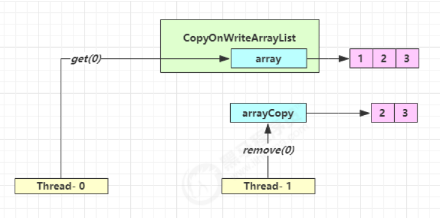

# CopyOnWriteArrayList

## 1.简介

```java
public class CopyOnWriteArrayList<E>
    implements List<E>, RandomAccess, Cloneable, java.io.Serializable {
}
```

`CopyOnWriteArrayList` 读取是完全不用加锁的，并且写入也不会阻塞读取操作，只有写入和写入之间需要进行同步等待，读操作的性能得到大幅度提升。

**特点**

- 写操作都要先拷贝一份新数组，在新数组中做修改，修改完了再用新数组替换老数组，所以空间复杂度是O(n)，性能比较低下（ArrayList中采用的数组动态扩容）
- 读操作支持随机访问，时间复杂度为O(1)
- 采用读写分离的思想，**读操作不加锁，写操作加锁**，且写操作占用较大内存空间，所以适用于**读多写少**的场合
- **只保证最终一致性，不保证实时一致性**

## 2.原理

`CopyOnWriteArrayList` 类的所有可变操作（`add`，`set`等等）都是通过创建底层数组的新副本来实现的。当 List 需要被修改的时候，并不直接修改原有数组对象，而是对原有数据进行一次拷贝，将修改的内容写入副本中。写完之后，再将修改完的副本替换成原来的数据，这样就可以保证写操作不会影响读操作了。

## 3.读取和写入源码简单分析

### 3.1 读取操作的实现

读取操作没有任何同步控制和锁操作，理由就是内部数组 array 不会发生修改，只会被另外一个 array 替换，因此可以保证数据安全。

```java
/** The array, accessed only via getArray/setArray. */
private transient volatile Object[] array;

public E get(int index) {
    return get(getArray(), index);
}

@SuppressWarnings("unchecked")
private E get(Object[] a, int index) {
    return (E) a[index];
}

final Object[] getArray() {
    return array;
}
```

### 3.2 写入操作的实现

CopyOnWriteArrayList 写入操作 `add()` 方法在添加集合的时候加了锁，保证同步，避免多线程写的时候会 copy 出多个副本。

```java
/**
 * Appends the specified element to the end of this list.
 *
 * @param e element to be appended to this list
 * @return {@code true} (as specified by {@link Collection#add})
 */
public boolean add(E e) {
    final ReentrantLock lock = this.lock;
    lock.lock();  // 加锁
    try {
        Object[] elements = getArray();
        int len = elements.length;
        Object[] newElements = Arrays.copyOf(elements, len + 1);  // 拷贝新数组
        newElements[len] = e;
        setArray(newElements);
        return true;
    } finally {
        lock.unlock();  // 释放锁
    }
}
```

Java 11中使用了`synchronized`：

```java
public boolean add(E e) {
    synchronized (lock) {
        // 获取旧的数组
        Object[] es = getArray();
        int len = es.length;
        // 拷贝新的数组（这里是比较耗时的操作，但不影响其它读线程）
        es = Arrays.copyOf(es, len + 1);
        // 添加新元素
        es[len] = e;
        // 替换旧的数组
        setArray(es);
        return true;
    }
}
```

## 4.弱一致性的体现

### 4.1 get弱一致性



| 时间点 | 操作                         |
| ------ | ---------------------------- |
| 1      | Thread-0 getArray()          |
| 2      | Thread-1 getArray()          |
| 3      | Thread-1 setArray(arrayCopy) |
| 4      | Thread-0 array[index]        |

> 不容易测试，但问题确实存在

### 4.2 迭代器弱一致性

```java
CopyOnWriteArrayList<Integer> list = new CopyOnWriteArrayList<>();
list.add(1);
list.add(2);
list.add(3);
Iterator<Integer> iter = list.iterator();
new Thread(() -> {
    list.remove(0);
    System.out.println(list);
}).start();
 
sleep1s();
// 迭代器依然是旧的引用，所以还是会遍历到 0 号元素
while (iter.hasNext()) {
    System.out.println(iter.next());
}
```
