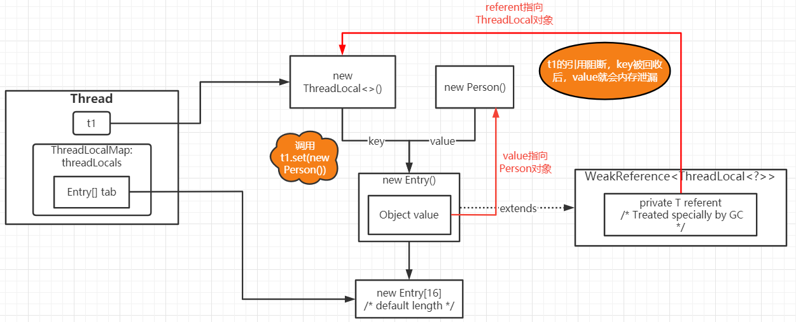
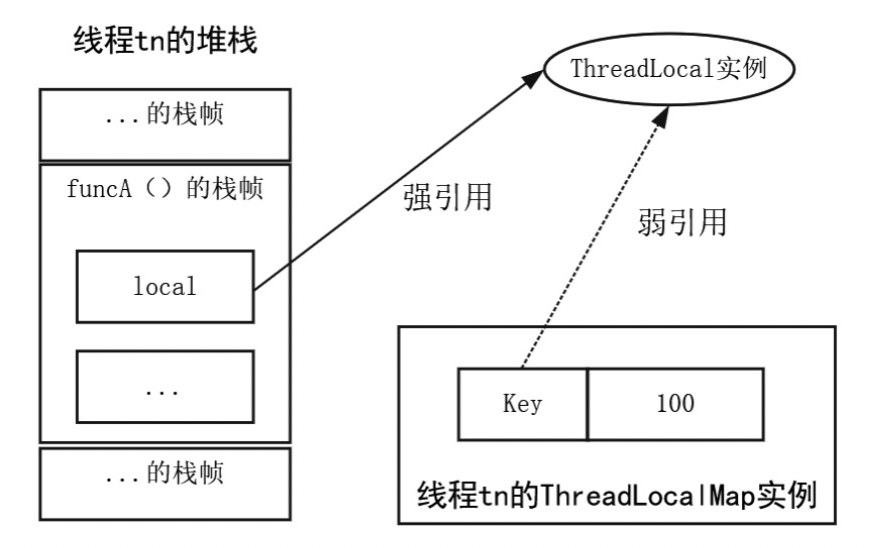
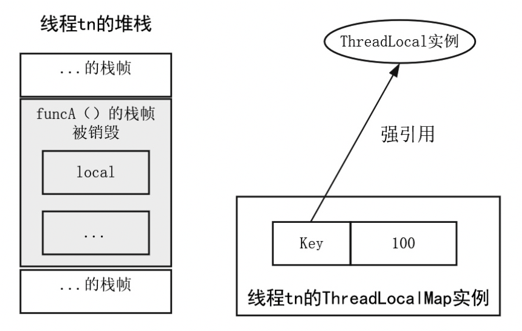

# ThreadLocal

在多线程并发执行过程中，为了保证多个线程对变量的安全访问，可以将变量放到 `ThreadLocal` 类型的对象中，使变量在每个线程间独立。



## 1.基本使用

`ThreadLocal` 位于 JDK 的 java.lang 核心包。如果程序创建了一个 `ThreadLocal` 实例，那么在访问这个变量值时，每个线程都会拥有一个独立的、自己的本地值，避免了线程安全问题。当线程结束后，每个线程拥有的本地值会被释放。

`ThreadLocal` 提供了以下三种方法用于进行本地值的操作：

```java
public T get();
public void set(T value);
public void remove();
```

下面的例子展示了 `ThreadLocal` 的值无法在两个线程间共享： 

```java
public class ThreadLocalTest {
    static ThreadLocal<Person> tl = new ThreadLocal<>();
    
    public static void main(String[] args) {
        new Thread(() ->{
            try {
                // 休息 1 秒
                TimeUnit.SECONDS.sleep(1);
            } catch (Exception e) {
                e.printStackTrace();
            }
            tl.set(new Person());
        }).start();
        
        new Thread(() ->{
            try {
                // 休息 2 秒
                TimeUnit.SECONDS.sleep(2);
            } catch (Exception e) {
                e.printStackTrace();
            }
            System.out.println(tl.get()); // null
        }).start();
    }
    
    static class Person {
        String name = "zhangsan";
    }
}
```
如果线程尚未在本地变量中绑定一个值，直接通过调用 `get()` 方法获取本地值会获取一个空值，此时可以通过 `ThreadLocal.withInitial()` 静态工厂方法，在定义 `ThreadLocal` 对象时设置一个获取初始值的回调函数：

```java
ThreadLocal<String> localVariable = ThreadLocal.withInitial(() -> {"initial value"});
```

## 2.适用场景

`ThreadLocal` 的常用案例有：为每个线程绑定一个会话信息、数据库连接、HTTP 请求等。

### 2.1 线程隔离

`ThreadLocal` 的主要价值在于线程隔离，`ThreadLocal` 中的数据只属于当前线程，对其他线程不可见；同时由于各个线程之间的数据相互隔离，避免了同步加锁带来的性能损失，提升了并发的性能。

下面的代码来自 Hibernate，代码中通过 `ThreadLocal` 进行数据库连接 `Session` 的线程本地化存储：

```java
private static final ThreadLocal threadSession = new ThreadLocal();

public static Session getSession() throws InfrastructureException {
    // 一个 Session 代表一个数据库连接
    Session s = (Session) threadSession.get();
    try {
        if (s == null) {
            s = getSessionFactory().openSession();
            threadSession.set(s);
        }
    } catch (HibernateException ex) {
        throw new InfrastructureException(ex);
    }
    return s;
}
```

### 2.2 跨函数传递数据

在同一个线程内跨类、跨方法传递数据时，如果不用 `ThreadLocal`，则需要靠传参和返回值，会增加类和方法之间的耦合度。而线程执行过程中所执行到的函数都能读写 `ThreadLocal` 变量，从而可以方便地实现跨函数的数据传递。

例如如下获取 `Session` 和保存 `Session` 的示例代码：

```java
private static final ThreadLocal<HttpSession> sessionLocal = new ThreadLocal<>();

public static void setSession(HttpSession session) {
    sessionLocal.set(session);
}

public static HttpSession getSession() {
    HttpSession session = sessionLocal.get();
    return session;
}
```

## 3.内部结构演进

在早期的 JDK 版本中，ThreadLocal 的内部结构是一个 `Map`，其中每一个线程实例作为 Key，线程在“线程本地变量”中绑定的值为 Value。这个版本中的  `Map` 的拥有者是 `ThreadLocal`，每一个 `ThreadLocal` 实例拥有一个 `Map` 实例。

到了 JDK 8 版本中，ThreadLocal 的内部结构发生了演进，虽然还是使用 `Map` 结构，但是其拥有者变成了 `Thread` 实例，每一个 `Thread` 实例拥有一个 `map` 实例。同时 `Map` 的 Key 也变成了 `ThreadLocal` 实例。

新版本的 `ThreadLocalMap` 还是由 `ThreadLocal` 类维护的，由 `ThreadLocal` 负责 `ThreadLocalMap` 实例的获取和创建，并从中设置本地值、获取本地值。所以 `ThreadLocalMap` 还寄存于 `ThreadLocal` 内部，没有迁移到 `Thread` 内部。

与早期的实现相比，新版本的主要优势为：

- 每个 `ThreadLocalMap` 存储的 "Key-Value" 数量变少。早期版本的数量与线程个数强相关，这意味着每个线程都有一个槽位，无论是否实际上使用 `ThreadLocal` 存储变量；而新版本的 Key 为 `ThreadLocal` 实例，即每个 `ThreadLocal` 实例对应一个槽位，而不是每个线程一个槽位，因此相比较下 `TreadLocal` 实例会少一些。
- 早期版本 `ThreadLocalMap` 的拥有者为 `ThreadLocal`，在 `Thread` 实例销毁后，`ThreadLocalMap` 还是存在的；而新版本中 `ThreadLocalMap` 的拥有者为 `Thread`，当 `Thread` 销毁后，`ThreadLocalMap` 也会随之销毁，在一定程度上减少了内存的消耗。

## 4.ThreadLocal源码分析

### 4.1 set(T value)

```java
// Thread 的 threadLocals (threadLocalMap) 成员变量，每个线程管理一个，初始为 null
ThreadLocal.ThreadLocalMap threadLocals = null;

public void set(T value) {
    // 获取当前线程
    Thread t = Thread.currentThread();
    // 获取当前线程的 ThreadLocalMap 成员属性
    ThreadLocalMap map = getMap(t);
    // 如果 ThreadLocalMap 存在
    if (map != null) {
        // 将 value 放到 map 中，key 是当前的 ThreadLocal 对象
        map.set(this, value);
    } else {
        // 如果 ThreadLocalMap 不存在则创建一个实例，然后作为成员属性关联到 t 实例
        // 只有当赋值或获取值时才会创建 ThreadLocalMap
        createMap(t, value);
    }
}

// 获取线程 t 的 ThreadLocalMap 成员属性
ThreadLocalMap getMap(Thread t) {
    return t.threadLocals;
}

// 为线程 t 创建一个 ThreadLocalMap 成员
// 并为新的 map 成员设置第一个 Key-Value 对，Key 为当前 ThreadLocal 对象
void createMap(Thread t, T firstValue) {
    t.threadLocals = new ThreadLocalMap(this, firstValue);
}
```
`set(T value)` 方法的执行流程大致如下：

1. 获得当前线程，然后获得当前线程的 `TheadLocalMap` 成员，暂存于 map 变量
2. 如果 map 不为空，就将 Value 设置到 map 中，当前的 ThreadLocal 作为 key
3. 如果 map 为空， 则为该线程创建 map，然后设置第一个 Key-Value 键值对，Key 为当前的 `ThreadLocal` 实例，Value 为 `set()` 方法的参数值

###  4.2 get()

```java
public T get() {
    // 获得当前线程
    Thread t = Thread.currentThread();
    // 获得线程的 ThreadLocalMap 成员变量
    ThreadLocalMap map = getMap(t);
    // 如果 ThreadLocalMap 存在
    if (map != null) {
        // 以 ThreadLocal 为 Key 尝试获取
        ThreadLocalMap.Entry e = map.getEntry(this);
        // 如果 entry 存在
        if (e != null) {
            @SuppressWarnings("unchecked")
            // 返回 entry 的 value
            T result = (T)e.value;
            return result;
        }
    }
    // 如果当前线程对应的 map 不存在
    // 或者 map 存在但是没有对应的键值对，返回初始值
    return setInitialValue();
}

// 设置 ThreadLocal 关联的初始值并返回
private T setInitialValue() {
    // 调用初始化钩子函数，获取初始值
    T value = initialValue();
    Thread t = Thread.currentThread();
    ThreadLocalMap map = getMap(t);
    if (map != null) {
        map.set(this, value);
    } else {
        createMap(t, value);
    }
    return value;
}
```

`T get()` 方法的执行流程大致如下：

1. 先尝试获取当前线程，然后获得当前线程的 `ThreadLocalMap` 成员，暂存于 map 变量
2. 如果获得的 map 不为空，则以当前 ThreadLocal 实例为 Key 尝试获得 map 中的 Entry
3. 如果 Entry 不为空，就返回 Entry 中的 value
4. 如果 Entry 为空，就调用 `initialValue` 初始化钩子函数获得 ThreadLocal 初始值，并设置在 map 中。如果 map 不存在，还会给当前线程创建新的 `ThreadLocalMap` 成员，并绑定第一个 Key-Value 键值对。

### 4.3 remove()

```java
public void remove() {
    ThreadLocalMap m = getMap(Thread.currentThread());
    if (m != null)
        m.remove(this);
}
```

### 4.4 initialValue()

```java
protected T initialValue() {
    return null;
}
```

如果没有调用 `set()` 而直接调用 `get()` 就会调用该方法，该方法只会被调用一次。默认情况下，`initialValue()` 方法返回 null，JDK 定义了一个 `ThreadLocal` 的内部 `SuppliedThreadLocal` 静态类，并提供了 `ThreadLocal.withInitial(...)` 静态工厂方法，用来设置初始回调函数。

```java
ThreadLocal<Foo> LOCAL_FOO = ThreadLocal.withInitial(() -> new Foo());
```

JDK 定义的 `ThreadLocal.withInitial(...)` 静态工厂方法及其内部子类 `SUppliedThreadLocal` 的源码如下：

```java
public static <S> ThreadLocal<S> withInitial(Supplier<? extends S> supplier) {
    return new SuppliedThreadLocal<>(supplier);
}

// 内部静态子类
// 继承了 ThreadLocal，重写了 initialValue() 方法，返回钩子函数的值作为初始值
static final class SuppliedThreadLocal<T> extends ThreadLocal<T> {

    private final Supplier<? extends T> supplier;

    SuppliedThreadLocal(Supplier<? extends T> supplier) {
        this.supplier = Objects.requireNonNull(supplier);
    }

    @Override
    protected T initialValue() {
        return supplier.get();
    }
}
```

## 5.ThreadLocalMap源码分析

`ThreadLocal` 的操作都是基于 `ThreadLocalMap` 展开的，而 `ThreadLocalMap` 是 `ThreadLocal` 的一个静态内部类，实现了一套简单的 Map 结构。

### 5.1 主要成员变量

```java
static class ThreadLocalMap {
    
    // Map 的条目类型
    // Entry 继承 WeakReference，Key 为 ThreadLocal 实例
    static class Entry extends WeakReference<ThreadLocal<?>> {

        Object value;

        Entry(ThreadLocal<?> k, Object v) {
            super(k);
            value = v;
        }
    }

    // Map 的条目初始容量 16
    private static final int INITIAL_CAPACITY = 16;

    // Map 的条目数组
    private Entry[] table;

    // Map 的条目数量
    private int size = 0;

    // 达到该容量时进行扩容
    private int threshold;
    
    // 在调用 ThreadLocalMap 构造方法时会调用该方法
    // 设置下次扩容时的临界容量为当前容量的 2/3
    private void setThreshold(int len) {
        threshold = len * 2 / 3;
    }
}
```

### 5.2 常用方法

```java
// ThreadLocal 的静态内部类
static class ThreadLocalMap {

    // ----------------------------- 存入 -----------------------------

    // ThreadLocal.ThreadLocalMap 的 set() 方法，最终存储到了继承了弱引用的 Entry 数组
    private void set(ThreadLocal<?> key, Object value) {
        Entry[] tab = table;
        int len = tab.length;
        // 计算 key 在数组上的槽点 i
        int i = key.threadLocalHashCode & (len-1);
        // 先看数组中是否已经存储了该键值对
        // ThreadLocalMap 的存放策略为：当出现键冲突时，会依次向后查找第一个为 null 的键然后存入
        for (Entry e = tab[i];
             e != null;
             e = tab[i = nextIndex(i, len)]) {
            ThreadLocal<?> k = e.get();

            if (k == key) {
                e.value = value;
                return;
            }

            // 如果 key 为 null 说明该 key 已经被回收，则会重复利用该位置
            if (k == null) {
                replaceStaleEntry(key, value, i);
                return;
            }
        }
        // 如果数组中没有该键值对，将 entry 存放到 tab（Entry数组）
        tab[i] = new Entry (key, value);
        // 增加条目数量
        int sz = ++size;
        
        // 清理 Key 为 null 的无效 Entry
        // 如果没有可清理的 Entry，并且线程条目数量大于 threshold（默认是 Entry 数组长度的 2/3），进行扩容
        if (!cleanSomeSlots(i, sz) && sz >= threshold)
            rehash();
    }

    private void rehash() {
        // 先删除 key 为 null 的 Entry
        expungeStaleEntries();
        // Use lower threshold for doubling to avoid hysteresis
        if (size >= threshold - threshold / 4)
            resize();
    }
    
    // ----------------------------- 查找 -----------------------------

    // 查找 key 对应的 Entry
    private Entry getEntry(ThreadLocal<?> key) {
        int i = key.threadLocalHashCode & (table.length - 1);
        Entry e = table[i];
        if (e != null && e.get() == key)
            return e;
        else
            return getEntryAfterMiss(key, i, e);
    }

    // 在第一次索引时没找到（存在键冲突或该 Entry 已被删除）
    private Entry getEntryAfterMiss(ThreadLocal<?> key, int i, Entry e) {
        Entry[] tab = table;
        int len = tab.length;

        while (e != null) {
            ThreadLocal<?> k = e.get();
            if (k == key)
                return e;
            if (k == null)
                // 当存在 key 为 null 时，删除该 Entry 直到出现为 null 的 Entry 为止
                expungeStaleEntry(i);
            	// 然后继续遍历查找索引
            else
                i = nextIndex(i, len);
            e = tab[i];
        }
        return null;
    }
}
```

## 6.常见问题

### 6.1 为什么要用弱引用？

假设有一个方法 `funcA()` 创建了一个 `threadLocal`:

```java
public void funcA() {
    ThreadLocal local = new ThreadLocal<Interger>();
    local.set(100);
    local.get();
}
```

当线程 tn 执行 `funcA()` 方法到其末尾时，线程 tn 相关的 JVM 栈内存以及内部 `ThreadLocalMap` 成员的结构大致如下图所示：



线程 tn 调用 `funcA()` 方法新建了一个 `ThreadLocal` 实例，使用 `local` 局部变量指向这个实例，并且此 `local` 是强引用；在调用 `local.set(100)` 之后，线程 tn 的 `ThreadLocalMap` 成员内部会新建一个 `Entry` 实例，其 Key 以弱引用包装的方式指向 `ThreadLocal` 实例。

当线程 tn 执行完 `funcA()` 方法后，`funcA()` 的方法栈桢将被销毁，强引用 `local` 的值也就没有了，但此时线程的 `ThreadLocalMap` 中对应的 `Entry` 的 Key 引用还指向 `ThreadLocal` 实例。如果 `Entry` 的 Key 引用是强引用，就会导致 Key 引用指向的 `ThreadLocal` 实例及其 Value 都不能被 GC 回收，这将造成严重的内存泄漏问题。如下图所示：



> **补充：内存泄漏**
>
> 不再用到的内存没有及时释放就叫做内存泄漏。对于持续运行的服务进程必须及时释放内存，否则内存占用率越来越高，轻则影响系统性能，重则导致进程崩溃甚至系统崩溃。

由于 `ThreadLocalMap` 中 `Entry` 的 Key 使用了弱引用，在下次 GC 发生时，就可以使那些没有被其他强引用指向、仅被 `Entry` 的 Key 所指向的 `ThreadLocal` 实例能被顺利回收。并且，在 `Entry` 的 Key 引用被回收之后，其 `Entry` 的 Key 值变为 null。后续当 `ThreadLocal` 的 `get()`、`set()` 或 `remove()` 被调用时，`ThreadLocalMap` 的内部代码会清除这些 Key 为 null 的 `Entry`，从而完成相应的内存释放。

使用 ThreadLocal 会发生内存泄漏的前提条件如下：

1. 线程长时间运行而没有被销毁。线程池中的 `Thread` 实例很容易满足此条件。
3. `ThreadLocal` 引用被设置为 null，且后续在同一 `Thread` 实例执行期间，没有发生对其他 `ThreadLocal` 实例的 `get()`、`set()` 或 `remove()` 操作。只要存在一个针对任何 `ThreadLocal` 实例的 `get()`、`set()` 或 `remove()` 操作，就**有可能会触发** `Thread` 实例拥有的 `ThreadLocalMap` 的 Key 为 null 的 `Entry` 清理工作，释放掉 `ThreadLocal` 弱引用为 null 的 `Entry`。

### 6.2 使用static final修饰ThreadLocal

`ThreadLocal` 实例作为 `ThreadLocalMap` 的 Key，针对一个线程内的所有操作是共享的，所以建议设置 `static` 修饰符，以便被所有的对象共享。由于静态变量会在类第一次被加载时装载，只会分配一次存储空间，此类的所有实例都会共享这个存储空间，所以使用 `static` 修饰 `ThreadLocal` 就会节约内存空间。另外，为了确保 `ThreadLocal` 实例的唯一性，除了使用 `static` 修饰之外，还会使用 `final` 进行加强修饰，以防止其在使用过程中发生动态变更：

```java
private static final ThreadLocal<Foo> LOCAL_FOO = new ThreadLocal<>();
```

使用 `static final` 修饰 `ThreadLocal` 实例也会带来副作用，使得 `Thread` 实例内部的 `ThreadLocalMap` 中 `Entry` 的 Key 在 `Thread` 实例的生命期内将始终保持为非 null，从而导致 Key 所在的 Entry 不会被自动清空，这就会让 `Entry` 中的 Value 指向的对象一直存在强引用，于是 Value 指向的对象在线程生命期内不会被释放，最终导致内存泄漏。所以在使用完 `static final` 修饰的 `ThreadLocal` 实例后，必须调用 `remove()` 来进行显示的释放操作。

如果使用线程池，可以定制线程池的 `afterExecute()` 方法，在任务执行完成后，调用 `ThreadLocal` 实例的 `remove()` 方法对其进行释放，从而使得其线程内部的 Entry 得以释放。
