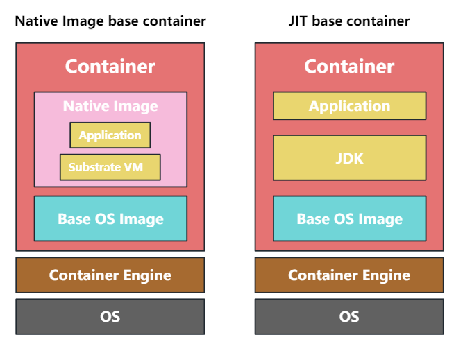

## Java安装

**命令行安装**

```bash
yum update
yum list available '*penjdk*
yum install java-1.8.0-openjdk
# CentOS7 需要安装 devel
# yum install java-1.8.0-openjdk-devel
```

**源文件安装**

- 创建java目录

  ```bash
  mkdir /usr/local/java/
  ```

- 解压到刚刚的安装目录

  ```bash
  tar -zxvf jdk-8u333-linux-x64.tar.gz -C /usr/local/java/
  ```

- 配置环境变量

  ```bash
  vim /etc/profile
  ```

  结尾加入环境变量

  ```bash
  export JAVA_HOME=/usr/local/java/jdk1.8.0_212
  export JRE_HOME=${JAVA_HOME}/jre
  export CLASSPATH=.:${JAVA_HOME}/lib:${JRE_HOME}/lib
  export PATH=${JAVA_HOME}/bin:$PATH
  ```

- 使环境变量生效

  ```bash
  source /etc/profile
  ```

- 添加文件映射

  ```bash
  ln -s /usr/local/java/jdk1.8.0_212/bin/javac /usr/bin/javac
  ln -s /usr/local/java/jdk1.8.0_212/bin/jar /usr/bin/jar
  ln -s /usr/local/java/jdk1.8.0_212/bin/java /bin/java
  ```

## Map

- 可以使用 `map.getOrDefault(key, defaultValue)` 来获取值，底层使用了三元运算

## Java对象大小

- 在 32 位系统下，存放 Class 指针的空间大小是 4 字节，MarkWord 是 4 字节，对象头为 8 字节
- 在 64 位系统下，存放 Class 指针的空间大小是 8 字节，MarkWord 是 8 字节，对象头为 16 字节
- 64 位开启指针压缩的情况下，存放 Class 指针的空间大小是 4 字节，MarkWord 是 8 字节，对象头为 12 字节

一个 Java 对象首先有 12 字节的对象头，引用类型的属性占用 4 个字节（指针），基本类型的属性占用各自的长度（例如 long 占用 8 个字节）。

## 抽象方法和接口的区别

|      | 抽象类                                                       | 接口                                                         |
| :--: | ------------------------------------------------------------ | ------------------------------------------------------------ |
| 定义 | 包含**抽象方法**的类                                         | 主要包含**抽象方法**和**静态常量（final static）**的类       |
| 组成 | **构造器**<br />抽象方法<br />**成员方法**、**成员变量**<br />静态方法、**静态变量**<br />**常量** | 抽象方法<br />**default方法（JAVA8）**<br />静态方法（JAVA8）、**静态常量**<br />**私有方法（JAVA9）** |
| 使用 | extends                                                      | implements                                                   |
| 关系 | 子类只能继承**一个抽象类**<br />抽象类可以**实现多个接口**   | 子类可以**实现多个接口**<br />接口**不能继承类**，但可以同时**继承多个接口** |
| 选择 | 适用于需要继承父类的成员变量，或者需要控制子类的实例化的场景 | 优先选择接口、避免单继承的局限                               |

## 异常

`Throwable`是类。


受检异常：编译时会报错，需要强制捕获的异常，或者 try catch，或者抛出

非受检异常：编译时不会报错，不强制要求捕获的异常

Error：跟程序本身无关的错误，一般表示系统错误

## 为什么重写了equals()也要重写hashCode()

Java 中的`equals()`方法和`hashCode()`方法都是在`Object`类中的方法，而在 Java 中所有的类都是`Obejct`类的子类，所以 Java 中所有的方法都会有这两个方法的默认实现。

**equals方法**

`Object`类中的`equals()`方法定义如下

```java
public boolean equals(Object obj) {
    return (this == obj);
}
```

我们发现在`equals()`方法中只使用了`==`。

- 基本数据类型：比较的是`==`两边值是否相等
- 引用数据类型：比较的是`==`两边内存地址是否相等

> 基本数据类型包括：`byte`,`short`,`char`,`int`,`long`,`float`,`double`,`boolean`

而通过Java文档中的`equals()`方法描述，所有要实现自己的`equals()`方法都要遵守下面几个规则

- 自反性：对于任何对象x，`x.equals(x)`应该返回`true`
- 对称性：对于任何两个对象x和y，如果`x.equals(y)`返回`true`，那么`y.equals(x)`也应该返回`true`
- 传递性：对于多个对象x,y,z，如果`x.equals(y)`返回`true`,`y.equals(z)`返回`true`，那么`y.equals(z)`也应该返回`true`
- 一致性：对于两个非空对象x,y，在没有修改此对象的前提下，多次调用返回的结果应该相同
- 对于任何非空的对象x，`x.equals(null)`都应该返回`false`

**hashCode方法**

`Object`中的`hashCode()`方法是一个本地方法，返回一个`int`类型的哈希值。

```java
public native int hashCode();
```

在`hashCode()`方法中也有一些规约

- 如果对象在使用`equals`方法中进行比较的参数没有修改，那么多次调用一个对象的`hashCode()`方法返回的哈希值应该是相同的
- 如果两个对象通过`equals`方法比较是相等的，那么**要求**这两个对象的`hashCode`方法返回的值也应该是相等的
- 如果两个对象通过`equals`方法比较是不同的，那么也**不要求**这两个对象的`hashCode`方法返回的值是不相同的。但是我们应该知道对于不同对象产生不同的哈希值对于哈希表（HashMap等等）能够提高性能

**equals方法和hashCode方法会在哪用到**

这两个方法经常出现在 Java 中的哪个类里面呢？如果看过`HashMap`源码的应该了解这两个方法经常出现在`HashMap`中。网上介绍`HashMap`类的文章有很多了，这里就简单介绍一下`HashMap`。

> 当一个节点中的链表超过了`8`的时候就会变为`红黑树`，以解决链表长度过长以后查询速度慢的缺点。


`HashMap`是由数组和链表组成的高效存储数据的结构。那么是如何确定一个数据存储在数组中的哪个位置呢？就是通过`hashCode`方法进行计算出存储在哪个位置，还记得我们上面讲`hashCode`方法说了有可能两个不同对象的`hashCode`方法返回的值相同，那么此时就会产生冲突，产生冲突的话就会调用`equals`方法进行比对，如果不同，那么就将其加入链表尾部，如果相同就替换原数据。

> 计算位置当然不是上面简单的一个`hashCode`方法就计算出来，中间还有一些其他的步骤，这里可以简单的认为是`hashCode`确定了位置。

**什么时候去覆盖这两个方法呢？**

如果你不将自定义的类定义为`HashMap`的 key 值的话，那么我们重写了`equals`方法而没有重写`hashCode`方法，编译器不会报任何错，在运行时也不会抛任何异常。

如果你想将自定义的类定义为`HashMap`的 key 值得话，那么如果重写了`equals`方法那么就必须也重写`hashCode`方法。

接下来我们可以看一下我们使用自定义的类作为`HashMap`的 key，并且自定义的类不重写`equals`和`hashCode`方法会发生什么。

自定义的类

```java
@Builder
@NoArgsConstructor
@AllArgsConstructor
class CustomizedKey{
    private Integer id;
    private String name;
}
```

接下来我们看使用自定义的类作为 key

```java
public static void main(String[] args) {

    Map<CustomizedKey, Integer> data = getData();
    CustomizedKey key = CustomizedKey.builder().id(1).name("key").build();
    Integer integer = data.get(key);
    System.out.printf(String.valueOf(integer)); // null
}

private static Map<CustomizedKey,Integer> getData(){
    Map<CustomizedKey,Integer> customizedKeyIntegerMap = new HashMap<>();
    CustomizedKey key = CustomizedKey.builder().id(1).name("key").build();
    customizedKeyIntegerMap.put(key,10);
    return customizedKeyIntegerMap;
}
```

我们可以看到程序最后打印的是一个`null`值。原因正如上面我们说的一样。

> `hashCode`用来计算该对象放入数组中的哪个位置，因为是两个都是 new 的对象，所以即使里面的值一样，但是对象所处的地址却不同，所以使用默认的`hashCode`也就不同，当然在`hashMap`中就不会认为两个是一个对象。

接下来我们就重写一下这两个方法。如果我们使用`IDEA`的话，那么直接使用快捷键即可。


接下来我们看我们实现的两个方法

```java
@Builder
@NoArgsConstructor
@AllArgsConstructor
class CustomizedKey{
    private Integer id;
    private String name;

    @Override
    public boolean equals(Object o) {
        if (this == o) return true;
        if (o == null || getClass() != o.getClass()) return false;
        CustomizedKey that = (CustomizedKey) o;
        return Objects.equals(id, that.id) &&
            Objects.equals(name, that.name);
    }

    @Override
    public int hashCode() {
        return Objects.hash(id, name);
    }
}
```

然后我们再次运行上面的程序发现输出打印已经变成了`10`。

> 我们也能够使用`Lombok`提供的`@EqualsAndHashCode`注解简化代码

## SPI

Service Provider Interface，JDK 内置的动态扩展的一个实现。我们可以定义一个标准的接口，然后第三方库来实现这个接口，程序在运行时会根据配置信息动态加载第三方库的实现。


例如数据库的驱动 `java.jdbc.Driver`，JDK 中定义了数据库的一个驱动接口 `Driver`，但是没有提供任何实现类，具体的实现由第三方的数据库厂商来完成。在程序运行时，会根据声明的驱动类型来动态加载对应的扩展实现。

另外还有 `Spring` 中提供了 `SpringFactoriesLoader` 来实现外部功能的集成。


## 分析OOM

1. **一次申请的对象太多，或者申请的对象未能释放**

   导出堆转储文件：

   - 系统已经挂了

     需要提前加上启动命令 `-XX:+HeapDumpOnOutOfMemoryError -XX:HeapDumpPath=文件路径[/文件名]` 以便在发生 OOM 时导出堆转储文件。

   - 系统正在运行

     运行 `jmap -dump:format=b,file=文件路径[/文件名] [JAVA进程ID]` 导出，会导致 `stop the world`。

   > **提示**
   >
   > 通过`jps`命令查看 Java 进程的 ID。

   使用 **Java VisualVM** 查看堆转储文件。

2. **设置的堆内存不够**

   通过 `jmap -heap [JAVA进程ID]` 查看堆信息。

## Java新特性

**OpenJDK 主要的项目**

- **Jigsaw**：模块化系统，JDK 9 引入的主要特性，用来解决 "classPath 地狱"和 "monolithic JDK" 的问题
- **Amber**：提高 Java 的生产性
- **ZGC**：高性能 GC
- **Valhalla**：提高内存使用效率和性能
- **Panama**：改善 JVM 和外部 API 的交互
- **Loom**：使用轻量化的线程实现大规模的并发处理

对于 preview 特性需要开启以下参数才能使用：

```bash
javac --enable-preview --release [version] app.java
```

### 各个版本引入的特性

#### JDK 21

- **JEP444：virtual threads**

  Project Loom 将虚拟线程的概念引入了Java 运行时，Loom 项目旨在将异步编程的性能优势与直接“同步”编程风格的简单性结合起来。

  在幕后，JVM+Loom 运行时保留了一个平台线程池，称为载体线程，在其之上复用虚拟线程。也就是说使用少量的平台线程来运行许多虚拟线程。每当虚拟线程调用阻塞操作时，它都应该被“搁置”，直到满足它正在等待的任何条件，并且另一个虚拟线程可以在现在释放的承载线程上运行。

  为了使系统取得稳定的进展（当使用大量虚拟线程时），载体线程必须经常变得空闲，以便可以将虚拟线程调度到它们上。因此，最大的收益应该出现在 I/O 密集型系统中，而 CPU 密集型应用程序不会从使用 Loom 中看到太多改进。

  |          |                            底层                            |               内存使用               |                   GC                   |
  | :------: | :--------------------------------------------------------: | :----------------------------------: | :------------------------------------: |
  | 普通线程 |      操作系统线程， 涉及内核态转换，运行时栈大小不变       |     2KB metadata<br />1MB stack      |   栈中的变量属于 GC root，GC 负担大    |
  | 虚拟线程 | JVM 管理的线程，只存在用户态中，只有一个浅调用堆栈大小可变 | 200-300B metadata<br />elestic stack | 栈本身就存在堆中，无需额外添加 GC root |

  **使用**

  ```java
  Runnable task = () -> {
      System.out.println("hello world");
  }
  
  // 1.Thread.ofVirtual()
  var virtualThread = Thread.ofVirtual().start(task);
  
  // 2.Thread.startVirtualThread()
  Thread.startVirtualThread(task);
  
  // 3.Executors.newVirtualThreadPerTaskExecutor()
  try (var executor = Executors.newVirtualThreadPerTaskExecutor()) {
      executor.submit(task);
      executor.submit(task);
  }
  ```

  **注意点**

  - 线程的创建销毁相当于 0 成本，无需使用线程池，每个任务创建一个线程

  - 没有线程上限，必要时需要使用 `semaphore`

  - 尽量不要使用 `ThreadLocal`，否则线程数量很大时非常占用资源

  - 占用的是堆内存，GC 负担小

  - 不要使用 `synchronized`，会导致 `pinning` 问题，需要时使用 `java.concurrent.Lock`

    > **补充：线程钉住（thread pinning）问题**
    >
    > 使用 `synchronized` 方法和代码块会导致虚拟线程会钉住（thread pinning）到载体线程。当线程被钉住时，阻塞操作将阻塞底层的载体线程——就像在 Loom 之前的时代发生的那样。

- **JEP 439：ZGC 引入分代特性**

  ZGC 可以使用版本：

  - Java 11 中作为实验特性引入 Linux 的 JDK 中
  - Java 14 中作为实验特性引入 Windows/macOS 中
  - Java 15 作为 Production
  - Java 17 以后成为 LTS

  默认仍然是非分代，需要通过以下命令开启：

  ```bash
  java -XX:+UseZGC -XX:+ZGenerational
  ```

#### JDK 20

- **JEP 437：Structured Concurrency**

  结构化并发是一种多线程编程方法，它保留了单线程代码的可读性、可维护性和可观察性。它体现的原则是：如果一个任务分成并发的子任务，那么它们最终都要返回到同一个地方，即任务的代码块。

  Java 5 中引入的AP `java.util.concurrent.ExecutorService` 可以帮助开发人员同时执行子任务：

  ```java
  Response handle() throws ExecutionException, InterruptedException {
      Future<String>  user  = esvc.submit(() -> findUser());
      Future<Integer> order = esvc.submit(() -> fetchOrder());
      String theUser  = user.get();   // Join findUser
      int    theOrder = order.get();  // Join fetchOrder
      return new Response(theUser, theOrder);
  }
  ```

  由于子任务是并发执行的，因此每个子任务可以独立成功或失败：

  - 如果 `findUser()` 抛出异常，会将结果和异常封装到 `Future` 中，`fetchOrder()` 会继续在自己的线程中运行
  - 如果线程执行 `handle()` 被中断，中断不会传播到子任务
  - 如果 `findUser()` 执行时间较长，即使 `fetchOrder()` 失败也不会取消执行 `findUser()`

  但我们往往希望如果某个任务的任何子任务失败，则应该终止所有其他子任务，此时可以使用结构化并发。结构化并发 API 的主要类是 `StructuredTaskScope`。它允许开发人员将任务构建为一系列并发子任务，并将它们作为一个单元进行协调。子任务在它们自己的线程中执行。子任务的成功结果或异常由父任务聚合和处理。

  ```java
  Response handle() throws ExecutionException, InterruptedException {
      try (var scope = new StructuredTaskScope.ShutdownOnFailure()) {
          Future<String> usr = scope.fork(() -> findUser());
          Future<Integer> order = scope.fork(() -> fetchOrder());
          scope.join()              // Join all forks
              .throwIfFailed();     // propagate errors
          // return only when both are success
          return new Response(user.resultNow(), order.resultNow());
      }
  }
  ```

  - 短路错误处理：如果 `findUser()` 或 `fetchOrder()` 子任务失败，则另一个尚未完成的任务将被取消。（由 `ShutdownOnFailure`决定，也可以使用其他策略）
  - 取消传播：如果线程在调用 `handle()` 之前或期间被中断 `join()`，则当线程退出作用域时，两个子任务都会自动取消
  - 清晰性：上面的代码有一个清晰的结构，即设置子任务，等待它们完成或被取消，然后决定是成功还是失败
  - 可观察性：线程转储，线程 `findUser()` 和 `fetchOrder()`为 `scope` 的子级

- **JEP 429：Scoped Values**

  使用 `ThreadLocal` 时无法感知值的变化，debug 困难，容易造成内存泄漏；与之相比，`ScopedValue` 的值一旦声明无法更改，且会被自动删除，因此不存在内存泄漏问题。

  ```java
  static ScopedValue<String> SV = ScopedValue.newInstance();
  
  public static void main(String[] args) {
      ScopedValue.where(SV, "String A").run(TestFeature::methodX);
      out.println("end of main method: " + SV.get()); // 因为 SV 在调用完后会被自动删除，此处再 get 时就会抛出错误
  }
  
  static void methodX() {
      out.println("methodX #0: " + SV.get());
      ScopedValue.where(SV, "String B").run(TestFeature::methodY);
      out.println("methodX #1: " + SV.get());
  }
  
  static void methodY() {
      out.println("methodY: " + SV.get());
  }
  ```

  结果如下：

  ```bash
  $ javac --enable-preview --release 21 .\TestFeature.java
  注: .\TestFeature.java 使用 Java SE 21 的预览功能。
  注: 有关详细信息，请使用 -Xlint:preview 重新编译。
  $ java --enable-preview TestFeature
  methodX #0: String A
  methodY: String B
  methodX #1: String A
  Exception in thread "main" java.util.NoSuchElementException
          at java.base/java.lang.ScopedValue.slowGet(ScopedValue.java:700)
          at java.base/java.lang.ScopedValue.get(ScopedValue.java:693)
          at TestFeature.main(TestFeature.java:14)
  ```

#### JDK 17

- **JEP 360, 397, 409：密封类**

  ```java
  // 只允许 Rectangle, Circle, Square 这三个类继承
  public sealed class Shape 
      permits Rectangle, Circle, Square {}
  
  public final class Rectangle extends Shape {}
  public final class Circle extends Shape {}
  public final class Square extends Shape {}
  public final class Triangle extends Shape {}  // compile error
  ```

  此时子类必须使用以下三种关键字之一进行声明：

  -  `final`：不能被继承

  - `non-sealed`：可以被任意继承

  - `sealed` ：可以被限制继承

  > **注意**
  >
  > 如果子类位于父类的同一文件中，则父类可以不使用 `permits`，此时只有同一文件中的子类可以继承。

#### JDK 16

- **JEP 359, 384, 395：Record 类**

  ```java
  record Rectangle (double length, double width) {
      public Rectangle (double length, double width) {
          if (length <= 0 || width <= 0) {
              //error
          }
          this.length = length;
          this.width = width;
      }
      public int size() {
          return length * width;
      }
  }
  ```

- **JEP 305, 375, 394：instanceof 增强**

  ```java
  if (shape instance of Rectangle) {
      Rectangle r = (Rectangle) shape;
      return 2 * r.length() * r.width();
  } else if (shape instanceof Circle) {
      Circle c = (Circle) shape;
      return 2 * c.radius() * Math.PI;
  }
  ```

  上述代码可以改写为：

  ```java
  // 在判断时如果符合会自动进行类型转换并赋值给 r
  if (shape instanceof Rectangle r) {
      return 2 * r.length() * r.width();
  } 
  // 在判断时如果符合会自动进行类型转换并赋值给 c
  else if (shape instanceof Circle c) {
      return 2 * c.radius() * Math.PI;
  }
  ```

#### JDK 15

- **JEP 355, 368, 378：文本块**

  ```java
  String html = """
      <HTML>
      	<BODY>
      		<H1>"title"</H1>
      	</BODY>
      </HTML>
  """;
  ```

#### JDK 14

- **JEP 325, 354, 361：switch 表达式**

  对于下述代码：

  ```java
  int numLetters = 0;
  Day day = Day.WEDNESDAY;
  switch (day) {
      case SUNDAY:
      case MONDAY:
      case FRIDAY:
          numLetters = 6;
          break;
      case TUESDAY:
          numLetters = 7;
          break;
      case THURSDAY:
      case SATURDAY:
          numLetters = 8;
          break;
      case WEDNESDAY:
          numletters = 9;
          break;
      default:
          throw new IllegalStateException(day);
  }
  out.println(numLetters);
  ```

  使用新特性可以简写为：

  ```java
  int numLetters = 0;
  Day day = Day.WEDNESDAY;
  switch (day) {
      case SUNDAY, MONDAY, FRIDAY -> numLetters = 6;
      case TUESDAY                -> numLetters = 7;
      case THURSDAY, SATURDAY     -> numLetters = 8;
      case WEDNESDAY              -> numletters = 9;
      default -> throw new IllegalStateException(day);
  }
  out.println(numLetters);
  ```

  可以进一步简化：

  ```java
  Day day = Day.WEDNESDAY;
  // switch 具有返回值
  int numLetters = switch (day) {
      case SUNDAY, MONDAY, FRIDAY -> {
          // 使用 yield 返回结果
          yield 6;
      }
      // 或者直接返回结果
      case TUESDAY                -> 7;
      case THURSDAY, SATURDAY     -> 8;
      case WEDNESDAY              -> 9;
      default -> throw new IllegalStateException(day);
  }
  out.println(numLetters);
  ```

#### JDK 10

- **JEP 286：自动类型推断**

  ```java
  URL url = new URL("http://www.oracle.com");
  URLConnection conn = url.openConnection();
  Reader reader = new BufferReader(new InputStreamReader(conn.getInputStream()));
  ```

  利用 `var` 关键字的类型推断，上面的代码可以改写为：

  ```java
  var url = new URL("http://www.oracle.com");
  var conn = url.openConnection();
  var reader = new BufferReader(new InputStreamReader(conn.getInputStream()));
  ```

### JVM相关项目

#### Project CRaC

Coordinated Restore at Checkpoint，将启动并 warmup 后的 JVM 和应用的 image 进行保存，有效地缩短 JVM 启动时间。

命令如下：

```bash
# 启动程序
$ java -XX:CRaCCeckpointTo=/home/java/crac -jar app.jar
# 生成镜像
$ jcmd
222700 app.jar
$ jcmd 222700 JDK.checkpoint # 这个命令会强制停止该 java 进程

# 使用 image 快速启动
$ java -XX:CRaCRestoreFrom=[image location]
```

#### Project Galahad

Oracle 将 GraalVM 的部分特性如 JIT 和 native image 赠与给了 OpenJDK 社区，因此 OpenJDK 启动了该项目用于将 GraalVM 应用于 OpenJDK，旨在提供在程序执行前将 Java 应用程序编译为机器代码的能力。

#### Project Lilliput

致力于减少对象头的内存占用，从 12 字节（16 字节）减少到 8 字节。

#### GraalVM

次世代 JDK，具有高速 JIT 编译、AOT 编译（生成本地镜像）、多语言支持等特性。

**（1）高速 JIT 编译**

```bash
Java compiler
     |
     |-------------- 
     |             |
interpreter    C1 compiler
     |             |
     |             |--------------
     |             |             |
     |             |         C2 compiler  --替换-->   Graal compiler
     |             |             | 
翻译为机器语言        编译为机器语言
```

**Graal compiler** 具有以下特性：

- **内联**

  替换 `getter/setter` 方法为实际的变量，减少方法的调用数。

- **部分逃逸解析**

  分析变量的适用范围，减少同步操作，或者将本地变量在栈上进行分配。

- **反优化**

  自动发现目标类，将不需要的对象从缓存中移出。

**（2）Native Image**

将 java 二进制文件事先编译为本地可执行文件（native image）的技术。可以通过以下命令生成：

```bash
$ native-image [options] HelloWorld
$ mvn -Pnative native:compile
```

生成的文件不依存于  JVM，可以将启动时间控制在毫秒级别，无需 warmup，适用于微服务容器架构。



**注意点**

- Native Image 不像 JIT 那样可以在运行时优化执行，所以在高峰时的吞吐量不如 JIT

  解决方法为使用 PGO（GraalVM EE）来进行优化：

  ```bash
  # 生成 profile 文件
  native-image --pgo-instrument myClass
  cd ./myNativeImage
  # 再次进行编译
  native-image --pgo=default.oprof myClass
  ```

- Native Image 通过静态分析来加载类，使用**动态生成类技术**时会发生运行时错误，例如反射、JNI 等

  解决方法为提供 metadata 告知需要加载的类，这里有两种方法：

  - 使用 trace agent 工具来自动生成 metadata

    ```bash
    java -agentlib:native-image-agent=config-output-dir=META=INF/native-image ReflectionExample StringReverser reverse "hello"
    ```

  - 手动在 `META-INF/mative-image` 中声明

     ```bash
     {
         "name": "StringReverser",
         "methods":[{"name":"reverse","parameterTypes":"java.lang.String"}]
     }
     ```

  [参考](https://graalvm.github.io/native-build-tools/latest/maven-plugin.html)

- 可以在某些条件下构建几乎静态/静态镜像来进一步减少镜像文件大小

  ```bash
  # 静态链接除了 C 标准库 libc 以外的所有依赖，libc 会在执行时被链接
  # 可以使用 Distroless/base（提供了 glibc 等基础依赖库的轻量化镜像） 作为 base OS
  native-image -H:+StaticExecutableWithDynamicLibC
  
  # 静态链接所有依赖，使用 musl-libc
  # 可以使用 Scratch（最轻量级的镜像） 作为 base OS
  native-image --static -libc=musl
  ```

- 可以通过 `Quick Build` 模式加速构建镜像时间

**SpringBoot 项目中的使用**

对于 SpringBoot 项目可以使用构建插件：

```xml
<plugin>
    <groupId>org.graalvm.buildtools</groupId>
    <artifactId>native-maven-plugin</artifactId>
    <configuration>
    	<quickBuild>true</quickBuild>
    </configuration>
</plugin>
```

执行 `mvn -Pnative native:compile` 构建镜像，会直接生成系统对应的二进制可执行文件。

> **注意**
>
> 需要实现安装 GraalVM。

**（3）多语言支持**

旨在通过 GraalVM 为各种语言提供运行环境，并实现语言间的方法调用。
