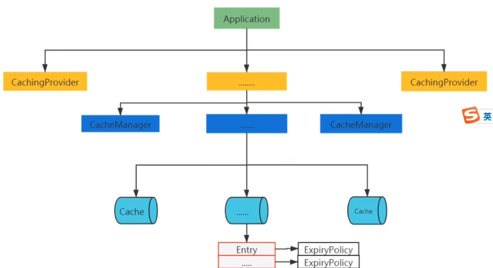
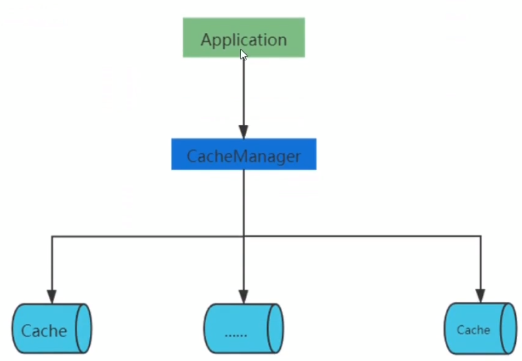

# Cache

## 1.ehcache

> - 可以存放入硬盘

### 1.1 快速开始

<a href="https://www.ehcache.org/" style="float:right">参考</a>

**环境引入**

- 引入 Spring 的 cache 支持

  ```xml
  <dependency>
      <groupId>org.springframework.boot</groupId>
      <artifactId>spring-boot-starter-cache</artifactId>
  </dependency>
  ```

- 引入依赖

  ```xml
  <dependency>
      <groupId>net.sf.ehcache</groupId>
      <artifactId>ehcache</artifactId>
  </dependency>
  ```

**编写 xml 配置文件**

```xml
<ehcache xmlns:xsi="http://www.w3.org/2001/XMLSchema-instance" xsi:noNamespaceSchemaLocation="https://www.ehcache.org/ehcache.xsd">

    <!--
        默认写到磁盘的路径
     -->
    <diskStore path="java.io.tmpdir"/>

    <!--
        对应类 net.sf.ehcache.config.CacheConfiguration
        maxEntriesLocalHeap：内存中最多放多少个元素
        memoryStoreEvictionPolicy：驱逐策略
        eternal=true：不过期
        timeToIdleSeconds：eternal=false 时有效，闲置最长时间，单位秒（每次访问会重置闲置时间）
        timeToLiveSeconds：eternal=false 时有效，存货最长时间，单位秒（从创建开始计算）
        statistics=true：开启统计，命中率等

        maxElementsOnDisk：localTempSwap 时有效，表示最多可以往磁盘中写入数量
        diskExpiryThreadIntervalSeconds：localTempSwap 时有效，检查磁盘元素是否失效的时间间隔
        persistence：当 cache 中元素个数等于 maxEntriesLocalHeap 时
            localTempSwap：写到磁盘
    -->
    <cache
            name="user_cache"
            maxEntriesLocalHeap="1000"
            memoryStoreEvictionPolicy="LRU"
            eternal="false"
            timeToIdleSeconds="120"
            timeToLiveSeconds="120"
            maxElementsOnDisk="10000000"
            diskExpiryThreadIntervalSeconds="120"
            statistics="true">
        <persistence strategy="localTempSwap"/>
    </cache>
</ehcache>

```

**运行**

```java
@Test
void test1() {
    String absPath = "H:\\project\\test\\src\\main\\resources\\ehcache.xml";

    // 用来管理多个 Cache，user_cache、item_cache等
    CacheManager cacheManager = CacheManager.create(absPath);

    // 获取管理的所有 cache
    String[] cacheNames = cacheManager.getCacheNames();

    // 通过 cache 的名字获取相应的 cache
    Cache userCache = cacheManager.getCache("user_cache");

    // 向 userCache 中放入一个 user
    User user = new User();
    user.setName("test");
    Element element = new Element(user.getName(), user);
    userCache.put(element);

    // 通过 key 取出缓存的对象
    Element result = userCache.get("test");
    System.out.println(result.getObjectValue());
}
```

### 1.2 与 Spring 的集成

**环境引入**

- 引入 Spring 的 cache 支持

  ```xml
  <dependency>
      <groupId>org.springframework.boot</groupId>
      <artifactId>spring-boot-starter-cache</artifactId>
  </dependency>
  ```

- 引入依赖

  ```xml
  <dependency>
      <groupId>net.sf.ehcache</groupId>
      <artifactId>ehcache</artifactId>
  </dependency>
  ```

**引入事务相关的包**

```xml
<dependency>
    <groupId>org.springframework.boot</groupId>
    <artifactId>spring-boot-starter-jdbc</artifactId>
</dependency>
```

**编写 xml 配置文件**

**编写 spring 配置文件**

```xml
<?xml version="1.0" encoding="UTF-8"?>
<beans xmlns="http://www.springframework.org/schema/beans"
       xmlns:xsi="http://www.w3.org/2001/XMLSchema-instance" xmlns:cache="http://www.springframework.org/schema/cache"
       xsi:schemaLocation="http://www.springframework.org/schema/beans
       http://www.springframework.org/schema/beans/spring-beans.xsd
       http://www.springframework.org/schema/cache
       http://www.springframework.org/schema/cache/spring-cache.xsd">

    <bean id="ehCacheManager" class="org.springframework.cache.ehcache.EhCacheManagerFactoryBean">
        <property name="configLocation" value="classpath:ehcache.xml"></property>
    </bean>

    <!-- 对原生的 CacheManager 进行包装 -->
    <bean id="ehCacheCacheManager" class="org.springframework.cache.ehcache.EhCacheCacheManager">
        <property name="cacheManager" ref="ehCacheManager"></property>
        <!-- 事务回滚操作 -->
        <property name="transactionAware" value="true"></property>
    </bean>

<!--    <bean id="concurrentMapCacheManager" class="org.springframework.cache.concurrent.ConcurrentMapCacheManager">-->
<!--        <property name="cacheNames">-->
<!--            <list>-->
<!--                <value>item_cache</value>-->
<!--                <value>store_cache</value>-->
<!--            </list>-->
<!--        </property>-->
<!--    </bean>-->

    <cache:annotation-driven proxy-target-class="true" cache-manager="ehCacheCacheManager"></cache:annotation-driven>
</beans>
```

**测试**

```java
@SpringBootTest
@ContextConfiguration({"classpath:spring-ehcache.xml"})
public class SpringEhcacheTest {

    @Resource
    private CacheManager cacheManager;

    @Test
    public void test1() {
        Cache userCache = cacheManager.getCache("user_cache");
        User user = new User();
        user.setName("test");
        userCache.put(user.getName(), user);
        User test = userCache.get("test", User.class);
        System.out.println(test);
    }
}
```

**序列化报错时的两种解决方法：**

- ```xml
  <persistence strategy="none"/>
  ```

- 实体类实现序列化接口

### 1.3 使用 Cacheable 注解

> 不知道并发如何，建议自己实现

```java
@Service
@CacheConfig(cacheNames = {"user_cache"})
public class UserService {
    /**
     * 调用方法时先看缓存有没有，没有则执行方法并把结果放入缓存
     * @param name
     * @return
     */
    @Cacheable(key="#name")
    public User getByName(String name) {
        System.out.println("模拟查询");
        User user = new User();
        user.setName(name);
        return user;
    }
}
```

```java
@Test
    public void test2() {
        System.out.println(userService.getByName("zhao"));
        System.out.println(userService.getByName("zhao"));
        System.out.println(userService.getByName("zhao"));
    }
```

```java
// 最终输出结果
模拟查询
User(name=zhao)
User(name=zhao)
User(name=zhao)
```

### 1.4 与 SpringBoot 的集成

> 不需要导入额外的包

4.1 在 application.property 中配置 ehcache.xml 位置

```properties
spring.cache.ehcache.config=classpath:ehcache.xml
```

4.2 加上`@EnableCaching`注解

```java
@SpringBootApplication
@EnableCaching
public class TestApplication {
```

### 1.5 并发

在高并发的情况下使用 Ehcache 缓存时，由于并发的读与写，我们读的数据有可能是错误的，我们写的数据也有可能意外的被覆盖。所幸的是 Ehcache 为我们提供了针对于缓存元素 Key 的 Read、Write 锁。当一个线程获取了某一 Key 的 Read 锁之后，其它线程获取针对于同一个 Key 的 Read 锁不会受到限制，但其它线程（包括获取了该 Key 的 Read 锁的线程）如果想获取针对同一个 Key 的 Write 锁就不行，它需要等到针对于该 Key 的 Read 锁释放后才能获取其 Write 锁；当一个线程获取了某一 Key 的 Write 锁之后，其它线程获取同一个 Key 的 Read 锁或者 Write 锁的请求将等待针对于该 Key 的 Write 锁释放后才能继续进行，但是同一个线程获取该 Key 对应的 Read 锁或者 Write 锁将不需要等待。获取了对应的锁之后，记得在不再需要该锁后释放该锁。并且需要注意不要引起死锁。

```java
// 在Ehcache接口中为我们定义了几个与Read、Write锁相关的方法，具体方法如下所示：
public interface Ehcache {
 
    /**
     * 获取给定Key的Read锁
     * @param key
     */
    public void acquireReadLockOnKey(Object key);
 
    /**
     * 获取给定Key的Write锁
     * @param key
     */
    public void acquireWriteLockOnKey(Object key);
 
    /**
     * 尝试着获取给定Key的Read锁，如果在给定timeout时间内还没有获取到对应的Read锁，则返回false，否则返回true。
     * @param key
     * @param timeout 超时时间，单位是毫秒
     * @return表示是否获取到了对应的Read锁
     * @throws InterruptedException
     */
    public boolean tryReadLockOnKey(Object key, long timeout) throws InterruptedException;
 
    /**
     * 尝试着获取给定Key的Write锁，如果在给定timeout时间内还没有获取到对应的Write锁，则返回false，否则返回true。
     * @param key
     * @param timeout 超时时间，单位是毫秒
     * @return表示是否获取到了对应的Write锁
     * @throws InterruptedException
     */
    public boolean tryWriteLockOnKey(Object key, long timeout) throws InterruptedException;
 
    /**
     * 释放所持有的给定Key的Read锁
     * @param key
     */
    public void releaseReadLockOnKey(Object key);
 
    /**
     * 释放所持有的给定Key的Write锁
     * @param key
     */
    public void releaseWriteLockOnKey(Object key);
  
}
```

我们常用的 Cache 类已经为我们实现了这些方法，我们可以直接在程序中进行使用。以下是直接在程序中使用锁的一个简单示例。

```java
@Test
public void test() {
    CacheManager cacheManager = CacheManager.create();
    cacheManager.addCache("test");
    Cache cache = cacheManager.getCache("test");
    final String key = "abc";
    cache.acquireWriteLockOnKey(key);
    try {
        cache.put(new Element(key, "123"));
    } finally {
        System.out.println(cache.get(key));
        cache.releaseWriteLockOnKey(key);
    }
}
```

> 注意
>
> `acquireReadLockOnKey()`和`acquireWriteLockOnKey()`方法都不会报错，最多使进入阻塞状态。但对于`releaseReadLockOnKey()`和`releaseWriteLockOnKey()`方法，如果持有 read 锁或 write 锁的线程不是本线程，或者本线程之前已经释放掉 read 锁或 write 锁，那么再次调用这两个方法会报错

---

## 2.guava

### 2.1 单独使用

#### 1.LocalloadingCache

> - 实现了 LoadingCache，最终实现了 Cache
> - 线程安全
>
> - 特点：获取不到缓存中的值时，根据指定的 loader 加载，加载后自动放入缓存

##### 1.1 引入依赖

```xml
<dependency>
    <groupId>com.google.guava</groupId>
    <artifactId>guava</artifactId>
    <version>31.0.1-jre</version>
</dependency>
```

##### 1.2 build loadingCache

```java
 @Test
void test1() throws InterruptedException {
    LoadingCache<String, User> loadingCache = CacheBuilder.newBuilder()
        // 指定并发级别
        .concurrencyLevel(8)
        // 初始化大小，配合 concurrentLevel 做分段锁
        .initialCapacity(60)
        // 缓存中最多可放多少个元素
        .maximumSize(10)
        // 从写入开始计算 10 秒后过期
        .expireAfterWrite(2, TimeUnit.SECONDS)
        // 统计命中率
        .recordStats()
        // 缓存中的元素被驱逐出后回调
        .removalListener(new RemovalListener<String, User>() {
            @Override
            public void onRemoval(RemovalNotification<String, User> removalNotification) {
                String name = removalNotification.getKey();
                RemovalCause cause = removalNotification.getCause();
                System.out.println(name + "被移除缓存，原因：" + cause);
            }
            // 缓存中获取不到值，会回调到这里
        }).build(new CacheLoader<String, User>() {
        @Override
        public User load(String s) throws Exception {
            // 可以在这里加载数据
            System.out.println("加载数据");
            User user = new User();
            user.setName(s);
            return user;
        }
    });

    for (int i = 0; i < 10; i++) {
        System.out.println(loadingCache.getUnchecked("zhao"));
        TimeUnit.SECONDS.sleep(1);
    }
    System.out.println(loadingCache.stats().missCount());
}
```

#### 2.LocalManualCache

> - 最终实现了 Cache
>
> - 类似 ehcache

### 2.2 自定义CacheManager

#### 1.开启 Cache

```java
@SpringBootApplication
@EnableCaching
public class TestApplication {
```

#### 2.编写 GuavaCache

```java
public class GuavaCache implements Cache {

    private String cacheName;

    private com.google.common.cache.Cache<Object, Object> internalCache;

    public GuavaCache(String cacheName, com.google.common.cache.Cache<Object, Object> internalCache) {
        this.cacheName = cacheName;
        this.internalCache = internalCache;
    }

    @Override
    public String getName() {
        return cacheName;
    }

    @Override
    public Object getNativeCache() {
        return internalCache;
    }

    @Override
    public ValueWrapper get(Object key) {
        Object object = internalCache.getIfPresent(key);
        if (object != null) {
            // 返回 valueWrapper 的默认实现
            return new SimpleValueWrapper(object);
        }
        return null;
    }

    @Override
    public void put(Object key, Object value) {
        internalCache.put(key, value);
    }

    @Override
    public void evict(Object key) {
        // 如果是多级缓存，需要完成本地缓存和分布式缓存的同步逻辑
        // 比如通过 mq
        internalCache.invalidate(key);
    }

    @Override
    public void clear() {
        internalCache.invalidateAll();
    }

    @Override
    public <T> T get(Object key, Class<T> type) {
        return null;
    }

    @Override
    public <T> T get(Object key, Callable<T> valueLoader) {
        return null;
    }
}
```

#### 3.编写 GuavaCacheCacheManager

```java
/**
 * 因为 Spring 没有自带的 guava cache 的实现，所以自定义一个
 */
@Component
public class GuavaCacheCacheManager extends AbstractCacheManager {
    @Override
    protected Collection<? extends Cache> loadCaches() {

        com.google.common.cache.Cache<Object, Object> userCache = CacheBuilder.newBuilder()
                .concurrencyLevel(8)
                .build();
        GuavaCache guavaUserCache = new GuavaCache("user_cache", userCache);
        // 其他可以定义 bookCache 等
        Collection<Cache> caches = new LinkedHashSet<>();
        caches.add(guavaUserCache);
        return caches;
    }
}
```

### 2.3 自定义 KeyGenerator

#### 1.实现 KeyGenerator

```java
@Component
public class MyKeyGenerator implements KeyGenerator {
    @Override
    public Object generate(Object target, Method method, Object... params) {
        StringBuilder sb = new StringBuilder();
        sb.append(target.getClass().getName()).append(".")
                .append(method.getName()).append(".");
        if (params.length == 0) {
            return sb.append(0).toString();
        }
        for (Object param : params) {
            if (param == null) {
                sb.append("null");
            } else if (ClassUtils.isPrimitiveArray(param.getClass())) {
                // 一个参数为原生 int[] 等八种基本类型的数组，不包括包装类
                int length = Array.getLength(param);
                for (int i = 0; i < length; i++) {
                    sb.append(Array.get(param, i)).append(",");
                }
            } else if (ClassUtils.isPrimitiveOrWrapper(param.getClass()) || param instanceof String) {
                // 八种基本类型 + void + 8 种基本类型的包装类型
                sb.append(param);
            } else {
                long hash = Hashing.murmur3_128().hashString(params.toString(), StandardCharsets.UTF_8).asLong();
                sb.append(hash);
            }
            sb.append("-");
        }
        System.out.println(sb.toString());
        return sb.toString();
    }
}
```

#### 2.设置使用自定义 Keygenerator

```java
/**
     * Key 遵循 spring 的 SPEL 语法
     * @param queryPram
     * @param arr
     * @return
     */
@Cacheable(keyGenerator = "myKeyGenerator")
public User getUser(User queryPram, int[] arr, String str) {
    System.out.println("测试自定义 KeyGenerator");
    User user = new User();
    user.setName("123");
    return user;
}
```

---

## 3.JSR107 缓存规范（了解）

> Java Specification Requests：例如：jdbc、lombok、validation

**依赖**

```xml
<dependency>
    <groupId>javax.cache</groupId>
    <artifactId>cache-api</artifactId>
    <version>1.1.1</version>
</dependency>
```

**API 结构**



---

## 4.Spring 的缓存



```java
@Configuration
@EnableCaching
public class CacheConfig {
    // 创建 cacheManager
    @Bean
    public CacheManager cacheManager() {
        return new ConcurrentMapCacheManager("cacheName");
    }
}
```

```java
@Service
public class TokenService {
    // 使用 Cacheable 注解传入 cache 的名称和 key 的名称，方法返回的值会被设置为 value
    @CachePut(value = "cacheName", key="'token'")
    public String getToken() throws NasToolsException {
        ...
    }
}
```

```java
@RestController
public class InfoController {
    // 使用 cacheManager
    @Autowired
    CacheManager cacheManager;

    @Autowired
    TokenService tokenService;

    @GetMapping("/getInfos")
    public XXXResponse getInfos() throws NasToolsException {
        HttpHeaders httpHeaders = new HttpHeaders();
        for (int i = 0; i < 2; i++) {
            Cache.ValueWrapper cacheWrapper = cacheManager.getCache("cacheName").get("token");
            if (Objects.isNull(cacheWrapper)) {
                tokenService.getToken();
                continue;
            }
            String token = cacheWrapper.get().toString();
            httpHeaders.set("Authorization", token);
            ...
    }
}
```

## 5.自定义缓存

> 如何设计？
>
> - 最大能放多少个，溢出淘汰的机制：LRU、FIFO、LFU
> - 过期需要清除
> - 内存敏感，不能因为缓存导致 OOM
> - 线程安全
> - 统计命中率
> - 序列化扩展

### 5.1 LRU淘汰策略实现

#### 1.基于 LinkedHashMap 实现

要实现基于 LRU 算法的溢出驱逐：

**按访问时间排序**

```java
// 将accessOrder 设置为 true
LinkedHashMap<String, String> map = new LinkedHashMap<>(16, 0.75f, true);
map.put("a", "avalue");
map.put("b", "bvalue");
map.put("c", "cvalue");
System.out.println(map); // {a=avalue, b=bvalue, c=cvalue}
map.get("b");
System.out.println(map); // {a=avalue, c=cvalue, b=bvalue}
```

**移除排在最前面的元素**

实现

```java
public interface MyCache {
    void put(Object key, Object value);
    void remove(Object key);
    void clear();
    Object get(Object key);
    int size();
}
```

```java
public class MyCacheV1 implements MyCache{

    private int capacity;

    private InternalCache internalCache;

    public MyCacheV1(int capacity) {
        this.capacity = capacity;
        internalCache = new InternalCache(capacity);
    }

    private static class InternalCache extends LinkedHashMap<Object, Object> {
        private int capacity;

        public InternalCache(int capacity) {
            super(16, 0.75f, true);
            this.capacity = capacity;
        }
        /**
         * 在 java.util.LinkedHashMap#afterNodeInsertion(boolean) 中调用，超过最大值则清除 head 元素
         * @param eldest
         * @return true：清除排在最前的元素，false：不清除
         */
        @Override
        protected boolean removeEldestEntry(Map.Entry<Object, Object> eldest) {
            return size() > capacity;
        }
    }

    @Override
    public void put(Object key, Object value) {
        internalCache.put(key, value);
    }

    @Override
    public void remove(Object key) {
        internalCache.remove(key);
    }

    @Override
    public void clear() {
        internalCache.clear();
    }

    @Override
    public Object get(Object key) {
        return internalCache.get(key);
    }

    @Override
    public int size() {
        return internalCache.size();
    }

    @Override
    public String toString() {
        return "MyCacheV1{" +
                "capacity=" + capacity +
                ", internalCache=" + internalCache +
                '}';
    }
}
```

```java
@Test
void test1(){
    MyCache cache = new MyCacheV1(3);
    cache.put("1", "1");
    cache.put("2", "2");
    cache.put("3", "3");
    System.out.println(cache); // MyCacheV1{capacity=3, internalCache={1=1, 2=2, 3=3}}
    cache.put("1", "1");
    System.out.println(cache); // MyCacheV1{capacity=3, internalCache={2=2, 3=3, 1=1}}
    cache.put("4", "4");
    System.out.println(cache); // MyCacheV1{capacity=3, internalCache={3=3, 1=1, 4=4}}
}
```

#### 2.基于 LinkedList 实现

```java
public class MyCacheV2 implements MyCache{
    private int capacity;
    /** 维护 key 的顺序 **/
    private LinkedList<Object> keyList;

    private Map<Object, Object> internalCache;

    public MyCacheV2(int capacity) {
        this.capacity = capacity;
        keyList = new LinkedList<>();
        internalCache = new HashMap<>();
    }

    @Override
    public void put(Object key, Object value) {
        // 调用方法时已存在的个数 = 最大容量
        if (size() == capacity) {
            Object firstKey = keyList.removeFirst();
            internalCache.remove(firstKey);
        }
        keyList.addLast(key);
        internalCache.put(key, value);
    }

    @Override
    public void remove(Object key) {
        keyList.remove(key);
        internalCache.remove(key);
    }

    @Override
    public void clear() {
        keyList.clear();
        internalCache.clear();
    }

    @Override
    public Object get(Object key) {
        // true：key 存在， 先移除
        boolean remove = keyList.remove(key);
        if (remove) {
            Object value = internalCache.get(key);
            keyList.addLast(key);
            return value;
        }
        return null;
    }

    @Override
    public int size() {
        return internalCache.size();
    }

    @Override
    public String toString() {
        StringBuilder sb = new StringBuilder();
        for (Object key : keyList) {
            sb.append("key: ").append(key).append(",")
                    .append("value: ").append(internalCache.get(key))
                    .append(";");
        }
        return sb.toString();
    }
}
```

```java
@Test
void test1(){
    MyCache cache = new MyCacheV2(3);
    cache.put("1", "1");
    cache.put("2", "2");
    cache.put("3", "3");
    System.out.println(cache);
    cache.put("1", "1");
    System.out.println(cache);
    cache.put("4", "4");
    System.out.println(cache);
}
```

### 5.2 内存敏感能力

- 强引用：只要有引用就不会被回收

- 软引用：GC 且内存紧张的时候才会被回收

  ```java
  // 使用 SoftReference 实现软引用
  @Override
  public void put(Object key, Object value) {
      SoftReference<Object> softReference = new SoftReference<>(value);
      internalCache.put(key, softReference);
  }
  @Override
  public Object get(Object key) {
      Object value = internalCache.get(key);
      return value == null ? null : ((SoftReference<Object>) value).get();
  }
  ```

- 弱引用：每次 GC 都会被回收
- 虚引用：随时都有可能被回收

## 6.Caffeine

**引入依赖**

```xml
<dependency>
    <groupId>com.github.ben-manes.caffeine</groupId>
    <artifactId>caffeine</artifactId>
    <version>2.9.3</version>
</dependency>

<dependency>
    <groupId>org.springframework</groupId>
    <artifactId>spring-context-support</artifactId>
    <version>5.3.14</version>
</dependency>
```

**入门案例**

`CaffeineConfig.class`

```java
@Configuration
@EnableCaching
public class CaffeineConfig {

    @Bean
    public CacheManager oneHourCacheManager(){
        SimpleCacheManager cacheManager = new SimpleCacheManager();
        List<CaffeineCache> caches = new ArrayList<>();
        caches.add(new CaffeineCache("CACHE_5SECS", getCaffeine(5)));
        caches.add(new CaffeineCache("CACHE_10SECS", getCaffeine(10)));
        caches.add(new CaffeineCache("CACHE_30SECS", getCaffeine(30)));
        cacheManager.setCaches(caches);
        return cacheManager;
    }

    public Cache<Object, Object> getCaffeine(int refreshAfterWriteTime){
        return Caffeine.newBuilder()
                // 设置过期时间，最后一次写入或访问后过多久过期
                // .expireAfterAccess(expireAfterAccessTime, TimeUnit.SECONDS)
                // cache的初始容量值
                .initialCapacity(100)
                // maximumSize用来控制cache的最大缓存数量，maximumSize 和 maximumWeight(最大权重) 不可以同时使用，
                .maximumSize(1000)
                // 弱引用
                // .weakKeys()
                // .weakValues()
                // 写入多久后过期
                .expireAfterWrite(refreshAfterWriteTime,TimeUnit.SECONDS)
                .build();
    }
}
```

`UserService.class`

```java
@Service
public class UserService {

    /**
     * 添加缓存
     * 返回值会被放入缓存
     */
    @Cacheable(value="CACHE_30SECS", key="#userId")
    public User getUser(long userId) {
        return UserUtil.getUser(userId);
    }

    /**
     * 更新缓存
     * 返回值会被放入缓存
     */
    @CachePut(value="CACHE_30SECS", key="#user.userId")
    public User updateUser(User user) {
        return UserUtil.updateUser(user);
    }

    /**
     * 删除缓存
     */
    @CacheEvict(value="CACHE_30SECS", key="#userId")
    public boolean removeUser(long userId) {
        return UserUtil.removeUser(userId);
    }
}
```

