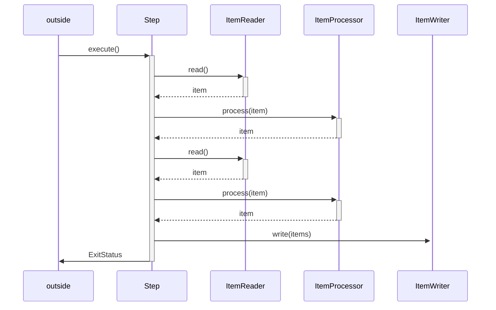

# 第01章_Spring Batch入门

## 1.入门简介

### 1.1 批处理

批处理就是将数据分批次进行处理的过程，比如：银行对账逻辑、跨系统数据同步等。常见的操作步骤为：系统 A 从数据库中导出数据到文件，系统 B 读取文件数据并写入到数据库。


批处理的特点如下：

- 自动执行，根据系统设定的工作步骤自动完成
- 数据量大，少则百万，多则上千万甚至上亿（19 亿以上则需要大数据处理）
- 定时执行

### 1.2 Spring Batch简介

Spring Batch 是一个基于 Spring 框架为基础开发的、轻量级的、完善的批处理框架，提供了大量可重用的组件，但不提供调度框架，如需要定时处理需要额外引入调度框架，如 Quartz。

Spring Batch 核心架构分三层：应用层，核心层，基础架构层。

- 应用层：包含所有的批处理作业，自定义业务实现逻辑
- 核心层：包含 Sprng Batch 启动和控制所需要的核心类，如 `JobLauncher`、`Job`、`Step` 等
- 基础架构层：提供通用的读写服务处理

常用组件如下：

- `JobLauncher`：作业调度器，作业启动主要入口
- `Job`：作业，需要执行的任务逻辑
- `Step`：作业步骤，一个 `Job` 由 1 个或多个 `Step` 组成，完成所有 `Step` 操作，一个完整 `Job` 才算执行结束
- `ItemReader`：`Step` 步骤执行过程中数据输入。可以从数据源中读取 `Item`
- `ItemWriter`：`Step` 步骤执行过程中数据输出，将 `Item` 写入数据源
- `ItemProcessor`：`item` 数据加工逻辑，如：数据清洗、数据转换、数据过滤、数据校验等
- `JobRepository`：保存 `Job` 或者检索 `Job` 的信息，是持久化的接口


### 1.3 入门案例

需求：打印一个 "hello spring batch!"。

#### 1.H2版

**（1）引入依赖**

```xml
<parent>
    <groupId>org.springframework.boot</groupId>
    <artifactId>spring-boot-starter-parent</artifactId>
    <version>3.2.3</version>
    <relativePath/> <!-- lookup parent from repository -->
</parent>
<dependencies>
    <dependency>
        <groupId>org.springframework.boot</groupId>
        <artifactId>spring-boot-starter-batch</artifactId>
    </dependency>
    <!-- 使用 h2 内存数据库 -->
    <dependency>
        <groupId>com.h2database</groupId>
        <artifactId>h2</artifactId>
        <scope>runtime</scope>
    </dependency>
    <dependency>
        <groupId>org.projectlombok</groupId>
        <artifactId>lombok</artifactId>
        <optional>true</optional>
    </dependency>
</dependencies>
```

**（2）创建启动方法**

```java
@SpringBootApplication
public class HelloJob {

    // 构建一个 Step 对象执行的任务
    @Bean
    public Tasklet tasklet() {
        return new Tasklet() {
            @Override
            public RepeatStatus execute(StepContribution contribution, ChunkContext chunkContext) throws Exception {
                // 执行逻辑
                System.out.println("hello spring batch!");
                // 返回执行状态
                return RepeatStatus.FINISHED;
            }
        };
    }

    // 构建一个 Step 对象
    @Bean
    public Step step1(Tasklet tasklet, JobRepository jobRepository, PlatformTransactionManager transactionManager) {
        return new StepBuilder("step1", jobRepository)
                .tasklet(tasklet, transactionManager)
                .build();
    }

    // 构建一个 Job 对象
    @Bean
    public Job job(JobRepository jobRepository, Step step1) {
        return new JobBuilder("hello-job", jobRepository)
                .start(step1)
                .build();
    }

    public static void main(String[] args) {
        SpringApplication.run(HelloJob.class, args);
    }
}
```

#### 2.MySQL版

**（1）引入依赖**

```xml
<!-- 使用 mysql-connector 替换 h2 -->
<dependency>
    <groupId>com.mysql</groupId>
    <artifactId>mysql-connector-j</artifactId>
</dependency>
```

**（2）配置连接**

```yaml
spring:
  datasource:
    driver-class-name: com.mysql.cj.jdbc.Driver
    username: root
    password: root
    url: jdbc:mysql://127.0.0.1:3306/springbatch?useSSL=false&allowPublicKeyRetrieval=true
  # 初始化数据库
  sql:
    init:
      schema-locations: classpath:org/springframework/batch/core/schema-mysql.sql
      mode: always
```

> **注意**
>
> `spring.sql.init.mode` 在第一次启动时为 `always` 来生成表，之后需要改为 `never`。

再次启动方法即可，可以观察到数据库中增加了多个表：

```bash
mysql> show tables;
+------------------------------+
| Tables_in_springbatch        |
+------------------------------+
| batch_job_execution          |
| batch_job_execution_context  |
| batch_job_execution_params   |
| batch_job_execution_seq      |
| batch_job_instance           |
| batch_job_seq                |
| batch_step_execution         |
| batch_step_execution_context |
| batch_step_execution_seq     |
+------------------------------+
9 rows in set (0.00 sec)
```

将 `spring.sql.init.mode` 改为 `never` 再次启动后发现任务不会执行：`Step already complete or not restartable, so no action to execute`，因为同一个任务正常执行完后不会执行第二次。

#### 3.原理分析

`DefaultBatchConfiguration` 帮我们自动配置了 `jobRepository`、`jobLauncher` 等组件，同时 `BatchAutoConfiguration` 帮我们注入了 `jobLauncherApplicationRunner`。在程序启动时执行到 `callRunners()` 方法后会调用 `jobLauncherApplicationRunner` 的 `run()` 方法，然后执行所有 `Job`。

## 2.作业对象Job

`Job` 可以理解为一段业务流程的实现，可以根据业务逻辑拆分成一个或多个逻辑块 `Step`，然后按照业务逻辑顺序逐一执行。所以作业可以定义为：能从头到尾**独立执行**的**有序**的步骤 `Step` 集合。

为了保证作业执行是相互独立的，作业对象引入了 **Job Instance**（作业实例）和 **Job Execution**（作业执行对象）。

- **Job Instance**

  当作业运行时，会创建一个或多个**作业实例**，它代表作业的一次逻辑执行，可通过**作业名称**与**作业标识参数**进行区分。==相同作业也名称和参数只能成功执行一次==。

  > **补充**
  >
  > 如果每天固定时间重复执行某个任务，则每天都会创建新的作业实例。

- **Job Execution**

  Job Instance 在执行时会创建一个或多个**作业执行器**，负责记录 Job 执行情况（开始执行时间、结束时间、处理状态等）。

  > **补充**
  >
  > 如果执行成功则只会有一个 **Job Execution**，出现异常时才会创建新的。

### 2.1 参数

各个作业的通过作业名称 + 识别参数进行区分，Spring Batch 中使用 `JobParameter` 类封装了作业参数，调用 `JobLauncher` 的 `run(job, params)` 方法时会将该参数类传入。

默认情况下 SpringBoot 在启动时会将**命令行参数**传入给 `jobLauncher`，此时会在 `batch_job_execution_params` 表中插入相应的记录。

```bash
+------------------+----------------+------------------+-----------------+-------------+
| JOB_EXECUTION_ID | PARAMETER_NAME | PARAMETER_TYPE   | PARAMETER_VALUE | IDENTIFYING |
+------------------+----------------+------------------+-----------------+-------------+
|                4 | param          | java.lang.String | 1               | Y           |
+------------------+----------------+------------------+-----------------+-------------+
```

#### 1.获取参数

**（1）通过 `ChunkContext` 对象获取**

```java
@Bean
public Tasklet tasklet() {
    return new Tasklet() {
        @Override
        public RepeatStatus execute(StepContribution contribution, ChunkContext chunkContext) throws Exception {
            final Map<String, Object> jobParameters = chunkContext.getStepContext().getJobParameters();
            System.out.println(jobParameters.get("param"));
            return RepeatStatus.FINISHED;
        }
    };
}
```

**（2）使用 `@Value` 延时获取**

通过 `@Value` 的 esPL 表达式取出参数值。

```java
@Bean
// 表示启动项目时不加载该 Bean，等 step1 被调用时才加载
@StepScope
public Tasklet tasklet(@Value("#{jobParameters['param']}") String param) {
    return new Tasklet() {
        @Override
        public RepeatStatus execute(StepContribution contribution, ChunkContext chunkContext) throws Exception {
            System.out.println(param);
            return RepeatStatus.FINISHED;
        }
    };
}
```

#### 2.校验参数

Spring Batch 提供了 `JobParametersValidator` 接口用于进行参数校验。

```java
@FunctionalInterface
public interface JobParametersValidator {
	void validate(@Nullable JobParameters parameters) throws JobParametersInvalidException;
}
```

该接口提供了唯一一个方法 `validate()`，没有返回值，即参数校验失败时抛出异常。

**（1）定制参数校验器**

需求：如果参数 param 的值为 `null` 或者 `""` 则报错：

```java
public class ParamValidator implements JobParametersValidator {
    @Override
    public void validate(JobParameters parameters) throws JobParametersInvalidException {
        if (StringUtils.isBlank(parameters.getString("param"))) {
            throw new JobParametersInvalidException("param 不能为空");
        }
    }
}
```

创建 `Job` 时指定校验器：

```java
@Bean
public Job job(JobRepository jobRepository, Step step1) {
    return new JobBuilder("param-job", jobRepository)
        .start(step1)
        .validator(new ParamValidator())
        .build();
}
```

Spring Batch 还提供了 2 个默认的参数校验器：`DefaultJobParametersValidator` 和 `CompositeJobParametersValidator`。

**（2）默认参数校验器**

默认的参数校验器维护了 2 个 key 集合 `requiredeKeys` 和 `optionalKeys`：

- `requiredKeys`：指定 JobParameters 中必须包含的 keys
- `optionalKeys`：指定 JobParameters 中可选的 keys

需求：如果参数 param 不存在则报错，参数 optional 可有可无：

```java
@Bean
public Job job(JobRepository jobRepository, Step step1) {
    final DefaultJobParametersValidator defaultJobParametersValidator = new DefaultJobParametersValidator();
    defaultJobParametersValidator.setRequiredKeys(new String[]{"param"});
    defaultJobParametersValidator.setOptionalKeys(new String[]{"optional"});
    return new JobBuilder("param-job", jobRepository)
        .start(step1)
        .validator(defaultJobParametersValidator)
        .build();
}
```

**（3）组合参数校验器**

会遍历调用所有 `Validator` 的 `validate()` 方法。

```java
@Bean
public Job job(JobRepository jobRepository, Step step1) {
    CompositeJobParametersValidator compositeJobParametersValidator = new CompositeJobParametersValidator();
    compositeJobParametersValidator.setValidators(List.of(validator1, validator2));
    return new JobBuilder("param-job6", jobRepository)
        .start(step1)
        .validator(compositeJobParametersValidator)
        .build();
}
```

#### 3.参数增量器

每次运行作业时必须要修改作业名称或者作业参数，Spring Batch 提供了 `JobParametersIncrementer`（作业参数增量器）来解决该问题。

```java
@FunctionalInterface
public interface JobParametersIncrementer {
	JobParameters getNext(@Nullable JobParameters parameters);
}
```

通过 `getNext()` 方法，我们可以给 `JobParameters` 添加或修改参数，即让作业标识参数每次都发生变动。

**（1）ID 自增增量器**

Spring Batch 提供了一个默认的参数增量器实现：ID 自增器 `RunIdIncrementer`，每次启动时，里面维护的 `run.id` 字段都会增加 1。

```java
public class RunIdIncrementer implements JobParametersIncrementer {
    private static final String RUN_ID_KEY = "run.id";

	private String key = RUN_ID_KEY;
    
    public void setKey(String key) {
		this.key = key;
	}
    
    @Override
	public JobParameters getNext(@Nullable JobParameters parameters) {

		JobParameters params = (parameters == null) ? new JobParameters() : parameters;
		JobParameter<?> runIdParameter = params.getParameters().get(this.key);
		long id = 1;
		if (runIdParameter != null) {
            // 如果存在 runIdParameter 则 + 1
			try {
				id = Long.parseLong(runIdParameter.getValue().toString()) + 1;
			}
			catch (NumberFormatException exception) {
				throw new IllegalArgumentException("Invalid value for parameter " + this.key, exception);
			}
		}
		return new JobParametersBuilder(params).addLong(this.key, id).toJobParameters();
	}
}
```

使用

```java
@Bean
public Job job(JobRepository jobRepository, Step step1) {
    return new JobBuilder("param-job", jobRepository)
        .start(step1)
        .incrementer(new RunIdIncrementer())
        .build();
}
```

**（2）时间戳增量器**

`run.id` 作为标识参数没有具体的实际意义，我们可以选择使用日期作为标识参数。Spring Batch 没有现成的时间戳增量器，需要自己定义：

```java
public class DailyTimestampParamIncrementer implements JobParametersIncrementer {
    @Override
    public JobParameters getNext(JobParameters parameters) {
        return new JobParametersBuilder(parameters)
                .addLong("timestamp", new Date().getTime())
                .toJobParameters();
    }
}
```

```java
@Bean
public Job job(JobRepository jobRepository, Step step1) {
    return new JobBuilder("param-job", jobRepository)
        .start(step1)
        .incrementer(new DailyTimestampParamIncrementer())
        .build();
}
```

### 2.2 作业监听器

用来监听作业的执行过程逻辑，在作业执行前、执行后都可以嵌入业务逻辑。

- 执行前：一般用于初始化操作，如数据库连接、线程池初始化等
- 执行后：一般用于清理资源

Spring Batch 提供了 `JobExecutionListener` 接口用于创建监听器。

```java
public interface JobExecutionListener {
	default void beforeJob(JobExecution jobExecution) {}
	default void afterJob(JobExecution jobExecution) {}
}
```

需求：记录作业执行前、执行中、执行后的状态。

#### 1.接口方式

实现 `JobExecutionListener`

```java
public class JobStateListener implements JobExecutionListener {
    @Override
    public void beforeJob(JobExecution jobExecution) {
        System.out.println("执行前状态：" + jobExecution.getStatus());
    }

    @Override
    public void afterJob(JobExecution jobExecution) {
        System.out.println("执行后状态：" + jobExecution.getStatus());
    }
}
```

给 `Job` 添加监听器

```java
@Bean
public Job job(JobRepository jobRepository, Step step1) {
    return new JobBuilder("listener-job", jobRepository)
        .start(step1)
        .incrementer(new DailyTimestampParamIncrementer())
        .listener(new JobStateListener())
        .build();
}

@Bean
@StepScope
public Tasklet tasklet() String param) {
    return new Tasklet() {
        @Override
        public RepeatStatus execute(StepContribution contribution, ChunkContext chunkContext) throws Exception {
			// 获取 JobExecution
            JobExecution jobExecution = contribution.getStepExecution().getJobExecution();
            // 获得任务执行中的状态
            System.out.println("执行中的状态:" + jobExecution.getStatus());
            return RepeatStatus.FINISHED;
        }
    };
}
```

结果

```bash
执行前状态：STARTED
执行中的状态:STARTED
执行后状态：COMPLETED
```

#### 2.注解方式

在执行前方法和执行后方法上添加注解，不需要实现 `JobExecutionListener`

```java
public class JobStateAnnotationListener {
    @BeforeJob
    public void beforeJob(JobExecution jobExecution) {
        System.out.println("执行前状态：" + jobExecution.getStatus());
    }

    @AfterJob
    public void afterJob(JobExecution jobExecution) {
        System.out.println("执行后状态：" + jobExecution.getStatus());
    }
}
```

给 `Job` 添加监听器

```java
@Bean
public Job job(JobRepository jobRepository, Step step1) {
    return new JobBuilder("listener-job", jobRepository)
        .start(step1)
        .incrementer(new DailyTimestampParamIncrementer())
        .listener(new JobStateAnnotationListener())
        // 下面这种也可以加载
        // .listener(JobListenerFactoryBean.getListener(new JobStateAnnotationListener()))
        .build();
}
```

### 2.3 执行上下文

Spring Batch 有 3 个比较重要的上下文：

- `JobContext`

  `JobContext` 绑定 `JobExecution` 执行对象为 `Job` 作业执行提供环境，实现作业收尾工作，处理各种作业回调逻辑。

- `StepContext`

  `StepContext` 绑定 `StepExecution` 执行对象为 `Step` 作业执行提供环境，实现步骤收尾工作，处理各种步骤回调逻辑。

- `ExecutionContext`

  `ExecutionContext` 用于进行数据共享，主要分为两类：

  - **Job ExecutionContext**

    作用域：一次作业运行期间，所有 `Step` 步骤间数据共享。

  - **Step ExecutionContext**

    作用域：一次步骤运行，单个 `Step` 步骤间（`ItemReader`、`ItemProcessor`、`ItemWriter`）数据共享。


#### 1.作业步骤执行链


#### 2.作业步骤引用链

- 作业引用线

  ```mermaid
  flowchart LR
  	Job --> JobInstance --> JobContext --> JobExecution --> ExecutionContext
  ```

- 步骤引用线

  ```mermaid
  flowchart LR
  	Step --> StepContext --> StepExecution --> ExecutionContext
  ```

#### 3.常用API

**（1）作业上下文 API**

```java
// 获得 JobContext
JobContext context = JobSynchronizationManager.getContext();
// 获得 JobExecution
JobExecution jobExecution = context.getJobExecution();
Map<String, Object> jobParamters = context.getJobParameters();
Map<String, Object> jobExecutionContext = context.getJobExecutionContext();
```

**（2）步骤上下文 API**

```java
StepContext stepContext = chunkContext.getStepContext();
StepExecution stepExecution = stepContext.getStepExecution();
Map<String, Object> stepExecutionContext = stepContext.getStepExecutionContext();
// 步骤上下文中也可以拿到作业上下文
Map<String, Object> jobExecutionContext = stepContext.getJobExecutionContext();
```

**（3）执行上下文 API**

```java
StepContext stepContext = chunkContext.getStepContext();
StepExecution stepExecution = stepContext.getStepExecution();
// 从 stepExecution 中获得 stepExecutionContext
ExecutionContext stepExecutionContext = stepExecution.getExecutionContext();

JobExecution jobExecution = stepExecution.getJobExecution();
// 从 jobExecution 中获得 jobExecutionContext
ExecutionContext jobExecutionContext = jobExecution.getExecutionContext();
```

> **注意**
>
> 获得的 `Map` 类型上下文只能获取不能修改数据，而获得的 `ExecutionContext` 可以修改数据。

**案例**

需求：观察 `JobExecutionContext` 与 `StepExecutionContext` 的数据共享

- 定义两个步骤 step1 和 step2
- 在 step1 中设置数据：
  - `JobExecutionContext` 中添加 job-job
  - `ExecutionContext` 中添加 step-step
- 在 step2 中打印观察

```java
@SpringBootApplication
public class HelloJob {

    @Bean
    public Tasklet tasklet1() {
        return new Tasklet() {
            @Override
            public RepeatStatus execute(StepContribution contribution, ChunkContext chunkContext) throws Exception {
                System.out.println("---------- task1 ----------");
                // 向 stepExecutionContext 中放入 step-step
                final ExecutionContext stepExecutionContext = chunkContext.getStepContext().getStepExecution().getExecutionContext();
                stepExecutionContext.put("step", "step");
                // 向 jobExecutionContext 中放入 job-job
                final ExecutionContext jobExecutionContext = chunkContext.getStepContext().getStepExecution().getJobExecution().getExecutionContext();
                jobExecutionContext.put("job", "job");
                return RepeatStatus.FINISHED;
            }

        };
    }

    @Bean
    public Tasklet tasklet2() {
        return new Tasklet() {
            @Override
            public RepeatStatus execute(StepContribution contribution, ChunkContext chunkContext) throws Exception {
                System.out.println("---------- task2 ----------");
                // 从 stepExecutionContext 中取出 step
                final ExecutionContext stepExecutionContext = chunkContext.getStepContext().getStepExecution().getExecutionContext();
                System.out.println(stepExecutionContext.get("step"));
                // 从 jobExecutionContext 中取出 job
                final ExecutionContext jobExecutionContext = chunkContext.getStepContext().getStepExecution().getJobExecution().getExecutionContext();
                System.out.println(jobExecutionContext.get("job"));
                return RepeatStatus.FINISHED;
            }
        };
    }

    @Bean
    public Step step1(Tasklet tasklet1, JobRepository jobRepository, PlatformTransactionManager transactionManager) {
        return new StepBuilder("step1", jobRepository)
            .tasklet(tasklet1, transactionManager)
            .build();
    }

    @Bean
    public Step step2(Tasklet tasklet2, JobRepository jobRepository, PlatformTransactionManager transactionManager) {
        return new StepBuilder("step2", jobRepository)
            .tasklet(tasklet2, transactionManager)
            .build();
    }

    @Bean
    public Job job(JobRepository jobRepository, Step step1, Step step2) {
        return new JobBuilder("execution-job", jobRepository)
            .start(step1)
			// 第二个步骤开始使用 next()
            .next(step2)
            .incrementer(new DailyTimestampParamIncrementer())
            .build();
    }

    public static void main(String[] args) {
        SpringApplication.run(HelloJob.class, args);
    }
}
```

结果

```bash
---------- task1 ----------
---------- task2 ----------
null
job
```

发现只能从 `JobExecutionContext` 中获取到数据，`StepExecutionContext` 中无法跨步骤获取数据。

## 3.步骤对象Step

步骤是一个独立功能组件，它包含了一个工作单元需要的全部内容，如：输入模块、输出模块、数据处理模块。Spring Batch 目前支持 2 种步骤处理模式：

- 基于 `Tasklet`：实现 `Tasklet` 接口，返回状态
- 基于块（Chunk）状 `Tasklet`：一般包含 2~3 个组件：`ItemReader`、`ItemWriter`、`ItemProcessor`（可选）

### 3.1 Tasklet

```java
@FunctionalInterface
public interface Tasklet {
	@Nullable
	RepeatStatus execute(StepContribution contribution, ChunkContext chunkContext) throws Exception;
}
```

`Tasklet` 是一个函数式接口，它包含两个参数：

- `StepContribution`：步骤信息对象，用于保存当前步骤执行情况，常用于设置步骤结果状态

  ```java
  contribution.setExitStatus(ExitStatus.COMPLETED);
  ```

- `ChunkContext`：`Chunk` 上下文，可以获取上下文对象。

返回一个 `RepeatStatus`，他是一个枚举类：

```java
public enum RepeatStatus {
    // 循环执行
    CONTINUABLE(true),
    // 表示执行结束，可以成功也可以不成功
    FINISHED(false);
}
```

### 3.2 Chunk Tasklet

**结构图**


**时序图**



**代码示例**

```java
@SpringBootApplication
public class HelloJob {

    @Bean
    public ItemReader<String> itemReader() {
        return new ItemReader() {
            @Override
            public String read() throws Exception, UnexpectedInputException, ParseException, NonTransientResourceException {
                System.out.println("--------- read ---------");
                return "read";
            }
        };
    }

    @Bean
    public ItemProcessor<String, String> itemProcessor() {
        return new ItemProcessor<>() {
            @Override
            public String process(String item) throws Exception {
                System.out.println("--------- process ---------");
                return "process -> " + item;
            }
        };
    }

    @Bean
    public ItemWriter<String> itemWriter() {
        return new ItemWriter<>() {
            @Override
            public void write(Chunk chunk) throws Exception {
                System.out.println(chunk.getItems());
            }
        };
    }

    @Bean
    public Step step1(JobRepository jobRepository, PlatformTransactionManager transactionManager) {
        return new StepBuilder("step1", jobRepository)
            // chunk 设置为 3
            .<String, String>chunk(3, transactionManager)
            // 设置 itemReader、itemProcessor、itemWriter
            .reader(itemReader())
            .processor(itemProcessor())
            .writer(itemWriter())
            .build();
    }


    @Bean
    public Job job(JobRepository jobRepository, Step step1) {
        return new JobBuilder("chunk-job", jobRepository)
            .start(step1)
            .incrementer(new DailyTimestampParamIncrementer())
            .build();
    }

    public static void main(String[] args) {
        SpringApplication.run(HelloJob.class, args);
    }
}
```

结果发现一直在循环打印下面的输出。

```bash
--------- read ---------
--------- read ---------
--------- read ---------
--------- process ---------
--------- process ---------
--------- process ---------
[process -> read, process -> read, process -> read]
```

因为 `ItemReader` 会==一直循环读取==，直到 `null` 值停止。`ItemProcessor` 则会一直处理 `ItemReader` 读取的数据，`ItemWriter` 一次性输出当前处理的所有数据。

而 `chunkSize = 3` 表示 `Reader` 一次性读取 3 次然后提交给 `Processor` 处理 3 次。

最后由 `Writer` 全部写入。

### 3.3 步骤监听器

步骤监听器有 2 个：`StepExecutionListener`  和 `ChunkListener`。

#### 1.StepExecutionListener

```java
public interface StepExecutionListener extends StepListener {

	default void beforeStep(StepExecution stepExecution) {
	}

	@Nullable
	default ExitStatus afterStep(StepExecution stepExecution) {
		return null;
	}

}
```

**代码示例**

创建监听器

```java
public class MyStepListener implements StepExecutionListener {
    @Override
    public void beforeStep(StepExecution stepExecution) {
        System.out.println("-------- before step --------");
    }

    @Override
    public ExitStatus afterStep(StepExecution stepExecution) {
        System.out.println("-------- after step --------");
        return stepExecution.getExitStatus();
    }
}
```

在 `Step` 中添加监听器

```java
@Bean
public Step step1(JobRepository jobRepository, PlatformTransactionManager transactionManager) {
    return new StepBuilder("step1", jobRepository)
        .<String, String>chunk(5, transactionManager)
        .reader(itemReader())
        .processor(itemProcessor())
        .writer(itemWriter())
        .listener(new MyStepListener())
        .build();
}
```

#### 2.ChunkListener

`ChunkListener` 跟上面的一样，唯一的区别是多了 `afterChunkError` 方法。

```java
public interface ChunkListener extends StepListener {

	String ROLLBACK_EXCEPTION_KEY = "sb_rollback_exception";

	default void beforeChunk(ChunkContext context) {}
	default void afterChunk(ChunkContext context) {}
	default void afterChunkError(ChunkContext context) {}

}
```

### 3.4 多步骤控制

多步骤执行时，可以根据业务条件判断是否执行某个步骤。Spring Batch 提供了 `start`、`next`、`on`、`from`、`to`、`end` 来控制执行顺序。

- `on`：表示条件，上一个步骤返回值，匹配指定的字符串（取值于 `ExitStatus` 类常量，也可以自定义），满足后执行后续 `to` 步骤
- `*`：通配符，匹配任意返回值
- `from`：表示从某个步骤开始进行条件判断

- `end`：结束流程

#### 1.默认返回状态

 ```java
 @SpringBootApplication
 public class HelloJob {
 
     @Bean
     public Tasklet firstTasklet() {
         return (contribution, chunkContext) -> {
             System.out.println("---------- first ----------");
             // int i = 1 / 0;
             return RepeatStatus.FINISHED;
         };
     }
 
     @Bean
     public Tasklet successTasklet() {
         return (contribution, chunkContext) -> {
             System.out.println("---------- success ----------");
             return RepeatStatus.FINISHED;
         };
     }
 
     @Bean
     public Tasklet failTasklet() {
         return (contribution, chunkContext) -> {
             System.out.println("---------- fail ----------");
             return RepeatStatus.FINISHED;
         };
     }
 
     @Bean
     public Step firstStep(JobRepository jobRepository, PlatformTransactionManager transactionManager) {
         return new StepBuilder("firstStep", jobRepository)
                 .tasklet(firstTasklet(), transactionManager)
                 .build();
     }
 
     @Bean
     public Step successStep(JobRepository jobRepository, PlatformTransactionManager transactionManager) {
         return new StepBuilder("successStep", jobRepository)
                 .tasklet(successTasklet(), transactionManager)
                 .build();
     }
 
     @Bean
     public Step failStep(JobRepository jobRepository, PlatformTransactionManager transactionManager) {
         return new StepBuilder("failStep", jobRepository)
                 .tasklet(failTasklet(), transactionManager)
                 .build();
     }
 
 
     @Bean
     public Job job(JobRepository jobRepository) {
         return new JobBuilder("multi-job", jobRepository)
                 .start(firstStep(null, null))
                 // 如果是 FAILED，则执行 failStep
                 .on("FAILED").to(failStep(null, null))
                 // 否则从 firstStep 继续执行，不论结果如何执行 successStep
                 .from(firstStep(null, null)).on("*").to(successStep(null, null))
                 .end()
                 .incrementer(new DailyTimestampParamIncrementer())
                 .build();
     }
 
     public static void main(String[] args) {
         SpringApplication.run(HelloJob.class, args);
     }
 }
 ```

正常情况下会打印

```bash
---------- first ----------
---------- success ----------
```

在 `firstTasklet` 中添加上 `int i = 1 / 0;` 后打印：

```bash
---------- first ----------
java.lang.ArithmeticException: / by zero
---------- fail ----------
```

> **注意**
>
> Spring Batch 会捕获 `Tasklet` 中抛出的任何异常。

#### 2.自定义状态

`on` 条件的值取值于 `ExitStatus` 常量，也可以自己定义，需要实现 `JobExecutionDecider` 接口定制状态值。

**案例**

需求：先执行 firstStep，如果状态为 A，则执行 stepA，为 B 执行 stepB，否则执行 defaultStep。

先定义一个决策器：

```java
@Component
public class MyDecider implements JobExecutionDecider {
    @Override
    public FlowExecutionStatus decide(JobExecution jobExecution, StepExecution stepExecution) {
        // 从 JobExecutionContext 中取出 status 变量值
        final String status = jobExecution.getExecutionContext().getString("status");
        return new FlowExecutionStatus(status);
    }
}
```

任务

```java
@SpringBootApplication
public class HelloJob {

    @Bean
    public Tasklet firstTasklet() {
        // 向 JobExecutionContext 中放入 status
        return (contribution, chunkContext) -> {
            chunkContext.getStepContext().getStepExecution().getJobExecution().getExecutionContext().put("status", "A");
            System.out.println("---------- first ----------");
            return RepeatStatus.FINISHED;
        };
    }

    @Bean
    public Tasklet aTasklet() {
        return (contribution, chunkContext) -> {
            System.out.println("---------- a ----------");
            return RepeatStatus.FINISHED;
        };
    }

    @Bean
    public Tasklet bTasklet() {
        return (contribution, chunkContext) -> {
            System.out.println("---------- b ----------");
            return RepeatStatus.FINISHED;
        };
    }

    @Bean
    public Tasklet defaultTasklet() {
        return (contribution, chunkContext) -> {
            System.out.println("---------- default ----------");
            return RepeatStatus.FINISHED;
        };
    }

    @Bean
    public Step firstStep(JobRepository jobRepository, PlatformTransactionManager transactionManager) {
        return new StepBuilder("firstStep", jobRepository)
            .tasklet(firstTasklet(), transactionManager)
            .build();
    }

    @Bean
    public Step aStep(JobRepository jobRepository, PlatformTransactionManager transactionManager) {
        return new StepBuilder("aStep", jobRepository)
            .tasklet(aTasklet(), transactionManager)
            .build();
    }

    @Bean
    public Step bStep(JobRepository jobRepository, PlatformTransactionManager transactionManager) {
        return new StepBuilder("bStep", jobRepository)
            .tasklet(bTasklet(), transactionManager)
            .build();
    }

    @Bean
    public Step defaultStep(JobRepository jobRepository, PlatformTransactionManager transactionManager) {
        return new StepBuilder("defaultStep", jobRepository)
            .tasklet(defaultTasklet(), transactionManager)
            .build();
    }


    @Bean
    public Job job(JobRepository jobRepository, JobExecutionDecider myDecider) {
        return new JobBuilder("multi-job", jobRepository)
            // 首先执行 firstStep
            .start(firstStep(null, null))
            // 接下来执行状态决策器
            .next(myDecider)
            // 如果结果为 A，从执行器继续执行 aStep
            .from(myDecider).on("A").to(aStep(null, null))
            // 如果结果为 B，从执行器继续执行 bStep
            .from(myDecider).on("B").to(bStep(null, null))
            // 如果结果为其他，从执行器继续执行 defaultStep
            .from(myDecider).on("*").to(defaultStep(null, null))
            .end()
            .incrementer(new DailyTimestampParamIncrementer())
            .build();
    }

    public static void main(String[] args) {
        SpringApplication.run(HelloJob.class, args);
    }
}
```

### 3.5 控制作业状态

Spring Batch 使用 `ExistStatus` 表示步骤、块、作业执行状态：

```java
public class ExitStatus implements Serializable, Comparable<ExitStatus> {
    // 未知状态
    public static final ExitStatus UNKNOWN = new ExitStatus("UNKNOWN");
    // 执行中
    public static final ExitStatus EXECUTING = new ExitStatus("EXECUTING");
    // 执行结束
    public static final ExitStatus COMPLETED = new ExitStatus("COMPLETED");
    // 无效执行
    public static final ExitStatus NOOP = new ExitStatus("NOOP");
    // 执行失败
    public static final ExitStatus FAILED = new ExitStatus("FAILED");
    // 执行中断
    public static final ExitStatus STOPPED = new ExitStatus("STOPPED");
}
```

一般来说，作业启动后会自动控制流程状态。例如顺利结束时返回 `COMPLETED`；异常结束时返回 `FAILED`；无效执行返回 `NOOP`。Spring Batch 也提供了 3 个方法决定作业流程走向：

- `end()`：成功结束，返回 `COMPLETED`
- `fail()`：失败结束，返回 `FAILED`
- `stopAndRestart(step)`：作业中断，返回 `STOPPED`，再次启动时从 step 的位置开始执行（前提是参数与 job Name 相同）

**代码示例**

```java
@SpringBootApplication
public class HelloJob {

    @Bean
    public Tasklet firstTasklet() {
        return (contribution, chunkContext) -> {
            System.out.println("---------- first ----------");
            int i = 1 / 0;
            return RepeatStatus.FINISHED;
        };
    }

    ...

        @Bean
        public Job job(JobRepository jobRepository) {
        return new JobBuilder("change-status-job", jobRepository)
            .start(firstStep(null, null))
            // 如果是 FAILED，则直接正常结束，数据库中登录 Job 的返回状态为 COMPLETED
			// 默认情况下会登记注册 Job 返回状态为 FAILED
            .on("FAILED").end()
            // .on("FAILED").end() 登记 Job 状态为 FAILED
            // .on("FAILED").stopAndRestart(successStep()) 登记 Job 状态为 STOPPED，作业重启时从 successStep 开始执行
            .from(firstStep(null, null)).on("*").to(successStep(null, null)).end()
            .incrementer(new DailyTimestampParamIncrementer())
            .build();
    }

    public static void main(String[] args) {
        SpringApplication.run(HelloJob.class, args);
    }
}
```

### 3.6 流式步骤

 `FlowStep` 流式步骤也可以理解为步骤集合，由多个子步骤组成。作业执行时，将它作为一个普通步骤执行。一般用于较为复杂的业务。

需求：顺序执行 stepA、stepB、stepC，其中 stepB 包含 stepB1、stepB2、stepB3。

```java
@SpringBootApplication
public class HelloJob {

    @Bean
    public Tasklet taskletA() {
        return (contribution, chunkContext) -> {
            System.out.println("---------- taskletA ----------");
            return RepeatStatus.FINISHED;
        };
    }

    @Bean
    public Tasklet taskletB1() {
        return (contribution, chunkContext) -> {
            System.out.println("---------- taskletB1 ----------");
            return RepeatStatus.FINISHED;
        };
    }

    @Bean
    public Tasklet taskletB2() {
        return (contribution, chunkContext) -> {
            System.out.println("---------- taskletB2 ----------");
            return RepeatStatus.FINISHED;
        };
    }

    @Bean
    public Tasklet taskletB3() {
        return (contribution, chunkContext) -> {
            System.out.println("---------- taskletB3 ----------");
            return RepeatStatus.FINISHED;
        };
    }

    @Bean
    public Tasklet taskletC() {
        return (contribution, chunkContext) -> {
            System.out.println("---------- taskletC ----------");
            return RepeatStatus.FINISHED;
        };
    }

    @Bean
    public Step stepA(JobRepository jobRepository, PlatformTransactionManager transactionManager) {
        return new StepBuilder("stepA", jobRepository)
                .tasklet(taskletA(), transactionManager)
                .build();
    }

    @Bean
    public Step stepB1(JobRepository jobRepository, PlatformTransactionManager transactionManager) {
        return new StepBuilder("stepB1", jobRepository)
                .tasklet(taskletB1(), transactionManager)
                .build();
    }

    @Bean
    public Step stepB2(JobRepository jobRepository, PlatformTransactionManager transactionManager) {
        return new StepBuilder("stepB2", jobRepository)
                .tasklet(taskletB2(), transactionManager)
                .build();
    }

    @Bean
    public Step stepB3(JobRepository jobRepository, PlatformTransactionManager transactionManager) {
        return new StepBuilder("stepB3", jobRepository)
                .tasklet(taskletB3(), transactionManager)
                .build();
    }

    // 将 stepB1、stepB2、stepB3 封装进 flow 中
    @Bean
    public Flow flowB() {
        return new FlowBuilder<Flow>("flowB")
                .start(stepB1(null, null))
                .next(stepB2(null, null))
                .next(stepB3(null, null))
                .build();
    }

    // 必须使用 step 封装 flow
    @Bean
    public Step stepB(JobRepository jobRepository, PlatformTransactionManager transactionManager) {
        return new StepBuilder("stepB", jobRepository)
                .flow(flowB())
                .build();
    }

    @Bean
    public Step stepC(JobRepository jobRepository, PlatformTransactionManager transactionManager) {
        return new StepBuilder("stepC", jobRepository)
                .tasklet(taskletC(), transactionManager)
                .build();
    }

    @Bean
    public Job job(JobRepository jobRepository) {
        return new JobBuilder("change-status-job", jobRepository)
                .start(stepA(null, null))
                .next(stepB(null, null))
                .next(stepC(null, null))
                .incrementer(new DailyTimestampParamIncrementer())
                .build();
    }

    public static void main(String[] args) {
        SpringApplication.run(HelloJob.class, args);
    }
}
```