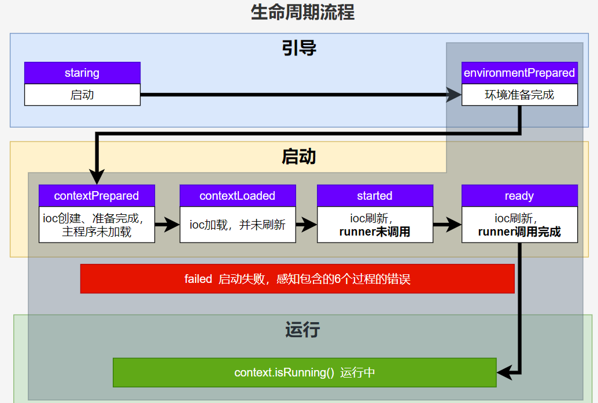
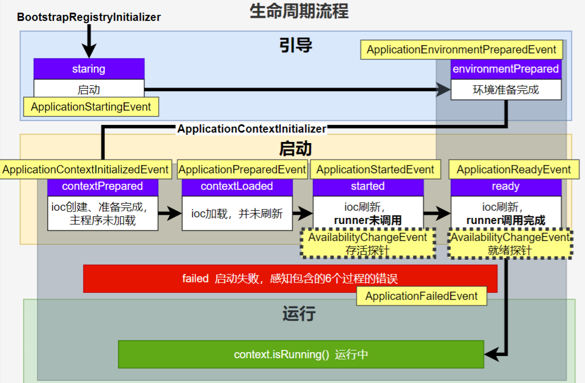

# 第14章_核心原理

## 1.事件和监听器

### 1.1 生命周期监听

  springboot 在 spring-boot.jar 中配置了默认的 Listener，如下：

```properties
# Run Listeners
org.springframework.boot.SpringApplicationRunListener=\
org.springframework.boot.context.event.EventPublishingRunListener
```

#### 1.SpringApplicationRunListener

自定义 `SpringApplicationRunListener` 来监听事件：

1. 编写 `SpringApplicationRunListener` 实现类
2. 在 `META-INF/spring.factories` 中配置 `org.springframework.boot.SpringApplicationRunListener=自己的Listener`，还可以指定一个**有参构造器**，接受两个参数 `(SpringApplication application, String[] args)`

```java
public class MySpringApplicationRunListener implements SpringApplicationRunListener {

    private SpringApplication springApplication;
    private String[] args;

    public MySpringApplicationRunListener(SpringApplication springApplication, String[] args) {
        this.springApplication = springApplication;
        this.args = args;
    }

    @Override
    public void starting(ConfigurableBootstrapContext bootstrapContext) {
        System.out.println("服务正在启动");
    }

    @Override
    public void environmentPrepared(ConfigurableBootstrapContext bootstrapContext, ConfigurableEnvironment environment) {
        System.out.println("环境准备完成");
    }

    @Override
    public void contextPrepared(ConfigurableApplicationContext context) {
        System.out.println("IOC 容器准备完成");
    }

    @Override
    public void contextLoaded(ConfigurableApplicationContext context) {
        System.out.println("IOC 容器加载完成");
    }

    @Override
    public void started(ConfigurableApplicationContext context, Duration timeTaken) {
        System.out.println("启动完成");
    }

    @Override
    public void ready(ConfigurableApplicationContext context, Duration timeTaken) {
        System.out.println("准备就绪");
    }

    @Override
    public void failed(ConfigurableApplicationContext context, Throwable exception) {
        System.out.println("启动失败");
    }
}
```

之后在 resources 下新建 `META-INF/spring.factories` 文件并声明以下配置：

```properties
org.springframework.boot.SpringApplicationRunListener=com.example.demo.MySpringApplicationRunListener
```

#### 2.流程

主要流程定义在 `SpringApplication` 的 `run()` 方法中。



1. 引导： 利用 `BootstrapContext` 引导整个项目启动

   - `starting`：`SpringApplication` 的 `run` 方法调用后会先创建 `bootstrapContext`，从 `spring.factories` 中读取并加载 `SpringApplicationRunListeners`，然后发布【开始】事件

    * `environmentPrepared`：环境准备好后（把启动参数等绑定到环境变量中）会发布【环境准备完成事件】，此时 IOC 还没有创建

2. 启动：

    * `contextPrepared`：IOC 容器创建并准备好，但是 `sources`（主配置类）还没加载时发布【IOC 容器准备完成事件】；发布后会关闭 `bootstrapContext`，此时组件都还没创建（调用 IOC 容器的 `refresh` 方法之前）

    * `contextLoaded`：【IOC 容器加载完成事件】，IOC 容器依然还没刷新

    * `started`：IOC 容器刷新了（加载了所有 `Bean`），但是 `runner` 还没调用

    * `ready`：IOC 容器刷新了并且所有 `runner` 调用完成

3. 运行：以上所有步骤都正确执行，代表容器处于 `running`

### 1.2 事件触发时机

#### 1.回调监听器

##### 1.1 BootstrapRegistryInitializer

在构造 `SpringApplication` 时加载所有初始化器，在创建 `bootstrapContext` 时执行该实现方法。

**加载方式**

- 通过 `META-INF/spring.factories` 加载

- ```java
  SpringApplication springApplication = new SpringApplication(MainApplication.class);
  springApplication.addBootstrapRegistryInitializer(...);
  ```

场景：进行密钥校对授权。

##### 1.2 ApplicationContextInitializer

在构造 `SpringApplication` 时加载所有初始化器。

**加载方式**

- 通过 `META-INF/spring.factories` 加载

- ```java
  SpringApplication springApplication = new SpringApplication(MainApplication.class);
  springApplication.addInitializers(...);
  ```

##### 1.3 ApplicationListener

基于事件机制感知事件，只要容器中有相关事件（启动时发布的和运行时发布的事件）的发布，就能监听到该事件。在构造 `SpringApplication` 时加载监听器。

**加载方式**

- `@Bean`

  ```java
  @Component
  public class MyApplicationListener implements ApplicationListener {
      @Override
      public void onApplicationEvent(ApplicationEvent event) {
          System.out.println("reveived event:" + event.getSource());
      }
  }
  ```

- `@EventListener`

  底层调用【`SmartInitializingSingleton` 的 `afterSingletonsInstantiated()`】时，由 `EventListenerMethodProcessor` 来解析方法并创建 `applicationListener` 对象。

  ```java
  @Service
  public class UserService {
      
      @EventListener(classes = {ApplicationEvent.class})
      public void listen(ApplicationEvent event) {
          System.out.println("userService 监听：" + event);
      }
      
  }
  ```

- ```java
  SpringApplication springApplication = new SpringApplication(MainApplication.class);
  springApplication.addListeners(...);
  ```

- `META-INF/spring.factories`

**常见的默认事件**

- `ContextRefreshedEvent`：容器刷新完成（所有 Bean 都完全创建）会发布这个事件
- `ContextClosedEvent`：关闭容器会发布这个事件

##### 1.4 SpringApplicationRunListener

感知全阶段生命周期 + 各种阶段都能自定义操作；通过 `META-INF/spring.factories` 指定加载。

##### 1.5 ApplicationRunner

通过 `@Bean` 加载。

```java
@Order(2)
@Component
public class MyApplicationRunner implements ApplicationRunner {

    @Override
    public void run(ApplicationArguments args) {
        System.out.println("ApplicationArguments");
    }

}
```

##### 1.6 CommandLineRunner

通过 `@Bean` 加载。

```java
@Order(2) // 数字越大优先级越高
@Component
public class MyCommandLineRunner implements CommandLineRunner {

    @Override
    public void run(String... args) throws Exception {
        System.out.println("String");
    }
}
```

最佳实战：

- 如果项目启动前做事： `BootstrapRegistryInitializer` 和 `ApplicationContextInitializer`
- 如果想要在项目启动完成后做事：`ApplicationRunner` 和 `CommandLineRunner`
- 如果要干涉生命周期做事：`SpringApplicationRunListener`
- 如果想要用事件机制：`ApplicationListener`

#### 2.触发流程



9 大事件触发顺序和时机：

1. `ApplicationStartingEvent`：应用启动但未做任何事情
2. `ApplicationEnvironmentPreparedEvent`：Environment 准备好，但 context 未创建
3. `ApplicationContextInitializedEvent`：ApplicationContext 准备好，ApplicationContextInitializers 调用，但是任何 bean 未加载
4. `ApplicationPreparedEvent`： 容器刷新之前，bean 定义信息加载
5. `ApplicationStartedEvent`： 容器刷新完成， runner 未调用

之后就开始插入了探针机制配合 K8S：

6. `AvailabilityChangeEvent`： `LivenessState.CORRECT` 应用存活， **存活探针**
7. `ApplicationReadyEvent`: 任何 runner 被调用
8. `AvailabilityChangeEvent`：`ReadinessState.ACCEPTING_TRAFFIC` **就绪探针**，可以接请求
9. `ApplicationFailedEvent `：启动出错

#### 3.事件驱动开发

可以感知应用启动过程生命周期事件（9 大事件）和应用运行中事件（无数种）。

- 事件发布：`ApplicationEventPublisherAware` 或注入 `ApplicationEventMulticaster`
- 事件监听：组件 + `@EventListener`

**事件发布者**

```java
@Service
public class EventPublisher implements ApplicationEventPublisherAware {

    /**
     * 底层发送事件用的组件
     */
    ApplicationEventPublisher applicationEventPublisher;

    /**
     * 所有事件都可以发
     * @param event
     */
    public void sendEvent(ApplicationEvent event) {
        //调用底层 API 发送事件
        applicationEventPublisher.publishEvent(event);
    }

    /**
     * SpringBoot 会通过 ApplicationContextAwareProcessor 接口自动注入给我们
     */
    @Override
    public void setApplicationEventPublisher(ApplicationEventPublisher applicationEventPublisher) {
        this.applicationEventPublisher = applicationEventPublisher;
    }
}
```

**事件订阅者**

两种写法：

**（1）实现 ApplicationListener 接口**

```java
@Service
public class CouponService implements ApplicationListener<LoginSuccessEvent> {
    @Override
    public void onApplicationEvent(LoginSuccessEvent event) {
        System.out.println("===== CouponService ====感知到事件"+loginSuccessEvent);
        UserEntity source = (UserEntity) loginSuccessEvent.getSource();
        sendCoupon(source.getUsername());
    }
    
    public void sendCoupon(String username){
        System.out.println(username + " 随机得到了一张优惠券");
    }
}
```

**（2）使用 @EventListener 注解**

```java
@Service
public class CouponService {

    @Order(1)
    @EventListener
    public void onEvent(LoginSuccessEvent loginSuccessEvent){
        System.out.println("===== CouponService ====感知到事件"+loginSuccessEvent);
        UserEntity source = (UserEntity) loginSuccessEvent.getSource();
        sendCoupon(source.getUsername());
    }

    public void sendCoupon(String username){
        System.out.println(username + " 随机得到了一张优惠券");
    }
}
```

## 2.自动配置原理

### 2.1 starter

#### 1.主要作用

- 维护对应 jar 包的版本依赖，开发者可以不需要关心版本冲突等容易出错的细节

- 自动导入对应功能的所有的 jar 包依赖

- 导入 starter 后，这个组件会自动集成到 Spring 生态中，对于相关的 bean 的管理也是基于自动装配机制来完成的

- 依赖 starter 组件后，这些功能所需要维护的外部化配置会自动集成到 Spring Boot 中，只需要在 application.properties 中配置

> **补充：命名方式**
>
> - 官方维护的 starter：spring-boot-starter-xxx
> - 第三方维护的 starter：xxx-spring-boot-starter

#### 2.导入流程

1. 导入 `starter`

2. 依赖会自动导入 `autoconfigure`

3. 利用 SPI 机制，在启动时寻找类路径下 `META-INF/spring.factories`（3.0 后变成 `META-INF/spring/org.springframework.boot.autoconfigure.AutoConfiguration.imports`）文件

4. 加载所有自动配置类 `xxxAutoConfiguration`，给容器中配置**功能组件**

   - 组件参数绑定到**属性类** `xxxProperties` 中

   - 属性类和配置文件**前缀项**绑定

   - 由 `@Contional` 派生的条件注解进行判断**是否组件生效**

例：导入 web 场景启动器 `spring-boot-starter-web`

- 该依赖会将所有核心依赖全部导入，同时会引入 `spring-boot-starter`，在其中导入了 `spring-boot-autoconfigure`，这里管理了各种场景的自动配置类
- 默认启动时扫描不到所有的配置类，但是会由主程序注解 `@SpringBootApplication` 的 `@EnableAutoConfiguration` 负责导入

#### 3.SPI机制

Java 中的 SPI（Service Provider Interface）是一种软件设计模式，用于在应用程序中动态地发现和加载组件。SPI 的思想是，定义一个接口或抽象类，然后通过在 classpath 中定义实现该接口的类来实现**对组件的动态发现和加载**。

SPI 的主要目的是解决在应用程序中使用可插拔组件的问题。例如，一个应用程序可能需要使用不同的日志框架或数据库连接池，但是这些组件的选择可能取决于运行时的条件。通过使用 SPI，应用程序可以在运行时发现并加载适当的组件，而无需在代码中硬编码这些组件的实现类。

在 Java 中，SPI 的实现方式是通过在 `META-INF/services` 目录下创建一个以服务接口全限定名为名字的文件，文件中包含实现该服务接口的类的全限定名。当应用程序启动时，Java 的 SPI 机制会自动扫描 classpath 中的这些文件，并根据文件中指定的类名来加载实现类。

通过使用 SPI，应用程序可以实现更灵活、可扩展的架构，同时也可以避免硬编码依赖关系和增加代码的可维护性。

### 2.2 @SpringBootApplication

引导加载自动配置类主要通过 `@SpringBootApplication` 注解实现。

```java
@SpringBootConfiguration
@EnableAutoConfiguration
@ComponentScan(
    excludeFilters = {@Filter(
    type = FilterType.CUSTOM,
    classes = {TypeExcludeFilter.class}
), @Filter(
    type = FilterType.CUSTOM,
    classes = {AutoConfigurationExcludeFilter.class}
)}
)
public @interface SpringBootApplication {
```

`@SpringBootApplication` 主要包含三个注解：

- `@SpringBootConfiguration`：同 `@Configuration`

- `@EnableAutoConfiguration`：**开启==自动配置==的核心**

  ```java
  @AutoConfigurationPackage
  @Import({AutoConfigurationImportSelector.class})
  public @interface EnableAutoConfiguration {
  ```

  - `@AutoConfigurationPackage`：利用 `@Import` 将**主程序所在的包路径** 注册为 bean（用于其他目的，非包扫描）：`AutoConfigurationPackages.BasePackages.class`。

    ```java
    @Import({Registrar.class})
    public @interface AutoConfigurationPackage {
    ```

  - `AutoConfigurationImportSelector`：加载 `META-INF/spring.factories`（新版本中位于 `META-INF/spring/org.springframework.boot.autoconfigure.AutoConfiguration.imports`），扫描加载所有定义的**自动配置类**，但是**不会全部导入**，而是按需导入（容器中有相应的类才加载）

- `@ComponentScan`：指定扫描的包（默认扫描主程序在的包），排除类型为 `TypeExcludeFilter` 和 `AutoConfiguration` 的类

  > **扩展：`@AutoConfiguration`**
  >
  > `@AutoConfiguration` 用于声明自动配置类，定义在 SPI imports 文件中，可以控制配置类的加载顺序。

**属性**

- `scanBasePackages`：用来指定扫描的包。

### 2.3 自定义starter

#### 1.创建自动配置包

- 创建 `youyi-zhao-spring-boot-starter-autoconfigure` 包的业务逻辑，声明一个 `HelloUtil` 的工具类，可以为用户名添加前缀和后缀。

```java
@AutoConfiguration
@EnableConfigurationProperties(HelloProperties.class)
public class HelloAutoConfiguration {

    @ConditionalOnMissingBean(HelloUtil.class)
    @Bean
    public HelloUtil helloUtil(HelloProperties helloProperties) {
        HelloUtil helloUtil = new HelloUtil();
        helloUtil.setPrefix(helloProperties.getPrefix());
        helloUtil.setSuffix(helloProperties.getSuffix());
        return helloUtil;
    }

}

@ConfigurationProperties("youyi.zhao.hello")
@Data
@AllArgsConstructor
@NoArgsConstructor
public class HelloProperties {
    private String prefix;
    private String suffix;
}

@Data
@AllArgsConstructor
@NoArgsConstructor
public class HelloUtil {
    private String prefix;
    private String suffix;

    public String sayHello(String username) {
        return prefix + ":<" + username + ">" + suffix;
    }
}
```

- 自动配置有两种方法：

  - 在 sources/META-INF 下新建一个 spring.factories：

    ```properties
    org.springframework.boot.autoconfigure.EnableAutoConfiguration=com.youyi.hello.HelloAutoConfiguration
    ```

    > **注意**
    >
    > 新版在 `META-INF/spring/org.springframework.boot.autoconfigure.AutoConfiguration.imports` 中直接声明配置类。

  - 使用 `@EnableXXX`

- 配置 pom 文件

  ```xml
  <project xmlns="http://maven.apache.org/POM/4.0.0"
           xmlns:xsi="http://www.w3.org/2001/XMLSchema-instance"
           xsi:schemaLocation="http://maven.apache.org/POM/4.0.0 http://maven.apache.org/xsd/maven-4.0.0.xsd">
      <modelVersion>4.0.0</modelVersion>
  
      <groupId>com.youyi.hello</groupId>
      <artifactId>youyi-zhao-spring-boot-starter-autoconfigure</artifactId>
      <version>1.0-SNAPSHOT</version>
  
      <properties>
          <maven.compiler.source>8</maven.compiler.source>
          <maven.compiler.target>8</maven.compiler.target>
      </properties>
  
      <dependencies>
          <!-- 引入 starter -->
          <dependency>
              <groupId>org.springframework.boot</groupId>
              <artifactId>spring-boot-starter</artifactId>
              <version>2.7.0</version>
          </dependency>
          <!-- 
  			配置元数据的自动生成，生成 additional-spring-configuration-metadata.json 文件，
  			不添加则没有配置提示且 idea 会警告，可关闭 Editor - Inspections - SPringBoot - SpringBoot Application.properties 来消除警告
  		-->
          <dependency>
              <groupId>org.springframework.boot</groupId>
              <artifactId>spring-boot-configuration-processor</artifactId>
              <version>2.7.0</version>
          </dependency>
          <dependency>
              <groupId>org.projectlombok</groupId>
              <artifactId>lombok</artifactId>
              <version>RELEASE</version>
              <scope>compile</scope>
          </dependency>
      </dependencies>
  
      <build>
          <plugins>
              <plugin>
                  <groupId>org.springframework.boot</groupId>
                  <artifactId>spring-boot-maven-plugin</artifactId>
                  <version>2.7.0</version>
              </plugin>
          </plugins>
      </build>
  
  </project>
  ```

#### 2.创建启动器

创建 `youyi-zhao-spring-boot-starter`，仅放入一个 pom 文件引入 `youyi-zhao-spring-boot-starter-autoconfigure`：

```xml
<?xml version="1.0" encoding="UTF-8"?>
<project xmlns="http://maven.apache.org/POM/4.0.0"
         xmlns:xsi="http://www.w3.org/2001/XMLSchema-instance"
         xsi:schemaLocation="http://maven.apache.org/POM/4.0.0 http://maven.apache.org/xsd/maven-4.0.0.xsd">
    <modelVersion>4.0.0</modelVersion>

    <groupId>com.youyi.hello</groupId>
    <artifactId>youyi-zhao-spring-boot-starter</artifactId>
    <version>1.0-SNAPSHOT</version>

    <properties>
        <maven.compiler.source>8</maven.compiler.source>
        <maven.compiler.target>8</maven.compiler.target>
        <youyi-zhao-spring-boot-starter-autoconfigure>1.0-SNAPSHOT</youyi-zhao-spring-boot-starter-autoconfigure>
    </properties>

    <!-- 指定 autoconfigure 包 -->
    <dependencies>
        <dependency>
            <groupId>com.youyi.hello</groupId>
            <artifactId>youyi-zhao-spring-boot-starter-autoconfigure</artifactId>
            <version>${youyi-zhao-spring-boot-starter-autoconfigure}</version>
        </dependency>
    </dependencies>

</project>
```

#### 3.使用

在自己的包中导入 starter 即可。
