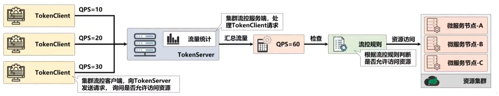

# 第03章_Sentinel

<a href="https://github.com/alibaba/Sentinel/wiki/介绍">官网</a>

服务雪崩效应：因服务提供者的不可用导致服务调用者不可用，从而影响调用链上所有服务的过程。

在服务提供者不可用的时候，会出现大量重试的情况：用户重试、代码逻辑重试，进一步加大请求流量。所以导致雪崩效应的最根本原因是：大量请求线程同步等待造成资源耗尽。

常见的容错机制：

- 超时机制

  通过`restTemplate`或者`Feign`的配置设置超时时间，一但超时就会释放资源。

- 服务限流

  设置服务的单位时间内的最大访问量。

- 隔离

  用户请求不再直接访问服务，而是通过线程池中的空闲线程来访问服务，如果线程池满，则进行降级处理。

- 服务熔断

  指远程服务不稳定或者网络抖动时暂时关闭服务。如果发现在一定时间内访问的失败率达到一定阈值，就停止对该服务的访问，之后的请求直接返回。

Alibaba 开源了 Sentinel 用来治理流量问题，主要以流量为切入点，从流量路由、流量控制、流量整形、熔断降级、系统自适应过载保护、热点流量防护等多个维度来帮助开发者保障微服务的稳定性。Alibaba 同时提供了企业级的 AHAS 高可用服务。

## 1.快速开始

Sentinel 的使用可以分为两个部分:

- 核心库（Java 客户端）：不依赖任何框架/库，能够运行于 Java 8 及以上的版本的运行时环境，同时对 Dubbo / Spring Cloud 等框架也有较好的支持。
- 控制台（Dashboard）：Dashboard 主要负责管理推送规则、监控、管理机器信息等。

### 1.1 引入Sentinel依赖

在`pom.xml`文件中引入核心库依赖即可（Spring Cloud Alibaba 项目不需要声明版本）：

```xml
<dependency>
    <groupId>com.alibaba.csp</groupId>
    <artifactId>sentinel-core</artifactId>
</dependency>
```

### 1.2 通过代码设置流控规则

```java
@RestController
@RequestMapping("/order")
public class OrderController {


    @GetMapping("/add")
    public String add() {
	// 配置资源名称
	try (Entry entry = SphU.entry("add")) {
	    // 业务逻辑
	    return "added";
	} catch (BlockException el) {
	    return "被流控了";
	}
    }

    // 定义规则
    @PostConstruct
    private static void initFlowRules() {
	// 流控规则
	List<FlowRule> rules = new ArrayList<>();
	FlowRule rule = new FlowRule();
	// 设置受保护的资源
	rule.setResource("add");
	// 设置流控规则 QPS
	rule.setGrade(RuleConstant.FLOW_GRADE_QPS);
	// 设置受保护的资源阈值，此处表示 1S 内只能访问 1 次
	rule.setCount(1);
	rules.add(rule);
	FlowRuleManager.loadRules(rules);
    }
}
```

## 2.分离流控代码耦合

参考：https://sentinelguard.io/zh-cn/docs/annotation-support.html

### 2.1 添加aspectj依赖

```xml
<dependency>
    <groupId>com.alibaba.csp</groupId>
    <artifactId>sentinel-annotation-aspectj</artifactId>
</dependency>
```

### 2.2 注册SentinelResourceAspect

```java
@Bean
SentinelResourceAspect sentinelResourceAspect() {
	return new SentinelResourceAspect();
}
```

### 2.3 使用@SentinelResource注解

```java
// 定义规则
@PostConstruct
private static void initFlowRules() {
    // 流控规则
    List<FlowRule> rules = new ArrayList<>();
    FlowRule rule = new FlowRule();
    // 设置受保护的资源
    rule.setResource("user");
    // 设置流控规则 QPS
    rule.setGrade(RuleConstant.FLOW_GRADE_QPS);
    // 设置受保护的资源阈值，此处表示 1S 内只能访问 1 次
    rule.setCount(1);
    rules.add(rule);
    FlowRuleManager.loadRules(rules);
}

@GetMapping("/user")
@SentinelResource(value = "user", blockHandler = "blockHandler")
public String getUser(@RequestParam("id") String id) {
    return "user: " + id;
}

// 必须声明在同一个类，声明在其他类时需要使用 blockHandlerClass，见官方文档
// 返回值要和源方法一致
// 参数必须与原函数一致，最后多一个 BlockException 异常，用来区分是什么规则（流控、降级...）的处理方法
String blockHandler(String id, BlockException ex) {
	ex.printStackTrace();
    return id + "流控";
}
```

### 2.4 处理异常

```java
@GetMapping("/user")
@SentinelResource(value = "user", blockHandler = "blockHandler", fallback = "fallbackHandler")
public String getUser(@RequestParam("id") String id) throws Exception {
	throw new Exception();
}

String fallbackHandler(String id, Throwable e) {
    e.printStackTrace();
    return "exception";
}
```

若 blockHandler 和 fallback 都进行了配置，则被限流降级而抛出`BlockException`时只会进入`blockHandler`处理逻辑。若未配置`blockHandler`、`fallback`和`defaultFallback`，则被限流降级时会将`BlockException`直接抛出。

## 3.降级规则

```java
@GetMapping("/degrade")
@SentinelResource(value = "degrade", entryType = EntryType.IN, blockHandler = "deBlockHandler")
public String degrade() {
	throw new RuntimeException();
}

// 参数必须与原函数一致，最后多一个 BlockException 异常
String deBlockHandler(BlockException ex) {
	return "degrade";
}

// 定义降级规则
@PostConstruct
private void initDegradeRule() {
    List<DegradeRule> degradeRules = new ArrayList<>();
    DegradeRule rule = new DegradeRule();
    rule.setResource("degrade");
    // 设置规则：异常数
    rule.setGrade(RuleConstant.DEGRADE_GRADE_EXCEPTION_COUNT);
    // 触发熔断异常数
    rule.setCount(2);
    // 触发熔断的时间范围，单位 ms，默认 1s
    rule.setStatIntervalMs(60 * 1000);
    // 触发熔断最小请求
    rule.setMinRequestAmount(2);

    // 熔断持续时长，在该时间范围内再次请求转而调用降级方法，单位 s
    // 10 秒过后处于半开状态，恢复接口调用，如果再发生异常，则直接熔断，不会再根据初始设置的条件判断
    rule.setTimeWindow(10);
    degradeRules.add(rule);
    DegradeRuleManager.loadRules(degradeRules);
}
```

> **扩展**
>
> 其他规则：https://sentinelguard.io/zh-cn/docs/basic-api-resource-rule.html

## 4.控制台部署

### 4.1 启动控制台

官网：https://github.com/alibaba/Sentinel/releases

启动：`java -Dserver.port=8080 -Dcsp.sentinel.dashboard.server=localhost:8080 -Dproject.name=sentinel-dashboard -jar sentinel-dashboard.jar`

### 4.2 客户端接入控制台（了解）

如果没有使用 Spring Cloud Alibaba，则需要引入相应的 JAR 包。

- 引入 JAR 包

  ```xml
  <dependency>
      <groupId>com.alibaba.csp</groupId>
      <artifactId>sentinel-transport-simple-http</artifactId>
      <version>x.y.z</version>
  </dependency>
  ```

- 配置启动参数

  启动时加入 JVM 参数`-Dcsp.sentinel.dashboard.server=consoleIp:port`指定控制台地址和端口。若启动多个应用，则需要通过`-Dcsp.sentinel.api.port=xxxx`指定客户端监控 API 的端口（默认是 8719）。

### 4.3 整合SpringCloudAlibaba

- 引入依赖

  ```xml
  <dependency>
      <groupId>com.alibaba.cloud</groupId>
      <artifactId>spring-cloud-starter-alibaba-sentinel</artifactId>
  </dependency>
  ```

- 配置

  可配置在 nacos 中
  
  ```yaml
  spring:
    cloud:
      sentinel:
        transport:
          dashboard: 192.168.11.100:8080
          port: 8720
  ```

## 5.控制台操作

### 5.1 流控

“簇点链路” - 选择相应的服务 - “流控”

#### 1.流控规则

默认会转移到 sentinel 默认的错误界面，要想返回指定的信息需要使用`@SentinelResource(value = "${resourece}", blockHandler = "${blockHandler}")`指定`blockHandler()`。

```java
@RestController
@RequestMapping("/order")
public class OrderController {

    @GetMapping("/add")
    @SentinelResource(value = "add", blockHandler = "blockHandler")
    public String add() {
	return "added";
    }

    String blockHandler(BlockException e) {
	return "limited";
    }

}
```

或者全局异常处理`BlockException`，Alibaba 提供了处理该异常的处理器接口`BlockExceptionHandler`，可以实现该接口注册到容器中（有 bug 不建议，见下文）。

```java
@Component
public class MyBlockExceptionHandler implements BlockExceptionHandler {

    Logger logger = Logger.getLogger(this.getClass().toString());

    @Override
    public void handle(HttpServletRequest request, HttpServletResponse response, BlockException e) throws Exception {
	System.out.println(e.getRule());
	ErrorResponse error = null;

	if (e instanceof FlowException)
	    error = new ErrorResponse(100, "限流了");
	else if (e instanceof DegradeException)
	    error = new ErrorResponse(200, "降级了");
	else if (e instanceof ParamFlowException)
	    error = new ErrorResponse(300, "热点参数限流了");
	else if (e instanceof SystemBlockException)
	    error = new ErrorResponse(301, "系统保护了");
	else if (e instanceof AuthorityException)
	    error = new ErrorResponse(302, "授权不通过");

	response.setStatus(500);
	response.setCharacterEncoding("UTF-8");
	response.setContentType(MediaType.APPLICATION_JSON_VALUE);
	new ObjectMapper().writeValue(response.getWriter(), error);
    }

}
```

更建议使用 SpringMVC 提供的处理异常方法

```java
@RestControllerAdvice
public class CustomizedExceptionHandler {

    @ExceptionHandler
    public ResponseEntity<String> BlockExceptionHandler(BlockException e) throws JsonProcessingException {
        System.out.println(e.getRule());
        ErrorResponse error = null;

        if (e instanceof FlowException)
            error = new ErrorResponse(100, "限流了");
        else if (e instanceof DegradeException)
            error = new ErrorResponse(200, "降级了");
        else if (e instanceof ParamFlowException)
            error = new ErrorResponse(300, "热点参数限流了");
        else if (e instanceof SystemBlockException)
            error = new ErrorResponse(301, "系统保护了");
        else if (e instanceof AuthorityException)
            error = new ErrorResponse(302, "授权不通过");

        return new ResponseEntity<>(new ObjectMapper().writeValueAsString(error), HttpStatus.BAD_REQUEST);
    }

}
```

> **注意**
>
> 线程数指同一时间只运行指定的线程数。QPS 指单位时间内的访问量。

#### 2.流控模式

1. **直接（默认）**

   直接对当前资源流控。

2. **关联**

   设置的入口资源超过流控阈值，对当前资源流控。

3. **链路**

   当当前资源超过阈值后，对设置的入口资源进行流控，入口资源必须调用当前资源。

   ```java
   @RestController
   @RequestMapping("/order")
   public class OrderController {
   
       @Autowired
       OrderService orderService;
   
       @GetMapping("/test1")
       public String test1() {
   	return orderService.handle();
       }
   
       @GetMapping("test2")
       public String test2() {
   	return orderService.handle();
       }
   
   }
   ```

   ```java
   @Service
   public class OrderService {
   
       @SentinelResource("handle")
       public String handle() {
   	    return "handle";
       }
   
   }
   ```

   对 handle 资源设置流控，入口资源为 test1，则当 handle 资源超过阈值时，test1 被流控限制。

   > **注意**
   >
   > 在`2021.0.4.0`版本中默认收起了链路，链路流控无效，需要配置：
   >
   > ```yaml
   > spring:
   >     cloud:
   >        sentinel:
   >          web-context-unity: false
   > ```
   >
   > 同时因为此时使用了`@SentinelResource`，则`BlockExceptionHandler`就会失效，可以通过`@SentinelResource`注解的`blockHandler`属性设置流控处理，或者使用 SpringMVC 的全局异常处理（`@ControllerAdvice` + `@ExceptionHandler`或者`ResponseEntityExceptionHandler`）

#### 3.流控效果

1. **快速失败（默认）**

   超过流控阈值后则请求直接触发流控。

2. **Warm Up**

   针对激增流量，在预热时间内逐渐接受请求直到阈值。冷加载因子 codeFactor 默认是 3，即请求 QPS 从`阈值/3`开始，在**预热时间**内逐渐升至阈值。

   例如如果阈值设置为 10，预热时间为 10s，则表示刚开始只能接受`10/3=3`个请求，其他请求会触发流控，然后 QPS 变为 4，其他的请求触发流控，一直到 QPS 为 10，超出的触发流控为止。

3. **排队等待**

   针对脉冲流量，超过阈值的请求进入队列等待，充分利用脉冲流量的空闲时间段，超过**超时时间**还未处理的请求会触发流控。

### 5.2 熔断降级

对弱依赖服务（次重要的服务）调用进行熔断降级，暂时切断不稳定调用，可以避免不稳定因素导致整体的雪崩，通常在调用端进行配置。

设置方法：“簇点链路” - 选择相应的服务 - “熔断”

#### 1.慢调用比例

- 最大 RT（ms）：服务层请求处理超过该值则为慢调用
- 比例阈值（0～1）：慢调用的比例超过该值则会熔断
- 熔断时长（s）：熔断后降级请求的时间，触发一次熔断后进入半开状态，只要出现慢调用就会触发熔断，不会再判断比例
- 最小请求数：至少有多少请求才会判断是否需要熔断
- 统计时长（ms）：统计请求数的时长

综上，在【统计时长】内请求数大于【最小请求数】，并且慢调用（处理时间超过【最大 RT】）比例大于【比例阈值】，在接下来的【熔断时长】内会自动熔断。

#### 2.异常比例

- 比例阈值（0～1）
- 熔断时长（s）
- 最小请求数
- 统计时长

在【统计时长】内请求数大于【最小请求数】，并且异常发生的比例大于【比例阈值】，在接下来的【熔断时长】内会自动熔断。

#### 3.异常数

- 异常数
- 熔断时长（s）
- 最小请求数
- 统计时长

在【统计时长】内请求数大于【最小请求数】，并且异常数量大于【异常数】，在接下来的【熔断时长】内会自动熔断。

#### 4.整合openfeign进行降级

- 确认依赖

  ```xml
  <dependencies>
      <dependency>
          <groupId>org.springframework.cloud</groupId>
          <artifactId>spring-cloud-starter-openfeign</artifactId>
      </dependency>
      <dependency>
          <groupId>org.springframework.cloud</groupId>
          <artifactId>spring-cloud-starter-loadbalancer</artifactId>
      </dependency>
      <dependency>
          <groupId>com.alibaba.cloud</groupId>
          <artifactId>spring-cloud-starter-alibaba-nacos-discovery</artifactId>
      </dependency>
      <dependency>
          <groupId>com.alibaba.cloud</groupId>
          <artifactId>spring-cloud-starter-alibaba-sentinel</artifactId>
      </dependency>
  </dependencies>
  ```

- 在服务消费端开启 feign 和 sentinel 的整合

  ```yaml
  spring:
    application:
      name: order-service
    cloud:
      nacos:
        server-addr: 192.168.11.100:8848
        discovery:
          username: nacos
          password: nacos
          namespace: public
      sentinel:
        transport:
          dashboard: 192.168.11.100:8080
          port: 8720
  feign:
    sentinel:
      enabled: true
  ```

- 添加降级回调方法，实现`FeignClient`接口，重写请求方法

  ```java
  @Component
  public class StockFeignServiceFallback implements StockFeignService {
      @Override
      public String reduct() {
  	return "降级了";
      }
  }
  ```

- 在`feign`接口上添加`FeignClient`属性，指定回调方法

  ```java
  @FeignClient(name = "stock-service", path = "/stock", fallback = StockFeignServiceFallback.class)
  public interface StockFeignService {
      @GetMapping("/reduct")
      String reduct();
  }
  ```

- 注意添加`FeignConfiguration`

  ```java
  @Configuration
  @LoadBalancerClients({
  	@LoadBalancerClient(value = "stock-service", configuration = CustomLoadBalancerConfiguration.class) })
  @EnableDiscoveryClient
  // 必须指定包名，否则扫描当前配置类的包下
  @EnableFeignClients(basePackages = "com.youyi.zhao.feign")
  public class FeignConfiguration {}
  ```


> **提示**
>
> 测试发现只用在服务消费端引入 sentinel，当发起调用后，服务提供端也会自动加入资源列表。

### 5.3 热点参数流控

针对单个资源，既可以对所有的参数值进行流控，也可以对特定的参数值进行流控。

- 声明资源

  ```java
  @GetMapping("/order/{id}")
  @SentinelResource("getById")
  public String getById(@PathVariable("id") Integer id) {
  	return "success";
  }
  ```

- 在控制台新增热点规则

  配置适用于所有参数值的规则。

  - 参数索引：指定流控的参数是第几个
  - 单机阈值：单位时间内最大访问量

- 编辑热点规则

  打开高级选项，指定参数类型，指定热点的参数值，指定限流阈值。

### 5.4 系统保护规则

针对整个系统，根据系统指标和服务容量，自适应动态调整流量。

有以下几种规则：

- **load 自适应**（仅针对 Linux/Unix like 系统）：系统的 load1 作为触发指标进行自适应系统保护，当 load1 超过设定的触发值，且系统当前的并发线程数超过估算的系统容量时才会触发系统保护；系统容量是由系统的`maxQps * minRt`估算得出；设定参考值一般是`CPU cores * 2.5`
- **CPU usage**：当系统 CPU 使用率（0.0～1.0）超过阈值即触发系统保护
- **平均 RT**：当单台机器上所有入口流量的平均 RT 达到阈值即触发系统保护，单位毫秒
- **并发线程数**：当单台机器上所有入口流量的并发线程数达到阈值即触发系统保护
- **入口 QPS**：当单台机器上所有入口流量的 QPS 达到阈值即触发系统保护

### 5.5 规则持久化

正常情况下如果只在控制台配置规则，当服务资源重启时就会丢失之前设置的规则，可以配合 Nacos 配置中心实现规则持久化。

<a href = "https://github.com/alibaba/Sentinel/wiki/动态规则扩展">参考</a>

- **引入依赖**

  ```xml
  <dependency>
        <groupId>com.alibaba.csp</groupId>
        <artifactId>sentinel-datasource-nacos</artifactId>
  </dependency>
  ```

- 在 nacos 中配置流控规则

  ```json
  [
      {
          // 资源名
          "resource": "/order/add",
          // 流量控制效果
          "controlBehavior": 0,
          // 限流阈值
          "count": 2,
          // 限流阈值类型
          "grade": 1,
          // 流控针对的调用来源，default 则不区分来源
          "limitApp": "default",
          // 调用关系限流策略
          "strategy": 0
      }
  ]
  ```

- 在 nacos 中配置数据源

  ```yaml
  spring:
    cloud:
      sentinel:
        transport:
          dashboard: 192.168.11.100:8080
          port: 8720
        datasource: # 配置流控规则数据源
          flow-rule: # 可以自定义名称
            nacos:
              serverAddr: 192.168.11.100:8848  # nacos 地址
              dataId: order-service-flow
              groupId: SENTINEL_GROUP
              ruleType: flow
              dataType: json
              # namespace:
              # username: nacos
              # password: nacos
  ```

启动服务就可以发现在 nacos 中启用了流控规则。

> **注意**
>
> 经测试，默认情况下只能从 nacos 同步到 sentinel，而sentinel 修改的规则无法同步到 nacos。

### 5.6 持久化改进

#### 1.修改服务端

1. 注释掉`sentinel-dashboard`的`POM`文件中`sentinel-datasource-nacos`的`scope`

   ```xml
   <!-- for Nacos rule publisher sample -->
           <dependency>
               <groupId>com.alibaba.csp</groupId>
               <artifactId>sentinel-datasource-nacos</artifactId>
               <!--<scope>test</scope>-->
           </dependency>
   ```

2. 将`test`包下 Nacos 的所有规则移动到`main`的`rule`下

   nacos 包中的 4 个类：

   - FlowRuleNacosProvider：动态获取 Nacos 配置中心流控规则，读取流控规则
   - FlowRuleNacosPublisher：publish 上传流控规则到 Nacos 配置中心，写入流控规则
   - NacosConfig：Nacos 配置
   - NacosConfigUtils：流控规则在 nacos 中配置文件的一些细节：后缀、组别等

   > **注意**
   >
   > 在获取 nacos 中的流控规则的时候，nacos中流控配置文件，加了后缀，组也给了特定的，我们不用改源码，后面我们在 nacos 中添加配置文件的时候按他给的名字来就行：
   >
   > ```java
   > // 读取
   > String rules = configService.getConfig(appName + NacosConfigUtil.FLOW_DATA_ID_POSTFIX, NacosConfigUtil.GROUP_ID, 3000);
   > // 写入
   > configService.publishConfig(app + NacosConfigUtil.FLOW_DATA_ID_POSTFIX, NacosConfigUtil.GROUP_ID, converter.convert(rules));
   > ```

3. 配置 Nacos 连接地址

   默认声明了`localhost`，将其改为动态从 JVM 环境变量中获取：

   ```java
   @Bean
   public ConfigService nacosConfigService() throws Exception {
       Properties properties = new Properties();
       properties.put(PropertyKeyConst.SERVER_ADDR, System.getProperty(PropertyKeyConst.SERVER_ADDR));
       properties.put(PropertyKeyConst.NAMESPACE, System.getProperty(PropertyKeyConst.NAMESPACE));
       // 配置了 nacos 无认证的话不需要用户名和密码
       // properties.put(PropertyKeyConst.USERNAME, System.getProperty(PropertyKeyConst.USERNAME));
       // properties.put(PropertyKeyConst.PASSWORD, System.getProperty(PropertyKeyConst.PASSWORD));
       return ConfigFactory.createConfigService(properties);
   }
   ```

4. 配置中添加 nacos 接口并修改地址

   1. 修改`Controller`使其调用 Nacos 的规则

      ```java
      @Autowired
      @Qualifier("flowRuleNacosProvider")
      private DynamicRuleProvider<List<FlowRuleEntity>> ruleProvider;
      @Autowired
      @Qualifier("flowRuleNacosPublisher")
      private DynamicRulePublisher<List<FlowRuleEntity>> rulePublisher;
      ```

   2. 修改`src/main/webapp/resources/app/scripts/controllers/identity.js`

      - 第 4 行为`FlowServiceV2`
      - 第 98 行为`let url = '/dashboard/v2/flow/' + $scope.app;`

5. 修改页面中的路由地址

   - 修改`src/main/webapp/resources/app/scripts/directives/sidebar/sidebar.html`
     - 直接搜`dashboard.flowV1`定位 57 行去掉 V1

6. 注释掉"回到单机"按钮

   修改`src/main/webapp/resources/app/views/flow_v2.html`，注释掉`回到单机页面`的`a`标签

启动服务端时需要执行：`java -jar -DserverAddr=192.168.11.100:8848 -Dnamespace="ecfde7c9-59b3-4372-a3ca-bc50de309447" sentinel-dashboard.jar `，注意 `namespace`需要哈希值，`public`默认没有该值，因此需要自己新建一个命名空间，否则就在 code 中指定为 null。

#### 2.修改客户端

引入`sentinel-datasource-nacos`包后，在服务的配置文件中修改`dataId`（以`-flow-rules`结尾）和`groupId`（`SENTINEL_GROUP`）

> **提示**
>
> 其他规则如`DegradeController2`可以仿照`FlowControllerV1`和`FlowControllerV2`的区别来写。

## 6.集群

<a href = "https://github.com/alibaba/Sentinel/wiki/集群流控">参考</a>

对于集群微服务流控，往往我们希望可以为整个集群的每秒处理请求数进行设置，而不管有多少个微服务节点。此时就需要有一个专门的实例（TokenServer）对每个服务实例节点进行数据统计。

> **注意**
>
> 使用网关的话不需要使用集群流控。



Sentinel 1.4.0 开始引入了集群流控模块，引入`spring-cloud-starter-alibaba-sentinel`后会自动引入以下几部分：

- `sentinel-cluster-common-default`：公共模块，包含公共接口和实体
- `sentinel-cluster-client-default`：默认集群流控 client 模块，使用 Netty 进行通信，提供接口方便序列化协议扩展
- `sentinel-cluster-server-default`：默认集群流控 server 模块，使用 Netty 进行通信，提供接口方便序列化协议扩展；同时提供扩展接口对接规则判断的具体实现（TokenService），默认实现是复用`sentinel-core`的相关逻辑

**流程**

- 创建一个`token-server`的子模块，主要用于统计计数，底层是 Netty

  - 添加依赖

    ```xml
    <project xmlns="http://maven.apache.org/POM/4.0.0" xmlns:xsi="http://www.w3.org/2001/XMLSchema-instance" xsi:schemaLocation="http://maven.apache.org/POM/4.0.0 https://maven.apache.org/xsd/maven-4.0.0.xsd">
      <modelVersion>4.0.0</modelVersion>
      <artifactId>token-server</artifactId>
      <name>token-server</name>
      <description>token server</description>
      <groupId>com.youyi.zhao</groupId>
      <version>0.0.1-SNAPSHOT</version>
      <dependencies>
    	<dependency>
    		<groupId>org.springframework.boot</groupId>
    		<artifactId>spring-boot-starter-web</artifactId>
    		<version>2.6.11</version>
    	</dependency>
    	<dependency>
    		<groupId>com.alibaba.cloud</groupId>
    		<artifactId>spring-cloud-starter-alibaba-sentinel</artifactId>
    		<version>2021.0.4.0</version>
    	</dependency>
      </dependencies>
    </project>
    ```

  - 启动类

    ```java
    public class TokenServerApplication {
    
        static {
    	// 控制台地址
    	System.setProperty("csp.sentinel.dashboard.server", "192.168.11.100:8080");
    	// sentinel 地址
    	System.setProperty("csp.sentinel.api.port", "8720");
    	// 服务名称
    	System.setProperty("project.name", "token-server");
    	// 使用 pid（可选）
    	System.setProperty("csp.sentinel.log.use.pid", "true");
        }
    
        public static void main(String[] args) throws Exception {
            ClusterTokenServer tokenServer = new SentinelDefaultTokenServer();
            ClusterServerConfigManager
                .loadGlobalTransportConfig(new ServerTransportConfig().setIdleSeconds(600).setPort(10217));
            tokenServer.start();
        }
    
    }
    ```

  - 在服务资源的“集群流控”中添加`Token Server`

    指定外部机器`Token server`的 IP 及 端口`10217`，选择所有的 client（负载服务节点）。

  - 在服务资源的流控中选择集群模式
