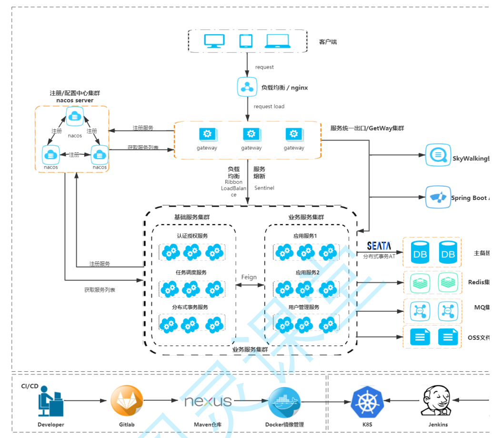

# 第05章_Spring Cloud Gateway

所谓的 API 网关，就是指系统的统一入口，它封装了应用程序的内部结构，为客户端提供统一服务，一些与业务本身功能无关的公共逻辑可以在这里实现，诸如认证、鉴权、监控、路由转发等等。



## 1.简介

Spring Cloud Gateway 是 Spring Cloud 官方推出的响应式的 API 网关，定位于取代 Netflix Zuul1.0。相比 Zuul 来说，Spring Cloud Gateway 提供更优秀的性能，更强大的有功能。它不能在传统的 servlet 容器中工作，也不能构建成 war 包。Spring Cloud Gateway 旨在为微服务架构提供一种简单且有效的 API 路由的管理方式，并基于 Filter 的方式提供网关的基本功能，例如安全认证、监控、限流等等。

### 1.1 Spring Cloud Gateway 功能特征

- 基于Spring Framework 5, Project Reactor 和 Spring Boot 2.0 进行构建
- 动态路由：能够匹配任何请求属性
- 支持路径重写
- 集成 Spring Cloud 服务发现功能（Nacos、Eruka）
- 可集成流控降级功能（Sentinel、Hystrix）
- 可以对路由指定易于编写的 Predicate（断言）和 Filter（过滤器）

### 1.2 核心概念

- 路由（route) 

  路由是网关中最基础的部分，路由信息包括一个ID、一个目的URI、一组断言工厂、一组Filter组成。如果断言为真，则说明请求的URL和 配置的路由匹配。

- 断言(predicates) 

  Java8 中的断言函数，SpringCloud Gateway 中的断言函数类型是 Spring5.0 框架中的 ServerWebExchange。断言函数允许开发者去定义匹配 Http request 中的任何信息，比如请求头和参数等。

- 过滤器（Filter) 

  SpringCloud Gateway 中的 filter 分为 Gateway FilIer 和 Global Filter。Filter 可以对请求和响应进行处理。

### 1.3 工作原理


## 2.快速开始

新建项目

1. **引入依赖**

   ```xml
   <?xml version="1.0" encoding="UTF-8"?>
   <project xmlns="http://maven.apache.org/POM/4.0.0" xmlns:xsi="http://www.w3.org/2001/XMLSchema-instance"
            xsi:schemaLocation="http://maven.apache.org/POM/4.0.0 https://maven.apache.org/xsd/maven-4.0.0.xsd">
       <modelVersion>4.0.0</modelVersion>
       
       <parent>
           <groupId>com.youyi.zhao</groupId>
           <artifactId>springcloudalibaba</artifactId>
           <version>0.0.1-SNAPSHOT</version>
       </parent>
       
       <groupId>com.example</groupId>
       <artifactId>gate-way</artifactId>
       <version>0.0.1-SNAPSHOT</version>
       <name>gate-way</name>
       <description>gate-way</description>
       
       <dependencies>
           <dependency>
               <groupId>org.springframework.cloud</groupId>
               <artifactId>spring-cloud-starter-gateway</artifactId>
           </dependency>
       </dependencies>
       
   </project>
   ```

   > **注意**
   >
   > `gateway`依赖会和`spring-webmvc`的依赖冲突，需要在父 POM 中将`spring-boot-starter-web`放入`dependencyManagement`中；或者在配置文件中添加`spring.main.web-application-type=reactive`。

2. **配置文件**

   ```yaml
   server:
   	port: 8080
   spring:
       main:
       	web-application-type: reactive
       application:
   		name: api‐gateway
       cloud:
           gateway:
               routes: # 路由数组（路由就是指定当请求满足什么条件的时候转到哪个微服务）
                 ‐ id: order_route # 当前路由的标识，要求唯一
                   uri: http://localhost:8081 # 请求要转发到的地址
                   order: 1 # 路由的优先级,数字越小级别越高
                   predicates: # 断言(就是路由转发要满足的条件)
                     ‐ Path=/order-serv/** # 当请求路径满足 Path 指定的规则时才进行路由转发
                   filters: # 过滤器，请求在传递过程中可以通过过滤器对其进行一定的修改
                     ‐ StripPrefix=1 # 转发之前去掉 1 层路径
   ```

3. **测试**

   当访问`http://localhost:8080/order-serv/order/add`时会路由到`http://localhost:8081/order/add`。

## 3.集成Nacos

1. **引入依赖**

   ```xml
   <dependencies>
       <dependency>
           <groupId>org.springframework.cloud</groupId>
           <artifactId>spring-cloud-starter-gateway</artifactId>
       </dependency>
       <dependency>
           <groupId>com.alibaba.cloud</groupId>
           <artifactId>spring-cloud-starter-alibaba-nacos-discovery</artifactId>
       </dependency>
       <!-- 配合 lb 使用  -->
       <dependency>
           <groupId>org.springframework.cloud</groupId>
           <artifactId>spring-cloud-starter-loadbalancer</artifactId>
       </dependency>
   </dependencies>
   ```

2. **编写 yml 配置文件**

   ```yaml
   server:
     port: 8080
   
   spring:
     main:
       web-application-type: reactive
     application:
       name: api‐gateway
     cloud:
       gateway:
         routes:
           - id: order_route
             uri: lb://order-server # lb 表示从 nacos 中寻找服务，遵循负载均衡策略
             predicates:
               - Path=/order-serv/**
             filters:
               - StripPrefix=1
       nacos:
         discovery:
           server‐addr: 192.168.11.100:8848
           username: nacos
           password: nacos
   ```

   访问`http://localhost:8080/order-serv/order/add`时会路由到`http://localhost:8081/order/add`。

   **简写方式（不建议）**

   ```yml
   server:
     port: 8080
   
   spring:
     main:
       web-application-type: reactive
     application:
       name: api‐gateway
     cloud:
       gateway:
         discovery:
           locator:
             enabled: true # 启动自动识别 Nacos 服务，根据服务名路由
       nacos:
         discovery:
           server‐addr: 192.168.11.100:8848
           username: nacos
           password: nacos
   ```

   访问`http://localhost:8080/order-server/order/add`时会路由到`http://localhost:8081/order/add`。

   