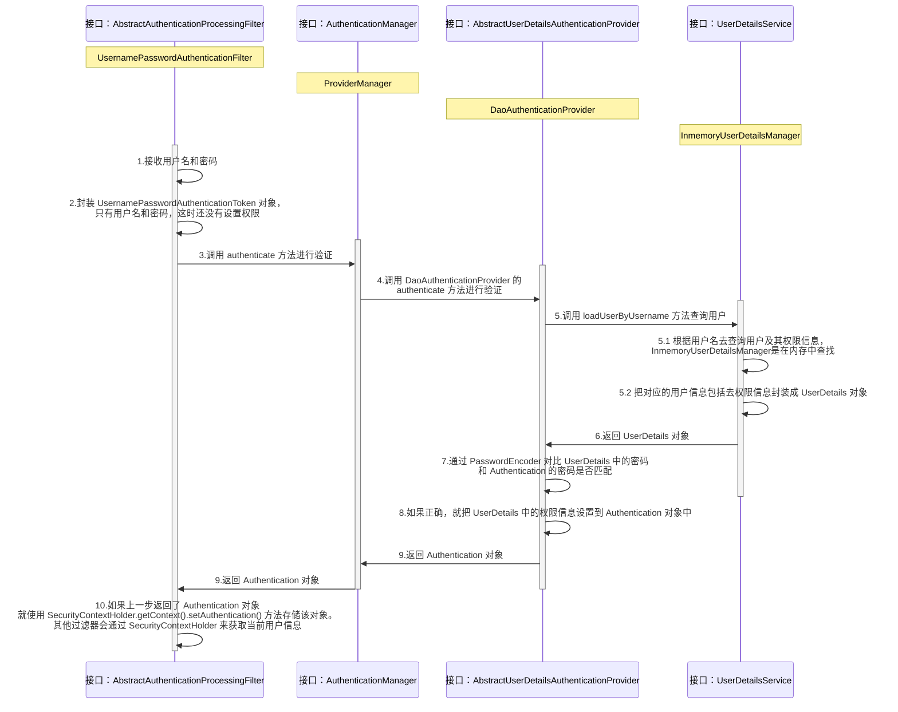
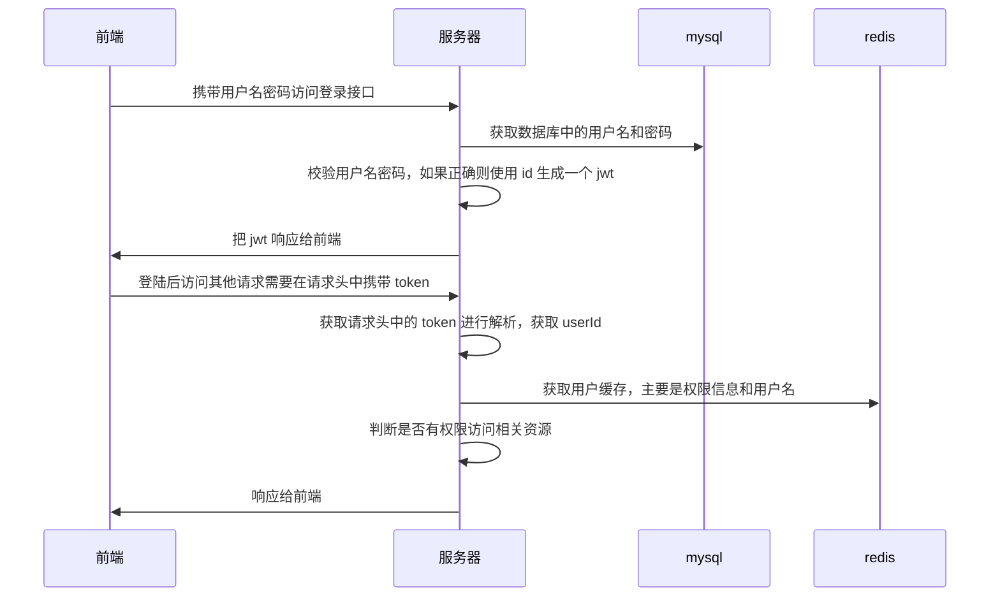
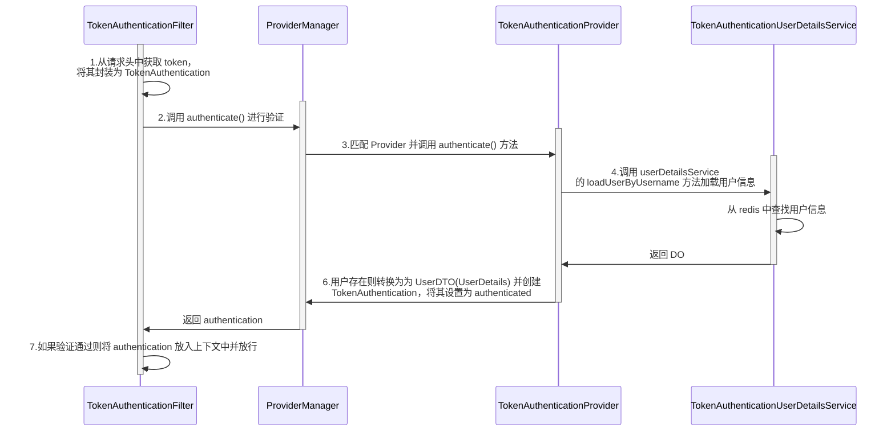

#  Spring Security

## 1.简介与原理

### 1.1 简介

[官网](https://docs.spring.io/spring-security/reference/servlet/index.html)

Spring Security 是一个基于 Spring 的安全框架，其他类似的框架有 sa-token、shiro 等。它提供了一套 Web 应用安全性的完整解决方案。一般来说，Web 应用的安全性包括**身份认证**（Authentication）和**用户授权**（Authorization）两个部分。

身份认证指的是验证某个用户是否为系统中的合法主体，也就是说用户能否访问该系统。用户认证一般要求用户提供用户名和密码，系统通过校验用户名和密码来完成认证过程。

用户授权指的是验证某个用户是否有权限执行某个操作。在一个系统中，不同用户所具有的权限是不同的。一般来说，系统会为不同的用户分配不同的角色，而每个角色则对应一系列的权限。

### 1.2 原理

#### 1.核心组件

Spring Security 核心组件有 `Authentication`（认证/身份验证）、`AuthenticationProvider`（认证提供者）、`AuthenticationManager`（认证管理者）等。

**（1）Authentication**

`Authentication` 接口用来表示凭证或者令牌，可以理解为用户的用户名、密码、权限等信息。源码如下：

```java
public interface Authentication extends Principal, Serializable {

	/**
	 * 用户的权限信息集合
	 * 可以用 AuthorityUtils.commaSeparatedSringToAuthorityList("admin, ROLE_ADMIN") 进行初始化
	 */
	Collection<? extends GrantedAuthority> getAuthorities();

	/**
	 * 用户名和密码认证时可以理解为密码
	 */
	Object getCredentials();

	/**
	 * 认证时的一些详细信息，可以是一个包含用户信息的 POJO 实例
	 */
	Object getDetails();

	/**
	 * 用户名和密码认证时可以理解为用户名
	 */
	Object getPrincipal();

	/**
	 * 是否认证通过
	 */
	boolean isAuthenticated();

	/**
	 * 设置是否认证通过
	 */
	void setAuthenticated(boolean isAuthenticated) throws IllegalArgumentException;

}
```

`Authentication` 认证接口的默认实现类：

- `UsernamePasswordAuthenticationToken`

  用于在用户名和密码认证场景中作为验证的凭证，该凭证包含用户名+密码信息。

- `RememberMeAuthenticationToken`

  用于“记住我”的身份认证场景。通常是通过服务端发送一个 Cookie 给客户端浏览器，下次浏览器在访问服务端时，服务端自动检测该 Cookie 根据值触发凭证认证操作。

- `AnonymousAuthenticationToken`

  对于匿名访问的用户，Spring Security 支持为其建立一个 `AnonymousAuthenticationToken` 匿名凭证实例存放在 `SecurityContextHolder` 中。

**（2）AuthenticationProvider**

`AuthenticationProvider` 是一个接口，包含两个函数 `authenticate()` 和 `supports`，用于完成对凭证进行身份认证操作。

```java
public interface AuthenticationProvider {

	/**
	 * 对实参 authentication 进行身份认证操作
	 * 如果认证成功就返回一个凭证，失败则抛出异常
	 */
	Authentication authenticate(Authentication authentication) throws AuthenticationException;

	/**
	 * 判断是否支持该 authentication
	 */
	boolean supports(Class<?> authentication);

}
```

`AuthenticationProvider` 接口的默认实现类：

- `AbstractUserDetailsAuthenticationProvider`

  对 `UsernamePasswordAuthentication` Token 类型的凭证/令牌进行验证的认证提供者类。

- `RememberMeAuthenticationProvider`

  对 `RememberMeAuthenticationToken` Token 类型的凭证/令牌进行验证的认证提供者类。

- `AnonymousAuthenticationProvier`

  对 `AnonymousAuthenticationToken` Token 类型的凭证/令牌进行验证的认证提供者类。

**（3）AuthenticationManager**

`AuthenticationManger` 是一个接口，其唯一的 `authenticate()` 验证方法是认证流程的入口，接收一个 `Authentication` 令牌对象作为参数。

```java
public interface AuthenticationManager {

	/**
	 * 认证流程的入口
	 */
	Authentication authenticate(Authentication authentication) throws AuthenticationException;

}
```

`AuthenticationManger` 的一个实现类名为 `ProviderManager`，该类有一个 `providers` 成员变量，负责管理一个提供者清单列表。

```java
public class ProviderManager implements AuthenticationManager, MessageSourceAware, InitializingBean {

    // 提供者清单
	private List<AuthenticationProvider> providers = Collections.emptyList();
    
    @Override
	public Authentication authenticate(Authentication authentication) throws AuthenticationException {
        // 迭代提供者清单，找出支持令牌的提供者，交给提供者去执行令牌验证
    	...
    }
}
```

#### 2.过滤器

Spring Security 对请求的处理是通过一系列**过滤器**完成的，全部存储在 `DelegatingFilterProxy` 的 `FilterChainProxy` 中。


`DefaultSecurityFilterChain` 是 `SecurityFilterChain` 的实现类，内部维护了一个过滤器的 `ArrayList`，其中重点的有三个过滤器：

- `UsernamePasswordAuthenticationFiler`：负责处理登陆页面填写了用户名和密码后的登录请求，校验表单中的用户名和密码
- `ExceptionTranslationFiler`：是一个异常过滤器，用来处理在认证授权过程中抛出的异常 `AccessDeniedException` 和 `AuthenticationException`
- `AuthorizationFilter`：是一个权限过滤器，用来进行权限验证，基本位于过滤链的最底部，它会从 `SecurityContextHolder` 获取其中的 `Authentication`，然后获取其中的权限信息

### 1.3 自定义认证组件

**（1）自定义 Authentication**

```java
public class DemoToken extends AbstractAuthenticationToken {
    private String userName;
    private String password;
    
    public DemoToken(Collection<? extends GrantedAuthority> authorities) {
        super(authorities);
    }

    @Override
    public Object getCredentials() {
        return password;
    }

    @Override
    public Object getPrincipal() {
        return userName;
    }
}
```

**（2）自定义 AuthenticationProvider**

添加到容器中后，会被 `InitializeAuthenticationProviderBeanManagerConfigurer` 添加到 `AuthenticationManager` 中。

```java
@Component
public class DemoAuthProvider implements AuthenticationProvider {

    @Override
    public Authentication authenticate(Authentication authentication) throws AuthenticationException {
        DemoToken token = (DemoToken) authentication;
        // hardcode 密码
        if (!token.getPrincipal().equals("zhao") || !token.getCredentials().equals("123456")) {
            throw new BadCredentialsException("用户名或密码错误");
        } else {
            token.setAuthenticated(true);
        }
        return token;
    }

    @Override
    public boolean supports(Class<?> authentication) {
        return authentication.isAssignableFrom(DemoToken.class);
    }
}
```

> **注意**
>
> 当添加了自定义的 Privoder 后就不会执行 `InitializeUserDetailsManagerConfigurer` 的 `configure()` 方法，`DaoAuthenticationProvider` 和 `InMemoryUserDetailsManager` 也就不会被加载。

**（3）自定义过滤器**

从请求中获取用户信息并组装成自定义的凭证，然后交给 `AuthenticationManager`。

```java
public class DemoAuthFilter extends OncePerRequestFilter {

    private final AuthenticationManager authenticationManager;

    // 注入 AuthenticationManager
    public DemoAuthFilter(AuthenticationManager authenticationManager) {
        this.authenticationManager = authenticationManager;
    }

    @Override
    protected void doFilterInternal(HttpServletRequest request, HttpServletResponse response, FilterChain filterChain) throws ServletException, IOException {
        String demoToken = request.getHeader("demoToken");
        if (demoToken == null) {
            filterChain.doFilter(request, response);
            return;
        }
        String[] split = demoToken.split(",");
        // 前端发过来的请求此时不用考虑权限
        DemoToken token = new DemoToken(Collections.emptyList());
        token.setUserName(split[0]);
        token.setPassword(split[1]);
        try {
            // 调用 authenticationManager 来验证 token
            Authentication authenticate = authenticationManager.authenticate(token);
            if (authenticate != null && authenticate.isAuthenticated()) {
                SecurityContextHolder.getContext().setAuthentication(authenticate);
            }
            filterChain.doFilter(request, response);
        } catch (AuthenticationException e) {
            SecurityContextHolder.clearContext();
            response.setContentType("application/json;charset=UTF-8");
            response.getWriter().write("""
                {
                    "error": "%s"
                }
                """.formatted(e.getLocalizedMessage()));
        }
    }
}
```

**（4）配置**

```java
@Configuration
public class DemoAuthConfig {

    @Bean
    public SecurityFilterChain securityFilterChain(HttpSecurity http, AuthenticationConfiguration configuration) throws Exception {
        // 将 DemoAuthFilter 加入过滤器链中
        DemoAuthFilter demoAuthFilter = new DemoAuthFilter(configuration.getAuthenticationManager());
        http.addFilterBefore(demoAuthFilter, UsernamePasswordAuthenticationFilter.class);
        http.authorizeHttpRequests(request -> request.anyRequest().authenticated());
        http.exceptionHandling(exception -> exception
                .authenticationEntryPoint((request, response, authException) -> {
            response.setContentType("application/json;charset=UTF-8");
            response.getWriter().write("""
                    {
                        "error": "尚未认证"
                    }
                    """);
                })
        );
        // 关闭 CSRF
        http.csrf(AbstractHttpConfigurer::disable);
        // 不使用 session 来创建和管理 securityContext
        http.sessionManagement(session -> session.sessionCreationPolicy(SessionCreationPolicy.STATELESS));
        return http.build();
    }

}
```

## 2.用户名密码认证流程

使用默认登录页面时密码会在项目启动后打印在控制台，如果想自定义用户名和密码，可以配置如下：

```properties
spring.security.user.name=user
spring.security.user.password=password
```

该属性定义在 `SecurityProperties` 类中。

### 2.1 快速入门-thymeleaf

- **导入依赖**

  ```xml
  <dependencies>
      <dependency>
          <groupId>org.springframework.boot</groupId>
          <artifactId>spring-boot-starter-thymeleaf</artifactId>
      </dependency>
      <dependency>
          <groupId>org.springframework.boot</groupId>
          <artifactId>spring-boot-starter-security</artifactId>
      </dependency>
      <dependency>
          <groupId>org.springframework.boot</groupId>
          <artifactId>spring-boot-starter-web</artifactId>
      </dependency>
  </dependencies>
  ```

- **Controller**

  ```java
  // login 的控制器
  @Controller
  public class LoginController {
  
      @GetMapping("/login")
      public String login() {
          return "login";
      }
  }
  
  // 主页面的控制器
  @Controller
  public class IndexController {
  
      @GetMapping("/index")
      public String index() {
          return "index";
      }
  }
  ```

- **配置类**

  ```java
  @Configuration
  public class SecurityConfig {
      @Bean
      public SecurityFilterChain securityFilterChain(HttpSecurity http) throws Exception {
          // 对 http 请求进行授权配置
          http.authorizeHttpRequests((authorizeHttpRequests) ->
                  authorizeHttpRequests
                          // 使用默认 login 页面可以不需要指定
                          .requestMatchers("/login").permitAll()
                          // 其他所有请求需要授权
                          .anyRequest().authenticated()
          );
          // 开启基于表单的身份验证，默认关闭
          // 会添加以下三个过滤器：
          // UsernamePasswordAuthenticationFilter
          // DefaultLoginPageGeneratingFilter
          // DefaultLogoutPageGeneratingFilter
          http.formLogin(formLogin ->
                  formLogin
                          // 指定登录的页面
                          // 指定后 loginPage 和 logoutPage 的 Filter 就不会被加载
                          .loginPage("/login")
                          // 指定 form 表单提交的 url，即 action 要指定的值
                          .loginProcessingUrl("/login")
                          // 登录之后跳转的页面
                          .defaultSuccessUrl("/index")
                          // 修改用户名和密码的参数名
                          // .usernameParameter("username")
                          // .passwordParameter("password")
                          // 修改登录失败跳转的 url
                          // .failureUrl("/logi?error")
          );
          // 禁用 CSRF 保护
          http.csrf(AbstractHttpConfigurer::disable);
          // 开启跨域
          http.cors(AbstractHttpConfigurer::disable);
          // 退出时使 session 失效，使用 EnableWebSecurity 时会自动应用此值。默认设置 true，访问 “/logout” 将使用户注销，方法是使 HTTP 会话失效，清理已配置的任何身份验证，清除 SecurityContextHolder，然后重定向到 “/login?success”
          // http.logout(logout -> logout.invalidateHttpSession(true));
          return http.build();
      }
  }
  ```

  > **注意**
  >
  > - 配置 `loginPage` 后默认的登录页面实效，未登录时会自动跳转到该页面，此时如果找不到登录页面则会跳转到错误页面，如果错误页面依然没有权限则会又跳转到登录页面，多次重定向后会显示错误：定义 `.requestMatchers("/error").permitAll()` 就会正确跳转了；更正确的做法是捕获  `NoHandlerFoundException`
  >
  > - 当我们只配置 `loginPage` 而不配置 `loginProcessingUrl` 的话，`loginProcessingUrl` 默认就是 `loginPage`
  > - 如果只配置 `loginProcessUrl` 的话，就会用不了自定义的登陆页面，spring security 会使用自带的默认登陆页面
  >
  > 所以尽量 `loginPage` 和 `loginProcessingUrl` 参数成对出现。

- **前端 thmeleaf**

  ```html
  <!-- 登录页面 -->
  <!DOCTYPE html>
  <html lang="en" xmlns:th="https://www.thymeleaf.org">
  <head>
  	<meta charset="UTF-8">
  	<title>登录页面</title>
  </head>
  <body>
  <h1 style="background-color: blanchedalmond">欢迎登陆</h1>
  <!-- 登录为 POST 请求 -->
  <!-- 使用动态 url 会自动添加隐藏字段 csrf 以及添加项目上下文地址 -->
  <form method="post" th:action="@{/login}">
  	用户名: <input name="username" type="text"><br>
  	密码: <input name="password" type="password"><br>
  	<input type="submit" value="提交">
  </form>
  </body>
  </html>
  ```
  
  ```html
  <!-- 主页面 -->
  <!DOCTYPE html>
  <html lang="en" xmlns:th="https://www.thymeleaf.org">
  <head>
  	<meta charset="UTF-8">
  	<title>系统首页</title>
  </head>
  <body>
  <h1 style="background-color: #ff3bce">系统首页</h1>
  <!-- 退出为 POST 请求 -->
  <form method="post" th:action="@{/logout}">
  	<input type="submit" value="退出">
  </form>
  </body>
  </html>
  ```

在访问 index 页面时会自动路由到 login 主页，完成登录后跳转到 index 页面，退出后跳转到 login 页面。

### 2.2 认证过程原理

Spring Security 为这种场景内置了一套解决方案，主要涉及几个内置类：

- `UsernamePasswordAuthenticationToken`

  此认证实现了 `Authentication` 接口，主要封装用户输入的用户名和密码信息。

- `AbstractUserDetailsAuthenticationProvider`

  一个抽象类，具体验证逻辑需要子类实现。此认证提供者类与 `UsernamePasswordAuthenticationToken` 凭证配套。

  常用子类为 `DaoAuthenticationProvider` 类，该类依赖一个 `UserDetailsService` 用户服务数据源，用于获取 `UserDetails` 用户信息，其中包括用户名、密码所拥有的权限等。

- `UserDetailsService`

  加载用户特定数据的核心接口，里面定义了一个根据用户名查询用户信息的方法：

  ```java
  public interface UserDetailsService {
  	/**
  	 * 根据用户名定位用户
  	 */
  	UserDetails loadUserByUsername(String username) throws UsernameNotFoundException;
  }
  ```

  常用的实现类：

  - `InMemoryUserDetailsManager`

    实现了 `UserDetailsService`  接口，运行时会将登录信息保存在内存中，项目启动时由 `UserDetailsServiceAutoConfiguration` 自动导入 `InMemoryUserDetailsManager`。

    > **注意**
    >
    > 只有在容器中没有 `AuthenticationManager`，`AuthenticationProvider`，`UserDetailsService` 的 Bean 时才会创建。

  - `JdbcUserDeDetailsManager`

    实现了 `UserDetailsService`  接口，用于数据库存储登录信息，需要传入 `DataSource` 并注册为 Bean。

- `UserDetails`

  主要封装用户名、密码、是否过期、是否可用等信息。

  > **注意**
  >
  > `UserDetails` 接口的密码属性和 `UsernamePasswordAuthenticationToken` 的区别在于：前者的密码来自数据源，是密文；后者的密码来自用户请求，是明文。明文和密文的匹配工作由 `PasswordEncoder` 加密器完成。

- `PasswordEncoder`

  `PasswordEncoder` 的内置实现类有多个，如 `BCryptPasswordEncoder`、`Pbkdf2PasswordEncoder` 等。

- `UsernamePasswordAuthenticationFilter`

  在自定义 `SecurityFilterChain` 时如果执行了 `HttpSecurity` 的 `formLogin()` 方法，则会在创建 `FormLoginConfigurer` 的构造器中创建一个 `UsernamePasswordAuthenticationFilter`，用于处理身份验证表单提交，在其中定义了表单中用户名和密码的 key。



## 3.授权

授权由 `AuthenticationFilter` 来负责处理。

### 3.1 角色

可以分别通过**角色**和**权限**来进行控制，例如使用**角色**来控制显示的菜单，使用**权限**来控制调用的接口。

**案例**

`/admin/api`：需要 admin 角色

`/user/api`：需要 admin 或 user 角色

`/app/api`：不需要角色即可访问

```java
@Configuration
public class SecurityConfig {

    // 注册一个 InMemoryUserDetailsManager 声明角色
    @Bean
    public InMemoryUserDetailsManager inMemoryUserDetailsManager() {
        UserDetails user1 = User.withUsername("admin").password(passwordEncoder().encode("123456")).roles("admin", "user").build();
        UserDetails user2 = User.withUsername("user").password(passwordEncoder().encode("123456")).roles("user").build();
        return new InMemoryUserDetailsManager(user1, user2);
    }

    // 注册一个密码加密器
    @Bean
    public PasswordEncoder passwordEncoder() {
        return new BCryptPasswordEncoder();
    }

    @Bean
    public SecurityFilterChain securityFilterChain(HttpSecurity http) throws Exception {
        http.authorizeHttpRequests((authorizeHttpRequests) ->
                authorizeHttpRequests
                        // 对端口进行角色控制
                        .requestMatchers("/admin/api").hasRole("admin")
                        .requestMatchers("/user/api").hasAnyRole("admin", "user")
                        .anyRequest().authenticated()
        );
        // 使用默认的表单登录设置
        http.formLogin(Customizer.withDefaults());
        http.csrf(AbstractHttpConfigurer::disable);
        http.cors(AbstractHttpConfigurer::disable);
        return http.build();
    }
}
```

定义三个接口

```java
@RestController
public class IndexController {

    @GetMapping("/admin/api")
    public String admin() {
        return "admin";
    }

    @GetMapping("/user/api")
    public String user() {
        return "user";
    }

    @GetMapping("app/api")
    public String app() {
        return "app";
    }
}
```

使用 admin 账号可以访问所有端点，使用 user 不能访问 `/admin/api` 端点。

> **注意**
>
> 角色判断实际上就是权限判断，只不过加了个前缀 `ROLE_`，在 `build UserDetails` 时如果不主动加则系统会默认加：
>
> ```java
> public UserBuilder roles(String... roles) {
>     List<GrantedAuthority> authorities = new ArrayList<>(roles.length);
>     for (String role : roles) {
>         Assert.isTrue(!role.startsWith("ROLE_"),
>                 () -> role + " cannot start with ROLE_ (it is automatically added)");
>         authorities.add(new SimpleGrantedAuthority("ROLE_" + role));
>     }
>     return authorities(authorities);
> }
> ```
>
> 因此在使用数据管理角色时注意添加该前缀，其实只需要使用权限即可。

### 3.2 权限

`/admin/api`：需要 admin:api 权限

`/user/api`：需要 admin:api 或者 user:api 权限

`/app/api`：不需要权限即可访问

```java
@Configuration
public class SecurityConfig {

    @Bean
    public InMemoryUserDetailsManager inMemoryUserDetailsManager() {
        UserDetails user1 = User.withUsername("admin").password(passwordEncoder().encode("123456")).authorities("admin:api", "user:api").build();
        UserDetails user2 = User.withUsername("user").password(passwordEncoder().encode("123456")).authorities("user:api").build();
        return new InMemoryUserDetailsManager(user1, user2);
    }

    @Bean
    public PasswordEncoder passwordEncoder() {
        return new BCryptPasswordEncoder();
    }

    @Bean
    public SecurityFilterChain securityFilterChain(HttpSecurity http) throws Exception {
        http.authorizeHttpRequests((authorizeHttpRequests) ->
                authorizeHttpRequests
                        // 对端口进行权限控制
                        .requestMatchers("/admin/api").hasAuthority("admin:api")
                        .requestMatchers("/user/api").hasAnyAuthority("admin:api", "user:api")
                        .requestMatchers("/app/api").permitAll()
                        .anyRequest().authenticated()
        );
        http.formLogin(Customizer.withDefaults());
        http.csrf(AbstractHttpConfigurer::disable);
        http.cors(AbstractHttpConfigurer::disable);
        return http.build();
    }
}
```

### 3.3 权限控制

#### 1.ANT表达式

`requestMatchers()` 可以传入一个 ANT 模式的 URL 匹配器，规则如下：

| 模式 | 说明                    |
| ---- | ----------------------- |
| `?`  | 匹配任意单个字符        |
| `*`  | 匹配 0 到任意数量的字符 |
| `**` | 匹配 0 到任意个目录     |

#### 2.使用注解配合SpEL表达式

- `@Secured`

  用户具有某个角色才可以访问。

  （1）开启注解

  ```java
  @Configuration
  @EnableMethodSecurity
  public class SecurityConfig {
  ```

  （2）在 `controller` 方法上使用注解，设置角色

  ```java
  @GetMapping("/update")
  @Secured({"ROLE_admin","ROLE_user"})
  public String update() {
      return "update";
  }
  ```

  （3）实际用户在数据库中需要拥有 `ROLE_admin` 或者 `ROLE_user` 的权限。

- `@PreAuthorize`

  进入方法前的权限验证，可以使用 SpEL 表达式。

  （1）开启注解功能

  ```java
  @SpringBootApplication
  @EnableMethodSecurity
  public class SecurityConfig {
  ```

  （2）在 controller 方法上使用注解

  ```java
  // hasRole 和 hasAnyRole 会自动添加 ROLE_ 前缀
  // @PreAuthorize("hasRole('admin')")
  // @PreAuthorize("hasAnyRole('user', 'admin')")
  
  // @PreAuthorize("hasAuthority('user:api')")
  // @PreAuthorize("hasAnyAuthority('user:update', 'user:api')")
  
  // 传参值大于 30 才会通过
  @PreAuthorize("#age > 30")
  @GetMapping("/update")
  public String update(int age) {
      return "update";
  }
  ```

- `@PostAuthorize`

  方法执行后进行权限验证，适合验证带有返回值的权限。

  （1）开启注解功能

  ```java
  @SpringBootApplication
  @EnableMethodSecurity
  public class SecurityConfig {
  ```

  （2）在 controller 方法上使用注解

  ```java
  @GetMapping("/update")
  @PostAuthorize("hasAnyAuthority('admins')")
  public String update() {
      return "update";
  }
  ```

  > **注意**
  >
  > 是在方法执行后校验，前端依然会跳转 403，但方法会执行完毕！

- **自定义校验方法**

  ```java
  @Component
  public class ExpressionRoot {
  
      public boolean hasAuthority(String authority) {
          // 获取当前用户权限
          Authentication authentication = SecurityContextHolder.getContext().getAuthentication();
          User user = (User) authentication.getPrincipal();
          // 判断是否拥有指定权限
          return user.getAuthorities().stream().map(GrantedAuthority::getAuthority).anyMatch(auth -> auth.equals(authority));
      }
  }
  ```

  使用 SPEL 表达式

  ```java
  // 可以使用内置的 principal 对象
  // @PreAuthorize("principal.username.equals('admin')")
  // 可以使用内置的 authentication 对象
  // @PreAuthorize("authentication.name.equals('admin')")
  
  // @ + Bean名称可以获取到容器中的 Bean 对象
  @PreAuthorize("@expressionRoot.hasAuthority('admin:api')")
  @GetMapping("/admin/api")
  public String admin() {
      return "admin";
  }
  ```

- `@PostFilter`

  权限验证后对方法返回值进行过滤，留下当前用户的数据，表达式中的 `filterObject` 引用的是方法返回值 List 中的某一个元素。

  ```java
  // @PostFilter("filterObject.id > 1")
  // @PostFilter("filterObject.username == authentication.principal.username")
  // 可以使用多个条件，通过符号（如 &&）或者单词（如 and）连接
  @PostFilter("hasAuthority('user:api') && filterObject.username == authentication.principal.username")
  @RequestMapping("/getAll")
  public List<UserInfo> getAllUser() {
      ArrayList<UserInfo> list = new ArrayList<>();
      list.add(new UserInfo(1L, "user", "123456"));
      list.add(new UserInfo(2L, "admin", "888"));
      return list;
  }
  ```

- `@PreFilter`

  进入控制器之前对参数进行过滤，表达式中的 filterObject 引用的是参数 List 中的某一个元素。

  ```java
  @PreFilter(filterTarget = "list", value = "filterObject.id%2==0")
  @PostMapping("getAll")
  public List<UserInfo> getAllUser(@RequestParam List<Integer> ids, @RequestBody List<UserInfo> list) {
      ids.forEach(System.out::println);
      list.forEach(UserInfo::getUsername);
      return list;
  }
  ```

## 4.自定义配置

### 4.1 自定义数据源

本节使用 Spring Security 默认提供的 `UsernamePasswordAuthenticationToken` 作为凭证，`DaoAuthenticationProvider` 作为认证提供者。

**（1）使用内置 JdbcUserDetailsManager**

`JdbcUserDetailsManager` 设定了一个默认的数据库类型，Spring Security 将该模型定义在 `/org/springframework/security/core/userdetails/jdbc/users.ddl`

```sql
# 注意将 varchar_ignorecase 替换成 varchar
create table users(
    username varchar_ignorecase(50) not null primary key,
    password varchar_ignorecase(500) not null,
    enabled boolean not null);

create table authorities (
    username varchar_ignorecase(50) not null,
    authority varchar_ignorecase(50) not null,
    constraint fk_authorities_users foreign key(username) references users(username));

create unique index ix_auth_username on authorities (username,authority);
```

- **额外引入依赖**

  ```xml
  <dependency>
      <groupId>com.mysql</groupId>
      <artifactId>mysql-connector-j</artifactId>
  </dependency>
  <dependency>
      <groupId>org.springframework.boot</groupId>
      <artifactId>spring-boot-starter-jdbc</artifactId>
  </dependency>
  ```

- **配置数据源**

  ```yaml
  spring:
    datasource:
      url: jdbc:mysql://43.153.170.51:30306/seckill?rewriteBatchedStatements=true
      driver-class-name: com.mysql.cj.jdbc.Driver
      username: root
      password: root
  ```
  
- **配置类**

  ```java
  @Configuration
  // 开启 SpringSecurity 的自定义配置，SpringBoot 项目中可以省略，因为在 security 包中自动导入了
  // @EnableWebSecurity
  public class SecurityConfig {
  
      // 传入 DataSource
      @Bean
      public UserDetailsService userDetailsService(DataSource dataSource) {
          // 创建一饿 JdbcUserDetailsManager
          JdbcUserDetailsManager userDetailsManager = new JdbcUserDetailsManager();
          userDetailsManager.setDataSource(dataSource);
          // 手动插入两个用户信息
          UserDetails user1 = User.withUsername("admin").password(passwordEncoder().encode("123456")).authorities("admin:api", "user:api").build();
          UserDetails user2 = User.withUsername("user").password(passwordEncoder().encode("123456")).authorities("user:api").build();
          // 如果不存在用户信息则创建
          if (!userDetailsManager.userExists("admin")) {
              userDetailsManager.createUser(user1);
          }
          if (!userDetailsManager.userExists("user")) {
              userDetailsManager.createUser(user2);
          }
          return userDetailsManager;
      }
  
      @Bean
      public PasswordEncoder passwordEncoder() {
          return new BCryptPasswordEncoder();
      }
  
      @Bean
      public SecurityFilterChain securityFilterChain(HttpSecurity http) throws Exception {
          http.authorizeHttpRequests((authorizeHttpRequests) ->
                  authorizeHttpRequests
                          .requestMatchers("/admin/api").hasAuthority("admin:api")
                          .requestMatchers("/user/api").hasAnyAuthority("admin:api", "user:api")
                          .requestMatchers("/app/api").permitAll()
                          .anyRequest().authenticated()
          );
          http.formLogin(Customizer.withDefaults());
          http.csrf(AbstractHttpConfigurer::disable);
          http.cors(AbstractHttpConfigurer::disable);
          return http.build();
      }
  }
  ```

**（2）使用 Mybatis-plus**

- **引入依赖**

  ```xml
  <dependencies>
      <dependency>
          <groupId>org.springframework.boot</groupId>
          <artifactId>spring-boot-starter-security</artifactId>
      </dependency>
      <dependency>
          <groupId>org.springframework.boot</groupId>
          <artifactId>spring-boot-starter-web</artifactId>
      </dependency>
  
      <dependency>
          <groupId>com.mysql</groupId>
          <artifactId>mysql-connector-j</artifactId>
      </dependency>
      <dependency>
          <groupId>org.springframework.boot</groupId>
          <artifactId>spring-boot-starter-jdbc</artifactId>
      </dependency>
      <dependency>
          <groupId>org.projectlombok</groupId>
          <artifactId>lombok</artifactId>
      </dependency>
      <!-- 
      	注意！该版本和 springBoot 3.2 不兼容，可以使用低版本的 springBoot
  		或者 exclude mybatis-spring 并添加最新版本的 mybatis-spring
       -->
      <dependency>
          <groupId>com.baomidou</groupId>
          <artifactId>mybatis-plus-boot-starter</artifactId>
          <version>3.5.5</version>
      </dependency>
  </dependencies>
  ```

- **UserMapper**

  ```java
  @Mapper
  public interface UserMapper extends BaseMapper<LoginUser> {}
  ```

- **注册 UserDetailsService**

  查找数据库，封装密码和权限。

  ```java
  @Service
  public class MyUserDetailsService implements UserDetailsService {
  
      @Autowired
      UserMapper userMapper;
  
      @Autowired
      PasswordEncoder passwordEncoder;
  
      @Override
      public UserDetails loadUserByUsername(String username) throws UsernameNotFoundException {
          QueryWrapper<LoginUser> qw = new QueryWrapper<>();
          qw.eq("username", username);
          qw.select("password", "authorities");
          LoginUser loginUser = userMapper.selectOne(qw);
  
          if (loginUser == null) {
              throw new UsernameNotFoundException("用户未找到");
          }
  		// 返回一个 security.core.userdetails.User 对象
          return new User(username,
                  // 如果数据库中密码没有加密则需要手动加密，生产环境最好保存到数据库前就先加密 
                  passwordEncoder.encode(loginUser.getPassword()),
                  AuthorityUtils.commaSeparatedStringToAuthorityList(loginUser.getAuthorities()));
      }
  }
  ```

  > **注意**
  >
  > 需要实现创建用户、删除用户、更新密码等操作时可以实现 `UserDetailsManager`。

- **实体类**

  需要创建相应的表。
  
  ```java
  @Data
  @TableName("user_mybatis")
  public class LoginUser {
  
      @TableId("username")
      private String username;
  
      @TableField("password")
      private String password;
  
      @TableField("authorities")
      private String authorities;
  
  }
  ```

以下配置不变：

- **配置数据源**

  ```yaml
  spring:
    datasource:
      url: jdbc:mysql://43.153.170.51:30306/seckill?rewriteBatchedStatements=true
      driver-class-name: com.mysql.cj.jdbc.Driver
      username: root
      password: root
  ```

- **配置类**

  ```java
  @Configuration
  public class SecurityConfig {
  
      @Bean
      public PasswordEncoder passwordEncoder() {
          return new BCryptPasswordEncoder();
      }
  
      @Bean
      public SecurityFilterChain securityFilterChain(HttpSecurity http) throws Exception {
          http.authorizeHttpRequests((authorizeHttpRequests) ->
                  authorizeHttpRequests
                          .requestMatchers("/admin/api").hasAuthority("admin:api")
                          .requestMatchers("/user/api").hasAnyAuthority("admin:api", "user:api")
                          .requestMatchers("/app/api").permitAll()
                          .anyRequest().authenticated()
          );
          http.formLogin(Customizer.withDefaults());
          http.csrf(AbstractHttpConfigurer::disable);
          http.cors(AbstractHttpConfigurer::disable);
          return http.build();
      }
  }
  ```

### 4.2 处理器

```java
http.formLogin(formLogin ->
        formLogin
                // 登录成功处理器
                .successHandler(new AuthenticationSuccessHandler() {
                    @Override
                    public void onAuthenticationSuccess(HttpServletRequest request, HttpServletResponse response, Authentication authentication) throws IOException, ServletException {
                        // 可以获取用户信息
                        Object principal = authentication.getPrincipal();
                        response.setContentType("application/json; charset=UTF-8");
                        response.getWriter().write("{code: 01}");
                    }
                })
                // 登录失败处理器
                .failureHandler(new AuthenticationFailureHandler() {
                    @Override
                    public void onAuthenticationFailure(HttpServletRequest request, HttpServletResponse response, AuthenticationException exception) throws IOException, ServletException {
                        response.setContentType("application/json; charset=UTF-8");
                        response.getWriter().write("{code: 00}");
                        // 登录异常信息
                        exception.printStackTrace();
                    }
                })
);

http.logout(logout -> logout
        // 注销成功处理器
        .logoutSuccessHandler((request, response, authentication) -> {
            response.setContentType("application/json; charset=UTF-8");
            response.getWriter().write("code:000");
        })
        // 注销时调用的端口
        // .logoutUrl("/myLogout")
        // 注销成功后的页面
        // .logoutSuccessUrl("index")
);


http.exceptionHandling(
        configurer -> 
    		configurer
    			// 权限失败处理器
    			.accessDeniedHandler(
                    (request, response, accessDeniedException) -> 
                    {
                        accessDeniedException.printStackTrace();
                        response.setContentType("application/json; charset=UTF-8");
                        response.getWriter().write("{error:无权限访问}");
                    }
        		)
    			// 尚未认证处理器，即 authentication 为未认证状态
    			.authenticationEntryPoint(
                	(request, response, accessDeniedException) -> 
                    {
                        accessDeniedException.printStackTrace();
                        response.setContentType("application/json; charset=UTF-8");
                        response.getWriter().write("{error:尚未认证}");
                    }
                )
    			// 指定拒绝后重定向的页面
    			// .accessDeniedPage("/unAuth.html");
)l
```

`UsernamePasswordAuthenticationFiler` 在认证完成后会调用 `AuthenticationSuccessHandler` 处理认证成功后的逻辑，在认证失败后会调用 `AuthenticationFailureHandler` 处理认证失败后的逻辑。

如果密码错误则会抛出 `BadCredentialsException` 错误：

```bash
org.springframework.security.authentication.BadCredentialsException: 用户名或密码错误
```

如果授权错误则会抛出 `AccessDeniedException` 错误：

```bash
org.springframework.security.access.AccessDeniedException: Access Denied
```

### 4.3 rememberMe

#### 1.快速入门

开启后即使浏览器关闭也可以自动登录。

```java
http.rememberMe(rememberMe ->
        rememberMe
                // UI 传参名称
                .rememberMeParameter("rememberMe")
                // 使用的 cookie 名称
                .rememberMeCookieName("rememberMe")
);
```

如果配置了表单过滤器则在登录页面会自动添加一个 remember me 的 check box。否则需要前端添加一个 check box：

```html
<input type="checkbox" name="remember-me" title="记住密码"><br>
```

#### 2.实现原理


#### 3.持久化

**（1）使用内置 JdbcTokenRepositoryImpl**

1. 配置类中注入数据源，配置操作数据库对象

   ```java
   @Autowired
   DataSource dataSource;
   
   @Bean
   public PersistentTokenRepository persistentTokenRepository() {
       JdbcTokenRepositoryImpl jdbcTokenRepository = new JdbcTokenRepositoryImpl();
       jdbcTokenRepository.setDataSource(dataSource);
       jdbcTokenRepository.setCreateTableOnStartup(true); // 自动创建表
       return jdbcTokenRepository;
   }
   ```

2. 配置类配置自动登录

   ```java
   http.rememberMe(rememberMe ->
           rememberMe
                   .rememberMeParameter("rememberMe")
                   .rememberMeCookieName("rememberMe")
                   .tokenRepository(persistentTokenRepository())
                   .tokenValiditySeconds(60)
   );
   ```

**（2）使用 Mybatis-plus**

- **创建表及实体类**

  ```java
  @Data
  @Builder
  @TableName("persistent_logins")
  public class Token {
      @TableField("username")
      private String username;
      @TableId("series")
      private String series;
      @TableField("token")
      private String token;
      @TableField("last_used")
      private Date last_used;
  }
  ```

- **创建 Mapper**

  ```java
  @Mapper
  public interface TokenMapper extends BaseMapper<Token> {
  }
  ```

- **自定义 TokenRepository**

  实现创建 Token、更新 Token 等操作。

  ```java
  @Component
  public class MyTokenRepository implements PersistentTokenRepository {
  
      @Autowired
      TokenMapper tokenMapper;
  
      @Override
      public void createNewToken(PersistentRememberMeToken token) {
          tokenMapper.insert(Token.builder()
                  .username(token.getUsername())
                  .series(token.getSeries())
                  .token(token.getTokenValue())
                  .last_used(token.getDate())
                  .build()
          );
      }
  
      @Override
      public void updateToken(String series, String tokenValue, Date lastUsed) {
          QueryWrapper<Token> qw = new QueryWrapper<>();
          qw.eq("series", series);
          tokenMapper.update(Token.builder()
                          .token(tokenValue)
                          .last_used(lastUsed)
                          .build(),
                  qw);
      }
  
      @Override
      public PersistentRememberMeToken getTokenForSeries(String seriesId) {
          QueryWrapper<Token> qw = new QueryWrapper<>();
          qw.eq("series", seriesId);
          Token token = tokenMapper.selectOne(qw);
          return new PersistentRememberMeToken(token.getUsername(), token.getSeries(), token.getToken(), token.getLast_used());
      }
  
      @Override
      public void removeUserTokens(String username) {
          QueryWrapper<Token> qw = new QueryWrapper<>();
          qw.eq("username", username);
          tokenMapper.delete(qw);
      }
  }
  ```

- **配置类**

  ```java
  @Configuration
  public class SecurityConfig {
  
      // 注入 tokenRepository
      @Autowired
      MyTokenRepository myTokenRepository;
  
      @Bean
      public ObjectMapper objectMapper() {
          return Jackson2ObjectMapperBuilder.json()
                  .featuresToDisable(DeserializationFeature.FAIL_ON_UNKNOWN_PROPERTIES, SerializationFeature.FAIL_ON_EMPTY_BEANS)
                  .build();
      }
  
      @Bean
      public PasswordEncoder passwordEncoder() {
          return new BCryptPasswordEncoder();
      }
  
      @Bean
      public SecurityFilterChain securityFilterChain(HttpSecurity http, AuthenticationConfiguration authenticationConfiguration) throws Exception {
          // 配置 rememberMe
          http.rememberMe(rememberMe ->
                  rememberMe
                          .rememberMeParameter("rememberMe")
                          .rememberMeCookieName("rememberMe")
                          // 配置 tokenRepository
                          .tokenRepository(myTokenRepository)
                          .tokenValiditySeconds(60)
          );
          http.formLogin(Customizer.withDefaults());
          http.authorizeHttpRequests((authorizeHttpRequests) ->
                  authorizeHttpRequests
                          .requestMatchers("/admin/api").hasAuthority("admin:api")
                          .requestMatchers("/user/api").hasAnyAuthority("admin:api", "user:api")
                          .requestMatchers("/app/api").permitAll()
                          .anyRequest().authenticated()
          );
          http.csrf(AbstractHttpConfigurer::disable);
          http.cors(AbstractHttpConfigurer::disable);
          return http.build();
      }
  }
  ```

### 4.4 Session

#### 1.Session失效

- **配置文件中配置失效时间**

  ```yaml
  server:
    servlet:
      session:
        timeout: 1m
  ```

- **配置类**

  ```java
  http.sessionManagement(session -> session
          .invalidSessionStrategy((request, response) -> {
          	response.setContentType("application/json; charset=UTF-8");
      		response.getWriter().write("{code:-000}");
  		})
  );
  ```

#### 2.并发控制

实现后登录的人可以把之前登录的人踢下线。

```java
http.
    sessionManagement(session -> session
        .maximumSessions(1)
        // 注意与 invalidSessionStrategy 的区别，下面的 event 是在前一个登录被顶掉后触发
        .expiredSessionStrategy(event -> {
            event.getResponse().setContentType("application/json");
            event.getResponse().getWriter().write("reason:您已被踢下线");
        })
);
```

#### 3.操作Session状态

- **注册一个 SessionRegistry**

  ```java
  @Bean
  public SessionRegistry sessionRegistry() {
      return new SessionRegistryImpl();
  }
  ```

- **配置类**

  ```java
  http.sessionManagement(session -> session
          .maximumSessions(1)
          .sessionRegistry(sessionRegistry())
          .expiredSessionStrategy(event -> {
              event.getResponse().setContentType("application/json");
              event.getResponse().getWriter().write("code:111");
          })
  );
  ```

- **接口**

  ```java
  @Autowired
  SessionRegistry sessionRegistry;
  
  @GetMapping("get/principle")
  public Object getPrinciple(String username) {
  	// 从 sessionRegistry 中获取所有的登录用户信息
      Optional<Object> principleOpt = sessionRegistry.getAllPrincipals().stream()
          // 匹配指定的用户名
          .filter(object -> username.equals(((User) object).getUsername()))
          .findFirst();
      principleOpt.ifPresent(principle ->
              {
                  // 从 sessionRegistry 中获取指定用户的所有 session
                  List<SessionInformation> allSessions = sessionRegistry.getAllSessions(principle, false);
                  // 使其立即过期
                  allSessions.forEach(SessionInformation::expireNow);
              }
      );
      return principleOpt.orElse(null);
  }
  ```

访问 `/get/principle?username=user`

```json
{
    "password":null,
    "username":"user",
    "authorities":[
    	{"authority":"user:api"}
    ],
    "accountNonExpired":true,
    "accountNonLocked":true,
    "credentialsNonExpired":true,
    "enabled":true
}
```

### 4.5 密码加密

Spring Security 的 `passwordEncoder` 接口用于对密码进行单向加密，需要用到哈希算法如 MD5、SHA-256 等。由于是单向的，因此只能加密不能解密。数据库中存储的是加密后的密码，Spring Security 在进行身份验证时需要对用户的密码先进行单向加密，再和数据库中存储的密码进行比对。

常见的破解方法如彩虹表，维护了一个庞大的明文密文字典，为了减轻彩虹表的效果引入了**加盐加密**。

随着硬件的发展，加盐加密也不再安全，现在更多的是使用**自适应单向函数**。自适应单向函数允许配置一个“工作因子”，会故意占用大量计算机资源来拖慢验证时间。 自适应单向函数包括：bcrypt、PBKDF2、scrypt 和 argon2。

#### 1.NoOpPasswordEncoder

该加密器不会进行任何加密，不推荐使用。

```java
PasswordEncoder encoder = NoOpPasswordEncoder.getInstance();
log.info(encoder.encode("123456")); // 123456
```

#### 2.BCryptPasswordEncoder

采用 SHA-256+密钥+盐的组合方式对密码明文进行 Hash 编码处理。

> **注意**
>
> SHA-256 是 Hash 编码算法，不是加密算法。因为加密算法往往可以解密，只是解密的复杂度不同；而编码算法则不同，其过程是不可逆的。密码明文编码后，只有用户知道密码，当用户忘记密码后，只能重置密码。

```java
// 工作因子默认值是 10，最小值为 4，最大为 31，值越大密码生成越慢
PasswordEncoder encoder = new BCryptPasswordEncoder(4);
log.info(encoder.encode("123456"));
```

#### 3.PasswordEncoderFactories

默认使用 `bcrypt` 加密方式。

```java
PasswordEncoder passwordEncoder = PasswordEncoderFactories.createDelegatingPasswordEncoder();
```

## 5.实战：Token访问

**overall flow**



**authentication flow**



### 4.1 环境准备

#### 1.引入依赖

```xml
<parent>
    <groupId>org.springframework.boot</groupId>
    <artifactId>spring-boot-starter-parent</artifactId>
    <version>3.2.2</version>
    <relativePath/> <!-- lookup parent from repository -->
</parent>

<dependencies>
    
    <dependency>
        <groupId>org.springframework.boot</groupId>
        <artifactId>spring-boot-starter-web</artifactId>
    </dependency>

    <!-- security -->
    <dependency>
        <groupId>org.springframework.boot</groupId>
        <artifactId>spring-boot-starter-security</artifactId>
    </dependency>

    <!-- redis -->
    <dependency>
        <groupId>org.springframework.boot</groupId>
        <artifactId>spring-boot-starter-data-redis</artifactId>
    </dependency>

    <!-- mysql -->
    <dependency>
        <groupId>org.springframework.boot</groupId>
        <artifactId>spring-boot-starter-data-jdbc</artifactId>
    </dependency>
    <dependency>
        <groupId>com.mysql</groupId>
        <artifactId>mysql-connector-j</artifactId>
        <scope>runtime</scope>
    </dependency>

    <!-- mybatis-plus -->
    <dependency>
        <groupId>com.baomidou</groupId>
        <artifactId>mybatis-plus-boot-starter</artifactId>
        <version>3.5.5</version>
        <exclusions>
            <exclusion>
                <groupId>org.mybatis</groupId>
                <artifactId>mybatis-spring</artifactId>
            </exclusion>
        </exclusions>
    </dependency>
    <dependency>
        <groupId>org.mybatis</groupId>
        <artifactId>mybatis-spring</artifactId>
        <version>3.0.3</version>
    </dependency>

    <dependency>
        <groupId>org.projectlombok</groupId>
        <artifactId>lombok</artifactId>
    </dependency>


    <!-- JWT -->
    <dependency>
        <groupId>io.jsonwebtoken</groupId>
        <artifactId>jjwt-api</artifactId>
        <version>0.12.4</version>
    </dependency>
    <dependency>
        <groupId>io.jsonwebtoken</groupId>
        <artifactId>jjwt-impl</artifactId>
        <version>0.12.4</version>
    </dependency>
    <dependency>
        <groupId>io.jsonwebtoken</groupId>
        <artifactId>jjwt-jackson</artifactId>
        <version>0.12.4</version>
    </dependency>
    
</dependencies>
```

#### 2.配置Redis序列化

[参考](../../数据库/Redis/Redis.md#2.序列化(自定义RedisTemplate模板))

#### 3.JWT操作类

[参考](../../../网络/Session & Cookie.md#3.3 Java中的使用)

#### 4.Mapper

```java
@Configuration
public class MapperContext {

    private static ObjectMapper objectMapper;

    // 指定封装时的默认的序列化反序列化规则
    @Bean
    public ObjectMapper objectMapper(Jackson2ObjectMapperBuilder builder) {
        builder.visibility(PropertyAccessor.ALL, JsonAutoDetect.Visibility.ANY);
        builder.serializationInclusion(JsonInclude.Include.NON_NULL);
        return objectMapper = builder.build();
    }

    // 定义一个静态方法使得可以在其他非 Bean 中调用
    public static String writeValueAsString(Object object) throws JsonProcessingException {
        return objectMapper.writeValueAsString(object);
    }

}
```

#### 5.实体类

**（1）VO**

```java
@Data
public class ResultVO {
    private String errorCode;

    private String errorMessage;

    private Object data;

    public static ResultVO success(Object data) {
        ResultVO resultVO =  new ResultVO();
        resultVO.setData(data);
        return resultVO;
    }

    public static ResultVO fail(ErrorCode errorCode, Object data) {
        ResultVO resultVO = new ResultVO();
        resultVO.setErrorCode(errorCode.getErrorCode());
        resultVO.setErrorMessage(errorCode.getErrorMessage());
        resultVO.setData(data);
        return resultVO;
    }

    public static ResultVO fail(ErrorCode errorCode) {
        ResultVO resultVO = new ResultVO();
        resultVO.setErrorCode(errorCode.getErrorCode());
        resultVO.setErrorMessage(errorCode.getErrorMessage());
        return resultVO;
    }

    @AllArgsConstructor
    @Getter
    public enum ErrorCode {

        AUTHENTICATION_FAILED("403", "authentication failed"),
        ACCESS_DENIED("401", "access denied"),
        INVALID_CREDENTIALS("444", "invalid credentials");

        private final String errorCode;

        private final String errorMessage;

    }
}
```

**（2）DO**

用于封装数据库数据。

```java
@Data
@TableName("user")
public class UserDO {

    @TableId(type = IdType.AUTO)
    private Integer id;

    @TableField("username")
    private String username;

    @TableField("password")
    private String password;

    @TableField("authorities")
    private String authorities;
}
```

**（3）DTO**

用于封装数据库传输数据。

```java
@Data
@NoArgsConstructor
public class UserDTO implements UserDetails {

    private String id;
    private String username;
    // 不反序列化 password
    @JsonIgnore
    private String password;
    private Collection<? extends GrantedAuthority> authorities;

    public UserDTO(UserDO userDO) {
        this.id = Integer.toString(userDO.getId());
        this.username = userDO.getUsername();
        this.password = userDO.getPassword();
        this.authorities = splitAuthorities(userDO.getAuthorities());
    }

    // 用于将 comma seperated String 转换为 GrantedAuthorit
    private Collection<? extends GrantedAuthority> splitAuthorities(String authorities) {
        return Arrays.stream(authorities.split(",")).map(TokenGrantedAuthority::new).toList();
    }

    @JsonIgnore
    @Override
    public boolean isAccountNonExpired() {
        return true;
    }

    @JsonIgnore
    @Override
    public boolean isAccountNonLocked() {
        return true;
    }

    @JsonIgnore
    @Override
    public boolean isCredentialsNonExpired() {
        return true;
    }

    @JsonIgnore
    @Override
    public boolean isEnabled() {
        return true;
    }
}
```

### 4.2 认证相关

#### 1.Authentication

将 UserDTO 中的信息封装为 authentication。

```java
public class TokenAuthentication extends AbstractAuthenticationToken {
    
    private String id;
    private String password;

    public TokenAuthentication(UserDTO userDTO) {
        super(userDTO.getAuthorities());
        this.id = userDTO.getId();
        this.password = userDTO.getPassword();
    }

    @Override
    public Object getCredentials() {
        return this.password;
    }

    @Override
    public Object getPrincipal() {
        return this.id;
    }
}
```

#### 2.AuthenticationProvider

```java
@Component
public class TokenAuthenticationProvider implements AuthenticationProvider {

    @Autowired
    TokenAuthenticationUserDetailsService userDetailsService;

    @Override
    public Authentication authenticate(Authentication authentication) throws AuthenticationException {
        TokenAuthentication tokenAuthentication = (TokenAuthentication) authentication;
        // 从 redis 中按 id 加载缓存数据
        UserDTO userDTO = (UserDTO) userDetailsService.loadUserByUsername((String) tokenAuthentication.getPrincipal());
        if(userDTO == null) {
            throw new AuthenticationServiceException("认证失效");
        }
        TokenAuthentication result = new TokenAuthentication(userDTO);
        result.setAuthenticated(true);
        return result;
    }

    @Override
    public boolean supports(Class<?> authentication) {
        return authentication.isAssignableFrom(TokenAuthentication.class);
    }
}
```

#### 3.UserDetailsService

```java
@Component
public class TokenAuthenticationUserDetailsService implements UserDetailsService {

    @Autowired
    RedisTemplate<String, Object> redisTemplate;

    @Override
    public UserDetails loadUserByUsername(String id) throws UsernameNotFoundException {
        // 从 redis 中根据用户 id 查找用户信息
        return (UserDTO) redisTemplate.opsForValue().get(id);
    }
}
```

#### 4.Filter

从 token 中获取用户 id，调用 `AuthenticationManager` 的 `authenticate()` 方法适配到 `AuthenticationProvider` 进行验证，如果验证成功则将 authentication 放入上下文中供后续的 `AutorizationFilter` 进行角色验证。

```java
public class TokenAuthenticationFilter extends OncePerRequestFilter {

    private final AuthenticationManager authenticationManager;

    private final static String TOKEN_NAME = "token";

    public TokenAuthenticationFilter(AuthenticationManager authenticationManager) {
        this.authenticationManager = authenticationManager;
    }

    @Override
    protected void doFilterInternal(HttpServletRequest request, HttpServletResponse response, FilterChain filterChain) throws ServletException, IOException {
        // 捕获所有可能出现的异常
        try {
            // 从请求头中获取 token
            String token = request.getHeader(TOKEN_NAME);
            if (StringUtils.isBlank(token)) {
                filterChain.doFilter(request, response);
                return;
            }
            // JWT token 失效会在这里抛出异常
            Claims payload = JWTUtil.getPayload(token);
            String userId = payload.get("userId").toString();
            // 将 token 构造成 UserDTO 然后放入 TokenAuthentication 中
            UserDTO userDTO = new UserDTO();
            userDTO.setId(userId);
            TokenAuthentication tokenAuthentication = new TokenAuthentication(userDTO);
            // 验证
            Authentication afterAuthenticated = authenticationManager.authenticate(tokenAuthentication);
            // 如果验证通过则将 authentication 放入上下文中并放行
            // 如果是网关则在这里可以将 ID 放入 header 中再传入上游服务
            if (afterAuthenticated.isAuthenticated()) {
                SecurityContextHolder.getContext().setAuthentication(afterAuthenticated);
                filterChain.doFilter(request, response);
                return;
            }
            // 如果验证失败则抛出异常
            throw new AuthenticationServiceException("认证失败");
        } catch (Exception e) {
            response.setContentType("application/json;charset=UTF-8");
            response.getWriter().write(MapperContext.writeValueAsString(ResultVO.fail(ResultVO.ErrorCode.AUTHENTICATION_FAILED, e.getLocalizedMessage())));
        }

    }
}
```

#### 5.配置

- **Security 配置类**

  ```java
  @Configuration
  public class SecurityConfig {
  
      @Bean
      public PasswordEncoder passwordEncoder() {
          return PasswordEncoderFactories.createDelegatingPasswordEncoder();
      }
  
      @Bean
      public SecurityFilterChain securityFilterChain(HttpSecurity http, AuthenticationConfiguration configuration) throws Exception {
          http.authorizeHttpRequests(request ->
                  request
                          // 这里可以使用配置中心
                          .requestMatchers("/login", "/register").permitAll()
                          .requestMatchers("/user").hasAnyAuthority("user")
                          .requestMatchers("/admin").hasAnyAuthority("admin", "user")
                          .anyRequest().authenticated()
          );
          http.exceptionHandling(exception ->
                  exception
                          // 配置拒绝访问时的异常处理器
                          .accessDeniedHandler((request, response, accessDeniedException) -> {
                              response.setContentType("application/json;charset=UTF-8");
                              response.getWriter().write(MapperContext.writeValueAsString(ResultVO.fail(ResultVO.ErrorCode.AUTHENTICATION_FAILED, accessDeniedException.getLocalizedMessage())));
                          })
                          // 配置未认证时的异常处理器
                          .authenticationEntryPoint((request, response, authException) -> {
                              response.setContentType("application/json;charset=UTF-8");
                              response.getWriter().write(MapperContext.writeValueAsString(ResultVO.fail(ResultVO.ErrorCode.AUTHENTICATION_FAILED, authException.getLocalizedMessage())));
                          })
          );
          // 禁止默认的 logout 规则
          http.logout(AbstractHttpConfigurer::disable);
          http.sessionManagement(session -> session.sessionCreationPolicy(SessionCreationPolicy.STATELESS));
          http.csrf(AbstractHttpConfigurer::disable);
          // 添加 TokenAuthenticationFilter
          TokenAuthenticationFilter filter = new TokenAuthenticationFilter(configuration.getAuthenticationManager());
          http.addFilterBefore(filter, UsernamePasswordAuthenticationFilter.class);
          return http.build();
      }
  }
  ```

- **配置文件**

  ```yaml
  spring:
    datasource:
      driver-class-name: com.mysql.cj.jdbc.Driver
      username: root
      password: root
      url: jdbc:mysql://43.153.170.51:30306/token?rewriteBatchedStatements=true
    data:
      redis:
        host: 43.153.170.51
        port: 30379
  ```

#### 6.GrantedAuthority

使用 `AuthorityUtils` 的 `commaSeparatedStringToAuthorityList()` 方法时会转换成 `SimpleGrantedAuthority`，但是该类没有提供无参构造器，因此在反序列化时会出错，需要自己实现一个 `GrantedAuthority`。

```java
@Data
@NoArgsConstructor
@AllArgsConstructor
public class TokenGrantedAuthority implements GrantedAuthority {

    private String authority;

}
```

#### 7.Controller

```java
@RestController
public class TokenController {

    @Autowired
    TokenService tokenService;

    @GetMapping("/login")
    public ResultVO login(String username, String password) {
        return tokenService.login(username, password);
    }

    @GetMapping("/logout")
    public ResultVO logout() {
        return tokenService.logout();
    }

    @GetMapping("/register")
    public ResultVO register(String username, String password) {
        return tokenService.register(username, password);
    }

    @GetMapping("/user")
    public ResultVO user() {
        return ResultVO.success("user");
    }

    @GetMapping("/admin")
    public ResultVO admin() {
        return ResultVO.success("admin");
    }
}
```

```java
@Service
public class TokenService {

    @Autowired
    TokenMapper tokenMapper;

    @Autowired
    RedisTemplate<String, Object> redisTemplate;

    @Autowired
    PasswordEncoder passwordEncoder;

    public ResultVO login(String username, String rowPassword) {
        QueryWrapper<UserDO> qw = new QueryWrapper<>();
        qw.eq("username", username);
        UserDO userDO = tokenMapper.selectOne(qw);
        if (userDO != null && passwordEncoder.matches(rowPassword, userDO.getPassword())) {
            // 将 userDTO 缓存进 redis
            UserDTO userDTO = new UserDTO(userDO);
            redisTemplate.opsForValue().set(userDTO.getId(), userDTO);
            redisTemplate.expire(userDTO.getId(), 1, TimeUnit.HOURS);

            // 生成 token
            String token = JWTUtil.generateJwtToken(Collections.singletonMap("userId", userDTO.getId()));
            Map<String, Object> map = new HashMap<>();
            map.put("token", token);
            map.put("userId", userDO.getId());
            return ResultVO.success(map);
        }
        return ResultVO.fail(ResultVO.ErrorCode.INVALID_CREDENTIALS);
    }

    public ResultVO register(String username, String password) {
        String encodedPass = passwordEncoder.encode(password);
        UserDO userDO = new UserDO();
        userDO.setAuthorities("default");
        userDO.setPassword(encodedPass);
        userDO.setUsername(username);
        tokenMapper.insert(userDO);
        return ResultVO.success(Collections.singletonMap("userId", userDO.getId()));
    }

    public ResultVO logout() {
        // filter 中将 authentication 放入了上下文中，这里从中取出来
        TokenAuthentication authentication = (TokenAuthentication) SecurityContextHolder.getContext().getAuthentication();
        redisTemplate.delete((String) authentication.getPrincipal());
        return ResultVO.success("注销成功");
    }
}
```

## 6.补充

### 6.1 CSRF

CSRF（Cross-site request forgery），也被称为：one click attack/session riding，中文名称：跨站请求伪造，缩写为：CSRF/XSRF。

一般来说，攻击者通过伪造用户的浏览器的请求，向访问一个用户自己曾经认证访问过的网站发送出去，使目标网站接收并误以为是用户的真实操作而去执行命令。常用于盗取账号、转账、发送虚假消息等。攻击者利用网站对请求的验证漏洞而实现这样的攻击行为，网站能够确认请求来源于用户的浏览器，却不能验证请求是否源于用户的真实意愿下的操作行为。

如下：


其中 Web A 为存在 CSRF 漏洞的网站，Web B 为攻击者构建的恶意网站，User C 为 Web A 网站的合法用户。
CSRF 攻击攻击原理及过程如下：

1. 用户 C 打开浏览器，访问受信任网站 A，输入用户名和密码请求登录网站 A
2. 在用户信息通过验证后，网站 A 产生 Cookie 信息并返回给浏览器，此时用户登录网站 A 成功，可以正常发送请求到网站 A
3. 用户未退出网站 A 之前，在同一浏览器中，打开一个 TAB 页访问网站 B
4. 网站 B 接收到用户请求后，返回一些攻击性代码，并发出一个请求要求访问第三方站点 A
5. 浏览器在接收到这些攻击性代码后，根据网站 B 的请求，在用户不知情的情况下携带 Cookie 信息，向网站 A 发出请求。网站 A 并不知道该请求其实是由 B 发起的，所以会根据用户 C 的 Cookie 信息以 C 的权限处理该请求，导致来自网站 B 的恶意代码被执行

从 Spring Security 4.0 开始，默认情况下会启动 CSRF 保护，但仅针对 PATCH，POST，PUT，DELETE 方法，此时需要在登陆页面加上一个 `hidden` 项来发送一个 CSRF 的 token，如果不发送则会拒绝访问。

下面的 html 是当没有关闭 CSRF 时默认的登录界面的标签项。

```html
<input name="_csrf" type="hidden" value="RFf46DoI3gCpGX4xrTrRD9-kAMZl4wnha1qRyKQcF9c-DyXQJjbKjlk66TSEeh0EmRflbe3BLaRTgT7MCmmk8ZJ9IONaPxyy">
```

或者关闭 CSRF，使用自定义 token。

### 6.2 跨域

跨域指的是不同域名或端口之间的访问。要解决该问题需要同时在 SpringBoot 和 SpringSecurity 中进行配置。

### 6.3 RBAC

大体上有两种方案：Role Based Access Control，基于角色的访问控制；Resource Based Access Control，基于资源的访问控制。

基于角色的访问控制说的是将权限分配和管理与角色相关联，然后对每个用户指定特定的角色。常用的表结构如下：

用户表：

|   列名   | 数据类型 |         描述          |
| :------: | :------: | :-------------------: |
| user_id  |   int    |        用户 ID        |
| username | varchar  |        用户名         |
| password | varchar  |         密码          |
|  roles   | varchar  | 多个角色，以 "," 分割 |

角色表：

|    列名     | 数据类型 |         描述          |
| :---------: | :------: | :-------------------: |
|   role_id   |   int    |        角色 ID        |
|  role_name  | varchar  |       角色名称        |
| description | varchar  |       角色说明        |
| permissions | Vharchar | 多个权限，以 "," 分割 |

权限表：定义系统需要的所有权限

|      列名       | 数据类型 |   描述   |
| :-------------: | :------: | :------: |
|  permission_id  |   int    | 权限 ID  |
| permission_name | varchar  | 权限名称 |
|   description   | varchar  | 权限说明 |
|       ...       |   ...    |   ...    |

### 6.4 OAuth2

OAuth2 协议包含以下角色：

- 资源所有者：即用户，想要通过客户端访问资源服务器上的资源
- 客户端：通常是一个 Web 或应用，它需要访问用户的受保护资源
- 资源服务器：存储受保护资源的服务器，且通常提供了访问 API，会接受并验证客户端的访问令牌
- 授权服务器：负责验证资源所有者的身份并向客户端颁发令牌

#### 1.RFC6749协议

OAuth2 使用 [RFC6749 协议](https://datatracker.ietf.org/doc/html/rfc6749)，提供了 4 种授权模式：

- **授权码**

  授权码通过前端发送，令牌则是由后端获取，并且所有与资源服务器的通信都在后端完成，可以避免令牌泄漏。 客户端需要事先在授权服务器上注册，获得一个 ClientID 和 ClientSecrets。

  ```
   +----------+
   | Resource |
   |   Owner  |
   |          |
   +----------+
        ^
        |
       (B)
   +----|-----+          Client Identifier      +---------------+
   |         -+----(A)-- & Redirection URI ---->|               |
   |  User-   |                                 | Authorization |
   |  Agent  -+----(B)-- User authenticates --->|     Server    |
   |          |                                 |               |
   |         -+----(C)-- Authorization Code ---<|               |
   +-|----|---+                                 +---------------+
     |    |                                         ^      v
    (A)  (C)                                        |      |
     |    |                                         |      |
     ^    v                                         |      |
   +---------+                                      |      |
   |         |>---(D)-- Authorization Code ---------'      |
   |  Client |          & Redirection URI                  |
   |         |         (& Authorization Secrets)           |
   |         |<---(E)----- Access Token -------------------'
   +---------+       (w/ Optional Refresh Token)
  ```

- **隐藏式**

  适用于仅前端应用，前端直接向授权服务器发送请求获取令牌，这种方式没有授权码这个步骤，令牌存储在前端，适用于非安全场景，并且令牌的有效期非常短。

  ```
   +----------+
   | Resource |
   |  Owner   |
   |          |
   +----------+
        ^
        |
       (B)
   +----|-----+          Client Identifier     +---------------+
   |         -+----(A)-- & Redirection URI --->|               |
   |  User-   |                                | Authorization |
   |  Agent  -|----(B)-- User authenticates -->|     Server    |
   |          |                                |               |
   |          |<---(C)--- Redirection URI ----<|               |
   |          |          with Access Token     +---------------+
   |          |            in Fragment
   |          |                                +---------------+
   |          |----(D)--- Redirection URI ---->|   Web-Hosted  |
   |          |          without Fragment      |     Client    |
   |          |                                |    Resource   |
   |     (F)  |<---(E)------- Script ---------<|               |
   |          |      (used to parse fragment)  +---------------+
   +-|--------+
     |    |
    (A)  (G) Access Token
     |    |
     ^    v
   +---------+
   |         |
   |  Client |
   |         |
   +---------+
  ```

- **密码式**

  客户端直接将资源服务器的用户名和密码发送到授权服务器来获取令牌的方式，这种方式需要高度信任客户端。

  ```
   +----------+
   | Resource |
   |  Owner   |
   |          |
   +----------+
        v
        |    Resource Owner
       (A) Password Credentials
        |
        v
   +---------+                                  +---------------+
   |         |>--(B)---- Resource Owner ------->|               |
   |         |         Password Credentials     | Authorization |
   | Client  |                                  |     Server    |
   |         |<--(C)---- Access Token ---------<|               |
   |         |    (w/ Optional Refresh Token)   |               |
   +---------+                                  +---------------+
  ```

- **客户端凭证**

  适用于仅后端应用，后端直接向授权服务器发送请求获取令牌，这种方式是针对第三方应用的，可能由多个第三方应用使用同一个令牌。

  ```
   +---------+                                  +---------------+
   |         |                                  |               |
   |         |>--(A)- Client Authentication --->| Authorization |
   | Client  |                                  |     Server    |
   |         |<--(B)---- Access Token ---------<|               |
   |         |                                  |               |
   +---------+                                  +---------------+
  ```

#### 2.Spring Security整合（了解）

实现客户端应用、资源服务器和实现授权服务器需要分别引入以下依赖。

```xml
<dependency>
	<groupId>org.springframework.boot</groupId>
	<artifactId>spring-boot-starter-oauth2-client</artifactId>
</dependency>
<dependency>
	<groupId>org.springframework.boot</groupId>
	<artifactId>spring-boot-starter-oauth2-resource-server</artifactId>
</dependency>
<dependency>
    <groupId>org.springframework.boot</groupId>
    <artifactId>spring-boot-starter-oauth2-authorization-server</artifactId>
</dependency>
```

[参考](https://docs.spring.io/spring-authorization-server/reference/getting-started.html)

#### 3.github实战

Spring Boot Security Client 默认继承了 github 的 oauth2 认证，[example](https://github.com/spring-projects/spring-security-samples/tree/main/servlet/spring-boot/java/oauth2/login/src)

（1）在 github 上注册 oauth2 获得 ClientID 和 Client Secrets

- homePage: `http://localhost:8080/`
- call back: `http://localhost:8080/login/oauth2/code/github`

（2）配置

- 依赖

  ```xml
  <dependency>
      <groupId>org.springframework.boot</groupId>
      <artifactId>spring-boot-starter-security</artifactId>
  </dependency>
  <dependency>
      <groupId>org.springframework.boot</groupId>
      <artifactId>spring-boot-starter-thymeleaf</artifactId>
  </dependency>
  <dependency>
      <groupId>org.springframework.boot</groupId>
      <artifactId>spring-boot-starter-web</artifactId>
  </dependency>
  <dependency>
      <groupId>org.thymeleaf.extras</groupId>
      <artifactId>thymeleaf-extras-springsecurity6</artifactId>
  </dependency>
  <dependency>
      <groupId>org.springframework.boot</groupId>
      <artifactId>spring-boot-starter-oauth2-client</artifactId>
  </dependency>
  ```

- 配置文件

  ```yaml
  spring:
    security:
      oauth2:
        client:
          registration:
            github:
              client-secret: afe816fd077270596fb59df90e3ad28ac04cfcf4
              client-id: 054a338085aab0b5e8ed
  ```

- 接口

  ```java
  @Controller
  public class IndexController {
      @GetMapping("/")
      public String index(
              Model model,
              @RegisteredOAuth2AuthorizedClient OAuth2AuthorizedClient authorizedClient,
              @AuthenticationPrincipal OAuth2User auth2User
              ) {
          model.addAttribute("username", auth2User.getName());
          model.addAttribute("clientName", authorizedClient.getClientRegistration().getClientName());
          model.addAttribute("userAttributes", auth2User.getAttributes());
          return "index";
      }
  }
  ```

- 主页

  ```html
  <!DOCTYPE html>
  <html xmlns="http://www.w3.org/1999/xhtml" xmlns:th="https://www.thymeleaf.org" xmlns:sec="https://www.thymeleaf.org/thymeleaf-extras-springsecurity5">
  <head>
  	<title>Spring Security - OAuth 2.0 Login</title>
  	<meta charset="utf-8" />
  </head>
  <body>
  <div style="float: right" th:fragment="logout" sec:authorize="isAuthenticated()">
  	<div style="float:left">
  		<span style="font-weight:bold">User: </span><span sec:authentication="name"></span>
  	</div>
  	<div style="float:none">&nbsp;</div>
  	<div style="float:right">
  		<form action="#" th:action="@{/logout}" method="post">
  			<input type="submit" value="Logout" />
  		</form>
  	</div>
  </div>
  <h1>OAuth 2.0 Login with Spring Security</h1>
  <div>
  	You are successfully logged in <span style="font-weight:bold" th:text="${userName}"></span>
  	via the OAuth 2.0 Client <span style="font-weight:bold" th:text="${clientName}"></span>
  </div>
  <div>&nbsp;</div>
  <div>
  	<span style="font-weight:bold">User Attributes:</span>
  	<ul>
  		<li th:each="userAttribute : ${userAttributes}">
  			<span style="font-weight:bold" th:text="${userAttribute.key}"></span>: <span th:text="${userAttribute.value}"></span>
  		</li>
  	</ul>
  </div>
  </body>
  </html>
  ```

**测试**

访问 `http://localhost:8080/login` 点击登录发现自动跳转到了 github 的认证页面。登录后会回调到 index 页面。

点击退出后再点击登录会发现直接就可以获得信息，这是因为 github 已经记住了登录的用户。需要某账号重新登录时需要在 github 上删除该账号的 token。

**源码**

比较重要的类为 `CommonOAuth2Provider`，其中预定义了某些认证配置。 
