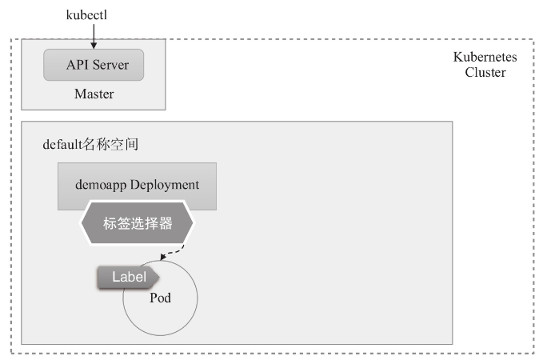
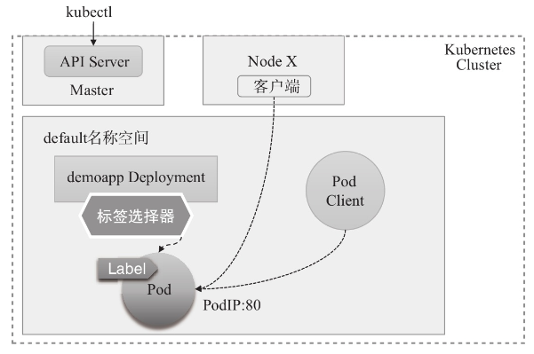
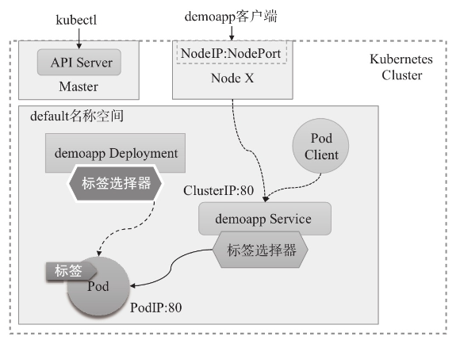
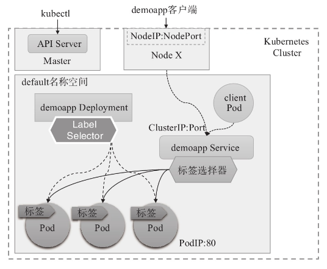
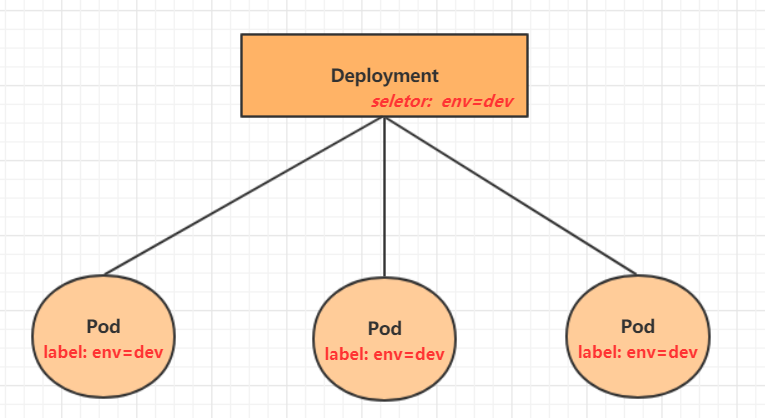

# 第02章_资源

Kubernetes API 是管理各种资源对象的唯一入口，它提供了一个 RESTful 风格的 CRUD（Create、Read、Update和Delete）接口用于查询和修改集群状态，并将结果存储在集群状态存储系统 etcd 中。事实上，API Server 也是用于更新 etcd 中资源对象状态的**唯一途径**，Kubernetes 的其他所有组件和客户端都要通过它完成查询或修改操作。

## 1.资源管理

### 1.1 资源管理介绍

在 kubernetes 中，所有的内容都抽象为**资源**，用户需要通过操作资源来管理 kubernetes。

kubernetes 的本质上就是一个集群系统，用户可以在集群中部署各种服务，所谓的部署服务，其实就是在 kubernetes 集群中运行一个个的容器，并将指定的程序跑在容器中。

kubernetes 的最小管理单元是`pod`而不是容器，所以只能将容器放在`pod`中，而 kubernetes 一般也不会直接管理`pod`，而是通过`pod控制器`来管理`pod`的。

`pod`可以提供服务之后，就要考虑如何访问`pod`中服务，kubernetes 提供了`service`资源实现这个功能。

当然，如果`pod`中程序的数据需要持久化，kubernetes 还提供了各种`存储`系统。


学习 kubernetes 的核心，就是学习如何对集群上的`Pod、Pod控制器、Service、存储`等各种资源进行操作。

### 1.2 资源类型

kubernetes 中所有的内容都抽象为资源，可以通过下面的命令进行查看：

```bash
kubectl api-resources
```

经常使用的资源有下面这些：

| 资源分类       | 资源名称                 | 缩写   | 资源作用                                                     |
| -------------- | ------------------------ | ------ | ------------------------------------------------------------ |
| 集群级别资源   | nodes                    | no     | 集群组成部分                                                 |
|                | namespaces               | ns     | 隔离 Pod                                                     |
| Pod 资源       | pods                     | po     | 运行容器化应用及调度的原子单元，同一个 Pod 可同时运行多个容器，这些容器共享 Linux 内核名称空间，并能够访问同一组存储卷 |
| Pod 资源控制器 | replicationcontrollers   | rc     | 控制 Pod 资源                                                |
|                | replicasets              | rs     | 控制 Pod 资源                                                |
|                | deployments              | deploy | 控制 Pod 资源，最常用的无状态应用控制器，支持应用的扩缩容、滚动更新等 |
|                | daemonsets               | ds     | 控制 Pod 资源                                                |
|                | jobs                     |        | 控制 Pod 资源                                                |
|                | cronjobs                 | cj     | 控制 Pod 资源                                                |
|                | horizontalpodautoscalers | hpa    | 控制 Pod 资源                                                |
|                | statefulsets             | sts    | 控制 Pod 资源                                                |
| 服务发现资源   | services                 | svc    | 统一 Pod 对外接口，为弹性变动且存在生命周期的 Pod 对象提供了一个固定的访问接口，便于服务发现和访问 |
|                | ingress                  | ing    | 统一 Pod 对外接口                                            |
| 存储资源       | volumeattachments        |        | 存储                                                         |
|                | persistentvolumes        | pv     | 存储                                                         |
|                | persistentvolumeclaims   | pvc    | 存储                                                         |
| 配置资源       | configmaps               | cm     | 配置                                                         |
|                | secrets                  |        | 配置                                                         |

### 1.3 资源管理方式-kubectl

`kubectl`是 kubernetes 集群的命令行工具，通过它能够对集群本身进行管理，并能够在集群上进行容器化应用的安装部署。`kubectl`命令能够读取任何以 .yaml、.yml 或 .json 为后缀的文件。`kubectl`的多数子命令支持使用-f选项指定使用的清单文件路径或 URL，甚至直接指定存储有清单文件的目录，而该选项在同一命令中也可重复使用多次。若指定的目录路径存在子目录，也可按需同时使用`-R`选项以**递归获取**子目录中的配置清单。

- 命令式对象管理：直接使用命令去操作 kubernetes 资源

  ```bash
  kubectl run nginx-pod --image=nginx:1.17.1 --port=80
  ```

- 命令式对象配置：通过命令配置和配置文件去操作 kubernetes 资源

  ```bash
  kubectl create/patch -f nginx-pod.yaml
  ```

- 声明式对象配置：通过 apply 命令和配置文件去操作 kubernetes 资源

  ```bash
  kubectl apply -f nginx-pod.yaml
  ```

| 类型           | 操作对象 | 适用环境 | 优点                                       | 缺点                             |
| -------------- | -------- | -------- | ------------------------------------------ | -------------------------------- |
| 命令式对象管理 | 对象     | 测试     | 简单，常用于查看                           | 只能操作活动对象，无法审计、跟踪 |
| 命令式对象配置 | 文件     | 开发     | 可以审计、跟踪                             | 项目大时，配置文件多，操作麻烦   |
| 声明式对象配置 | 目录     | 开发     | 支持目录操作，可以执行目录下所有 yaml 文件 | 意外情况下难以调试               |

> **提示**
>
> 一般情况下，在 node 节点执行任意`kubectl`命令，例如：`kubectl get nodes`，命令会报错。
>
> `kubectl`的运行是需要进行配置的，需要将`admin.conf`文件上传到 node 节点的`/etc/kubernetes`目录下，在 master 节点上执行下面操作：
>
> ```bash
> scp -r /etc/kubernetes/admin.conf node1:/etc/kubernetes/admin.conf
> ```
>
> 再在 node 节点配置环境变量
>
> ```bash
> export KUBECONFIG=/etc/kubernetes/admin.conf
> ```
>

#### 1.命令式对象管理

`kubectl`命令提供了基于命令行访问 Kubernetes API 的简洁方式，支持对各种类型资源的 CRUD 操作，能够满足针对Kubernetes系统的绝大部分的操作需求。例如，需要创建资源对象时，`kubectl`能够将资源清单内容以POST方式提交至 API Server 并接收其响应。

命令的语法如下：

```bash
kubectl [command] [type] [name] [flags]
```

- `comand`：指定要对资源执行的操作，例如 create、get、delete
- `type`：指定资源类型，比如 deployment、pod、service
- `name`：指定资源的名称，名称大小写敏感；省略时表示指定`type`的所有资源对象；同一类型的资源名称可于`type`后同时给出多个，也可以直接使用`type/name`的格式来为每个资源对象分别指定类型，如`kubectl get deployments/demoapp`等同于`kubectl get deployments demoapp`
- `flags`：指定额外的可选参数，例如`-s`或`--server`等；另外，`get`等命令在输出时还有一个常用的标志`-o <format>`用于指定输出格式

kubernetes 允许对资源进行多种操作，可以通过`--help`查看详细的操作命令

```bash
kubectl --help
```

经常使用的操作有下面这些：

| 命令分类     | 命令          | 命令作用                                                     |
| ------------ | ------------- | ------------------------------------------------------------ |
| 基本命令     | create        | 通过文件或标准输入创建一个资源                               |
|              | edit          | 编辑一个资源，相当于先使用`get`命令获取资源配置，由用户通过交互式编辑器修改后再自动使用`apply`命令将其应 |
|              | get           | 显示一个或多个资源                                           |
|              | set           | 设置目标资源对象的特定属性                                   |
|              | patch         | 使用策略合并补丁更新资源字段                                 |
|              | delete        | 基于文件名、stdin、资源或名字，以及资源和选择器删除资源，如`~$ kubectl delete pods -l k8s-app=kube-proxy -n kube-system`，若要删除所有则可执行`~$ kubectl delete pods --all -n kube-public`；<br />另外，有些资源类型支持优雅删除的机制，它们有着默认的删除宽限期，例如 Pod 资源的默认宽限期为 30 秒，但用户可在命令中使用`--grace-period`选项或`--now`选项来覆盖默认的宽限期，但这种删除操作可能会导致相关容器无法终止并退出：`~$ kubectl delete pods demoapp --force --grace-period=0` |
|              | explain       | 展示资源文档                                                 |
| 运行和调试   | run           | 在集群中以 Pod 形式运行指定的镜像，如创建一个 Pod 对象运行由用户指定的命令，且退出后将被自动删除：`kubectl run demoapp-$RANDOM --image="ikubernetes/demoapp:v1.0" --rm -it -- /bin/sh` |
|              | expose        | 基于 RC、Service、Deployment 或 Pod 创建 Service 资源        |
|              | describe      | 显示资源内部信息                                             |
|              | logs          | 输出容器在 pod 中的日志                                      |
|              | attach        | 附加终端至一个运行中的容器                                   |
|              | exec          | 执行容器中的一个命令，如`kubectl exec kube-apiserver-master.ilinux.io -n kube-system -- ps`，若 Pod 对象中存在多个容器，需要以`-c`选项指定容器后才能运行指定的命令 |
|              | cp            | 在Pod内外复制文件                                            |
|              | port-forward  | 将本地的一个或多个端口转发至指定的 Pod                       |
|              | proxy         | 创建能够访问 Kubernetes API Server 的代理                    |
|              | auth          | 打印授权信息                                                 |
| 部署命令     | rollout       | 管理资源的滚动更新                                           |
|              | scale         | 伸缩 Deployment、ReplicaSet、RC 或 Job 的规模                |
|              | autoscale     | 对 Deployment、ReplicaSet、RC 进行自动伸缩                   |
| 高级命令     | apply         | 通过比较资源在清单文件中的版本及前一次的版本执行更新操作，而不对未定义的属性产生额外作用 |
|              | label         | 更新资源上的标签                                             |
|              | diff          | 对比当前版本与即将应用的新版本的不同                         |
|              | replace       | 基于文件或 stdin 替换一个资源                                |
|              | wait          | 等待一个或多个资源上的指定境况                               |
|              | convert       | 为不同的 API 版本转换配置文件                                |
|              | kustomize     | 基于目录或 URL 构建 kustomization 目标                       |
| 集群管理命令 | cluster-info  | 显示集群信息                                                 |
|              | certificate   | 配置数字证书资源                                             |
|              | top           | 打印资源使用率                                               |
|              | cordon        | **将指定 node 设定为不可用（unschedulable）状态**            |
|              | uncordon      | 将指定 node 设定为可用状态                                   |
|              | drain         | **排空 Node 上的 Pod 以进入维护模式**                        |
|              | taint         | 为 Node 声明污点及标准行为                                   |
| 其他命令     |               |                                                              |
|              | version       | 显示当前 Server 和 Client 的版本                             |
|              | api-versions  | 以 group/version 格式打印服务器支持的 API 版本信息           |
|              | api-resources | 打印 API 支持的资源类型                                      |
|              | annotate      | 更新资源的注解                                               |
|              | completion    | 输出指定的 shell 的补全码                                    |
|              | config        | 配置 kubeconfig 文件的内容                                   |
|              | plugin        | 运行命令行插件                                               |
|              | alpha         | 仍处于 Alpha 阶段的子命令                                    |

同时，`kubectl get`命令能够支持多种不同的输出格式：

|     输出格式      |                           格式说明                           |
| :---------------: | :----------------------------------------------------------: |
|      -o wide      |                以纯文本格式显示资源的附加信息                |
|      -o name      |                       仅打印资源的名称                       |
|      -o yaml      |               以 YAML 格式化输出 API 对象信息                |
|      -o json      |               以 JSON 格式化输出 API 对象信息                |
|    -o jsonpath    | 以自定义 JSONPath 模板格式输出 API 对象信息，例如下面的命令先取出 dev 名称空间带有指定标签的一个 Pod 对象，然后查看该对象的日志：<br />`~$ DNS_POD=$(kubectl get pods -l  k8s-app=kube-dns -n kube-system -o jsonpath="{.items[0].metadata.name}")`<br />`~$ kubectl logs $DNS_POD -n kube-system` |
|  -o go-template   |           以自定义的 Go 模板格式输出 API 对象信息            |
| -o custom-columns |                      自定义要输出的字段                      |

此外还有许多通用选项，这个可以使用`kubectl options`获取，常用的有：

- `-s`或`-server`：指定 API Server 的地址和端口
- `-kubeconfig`：使用的 kubeconfig 配置文件路径，默认`~/.kube/config`
- `-n`或`-namespace`：命令执行的目标空间名称

#### 2.命令式对象配置

命令式对象配置就是使用命令配合配置文件一起来操作 kubernetes 资源。

1） 创建一个 nginxpod.yaml，内容如下：

```yaml
apiVersion: v1
kind: Namespace
metadata:
  name: dev

---

apiVersion: v1
kind: Pod
metadata:
  name: nginxpod
  namespace: dev
spec:
  containers:
  - name: nginx-containers
    image: nginx:latest
```

2）执行`create`命令，创建资源：

```bash
[root@master ~]# kubectl create -f nginxpod.yaml
namespace/dev created
pod/nginxpod created
```

此时发现创建了两个资源对象，分别是 namespace 和 pod。

3）执行`get`命令，查看资源：

```bash
[root@master ~]#  kubectl get -f nginxpod.yaml
NAME            STATUS   AGE
namespace/dev   Active   18s

NAME            READY   STATUS    RESTARTS   AGE
pod/nginxpod    1/1     Running   0          17s
```

这样就显示了两个资源对象的信息。

4）执行`delete`命令，删除资源：

```bash
[root@master ~]# kubectl delete -f nginxpod.yaml
namespace "dev" deleted
pod "nginxpod" deleted
```

此时发现两个资源对象被删除了。

**总结**

命令式对象配置的方式操作资源，可以简单的认为：命令  +  yaml 配置文件（里面是命令需要的各种参数）。

#### 3.声明式对象配置

声明式对象配置跟命令式对象配置很相似，但是它只有一个命令`apply`。

```bash
# 首先执行一次 kubectl apply -f yaml 文件，发现创建了资源
[root@master ~]#  kubectl apply -f nginxpod.yaml
namespace/dev created
pod/nginxpod created

# 再次执行一次，发现说资源没有变动
[root@master ~]#  kubectl apply -f nginxpod.yaml
namespace/dev unchanged
pod/nginxpod unchanged
```

**总结**

其实声明式对象配置就是使用`apply`描述一个资源最终的状态（在 yaml 中定义状态），使用`apply`操作资源：

- 如果资源不存在，就创建，相当于`kubectl create`
- 如果资源已存在，就更新，相当于`kubectl patch`（使用`kubectl create`则会报错）

#### 4.kubectl插件

kubectl 插件是指能够由 kubectl 调用的外部独立应用程序，这类应用程序都以`kubectl-$plugin_name`格式命名，表现为 kubectl 的名字是`$plugin_name`的子命令。例如，应用程序`/usr/bin/kubectl-whoami`就是 whoami 插件，我们可以使用`kubectl whoami`的格式来运行它。

插件程序能够从 kubectl 继承环境信息，但 kubectl 的插件机制并不会在该程序及调用的外部程序之间传递任何信息，它仅**仅提供了调用外部程序的一个统一接口**，于是我们可以使用任何熟悉的脚本语言或编程语言来开发 kubectl 插件，但最终的脚本或程序文件需要以`kubectl-`为名称前缀。安装插件时只需要将插件程序的可执行文件移动到系统的`PATH`环境变量上，指向任一路径即可。`kubectl plugin list`命令可遍历`PATH`环境变量指向的每一个路径，搜索并列出每一个以`kubectl-`为前缀的可执行程序文件路径。

Kubernetes SIG CLI 社区还提供了一个插件管理器——**Krew**，它能够帮助用户打包、分发、查找、安装和管理kubectl插件，项目地址为https://krew.sigs.k8s.io/。Krew 以跨平台的方式打包和分发插件，因此单一打包格式即能适配主流的系统平台。

Krew 自身也表现为 kubectl 的一个插件，需要以手动方式独立安装。下面的脚本（`krew-install.sh`）能自动完成 Krew 插件的安装，该脚本仅适用于类 UNIX 系统平台，并以`bash`解释器运行，其他平台上的部署方式请参考 Krew 项目的官方文档。

```bash
#!/bin/bash
set -x; cd "$(mktemp -d)"

curl -fSLO "https://github.com/kubernetes-sigs/krew/releases/latest/download/
krew.{tar.gz,yaml}" 
tar zxvf krew.tar.gz 
KREW=./krew-"$(uname | tr '[:upper:]' '[:lower:]')_amd64"

"$KREW" install --manifest=krew.yaml --archive=krew.tar.gz
"$KREW" update
```

Krew 默认以用户主目录下的隐藏目录`.krew`为工作目录，由 Krew 安装的插件都位于`$HOME/.krew/bin`路径下，因此脚本执行完成后，会通过如下信息提示用户将该路径添加到`PATH`环境变量，并重启`shell`进程。

```bash
WARNING: To be able to run kubectl plugins, you need to add
the following to your ~/.bash_profile or ~/.bashrc:
export PATH="${PATH}:${HOME}/.krew/bin"
and restart your shell.
```

于是，我们编辑`$HOME/.bash_profile`文件，将`export`一行命令添加其中，并重启当前`shell`解释器。

```bash
~$ echo 'export PATH="${PATH}:${HOME}/.krew/bin"' >> $HOME/.bash_profile
~$ exec $SHELL
```

设定完成后，`kubectl krew`子命令便能执行 Krew 插件管理器的相关功能，例如查找和安装所需要的插件，它拥有 help、list、search、info、install、upgrade 和 uninstall 等二级子命令。下面的命令搜索 Krew 索引中包含字符串`who`的插件。

```bash
~$ kubectl krew search who
NAME     DESCRIPTION                                         INSTALLED
who-can  Shows who has RBAC permissions to access Kubern...     no
whoami   Show the subject that's currently authenticated...     no
```

插件的简要描述能够通过`info`子命令打印。例如，下面的命令打印了`whoami`插件的相关描述，该插件能够返回当前 kubectl 客户端将以哪个主体（subject）身份请求认证的信息。

```bash
~$ kubectl krew info whoami
NAME: whoami
……
DESCRIPTION: 
This plugin show the subject that's currently authenticated as.
……
```

安装插件则需要使用`install`命令，命令格式为`install PLUGIN_NAME`。仍然以`whoami`插件为例，使用如下命令即能完成该插件的安装。

```bash
~$ kubectl krew install whoami
```

`whoami`插件功能非常简单，它没有更多的选项可以使用，因此，`kubectl whoami`便能返回当前 kubectl 客户端会以哪种身份凭据认证到 API Server。下面命令的结果显示：当前客户端基于 kubeconfig 配置文件（kubecfg）加载 X509 数字证书格式的身份凭据（certauth），并由 API Server 认证为管理员（admin）。

```bash
~$ kubectl whoami
kubecfg:certauth:admin
```

**建议安装以下常用的插件：**

```bash
# ctx 以更便捷的方式完成 kubeconfig 中的 context 切换
~$ kubectl krew install whoami rbac-view ns ctx
```

### 1.4 实战：命令式应用编排

本节使用示例镜像 ikubernetes/demoapp:v1.0 演示容器应用编排的基础操作：应用部署、访问、查看，服务暴露和应用扩缩容等。一般说来，Kubernetes 之上应用程序的基础管理操作由如下几个部分组成。

1. 通过合用的控制器类的资源（例如`Deployment`或`ReplicationController`）创建并管控 Pod 对象以运行特定的应用程序：无状态（stateless）应用的部署和控制通常使用`Deployment`控制器，而有状态应用则需要使用`StatefulSet`控制器或扩展的 Operator。
2. 为 Pod 对象创建 Service 对象，以便向客户端提供固定的访问端点，并能够借助 KubeDNS 进行服务发现。
3. 随时按需获取各资源对象的简要或详细信息，以了解其运行状态。
4. 如有需要，对支持扩缩容的应用按需进行扩容或缩容；或者，为支持 HPA 的控制器组件（例如`Deployment`或`ReplicationController`）创建 HPA 资源对象，以实现 Pod 副本数目的自动伸缩。
5. 应用程序的镜像出现新版本时，对其执行更新操作，若相应的控制器支持，修改指定的控制器资源中 Pod 模板的容器镜像为指定的新版本即可自动触发更新过程。

以下操作命令均可在任何部署了 kubectl 并能正常访问 Kubernetes 集群的主机上执行，包括集群外的主机。复制 Master 主机上的`/etc/kubernetes/admin.conf`至相关用户主目录下的`.kube/config`文件即可正常执行，具体方法请参考`kubeadm init`命令结果中的提示。

#### 1.应用编排

**（1）创建 Deployment 控制器对象**

`kubectl create deployment`能够以“命令式命令”直接创建`Deployment`控制器对象，经该对象编排的 Pod 对象将由该命令生成的 Pod 模板自动创建，但需要用户以`--image`选项指定要使用的容器镜像。该命令的`--dry-run={none|client|server}`选项可**用于测试运行**，并不真正执行资源对象的创建过程，因而可用于在真正运行之前测试其是否能成功创建出指定的 Deployment 资源。例如，下面的命令会创建一个名为 demoapp 的 Deployment 控制器对象，它使用镜像 ikubernetes/demoapp:v1.0 创建 Pod 对象，但仅用于测试，运行后即退出。

```bash
~$ kubectl create deployment demoapp --image="ikubernetes/demoapp:v1.0" --dry-run=client
deployment.apps/demoapp created (dry run)
```

确认测试命令无误后，可在移除`--dry-run`选项后再次执行命令以完成资源对象的创建。

```bash
~$ kubectl create deployment demoapp --image="ikubernetes/demoapp:v1.0" 
deployment.apps/demoapp created
```

该命令创建的 Deployment/demoapp 对象会借助指定的镜像在default 名称空间中生成一个 Pod，**并自动为其添加 app=demoapp 标签**，而控制器对象自身也将使用该标签作为标签选择器。镜像 ikubernetes/demoapp:v1.0 中定义的容器主进程为默认监听于 80 端口的 Web 应用程序 demoapp。



**（2）打印资源对象的相关信息**

面是查看前面创建的 Deployment 对象的相关运行状态的命令及其输出结果：

```bash
root@VM-0-4-ubuntu:/# kubectl get deployments/demoapp
NAME      READY   UP-TO-DATE   AVAILABLE   AGE
demoapp   1/1     1            1           59s
```

- NAME：Deployment 资源对象的名称
- READY：以类似 m/n 格式返回两个数字，m 代表就绪的 Pod 数量，n 表示期望的总的 Pod 数量
- UP-TO-DATE：更新到最新版本定义的 Pod 对象副本数量，在控制器的滚动更新模式下，它表示已经完成版本更新的 Pod 对象副本数量
- AVAILABLE：当前处于可用状态的 Pod 对象副本数量，即可正常提供服务的副本数
- AGE：该资源的存在时长

> **提示**
>
> Deployment 资源对象是**通过 ReplicaSet 控制器对象作为中间层实例完成对 Pod 对象的控制**，各 Pod 的名称也是由 ReplicaSet 对象名称后跟几个随机字符构成。

由控制器创建的 Pod 对象的名称通常是以其隶属的 ReplicaSet 对象的名称为前缀，以随机字符为后缀，例如下面命令以 app=demoapp 为标签选择器打印筛选出的 Pod 对象的相关信息。

```bash
root@VM-0-4-ubuntu:/# kubectl get pods -l app=demoapp -o wide
NAME                      READY   STATUS    RESTARTS   AGE    IP           NODE             NOMINATED NODE   READINESS GATES
demoapp-7c58cd6bb-7hnbh   1/1     Running   0          5m3s   10.244.1.7   vm-0-16-ubuntu   <none>           <none>

root@VM-0-4-ubuntu:/# kubectl get rs
NAME                DESIRED   CURRENT   READY   AGE
demoapp-7c58cd6bb   1         1         1       5m26s
```

- STATUS：Pod 的当前状态，其值可能是 Pending、Running、Succeeded、Failed 和 Unknown 等其中之一，并存在某些类型的中间状态（容器状态）
- RESTARTS：Pod 对象可能会因容器进程崩溃、超出资源限额等故障而被重启，此字段记录了它重启的次数
- IP：Pod 的 IP 地址，通常由网络插件自动分配
- NODE：该 Pod 对象绑定的 Node，目标 Node 由 Scheduler 负责挑选

确认 Pod 对象转为 Running 状态后，即可在集群中任一节点（或其他 Pod 对象）直接访问容器化应用的服务：

```bash
root@VM-0-4-ubuntu:/# POD_IP=$(kubectl get pods -l app=demoapp -o jsonpath={.items[0].status.podIP})
root@VM-0-4-ubuntu:/# curl http://${POD_IP}
iKubernetes demoapp v1.0 !! ClientIP: 10.244.0.0, ServerName: demoapp-7c58cd6bb-7hnbh, ServerIP: 10.244.1.7!

# 在另一台 Node 上也可以访问
root@VM-0-16-ubuntu:~# curl http://10.244.1.7
iKubernetes demoapp v1.0 !! ClientIP: 10.244.1.1, ServerName: demoapp-7c58cd6bb-7hnbh, ServerIP: 10.244.1.7!
```



#### 2.部署Service对象

Service 对象就是一组 Pod 的逻辑组合，它通过称为 **ClusterIP** 的地址和服务端口接收客户端请求，并将这些请求代理至使用标签选择器来过滤一个符合条件的 Pod 对象。

`kubectl create service`命令可创建 Service 对象以将应用程序“暴露”于网络中，它使用的标签选择器为`app=SVC_NAME`。例如，下面的命令**默认使用 app=demoapp 为标签选择器**创建了 service/demoapp 资源对象。

```bash
~$ kubectl create service nodeport demoapp --tcp=80
service/demoapp created
```

在上面的命令中，nodeport 是指 Service 对象的类型，它会在集群中各节点上随机选择一个节点端口（hostPort）为该 Service 对象接入集群外部的访问流量，集群内部流量则由 Service 资源通过 ClusterIP 直接接入。命令选项`--tcp=<port>[:<targetPort>]`用于指定 Service 端口及容器上要暴露的端口，**省略容器端口时表示与 Service 端口相同**。创建完成后，default 名称空间中的对象及其通信示意图如图所示。



这样我们既可以在任意节点通过 PodIP 来访问，也可以在其他任意一个 Pod 对象中来访问此 Pod。首先，使用`kubectl run`命令创建一个自主式 Pod 对象并直接接入其交互式接口，如下面命令的`-it`组合选项即用于交互式打开并保持其`shell`命令行接口。

```bash
~$ kubectl run client-pod --image="ikubernetes/admin-toolbox:v1.0" --rm -it -- /bin/sh
[root@client-pod /]#
```

接下来，在 client-pod 中测试 Service 对象的名称解析功能，如下面命令中的`demoapp`是指 Service 对象名称，而`default`是该 Service 所属的名称空间，`svc`代表 Service 资源，而`cluster.local`是集群域名。其中的`svc.cluster.local`通常可以省略，**如果客户端与目标 Service 对象在同一名称空间中，则名称空间也可省略**。

```bash
# nslookup 是一个用于执行 DNS 查询的命令行工具，可以使用它来查找域名的 IP 地址
[root@client-pod /]# nslookup -query=A demoapp.default.svc.cluster.local
Server:		10.96.0.10
Address:	10.96.0.10#53

Name:	demoapp.default.svc.cluster.local
Address: 10.103.6.130

[root@client-pod /]# nslookup -query=A demoapp.default
Server:		10.96.0.10
Address:	10.96.0.10#53

Name:	demoapp.default.svc.cluster.local
Address: 10.103.6.130
```

随后，可在 client-pod 通过`crul`命令对此前创建的 Service 对象的名称发起访问请求，下面的命令使用了短格式的服务名称。

```bash
[root@client-pod /]# curl http://demoapp
iKubernetes demoapp v1.0 !! ClientIP: 10.244.1.8, ServerName: demoapp-7c58cd6bb-7hnbh, ServerIP: 10.244.1.7!
```

`kubectl get services`命令能够列出 Service 对象的相关信息。

```bash
root@VM-0-4-ubuntu:/# kubectl get service/demoapp 
NAME      TYPE       CLUSTER-IP     EXTERNAL-IP   PORT(S)        AGE
demoapp   NodePort   10.103.6.130   <none>        80:31128/TCP   19m
```

其中，PORT(s) 字段中表明，集群中各工作节点会捕获发往本地的目标端口为 32687 的流量，并将其代理至当前 Service 对象的 80 端口，于是，集群外部的用户可以使用当前集群中任一节点的此端口来请求 Service 对象上的服务。`CLUSTER-IP`字段为当前 Service 的 IP 地址，它是一个虚拟 IP，并没有配置在集群中任何主机的任何接口之上，**但每个 Node 上的 kube-proxy 都会为`CLUSTER-IP`所在的网络创建用于转发的 iptables 或 ipvs 规则**。此时，用户可于集群外部任一浏览器请求 Kubernetes 集群任意一个节点的相关端口来进行访问测试。

#### 3.扩容与缩容

前面示例中创建的 Deployment 对象 demoapp 仅创建了一个 Pod 对象，其所能够承载的访问请求数量受限于这个 Pod 对象的服务能力。用户可以通过 Kubernetes 的应用**扩容**（scaling up）机制来增加 Pod 副本数量，从而提升其服务容量。相应地，**缩容**是指缩减 Pod 副本数量，只不过这通常缘于与扩容操作相反的原因。

`kubectl scale`命令就是专用于变动控制器应用规模的命令，它支持对 Deployment、ReplicaSet、StatefulSet 等类型资源对象的扩容和缩容操作。例如，如果要将 Deployment/demoapp 中的 Pod 副本数量扩展为 3 个，可以使用如下命令完成。

```bash
root@VM-0-4-ubuntu:/# kubectl scale deployment/demoapp --replicas=3
deployment.apps/demoapp scaled
```

而后列出由 demoapp 创建的 Pod 副本，便可确认其扩展操作的完成状态。如下命令显示出其 Pod 副本数量已经扩增至 3 个，其中包括此前的 Pod。

```bash
root@VM-0-4-ubuntu:/# kubectl get pods -l app=demoapp
NAME                      READY   STATUS    RESTARTS   AGE
demoapp-7c58cd6bb-72lxm   1/1     Running   0          22s
demoapp-7c58cd6bb-7hnbh   1/1     Running   0          42m
demoapp-7c58cd6bb-xr6ht   1/1     Running   0          22s
```

Service 对象内置的负载均衡机制可**在其后端副本数量不止一个时自动进行流量分发**，它还会自动监控关联到的 Pod 的健康状态，以确保仅将请求流量分发至可用的后端 Pod 对象。因此，Deployment 对象 demoapp 规模扩展完成后，default 名称空间中的资源对象及其关联关系就变成了如图所示的情形。



而后由`kubectl describe deployment`命令打印 Deployment 对象 demoapp 的详细信息，了解其应用规模的变动及当前 Pod 副本的状态等相关信息。由命令结果可以看出，其 Pod 副本数量的各项指标都已经转换为新的目标数量，而其事件信息中也有相应事件显示其扩增操作已成功完成。

```bash
~$ kubectl describe deployment/demoapp 
Name:                   demoapp
……
Replicas:          3 desired | 3 updated | 3 total | 3 available | 0 unavailable
……
NewReplicaSet:   demoapp-6c5d545684 (3/3 replicas created)
Events:
Type    Reason             Age    From                   Message
----    ------             ----   ----                   -------
Normal  ScalingReplicaSet  2m16s  deployment-controller  Scaled up replica set   demoapp-6c5d545684 to 3
```

Service 对象 demoapp 的标签选择器动态纳入的新 Pod 副本也将成为该 Service 对象可用的代理后端，所有流量会被调度至其后端的所有 Pod 对象之上。每个能够接收流量的后端称为一个端点，它通常表现为相应主机或容器上可接收特定流量的访问入口（套接字），如下面命令结果中的`Endpoints`字段所示。

```bash
~$ kubectl describe service/demoapp
Name:                     demoapp
……
IP:                       10.102.6.223
Port:                     80  80/TCP
TargetPort:               80/TCP
NodePort:                 80  32687/TCP
Endpoints:                10.244.0.6:80,10.244.1.7:80,10.244.1.9:80
……
```

我们可以通过任何客户端对 Service/demoapp 的服务发起访问请求进行测试，这次我们在集群外的主机上通过访问节点 IP+NodePort 对该服务发起持续访问，以测试 Service 对象的流量调度机制是否能够正常工作。由命令的响应结果显示，Service/demoapp 已然将请求调度至 3 个不同的后端 Pod 之上。

```bash
flamezyy@DS220plus:/$ while true; do curl http://43.153.170.51:31128; sleep 0.2; done
iKubernetes demoapp v1.0 !! ClientIP: 10.244.0.1, ServerName: demoapp-7c58cd6bb-xr6ht, ServerIP: 10.244.0.6!
……
iKubernetes demoapp v1.0 !! ClientIP: 10.244.0.0, ServerName: demoapp-7c58cd6bb-7hnbh, ServerIP: 10.244.1.7!
……
iKubernetes demoapp v1.0 !! ClientIP: 10.244.0.0, ServerName: demoapp-7c58cd6bb-72lxm, ServerIP: 10.244.1.9!
```

应用规模缩容的方式和扩容相似，只不过是将 Pod 副本的数量调至比原来小的数字。例如，将 demoapp 的 Pod 副本缩减至 2 个，可以使用类似如下命令进行。

```bash
root@VM-0-4-ubuntu:/# kubectl scale deployment/demoapp --replicas=2
deployment.apps/demoapp scaled

root@VM-0-4-ubuntu:/# kubectl get pods -l app=demoapp
NAME                      READY   STATUS    RESTARTS   AGE
demoapp-7c58cd6bb-7hnbh   1/1     Running   0          67m
demoapp-7c58cd6bb-xr6ht   1/1     Running   0          25m
```

#### 4.修改与删除对象


## 2.资源的操作

查看所有的资源：`kubectl get all -A`

### 2.1 Namespace

namespace 是 kubernetes 系统中的一种非常重要资源，它的主要作用是用来实现**多套环境的资源隔离**或者**多租户的资源隔离**。

默认情况下，kubernetes 集群中的所有的 pod 都是可以相互访问的。可将两个 pod 划分到不同的 namespace 下可以禁止访问。kubernetes 通过将集群内部的资源分配到不同的 namespace 中，可以形成逻辑上的"组"，以方便不同的组的资源进行隔离使用和管理。

可以通过 kubernetes 的授权机制，将不同的 namespace 交给不同租户进行管理，这样就实现了多租户的资源隔离。此时还能结合 kubernetes 的资源配额机制，限定不同租户能占用的资源，例如 CPU 使用量、内存使用量等等，来实现租户可用资源的管理。


kubernetes 在集群启动之后，会默认创建几个 namespace

```bash
[root@master ~]# kubectl  get namespace
NAME              STATUS   AGE
default           Active   45h     #  所有未指定 namespace 的对象都会被分配在 default 命名空间
kube-node-lease   Active   45h     #  集群节点之间的心跳维护，v1.13 开始引入
kube-public       Active   45h     #  此命名空间下的资源可以被所有人访问（包括未认证用户）
kube-system       Active   45h     #  所有由 kubernetes 系统创建的资源都处于这个命名空间
```

#### 1.查看

```bash
# 1 查看所有的 ns
[root@master ~]# kubectl get ns
NAME              STATUS   AGE
default           Active   45h
kube-node-lease   Active   45h
kube-public       Active   45h     
kube-system       Active   45h     

# 2 查看指定的 ns
[root@master ~]# kubectl get ns default
NAME      STATUS   AGE
default   Active   45h

# 3 指定输出格式，如 wide、json、yaml
[root@master ~]# kubectl get ns default -o yaml
apiVersion: v1
kind: Namespace
metadata:
  creationTimestamp: "2021-05-08T04:44:16Z"
  name: default
  resourceVersion: "151"
  selfLink: /api/v1/namespaces/default
  uid: 7405f73a-e486-43d4-9db6-145f1409f090
spec:
  finalizers:
  - kubernetes
status:
  phase: Active
  
# 4 查看 ns 详情
[root@master ~]# kubectl describe ns default
Name:         default
Labels:       <none>
Annotations:  <none>
Status:       Active  # Active：命名空间正在使用中；Terminating：正在删除命名空间

# ResourceQuota 针对 namespace 做的资源限制
# LimitRange 针对 namespace 中的每个组件做的资源限制
No resource quota.
No LimitRange resource.
```

#### 2.创建

```bash
# 创建 namespace
[root@master ~]# kubectl create ns dev
namespace/dev created
```

#### 3.删除

```bash
# 删除 namespace
[root@master ~]# kubectl delete ns dev
namespace "dev" deleted
```

#### 4.配置方式

首先准备一个 yaml 文件：ns-dev.yaml

```yaml
apiVersion: v1
kind: Namespace
metadata:
  name: dev
```

然后就可以执行对应的创建和删除命令了：

创建：`kubectl create -f ns-dev.yaml`

删除：`kubectl delete -f ns-dev.yaml`

### 2.2 Pod

pod 是 kubernetes 集群进行管理的最小单元，程序要运行必须部署在容器中，而容器必须存在于 pod 中。

pod 可以认为是容器的封装，一个 pod 中可以存在一个或者多个容器。


kubernetes 在集群启动之后，集群中的各个组件也都是以 pod 方式运行的。可以通过下面命令查看：

```bash
[root@master kubernetes]# kubectl get pod -n kube-system
NAME                             READY   STATUS    RESTARTS   AGE
coredns-787d4945fb-5v6l4         1/1     Running   0          135m
coredns-787d4945fb-k7pm5         1/1     Running   0          135m
etcd-master                      1/1     Running   6          135m
kube-apiserver-master            1/1     Running   6          135m
kube-controller-manager-master   1/1     Running   6          135m
kube-proxy-7l9lc                 1/1     Running   0          135m
kube-proxy-jh9hj                 1/1     Running   0          135m
kube-proxy-nb8wl                 1/1     Running   0          135m
kube-scheduler-master            1/1     Running   6          135m

```

#### 1.创建并运行

需要提前创建好 dev 命名空间。

```bash
# 命令格式： kubectl run (pod名称) [参数] 
# --image  指定Pod的镜像
# --port   指定端口
# --namespace  指定namespace
[root@master ~]# kubectl run nginx --image=nginx:latest --port=80 --namespace dev
pod/nginx created
```

> **注意**
>
> 新版由于`run`不会创建控制器，所以可以直接创建一个名称为`nginx `的 pod，而旧版中则会创建一个名称为`nginx`的 pod 控制器，再由控制器创建一个`nginx+随机数`命名的 pod。

#### 2.查看pod信息

```bash
[root@master ~]# kubectl get pod -n dev
NAME    READY   STATUS    RESTARTS   AGE
nginx   1/1     Running   0          96s
[root@master ~]# kubectl describe pod nginx -n dev
...
```

#### 3.访问Pod

```bash
# 获取 pod IP
[root@master ~]# kubectl get pod -n dev -o wide
NAME    READY   STATUS    RESTARTS   AGE     IP           NODE    NOMINATED NODE   READINESS GATES
nginx   1/1     Running   0          2m17s   10.244.1.5   node2   <none>           <none>
# 通过 pod IP 和指定的端口访问
[root@master ~]# curl 10.244.1.5:80
<!DOCTYPE html>
<html>
<head>
<title>Welcome to nginx!</title>
<style>
html { color-scheme: light dark; }
body { width: 35em; margin: 0 auto;
font-family: Tahoma, Verdana, Arial, sans-serif; }
</style>
</head>
<body>
<h1>Welcome to nginx!</h1>
<p>If you see this page, the nginx web server is successfully installed and
working. Further configuration is required.</p>

<p>For online documentation and support please refer to
<a href="http://nginx.org/">nginx.org</a>.<br/>
Commercial support is available at
<a href="http://nginx.com/">nginx.com</a>.</p>

<p><em>Thank you for using nginx.</em></p>
</body>
</html>
```

#### 4.删除指定pod

```bash
# 删除
[root@master ~]# kubectl delete pod nginx -n dev
pod "nginx" deleted

[root@master ~]# kubectl get pod -n dev
No resources found in dev namespace.
```

> **注意**
>
> 新版可以使用`delete pod podName`直接删除，因为使用`run`命令不会创建 pod 控制器，使用 deploy 才会创建控制器；
>
> 而旧版由于创建的是 pod 控制器，所以使出 pod 的话控制器会重建一个 pod，直接删除控制器即可：`kubectl delete deploy nginx -n dev`

#### 5.配置操作

创建一个pod-nginx.yaml，内容如下：

```yaml
apiVersion: v1
kind: Pod
metadata:
  name: nginx
  namespace: dev
spec:
  containers:
  - image: nginx:latest
    name: pod
    ports:
    - name: nginx-port
      containerPort: 80
      protocol: TCP
```

然后就可以执行对应的创建和删除命令了：

创建：`kubectl create -f pod-nginx.yaml`

删除：`kubectl delete -f pod-nginx.yaml`

### 2.3 Label

Label 是 kubernetes 系统中的一个重要概念。它的作用就是在资源上添加标识，用来对它们进行区分和选择。

Label 的特点：

- 一个 Label 会以 key/value 键值对的形式附加到各种对象上，如 Node、Pod、Service 等等
- 一个资源对象可以定义任意数量的 Label ，同一个 Label 也可以被添加到任意数量的资源对象上去
- Label 通常在资源对象定义时确定，当然也可以在对象创建后动态添加或者删除

可以通过 Label 实现资源的多维度分组，以便灵活、方便地进行资源分配、调度、配置、部署等管理工作。

> 一些常用的 Label 示例如下：
>
> - 版本标签："version":"release", "version":"stable"......
> - 环境标签："environment":"dev"，"environment":"test"，"environment":"pro"
> - 架构标签："tier":"frontend"，"tier":"backend"

标签定义完毕之后，还要考虑到标签的选择，这就要使用到 Label Selector，即：

- Label 用于给某个资源对象定义标识

- Label Selector 用于查询和筛选拥有某些标签的资源对象

当前有两种 Label Selector：

- 基于等式的 Label Selector

  `name = slave`：选择所有包含Label中key="name"且value="slave"的对象

  `env != production`：选择所有包括 Label 中的 key="env" 且 value 不等于 "production" 的对象

- 基于集合的 Label Selector

  `name in (master, slave)`：选择所有包含 Label 中的 key="name" 且 value="master" 或 "slave" 的对象

  `name not in (frontend)`：选择所有包含 Label 中的 key="name" 且 value 不等于 "frontend" 的对象

标签的选择条件可以使用多个，此时将多个 Label Selector 进行组合，使用逗号`,`进行分隔即可。例如：

- `name=slave, env!=production`
- `name not in (frontend), env!=production`

##### 1.命令方式

```bash
# 为已有 pod 资源打标签
[root@master ~]# kubectl label pod nginx-pod version=1.0 -n dev
pod/nginx-pod Labeled

# 为 pod 资源更新标签
[root@master ~]# kubectl label pod nginx-pod version=2.0 -n dev --overwrite
pod/nginx-pod Labeled

# 查看标签
[root@master ~]# kubectl get pod nginx-pod -n dev --show-labels
NAME        READY   STATUS    RESTARTS   AGE   LABELS
nginx-pod   1/1     Running   0          10m   version=2.0

# 筛选标签
[root@master ~]# kubectl get pod -n dev -l version=2.0  --show-labels
NAME        READY   STATUS    RESTARTS   AGE   LABELS
nginx-pod   1/1     Running   0          17m   version=2.0
[root@master ~]# kubectl get pod -n dev -l version!=2.0 --show-labels
No resources found in dev namespace.

#删除标签
[root@master ~]# kubectl label pod nginx-pod version- -n dev
pod/nginx-pod Labeled
```

##### 2.配置方式 - metadata.labels

```
apiVersion: v1
kind: Pod
metadata:
  name: nginx
  namespace: dev
  labels:
    version: "3.0" 
    env: "test"
spec:
  containers:
  - image: nginx:latest
    name: pod
    ports:
    - name: nginx-port
      containerPort: 80
      protocol: TCP
```

然后就可以执行对应的更新命令了：`kubectl apply -f pod-nginx.yaml`（如果存在 nginx 的 pod 则会更新标签）

### 2.4 Deployment

在 kubernetes 中，Pod 是最小的控制单元，但是 kubernetes 很少直接控制 Pod，一般都是通过 Pod 控制器来完成的。Pod 控制器用于 pod 的管理，确保 pod 资源符合预期的状态，当 pod 的资源出现故障时，会尝试进行重启或重建 pod。

在 kubernetes 中 Pod 控制器的种类有很多，本章节只介绍一种：Deployment。



#### 1.创建并运行

```bash
# 命令格式: kubectl create deployment 名称  [参数] 
# --image  指定 pod 的镜像
# --port   指定端口
# --replicas  指定创建 pod 数量
# --namespace  指定 namespace

# 旧版本：kubectl run nginx --image=nginx:latest --port=80 --replicas=3 -n dev
[root@master ~]# kubectl create deployment my-dep --image=nginx:latest --port=80 --replicas=3 -n dev
deployment.apps/my-dep created

# 查看创建的 Pod
[root@master ~]# kubectl get pods -n dev
NAME                      READY   STATUS    RESTARTS   AGE
my-dep-67c68dbfdf-2zscj   1/1     Running   0          59s
my-dep-67c68dbfdf-69rjl   1/1     Running   0          8m12s
my-dep-67c68dbfdf-z4v97   1/1     Running   0          8m12s

# 查看deployment 的信息
[root@master ~]# kubectl get deployment -n dev
NAME     READY   UP-TO-DATE   AVAILABLE   AGE
my-dep   3/3     3            3           7m52s

# UP-TO-DATE：成功升级的副本数量
# AVAILABLE：可用副本的数量
# SELECTOR: 痛着标签选择器来分组各个 pod

[root@master ~]# kubectl get deploy -n dev -o wide
NAME     READY   UP-TO-DATE   AVAILABLE   AGE   CONTAINERS   IMAGES         SELECTOR
my-dep   3/3     3            3           11m   nginx        nginx:latest   app=my-dep

# 查看 deployment 的详细信息
[root@master ~]# kubectl describe deploy my-dep -n dev
Name:                   my-dep
Namespace:              dev
CreationTimestamp:      Sun, 29 Jan 2023 05:42:02 -0800
Labels:                 app=my-dep
Annotations:            deployment.kubernetes.io/revision: 1
Selector:               app=my-dep
Replicas:               3 desired | 3 updated | 3 total | 3 available | 0 unavailable
StrategyType:           RollingUpdate
MinReadySeconds:        0
RollingUpdateStrategy:  25% max unavailable, 25% max surge
Pod Template:
  Labels:  app=my-dep
  Containers:
   nginx:
    Image:        nginx:latest
    Port:         80/TCP
    Host Port:    0/TCP
    Environment:  <none>
    Mounts:       <none>
  Volumes:        <none>
Conditions:
  Type           Status  Reason
  ----           ------  ------
  Available      True    MinimumReplicasAvailable
  Progressing    True    NewReplicaSetAvailable
OldReplicaSets:  <none>
NewReplicaSet:   my-dep-67c68dbfdf (3/3 replicas created)
Events:
  Type    Reason             Age   From                   Message
  ----    ------             ----  ----                   -------
  Normal  ScalingReplicaSet  12m   deployment-controller  Scaled up replica set my-dep-67c68dbfdf to 3
  
# 删除 
[root@master ~]# kubectl delete deploy my-dep -n dev
deployment.apps "nginx" deleted
```

#### 2.配置操作

创建一个 deploy-nginx.yaml，内容如下：

```
apiVersion: apps/v1
kind: Deployment
metadata:
  name: my-dep
  namespace: dev
spec:
  replicas: 3
  selector:
    matchLabels:
      app: my-dep
  template:
    metadata:
      labels:
        app: my-dep
    spec:
      containers:
      - image: nginx:latest
        name: nginx
        ports:
        - containerPort: 80
          protocol: TCP
```

然后就可以执行对应的创建和删除命令了：

创建：`kubectl create -f deploy-nginx.yaml`

删除：`kubectl delete -f deploy-nginx.yaml`

### 2.5 Service

通过上节课的学习，已经能够利用 Deployment 来创建一组 Pod 来提供具有高可用性的服务。

虽然每个 Pod 都会分配一个单独的 Pod IP，然而却存在如下两问题：

- Pod IP 会随着 Pod 的重建产生变化
- Pod IP 仅仅是集群内可见的虚拟 IP，外部无法访问

这样对于访问这个服务带来了难度。因此，kubernetes 设计了 Service 来解决这个问题。

Service 可以看作是一组同类 Pod **对外的访问接口**。借助 Service，应用可以方便地实现服务发现和负载均衡。


#### 1.集群内部访问

```bash
# 暴露 Service
# 使用 my-dep 的标签来指定可访问的 pod
[root@master ~]# kubectl expose deploy my-dep --name=svc-nginx --type=ClusterIP --port=80 --target-port=80 -n dev
service/svc-nginx exposed

# 查看 Service
[root@master ~]# kubectl get svc svc-nginx -n dev -o wide
NAME        TYPE        CLUSTER-IP      EXTERNAL-IP   PORT(S)   AGE   SELECTOR
svc-nginx   ClusterIP   10.105.165.86   <none>        80/TCP    6s    app=my-dep

# 这里产生了一个 CLUSTER-IP，这就是 service 的 IP，在 Service 的生命周期中，这个地址是不会变动的
# 可以通过这个 IP 访问当前 service 对应的 POD
[root@master ~]# curl 10.105.165.86
<!DOCTYPE html>
<html>
<head>
<title>Welcome to nginx!</title>
</head>
<body>
<h1>Welcome to nginx!</h1>
.......
</body>
</html>
```

#### 2.集群外部访问

```bash
# 上面创建的 Service 的 type 类型为 ClusterIP，这个ip地址只用集群内部可访问
# 如果需要创建外部也可以访问的 Service，需要修改 type 为 NodePort
[root@master ~]# kubectl expose deploy my-dep --name=svc-nginx2 --type=NodePort --port=80 --target-port=80 -n dev
service/svc-nginx2 exposed

# 此时查看，会发现出现了 NodePort 类型的 Service，而且有一对 Port（80:31928/TC）
[root@master ~]# kubectl get svc  svc-nginx2  -n dev -o wide
NAME         TYPE       CLUSTER-IP      EXTERNAL-IP   PORT(S)        AGE    SELECTOR
svc-nginx2   NodePort   10.106.213.24   <none>        80:31124/TCP   2m1s   app=my-dep

# 接下来就可以通过集群外的主机访问节点 IP:31124 访问服务了
# 例如在的电脑主机上通过浏览器访问下面的地址
http://192.168.11.101:31124/
```

#### 3.删除Service

```bash
[root@master ~]# kubectl delete svc svc-nginx2 -n dev 
service "svc-nginx2" deleted
```

#### 4.配置方式

创建一个svc-nginx.yaml，内容如下：

```bash
apiVersion: v1
kind: Service
metadata:
  name: svc-nginx
  namespace: dev
spec:
  clusterIP: 10.109.179.231 #固定 svc 的内网 ip
  ports:
  - port: 80
    protocol: TCP
    targetPort: 80
  selector:
    app: my-dep
  type: ClusterIP
```

然后就可以执行对应的创建和删除命令了：

创建：`kubectl create -f svc-nginx.yaml`

删除：`kubectl delete -f svc-nginx.yaml`