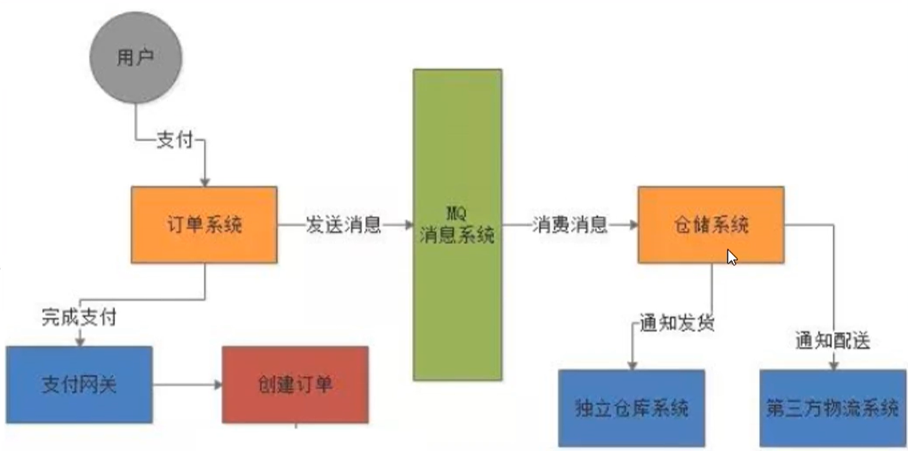

# 第1章_入门概述

## 1.MQ 的产品种类和对比

MQ就是消息中间件。MQ是一种理念，ActiveMQ是MQ的落地产品。不管是哪款消息中间件，都有如下一些技术维度：

| 特性              | ActiveMQ        | RabbitMQ   | Kafka            | RocketMQ       |
| ----------------- | --------------- | ---------- | ---------------- | -------------- |
| PRODUCER-CUMSUMER | 支持            | 支持       | 支持             | 支持           |
| PUBLISH-SUBSCRIBE | 支持            | 支持       | 支持             | 支持           |
| REQUEST-REPLY     | 支持            | 支持       | -                | 支持           |
| API完备性         | 高              | 高         | 高               | 低（静态配置） |
| 多语言支持        | 支持，JAVA 优先 | 语言无关   | 支持，JAVA 优先  | 支持           |
| 单机吞吐量        | 万级            | 万级       | 十万级           | 单机万级       |
| 消息延迟          | -               | 微秒级     | 毫秒级           | -              |
| 可用性            | 高（主从）      | 高（主从） | 非常高（分布式） | 高             |
| 消息丢失          | -               | 低         | 理论上不会丢失   | -              |
| 消息重复          | -               | 可控制     | 理论上会有重复   | -              |
| 文档的完备性      | 高              | 高         | 高               | 中             |
| 提供快速入门      | 有              | 有         | 有               | 无             |
| 首次部署难度      | -               | 低         | 中               | 高             |

- kafka

  编程语言：scala

  大数据领域的主流MQ

- rabbitmq

  编程语言：erlang

  基于erlang语言，不好修改底层，不要查找问题的原因，不建议选用

- rocketmq

  编程语言：java

  适用于大型项目。适用于集群

- activemq

  编程语言：java

  适用于中小型项目

## 2.MQ 的产生背景

**系统之间直接调用存在的问题？**

​    微服务架构后，链式调用是我们在写程序时候的一般流程,为了完成一个整体功能会将其拆分成多个函数(或子模块)，比如模块 A 调用模块 B，模块 B 调用模块 C，模块 C 调用模块 D。但在大型分布式应用中，系统间的 RPC 交互繁杂，一个功能背后要调用上百个接口并非不可能，从单机架构过渡到分布式微服务架构的通例。这些架构会有哪些问题？

1. 系统之间接口耦合比较严重

   ​    每新增一个下游功能，都要对上游的相关接口进行改造；

   ​    举个例子：如果系统 A 要发送数据给系统 B 和系统 C，发送给每个系统的数据可能有差异，因此系统 A 对要发送给每个系统的数据进行了组装，然后逐一发送；

   ​    当代码上线后又新增了一个需求：把数据也发送给 D，新上了一个 D 系统也要接受 A 系统的数据，此时就需要修改 A 系统，让他感知到 D 系统的存在，同时把数据处理好再给 D。在这个过程你会看到，每接入一个下游系统，都要对系统 A 进行代码改造，开发联调的效率很低。其整体架构如下图：

   

2. 面对大流量并发时，容易被冲垮

   ​    每个接口模块的吞吐能力是有限的，这个上限能力如果是堤坝，当大流量（洪水）来临时，容易被冲垮。

   ​    举个例子秒杀业务：上游系统发起下单购买操作，就是下单一个操作 ，很快就完成。然而，下游系统要完成秒杀业务后面的所有逻辑（读取订单，库存检查，库存冻结，余额检查，余额冻结，订单生产，余额扣减，库存减少，生成流水，余额解冻，库存解冻）。

3. 等待同步存在性能问题

   ​    RPC 接口上基本都是同步调用，整体的服务性能遵循“木桶理论”，即整体系统的耗时取决于链路中最慢的那个接口。比如 A 调用 B/C/D 都是 50ms，但此时 B 又调用了 B1，花费 2000ms，那么直接就拖累了整个服务性能。

   

> 根据上述的几个问题，在设计系统时可以明确要达到的目标：
>
> - 要做到系统解耦，当新的模块接进来时，可以做到代码改动最小；==能够解耦==
> - 设置流量缓冲池，可以让后端系统按照自身吞吐能力进行消费，不被冲垮；==能削峰==
> - 强弱依赖梳理能将非关键调用链路的操作异步化并提升整体系统的吞吐能力；==能够异步==

## 3.MQ 的主要作用

- 异步：调用者无需等待
- 解耦：解决了系统之间耦合调用的问题
- 消峰：抵御洪峰流量，保护了主业务，先会由消息中间件处理

## 4.MQ 的定义

​    面向消息的中间件（message-oriented middleware）MOM 能够很好的解决以上问题。是指利用高效可靠的消息传递机制与平台无关的数据交流，并基于数据通信来进行分布式系统的集成。通过提供消息传递和消息排队模型在分布式环境下提供应用解耦，弹性伸缩，冗余存储、流量削峰，异步通信，数据同步等功能。

​    大致的过程是这样的：发送者把消息发送给消息服务器，消息服务器将消息存放在若干队列/主题 topic 中，在合适的时候，消息服务器回将消息转发给接受者。在这个过程中，发送和接收是异步的，也就是发送无需等待，而且发送者和接受者的生命周期也没有必然的关系；尤其在发布pub/订阅sub模式下，也可以完成一对多的通信，即让一个消息有多个接受者。

## 5.MQ 的特点

1. 采用异步处理模式

   - 消息发送者可以发送一个消息而无须等待响应，消息发送者将消息发送到一条虚拟的通道（主题或者队列）上
   - 消息接收者则订阅或者监听该爱通道。一条消息可能最终转发给一个或者多个消息接收者，这些消息接收者都无需对消息发送者做出同步回应。整个过程都是异步的

   **案例：**

   也就是说，一个系统跟另一个系统之间进行通信的时候，假如系统 A 希望发送一个消息给系统 B，让他去处理。但是系统 A 不关注系统 B 到底怎么处理或者有没有处理好，所以系统 A 把消息发送给 MQ，然后就不管这条消息的“死活了”，接着系统 B 从 MQ 里面消费出来处理即可。至于怎么处理，是否处理完毕，什么时候处理，都是系统 B 的事儿，与系统 A 无关。

2. 应用系统之间解耦合

   发送者和接受者不必了解对方，只需要确认消息，发送者和接受者不必同时在线。

3. 整体架构

   

## 6.MQ 的缺点

两个系统之间不能同步调用，不能实时回复，不能响应某个调用的回复。