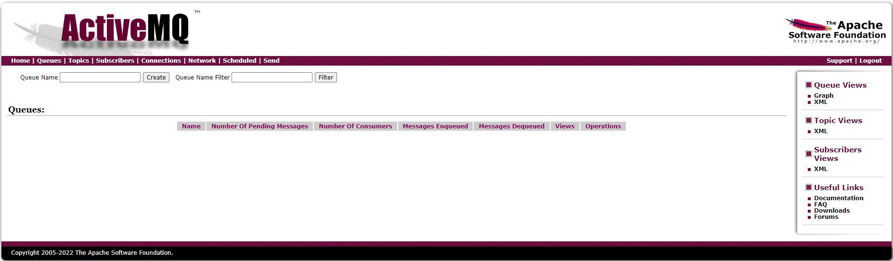

# 第2章_ActiveMQ安装和控制台

## 1.ActiveMQ 安装

**官方下载**

官网地址： http://activemq.apache.org/


> 注意 activeMQ 的版本！

**安装步骤**

- 上传安装包到 opt 目录

- 解压

  ```bash
  tar -zxvf apache-activemq-5.16.5-bin.tar.gz
  ```

- 复制到`/usr/local/`目录

  ```bash
  mkdir /usr/local/activemq
  cp -r apache-activemq-5.16.5 /usr/local/activemq/
  ```

- 修改默认 host

  ```bash
  vim apache-activemq-5.16.5/conf/jetty.xml
  <bean id="jettyPort" class="org.apache.activemq.web.WebConsolePort" init-method="start">
               <!-- the default port number for the web console -->
           # 将 host 改为 0.0.0.0
          <property name="host" value="0.0.0.0"/>
          <property name="port" value="8161"/>
      </bean>
  
  ```

- 开启 activemq

  ```bash
  [root@myServer1 bin]# ./activemq start
  INFO: Loading '/usr/local/activemq/apache-activemq-5.17.1//bin/env'
  INFO: Using java '/opt/module/jdk1.8.0_212/bin/java'
  INFO: Starting - inspect logfiles specified in logging.properties and log4j.properties to get details
  INFO: pidfile created : '/usr/local/activemq/apache-activemq-5.17.1//data/activemq.pid' (pid '13182')
  ```

- 关闭 activemq

  ```bash
  [root@myServer1 bin]# ./activemq stop
  ```

- 查看程序启动是否成功

  ```bash
  # grep -v grep：屏蔽掉含有 grep 的结果
  ps -ef | grep activemq | grep -v grep
  
  # activemq 默认占用 61616 端口
  netstat -anp | grep 61616
  ```

**启动时指定日志输出文件**

activemq 日志默认的位置是在：`%activemq安装目录%/data/activemq.log`

启动时指定输出位置：`./activemq  start > /usr/local/activemq/activemqRun.log`

```bash
[root@myServer1 activemq]# ll
总用量 4
-rw-r--r--.  1 root root 325 5月   9 14:44 activemqRun.log
drwxr-xr-x. 10 root root 193 5月   9 14:37 apache-activemq-5.17.1
```

**设置自动启动**

（1）在`/etc/init.d/`目录增加增加 activemq 文件：

```bash
cd /etc/init.d/
vi activemq
```

注意：将下面内容全部复制。 要先安装 jdk，在下面配置 jdk 的安装目录：

```bash
#!/bin/sh
#
# /etc/init.d/activemq
# chkconfig: 345 63 37
# description: activemq servlet container.
# processname: activemq 5.14.3

# Source function library.
#. /etc/init.d/functions
# source networking configuration.
#. /etc/sysconfig/network

export JAVA_HOME=/usr/local/jdk1.8.0_131
export CATALINA_HOME=/usr/local/activemq/apache-activemq-5.14.3

case $1 in
    start)
        sh $CATALINA_HOME/bin/activemq start
    ;;
    stop)
        sh $CATALINA_HOME/bin/activemq stop
    ;;
    restart)
        sh $CATALINA_HOME/bin/activemq stop
        sleep 1
        sh $CATALINA_HOME/bin/activemq start
    ;;

esac
exit 0
```

（2）赋予文件权限

```bash
chmod 777 activemq
```

（3）设置开机启动

```bash
chkconfig activemq on
```

（4）启动 activemq

```bash
service activemq start
```

## 2.ActiveMQ控制台

（1）访问 activemq 管理页面地址：http://IP地址:8161/  

账户：admin

密码：admin

> 61616 端口用于提供 JMS 服务
>
> 8161 端口用于提供 web 可视化界面

成功后见下图：

