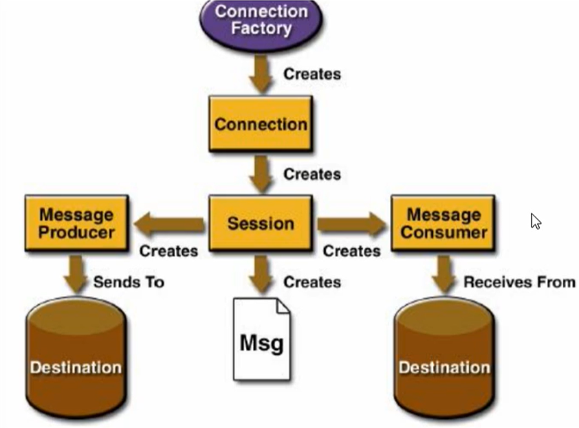
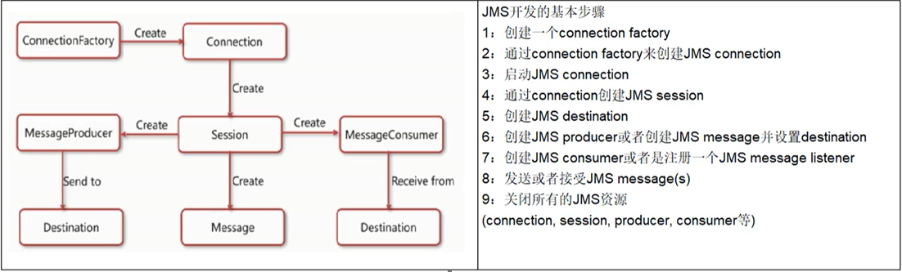
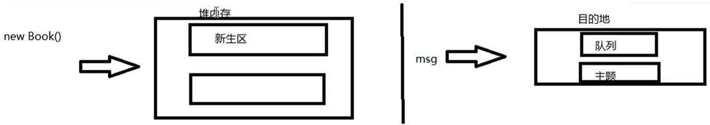
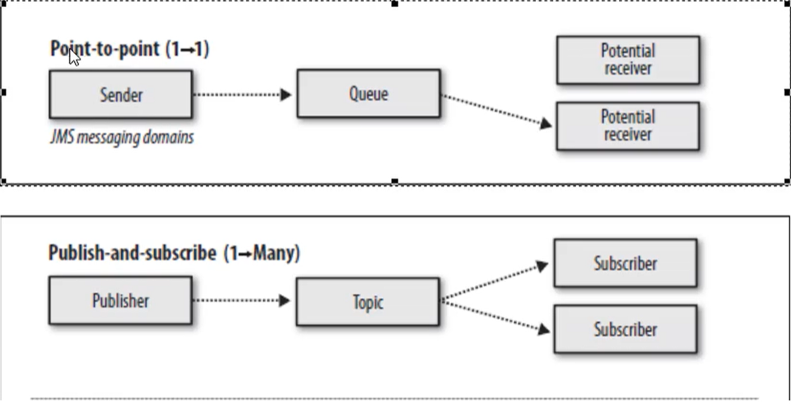
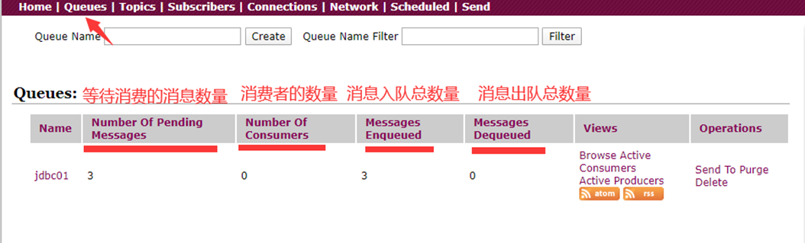
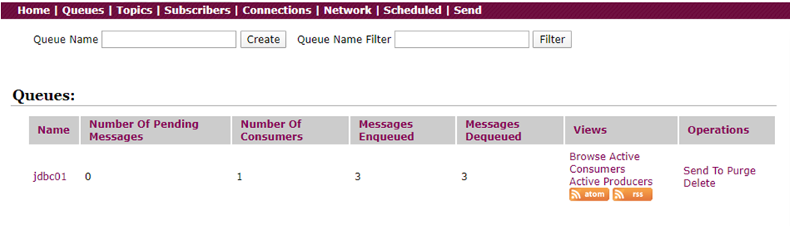
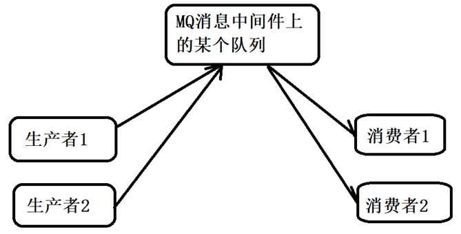
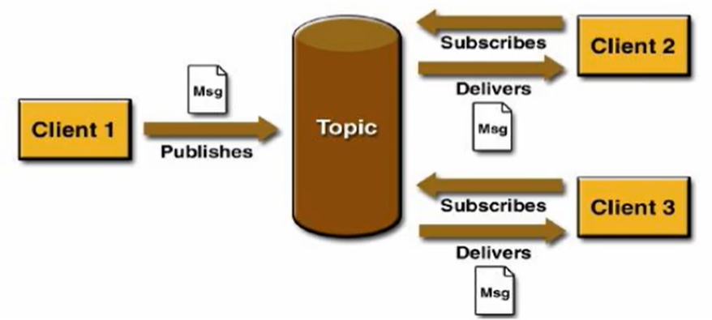
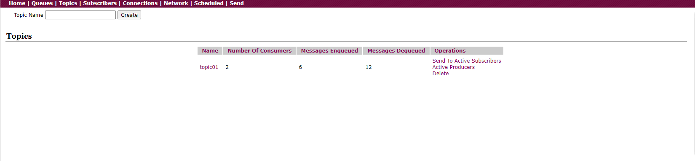

# 第3章_入门案例、MQ标准、API详解

## 1.pom.xml导入依赖

```xml
<dependencies>
  <!--  activemq  所需要的jar 包-->
  <dependency>
    <groupId>org.apache.activemq</groupId>
    <artifactId>activemq-all</artifactId>
    <version>5.15.9</version>
  </dependency>
  <!--  activemq 和 spring 整合的基础包 -->
  <dependency>
    <groupId>org.apache.xbean</groupId>
    <artifactId>xbean-spring</artifactId>
    <version>3.16</version>
  </dependency>
</dependencies>
```

## 2.JMS编码总体规范



**JMS 开发步骤**



## 3.Destination简介

Destination 是目的地。下面拿 jvm 和 mq，做个对比。目的地，我们可以理解为是数据存储的地方。



Destination 分为两种：队列和主题。



## 4.队列消息

### 4.1 生产者的入门案例

```java
public class JmsProduce {

    public static final String ACTIVEMQ_URL = "tcp://192.168.11.101:61616";
    public static final String QUEUE_NAME = "queue01";

    public static void main(String[] args) throws JMSException {
        // 1.创建连接工厂，按照给定的url地址，采用默认用户名和密码
        ActiveMQConnectionFactory activeMQConnectionFactory = new ActiveMQConnectionFactory(ACTIVEMQ_URL);
        // 2.获得连接connection并启动
        Connection connection = activeMQConnectionFactory.createConnection();
        connection.start();
        // 3.创建会话session，第一个为事务，第二个为签收
        Session session = connection.createSession(false, Session.AUTO_ACKNOWLEDGE);
        // 4.创建目的地（队列or主题）
        Queue queue = session.createQueue(QUEUE_NAME);
        // 5.创建消息生产者
        MessageProducer producer = session.createProducer(queue);
        // 6.通过使用消息生产者生产3条消息发送到MQ队列中
        for (int i = 0; i < 3; i++) {
            // 7.创建消息
            TextMessage textMessage = session.createTextMessage("msg---" + i);
            // 8.通过消息生产者发送给MQ
            producer.send(textMessage);
        }
        // 9.关闭资源
        producer.close();
        session.close();
        connection.close();

        System.out.println("******消息发布完成******");

    }
}
```

**控制台**

运行上面代码，控制台显示如下：



- `Number Of Pending Messages`：等待消费的消息，这个是未出队列的数量，公式 = 总接收数 - 总出队列数
- `Number Of Consumers`：消费者数量，消费者端的消费者数量
- `Messages Enqueued`：进队消息数，进队列的总消息量，包括出队列的。这个数只增不减
- `Messages Dequeued`：出队消息数，可以理解为是消费者消费掉的数量

> 总结：
>
> 当有一个消息进入这个队列时，等待消费的消息是 1，进入队列的消息是 1。当消息消费后，等待消费的消息是 0，进入队列的消息是 1，出队列的消息是 1。当再来一条消息时，等待消费的消息是1，进入队列的消息就是2。

### 4.2 消费者的入门案例

```java
public class JmsConsumer {

    public static final String ACTIVEMQ_URL = "tcp://192.168.11.101:61616";
    public static final String QUEUE_NAME = "queue01";

    public static void main(String[] args) throws JMSException {
        // 1.创建连接工厂，按照给定的url地址，采用默认用户名和密码
        ActiveMQConnectionFactory activeMQConnectionFactory = new ActiveMQConnectionFactory(ACTIVEMQ_URL);
        // 2.获得连接connection并启动
        Connection connection = activeMQConnectionFactory.createConnection();
        connection.start();
        // 3.创建会话session，第一个为事务，第二个为签收
        Session session = connection.createSession(false, Session.AUTO_ACKNOWLEDGE);
        // 4.创建目的地（队列or主题）
        Queue queue = session.createQueue(QUEUE_NAME);
        // 5.创建消息消费者
        MessageConsumer consumer = session.createConsumer(queue);
        while(true) {
            // receive()：一直等待接收消息，在能够接收到消息之前将一直阻塞，是同步阻塞方式，和socket的accept方法类似的
            // receive(Long time)：等待n毫秒之后还没有收到消息，就结束阻塞
            // 因为消息发送者是 TextMessage，所以消息接受者也要是TextMessage
            TextMessage textMessage = (TextMessage)consumer.receive();
            if (textMessage != null) {
                System.out.println("******消费者接收到消息：" + textMessage.getText());
            } else {
                break;
            }
        }

        consumer.close();
        session.close();
        connection.close();
    }
}
```

控制台显示：



### 4.3 异步监听式消费者（MessageListener）

```java
...
// 通过监听的方式来消费消息，是异步非阻塞的方式消费消息。
// 通过messageConsumer的setMessageListener注册一个监听器，当有消息发送来时，系统自动调用MessageListener的onMessage方法处理消息
consumer.setMessageListener(new MessageListener() {
    @Override
    public void onMessage(Message message) {
        if (null != message && message instanceof TextMessage) {
            TextMessage textMessage = (TextMessage) message;
            try {
                System.out.println("******消费者接收到消息：" + textMessage.getText());
            } catch (JMSException e) {
                e.printStackTrace();
            }
        }
    }
});

// 让主线程不要结束。因为一旦主线程结束了，其他的线程（如此处的监听消息的线程）也都会被迫结束。
// 实际开发中，我们的程序会一直运行，这句代码都会省略。
System.in.read();
consumer.close();
session.close();
connection.close();
```

### 4.4 队列消息（Queue）总结

**两种消费方式**

- `同步阻塞方式（receive）`

  订阅者或接收者抵用 MessageConsumer 的 receive() 方法来接收消息，receive 方法在能接收到消息之前（或超时之前）将一直阻塞。

- `异步非阻塞方式（监听器 onMessage()）`

  订阅者或接收者通过 MessageConsumer 的 setMessageListener(MessageListener listener) 注册一个消息监听器，当消息到达之后，系统会自动调用监听器 MessageListener 的 onMessage(Message message) 方法。

**队列的特点**

点对点消息传递域的特点如下：

- 每个消息只能有一个消费者，类似 1 对 1 的关系
- 消息的生产者和消费者之间没有时间上的相关性，无论消费者在生产者发送消息的时候是否处于运行状态，消费者都可以提取消息
- 消息被消费后队列中不会再存储，所以消费者不会消费已经被消费掉的消息

**消息消费情况**



当同时有多个消费者在线时，会依次轮询传递消息。

## 5.主题消息

### 5.1 topic介绍

在发布订阅消息传递域中，目的地被称为主题（topic）。

发布/订阅消息传递域的特点如下：

- 生产者将消息发布到 topic 中，每个消息可以有多个消费者，属于 1：N 的关系
- 生产者和消费者之间有时间上的相关性。订阅某一个主题的消费者只能消费自它订阅之后发布的消息
- 生产者生产时，topic `不保存消息`它是`无状态`的不落地，假如无人订阅就去生产，那就是一条废消息，所以，一般`先启动消费者再启动生产者`

默认情况下如上所述，但是 JMS 规范允许客户创建持久订阅，这在一定程度上放松了时间上的相关性要求。持久订阅允许消费者消费它在未处于激活状态时发送的消息。



### 5.2 生产者案例

```java
public class JmsProduce {

    public static final String ACTIVEMQ_URL = "tcp://192.168.11.101:61616";
    public static final String TOPIC_NAME = "topic01";

    public static void main(String[] args) throws JMSException {
        ActiveMQConnectionFactory activeMQConnectionFactory = new ActiveMQConnectionFactory(ACTIVEMQ_URL);
        Connection connection = activeMQConnectionFactory.createConnection();
        connection.start();
        Session session = connection.createSession(false, Session.AUTO_ACKNOWLEDGE);
        
        // 创建目的地（主题）
        Topic topic = session.createTopic(TOPIC_NAME);

        MessageProducer producer = session.createProducer(topic);
        for (int i = 0; i < 6; i++) {
            TextMessage textMessage = session.createTextMessage("msg---" + i);
            producer.send(textMessage);
        }
        producer.close();
        session.close();
        connection.close();

        System.out.println("******消息发布完成******");

    }
}
```

### 5.3 消费者案例

```java
public class JmsConsumer {

    public static final String ACTIVEMQ_URL = "tcp://192.168.11.101:61616";
    public static final String TOPIC_NAME = "topic01";

    public static void main(String[] args) throws JMSException, IOException {
        ActiveMQConnectionFactory activeMQConnectionFactory = new ActiveMQConnectionFactory(ACTIVEMQ_URL);
        Connection connection = activeMQConnectionFactory.createConnection();
        connection.start();
        Session session = connection.createSession(false, Session.AUTO_ACKNOWLEDGE);

        // 创建目的地（主题）
        Topic topic = session.createTopic(TOPIC_NAME);

        MessageConsumer consumer = session.createConsumer(topic);
        consumer.setMessageListener(message -> {
            if (null != message && message instanceof TextMessage) {
                TextMessage textMessage = (TextMessage) message;
                try {
                    System.out.println("******消费者接收到消息：" + textMessage.getText());
                } catch (JMSException e) {
                    e.printStackTrace();
                }
            }
        });
        System.in.read();
        consumer.close();
        session.close();
        connection.close();
    }
}
```

存在多个消费者时，每个消费者都能收到从自己启动后所有生产的消息。

### 5.4 ActiveMQ控制台

topic有多个消费者时，消费消息的数量 ≈ 在线消费者数量 * 生产消息的数量。

下图展示了：我们先启动了 2 个消费者，再启动一个生产者，并生产了 6 条消息，最终出队列的有 2 * 6 = 12 条消息。



## 6.topic和queue对比

|  比较项目  |                        Topic 模式队列                        |                        Queue 模式队列                        |
| :--------: | :----------------------------------------------------------: | :----------------------------------------------------------: |
|  工作模式  | "订阅-发布"模式，如果当前没有订阅者，消息将会被丢弃，如果有多个订阅者，那么这些订阅者都会收到消息 | "负载均衡"模式，如果当前没有消费者，消息也不回丢弃；如果有多个消费者，那么一条消息也只会发送给其中一个消费者，并且要求消费者 ack 信息 |
|  有无状态  |                            无状态                            | Queue 数据默认会在 MQ 服务器上以文件形式保存，比如 Active MQ 一般保存在`$AMQ_HOME/data/kr-store/data`下面。也可以配置成 DB 存储 |
| 传递完整性 |                 如果没有订阅者，消息会被丢弃                 |                         消息不回丢弃                         |
|  处理效率  | 由于消息要按照订阅者的数量进行复刻，所以处理性能会随着订阅者的增加而明显降低，并且还要结合不同消息协议自身的性能差异 | 由于一条消息只发送给一个消费者，所以就算消费者再多，性能也不会有明显降低。当然不同消息协议的具体性能也是有差异的 |