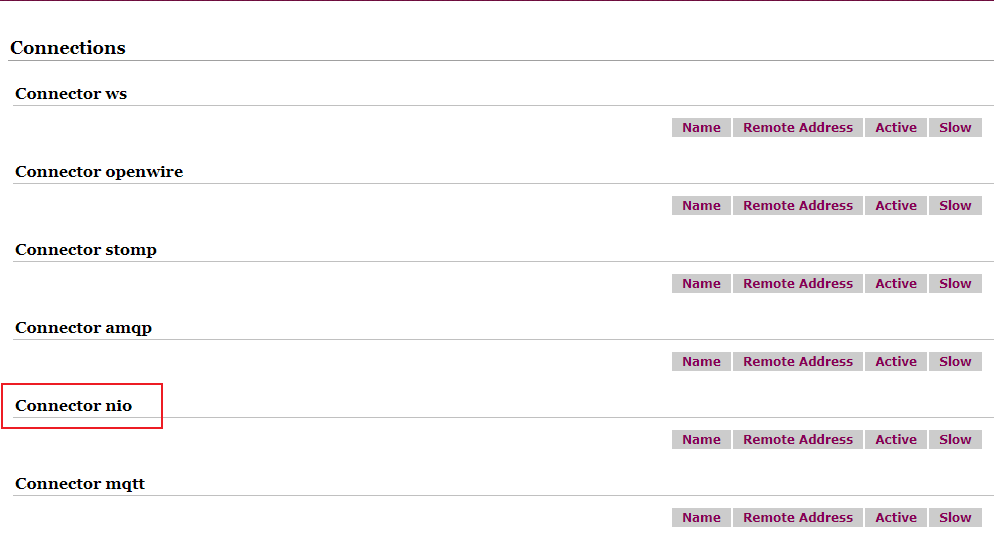

# 第6章_ActiveMQ的传输协议

## 1.简介

ActiveMQ 支持的 client-broker 通讯协议有：TVP、NIO、UDP、SSL、HTTP(S)、VM。其中配置 Transport Connector 的文件在 ActiveMQ 安装目录的`conf/activemq.xml`中的<transportConnectors>标签之内。

activemq 传输协议的官方文档：http://activemq.apache.org/configuring-version-5-transports.html

这些协议参见文件：`%activeMQ安装目录%/conf/activemq.xml`，下面是文件的重要的内容。

```xml
<transportConnectors>
    <transportConnector name="openwire" uri="tcp://0.0.0.0:61616?maximumConnections=1000&amp;wireFormat.maxFrameSize=104857600"/>
    <transportConnector name="amqp" uri="amqp://0.0.0.0:5672?maximumConnections=1000&amp;wireFormat.maxFrameSize=104857600"/>
    <transportConnector name="stomp" uri="stomp://0.0.0.0:61613?maximumConnections=1000&amp;wireFormat.maxFrameSize=104857600"/>
    <transportConnector name="mqtt" uri="mqtt://0.0.0.0:1884?maximumConnections=1000&amp;wireFormat.maxFrameSize=104857600"/>
    <transportConnector name="ws" uri="ws://0.0.0.0:61614?maximumConnections=1000&amp;wireFormat.maxFrameSize=104857600"/>
</transportConnectors>
```

在上文给出的配置信息中，URI 描述信息的头部都是采用协议名称：例如：

- 描述 amqp 协议的监听端口时，采用的 URI 描述格式为`amqp://······`

- 描述 stomp 协议的监听端口时，采用 URI 描述格式为`stomp://······`

- 唯独在进行 openwire 协议描述时，URI 头却采用的“tcp://······”，这是因为 tcp 在网络传输前需要序列化数据，消息通过一个叫 wire protocol 的来序列化成字节流，默认情况下 ActiveMQ 把 wire protocol 叫做 OpenWire，目的是促使网络上的效率和数据快速交互

## 2.支持的传输协议

个人说明：除了 tcp 和 nio 协议，其他的了解就行。各种协议有各自擅长该协议的中间件，工作中一般不会使用 activemq 去实现这些协议。如： mqtt 是物联网专用协议，采用的中间件一般是 mosquito。ws 是 websocket 的协议，是和前端对接常用的，一般在 java 代码中内嵌一个基站（中间件）。stomp 好像是邮箱使用的协议的，各大邮箱公司都有基站（中间件）。

注意：协议不同，我们的代码都会不同。

| 协议    | 描述                                                         |
| ------- | ------------------------------------------------------------ |
| TCP     | 默认的协议，性能相对可以                                     |
| NIO     | 基于 TCP 协议之上的，进行了扩展和优化，具有更好的扩展性      |
| UDP     | 性能比 TCP 更好，但是不具有可靠性                            |
| SSL     | 安全链接                                                     |
| HTTP(S) | 基于 HTTP 或者 HTTPS                                         |
| VM      | VM 本身不是协议，当客户端和代理在同一个 JAVA 虚拟机（VM）中运行时，他们之间需要通信，但不想占用网络通道，而是直接通信，可以使用该方式 |

### 2.1 TCP协议

（1）Transmission Control Protocol(TCP) 是默认的。TCP 的 Client 监听端口 61616

（2）在网络传输数据前，必须要先序列化数据，消息是通过一个叫 wire protocol 的来序列化成字节流

（3）TCP 连接的 URI 形式如：tcp://HostName:port?key=value&key=value，后面的参数是可选的

（4）TCP传输的的优点：

- TCP 协议传输可靠性高，稳定性强
- 高效率：字节流方式传递，效率很高
- 有效性、可用性：应用广泛，支持任何平台

关于 Transport 协议的可选配置参数可以参考官网http://activemq.apache.org/tcp-transport-reference

### 2.2 NIO协议

（1）New I/O API Protocol(NIO)

（2）NIO 协议和 TCP 协议类似，但 NIO 更侧重于底层的访问操作。它允许开发人员对同一资源可有更多的 client 调用和服务器端有更多的负载

（3）适合使用 NIO 协议的场景：

可能有大量的 Client 去连接到 Broker 上，一般情况下，大量的 Client 去连接 Broker 是被操作系统的线程所限制的。因此，NIO 的实现比 TCP 需要更少的线程去运行，所以建议使用 NIO 协议。

可能对于 Broker 有一个很迟钝的网络传输，NIO 比 TCP 提供更好的性能。

（4）NIO 连接的 URI 形式：nio://hostname:port?key=value&key=value

（5）关于 Transport 协议的可选配置参数可以参考官网http://activemq.apache.org/configuring-version-5-transports.html

> ### he NIO Transport
>
> Same as the TCP transport, except that the [New I/O (NIO)](http://en.wikipedia.org/wiki/New_I/O) package is used, which may provide better performance. The Java NIO package should not be confused with IBM’s [AIO4J](http://java.sys-con.com/read/46658.htm) package.
>
> To switch from TCP to NIO, simply change the scheme portion of the URI. Here’s an example as defined within a broker’s XML configuration file.
>
> ```xml
> <broker>
>   ...
>   <transportConnectors>
>     <transportConnector name="nio" uri="nio://0.0.0.0:61616"/>  
>   </<transportConnectors>
>   ...
> </broker>
> ```
>
> Trying to use nio transport url on the client side will instantiate the regular TCP transport. For more information see the [NIO Transport Reference](https://activemq.apache.org/nio-transport-reference)

### 2.3 AMQP协议

即 Advanced Message Queuing Protocol，一个提供统一消息服务的应用层标准高级消息队列协议，是应用层协议的一个开放标准，为面向消息的中间件设计。基于此协议的客户端与消息中间件可传递消息，并不受客户端 / 中间件不同产品，不同开发语言等条件的限制。

> ActiveMQ supports the [AMQP 1.0](https://www.oasis-open.org/committees/tc_home.php?wg_abbrev=amqp) protocol which is an OASIS standard.
>
> > **Availability**
> >
> > Available from ActiveMQ version [5.8](https://activemq.apache.org/activemq-580-release) onward.
>
> ### Enabling the ActiveMQ Broker for AMQP
>
> To enable AMQP protocol support on the broker add the following transport connector configuration referencing the `amqp` scheme in its URI:
>
> ```xml
> <transportConnectors>
>    <transportConnector name="amqp" uri="amqp://0.0.0.0:5672"/>
> </transportConnectors>
> ```
>
> It is enabled in the default ActiveMQ server configuration. For more help see [Run Broker](https://activemq.apache.org/run-broker).

### 2.4 STOMP协议

STOMP，Steaming Text Orientated Message Protocol，是流文本定向消息协议，是一种为 MOM（Message Oriented Middleware，面向消息的中间件）设计的简单文本协议。

> ActiveMQ supports the [Stomp](http://stomp.github.com/) protocol and the Stomp - JMS mapping. This makes it easy to write a client in pure [Ruby](https://activemq.apache.org/stomp#), [Perl](https://activemq.apache.org/stomp#), [Python](https://activemq.apache.org/stomp#) or [PHP](https://activemq.apache.org/stomp#) for working with ActiveMQ.
>
> Please see the [Stomp site](http://stomp.github.io/) for more details
>
> Spec Compliance
>
> ActiveMQ v5.6 implements the Stomp v1.1 spec except for allowing spaces at the beginning or end of message header keys, they are preserved in the header values however. In future releases this will not be the case, clients should be updated and user code checked to ensure that spaces in the headers are there intentionally and not as a accident or a client “feature”.
>
> ### Enabling the ActiveMQ Broker for Stomp
>
> To enable STOMP protocol support in the broker add a transport connector definition whose URI scheme is `stomp`.
>
> Example:
>
> ```xml
> <transportConnectors>
>    <transportConnector name="stomp" uri="stomp://localhost:61613"/>
> </transportConnectors>
> ```
>
> To see a full example, try [this XML](http://svn.apache.org/repos/asf/activemq/trunk/assembly/src/release/example/conf/activemq.xml). If you save that XML as `foo.xml` then you can run stomp via the command line as
>
> ```
> activemq xbean:foo.xml
> ```
>
> For more help see [Run Broker](https://activemq.apache.org/run-broker).

### 2.5 Secure Sockets Layer Protocol(SSL)

连接的 URL 形式：`ssl'//hostname:port?key=value`

示例：

```xml
<transportConnectors>
   <transportConnector name="ssl" uri="ssl://localhost:61618?trace=true"/>
</transportConnectors>
```

### 2.6 MQTT协议

MQTT（Message Queuing Telemetry Transport，消息队列遥测传输）是 IBM 开发的一个即时通讯协议，有可能成为物联网的重要组成部分。该协议支持所有平台，几乎可以把所有联网物品和外部连结起来，被用来当作传感器和致动器（比如通过 Twitter 让房屋联网）的通讯协议。

> ActiveMQ supports the [MQTT](http://mqtt.org/) protocol and will automatically map between JMS/NMS and MQTT clients. MQTT is a machine-to-machine (M2M) publish/subscribe messaging transport.
>
> Please see the [MQTT site](http://mqtt.org/) for more details
>
> ### Supported versions
>
> ActiveMQ supports MQTT [v3.1.1](http://docs.oasis-open.org/mqtt/mqtt/v3.1.1/os/mqtt-v3.1.1-os.html) and [v3.1](https://public.dhe.ibm.com/software/dw/webservices/ws-mqtt/mqtt-v3r1.html).
>
> ### Enabling the ActiveMQ Broker for MQTT
>
> Its very easy to enable ActiveMQ for MQTT. Just add a connector to the broker using the MQTT URL.
>
> ```xml
> <transportConnectors>
>    <transportConnector name="mqtt" uri="mqtt://localhost:1883"/>
> </transportConnectors>
> ```

参考<a href="https://github.com/fusesource/mqtt-client">github</a>

### 2.7 WS协议

> Besides [Ajax](https://activemq.apache.org/ajax) API, starting with version **5.4.0** onwards, you can use HTML5 [WebSockets](http://dev.w3.org/html5/websockets/) to exchange messages with the broker from your browser.
>
> HTML 5 introduced web sockets, as a standardized way to communicate asynchronously with the server from a web page. This is practically an ideal channel for implementing asynchronous messaging for web pages. Since JavaScript easily handles text and JSON formatted data, [Stomp](http://activemq.apache.org/stomp/) protocol is a good choice for the wire protocol to be used over web sockets. Since version **5.9.0**, we also support efficient binary MQTT protocol over Web sockets.
>
> This solution should bring better messaging capabilities to JavaScript clients then simple Ajax API, as implementing Stomp or MQTT in JavaScript brings much more messaging-oriented API and features such as transactions, for example.
>
> # Configuration
>
> ActiveMQ comes with *WebSocket* transport which implements Stomp over WebSockets functionality.
>
> To configure it, you need to place something like this to your ActiveMQ configuration file
>
> ```xml
> <transportConnectors>
>   <transportConnector name="websocket" uri="ws://0.0.0.0:61614"/>
> </transportConnectors>
> ```
>
> One thing worth noting is that web sockets (just as Ajax) implements the *same origin policy*, so you can access only brokers running on the same host as the web application running the client.

## 3.NIO协议案例

ActiveMQ 这些协议传输的底层默认都是使用 BIO 网络的 IO 模型。只有当我们指定使用 NIO 才使用 NIO 的 IO 模型。

**（1）修改配置文件activemq.xml**

- 修改配置文件 activemq.xml 在`<transportConnectors>`节点下添加如下内容：

  ```xml
  <transportConnector name="nio" uri="nio://0.0.0.0:61618?trace=true" />
  ```

  如果不特别指定 ActiveMQ 的网络监听端口，那么这些端口都将使用 BIO 网络 IO 模型（OpenWire、STOMP、AMQP）。所以为了首先提高单节点的网络吞吐性能，我们需要明确指定 Active 的网络 IO 模型。

  URI 格式头以`nio`开头，表示这个端口使用以 TCP 协议为基础的 NIO 网络 IO 模型。

- 修改完成后重启 activemq：

  ```bash
  service activemq restart
  ```

- 查看管理后台，可以看到页面多了 NIO

  

**（2）代码**

只需修改相应的 URL 即可。

```java
private static final String ACTIVEMQ_URL = "nio://118.24.20.3:61618";
```

## 4.NIO协议案例增强

**（1）目的**

URI 格式头以`nio`开始，表示这个端口使用以 TCP 协议为基础的 NIO 网络 IO 模型，但是这样的设置方式只能使这个端口支持 openwire 协议。那么我们怎么既让这个端口支持 NIO 网络 IO 模型，又让他支持多个协议呢？

解决方案

- 使用`auto`关键字

  > tarting with version 5.13.0, ActiveMQ supports wire format protocol detection.  OpenWire, STOMP, AMQP, and MQTT can be automatically detected.  This allows one transport to be shared for all 4 types of clients.
  >
  > ### Enabling AUTO over NIO
  >
  > To configure ActiveMQ auto wire format detection over an NIO TCP connection use the `auto+nio` transport prefix. For example, add the following transport configuration in your XML file:
  >
  > ```xml
  > <transportConnector name="auto+nio" uri="auto+nio://localhost:5671"/>
  > ```

- 使用`+`符号来为端口设置多种特性

```xml
<!-- 
auto: 针对所有的协议，他会识别我们是什么协议
nio：使用NIO网络IO模型
修改配置文件后重启activemq
-->
<transportConnector name="auto+nio" uri="auto+nio://0.0.0.0:61608?maximumConnections=1000&amp;wireFormat.maxFrameSize=104857600&amp;org.apache.activemq.transport.nio.SelectorManager.corePoolSize=20&amp;org.apache.activemq.transport.nio.Se1ectorManager.maximumPoo1Size=50"/>
```

代码端只需修改 URL 的相应协议即可。

```java
// 使用nio模型的tcp协议
private static final String ACTIVEMQ_URL = "tcp://118.24.20.3:61608";
// 使用nio模型的nio协议
private static final String ACTIVEMQ_URL = "nio://118.24.20.3:61608";
```

