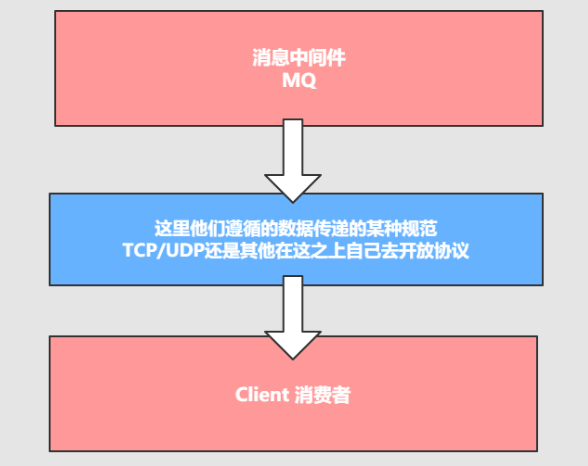
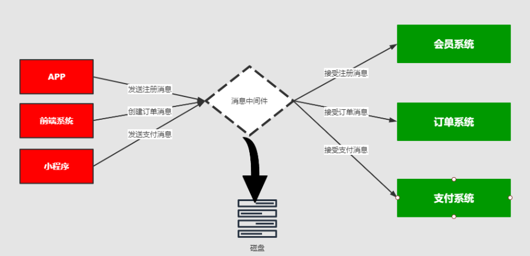
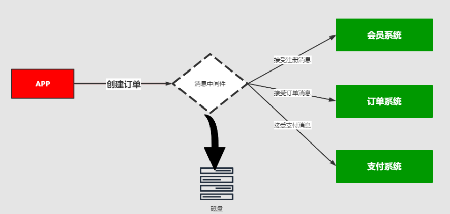
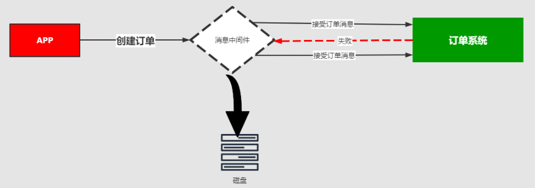
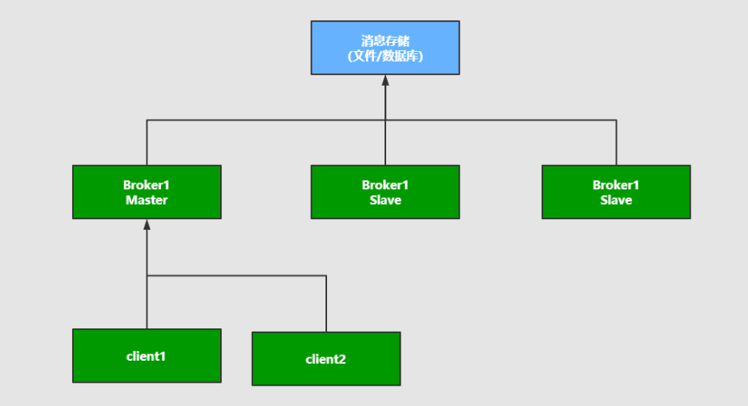
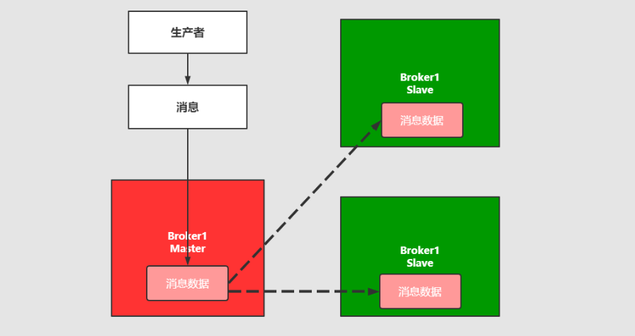
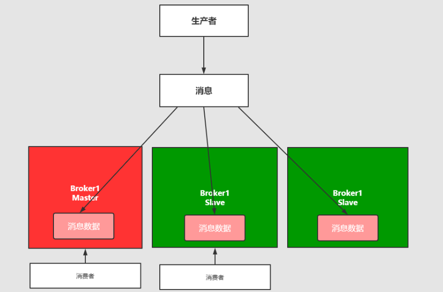
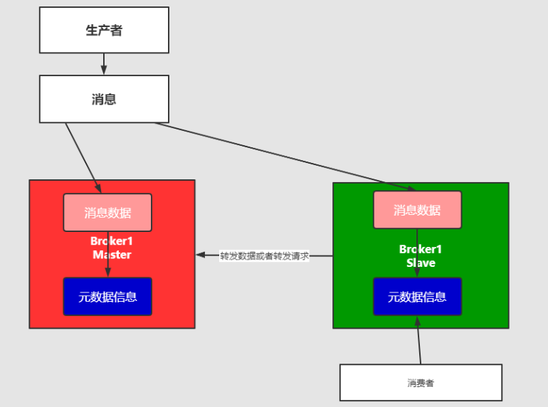
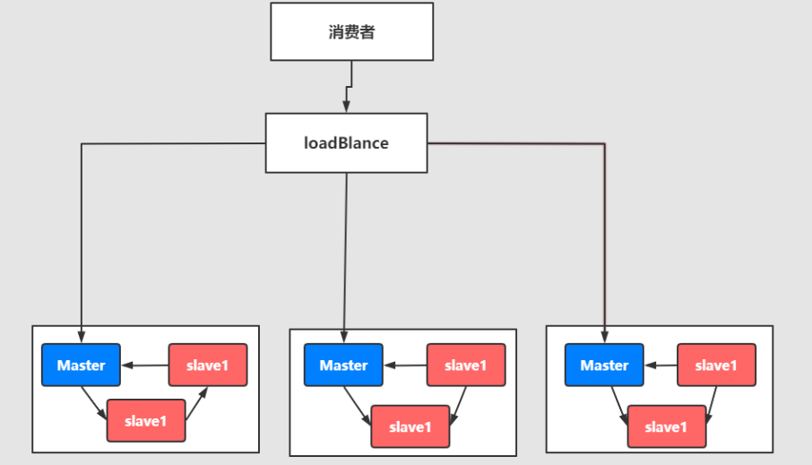

# 第2章_消息队列

## 1.消息队列协议

### 1.1 什么是协议

我们知道消息中间件负责数据的**传递**、**存储**、和**分发消费**三个部分，数据的存储和分发的过程中肯定要遵循某种约定成俗的规范，不论是`TCP/IP`，`UDP`协议还是其他的自己构建等，而这些约定成俗的规范就称之为**协议**。

> 所谓协议是指：
>
> - 计算机底层操作系统和应用程序通讯时共同遵守的一组约定，只有遵循共同的约定和规范，系统和底层操作系统之间才能相互交流
> - 和一般的网络应用程序的不同它主要负责数据的接受和传递，所以性能比较的高
> - 协议对数据格式和计算机之间交换数据都必须严格遵守规范

### 1.2 网络协议的三要素

- 语法：语法是用户数据与控制信息的结构与格式，以及数据出现的顺序
- 语义：语义是解释控制信息每个部分的意义，它规定了需要发出何种控制信息，以及完成的动作与做出什么样的响应
- 时序：时序是对事件发生顺序的详细说明

比如我MQ发送一个信息，是以什么数据格式发送到队列中，然后每个部分的含义是什么，发送完毕以后的执行的动作，以及消费者消费消息的动作，消费完毕的响应结果和反馈是什么，然后按照对应的执行顺序进行处理。如果你还是不理解：大家每天都在接触的http请求协议:

> - 语法：http 规定了请求报文和响应报文的格式
> - 语义：客户端主动发起请求称之为请求。（这是一种定义，同时你发起的是 post/get 请求）
> - 时序：一个请求对应一个响应。（一定先有请求在有响应，这个是时序）

而消息中间件采用的并不是 http 协议，而常见的消息中间件协议有：OpenWire、AMQP、MQTT、Kafka，OpenMessage 协议。

> 面试题：为什么消息中间件不直接使用 http 协议呢？
>
> - 因为 http 请求报文头和响应报文头是比较复杂的，包含了 cookie，数据的加密解密，状态码，响应码等附加的功能，但是对于一个消息而言，我们并不需要这么复杂，也没有这个必要性，它其实就是负责数据传递，存储，分发就行，一定要追求的是高性能。尽量简洁，快速。
> - 大部分情况下 http 大部分都是**短链接**，在实际的交互过程中，一个请求到响应很有可能会中断，中断以后就不会就行持久化，就会造成请求的丢失。这样就不利于消息中间件的业务场景，因为消息中间件可能是一个长期的获取消息的过程，出现问题和故障要对数据或消息就行持久化等，目的是为了保证消息和数据的高可靠和稳健的运行。

### 1.3 AMQP协议

AMQP：(全称：Advanced Message Queuing Protocol）是高级消息队列协议。由摩根大通集团联合其他公司共同设计。是一个提供统一消息服务的应用层标准高级消息队列协议，是应用层协议的一个开放标准，为面向消息的中间件设计。基于此协议的客户端与消息中间件可传递消息，并不受客户端 / 中间件不同产品，不同的开发语言等条件的限制。Erlang 中的实现有 RabbitMQ 等。

**特性**

- 分布式事务支持
- 消息的持久化支持
- 高性能和高可靠的消息处理优势

AMQP 协议的支持者：RabbitMQ & ActiveMQ

### 1.4 MQTT协议

MQTT 协议：（Message Queueing Telemetry Transport）消息队列是 IBM 开放的一个即时通讯协议，物联网系统架构中的重要组成部分。
特点：

- 轻量
- 结构简单
- 传输快，不支持事务
- 没有持久化设计

应用场景：

- 适用于计算能力有限
- 低带宽
- 网络不稳定的场景

支持者：RabbitMQ & ActiveMQ

### 1.5 OpenMessage协议

是近几年由阿里、雅虎和滴滴出行、Stremalio 等公司共同参与创立的分布式消息中间件、流处理等领域的应用开发标准。

特点：

- 结构简单
- 解析速度快
- 支持事务和持久化设计

支持者：Apache RocketMQ

### 1.6 Kafka协议

Kafka 协议是基于 TCP/IP 的二进制协议。消息内部是通过长度来分割，由一些基本数据类型组成。

特点是：

- 结构简单
- 解析速度快
- **无事务支持**
- 有持久化设计

### 1.7 小结

所有的中间件技术都是在**tcp/ip**协议基础之上构建的一种新型的的规范和机制，它的主要目的可以让客户端（应用程序 java，go）进行沟通和通讯。并且这种协议下规范必须具有持久性，高可用，高可靠的性能。

## 2.消息队列持久化

### 2.1 持久化

简单来说就是将数据存入磁盘，而不是存在内存中随服务器重启断开而消失，使数据能够永久保存。

### 2.2 常见的持久化方式

|          | ActiveMQ | RabbitMQ | Kafka | RocketMQ |
| -------- | -------- | -------- | ----- | -------- |
| 文件存储 | 支持     | 支持     | 支持  | 支持     |
| 数据库   | 支持     | /        | /     | /        |

## 3.消息的分发策略

### 3.1 消息的分发策略

MQ 消息队列有如下几个角色：

- 生产者
- 存储消息
- 消费者

那么生产者生成消息以后，MQ 进行存储，消费者是如何获取消息的呢？一般获取数据的方式无外乎推（push）或者拉（pull）两种方式，典型的 git 就有推拉机制，我们发送的 http 请求就是一种典型的拉取数据库数据返回的过程。而消息队列 MQ 是一种推送的过程，而这些推机制会适用到很多的业务场景也有很多对应推机制策略。

### 3.2 场景分析一

比如我在 APP 上下了一个订单，我们的系统和服务很多，我们如何得知这个消息被那个系统或者那些服务或者系统进行消费，那这个时候就需要一个分发的策略。这就需要消费策略。或者称之为消费的方法论。

### 3.3 场景分析二

> 在发送消息的过程中可能会出现异常，或者网络的抖动，故障等等因为造成消息的无法消费，比如用户在下订单，消费 MQ 接受，订单系统出现故障，导致用户支付失败，那么这个时候就需要消息中间件就必须支持消息重试机制策略。也就是支持：出现问题和故障的情况下，消息不丢失还可以进行重发。

### 3.4 消息分发策略的机制和对比

|          | ActiveMQ | RabbitMQ | Kafka | RocketMQ |
| -------- | -------- | -------- | ----- | -------- |
| 发布订阅 | 支持     | 支持     | 支持  | 支持     |
| 轮询分发 | 支持     | 支持     | 支持  | /        |
| 公平分发 | /        | 支持     | 支持  | /        |
| 重发     | 支持     | 支持     | /     | 支持     |
| 消息拉取 | /        | 支持     | 支持  | 支持     |

## 4.消息队列高可用和高可靠

### 4.1 什么是高可用机制

所谓高可用：是指产品在规定的条件和规定的时刻或时间内处于可执行规定功能状态的能力。

当业务量增加时，请求也过大，一台消息中间件服务器的会触及硬件（CPU，内存，磁盘）的极限，一台消息服务器你已经无法满足业务的需求，所以消息中间件必须支持集群部署。来达到高可用的目的。

### 4.2 集群模式1 - Master-slave主从共享数据的部署方式

解说：生产者讲消费发送到 Master 节点，所有的都连接这个消息队列共享这块数据区域，Master 节点负责写入，一旦 Master 挂掉，slave 节点继续服务。从而形成高可用。

### 4.3 集群模式2 - Master-slave主从同步部署方式

解释：这种模式写入消息同样在 Master 主节点上，但是主节点会同步数据到 slave 节点形成副本，和 zookeeper 或者 redis 主从机制很类同。这样可以达到负载均衡的效果，如果消费者有多个这样就可以去不同的节点就行消费，以为消息的拷贝和同步会暂用很大的带宽和网络资源。在后续的 rabbtmq 中会有使用。

### 4.4 集群模式3 - 多主集群同步部署模式

解释：和上面的区别不是特别的大，但是它的写入可以往任意节点去写入。

### 4.5 集群模式4 - 多主集群转发部署模式

解释：如果你插入的数据是 broker-1 中，元数据信息会存储数据的相关描述和记录存放的位置（队列）。

它会对描述信息也就是元数据信息进行同步，如果消费者在 broker-2 中进行消费，发现自己节点没有对应的消息，可以从对应的元数据信息中去查询，然后返回对应的消息信息，场景：比如买火车票或者黄牛买演唱会门票，比如第一个黄牛有顾客说要买的演唱会门票，但是没有但是他会去联系其他的黄牛询问，如果有就返回。

### 4.6 集群模式5 - Master-slave与Breoker-cluster组合的方案

解释：实现多主多从的热备机制来完成消息的高可用以及数据的热备机制，在生产规模达到一定的阶段的时候，这种使用的频率比较高。

这么集群模式，具体在后续的课程中会进行一个分析和讲解。他们的最终目的都是为保证：消息服务器不会挂掉，出现了故障依然可以抱着消息服务继续使用。

反正终归三句话：要么消息共享，要么消息同步，要么元数据共享。

### 4.7 什么是高可靠机制

所谓高可用是指：是指系统可以无故障低持续运行，比如一个系统突然崩溃，报错，异常等等并不影响线上业务的正常运行，出错的几率极低，就称之为：高可靠。

在高并发的业务场景中，如果不能保证系统的高可靠，那造成的隐患和损失是非常严重的。

如何保证中间件消息的可靠性呢？可以从两个方面考虑：

- 消息的传输：通过协议来保证系统间数据解析的正确性
- 消息的存储可靠：通过持久化来保证消息的可靠性