# 第4章_RabbitMQ入门

## 1.RabbitMQ的角色分类

**none**

- 不能访问 management plugin

**management：查看自己相关节点信息**

- 列出自己可以通过 AMQP 登入的虚拟机
- 查看自己的虚拟机节点 virtual hosts 的 queues、exchanges 和 bindings 信息
- 查看和关闭自己的 channels 和 connections
- 查看有关自己的虚拟机节点 virtual hosts 的统计信息，包括其他用户在这个节点 virtual hosts 中的活动信息

**Policymaker**

- 包含 management 所有权限
- 查看和创建和删除自己的 virtual hosts 所属的 policies 和 parameters 信息

**Monitoring**

- 包含 management 所有权限
- 罗列出所有的 virtual hosts，包括不能登录的 virtual hosts
- 查看其他用户的 connections 和 channels 信息
- 查看节点级别的数据如 clustering 和 memory 使用情况
- 查看所有的 virtual hosts 的全局统计信息

**Administrator**

- 最高权限
- 可以创建和删除 virtual hosts
- 可以查看，创建和删除 users
- 查看创建 permisssions
- 关闭所有用户的 connections

**具体操作的界面**

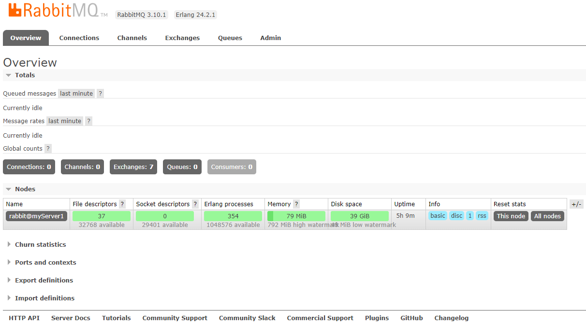

## 2.RabbitMQ入门案例-Simple简单模式

> Simple 简单模式：指定要了 queue（队列名称），没有定义路由，使用默认的交换机

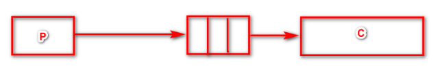

### 2.1 实现步骤

1：jdk1.8

2：构建一个 maven 工程

3：导入 rabbitmq 的 maven 依赖

4：启动 rabbitmq-server 服务

5：定义生产者

6：定义消费者

7：观察消息的在 rabbitmq-server 服务中的过程

### 2.2 构建一个maven工程

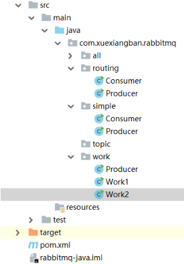

### 2.3 导入rabbitmq的maven依赖

**Java原生依赖**

```xml
<dependency>
    <groupId>com.rabbitmq</groupId>
    <artifactId>amqp-client</artifactId>
    <version>5.10.0</version>
</dependency>
```

**spring依赖**

```xml
<dependency>
    <groupId>org.springframework.amqp</groupId>
    <artifactId>spring-amqp</artifactId>
    <version>2.2.5.RELEASE</version>
</dependency>
<dependency>
    <groupId>org.springframework.amqp</groupId>
    <artifactId>spring-rabbit</artifactId>
    <version>2.2.5.RELEASE</version>
</dependency>
```

**springboot依赖**

```xml
<dependency>
    <groupId>org.springframework.boot</groupId>
    <artifactId>spring-boot-starter-amqp</artifactId>
</dependency>
```

上面根据自己的项目环境进行选择即可。

> 番外：rabbitmq 和 spring 同属一个公司开放的产品，所以他们的支持也是非常完善，这也是为什么推荐使用 rabbitmq 的一个原因。

### 2.4 启动rabbitmq-server服务

```bash
systemctl start rabbitmq-server
或者
docker start myrabbit
```

### 2.5 定义生产者

```java
public class Producer {
    
    // 所有的中间件技术都是基于tcp/ip协议基础之上构建新型的协议规范，只不过rabbitmq遵循的是amqp
    
    public static void main(String[] args) {
        // 1: 创建连接工厂
        ConnectionFactory connectionFactory = new ConnectionFactory();
        // 2: 设置连接属性
        connectionFactory.setHost("192.168.11.101");
        connectionFactory.setPort(5672);
        connectionFactory.setVirtualHost("/");
        connectionFactory.setUsername("admin");
        connectionFactory.setPassword("admin");
        Connection connection = null;
        Channel channel = null;
        try {
            // 3: 从连接工厂中获取连接
            connection = connectionFactory.newConnection("生产者");
            // 4: 从连接中获取通道channel
            channel = connection.createChannel();
            // 5: 创建交换机 exchange，设置持久化
            channel.exchangeDeclare("myExchange", "direct", true);
            // 6: 申明队列queue存储消息
            /*
     		 * 如果队列不存在，则会创建
       		 * rabbitmq 不允许创建两个相同的队列名称，否则会报错。
           	 * @params1：queue 队列的名称
             * @params2：durable 队列是否持久化
             * @params3：exclusive 是否排他，即是否私有的，如果为true，会对当前队列加锁，其他的通道不能访问，并且连接自动关闭
             * @params4：autoDelete 是否自动删除，当最后一个消费者断开连接之后是否自动删除消息。
			 * @params5：arguments 可以设置队列附加参数，设置队列的有效期，消息的最大长度，队列的消息生命周期等等。
			 */
            channel.queueDeclare("queue1", true, false, false, null);
            channel.queueBind("queue1", "myExchange", "myRoutingKey");
            // 7： 准备发送消息的内容
            String message = "你好，llp！！！";
            // 8: 发送消息给中间件 rabbitmq-server
            // @params1: 交换机 exchange，不指定则使用默认的
            // @params2: 队列名称 / routing key
            // @params3: 
            // @params4: basicProperties属性配置，可进行持久化设置：deliveryMode=2
            // @params5: 发送消息的内容
            channel.basicPublish("myExchange",
                                 "myRoutingKey",
                                 false,
                                 new AMQP.BasicProperties().builder()
                                 	.deliveryMode(2)
                                 	.contentType("text/plain")
                                 	.build(),
                                 message.getBytes());
            System.out.println("消息发送成功!");
        } catch (Exception ex) {
            ex.printStackTrace();
            System.out.println("发送消息出现异常...");
        } finally {
            // 7: 释放连接关闭通道
            if (channel != null && channel.isOpen()) {
                try {
                    channel.close();
                } catch (Exception ex) {
                    ex.printStackTrace();
                }
            }
            if (connection != null && connnection.isOpen()) {
                try {
                    connection.close();
                } catch (Exception ex) {
                    ex.printStackTrace();
                }
            }
        }
    }
}
```

> 此时若出现以下错误：
>
> ```java
> connection error; protocol method: #method<connection.close>
> ```
>
> 可以尝试修改对应用户的虚拟 host：
>
> 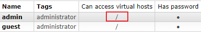

执行发送，这个时候可以在 web 控制台查看到这个队列 queue 的信息

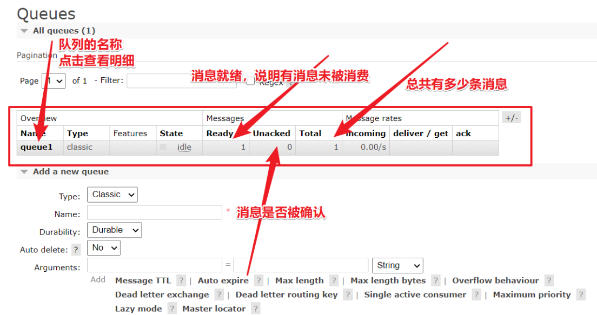

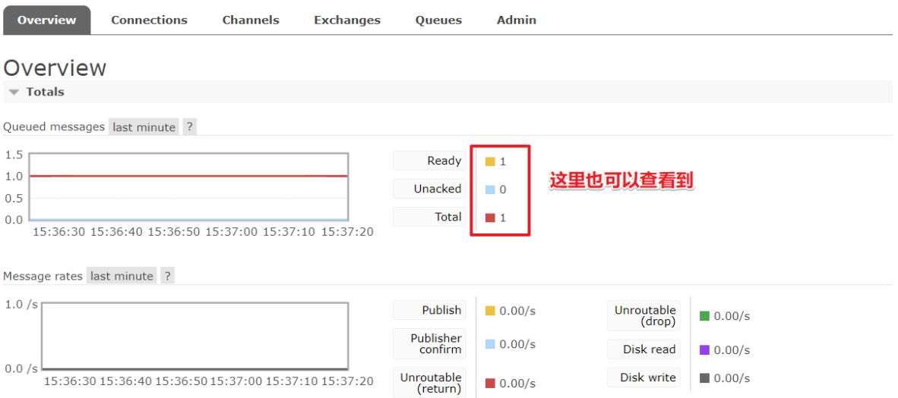

我们可以进行对队列的消息进行预览和测试如下：

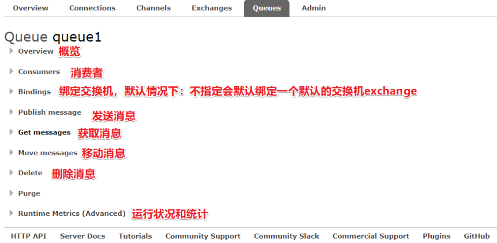

进行预览和获取消息进行测试

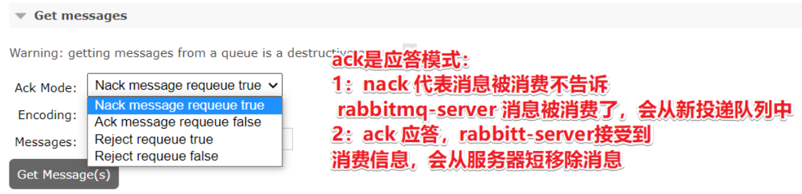

### 2.6 定义消费者


```java
public class Consumer {
    public static void main(String[] args) {

        // 1: 创建连接工程
        ConnectionFactory connectionFactory = new ConnectionFactory();
        connectionFactory.setHost("192.168.11.101");
        connectionFactory.setPort(5672);
        connectionFactory.setUsername("admin");
        connectionFactory.setPassword("admin");
        connectionFactory.setVirtualHost("/");

        Connection connection = null;
        Channel channel = null;
        try {
            // 2: 创建连接Connection
            connection = connectionFactory.newConnection("消费者");
            // 3: 通过连接获取通道Channel
            channel = connection.createChannel();
            // 4: 通过通创建交换机，声明队列，绑定关系，路由key，发送消息，和接收消息
            // true = ack 正常的逻辑是没问题 死循环 rabbit 重发策略
            // false = nack 消息这在消费消息的时候可能会异常和故障
            //DeliverCallback 消息传递时的回调
            //CancelCallback 消息取消时的回调
            final  Channel channel2 = channel;
            channel2.basicConsume("queue1", false, new DeliverCallback() {
                public void handle(String consumerTag, Delivery message) throws IOException {
                    try {
                        System.out.println("收到消息是" + new String(message.getBody(), "UTF-8"));
                        channel2.basicAck(message.getEnvelope().getDeliveryTag(), false);
                    }catch (Exception ex){
                        ex.printStackTrace();
                        // 三次确认 -- reject + sixin
                    }
                }
            }, new CancelCallback() {
                public void handle(String consumerTag) throws IOException {
                    System.out.println("接受失败了...");
                }
            });

            System.out.println("开始接受消息");
            System.in.read();

        } catch (Exception ex) {
            ex.printStackTrace();
        } finally {
            // 7: 关闭通道
            if (channel != null && channel.isOpen()) {
                try {
                    channel.close();
                } catch (Exception ex) {
                    ex.printStackTrace();
                }
            }
            // 8: 关闭连接
            if (connection != null && connection.isOpen()) {
                try {
                    connection.close();
                } catch (Exception ex) {
                    ex.printStackTrace();
                }
            }
        }
    }
}
```

## 3.什么是AMQP

**什么是AMQP**

AMQP 全称：Advanced Message Queuing Protocol（高级消息队列协议）。是应用层协议的一个开发标准，为面向消息的中间件设计。

**AMQP生产者流转过程**

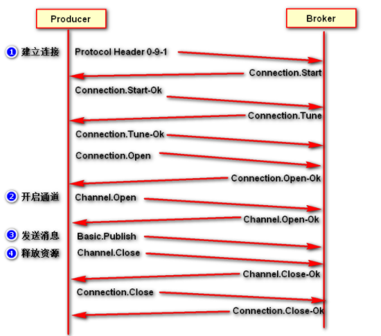

**AMQP消费者流转过程**

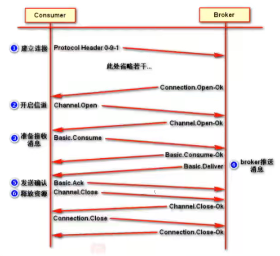

## 4.RabbitMQ的核心组成部分

### 4.1 RabbitMQ的核心组成部分

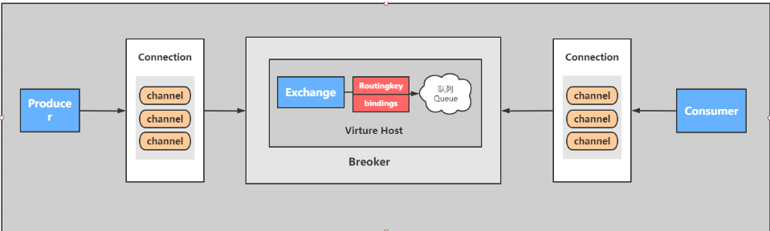

核心概念：

`Server`：又称 Broker，接受客户端的连接，实现 AMQP 实体服务。 安装 rabbitmq-server。

`Connection`：连接，应用程序与 Broker 的网络连接 TCP/IP 三次握手和四次挥手。

`Channel`：网络信道，几乎所有的操作都在 Channel 中进行，Channel 是进行消息读写的通道，客户端可以建立对各 Channel，每个 Channel 代表一个会话任务。

`Message`：消息，服务与应用程序之间传送的数据，由 Properties 和 body 组成，Properties 可是对消息进行修饰，比如消息的优先级，延迟等高级特性，Body 则就是消息体的内容。

**Virtual Host**：虚拟地址，用于进行逻辑隔离，最上层的消息路由，一个虚拟主机理由可以有若干个 Exhange 和 Queueu，同一个虚拟主机里面不能有相同名字的 Exchange。

`Exchange`：交换机，接受消息，根据路由键发送消息到绑定的队列（不具备消息存储的能力）。

`Bindings`：Exchange 和 Queue 之间的虚拟连接，binding 中可以保护多个 routing key。

`Routing key`：是一个路由规则，虚拟机可以用它来确定如何路由一个特定消息。

`Queue`：队列，也成为 Message Queue，消息队列，保存消息并将它们转发给消费者。

### 4.2 RabbitMQ整体架构是什么样子的？

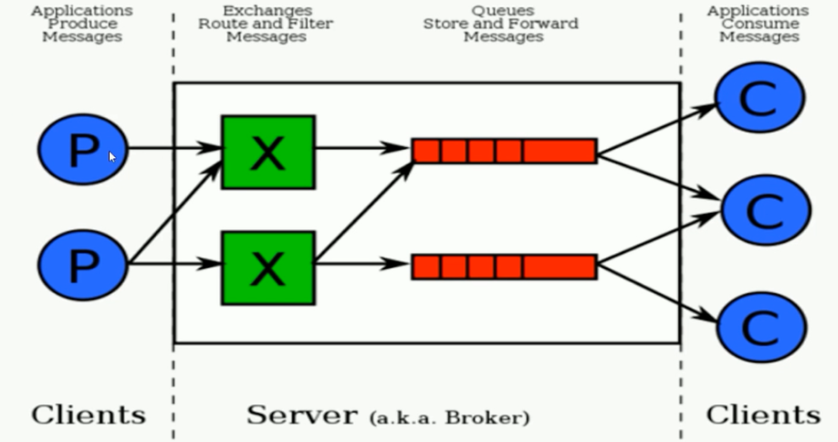

### 4.3 RabbitMQ的运行流程

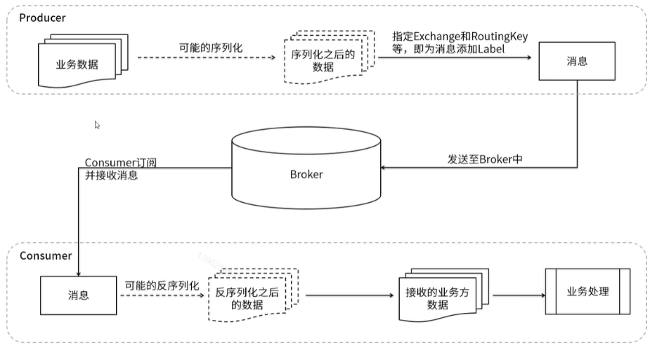

### 4.4 RabbitMQ支持消息的模式

参考官网：https://www.rabbitmq.com/getstarted.html

#### **1.简单模式 Simple**

- web 操作

  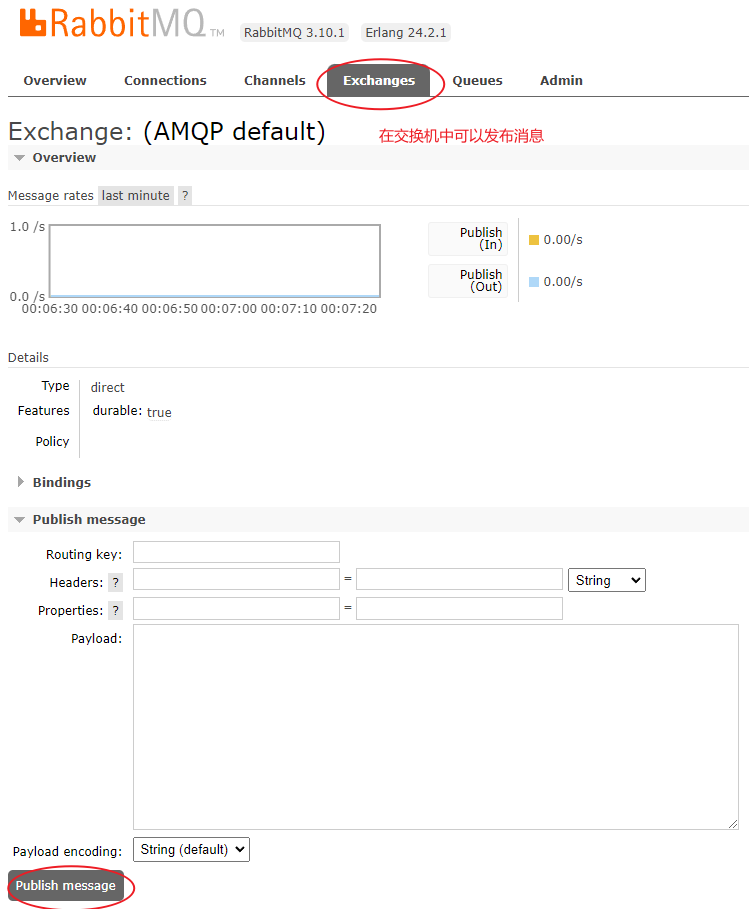

  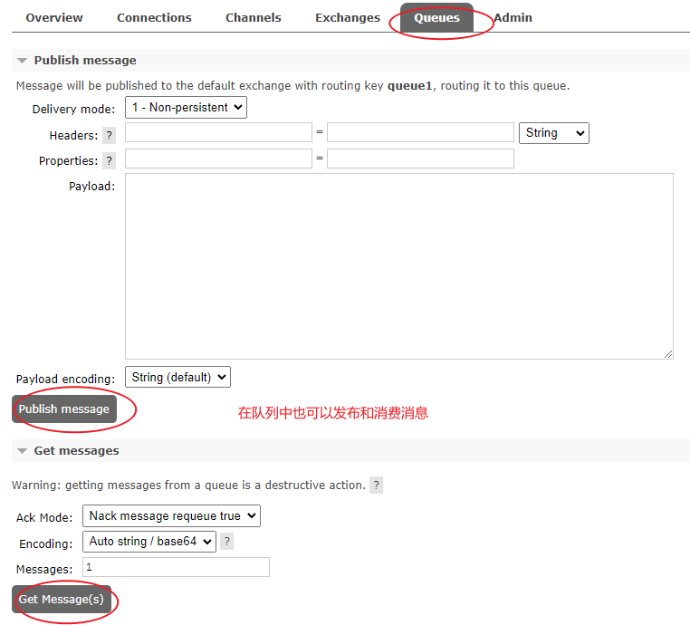

#### **2.工作模式 Work**

- 类型：无
- 特点：分发机制

#### **3.发布订阅模式（fanout）**

- web 操作

  1. 新建一个 fanout 交换机

  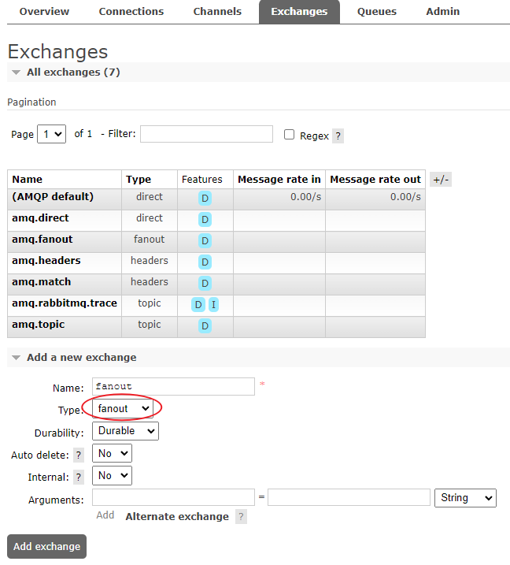

  2. 创建 3 个 queue

  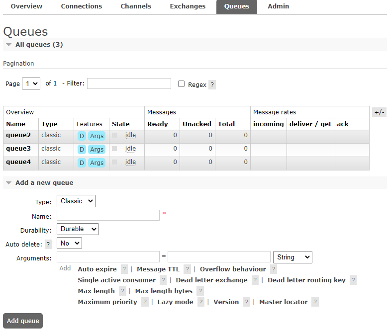

  3. 将 exchange 与 queue 绑定

  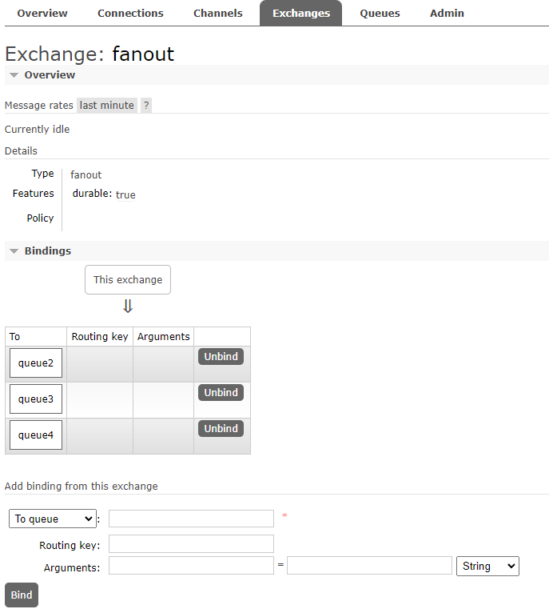

  4. 在 fanout 交换机中发布消息

  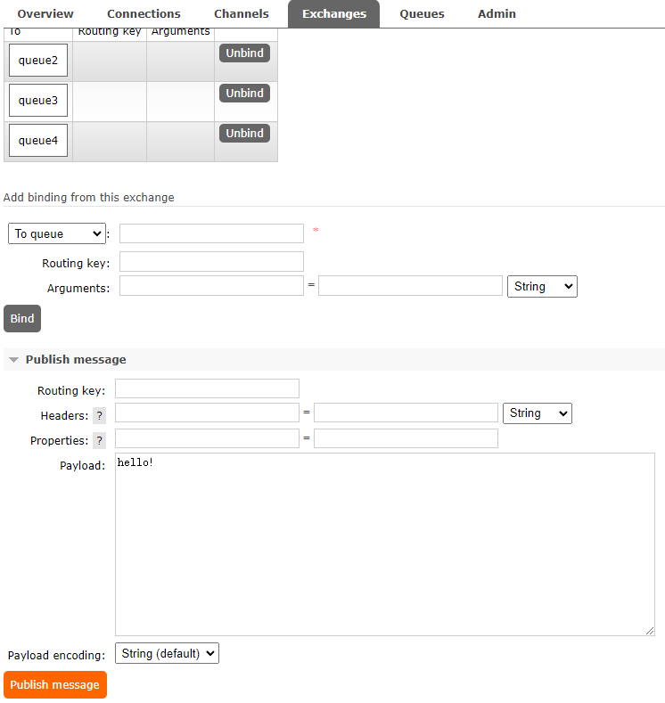

  5. 查看队列发现所有队列都受到了消息

  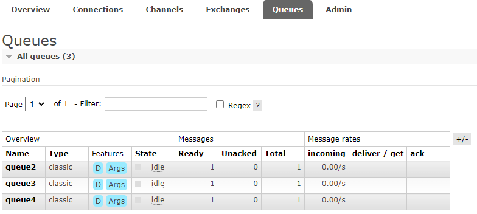

- 类型：fanout

- 特点：fanout —发布与订阅模式，是一种广播机制，它是没有路由 key 的模式

#### **4.路由模式（direct）**

- web 操作

  - 创建一个 direct 交换机

    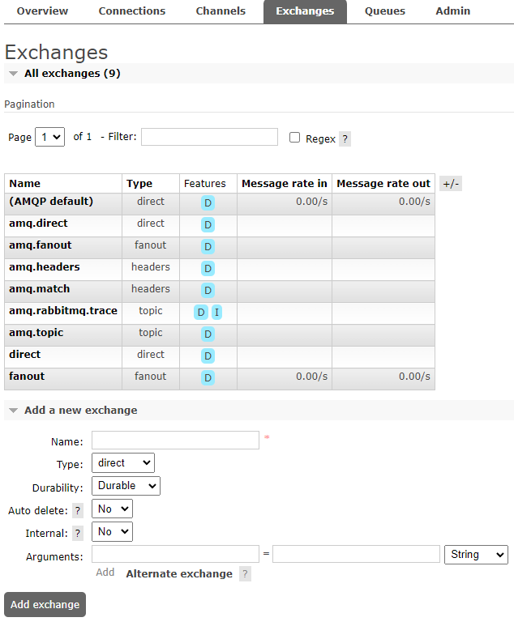

  - 绑定队列时指定 routing-key

    > 一个 queue 可以有多个 routing-key

    

  - 发布消息到指定的 routing-key

    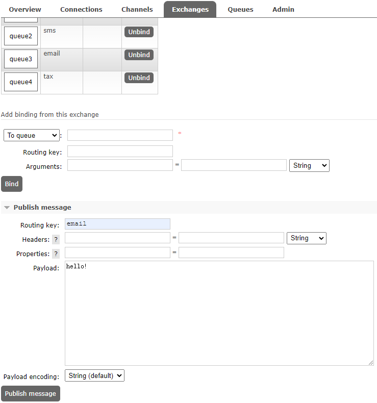

  - 发现只有 queue2 和 queue3 增加了一条消息

    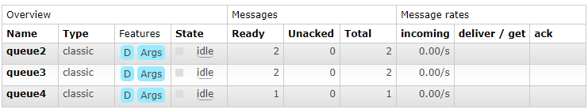

- 类型：direct

- 特点：有 routing-key 的匹配模式

#### **5.主题Topic模式**

- web 操作

  - 创建 topic exchange

  - 与队列绑定，绑定时使用特殊符号`#`和`*`

    `*`代表匹配一级，`#`代表匹配零级或多级

    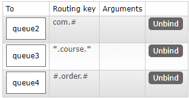

  - 发布消息时指定 routing key：

    com.XXX.XXX -> queue2

    co.course.co -> queue3

    order -> queue4

    com.course.order -> queue2、queue3、queue4

- 类型：topic

- 特点：模糊的 routing-key 的匹配模式

#### **6.参数模式**

- web 操作
  - 新建一个 headers exchange
  - 绑定 queue 时指定 arguments
  - 发布消息时指定 arguments
  - 只有绑定了相应 arguments 的队列才会收到消息

- 类型：headers
- 特点：参数匹配模式

#### **7.小结**

- rabbitmq 发送消息一定有一个交换机
- 如果队列没有指定交换机会默认绑定一个交换机
- 一个 queue 队列可以绑定多个模式，根据不同模式匹配规则进行消费 ack 应答，rabbit-server 接受到消费消息会将消息从服务器移除掉
- nack 代表消息被消费不告诉 rabbit-server 被消费会重新进入到队列中，相当于预览

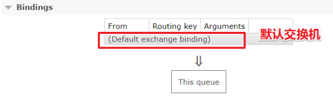

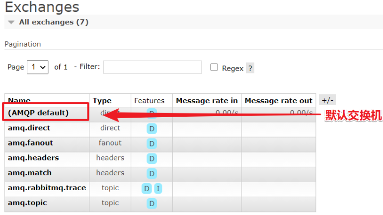