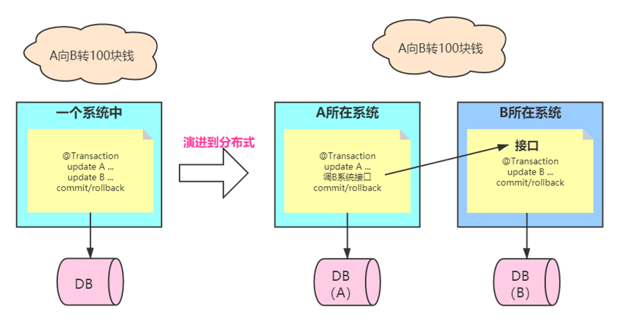
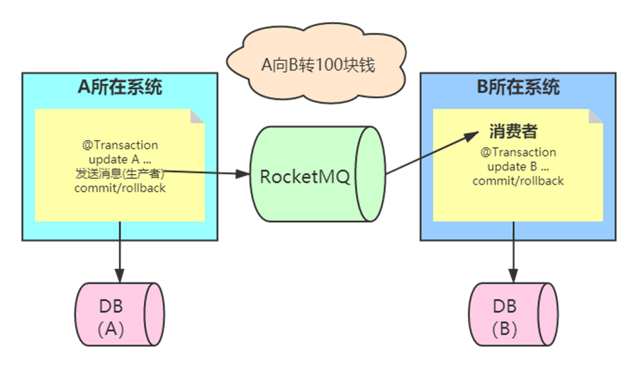
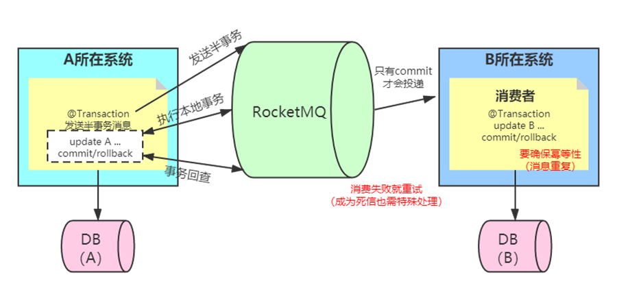
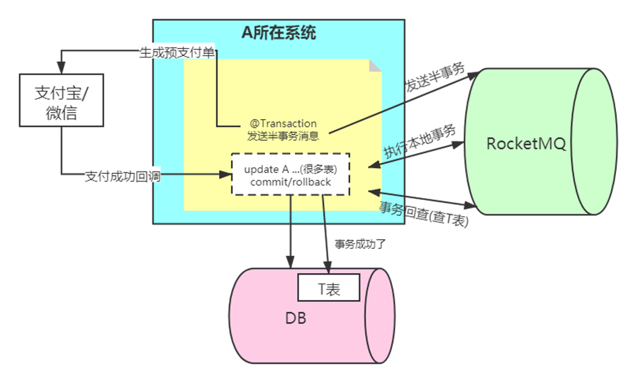
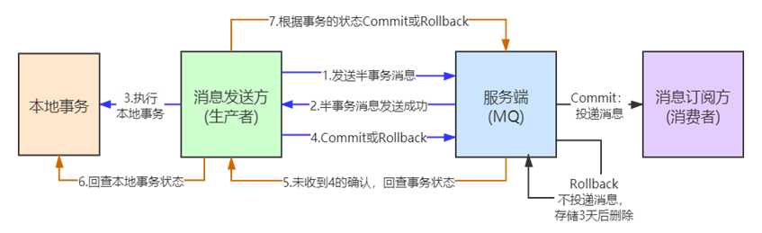
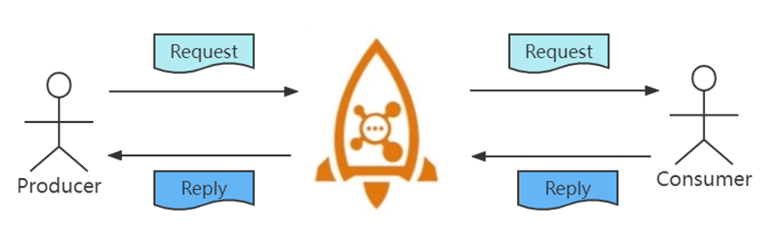
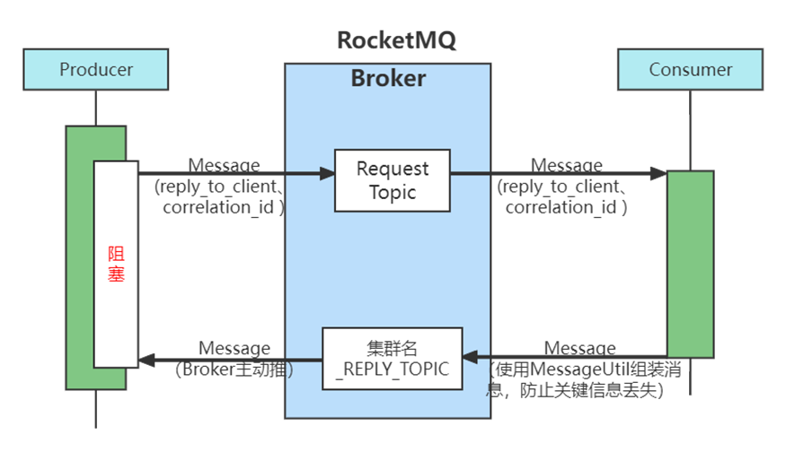

# 第3章_分布式事务

## 1.可靠发送和可靠接收

### 1.1 应用场景



业务场景：用户 A 转账 100 元给用户 B，这个业务比较简单，具体的步骤：

1. 用户 A 的账户先扣除 100 元 
2. 再把用户 B 的账户加 100 元

如果在同一个数据库中进行，事务可以保证这两步操作，要么同时成功，要么同时不成功。这样就保证了转账的数据一致性。但是在微服务架构中因为各个服务都是独立的模块，都是远程调用，没法在同一个事务中，所以就会遇到分布式事务问题。

### 1.2 RocketMQ处理方案



RocketMQ 分布式事务方式：把扣款业务和加钱业务异步化，扣款成功后，发送“扣款成功消息”到 RocketMQ，加钱业务订阅“扣款成功消息”，再对用户 B 加钱（扣款消息中包含了源账户和目标账户ID，以及钱数）。
对于扣款业务来说，需规定是先扣款还是先向 MQ 发消息：

- 场景一：先扣款后向 MQ 发消息

  先扣款再发送消息，万一发送消息失败了，那用户 B 就没法加钱。（一般就认为此次事务失败，A 进行回滚）

- 场景二：先向 MQ 发像消息后扣款

  扣款成功消息发送成功，但用户 A 扣款失败，可加钱业务订阅到了消息，用户 B 加了钱。

问题所在，也就是没法保证扣款和发送消息，同时成功，或同时失败；导致数据不一致。

为了解决以上问题，RocketMq 把消息分为两个阶段：半事务阶段和确认阶段。

- 半事务阶段：

  该阶段主要发一个消息到 rocketmq，但该消息只储存在 commitlog 中，但 consumeQueue 中不可见，也就是消费端（订阅端）无法看到此消息

- 确认阶段（commit/rollback）：

  该阶段主要是把半事务消息保存到 consumeQueue 中，即让消费端可以看到此消息，也就是可以消费此消息。如果是 rollback 就不保存。



整个流程：

1. A 在扣款之前，先发送半事务消息
2. 发送预备消息成功后，执行本地扣款事务
3. 扣款成功后，再发送确认消息
4. B 消息端（加钱业务）可以看到确认消息，消费此消息，进行加钱

注意：上面的确认消息可以为 commit 消息，可以被订阅者消费；也可以是 Rollback 消息，即执行本地扣款事务失败后，提交 rollback 消息，即删除那个半事务消息，订阅者无法消费。这样就可以解决以下异常问题：

1. 如果发送半事务消息失败，下面的流程不会走下去，这个是正常的。
2. 如果发送半事务消息成功，但执行本地事务失败。这个也没有问题，因为此半事务消息不会被消费端订阅到，消费端不会执行业务。 
3. 如果发送半事务消息成功，执行本地事务成功，但发送确认消息失败；这个就有问题了，因为用户 A 扣款成功了，但加钱业务没有订阅到确认消息，无法加钱。这里出现了数据不一致。


RocketMq如何解决上面的问题，核心思路就是**事务回查**，也就是 RocketMq 会定时遍历 commitlog 中的半事务消息。

对于异常3，发送半事务消息成功，本地扣款事务成功，但发送确认消息失败；因为 RocketMq 会进行回查半事务消息，在回查后发现业务已经扣款成功了，就补发“发送 commit 确认消息”；这样加钱业务就可以订阅此消息了。

这个思路其实把异常 2 也解决了，如果本地事务没有执行成功，RocketMQ 回查业务，发现没有执行成功，就会发送 RollBack 确认消息，把消息进行删除。

同时还要注意的点是，RocketMQ 不能保障消息的重复，所以在消费端一定要做幂等性处理。

除此之外，如果消费端发生消费失败，同时也需要做重试，如果重试多次，消息会进入死信队列，这个时候也需要进行特殊的处理。（一般就是把 A 已经处理完的业务进行回退）



如果本地事务执行了很多张表，那是不是我们要把那些表都要进行判断是否执行成功呢？这样是不是太麻烦了，而且和业务很耦合。

好的方案是设计一张 Transaction 表，将业务表和 Transaction 绑定在同一个本地事务中，如果扣款本地事务成功时，Transaction 中应当已经记录该 TransactionId 的状态为「已完成」。当 RocketMq 事务回查时，只需要检查对应的 TransactionId 的状态是否是「已完成」就好，而不用关心具体的业务数据。

如果是银行业务，对数据要求性极高，一般 A 与 B 需要进行手动对账，手动补偿。

### 1.3 使用案例

本案例简化整体流程，使用 A 系统向 B 系统转 100 块钱为例进行讲解。

案例中消息发送方是 A 系统，消费订阅方是 B 系统。



**生产者案例代码：**

```java
public static void main(String[] args) throws Exception {
    // 创建事务监听器
    TransactionListener transactionListener = new TransactionListenerImpl();
    // 创建事务生产者
    TransactionMQProducer producer = new TransactionMQProducer("TransactionProducer");
    // 生产者设置事务回查监听器
    producer.setTransactionListener(transactionListener);
    producer.setNamesrvAddr("192.168.11.101:9876");

    // 创建线程池
    ExecutorService executorService = new ThreadPoolExecutor(
        5,
        10,
        100,
        TimeUnit.SECONDS,
        new ArrayBlockingQueue<>(1000),
        Executors.defaultThreadFactory()
    );
    // 设置生产者回查线程池
    producer.setExecutorService(executorService);
    producer.start();

    // 半事务发送
    // 开启事务
    System.out.println("开启事务");
    try {
        Message msg = new Message("TransactionTopic", null, ("A向B系统转100块钱").getBytes());
        // 第 2 个参数可以传递给 transactionListener
        TransactionSendResult sendResult = producer.sendMessageInTransaction(msg, null);
        System.out.println(sendResult.getSendStatus());
    } catch (Exception e) {
        // 发生错误则回滚事务
        System.out.println("发生错误，回滚事务");
        e.printStackTrace();
    }
    for (int i = 0; i < 10000; i++) {
        Thread.sleep(1000);
    }
    producer.shutdown();
}
```

**事务回查案例代码：**

Ø 事务回查是非常有必要的，因为生产者在发送完半事务消息后不能立马确认事务的执行状态，所以事务回查有两个方法，一个是本地事务方法，一个是事务回查方法，目的都是为了确保事务的提交或者回滚。

```java
public class TransactionListenerImpl implements TransactionListener {
    @Override
    public LocalTransactionState executeLocalTransaction(Message msg, Object arg) {
        String transactionId = msg.getTransactionId();
        System.out.printf("insert into transactionTable(transactionId) values(%s)\n", transactionId);
        System.out.println("update A ... where transactionId:" + transactionId);
        // 情况1：本地事务成功--提交事务
        // System.out.printf("update transactionTable set status = s where transactionId = %s\n", transactionId);
        // return LocalTransactionState.COMMIT_MESSAGE;
        // 情况2：本地事务失败--回滚事务
        // System.out.printf("update transactionTable set status = f where transactionId = %s\n", transactionId);
        // return LocalTransactionState.ROLLBACK_MESSAGE;
        // 情况3：业务逻辑复杂，暂时不知道成功与否
        System.out.println("wait a while");
        return LocalTransactionState.UNKNOW;
        //return null;
    }
    @Override
    public LocalTransactionState checkLocalTransaction(MessageExt msg) {
        SimpleDateFormat sdf = new SimpleDateFormat("yyyy-MM-dd HH:mm:ss");
        // SimpleDataformat 不支持转换 LocalDataTime.now()
        System.out.println("check local transaction at: " + sdf.format(new Date()));
        // 检查本地事务表该事务是否执行成功
        System.out.printf("select status from transactionTable where transactionId = %s\n", msg.getTransactionId());
        // 情况1：执行成功
        System.out.println("事务回查结果：执行成功");
        return LocalTransactionState.COMMIT_MESSAGE;
        // 情况2：执行失败
        // System.out.println("事务回查结果：执行失败");
        // return LocalTransactionState.ROLLBACK_MESSAGE;
        // 情况3：暂时未知
        // System.out.println("事务回查结果：暂时未知");
        // return LocalTransactionState.UNKNOW;
    }
}
```

> 可以启用多个生产者，假设生产者 A 在事务回查消息确认发送前宕机，则生产者 B 依然可以执行事务回查任务。

**消费者案例代码：**

Ø 消费者使用的尽最大可能性确保成功消费（重试机制 + 死信队列特殊处理），所以 B 系统的处理比较简单，开启事务确保消费成功即可。

```java
public class TransactionConsumer {
    public static void main(String[] args) throws Exception{
        DefaultMQPushConsumer consumer = new DefaultMQPushConsumer("TransactionConsumer");
        consumer.setNamesrvAddr("192.168.11.101:9876");
        consumer.subscribe("TransactionTopic", "*");
        consumer.registerMessageListener(new MessageListenerConcurrently() {
            @Override
            public ConsumeConcurrentlyStatus consumeMessage(List<MessageExt> msgs, ConsumeConcurrentlyContext context) {
                try {
                    // 开启事务
                    for (MessageExt msg : msgs) {
                        System.out.println("收到消息：" + new String(msg.getBody()));
                        System.out.println("开启事务");
                        System.out.println("update B ... where transactionId:" + msg.getTransactionId());
                        // 执行成功
                        System.out.println("执行本地事务成功，确认消息");
                    }
                } catch (Exception e) {
                    e.printStackTrace();
                    System.out.println("执行本地事务失败，充实消费，保证B处理成功");
                    return ConsumeConcurrentlyStatus.RECONSUME_LATER;
                }
                return ConsumeConcurrentlyStatus.CONSUME_SUCCESS;
            }
        });
        // 启动消费者
        consumer.start();
        System.out.println("consumer started.");
    }
}
```

### 1.4 使用限制

1. 事务消息不支持延时消息和批量消息。
2. 事务回查的间隔时间：`BrokerConfig.transactionCheckInterval`通过 Broker 的配置文件设置好，单位毫秒。
3. 为了避免单个消息被检查太多次而导致半队列消息累积，我们默认将单个消息的检查次数限制为 15 次，但是用户可以通过 Broker 配置文件的`transactionCheckMax`参数来修改此限制。如果已经检查某条消息超过 N 次的话（N = transactionCheckMax） 则 Broker 将丢弃此消息，并在默认情况下同时打印错误日志。用户可以通过重写`AbstractTransactionCheckListener`类来修改这个行为。
4. 事务消息将在 Broker 配置文件中的参数`transactionMsgTimeout`这样的特定时间长度之后被检查。当发送事务消息时，用户还可以通过设置用户属性`CHECK_IMMUNITY_TIME_IN_SECONDS`来改变这个限制，该参数优先于`transactionMsgTimeout`参数。
5. 事务性消息可能不止一次被检查或消费。
6. 事务性消息中用到了生产者群组，这种就是一种高可用机制，用来确保事务消息的可靠性。
7. 提交给用户的目标主题消息可能会失败，目前这依日志的记录而定。它的高可用性通过 RocketMQ 本身的高可用性机制来保证，如果希望确保事务消息不丢失、并且事务完整性得到保证，建议使用同步的双重写入机制。
8. 事务消息的生产者 ID 不能与其他类型消息的生产者 ID 共享。与其他类型的消息不同，事务消息允许反向查询、MQ 服务器能通过它们的生产者 ID 查询到消费者。

## 2.Request-Reply消息

### 2.1 什么是Request-Reply？

RocketMQ 中`Request-Reply`模式允许 Producer 发出消息后，以同步或异步的形式等 Consumer 消费并返回一个响应消息，达到类似 RPC 的调用过程。

RocketMQ 从 4.6.0 版本开始支持这种模式。这种模式的流程如下图：



### 2.2 与RPC的不同

RocketMQ 的这种调用方式跟 dubbo 之类的 RPC 调用非常类似，那为什么不使用 dubbo？而要使用 RocketMQ 的这种 RPC 调用呢？原因如下：

- 基于 RocketMQ 来实现 RPC 可以快速搭建服务的消息总线，实现自己的 RPC 框架
- 基于 RocketMQ 来实现 RPC 可以方便的收集调用的相关信息，能够实现调用链路追踪和分析
- 基于 RocketMQ 来实现 RPC 既可以解耦两个系统之间的依赖，也可以实现跨网络区域实现系统间的同步调用，这里 RocketMQ 扮演的是一个类似于网关的角色

### 2.3 Request-Reply的实现逻辑



在以上图中，可以看到，使用 RPC 模式还是三方：Producer、Broker、Consumer。

在 Producer 中进行消息的发送时，可以随便指定 Topic，但是需要送入`reply_to_client`、`correlation_id`两个关键信息，reply_to_client 记录着请求方的 clientlD（用于 Broker 响应时确定 client 端）。而 correlation_id 是标识每次请求的，用于响应消息与请求的配对。而在进行发送消息时，也有两种模式，一种同步阻塞，另外一种异步非阻塞，这些跟之前普通消息的三种发送方式类似。

Broker 端除了 Producer 发送时指定的 Topic 之外，还有一个 Reply_Topic，这个以集群名`_REPLY_TOPIC`命名（不管 RPC 生产者主题有多少，这个在一个集群中只有一个），主要用于 Consumer 响应 RPC 消息的路由发现。

Consumer 端除了消费监听之外，还需要加入一个消息的生产（用于 RPC 的响应消息），必须使用客户端提供的`MessageUtil`进行消息的包装，防止关键信息丢失从而导致 Producer 不能收到 RPC 消息响应。

### 2.4 代码案例

生产者向 RequestTopic 主题发送 RPC 消息，使用同步阻塞方式。发送方法也不是`send`方法，而是`request`方法（该方法会封装`reply_to_client`、`correlation_id`等关键信息），同时方法也提供了 Message 的返回值。

```java
public class RequestProducer {
    public static void main(String[] args) throws MQClientException {
        DefaultMQProducer producer = new DefaultMQProducer("RequestProducer");
        producer.setNamesrvAddr("192.168.11.101:9876");
        producer.start();

        try {
            Message msg = new Message("RequestTopic",
                    "",
                    "hello request".getBytes(StandardCharsets.UTF_8)
                    );
            // 同步接收消费端信息
            Message responseMessage = producer.request(msg, 3000);
            System.out.println("get response from consumer: " + new String(responseMessage.getBody()));
        } catch (Exception e) {
            e.printStackTrace();
        }

        producer.shutdown();
    }
}
```

消费者接受主题消息发送 RPC 响应。收到响应后需要再做一次生产，使用工具类 MessageUtil 封装消息后进行响应消息发送。

```java
public class RequestConsumer {
    public static void main(String[] args) throws MQClientException {
        // 创建返回消息的生产者
        DefaultMQProducer producer = new DefaultMQProducer("RequestProducerFromConsumer");
        producer.setNamesrvAddr("192.168.11.101:9876");
        producer.start();

        DefaultMQPushConsumer consumer = new DefaultMQPushConsumer("RequestConsumer");
        consumer.setNamesrvAddr("192.168.11.101:9876");
        consumer.subscribe("RequestTopic", "*");
        consumer.registerMessageListener(new MessageListenerConcurrently() {
            @Override
            public ConsumeConcurrentlyStatus consumeMessage(List<MessageExt> msgs, ConsumeConcurrentlyContext context) {
                for (MessageExt msg : msgs) {
                    try {
                        System.out.println("received message:" + new String(msg.getBody()));
                        byte[] replyMessage = ("received message:" + new String(msg.getBody())).getBytes(StandardCharsets.UTF_8);
                        // 使用 MessageUtil 封装返回消息
                        Message message = MessageUtil.createReplyMessage(msg, replyMessage);
                        SendResult replyResult = producer.send(message, 3000);
                        System.out.println(replyResult);
                    } catch (Exception e) {
                        e.printStackTrace();
                        return ConsumeConcurrentlyStatus.RECONSUME_LATER;
                    }
                }
                return ConsumeConcurrentlyStatus.CONSUME_SUCCESS;
            }
        });
        consumer.start();
    }
}
```

RPC案例消息：

生产者打印如下，对比普通消息多了 reply_to_client、correlation_id 两个关键信息，reply_to_client 记录着请求方的 clientlD（用于 Broker 响应时确定 client 端）。而 correlation_id 是标识每次请求的，用于响应消息与请求的配对。

消费打印如下，消费者同时需要响应 RPC，对应的主题是`DefaultCluster_REPLY_TOPIC`。

```bash
received message:hello request
SendResult [sendStatus=SEND_OK, msgId=7F0000010D3818B4AAC25C376BF40002, offsetMsgId=C0A80B6500002A9F000000000002D355, messageQueue=MessageQueue [topic=DefaultCluster_REPLY_TOPIC, brokerName=broker-a, queueId=0], queueOffset=20]
```

在PRC方式中，生产者也可以使用异步方式发起，代码如下：

```java
public class RequestProducer {
    public static void main(String[] args) throws MQClientException, InterruptedException {
        DefaultMQProducer producer = new DefaultMQProducer("RequestProducer");
        producer.setNamesrvAddr("192.168.11.101:9876");
        producer.start();

        try {
            Message msg = new Message("RequestTopic",
                    "",
                    "hello request".getBytes(StandardCharsets.UTF_8)
                    );
            // 异步接收消费端信息
            producer.request(msg, new RequestCallback() {
                @Override
                public void onSuccess(Message message) {
                    System.out.println("get response from consumer: " + new String(message.getBody()));
                }

                @Override
                public void onException(Throwable e) {
                    System.out.println("消息发送失败");
                }
            }, 3000);
        } catch (Exception e) {
            e.printStackTrace();
        }
        TimeUnit.SECONDS.sleep(60);
        producer.shutdown();
    }
}
```