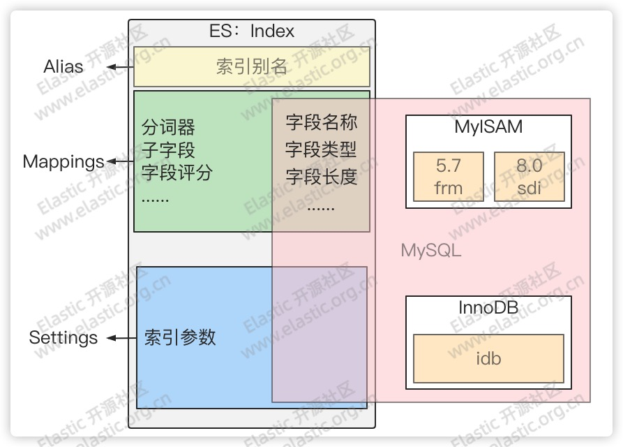

# 第04章_映射和数据类型

## 1.Mapping简介

ES 中的 `Mapping` 有点类似与关系数据库中**表结构**的概念，在 MySQL 中，表结构里包含了字段名称，字段的类型还有索引信息等。在 `Mapping` 里也包含了一些属性，比如字段名称、类型、字段使用的分词器、是否评分、是否创建索引等属性，并且在 ES 中一个字段可以有多个类型。



查看完整的索引 `Mapping`

```bash
GET /<index_name>/_mappings
```

**实例**

```bash
get /my_index/_mapping
```

```json
{
    "my_index": {
        "mappings": {
            "properties": {
                ...
            }
        }
    }
}
```

查看索引中指定字段的 `Mapping`

```bash
GET /<index_name>/_mappings/field/<field_name>
```

**示例**

```bash
get /my_index/_mapping/field/FlightNum
```

```json
{
  "my_index": {
    "mappings": {
      "FlightNum": {
        "full_name": "FlightNum",
        "mapping": {
          "FlightNum": {
            "type": "text",
            "fields": {
              "keyword": {
                "type": "keyword",
                "ignore_above": 256
              }
            }
          }
        }
      }
    }
  }
}
```

> **提示**
>
> `_mappings` 加不加 `s` 都可。

## 2.自动映射

### 2.1 简介

自动映射也叫动态映射，是 ES 在索引文档写入发生时自动创建 `Mapping` 的一种机制。ES 在创建索引之前，并不强制要求创建索引的 `Mapping`，ES 会根据字段的值来推断字段类型，进而自动创建并指定索引类型。

自动映射器会尽可能的把字段映射为宽字段类型，例如对于数字会使用 `long` 类型而不是 `int` 或 `short` 类型。下面是自动映射器推断字段类型的规则：

|   Field Type   |          Dynamic           |          Runtime           |
| :------------: | :------------------------: | :------------------------: |
|   true/false   |          boolean           |          boolean           |
|      小数      |           float            |           double           |
|      数字      |            long            |            long            |
|     object     |           object           |             -              |
|      数组      | 取决于数组中第一个非空元素 | 取决于数组中第一个非空元素 |
| 日期格式字符串 |            date            |            date            |
| 数字类型字符串 |         float/long         |        double/long         |
|   其它字符串   |       text + keyword       |          keyword           |

> **注意**
>
> - ES 没有隐式类型转换
> - ES 不支持类型修改
> - 生产环境尽可能的避免使用 dynamic mapping，避免映射为宽字段类型

### 2.2 自动映射模板

在定义字段映射的时候，往往字段不一定有具体的名称。有时希望对一类相同或者相似特征的字段定义相同的映射，此时可以考虑使用 Dynamic template。

**语法**

```json
"dynamic_templates": [
    {
      "my_template_name": { 
        ... match conditions ... 
        "mapping": { ... } 
      }
    },
    ...
]
```

#### 1.规则条件

**（1）match_mapping_type**

用于匹配数据类型。

**示例**

```json
PUT <index>
{
    "mappings": {
        "dynamic_templates": [
            {
				/* 被自动映射器识别为 long 类型的字段都会被映射为 integer 类型 */
                "integers": {
                    "match_mapping_type": "long",
                    "mapping": {
                        "type": "integer"
                    }
                }
            },
            {
                /* 被自动映射器识别为 string 的字段都会被映射为 keyword 类型 */
                "strings": {
                    "match_mapping_type": "string",
                    "mapping": {
                        "type": "keyword"
                    }
                }
            }
        ]
    }
}
---
PUT <index>/_doc/1
{
    "my_integer": 500, 
    "my_string": "elastic.org.cn" 
}
```

**（2）match、unmatch**

用以匹配字段名称规则，支持通配符、正则表达式。使用正则表达式时需要指定 `"match_pattern": "regex"`：

```json
"match_pattern": "regex",
"match": "^profit_\d+$"
```

**示例**

对于所有 `string` 类型，如果以 `num_` 开头但不以 `_text` 结尾的转换为 `integer`。

```json
PUT <index>
{
    "mappings": {
        "dynamic_templates": [
            {
                "string_to_integer": {
                    "match_mapping_type": "string",
                    "match":   "num_*",
                    "unmatch": "*_text",
                    "mapping": {
                        "type": "integer"
                    }
                }
            }
        ]
    }
}
--
PUT <index>/_doc/1
{
    "num_integer": 5
    "num_long": "5", 
    "num_text": "foo"
}

```

查询 `mapping`

```bash
get <index>/_mapping
```

```json
/* num_integer 不符合条件所以还是 long 类型 */
"num_integer": {
    "type": "long"
},
/* num_long 成功转换成了 integer */
"num_long": {
    "type": "integer"
},
/* num_text 以 _text 结尾所以不会转换 */
"num_text": {
    "type": "text",
    "fields": {
        "keyword": {
            "type": "keyword",
            "ignore_above": 256
        }
    }
}
```

**（3）path_match、path_unmatch**

用于嵌套字段。

**示例**

字段以 `name` 开头但不以 `middle` 结尾则复制到 `full_name` 用于查询。

```json
PUT <index>
{
  "mappings": {
    "dynamic_templates": [
      {
        "full_name": {
          "path_match":   "name.*",
          "path_unmatch": "*.middle",
          "mapping": {
            "type":       "text",
            "copy_to":    "full_name"
          }
        }
      }
    ]
  }
}
--
PUT <index>/_doc/1
{
  "name": {
    "first":  "elastic",
    "middle": "org",
    "last":   "cn"
  }
}

```

通过以下语句可以直接查询到

```json
GET <index>/_search
{
  "query": {
    "match": {
      "full_name": "elastic"
    }
  }
}
```

#### 2.模板变量

**示例**

```json
PUT <index>
{
    "mappings": {
        "dynamic_templates": [
            {
                /* 所有 string 类型的字段，其分词器都会被定义为和字段名称一致的分词器 */
                "named_analyzers": {
                    "match_mapping_type": "string",
                    "mapping": {
                        "type": "text",
                        "analyzer": "{name}"
                    }
                }
            },
            {
               /* 所有非 string 类型的字段，都会关闭 doc_values */
                "no_doc_values": {
                    "match_mapping_type":"*",
                    "mapping": {
                        "type": "{dynamic_type}",
                        "doc_values": false
                    }
                }
            }
        ]
    }
}
--
PUT <index>/_doc/1
{
    "english": "elastic.org.cn", 
    "count":   5 
}
```

查询

```bash
GET <index>/_mapping
```

```json
"count": {
    "type": "long",
    "doc_values": false
},
"english": {
    "type": "text",
    "analyzer": "english"
}
```

## 3.手动映射

手动映射也叫做显式映射，即：在索引文档写入之前，创建索引并且指定索引中每个字段类型、分词器等参数。

**（1）创建索引的 Mapping**

```bash
PUT /<index_name>
{
  "mappings": {
    "properties": {
      "field_name": {
        "<attribute_name>": "<attribute_value>"
      },
      ...
    }
  }
}
```

**示例**

```bash
PUT test_mapping
{
	"mappings": {
		"properties": {
			"text_field": {
				"type": "text",
				"fields": {
					"text_field_keyword": {
						"type": "keyword"
					}
				}
			},
			"long_field": {
				"type": "long"
			}
		}
	}
}
```

> **最佳实践**
>
> 可以先插入一个文档，然后复制自动生成的 Mappings 修改必要的属性。

**（2）修改 Mapping 属性**

```bash
PUT <index_name>/_mapping
{
  "properties": {
    "<field_name>": {
      "type": "text",	# 必须和原字段类型相同，且必须显式声明
      "analyzer": "standard" # 如果原字段有但这里没写则默认值为 default，如果原字段不是 default 则必须和原字段类型相同，且必须显式声明
      "fielddata": false # 修改的字段
    }
  }
}
```

> **注意**
>
> 并非所有字段参数都可以修改：
>
> - **字段类型**不可修改
> - **字段分词器**不可修改

## 4.ES数据类型

每个字段都有字段数据类型或字段类型。其大致分为两种：**会被分词的字段类型**和**不会被分词的字段类型。**

- 会被分词的类型：`text`、`match_only_text` 等
- 不会被分词类型：`keyword`、数值类型等

当然数据类型的划分可以分为很多种，比如按照基本数据类型和复杂数据类型来划分。

### 4.1 支持的数据类型

#### 1.基本数据类型★

- `Numbers`：数字类型，包含很多具体的基本数据类型

  |     类型      |                             描述                             |
  | :-----------: | :----------------------------------------------------------: |
  |     long      |        64 位有符号整数，取值范围：[-2^63^, 2^63^ - 1]        |
  |    integer    |        32 位有符号整数，取值范围：[-2^31^, 2^31^ - 1]        |
  |     short     | 16 位有符号整数，取值范围：[-2^16^, 2^16^ - 1]，即 [-32768, 32767] |
  |     byte      | 8 位有符号整数，取值范围：[-2^8^, 2^8^ - 1]，即 [-128, 127]  |
  |    double     |          双精度 64 位 IEEE 754 浮点数，仅限于有限值          |
  |     float     |          单精度 32 位 IEEE 754 浮点数，仅限于有限值          |
  |  half_float   |          半精度 16 位 IEEE 754 浮点数，仅限于有限值          |
  | scaled_float  |        缩放类型的浮点数，按固定 `double` 比例因子缩放        |
  | unsigned_long |           无符号 64 位整数，取值范围：[0, 2^64^-1]           |

- `binary`：编码为 Base64 字符串的二进制值

- `boolean`：布尔类型

- `alias`：字段别名

- `Keywords`：包含 `keyword ★`、`constant_keyword` 和 `wildcard`

- `Dates`：日期类型，包括 `date ★` 和 `data_nanos`，两种类型

#### 2.对象关系类型

- `object`：非基本数据类型之外，默认的 JSON 对象为 object 类型
- `flattened`：单映射对象类型，其值为 JSON 对象
- `nested ★`：嵌套类型
- `join`：父子级关系类型

#### 3.结构化类型

- `range`：范围类型，比如 `long_range`，`double_range`，`data_range` 等
- `ip`：ipv4 或 ipv6 地址
- `version`：版本号
- `murmur3`：计算和存储值的散列

#### 4.聚合数据类型

- `aggregate_metric_double`
- `histogram`

#### 5.文本搜索字段

- `text ★`：文本数据类型，用于全文检索
- `annotated-text`
- `completion ★`
- `search_as_you_type`
- `token_count`

#### 6.文档排名类型

- `dense_vector`：记录浮点值的密集向量
- `rank_feature`：记录数字特征以提高查询时的命中率
- `rank_features`：记录数字特征以提高查询时的命中率

#### 7.空间数据类型★

- `geo_point`：纬度和经度点
- `geo_shape`：复杂的形状，例如多边形
- `point`：任意笛卡尔点
- `shape`：任意笛卡尔几何

#### 8.其他类型

- `percolator`：用 Query DSL 编写的索引查询

### 4.2 Text类型★★

当一个字段是要被全文搜索的，比如邮件内容、产品描述等长文本，这些字段应该使用 `text` 类型。设置 `text` 类型以后，字段内容会被**分词**，在生成倒排索引以前，字符串会被分析器分成一个一个**词项**。`text` 类型的字段不用于排序，很少用于聚合。

> **补充：为啥不会为 `text` 创建正排索引**
>
> 正排索引会占用大量堆空间，尤其是在加载高基数 `text` 字段时。字段数据一旦加载到堆中，就在该段的生命周期内保持在那里。同样，加载字段数据是一个昂贵的过程，可能导致用户遇到延迟问题。

### 4.3 Keyword类型

`keyword` 使用序号映射存储它们的文档值以获得更紧凑的表示。此映射的工作原理是根据其词典顺序为每个术语分配一个增量整数或*序数。*该字段的文档值仅存储每个文档的序数而不是原始术语，并使用单独的查找结构在序数和术语之间进行转换。

一般用于精确匹配（`term`）和聚合字段，例如 ID、电子邮件地址、主机名、状态代码、邮政编码或标签。包括范围查找。

- `keyword` 类型字段不会被分词

- `keyword` 一般用于精确查找或者聚合字段

- `keyword` 类型超过阈值长度（`ignore_above`）会直接被丢弃

  > **注意**
  >
  > 可以通过 `_search` 或 `_doc` 查询看到源字段 `_source` 的值，但是无法通过 `query` 查找。
  >
  > ```json
  > put keyword_test
  > {
  >   "mappings": {
  >     "properties": {
  >       "keyword": {
  >         "type": "keyword",
  >         "ignore_above": 10
  >       }
  >     }
  >   }
  > }
  > --
  > put keyword_test/_doc/1
  > {
  >   "keyword": "0123456789"
  > }
  > --
  > put keyword_test/_doc/2
  > {
  >   "keyword": "01234567890"
  > } 
  > ```
  >
  > 通过 `_search` 查看文档
  >
  > ```json
  > get keyword_test/_search
  > --
  > {
  >   ...
  >     "hits": [
  >       {
  >        ...
  >         "_source": {
  >           "keyword": "0123456789"
  >         }
  >       },
  >       {
  >        ...
  >         "_ignored": [
  >           "keyword"
  >         ],
  >         "_source": {
  >           "keyword": "01234567890"
  >         }
  >       }
  >     ]
  >   }
  > }
  > ```
  >
  > 但是通过 `query` 则只能查看到第一条：
  >
  > ```json
  > get keyword_test/_search
  > {
  >   "query": {
  >     "term": {
  >       "keyword": {
  >         "value": "0123456789"
  >       }
  >     }
  >   }
  > }
  > --
  > {
  >   ...
  >   "hits": {
  >     ...
  >     "hits": [
  >       {
  >         ...
  >         "_source": {
  >           "keyword": "0123456789"
  >         }
  >       }
  >     ]
  >   }
  > }
  > ```
  >
  > ```json
  > get keyword_test/_search
  > {
  >   "query": {
  >     "term": {
  >       "keyword": {
  >         "value": "01234567890"
  >       }
  >     }
  >   }
  > }
  > --
  > {
  >   ...
  >   "hits": {
  >     ...
  >     "hits": []
  >   }
  > }
  > ```

### 4.4 Date类型★

和 Java 中有所不同，Elasticsearch 在索引创建之前并不是必须要创建索引的 mapping，它会根据你写入的字段的内容动态去判定字段的数据类型，不过这种自动映射的机制存在一些缺陷，比如在 Elasticsearch 中没有隐式类型转换，所以在自动映射的时候就会把字段映射为较宽的数据类型。比如你写入一个数字 50，系统就会自动给你映射成 `long` 类型，而不是 `int`。一般企业中用于生产的环境都是使用手工映射，能保证按需创建以节省资源和达到更高的性能。

在 Elasticsearch 中，时间类型是一个非常容易踩坑的数据类型，通过一个例子向大家展示这个时间类型的用法和避坑指南。

假如我们有如下索引 tax ，其中 `date` 字段包含了多种日期的格式：“yyyy-MM-dd hh:mm:ss”，“yyyy-MM-dd” 还有时间戳。如果按照 dynamic mapping，采取自动映射器来映射索引，该字段应该是一个 `date` 类型。

```bash
POST tax/_bulk
{"index":{}}
{"date": "2021-01-25T10:01:12Z"}
{"index":{}}
{"date": "2021-01-25"}
{"index":{}}
{"date": "1648100904"}
```

然而以上代码创建的 `date` 实际上是一个 `text` 类型。

```json
get tax/_mapping
{
  "tax": {
    "mappings": {
      "properties": {
        "date": {
          "type": "text",
          "fields": {
            "keyword": {
              "type": "keyword",
              "ignore_above": 256
            }
          }
        }
      }
    }
  }
}
```

原因就在于 ES 对时间类型的格式的要求是绝对严格的，它必须是一个**标准的 UTC 时间类型**。上述字段的数据格式如果想要使用，就必须使用 `yyyy-MM-ddTHH:mm:ssZ` 格式（其中 `T` 是间隔符；`Z` 代表 0 时区，可以省略，非 0 时区可以使用 `yyyy-MM-ddTHH:mm:ss.SSS+hh:mm`）。

如果写入数据前手工指定字段类型，ES 还可以识别到时间戳和 `yyyy-MM-dd` 格式。

```bash
PUT tax_manual
{
  "mappings": {
    "properties": {
      "date": {
        "type": "date"
      }
    }
  }
}
--
POST tax_manual/_bulk
{"index":{}}
{"date": "2021-01-25T10:01:12Z"}
{"index":{}}
{"date": "2021-01-25T10:01:12"}
{"index":{}}
{"date": "2021-01-25"}
{"index":{}}
{"date": "1648100904"}
```

或者可以在创建索引时指定 `date` 的 `format` 让 ES 可以指别到指定的格式：

```json
PUT test_index
{
  "mappings": {
    "properties": {
      "time": {
        "type": "date",
        "format": "yyyy-MM-dd HH:mm:ss||yyyy-MMM-dd||epoch_millis"
      }
    }
  }
}
```

### 4.5 Nested类型★

`nested` 类型是 `object` 一种数据类型，允许对象数组以相互独立的方式进行索引，用于复杂类型对象数组的索引操作。ES 没有内部对象的概念，因此，ES 在存储复杂类型的时候会把对象的复杂层次结果扁平化为一个键值对列表。

假如我们有如下order索引，包含订单的商品列表：

```json
PUT /order/_doc/1
{
  "order_name": "xiaomi order",
  "desc": "shouji zhong de zhandouji",
  "goods_count": 3,
  "total_price": 12699,
  "goods_list": [
    {
      "name": "xiaomi PRO MAX 5G",
      "price": 4999
    },
    {
      "name": "ganghuamo",
      "price": 19
    },
    {
      "name": "shoujike",
      "price": 1999
    }
  ]
}
PUT /order/_doc/2
{
  "order_name": "Cleaning robot order",
  "desc": "shouji zhong de zhandouji",
  "goods_count": 2,
  "total_price": 12699,
  "goods_list": [
    {
      "name": "xiaomi cleaning robot order",
      "price": 1999
    },
    {
      "name": "dishwasher",
      "price": 4999
    }
  ]
}
```

查询订单商品中商品名称为 dishwasher 并且商品价格为 1999 的订单信息，尝试执行以下脚本

```json
GET order/_search
{
  "query": {
    "bool": {
      "must": [
        {
          "match": {
            "goods_list.name": "dishwasher"    // 条件一
          }
        },
        {
          "match": {
            "goods_list.price": 1999           // 条件二
          }
        }
      ]
    }
  }
}
```

结果无法获得数据。

此时我们可以使用 `nested` 格式，首先在创建索引时在 mapping` 中为复杂类型指定 `nested` 类型：

```json
PUT order
{
  "mappings": {
    "properties": {
      "goods_list": {
        "type": "nested",
        "properties": {
          "name": {
            "type": "text"
          }
        }
      }
    }
  }
}
```

写入数据后再次执行查询：

```json
GET /order/_search
{
  "query": {
    "nested": {
      "path": "goods_list", 
      "query": {
        "bool": {
          "must": [
            {
              "match": {
                "goods_list.name": "dishwasher"
              }
            },
            {
              "match": {
                "goods_list.price": 4999
              }
            }
          ]
        }
      }
    }
  }
}
```

## 5.映射参数

以下是 ES 中说所有支持的映射参数：

### 5.1 analyzer ★

指定分析器，只有 `text` 类型字段支持。==不支持动态修改==。

### 5.2 coerce

表示是否允许强制类型转换（默认 true），支持对字段设置或者对整个索引设置，例如如果对某数值字段设置为 true，则插入字符串 `“1”` 可以强转为数值 `1`。

**对索引设置**

```bash
PUT <index_name>
{
    "settings":{
    	"index.mapping.coerce":false
    }
}
```

**对字段设置**

```bash
PUT <index_name>
{
	"mappings":{
		"properties":{
			"field_name":{
				"type":"integer"
				,"coerce":false
			}
		}
	}
}
```

### 5.3 copy_to

该参数在查询中不可见而在 `mappings` 中可见，它允许将多个字段的值复制到组字段中，然后可以将其作为单个字段进行查询。

对于下面创建的索引：

```bash
put test_copy_to
{
  "mappings": {
    "properties": {
      "first_name": {
        "type": "text",
        "copy_to": "full_name"
      },
      "last_name": {
        "type": "text",
        "copy_to": "full_name"
      },
      "full_name": {
        "type": "text"
      }
    }
  }
}
```

往其中插入数据：

```bash
put test_copy_to/_doc/1
{
  "first_name": "3",
  "last_name": "zhang"
}
```

查看该 doc 时不会显示 `copy_to` 字段：

```bash
get test_copy_to/_source/1
```

```json
{
  "first_name": "3",
  "last_name": "zhang"
}
```

但是在查询时可以作为查询条件查询出对应的 doc：

```bash
get test_copy_to/_search
{
  "query": {
    "match": {
      "full_name": "3"
    }
  }
}
```

```json
{
  ...
    "hits": [
      {
        "_index": "test_copy_to",
        "_id": "1",
        "_score": 0.2876821,
        "_source": {
          "first_name": "3",
          "last_name": "zhang"
        }
      }
    ]
  }
}
```

### 5.4 doc_values ★

为了提升排序和聚合效率，默认 true，如果确定不需要对字段进行排序或聚合，也不需要通过脚本访问字段值，则可以禁用该参数以节省磁盘空间（不支持 `text` 和 `annotated_text`）

### 5.5 dynamic ★

控制是否可以动态添加新字段，支持以下四个选项：

- `true`：（默认）允许动态映射
- `false`：忽略新字段，这些字段不会被索引或搜索，但仍会出现在 `_source` 返回的命中字段中。这些字段不会添加到映射中，必须显式添加新字段
- `runtime`：新字段作为运行时字段添加到索引中，这些字段没有索引，是 `_source` 在查询时加载的
- `strict`：如果检测到新字段，则会抛出异常并拒绝文档，必须将新字段显式添加到映射中

### 5.6 eager_global_ordinals

用于聚合的字段上，优化聚合性能。

### 5.7 enabled ★

是否创建倒排索引，可以对字段操作，也可以对索引操作。如果是对字段操作，则该字段==必须==是 `object` 类型。

如果不创建倒排索引，则不能通过索引中的任何字段匹配内容来查询数据，但是仍然可以通过无条件 `_search` 检索并在 `_source` 源数据中展示。谨慎使用，==该状态无法修改==。

```json
PUT test_enabled
{
	"mappings": {
		"enabled": false
	}
}
--
PUT test_enabled/_doc/1
{
	"title": "elastic"
}
--
# 以下可以查询到上面的数据
GET test_enabled/_search 
GET test_enabled/_doc/1
--
GET test_enabled/_search # 查询不到该数据
{
	"query": {
		"match": {
			"title": "elastic"
		}
	}
}
```

### 5.8 fielddata ★

查询时内存数据结构，在首次用当前字段聚合、排序或者在脚本中使用时，需要字段为 `fielddata` 数据结构，并且创建倒排索引保存到堆中。

### 5.9 fields ★

给 `field` 创建多字段，用于不同目的（全文检索或者聚合分析排序）。

**示例**

先创建一个索引，为 test_field 字段增加两个子字段。

```bash
PUT test_fields
{
  "mappings": {
    "properties": {
      "test_field": {
        "type": "text",
        # 为当前字段创建 2 个子字段
        "fields": {
          "chinese": {
            "type": "keyword",
            # 表示长度超过 5 则忽略
            "ignore_above": 5
          },
          "english": {
            "type": "text",
            "analyzer": "english"
          }
        }
      }
    }
  }
}
```

往其中添加一个 doc

```bash
POST test_fields/_doc
{
  "test_field": "elastic"
}
```

可以通过以下两种方式查看：

```json
get test_fields/_search # 查询不到，因为值长度超过了 5，不会被保存在 test_field.chinese 中
{
  "query": {
    "match": {
      "test_field.chinese": "elastic"
    }
  }
}
--
get test_fields/_search # 可以查询到
{
  "query": {
    "match": {
      "test_field.english": "elastic"
    }
  }
}
```

### 5.10 format ★

用于格式化代码，如：

```json
"data": {
	"type": "date",
    "format": "yyyy-MM-dd"
}
```

### 5.11 ignore_above ★

超过长度将被忽略。

### 5.12 ignore_malformed

忽略类型错误。

### 5.13 index_options

控制将哪些信息添加到反向（倒排）索引中以进行搜索和突出显示。仅用于 `text` 字段。

### 5.14 index_phrases

提升 exact_value 查询速度，但是要消耗更多磁盘空间。

### 5.15 index_prefixes

前缀搜索：

- `min_chars`：前缀最小长度，>0，默认 2（包含）
- `max_chars`：前缀最大长度，<20，默认5（包含）

### 5.16 index ★

是否对创建对当前字段创建倒排索引，默认 true。如果设置为 false 表示不创建索引，意味着该字段不会通过索引被搜索到（会报错提示该字段没有索引），但是仍然会在 `_source` 元数据中展示。

`Numeric`、`date`、`boolean`、`ip`、`geo_point` 和 `keyword` 类型在未编入索引但启用了 `doc_value` 时也可以进行查询，但是对这些字段的查询速度很慢，因为必须对索引进行全面扫描。

### 5.17 meta

附加到字段的元数据，只适用于声明字段的元信息，如单位 unit。它只存在于 mapping 中，不会存储在 doc 中。

```bash
PUT my-index-000001
{
  "mappings": {
    "properties": {
      "latency": {
        "type": "long",
        "meta": {
          "unit": "ms"
        }
      }
    }
  }
}
```

### 5.18 normalizer

文档归一化器。

### 5.19 norms ★

是否禁用评分（在 `filter` 和聚合字段上应该禁用）。

### 5.20 null_value ★

为 null 值设置默认值。

### 5.21 position_increment_gap

用于数组中相邻搜索（`match_phrase`）中的搜索间隙，默认 100。

### 5.22 properties ★

`mappings`、`object` 字段和 `nested` 字段包含的子字段称为 `properties`。这些属性可以是任何数据类型，包括 `object` 和 `nested`。

### 5.23 search_analyzer ★

设置单独的查询时分析器。

### 5.24 similarity

为字段设置相关度算法，支持：BM25（默认） 和 boolean。

> **注意**
>
> classic（TF-IDF）在 ES 8.x 中已不再支持！

### 5.25 subobjects

ES 8 新增参数，`subobjects` 设置为 false 的字段的值，其子字段的值不被扩展为对象。

在为文档编制索引或更新映射时，Elasticsearch 会接受名称中包含点的字段，并将其展开为相应的对象结构。例如，metrics.time.max 字段被映射为 max 叶子字段，其父 time 对象属于 matrix 对象的子对象。但是它不允许我们同时持有 metrics.time.max 和 metrics.time，因为 time 不能同时作为父对象和叶子字段。

**示例**

```json
PUT my-index-000002
{
  "mappings": {
    "properties": {
      "metrics": {
        "type":  "object"
      }
    }
  }
}
--
PUT my-index-000002/_doc/metric_1
{
  "metrics.time" : 100, 
  "metrics.time.min" : 10,
  "metrics.time.max" : 900
}
```

报错

```bash
can't merge a non object mapping [metrics.time] with an object mapping
```

此时可以将 `subobjects` 设置为 false。

**示例**

```json
PUT my-index-000001
{
  "mappings": {
    "properties": {
      "metrics": {
        "type":  "object",
        "subobjects": false 
      }
    }
  }
}
--
PUT my-index-000001/_doc/metric_1
{
  "metrics.time" : 100, 
  "metrics.time.min" : 10,
  "metrics.time.max" : 900
}
--
PUT my-index-000001/_doc/metric_2
{
  "metrics" : {
    "time" : 100, 
    "time.min" : 10,
    "time.max" : 900
  }
}
```

查看 metric_1

```bash
GET my-index-000001/_source/metric_1
```

```json
{
  "metrics.time": 100,
  "metrics.time.min": 10,
  "metrics.time.max": 900
}
```

查看 metric_2

```bash
GET my-index-000001/_doc/metric_2
```

```bash
{
  "metrics": {
    "time": 100,
    "time.min": 10,
    "time.max": 900
  }
}
```

### 5.26 store

默认情况下字段会被建立索引但不会被单独存储，它们会被放在 `_source` 字段中统一存储，查询时也只能通过 `_source` 字段查询所有字段再过滤出目标字段。如果只想查询并获取某个字段的值则可以使用 `store`。

```json
PUT my-index-000001
{
  "mappings": {
    "properties": {
      "title": {
        "type": "text",
        "store": true 
      },
      "date": {
        "type": "date",
        "store": true 
      },
      "content": {
        "type": "text"
      }
    }
  }
}
--
PUT my-index-000001/_doc/1
{
  "title":   "Some short title",
  "date":    "2015-01-01",
  "content": "A very long content field..."
}
--
GET my-index-000001/_search
{
  "stored_fields": [ "title", "date" ] 
}
```

结果

```json
{
  ...
    "hits": [
      {
        "_index": "my-index-000001",
        "_id": "1",
        "_score": 1,
        "fields": {
          "date": [
            "2015-01-01T00:00:00.000Z"
          ],
          "title": [
            "Some short title"
          ]
        }
      }
    ]
  }
}
```

可以看到没有显示 content 字段的值。

### 5.27 term_vector

运维参数。