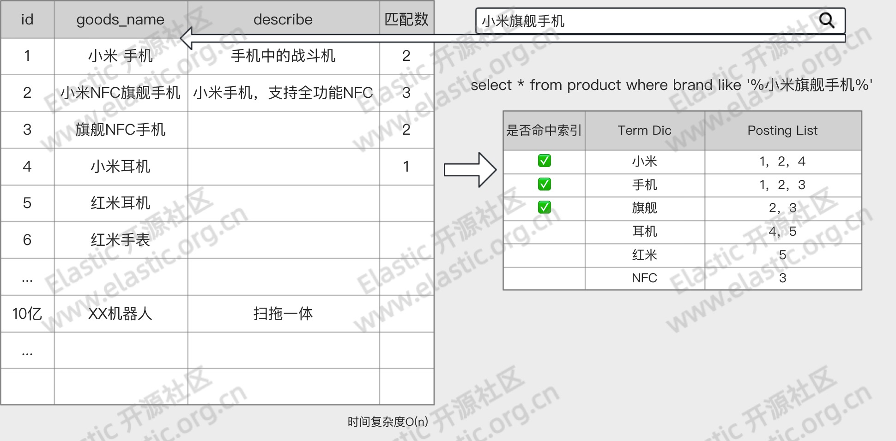

# 第05章_分词器

分词器官方称为文本分析器，顾名思义是对文本进行分析处理的一种手段，基本处理逻辑为按照预先制定的分词规则，把原始文档分割成若干更小粒度的词项 - `term`，粒度大小取决于分词器规则。

例如对于下面的场景，

分词器的处理过程发生在 `Index Time` 和 `Search Time` 两个时期：

- `Index Time`：文档写入并创建倒排索引时期，其分词逻辑取决于映射参数 `analyzer`
- `Search Time`：搜索发生时期，其分词仅对搜索词产生作用

分词器的组成：

- **切词器**（Tokenizer）：用于定义切词（分词）逻辑
- **词项过滤器**（Token Filter）：用于对分词之后的单个词项的处理逻辑
- **字符过滤器**（Character Filter）：用于处理单个字符

> **注意**
>
> 分词器不会对源数据造成任何影响，分词仅仅是对倒排索引或者搜索词的行为。