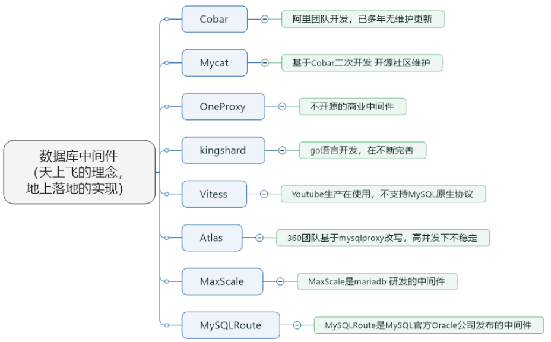
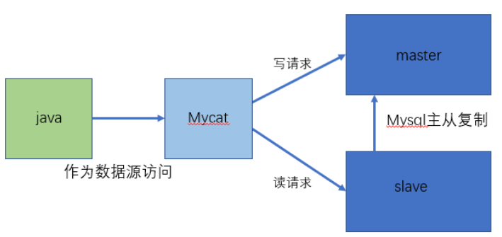
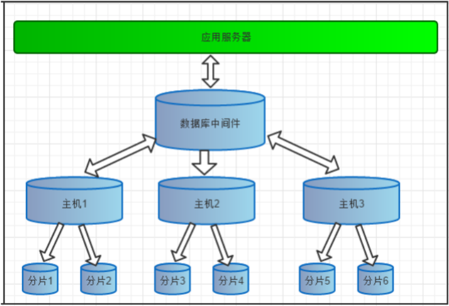
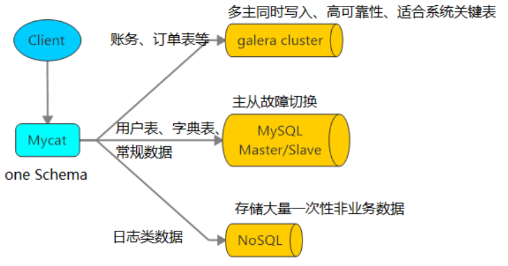
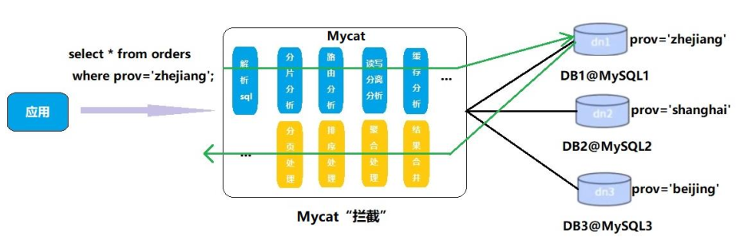

# 第1章_入门概述

<a href="http://www.mycat.io/" style="float:right">官网</a>

## 1.Mycat 是什么

Mycat 是数据库中间件。

### 1.1 数据库中间件

中间件：是一类连接软件组件和应用的计算机软件，以便于`软件各部件之间的沟通`。例如 Tomcat 是一种 web 中间件。

数据库中间件：连接 java 应用程序和数据库。

### 1.2 为什么要用Mycat？

- 不使用中间件的话 Java 与数据库会产生紧耦合
- `高访问量高并发`对数据库的压力
- 读写请求数据不一致

### 1.3 数据库中间件对比

- Cobar 属于阿里 B2B 事业群，始于 2008 年，在阿里服役 3 年多，接管 3000+个MySQL 数据库的 schema，集群日处理在线 SQL 请求 50 亿次以上。由于 Cobar 发起人的离职，Cobar 停止维护
- Mycat 是开源社区在阿里 cobar 基础上进行二次开发，解决了 cobar 存在的问题，并且加入了许多新的功能在其中
- OneProxy 基于 MySQL 官方的 proxy 思想利用 c 进行开发的，OneProxy 是一款商业收费的中间件。舍弃了一些功能，专注在性能和稳定性上
- kingshard 由小团队用 go 语言开发，还需要发展，需要不断完善
- Vitess 是 Youtube 生产在使用，架构很复杂。不支持 MySQL 原生协议，使用需要大量改造成本
- Atlas 是 360 团队基于 mysql proxy 改写，功能还需完善，高并发下不稳定
- MaxScale 是 mariadb（MySQL 原作者维护的一个版本） 研发的中间件
- MySQLRoute 是 MySQL 官方 Oracle 公司发布的中间件

## 2.Mycat 能干什么

**读写分离**

读写分离的逻辑可以脱离 Java，在 Java 程序中只需要发送 SQL 到中间件。

**数据分片**

- 垂直拆分（分库）：不同类型的表存放到不同的数据库中
- 水平拆分（分表）：不同类型的多个字段存放到不同的表中
- 垂直+水平拆分（分库分表）：不同类型的多个字段存放到不同数据库的表中

**多数据源整合**

## 3.原理

Mycat 的原理中最重要的一个动词是`拦截`，它拦截了用户发送过来的 SQL 语句，首先对 SQL 语句做了一些特定的分析：如分片分析、路由分析、读写分离分析、缓存分析等，然后将此 SQL 发往后端的真实数据库，并将返回的结果做适当的处理，最终再返回给用户。

这种方式把数据库的分布式从代码中解耦出来，程序员察觉不出来后台使用 Mycat 还是 MySQL。

