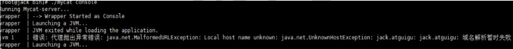
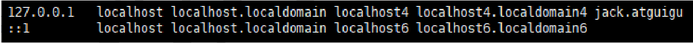
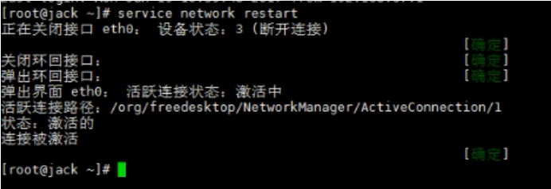

# 第2章_安装启动

## 1.安装

- rpm 方式

  - 需要`.rpm`安装包，按照顺序安装

- yum 方式

  - 需要联网，不需要指定版本

- 解压后即可使用

  - 将`.tar`文件拷贝到`/opt`目录下

  - 解压缩文件拷贝到`/usr/local/`

    ```bash
    [root@myServer1 opt]# tar -zxvf Mycat-server-1.6.7.1-release-20190627191042-linux.tar.gz
    # -r 递归拷贝文件夹
    [root@myServer1 opt]# cp mycat -r /usr/local/
    ```

- 解压后编译安装

**三个配置文件**

- `schema.xml`：定义逻辑库，表、分片节点等内容
- `rule.xml`： 定义分片规则
- `server.xml`：定义用户以及系统相关变量，如端口等

## 2.启动

### 2.1 修改配置文件 server.xml

为了与 MySQL 区分，修改用户信息为`mycat`（默认`root`），如下：

```xml
…
<user name="mycat">
    <property name="password">123456</property>
    <property name="schemas">TESTDB</property>
</user>
…
```

### 2.2 修改配置文件 schema.xml

删除<schema>标签间的表信息，<dataNode>标签只留一个，<dataHost>标签只留一个，<writeHost><readHost>只留一对

```xml
<?xml version="1.0"?>
<!DOCTYPE mycat:schema SYSTEM "schema.dtd">
<mycat:schema xmlns:mycat="http://io.mycat/">
    <!-- 指定默认数据节点 dataNode -->
    <schema name="TESTDB" checkSQLschema="false" sqlMaxLimit="100" dataNode="dn1">
        <!-- 删除了这里的信息 -->
    </schema>
    <!-- 指定 dataHost 和 database，删除其他的 dataNode -->
    <dataNode name="dn1" dataHost="host1" database="testdb" />
    <!-- 修改 dataHost 信息 -->
    <dataHost name="host1" maxCon="1000" minCon="10" balance="0"
              writeType="0" dbType="mysql" dbDriver="native" switchType="1"
              slaveThreshold="100">
        <!-- 心跳检测：测试主机是否存活 -->
        <heartbeat>select user()</heartbeat>
        <!-- 填写主机信息，删除其他写主机 -->
        <writeHost host="hostM1" url="192.168.11.101:3306" user="root"
                   password="root">
            <!-- can have multi read hosts -->
            <readHost host="hostS1" url="192.168.11.104:3306" user="root"
                      password="root" />
        </writeHost>
        <!-- 删除其他注释 -->
    </dataHost>
</mycat:schema>
```

```bash
# vim编辑器下显示行号
:set nu
# 从光标开始删除 n 行
d n d
```

### 2.3 验证数据库访问情况

Mycat 作为数据库中间件要和数据库部署在不同机器上，所以要验证远程访问情况。

```sql
mysql -uroot -proot -h 192.168.11.101 -P 3306
mysql -uroot -proot -h 192.168.11.104 -P 3306
# 如远程访问报错，请建对应用户
grant all privileges on *.* to root@'缺少的host' identified by 'root';
```

### 2.4 启动程序

- `控制台启动`：去`mycat/bin`目录下执行`./mycat console`
- `后台启动`：去`mycat/bin`目录下`./mycat start`

为了能第一时间看到启动日志，方便定位问题，我们选择`控制台启动`。

> Linux 下有 6 个特殊目录，该目录下的命令在任意位置都可执行：
>
> - bin
> - usr/bin
> - usr/local/bin
> - sbin
> - usr/sbin
> - usr/local/sbin

### 2.5 启动时可能出现报错

如果操作系统是 CentOS6.8，可能会出现域名解析失败错误，如下图：



可以按照以下步骤解决：

（1）用 vim 修改 /etc/hosts 文件，在 127.0.0.1 后面增加你的机器名



（2）修改后重新启动网络服务



## 3.登录

### 3.1 登录后台管理窗口

此登录方式用于管理维护 Mycat。

```sql
mysql -umycat -p123456 -P 9066 -h 192.168.11.101
#常用命令如下：
show database;
show @@help;
```

### 3.2 登录数据窗口

此登录方式用于通过 Mycat 查询数据，我们选择这种方式访问 Mycat。

```bash
mysql -umycat -p123456 -P 8066 -h 192.168.11.101
```

```mysql
# 显示的是虚拟的表 TESTDB
mysql> show databases;
+----------+
| DATABASE |
+----------+
| TESTDB   |
+----------+
1 row in set (0.00 sec)

mysql> use TESTDB;
Database changed

# 使用的是真实的表 testdb
mysql> show tables;
+------------------+
| Tables_in_testdb |
+------------------+
| test             |
+------------------+
1 row in set (0.02 sec)
```

