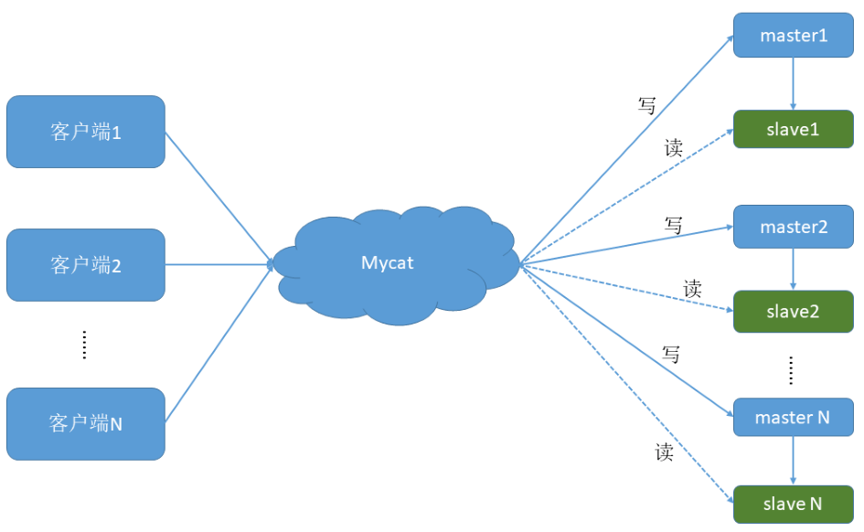
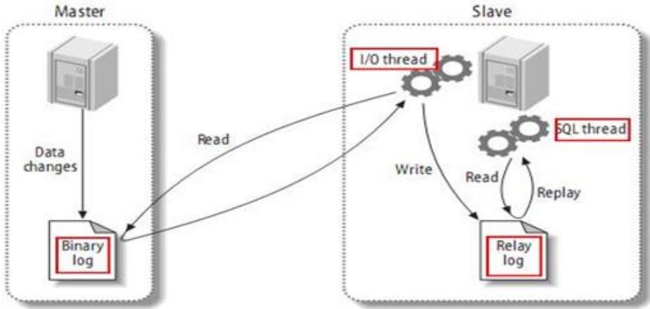
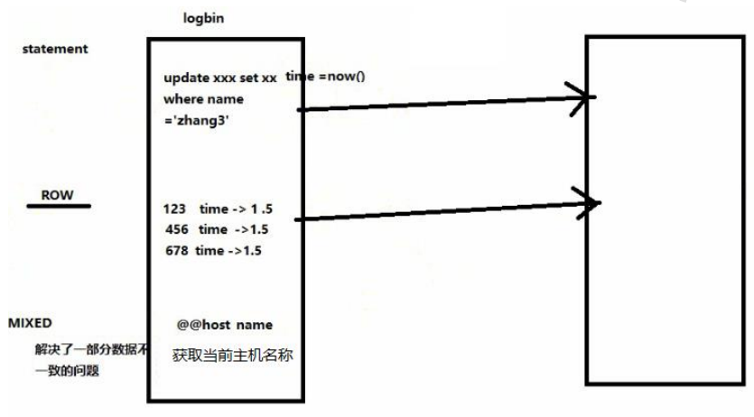
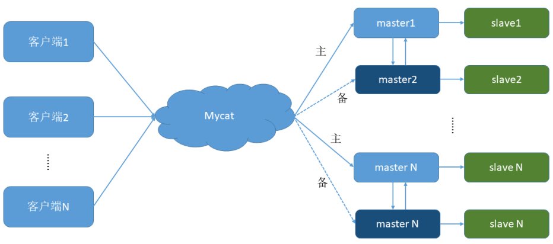

# 第3章_搭建读写分离

我们通过 Mycat 和 MySQL 的`主从复制`配合搭建数据库的读写分离，实现 MySQL 的高可用性。

我们将搭建：一主一从、双主双从两种读写分离模式。

## 1.搭建一主一从

一个主机用于处理所有写请求，一台从机负责所有读请求，架构图如下：



### 1.1 搭建MySQL数据库主从复制

**（1）MySQL 主从复制原理**



**（2）主机配置**

修改配置文件：`vim /etc/my.cnf`。

```bash
#主服务器唯一ID
server-id=1
#启用二进制日志
log-bin=mysql-bin
# 设置不要复制的数据库(可设置多个)
binlog-ignore-db=mysql
binlog-ignore-db=information_schema
#设置需要复制的数据库
binlog-do-db=需要复制的主数据库名字
#设置logbin格式
binlog_format=STATEMENT
```

> binlog 日志三种格式：
>
> 

**（3）从机配置**

```bash
修改配置文件：vim /etc/my.cnf
#从服务器唯一ID
server-id=2
#启用中继日志
relay-log=mysql-relay
```

**（4）主机、从机重启 MySQL 服务**

```bash
[root@myServer1 conf]# systemctl restart mysqld
[root@myServer1 conf]# systemctl status mysqld
● mysqld.service - MySQL Server
   Loaded: loaded (/usr/lib/systemd/system/mysqld.service; enabled; vendor preset: disabled)
   Active: active (running) since 三 2022-05-04 16:34:51 JST; 13s ago
     Docs: man:mysqld(8)
           http://dev.mysql.com/doc/refman/en/using-systemd.html
  Process: 1437 ExecStartPre=/usr/bin/mysqld_pre_systemd (code=exited, status=0/SUCCESS)
 Main PID: 1460 (mysqld)
   Status: "Server is operational"
   CGroup: /system.slice/mysqld.service
           └─1460 /usr/sbin/mysqld

5月 04 16:34:50 myServer1 systemd[1]: Starting MySQL Server...
5月 04 16:34:51 myServer1 systemd[1]: Started MySQL Server.
```

**（5）主机从机都关闭防火墙**

**（6）在主机上建立帐户并授权 slave**

```sql
#在主机MySQL里执行授权命令
GRANT REPLICATION SLAVE ON *.* TO 'slave'@'%' IDENTIFIED BY '123123';
```

```sql
# 查询master的状态
mysql> show master status;
+------------------+----------+--------------+------------------+-------------------+
| File             | Position | Binlog_Do_DB | Binlog_Ignore_DB | Executed_Gtid_Set |
+------------------+----------+--------------+------------------+-------------------+
| youyi-bin.000006 |      156 | testdb       |                  |                   |
+------------------+----------+--------------+------------------+-------------------+
1 row in set (0.00 sec)

#记录下File和Position的值
#执行完此步骤后不要再操作主服务器MySQL，防止主服务器状态值变化
```

**（7）在从机上配置需要复制的主机**

```sql
#复制主机的命令
CHANGE MASTER TO MASTER_HOST='主机的IP地址', MASTER_USER='slave', MASTER_PASSWORD='123123', MASTER_LOG_FILE='mysql-bin.具体数字',MASTER_LOG_POS=具体值;
#启动从服务器复制功能
start slave;
#查看从服务器状态
show slave status\G

#下面两个参数都是Yes，则说明主从配置成功！
Slave_IO_Running: Yes
Slave_SQL_Running: Yes
```

**（8）主机新建库、新建表、insert 记录，从机复制**

**（9）如何停止从服务复制功能**

```sql
stop slave;
```

**（10）如何重新配置主从**

```sql
stop slave;
reset master;
```

### 1.2 修改Mycat的配置文件schema.xml

之前的配置已分配了读写主机，是否已实现读写分离？

验证读写分离

- 在写主机插入：`insert into mytbl values (1,@@hostname);`

  ```sql
  # 主机中
  mysql> select * from mytable;
  +------+-----------+
  | id   | name      |
  +------+-----------+
  |    1 | myServer1 |
  +------+-----------+
  1 row in set (0.01 sec)
  
  # 从机中
  mysql> select * from mytable;
  +------+-----------+
  | id   | name      |
  +------+-----------+
  |    1 | myServer4 |
  +------+-----------+
  1 row in set (0.00 sec)
  ```

- 在 Mycat 里查询：`select * from mytbl;`

  ```sql
  mysql> select * from mytable;
  +------+-----------+
  | id   | name      |
  +------+-----------+
  |    1 | myServer1 |
  +------+-----------+
  1 row in set (0.00 sec)
  ```

因为缺少了一个配置项，所以还没有实现读写分离。

修改<dataHost>的`balance`属性，通过此属性配置读写分离的类型。

> <a id="负载均衡类型" style="color:#333333">负载均衡类型</a>，目前的取值有 4 种：
>
> - `balance="0"`，不开启读写分离机制，所有读操作都发送到当前可用的 writeHost 上
> - `balance="1"`，全部的 readHost 与 stand by writeHost 参与 select 语句的负载均衡，简单的说，当双主双从模式（M1->S1，M2->S2，并且 M1 与 M2 互为主备），正常情况下，M2、S1、S2 都参与 select 语句的负载均衡
> - `balance="2"`，所有读操作都随机的在 writeHost、readhost 上分发
> - `balance="3"`，所有读请求随机的分发到 readhost 执行，writerHost 不负担读压力

为了能看到读写分离的效果，把 balance 设置成 2，会在两个主机间切换查询：

```xml
…
<dataHost name="host1" maxCon="1000" minCon="10" balance="2"
          writeType="0" dbType="mysql" dbDriver="native" switchType="1"
          slaveThreshold="100">
    …
```

### 1.3 启动 Mycat

### 1.4 验证读写分离

```sql
# 在写主机数据库表mytbl中插入带系统变量数据，造成主从数据不一致
INSERT INTO mytbl VALUES(2,@@hostname);
# 在Mycat里查询mytbl表,可以看到查询语句在主从两个主机间切换
mysql> select * from mytable;
+------+-----------+
| id   | name      |
+------+-----------+
|    1 | myServer4 |
+------+-----------+
1 row in set (0.00 sec)

mysql> select * from mytable;
+------+-----------+
| id   | name      |
+------+-----------+
|    1 | myServer1 |
+------+-----------+
1 row in set (0.00 sec)
```

## 2.搭建双主双从

一个主机 m1 用于处理所有写请求，它的从机 s1 和另一台主机 m2 还有它的从机 s2 负责所有读请求。当 m1 主机宕机后，m2 主机负责写请求，m1、m2 互为备机。架构图如下：




|编号 | 角色 | IP 地址 | 机器名|
| ---- | ---- | ---- | ---- |
|1|  Master1 | 192.168.11.101 | myServer1 |
|2 | Slave1| 192.168.11.104 | myServer4 |
|3|  Master2 | 192.168.11.105 | myServer5 |
|4 | Slave2 | 192.168.11.106 | myServer6 |

### 2.1 搭建 MySQL  数据库主从复制 （双主双从）

**（1）双主机配置**

修改 Master1 配置文件`vim /etc/my.cnf`

```bash
#主服务器唯一ID
server-id=1
#启用二进制日志
log-bin=mysql-bin
#设置不要复制的数据库(可设置多个)
binlog-ignore-db=mysql
binlog-ignore-db=information_schema
#设置需要复制的数据库
binlog-do-db=需要复制的主数据库名字
#设置logbin格式
binlog_format=STATEMENT
# ！在作为从数据库的时候，有写入操作也要更新二进制日志文件
log-slave-updates=1
# 以下两个字段是防止主机切换时的冲突问题
# ！表示自增长字段每次递增的量，其默认值是1，取值范围是1 .. 65535
auto-increment-increment=2
# ！表示自增长字段从哪个数开始，他的取值范围是1 .. 65535
auto-increment-offset=1
```

修改 Master2 配置文件`vim /etc/my.cnf`

```bash
#主服务器唯一ID
server-id=3
#启用二进制日志
log-bin=mysql-bin
# 设置不要复制的数据库(可设置多个)
binlog-ignore-db=mysql
binlog-ignore-db=information_schema
#设置需要复制的数据库
binlog-do-db=需要复制的主数据库名字
#设置logbin格式
binlog_format=STATEMENT
# 在作为从数据库的时候，有写入操作也要更新二进制日志文件
log-slave-updates=1
# 以下两个字段是防止主机切换时的冲突问题
#表示自增长字段每次递增的量，其默认值是1，取值范围是1 .. 65535
auto-increment-increment=2
# 表示自增长字段从哪个数开始，他的取值范围是1 .. 65535
auto-increment-offset=2
```

**（2）双从机配置**

修改 Slave1 配置文件`vim /etc/my.cnf`

```bash
#从服务器唯一ID
server-id=2
#启用中继日志
relay-log=mysql-relay
```

修改 Slave2 配置文件`vim /etc/my.cnf`

```bash
#从服务器唯一ID
server-id=4
#启用中继日志
relay-log=mysql-relay
```

**（3）双主机、双从机重启 mysql 服务**

**（4）主机从机都关闭防火墙**

**（5）在两台主机上建立帐户并授权 slave**

```sql
#在主机MySQL里执行授权命令
GRANT REPLICATION SLAVE ON *.* TO 'slave'@'%' IDENTIFIED BY '123123';
# 查询Master1的状态
show master status;
# 查询Master2的状态
show master status;
#分别记录下File和Position的值
#执行完此步骤后不要再操作主服务器MYSQL，防止主服务器状态值变化
```

**（6）在从机上配置需要复制的主机**

Slava1 复制 Master1，Slava2 复制 Master2

```sql
#复制主机的命令
CHANGE MASTER TO MASTER_HOST='主机的IP地址', MASTER_USER='slave', MASTER_PASSWORD='123123', MASTER_LOG_FILE='mysql-bin.具体数字', MASTER_LOG_POS=具体值;
#启动两台从服务器复制功能
start slave;
#查看从服务器状态
show slave status\G;
#下面两个参数都是Yes，则说明主从配置成功！
Slave_IO_Running: Yes
Slave_SQL_Running: Yes
```

**（7）两个主机互相复制**

Master2 复制 Master1，Master1 复制 Master2

```sql
# Master1的复制命令
CHANGE MASTER TO MASTER_HOST='192.168.11.105', MASTER_USER='slave1', MASTER_PASSWORD='123456', MASTER_LOG_FILE='mysql-bin.000001', MASTER_LOG_POS=156;
# Master2的复制命令
CHANGE MASTER TO MASTER_HOST='192.168.11.101', MASTER_USER='slave1', MASTER_PASSWORD='123456', MASTER_LOG_FILE='youyi-bin.000008', MASTER_LOG_POS=156;
#启动两台主服务器复制功能
start slave;
#查看从服务器状态
show slave status\G;
#下面两个参数都是Yes，则说明主从配置成功！
Slave_IO_Running: Yes
Slave_SQL_Running: Yes
```

遇到如下错误时，执行`reset slave`命令删除之前创建的 relay log 日志即可。

```sql
mysql> start slave;
ERROR 1872 (HY000): Slave failed to initialize relay log info structure from the repository
```

**（8）Master1 主机新建库、新建表、insert 记录，Master2 和从机复制**

**（9）如何停止从服务复制功能**

```sql
stop slave;
```

**（10）如何重新配置主从**

```sql
stop slave;
reset master;
```

### 2.2 修改Mycat的配置文件schema.xml

```bash
vim /usr/local/mycal/conf/schema.xml
```

修改<dataHost>的 balance 属性，通过此属性配置[读写分离的类型](##负载均衡类型)。这里为了双主双从读写分离 balance 设置为 1。

```xml
<?xml version="1.0"?>
<!DOCTYPE mycat:schema SYSTEM "schema.dtd">
<mycat:schema xmlns:mycat="http://io.mycat/">

        <schema name="TESTDB" checkSQLschema="false" sqlMaxLimit="100" dataNode="dn1">
        </schema>
        <dataNode name="dn1" dataHost="host1" database="testdb" />
        <dataHost name="host1" maxCon="1000" minCon="10" balance="1"
                          writeType="0" dbType="mysql" dbDriver="native" switchType="1"  slaveThreshold="100">
                <heartbeat>select user()</heartbeat>
                <!-- can have multi write hosts -->
                <writeHost host="hostM1" url="192.168.11.101:3306" user="root"
                                   password="root">
                        <!-- can have multi read hosts -->
                        <readHost host="hostS1" url="192.168.11.104:3306" user="root" password="root" />
                </writeHost>
                <writeHost host="hostM2" url="192.168.11.105:3306" user="root"
                                   password="root">
                        <!-- can have multi read hosts -->
                        <readHost host="hostS2" url="192.168.11.106:3306" user="root" password="root" />
                </writeHost>
        </dataHost>
</mycat:schema>
```

```bash
balance="1": 全部的readHost与stand by writeHost参与select语句的负载均衡。
writeType="0": 所有写操作发送到配置的第一个writeHost，第一个挂了切到还生存的第二个
writeType="1"，所有写操作都随机的发送到配置的 writeHost，1.5 以后废弃不推荐
writeHost，重新启动后以切换后的为准，切换记录在配置文件中:dnindex.properties
switchType="1": 1 默认值，自动切换
			    -1 表示不自动切换
    			2 基于 MySQL 主从同步的状态决定是否切换
```

### 2.3 启动 Mycat

### 2.4 验证读写分离

```sql
#在写主机Master1数据库表mytbl中插入带系统变量数据，造成主从数据不一致
INSERT INTO mytbl VALUES(3,@@hostname);
#在Mycat里查询mytbl表,可以看到查询语句在Master2（host81）、Slava1（host80）、Slava2（host82）主从三个主机间切换
[root@myServer1 conf]# mysql -umycat -p123456 -P 8066 -h 192.168.11.101

mysql> select * from mytbl;
+------+-----------+
| id   | name      |
+------+-----------+
|    1 | myServer5 |
+------+-----------+
1 row in set (0.03 sec)

mysql> select * from mytbl;
+------+-----------+
| id   | name      |
+------+-----------+
|    1 | myServer6 |
+------+-----------+
1 row in set (0.01 sec)

mysql> select * from mytbl;
+------+-----------+
| id   | name      |
+------+-----------+
|    1 | myServer4 |
+------+-----------+
1 row in set (0.01 sec)
```

### 2.5 抗风险能力

```sql
#停止数据库Master1
[root@myServer1 ~]# systemctl stop mysqld

#在Mycat里插入数据依然成功，Master2自动切换为写主机
mysql> INSERT INTO mytbl VALUES(3,@@hostname);
Query OK, 1 row affected, 1 warning (0.05 sec)

#启动数据库Master1
[root@myServer1 ~]# systemctl start mysqld

#在Mycat里查询mytbl表,可以看到查询语句在Master1（myServer1）、Slava1（myServer4）、Slava2（myServer6）主从三个主机间切换
mysql> select * from mytbl;
+------+-----------+
| id   | name      |
+------+-----------+
|    1 | myServer1 |
|    3 | myServer1 |
+------+-----------+
2 rows in set (0.00 sec)

mysql> select * from mytbl;
+------+-----------+
| id   | name      |
+------+-----------+
|    1 | myServer4 |
|    3 | myServer4 |
+------+-----------+
2 rows in set (0.00 sec)

mysql> select * from mytbl;
+------+-----------+
| id   | name      |
+------+-----------+
|    1 | myServer6 |
|    3 | myServer6 |
+------+-----------+
2 rows in set (0.00 sec)
```

Master1、Master2 互做备机，负责写的主机宕机，备机切换负责写操作，保证数据库读写分离高可用性。