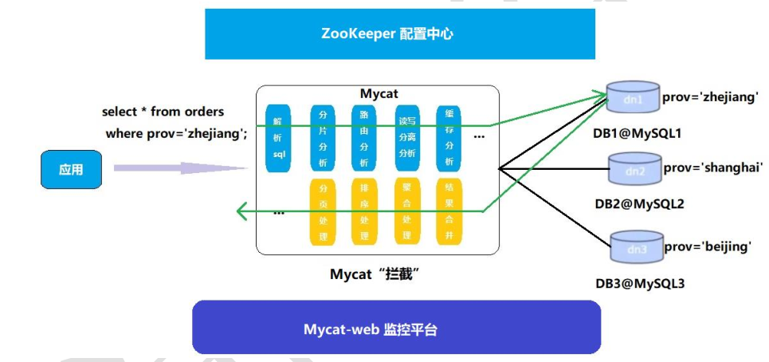
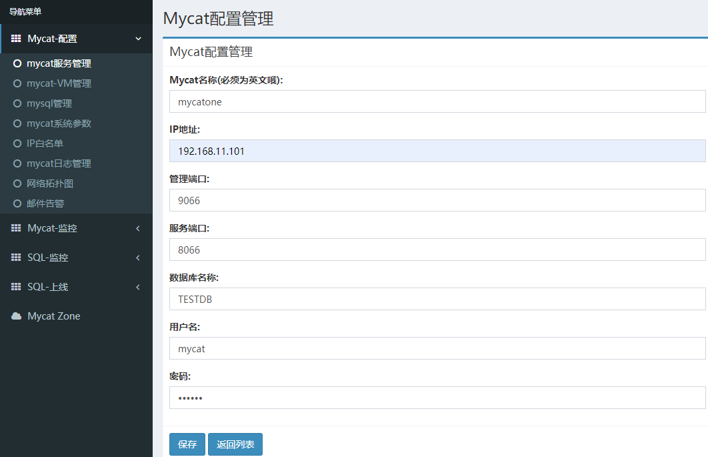
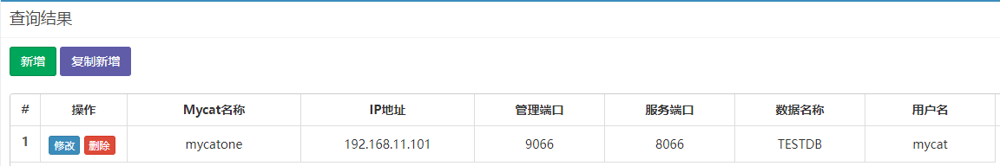
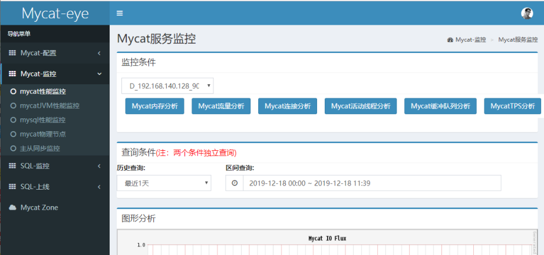

# 第8章_Mycat监控工具

## 1.Mycat-web简介

Mycat-web 是 Mycat 可视化运维的管理和监控平台，弥补了 Mycat 在监控上的空白。帮 Mycat 分担统计任务和配置管理任务。Mycat-web 引入了 ZooKeeper 作为配置中心，可以管理多个节点。

Mycat-web 主要管理和监控 Mycat 的流量、连接、活动线程和内存等，具备 IP 白名单、邮件告警等模块，还可以统计 SQL 并分析慢 SQL 和高频 SQL 等。为优化 SQL 提供依据。



## 2.Mycat-web配置使用

### 2.1 ZooKeeper安装

部署在 192.168.11.101 上，安装步骤如下：

```bash
#1下载安装包http://zookeeper.apache.org/
#2 安装包拷贝到Linux系统/opt目录下，并解压
tar -zxvf zookeeper-3.4.11.tar.gz
#3 进入ZooKeeper解压后的配置目录（conf），复制配置文件并改名
cp zoo_sample.cfg zoo.cfg
#4 进入ZooKeeper的命令目录（bin），运行启动命令
./zkServer.sh start
#5 ZooKeeper服务端口为2181，查看服务已经启动
netstat -ant | grep 2181
```

### 2.2 Mycat-web安装

部署在 192.168.11.105 上，安装步骤如下：

```bash
#1下载安装包http://www.mycat.io/
#2 安装包拷贝到Linux系统/opt目录下，并解压
tar -zxvf Mycat-web-1.0-SNAPSHOT-20170102153329-linux.tar.gz
#3 拷贝mycat-web文件夹到/usr/local目录下
cp -r mycat-web /usr/local
#4 进入mycat-web的目录下运行启动命令
cd /usr/local/mycat-web/
# &表示后台启动
./start.sh &
#5 Mycat-web服务端口为8082，查看服务已经启动
netstat -ant | grep 8082
#6 通过地址访问服务
http://192.168.11.105:8082/mycat/
```

### 2.3 Mycat-web配置

安装步骤如下：

```bash
#1 先在注册中心配置ZooKeeper地址，配置后刷新页面，可见
ip: 192.168.11.101
port:2181
#2 新增Mycat监控实例
```





## 3.Mycat性能监控指标

在 Mycat-web 上可以进行 Mycat 性能监控，例如：内存分享、流量分析、连接分析、活动线程分析等等。

